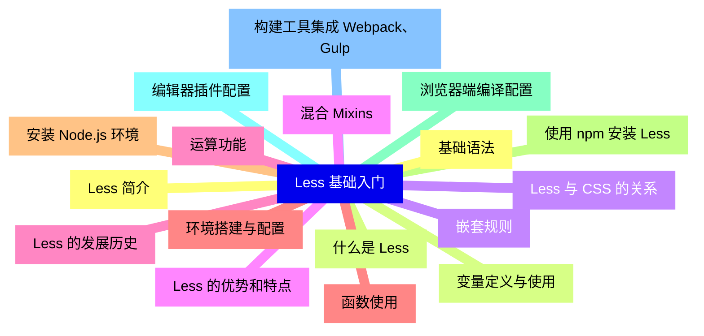
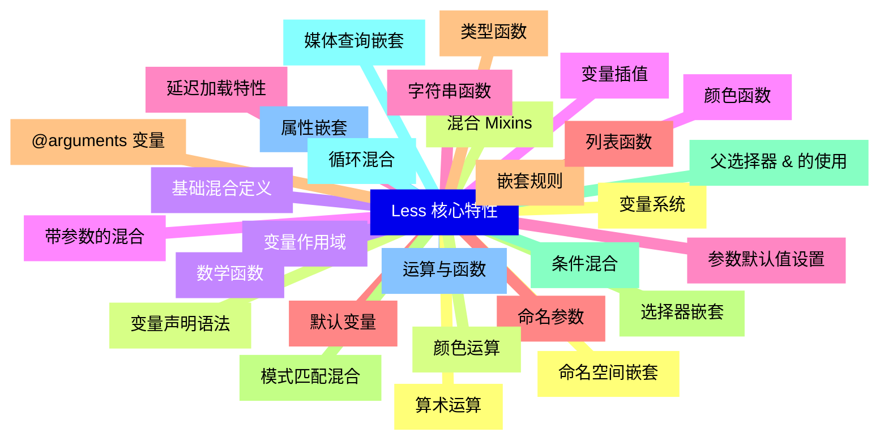
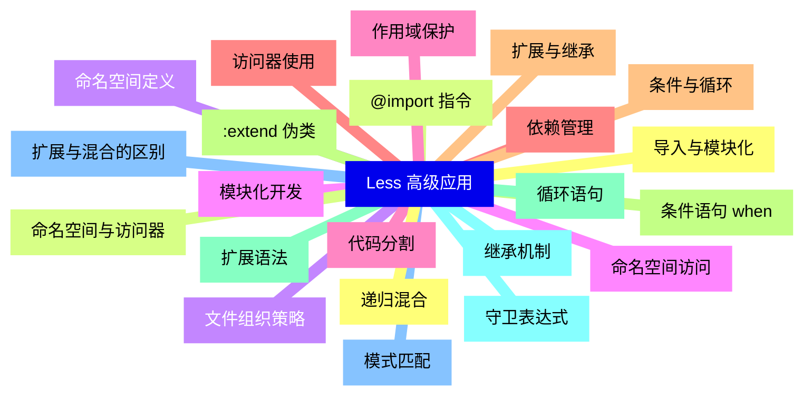
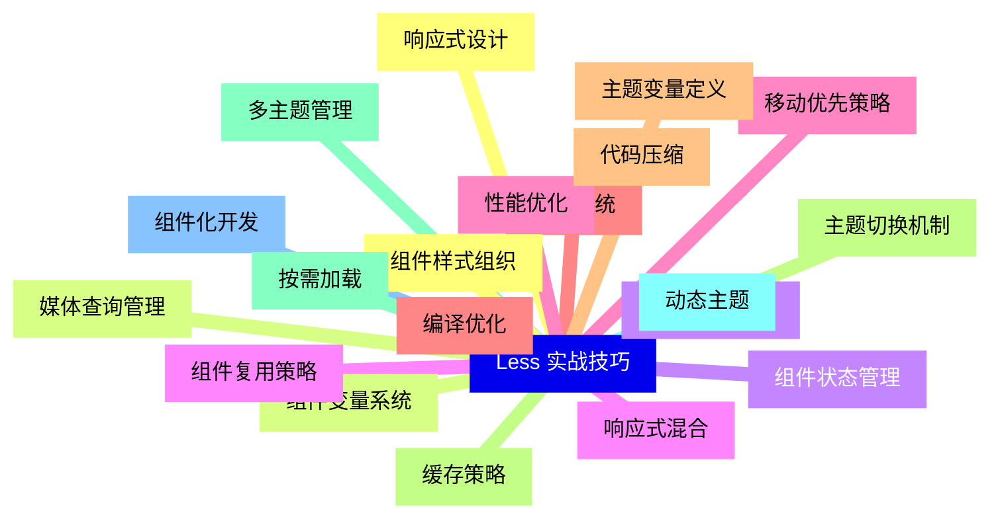
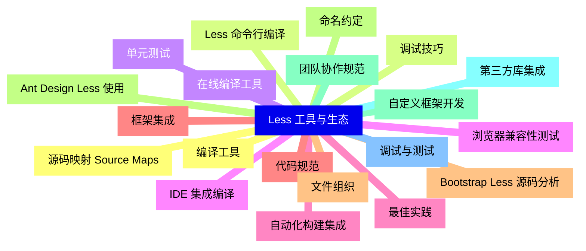
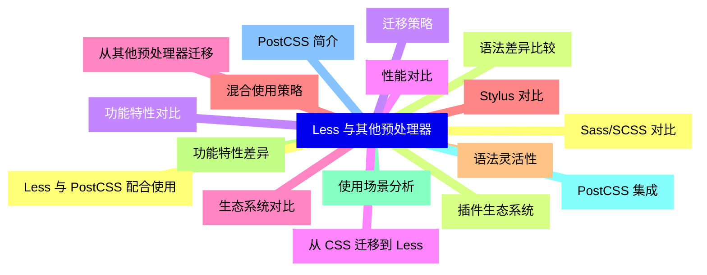
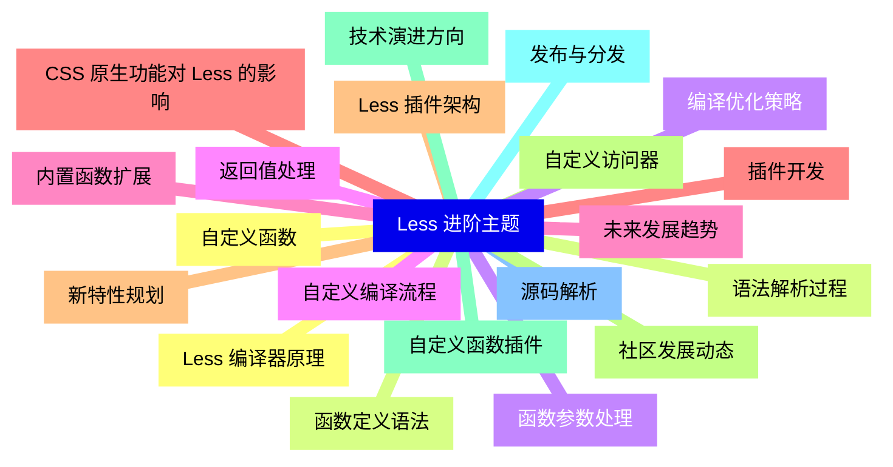


### 1 [Less 基础入门](#1)
#### 1.1 [Less 简介](#1)
#### 1.2 [什么是 Less](#1)
#### 1.3 [Less 与 CSS 的关系](#1)
#### 1.4 [Less 的优势和特点](#1)
#### 1.5 [Less 的发展历史](#1)
#### 1.6 [环境搭建与配置](#1)
#### 1.7 [安装 Node.js 环境](#1)
#### 1.8 [使用 npm 安装 Less](#1)
#### 1.9 [浏览器端编译配置](#1)
#### 1.10 [编辑器插件配置](#1)
#### 1.11 [构建工具集成 Webpack、Gulp](#1)
#### 1.12 [基础语法](#1)
#### 1.13 [变量定义与使用](#1)
#### 1.14 [嵌套规则](#1)
#### 1.15 [混合 Mixins](#1)
#### 1.16 [运算功能](#1)
#### 1.17 [函数使用](#1)
### 2 [Less 核心特性](#2)
#### 2.1 [变量系统](#2)
#### 2.2 [变量声明语法](#2)
#### 2.3 [变量作用域](#2)
#### 2.4 [变量插值](#2)
#### 2.5 [延迟加载特性](#2)
#### 2.6 [默认变量](#2)
#### 2.7 [嵌套规则](#2)
#### 2.8 [选择器嵌套](#2)
#### 2.9 [父选择器 & 的使用](#2)
#### 2.10 [媒体查询嵌套](#2)
#### 2.11 [属性嵌套](#2)
#### 2.12 [命名空间嵌套](#2)
#### 2.13 [混合 Mixins](#2)
#### 2.14 [基础混合定义](#2)
#### 2.15 [带参数的混合](#2)
#### 2.16 [参数默认值设置](#2)
#### 2.17 [命名参数](#2)
#### 2.18 [@arguments 变量](#2)
#### 2.19 [模式匹配混合](#2)
#### 2.20 [条件混合](#2)
#### 2.21 [循环混合](#2)
#### 2.22 [运算与函数](#2)
#### 2.23 [算术运算](#2)
#### 2.24 [颜色运算](#2)
#### 2.25 [数学函数](#2)
#### 2.26 [颜色函数](#2)
#### 2.27 [字符串函数](#2)
#### 2.28 [列表函数](#2)
#### 2.29 [类型函数](#2)
### 3 [Less 高级应用](#3)
#### 3.1 [导入与模块化](#3)
#### 3.2 [@import 指令](#3)
#### 3.3 [文件组织策略](#3)
#### 3.4 [模块化开发](#3)
#### 3.5 [代码分割](#3)
#### 3.6 [依赖管理](#3)
#### 3.7 [条件与循环](#3)
#### 3.8 [条件语句 when](#3)
#### 3.9 [循环语句](#3)
#### 3.10 [守卫表达式](#3)
#### 3.11 [模式匹配](#3)
#### 3.12 [递归混合](#3)
#### 3.13 [命名空间与访问器](#3)
#### 3.14 [命名空间定义](#3)
#### 3.15 [命名空间访问](#3)
#### 3.16 [作用域保护](#3)
#### 3.17 [访问器使用](#3)
#### 3.18 [扩展与继承](#3)
#### 3.19 [:extend   伪类](#3)
#### 3.20 [扩展语法](#3)
#### 3.21 [继承机制](#3)
#### 3.22 [扩展与混合的区别](#3)
### 4 [Less 实战技巧](#4)
#### 4.1 [响应式设计](#4)
#### 4.2 [媒体查询管理](#4)
#### 4.3 [断点变量定义](#4)
#### 4.4 [响应式混合](#4)
#### 4.5 [移动优先策略](#4)
#### 4.6 [主题系统](#4)
#### 4.7 [主题变量定义](#4)
#### 4.8 [主题切换机制](#4)
#### 4.9 [多主题管理](#4)
#### 4.10 [动态主题](#4)
#### 4.11 [组件化开发](#4)
#### 4.12 [组件样式组织](#4)
#### 4.13 [组件变量系统](#4)
#### 4.14 [组件状态管理](#4)
#### 4.15 [组件复用策略](#4)
#### 4.16 [性能优化](#4)
#### 4.17 [编译优化](#4)
#### 4.18 [代码压缩](#4)
#### 4.19 [缓存策略](#4)
#### 4.20 [按需加载](#4)
### 5 [Less 工具与生态](#5)
#### 5.1 [编译工具](#5)
#### 5.2 [Less 命令行编译](#5)
#### 5.3 [在线编译工具](#5)
#### 5.4 [IDE 集成编译](#5)
#### 5.5 [自动化构建集成](#5)
#### 5.6 [框架集成](#5)
#### 5.7 [Bootstrap Less 源码分析](#5)
#### 5.8 [Ant Design Less 使用](#5)
#### 5.9 [自定义框架开发](#5)
#### 5.10 [第三方库集成](#5)
#### 5.11 [调试与测试](#5)
#### 5.12 [源码映射 Source Maps](#5)
#### 5.13 [调试技巧](#5)
#### 5.14 [单元测试](#5)
#### 5.15 [浏览器兼容性测试](#5)
#### 5.16 [最佳实践](#5)
#### 5.17 [代码规范](#5)
#### 5.18 [文件组织](#5)
#### 5.19 [命名约定](#5)
#### 5.20 [团队协作规范](#5)
### 6 [Less 与其他预处理器](#6)
#### 6.1 [Sass/SCSS 对比](#6)
#### 6.2 [语法差异比较](#6)
#### 6.3 [功能特性对比](#6)
#### 6.4 [性能对比](#6)
#### 6.5 [生态系统对比](#6)
#### 6.6 [Stylus 对比](#6)
#### 6.7 [语法灵活性](#6)
#### 6.8 [功能特性差异](#6)
#### 6.9 [使用场景分析](#6)
#### 6.10 [PostCSS 集成](#6)
#### 6.11 [PostCSS 简介](#6)
#### 6.12 [Less 与 PostCSS 配合使用](#6)
#### 6.13 [插件生态系统](#6)
#### 6.14 [迁移策略](#6)
#### 6.15 [从 CSS 迁移到 Less](#6)
#### 6.16 [从其他预处理器迁移](#6)
#### 6.17 [混合使用策略](#6)
### 7 [Less 进阶主题](#7)
#### 7.1 [自定义函数](#7)
#### 7.2 [函数定义语法](#7)
#### 7.3 [函数参数处理](#7)
#### 7.4 [返回值处理](#7)
#### 7.5 [内置函数扩展](#7)
#### 7.6 [插件开发](#7)
#### 7.7 [Less 插件架构](#7)
#### 7.8 [自定义访问器](#7)
#### 7.9 [自定义函数插件](#7)
#### 7.10 [发布与分发](#7)
#### 7.11 [源码解析](#7)
#### 7.12 [Less 编译器原理](#7)
#### 7.13 [语法解析过程](#7)
#### 7.14 [编译优化策略](#7)
#### 7.15 [自定义编译流程](#7)
#### 7.16 [未来发展趋势](#7)
#### 7.17 [CSS 原生功能对 Less 的影响](#7)
#### 7.18 [新特性规划](#7)
#### 7.19 [社区发展动态](#7)
#### 7.20 [技术演进方向](#7)




### 1 Less 基础入门

---
### 1 Less 基础入门
___
#### 1.1 Less 简介
___
#### 1.2 什么是 Less
___
#### 1.3 Less 与 CSS 的关系
___
#### 1.4 Less 的优势和特点
___
#### 1.5 Less 的发展历史
___
#### 1.6 环境搭建与配置
___
#### 1.7 安装 Node.js 环境
___
#### 1.8 使用 npm 安装 Less
___
#### 1.9 浏览器端编译配置
___
#### 1.10 编辑器插件配置
___
#### 1.11 构建工具集成 Webpack、Gulp
___
#### 1.12 基础语法
___
#### 1.13 变量定义与使用
___
#### 1.14 嵌套规则
___
#### 1.15 混合 Mixins
___
#### 1.16 运算功能
___
#### 1.17 函数使用
### 2 Less 核心特性

---
### 2 Less 核心特性
___
#### 2.1 变量系统
___
#### 2.2 变量声明语法
___
#### 2.3 变量作用域
___
#### 2.4 变量插值
___
#### 2.5 延迟加载特性
___
#### 2.6 默认变量
___
#### 2.7 嵌套规则
___
#### 2.8 选择器嵌套
___
#### 2.9 父选择器 & 的使用
___
#### 2.10 媒体查询嵌套
___
#### 2.11 属性嵌套
___
#### 2.12 命名空间嵌套
___
#### 2.13 混合 Mixins
___
#### 2.14 基础混合定义
___
#### 2.15 带参数的混合
___
#### 2.16 参数默认值设置
___
#### 2.17 命名参数
___
#### 2.18 @arguments 变量
___
#### 2.19 模式匹配混合
___
#### 2.20 条件混合
___
#### 2.21 循环混合
___
#### 2.22 运算与函数
___
#### 2.23 算术运算
___
#### 2.24 颜色运算
___
#### 2.25 数学函数
___
#### 2.26 颜色函数
___
#### 2.27 字符串函数
___
#### 2.28 列表函数
___
#### 2.29 类型函数
### 3 Less 高级应用

---
### 3 Less 高级应用
___
#### 3.1 导入与模块化
___
#### 3.2 @import 指令
___
#### 3.3 文件组织策略
___
#### 3.4 模块化开发
___
#### 3.5 代码分割
___
#### 3.6 依赖管理
___
#### 3.7 条件与循环
___
#### 3.8 条件语句 when
___
#### 3.9 循环语句
___
#### 3.10 守卫表达式
___
#### 3.11 模式匹配
___
#### 3.12 递归混合
___
#### 3.13 命名空间与访问器
___
#### 3.14 命名空间定义
___
#### 3.15 命名空间访问
___
#### 3.16 作用域保护
___
#### 3.17 访问器使用
___
#### 3.18 扩展与继承
___
#### 3.19 :extend   伪类
___
#### 3.20 扩展语法
___
#### 3.21 继承机制
___
#### 3.22 扩展与混合的区别
### 4 Less 实战技巧

---
### 4 Less 实战技巧
___
#### 4.1 响应式设计
___
#### 4.2 媒体查询管理
___
#### 4.3 断点变量定义
___
#### 4.4 响应式混合
___
#### 4.5 移动优先策略
___
#### 4.6 主题系统
___
#### 4.7 主题变量定义
___
#### 4.8 主题切换机制
___
#### 4.9 多主题管理
___
#### 4.10 动态主题
___
#### 4.11 组件化开发
___
#### 4.12 组件样式组织
___
#### 4.13 组件变量系统
___
#### 4.14 组件状态管理
___
#### 4.15 组件复用策略
___
#### 4.16 性能优化
___
#### 4.17 编译优化
___
#### 4.18 代码压缩
___
#### 4.19 缓存策略
___
#### 4.20 按需加载
### 5 Less 工具与生态

---
### 5 Less 工具与生态
___
#### 5.1 编译工具
___
#### 5.2 Less 命令行编译
___
#### 5.3 在线编译工具
___
#### 5.4 IDE 集成编译
___
#### 5.5 自动化构建集成
___
#### 5.6 框架集成
___
#### 5.7 Bootstrap Less 源码分析
___
#### 5.8 Ant Design Less 使用
___
#### 5.9 自定义框架开发
___
#### 5.10 第三方库集成
___
#### 5.11 调试与测试
___
#### 5.12 源码映射 Source Maps
___
#### 5.13 调试技巧
___
#### 5.14 单元测试
___
#### 5.15 浏览器兼容性测试
___
#### 5.16 最佳实践
___
#### 5.17 代码规范
___
#### 5.18 文件组织
___
#### 5.19 命名约定
___
#### 5.20 团队协作规范
### 6 Less 与其他预处理器

---
### 6 Less 与其他预处理器
___
#### 6.1 Sass/SCSS 对比
___
#### 6.2 语法差异比较
___
#### 6.3 功能特性对比
___
#### 6.4 性能对比
___
#### 6.5 生态系统对比
___
#### 6.6 Stylus 对比
___
#### 6.7 语法灵活性
___
#### 6.8 功能特性差异
___
#### 6.9 使用场景分析
___
#### 6.10 PostCSS 集成
___
#### 6.11 PostCSS 简介
___
#### 6.12 Less 与 PostCSS 配合使用
___
#### 6.13 插件生态系统
___
#### 6.14 迁移策略
___
#### 6.15 从 CSS 迁移到 Less
___
#### 6.16 从其他预处理器迁移
___
#### 6.17 混合使用策略
### 7 Less 进阶主题

---
### 7 Less 进阶主题
___
#### 7.1 自定义函数
___
#### 7.2 函数定义语法
___
#### 7.3 函数参数处理
___
#### 7.4 返回值处理
___
#### 7.5 内置函数扩展
___
#### 7.6 插件开发
___
#### 7.7 Less 插件架构
___
#### 7.8 自定义访问器
___
#### 7.9 自定义函数插件
___
#### 7.10 发布与分发
___
#### 7.11 源码解析
___
#### 7.12 Less 编译器原理
___
#### 7.13 语法解析过程
___
#### 7.14 编译优化策略
___
#### 7.15 自定义编译流程
___
#### 7.16 未来发展趋势
___
#### 7.17 CSS 原生功能对 Less 的影响
___
#### 7.18 新特性规划
___
#### 7.19 社区发展动态
___
#### 7.20 技术演进方向


### 1 Less 基础入门{#1}

{}

<--->
{}
{}
{}
{}
{}
{}
{}
{}
{}
{}
{}
{}
{}
{}
{}
{}
{}
{}
{}
{}
{}
{}
{}
{}
{}
{}
{}
{}
{}
{}
{}
{}
{}
{}
{}

### 2 Less 核心特性{#2}

{}
{}
{}
{}
{}
{}
{}
{}
{}
{}
{}
{}
{}
{}
{}
{}
{}
{}
{}
{}
{}
{}
{}
{}
{}
{}
{}
{}
{}
{}
{}
{}
{}
{}
{}
{}
{}
{}
{}
{}
{}
{}
{}
{}
{}
{}
{}
{}
{}
{}
{}
{}
{}
{}
{}
{}
{}
{}
{}
<--->

{}

### 3 Less 高级应用{#3}

{}

<--->
{}
{}
{}
{}
{}
{}
{}
{}
{}
{}
{}
{}
{}
{}
{}
{}
{}
{}
{}
{}
{}
{}
{}
{}
{}
{}
{}
{}
{}
{}
{}
{}
{}
{}
{}
{}
{}
{}
{}
{}
{}
{}
{}
{}
{}

### 4 Less 实战技巧{#4}

{}
{}
{}
{}
{}
{}
{}
{}
{}
{}
{}
{}
{}
{}
{}
{}
{}
{}
{}
{}
{}
{}
{}
{}
{}
{}
{}
{}
{}
{}
{}
{}
{}
{}
{}
{}
{}
{}
{}
{}
{}
<--->

{}

### 5 Less 工具与生态{#5}

{}

<--->
{}
{}
{}
{}
{}
{}
{}
{}
{}
{}
{}
{}
{}
{}
{}
{}
{}
{}
{}
{}
{}
{}
{}
{}
{}
{}
{}
{}
{}
{}
{}
{}
{}
{}
{}
{}
{}
{}
{}
{}
{}

### 6 Less 与其他预处理器{#6}

{}
{}
{}
{}
{}
{}
{}
{}
{}
{}
{}
{}
{}
{}
{}
{}
{}
{}
{}
{}
{}
{}
{}
{}
{}
{}
{}
{}
{}
{}
{}
{}
{}
{}
{}
<--->

{}

### 7 Less 进阶主题{#7}

{}

<--->
{}
{}
{}
{}
{}
{}
{}
{}
{}
{}
{}
{}
{}
{}
{}
{}
{}
{}
{}
{}
{}
{}
{}
{}
{}
{}
{}
{}
{}
{}
{}
{}
{}
{}
{}
{}
{}
{}
{}
{}
{}
