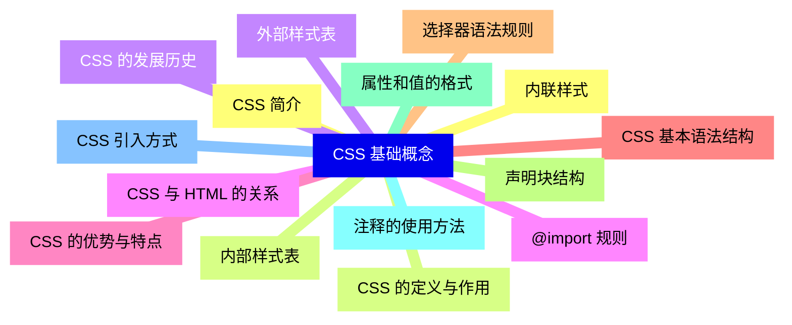
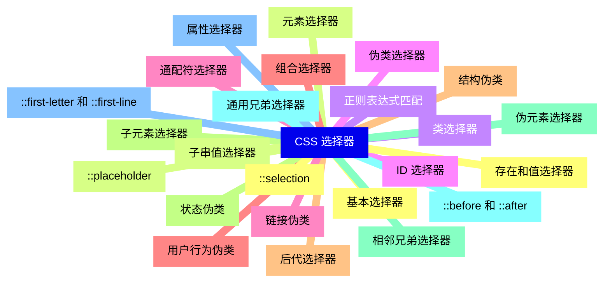
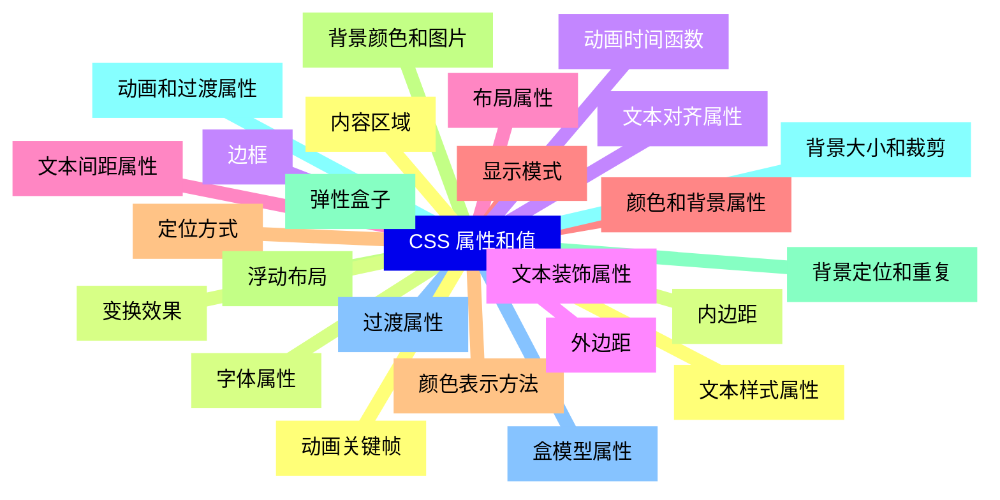
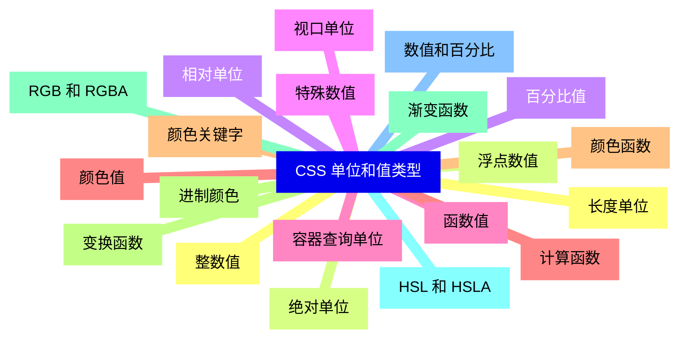
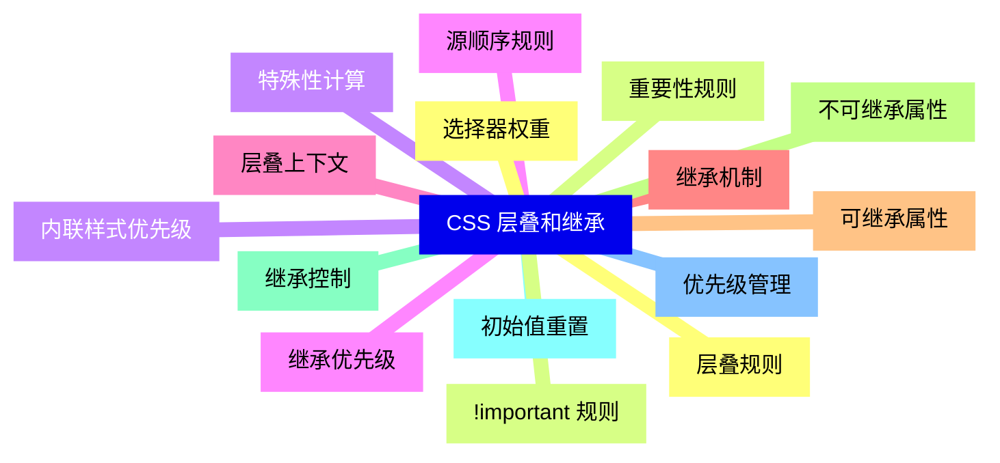
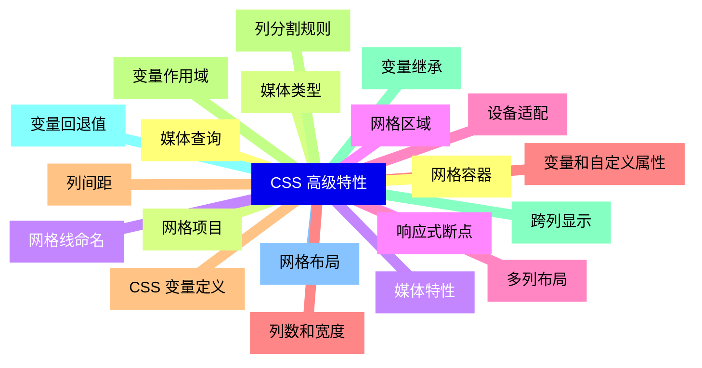
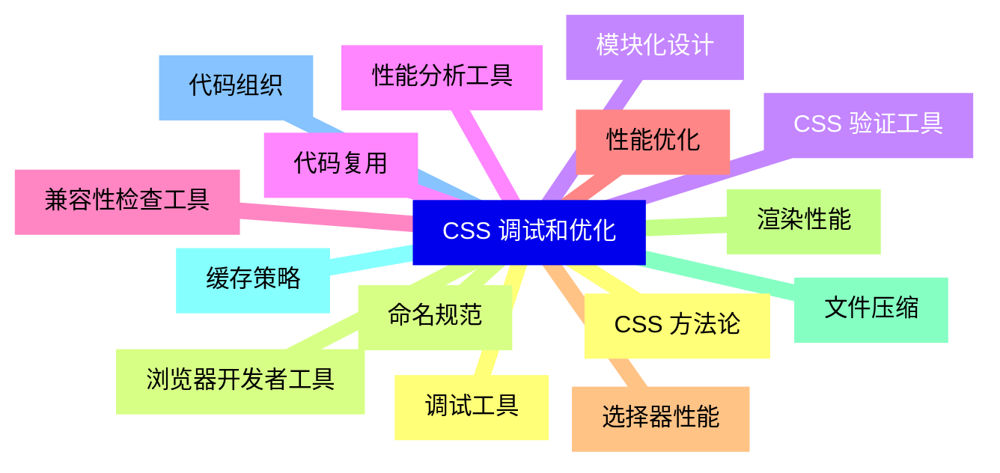
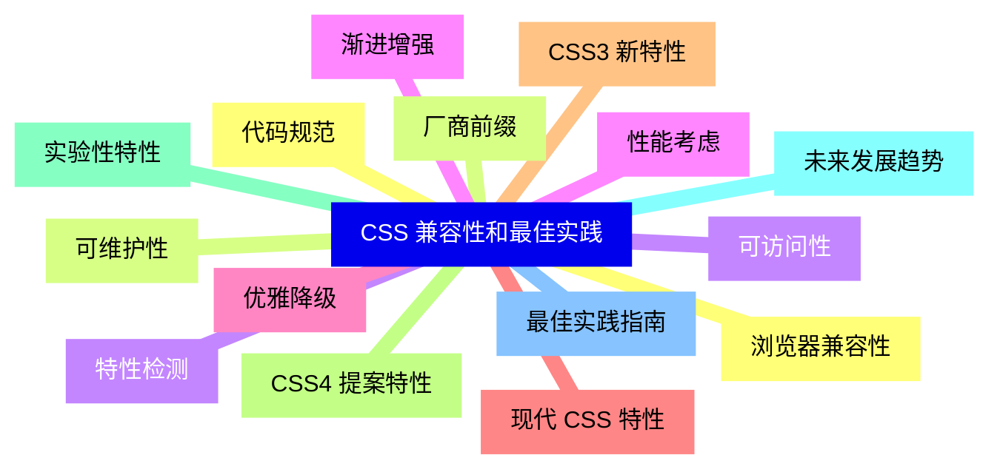


### 1 [CSS 基础概念](#1)
#### 1.1 [CSS 简介](#1)
#### 1.2 [CSS 的定义与作用](#1)
#### 1.3 [CSS 的发展历史](#1)
#### 1.4 [CSS 与 HTML 的关系](#1)
#### 1.5 [CSS 的优势与特点](#1)
#### 1.6 [CSS 基本语法结构](#1)
#### 1.7 [选择器语法规则](#1)
#### 1.8 [声明块结构](#1)
#### 1.9 [属性和值的格式](#1)
#### 1.10 [注释的使用方法](#1)
#### 1.11 [CSS 引入方式](#1)
#### 1.12 [内联样式](#1)
#### 1.13 [内部样式表](#1)
#### 1.14 [外部样式表](#1)
#### 1.15 [@import 规则](#1)
### 2 [CSS 选择器](#2)
#### 2.1 [基本选择器](#2)
#### 2.2 [元素选择器](#2)
#### 2.3 [类选择器](#2)
#### 2.4 [ID 选择器](#2)
#### 2.5 [通配符选择器](#2)
#### 2.6 [组合选择器](#2)
#### 2.7 [后代选择器](#2)
#### 2.8 [子元素选择器](#2)
#### 2.9 [相邻兄弟选择器](#2)
#### 2.10 [通用兄弟选择器](#2)
#### 2.11 [属性选择器](#2)
#### 2.12 [存在和值选择器](#2)
#### 2.13 [子串值选择器](#2)
#### 2.14 [正则表达式匹配](#2)
#### 2.15 [伪类选择器](#2)
#### 2.16 [链接伪类](#2)
#### 2.17 [用户行为伪类](#2)
#### 2.18 [结构伪类](#2)
#### 2.19 [状态伪类](#2)
#### 2.20 [伪元素选择器](#2)
#### 2.21 [::before 和 ::after](#2)
#### 2.22 [::first-letter 和 ::first-line](#2)
#### 2.23 [::selection](#2)
#### 2.24 [::placeholder](#2)
### 3 [CSS 属性和值](#3)
#### 3.1 [文本样式属性](#3)
#### 3.2 [字体属性](#3)
#### 3.3 [文本对齐属性](#3)
#### 3.4 [文本装饰属性](#3)
#### 3.5 [文本间距属性](#3)
#### 3.6 [颜色和背景属性](#3)
#### 3.7 [颜色表示方法](#3)
#### 3.8 [背景颜色和图片](#3)
#### 3.9 [背景定位和重复](#3)
#### 3.10 [背景大小和裁剪](#3)
#### 3.11 [盒模型属性](#3)
#### 3.12 [内容区域](#3)
#### 3.13 [内边距](#3)
#### 3.14 [边框](#3)
#### 3.15 [外边距](#3)
#### 3.16 [布局属性](#3)
#### 3.17 [显示模式](#3)
#### 3.18 [定位方式](#3)
#### 3.19 [浮动布局](#3)
#### 3.20 [弹性盒子](#3)
#### 3.21 [动画和过渡属性](#3)
#### 3.22 [过渡属性](#3)
#### 3.23 [动画关键帧](#3)
#### 3.24 [变换效果](#3)
#### 3.25 [动画时间函数](#3)
### 4 [CSS 单位和值类型](#4)
#### 4.1 [长度单位](#4)
#### 4.2 [绝对单位](#4)
#### 4.3 [相对单位](#4)
#### 4.4 [视口单位](#4)
#### 4.5 [容器查询单位](#4)
#### 4.6 [颜色值](#4)
#### 4.7 [颜色关键字](#4)
#### 4.8 [进制颜色](#4)
#### 4.9 [RGB 和 RGBA](#4)
#### 4.10 [HSL 和 HSLA](#4)
#### 4.11 [数值和百分比](#4)
#### 4.12 [整数值](#4)
#### 4.13 [浮点数值](#4)
#### 4.14 [百分比值](#4)
#### 4.15 [特殊数值](#4)
#### 4.16 [函数值](#4)
#### 4.17 [计算函数](#4)
#### 4.18 [颜色函数](#4)
#### 4.19 [变换函数](#4)
#### 4.20 [渐变函数](#4)
### 5 [CSS 层叠和继承](#5)
#### 5.1 [层叠规则](#5)
#### 5.2 [重要性规则](#5)
#### 5.3 [特殊性计算](#5)
#### 5.4 [源顺序规则](#5)
#### 5.5 [层叠上下文](#5)
#### 5.6 [继承机制](#5)
#### 5.7 [可继承属性](#5)
#### 5.8 [不可继承属性](#5)
#### 5.9 [继承控制](#5)
#### 5.10 [初始值重置](#5)
#### 5.11 [优先级管理](#5)
#### 5.12 [选择器权重](#5)
#### 5.13 [!important 规则](#5)
#### 5.14 [内联样式优先级](#5)
#### 5.15 [继承优先级](#5)
### 6 [CSS 高级特性](#6)
#### 6.1 [媒体查询](#6)
#### 6.2 [媒体类型](#6)
#### 6.3 [媒体特性](#6)
#### 6.4 [响应式断点](#6)
#### 6.5 [设备适配](#6)
#### 6.6 [变量和自定义属性](#6)
#### 6.7 [CSS 变量定义](#6)
#### 6.8 [变量作用域](#6)
#### 6.9 [变量继承](#6)
#### 6.10 [变量回退值](#6)
#### 6.11 [网格布局](#6)
#### 6.12 [网格容器](#6)
#### 6.13 [网格项目](#6)
#### 6.14 [网格线命名](#6)
#### 6.15 [网格区域](#6)
#### 6.16 [多列布局](#6)
#### 6.17 [列数和宽度](#6)
#### 6.18 [列间距](#6)
#### 6.19 [列分割规则](#6)
#### 6.20 [跨列显示](#6)
### 7 [CSS 调试和优化](#7)
#### 7.1 [调试工具](#7)
#### 7.2 [浏览器开发者工具](#7)
#### 7.3 [CSS 验证工具](#7)
#### 7.4 [性能分析工具](#7)
#### 7.5 [兼容性检查工具](#7)
#### 7.6 [性能优化](#7)
#### 7.7 [选择器性能](#7)
#### 7.8 [渲染性能](#7)
#### 7.9 [文件压缩](#7)
#### 7.10 [缓存策略](#7)
#### 7.11 [代码组织](#7)
#### 7.12 [CSS 方法论](#7)
#### 7.13 [命名规范](#7)
#### 7.14 [模块化设计](#7)
#### 7.15 [代码复用](#7)
### 8 [CSS 兼容性和最佳实践](#8)
#### 8.1 [浏览器兼容性](#8)
#### 8.2 [厂商前缀](#8)
#### 8.3 [特性检测](#8)
#### 8.4 [渐进增强](#8)
#### 8.5 [优雅降级](#8)
#### 8.6 [现代 CSS 特性](#8)
#### 8.7 [CSS3 新特性](#8)
#### 8.8 [CSS4 提案特性](#8)
#### 8.9 [实验性特性](#8)
#### 8.10 [未来发展趋势](#8)
#### 8.11 [最佳实践指南](#8)
#### 8.12 [代码规范](#8)
#### 8.13 [可维护性](#8)
#### 8.14 [可访问性](#8)
#### 8.15 [性能考虑](#8)




### 1 CSS 基础概念

---
### 1 CSS 基础概念
___
#### 1.1 CSS 简介
___
#### 1.2 CSS 的定义与作用
___
#### 1.3 CSS 的发展历史
___
#### 1.4 CSS 与 HTML 的关系
___
#### 1.5 CSS 的优势与特点
___
#### 1.6 CSS 基本语法结构
___
#### 1.7 选择器语法规则
___
#### 1.8 声明块结构
___
#### 1.9 属性和值的格式
___
#### 1.10 注释的使用方法
___
#### 1.11 CSS 引入方式
___
#### 1.12 内联样式
___
#### 1.13 内部样式表
___
#### 1.14 外部样式表
___
#### 1.15 @import 规则
### 2 CSS 选择器

---
### 2 CSS 选择器
___
#### 2.1 基本选择器
___
#### 2.2 元素选择器
___
#### 2.3 类选择器
___
#### 2.4 ID 选择器
___
#### 2.5 通配符选择器
___
#### 2.6 组合选择器
___
#### 2.7 后代选择器
___
#### 2.8 子元素选择器
___
#### 2.9 相邻兄弟选择器
___
#### 2.10 通用兄弟选择器
___
#### 2.11 属性选择器
___
#### 2.12 存在和值选择器
___
#### 2.13 子串值选择器
___
#### 2.14 正则表达式匹配
___
#### 2.15 伪类选择器
___
#### 2.16 链接伪类
___
#### 2.17 用户行为伪类
___
#### 2.18 结构伪类
___
#### 2.19 状态伪类
___
#### 2.20 伪元素选择器
___
#### 2.21 ::before 和 ::after
___
#### 2.22 ::first-letter 和 ::first-line
___
#### 2.23 ::selection
___
#### 2.24 ::placeholder
### 3 CSS 属性和值

---
### 3 CSS 属性和值
___
#### 3.1 文本样式属性
___
#### 3.2 字体属性
___
#### 3.3 文本对齐属性
___
#### 3.4 文本装饰属性
___
#### 3.5 文本间距属性
___
#### 3.6 颜色和背景属性
___
#### 3.7 颜色表示方法
___
#### 3.8 背景颜色和图片
___
#### 3.9 背景定位和重复
___
#### 3.10 背景大小和裁剪
___
#### 3.11 盒模型属性
___
#### 3.12 内容区域
___
#### 3.13 内边距
___
#### 3.14 边框
___
#### 3.15 外边距
___
#### 3.16 布局属性
___
#### 3.17 显示模式
___
#### 3.18 定位方式
___
#### 3.19 浮动布局
___
#### 3.20 弹性盒子
___
#### 3.21 动画和过渡属性
___
#### 3.22 过渡属性
___
#### 3.23 动画关键帧
___
#### 3.24 变换效果
___
#### 3.25 动画时间函数
### 4 CSS 单位和值类型

---
### 4 CSS 单位和值类型
___
#### 4.1 长度单位
___
#### 4.2 绝对单位
___
#### 4.3 相对单位
___
#### 4.4 视口单位
___
#### 4.5 容器查询单位
___
#### 4.6 颜色值
___
#### 4.7 颜色关键字
___
#### 4.8 进制颜色
___
#### 4.9 RGB 和 RGBA
___
#### 4.10 HSL 和 HSLA
___
#### 4.11 数值和百分比
___
#### 4.12 整数值
___
#### 4.13 浮点数值
___
#### 4.14 百分比值
___
#### 4.15 特殊数值
___
#### 4.16 函数值
___
#### 4.17 计算函数
___
#### 4.18 颜色函数
___
#### 4.19 变换函数
___
#### 4.20 渐变函数
### 5 CSS 层叠和继承

---
### 5 CSS 层叠和继承
___
#### 5.1 层叠规则
___
#### 5.2 重要性规则
___
#### 5.3 特殊性计算
___
#### 5.4 源顺序规则
___
#### 5.5 层叠上下文
___
#### 5.6 继承机制
___
#### 5.7 可继承属性
___
#### 5.8 不可继承属性
___
#### 5.9 继承控制
___
#### 5.10 初始值重置
___
#### 5.11 优先级管理
___
#### 5.12 选择器权重
___
#### 5.13 !important 规则
___
#### 5.14 内联样式优先级
___
#### 5.15 继承优先级
### 6 CSS 高级特性

---
### 6 CSS 高级特性
___
#### 6.1 媒体查询
___
#### 6.2 媒体类型
___
#### 6.3 媒体特性
___
#### 6.4 响应式断点
___
#### 6.5 设备适配
___
#### 6.6 变量和自定义属性
___
#### 6.7 CSS 变量定义
___
#### 6.8 变量作用域
___
#### 6.9 变量继承
___
#### 6.10 变量回退值
___
#### 6.11 网格布局
___
#### 6.12 网格容器
___
#### 6.13 网格项目
___
#### 6.14 网格线命名
___
#### 6.15 网格区域
___
#### 6.16 多列布局
___
#### 6.17 列数和宽度
___
#### 6.18 列间距
___
#### 6.19 列分割规则
___
#### 6.20 跨列显示
### 7 CSS 调试和优化

---
### 7 CSS 调试和优化
___
#### 7.1 调试工具
___
#### 7.2 浏览器开发者工具
___
#### 7.3 CSS 验证工具
___
#### 7.4 性能分析工具
___
#### 7.5 兼容性检查工具
___
#### 7.6 性能优化
___
#### 7.7 选择器性能
___
#### 7.8 渲染性能
___
#### 7.9 文件压缩
___
#### 7.10 缓存策略
___
#### 7.11 代码组织
___
#### 7.12 CSS 方法论
___
#### 7.13 命名规范
___
#### 7.14 模块化设计
___
#### 7.15 代码复用
### 8 CSS 兼容性和最佳实践

---
### 8 CSS 兼容性和最佳实践
___
#### 8.1 浏览器兼容性
___
#### 8.2 厂商前缀
___
#### 8.3 特性检测
___
#### 8.4 渐进增强
___
#### 8.5 优雅降级
___
#### 8.6 现代 CSS 特性
___
#### 8.7 CSS3 新特性
___
#### 8.8 CSS4 提案特性
___
#### 8.9 实验性特性
___
#### 8.10 未来发展趋势
___
#### 8.11 最佳实践指南
___
#### 8.12 代码规范
___
#### 8.13 可维护性
___
#### 8.14 可访问性
___
#### 8.15 性能考虑


### 1 CSS 基础概念{#1}

{}

<--->
{}
{}
{}
{}
{}
{}
{}
{}
{}
{}
{}
{}
{}
{}
{}
{}
{}
{}
{}
{}
{}
{}
{}
{}
{}
{}
{}
{}
{}
{}
{}

### 2 CSS 选择器{#2}

{}
{}
{}
{}
{}
{}
{}
{}
{}
{}
{}
{}
{}
{}
{}
{}
{}
{}
{}
{}
{}
{}
{}
{}
{}
{}
{}
{}
{}
{}
{}
{}
{}
{}
{}
{}
{}
{}
{}
{}
{}
{}
{}
{}
{}
{}
{}
{}
{}
<--->

{}

### 3 CSS 属性和值{#3}

{}

<--->
{}
{}
{}
{}
{}
{}
{}
{}
{}
{}
{}
{}
{}
{}
{}
{}
{}
{}
{}
{}
{}
{}
{}
{}
{}
{}
{}
{}
{}
{}
{}
{}
{}
{}
{}
{}
{}
{}
{}
{}
{}
{}
{}
{}
{}
{}
{}
{}
{}
{}
{}

### 4 CSS 单位和值类型{#4}

{}
{}
{}
{}
{}
{}
{}
{}
{}
{}
{}
{}
{}
{}
{}
{}
{}
{}
{}
{}
{}
{}
{}
{}
{}
{}
{}
{}
{}
{}
{}
{}
{}
{}
{}
{}
{}
{}
{}
{}
{}
<--->

{}

### 5 CSS 层叠和继承{#5}

{}

<--->
{}
{}
{}
{}
{}
{}
{}
{}
{}
{}
{}
{}
{}
{}
{}
{}
{}
{}
{}
{}
{}
{}
{}
{}
{}
{}
{}
{}
{}
{}
{}

### 6 CSS 高级特性{#6}

{}
{}
{}
{}
{}
{}
{}
{}
{}
{}
{}
{}
{}
{}
{}
{}
{}
{}
{}
{}
{}
{}
{}
{}
{}
{}
{}
{}
{}
{}
{}
{}
{}
{}
{}
{}
{}
{}
{}
{}
{}
<--->

{}

### 7 CSS 调试和优化{#7}

{}

<--->
{}
{}
{}
{}
{}
{}
{}
{}
{}
{}
{}
{}
{}
{}
{}
{}
{}
{}
{}
{}
{}
{}
{}
{}
{}
{}
{}
{}
{}
{}
{}

### 8 CSS 兼容性和最佳实践{#8}

{}
{}
{}
{}
{}
{}
{}
{}
{}
{}
{}
{}
{}
{}
{}
{}
{}
{}
{}
{}
{}
{}
{}
{}
{}
{}
{}
{}
{}
{}
{}
<--->

{}
