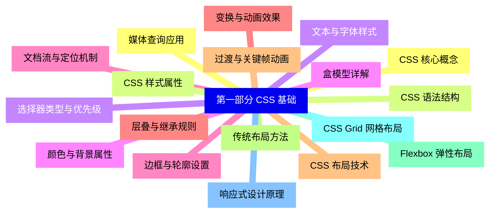
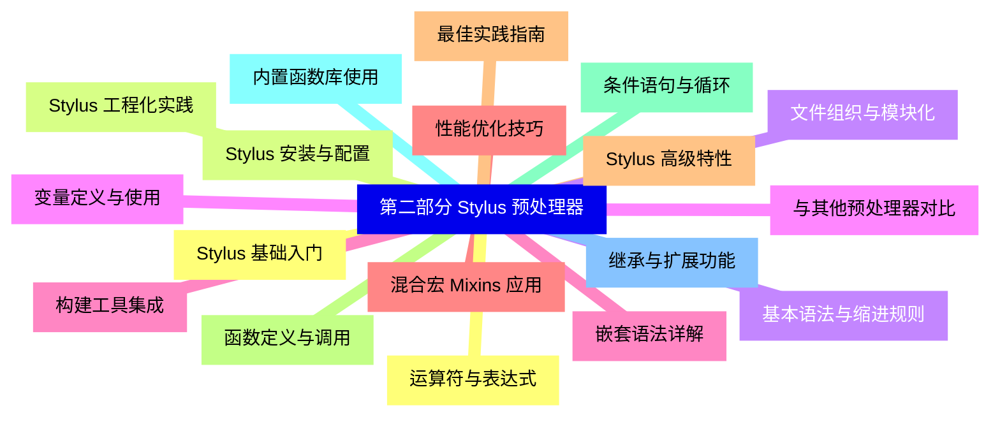
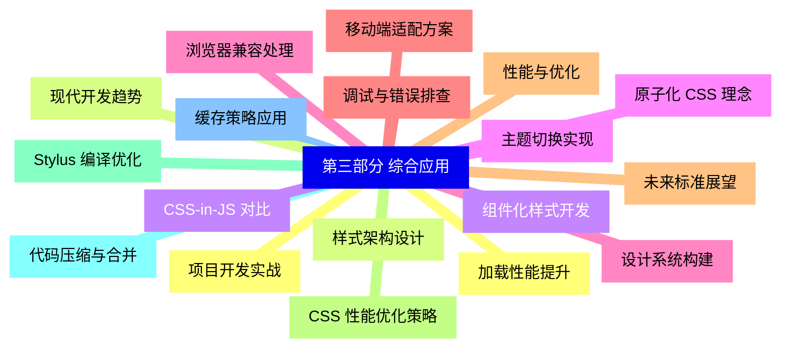


### 1 [第一部分 CSS 基础](#1)
#### 1.1 [CSS 核心概念](#1)
#### 1.2 [CSS 语法结构](#1)
#### 1.3 [选择器类型与优先级](#1)
#### 1.4 [盒模型详解](#1)
#### 1.5 [文档流与定位机制](#1)
#### 1.6 [层叠与继承规则](#1)
#### 1.7 [CSS 布局技术](#1)
#### 1.8 [传统布局方法](#1)
#### 1.9 [Flexbox 弹性布局](#1)
#### 1.10 [CSS Grid 网格布局](#1)
#### 1.11 [响应式设计原理](#1)
#### 1.12 [媒体查询应用](#1)
#### 1.13 [CSS 样式属性](#1)
#### 1.14 [文本与字体样式](#1)
#### 1.15 [颜色与背景属性](#1)
#### 1.16 [边框与轮廓设置](#1)
#### 1.17 [变换与动画效果](#1)
#### 1.18 [过渡与关键帧动画](#1)
### 2 [第二部分 Stylus 预处理器](#2)
#### 2.1 [Stylus 基础入门](#2)
#### 2.2 [Stylus 安装与配置](#2)
#### 2.3 [基本语法与缩进规则](#2)
#### 2.4 [变量定义与使用](#2)
#### 2.5 [嵌套语法详解](#2)
#### 2.6 [混合宏 Mixins 应用](#2)
#### 2.7 [Stylus 高级特性](#2)
#### 2.8 [函数定义与调用](#2)
#### 2.9 [条件语句与循环](#2)
#### 2.10 [内置函数库使用](#2)
#### 2.11 [继承与扩展功能](#2)
#### 2.12 [运算符与表达式](#2)
#### 2.13 [Stylus 工程化实践](#2)
#### 2.14 [文件组织与模块化](#2)
#### 2.15 [与其他预处理器对比](#2)
#### 2.16 [构建工具集成](#2)
#### 2.17 [性能优化技巧](#2)
#### 2.18 [最佳实践指南](#2)
### 3 [第三部分 综合应用](#3)
#### 3.1 [项目开发实战](#3)
#### 3.2 [样式架构设计](#3)
#### 3.3 [组件化样式开发](#3)
#### 3.4 [主题切换实现](#3)
#### 3.5 [浏览器兼容处理](#3)
#### 3.6 [调试与错误排查](#3)
#### 3.7 [性能与优化](#3)
#### 3.8 [CSS 性能优化策略](#3)
#### 3.9 [Stylus 编译优化](#3)
#### 3.10 [代码压缩与合并](#3)
#### 3.11 [缓存策略应用](#3)
#### 3.12 [加载性能提升](#3)
#### 3.13 [现代开发趋势](#3)
#### 3.14 [CSS-in-JS 对比](#3)
#### 3.15 [原子化 CSS 理念](#3)
#### 3.16 [设计系统构建](#3)
#### 3.17 [移动端适配方案](#3)
#### 3.18 [未来标准展望](#3)




### 1 第一部分 CSS 基础

---
### 1 第一部分 CSS 基础
___
#### 1.1 CSS 核心概念
___
#### 1.2 CSS 语法结构
___
#### 1.3 选择器类型与优先级
___
#### 1.4 盒模型详解
___
#### 1.5 文档流与定位机制
___
#### 1.6 层叠与继承规则
___
#### 1.7 CSS 布局技术
___
#### 1.8 传统布局方法
___
#### 1.9 Flexbox 弹性布局
___
#### 1.10 CSS Grid 网格布局
___
#### 1.11 响应式设计原理
___
#### 1.12 媒体查询应用
___
#### 1.13 CSS 样式属性
___
#### 1.14 文本与字体样式
___
#### 1.15 颜色与背景属性
___
#### 1.16 边框与轮廓设置
___
#### 1.17 变换与动画效果
___
#### 1.18 过渡与关键帧动画
### 2 第二部分 Stylus 预处理器

---
### 2 第二部分 Stylus 预处理器
___
#### 2.1 Stylus 基础入门
___
#### 2.2 Stylus 安装与配置
___
#### 2.3 基本语法与缩进规则
___
#### 2.4 变量定义与使用
___
#### 2.5 嵌套语法详解
___
#### 2.6 混合宏 Mixins 应用
___
#### 2.7 Stylus 高级特性
___
#### 2.8 函数定义与调用
___
#### 2.9 条件语句与循环
___
#### 2.10 内置函数库使用
___
#### 2.11 继承与扩展功能
___
#### 2.12 运算符与表达式
___
#### 2.13 Stylus 工程化实践
___
#### 2.14 文件组织与模块化
___
#### 2.15 与其他预处理器对比
___
#### 2.16 构建工具集成
___
#### 2.17 性能优化技巧
___
#### 2.18 最佳实践指南
### 3 第三部分 综合应用

---
### 3 第三部分 综合应用
___
#### 3.1 项目开发实战
___
#### 3.2 样式架构设计
___
#### 3.3 组件化样式开发
___
#### 3.4 主题切换实现
___
#### 3.5 浏览器兼容处理
___
#### 3.6 调试与错误排查
___
#### 3.7 性能与优化
___
#### 3.8 CSS 性能优化策略
___
#### 3.9 Stylus 编译优化
___
#### 3.10 代码压缩与合并
___
#### 3.11 缓存策略应用
___
#### 3.12 加载性能提升
___
#### 3.13 现代开发趋势
___
#### 3.14 CSS-in-JS 对比
___
#### 3.15 原子化 CSS 理念
___
#### 3.16 设计系统构建
___
#### 3.17 移动端适配方案
___
#### 3.18 未来标准展望


### 1 第一部分 CSS 基础{#1}

{}

<--->
{}
{}
{}
{}
{}
{}
{}
{}
{}
{}
{}
{}
{}
{}
{}
{}
{}
{}
{}
{}
{}
{}
{}
{}
{}
{}
{}
{}
{}
{}
{}
{}
{}
{}
{}
{}
{}

### 2 第二部分 Stylus 预处理器{#2}

{}
{}
{}
{}
{}
{}
{}
{}
{}
{}
{}
{}
{}
{}
{}
{}
{}
{}
{}
{}
{}
{}
{}
{}
{}
{}
{}
{}
{}
{}
{}
{}
{}
{}
{}
{}
{}
<--->

{}

### 3 第三部分 综合应用{#3}

{}

<--->
{}
{}
{}
{}
{}
{}
{}
{}
{}
{}
{}
{}
{}
{}
{}
{}
{}
{}
{}
{}
{}
{}
{}
{}
{}
{}
{}
{}
{}
{}
{}
{}
{}
{}
{}
{}
{}
