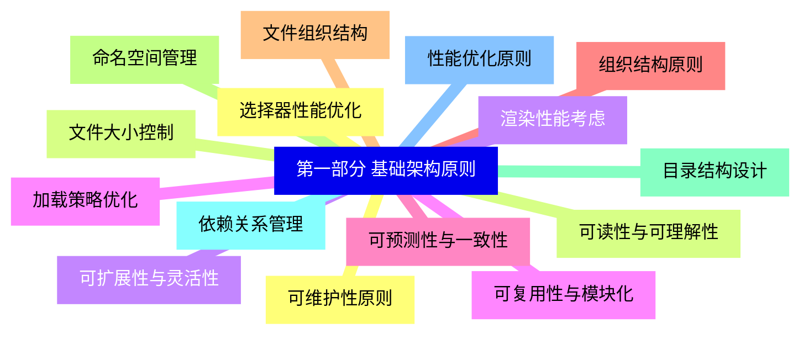
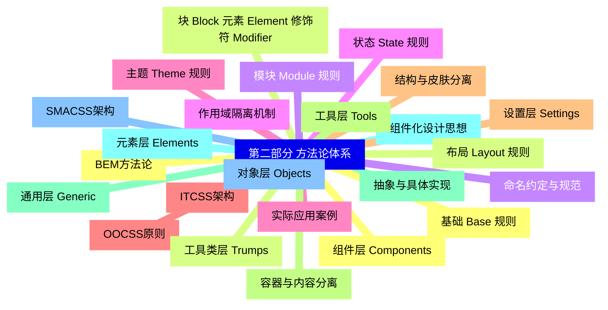
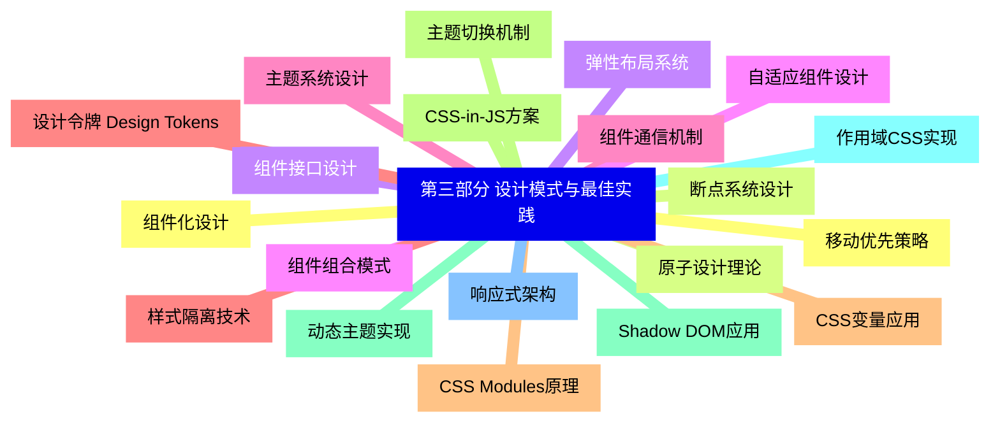
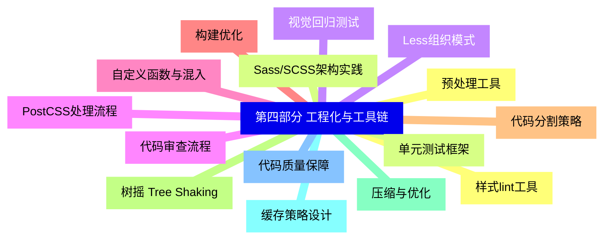
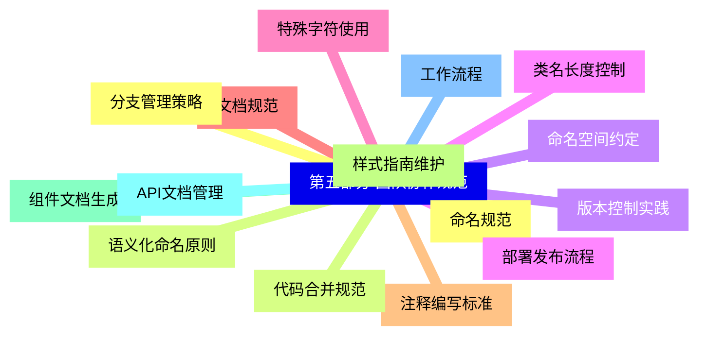
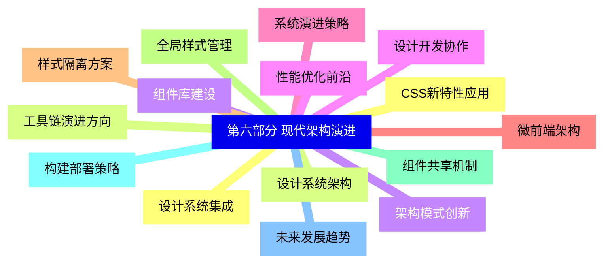


### 1 [第一部分 基础架构原则](#1)
#### 1.1 [可维护性原则](#1)
#### 1.2 [可读性与可理解性](#1)
#### 1.3 [可扩展性与灵活性](#1)
#### 1.4 [可复用性与模块化](#1)
#### 1.5 [可预测性与一致性](#1)
#### 1.6 [组织结构原则](#1)
#### 1.7 [文件组织结构](#1)
#### 1.8 [命名空间管理](#1)
#### 1.9 [目录结构设计](#1)
#### 1.10 [依赖关系管理](#1)
#### 1.11 [性能优化原则](#1)
#### 1.12 [选择器性能优化](#1)
#### 1.13 [文件大小控制](#1)
#### 1.14 [渲染性能考虑](#1)
#### 1.15 [加载策略优化](#1)
### 2 [第二部分 方法论体系](#2)
#### 2.1 [BEM方法论](#2)
#### 2.2 [块 Block 元素 Element 修饰符 Modifier](#2)
#### 2.3 [命名约定与规范](#2)
#### 2.4 [作用域隔离机制](#2)
#### 2.5 [实际应用案例](#2)
#### 2.6 [OOCSS原则](#2)
#### 2.7 [结构与皮肤分离](#2)
#### 2.8 [容器与内容分离](#2)
#### 2.9 [抽象与具体实现](#2)
#### 2.10 [组件化设计思想](#2)
#### 2.11 [SMACSS架构](#2)
#### 2.12 [基础 Base 规则](#2)
#### 2.13 [布局 Layout 规则](#2)
#### 2.14 [模块 Module 规则](#2)
#### 2.15 [状态 State 规则](#2)
#### 2.16 [主题 Theme 规则](#2)
#### 2.17 [ITCSS架构](#2)
#### 2.18 [设置层 Settings](#2)
#### 2.19 [工具层 Tools](#2)
#### 2.20 [通用层 Generic](#2)
#### 2.21 [元素层 Elements](#2)
#### 2.22 [对象层 Objects](#2)
#### 2.23 [组件层 Components](#2)
#### 2.24 [工具类层 Trumps](#2)
### 3 [第三部分 设计模式与最佳实践](#3)
#### 3.1 [组件化设计](#3)
#### 3.2 [原子设计理论](#3)
#### 3.3 [组件接口设计](#3)
#### 3.4 [组件组合模式](#3)
#### 3.5 [组件通信机制](#3)
#### 3.6 [样式隔离技术](#3)
#### 3.7 [CSS Modules原理](#3)
#### 3.8 [CSS-in-JS方案](#3)
#### 3.9 [Shadow DOM应用](#3)
#### 3.10 [作用域CSS实现](#3)
#### 3.11 [响应式架构](#3)
#### 3.12 [移动优先策略](#3)
#### 3.13 [断点系统设计](#3)
#### 3.14 [弹性布局系统](#3)
#### 3.15 [自适应组件设计](#3)
#### 3.16 [主题系统设计](#3)
#### 3.17 [设计令牌 Design Tokens](#3)
#### 3.18 [CSS变量应用](#3)
#### 3.19 [主题切换机制](#3)
#### 3.20 [动态主题实现](#3)
### 4 [第四部分 工程化与工具链](#4)
#### 4.1 [预处理工具](#4)
#### 4.2 [Sass/SCSS架构实践](#4)
#### 4.3 [Less组织模式](#4)
#### 4.4 [PostCSS处理流程](#4)
#### 4.5 [自定义函数与混入](#4)
#### 4.6 [构建优化](#4)
#### 4.7 [代码分割策略](#4)
#### 4.8 [树摇 Tree Shaking](#4)
#### 4.9 [压缩与优化](#4)
#### 4.10 [缓存策略设计](#4)
#### 4.11 [代码质量保障](#4)
#### 4.12 [样式lint工具](#4)
#### 4.13 [单元测试框架](#4)
#### 4.14 [视觉回归测试](#4)
#### 4.15 [代码审查流程](#4)
### 5 [第五部分 团队协作规范](#5)
#### 5.1 [命名规范](#5)
#### 5.2 [语义化命名原则](#5)
#### 5.3 [命名空间约定](#5)
#### 5.4 [类名长度控制](#5)
#### 5.5 [特殊字符使用](#5)
#### 5.6 [文档规范](#5)
#### 5.7 [注释编写标准](#5)
#### 5.8 [样式指南维护](#5)
#### 5.9 [组件文档生成](#5)
#### 5.10 [API文档管理](#5)
#### 5.11 [工作流程](#5)
#### 5.12 [分支管理策略](#5)
#### 5.13 [代码合并规范](#5)
#### 5.14 [版本控制实践](#5)
#### 5.15 [部署发布流程](#5)
### 6 [第六部分 现代架构演进](#6)
#### 6.1 [设计系统集成](#6)
#### 6.2 [设计系统架构](#6)
#### 6.3 [组件库建设](#6)
#### 6.4 [设计开发协作](#6)
#### 6.5 [系统演进策略](#6)
#### 6.6 [微前端架构](#6)
#### 6.7 [样式隔离方案](#6)
#### 6.8 [全局样式管理](#6)
#### 6.9 [组件共享机制](#6)
#### 6.10 [构建部署策略](#6)
#### 6.11 [未来发展趋势](#6)
#### 6.12 [CSS新特性应用](#6)
#### 6.13 [工具链演进方向](#6)
#### 6.14 [架构模式创新](#6)
#### 6.15 [性能优化前沿](#6)




### 1 第一部分 基础架构原则

---
### 1 第一部分 基础架构原则
___
#### 1.1 可维护性原则
___
#### 1.2 可读性与可理解性
___
#### 1.3 可扩展性与灵活性
___
#### 1.4 可复用性与模块化
___
#### 1.5 可预测性与一致性
___
#### 1.6 组织结构原则
___
#### 1.7 文件组织结构
___
#### 1.8 命名空间管理
___
#### 1.9 目录结构设计
___
#### 1.10 依赖关系管理
___
#### 1.11 性能优化原则
___
#### 1.12 选择器性能优化
___
#### 1.13 文件大小控制
___
#### 1.14 渲染性能考虑
___
#### 1.15 加载策略优化
### 2 第二部分 方法论体系

---
### 2 第二部分 方法论体系
___
#### 2.1 BEM方法论
___
#### 2.2 块 Block 元素 Element 修饰符 Modifier
___
#### 2.3 命名约定与规范
___
#### 2.4 作用域隔离机制
___
#### 2.5 实际应用案例
___
#### 2.6 OOCSS原则
___
#### 2.7 结构与皮肤分离
___
#### 2.8 容器与内容分离
___
#### 2.9 抽象与具体实现
___
#### 2.10 组件化设计思想
___
#### 2.11 SMACSS架构
___
#### 2.12 基础 Base 规则
___
#### 2.13 布局 Layout 规则
___
#### 2.14 模块 Module 规则
___
#### 2.15 状态 State 规则
___
#### 2.16 主题 Theme 规则
___
#### 2.17 ITCSS架构
___
#### 2.18 设置层 Settings
___
#### 2.19 工具层 Tools
___
#### 2.20 通用层 Generic
___
#### 2.21 元素层 Elements
___
#### 2.22 对象层 Objects
___
#### 2.23 组件层 Components
___
#### 2.24 工具类层 Trumps
### 3 第三部分 设计模式与最佳实践

---
### 3 第三部分 设计模式与最佳实践
___
#### 3.1 组件化设计
___
#### 3.2 原子设计理论
___
#### 3.3 组件接口设计
___
#### 3.4 组件组合模式
___
#### 3.5 组件通信机制
___
#### 3.6 样式隔离技术
___
#### 3.7 CSS Modules原理
___
#### 3.8 CSS-in-JS方案
___
#### 3.9 Shadow DOM应用
___
#### 3.10 作用域CSS实现
___
#### 3.11 响应式架构
___
#### 3.12 移动优先策略
___
#### 3.13 断点系统设计
___
#### 3.14 弹性布局系统
___
#### 3.15 自适应组件设计
___
#### 3.16 主题系统设计
___
#### 3.17 设计令牌 Design Tokens
___
#### 3.18 CSS变量应用
___
#### 3.19 主题切换机制
___
#### 3.20 动态主题实现
### 4 第四部分 工程化与工具链

---
### 4 第四部分 工程化与工具链
___
#### 4.1 预处理工具
___
#### 4.2 Sass/SCSS架构实践
___
#### 4.3 Less组织模式
___
#### 4.4 PostCSS处理流程
___
#### 4.5 自定义函数与混入
___
#### 4.6 构建优化
___
#### 4.7 代码分割策略
___
#### 4.8 树摇 Tree Shaking
___
#### 4.9 压缩与优化
___
#### 4.10 缓存策略设计
___
#### 4.11 代码质量保障
___
#### 4.12 样式lint工具
___
#### 4.13 单元测试框架
___
#### 4.14 视觉回归测试
___
#### 4.15 代码审查流程
### 5 第五部分 团队协作规范

---
### 5 第五部分 团队协作规范
___
#### 5.1 命名规范
___
#### 5.2 语义化命名原则
___
#### 5.3 命名空间约定
___
#### 5.4 类名长度控制
___
#### 5.5 特殊字符使用
___
#### 5.6 文档规范
___
#### 5.7 注释编写标准
___
#### 5.8 样式指南维护
___
#### 5.9 组件文档生成
___
#### 5.10 API文档管理
___
#### 5.11 工作流程
___
#### 5.12 分支管理策略
___
#### 5.13 代码合并规范
___
#### 5.14 版本控制实践
___
#### 5.15 部署发布流程
### 6 第六部分 现代架构演进

---
### 6 第六部分 现代架构演进
___
#### 6.1 设计系统集成
___
#### 6.2 设计系统架构
___
#### 6.3 组件库建设
___
#### 6.4 设计开发协作
___
#### 6.5 系统演进策略
___
#### 6.6 微前端架构
___
#### 6.7 样式隔离方案
___
#### 6.8 全局样式管理
___
#### 6.9 组件共享机制
___
#### 6.10 构建部署策略
___
#### 6.11 未来发展趋势
___
#### 6.12 CSS新特性应用
___
#### 6.13 工具链演进方向
___
#### 6.14 架构模式创新
___
#### 6.15 性能优化前沿


### 1 第一部分 基础架构原则{#1}

{}

<--->
{}
{}
{}
{}
{}
{}
{}
{}
{}
{}
{}
{}
{}
{}
{}
{}
{}
{}
{}
{}
{}
{}
{}
{}
{}
{}
{}
{}
{}
{}
{}

### 2 第二部分 方法论体系{#2}

{}
{}
{}
{}
{}
{}
{}
{}
{}
{}
{}
{}
{}
{}
{}
{}
{}
{}
{}
{}
{}
{}
{}
{}
{}
{}
{}
{}
{}
{}
{}
{}
{}
{}
{}
{}
{}
{}
{}
{}
{}
{}
{}
{}
{}
{}
{}
{}
{}
<--->

{}

### 3 第三部分 设计模式与最佳实践{#3}

{}

<--->
{}
{}
{}
{}
{}
{}
{}
{}
{}
{}
{}
{}
{}
{}
{}
{}
{}
{}
{}
{}
{}
{}
{}
{}
{}
{}
{}
{}
{}
{}
{}
{}
{}
{}
{}
{}
{}
{}
{}
{}
{}

### 4 第四部分 工程化与工具链{#4}

{}
{}
{}
{}
{}
{}
{}
{}
{}
{}
{}
{}
{}
{}
{}
{}
{}
{}
{}
{}
{}
{}
{}
{}
{}
{}
{}
{}
{}
{}
{}
<--->

{}

### 5 第五部分 团队协作规范{#5}

{}

<--->
{}
{}
{}
{}
{}
{}
{}
{}
{}
{}
{}
{}
{}
{}
{}
{}
{}
{}
{}
{}
{}
{}
{}
{}
{}
{}
{}
{}
{}
{}
{}

### 6 第六部分 现代架构演进{#6}

{}
{}
{}
{}
{}
{}
{}
{}
{}
{}
{}
{}
{}
{}
{}
{}
{}
{}
{}
{}
{}
{}
{}
{}
{}
{}
{}
{}
{}
{}
{}
<--->

{}
