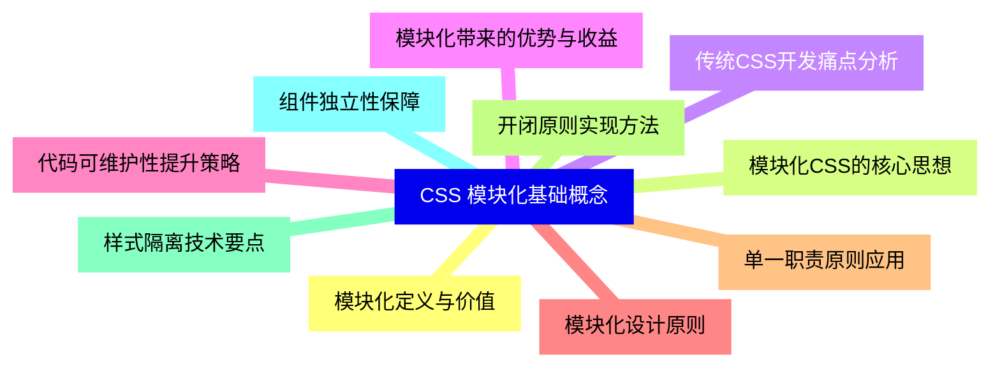
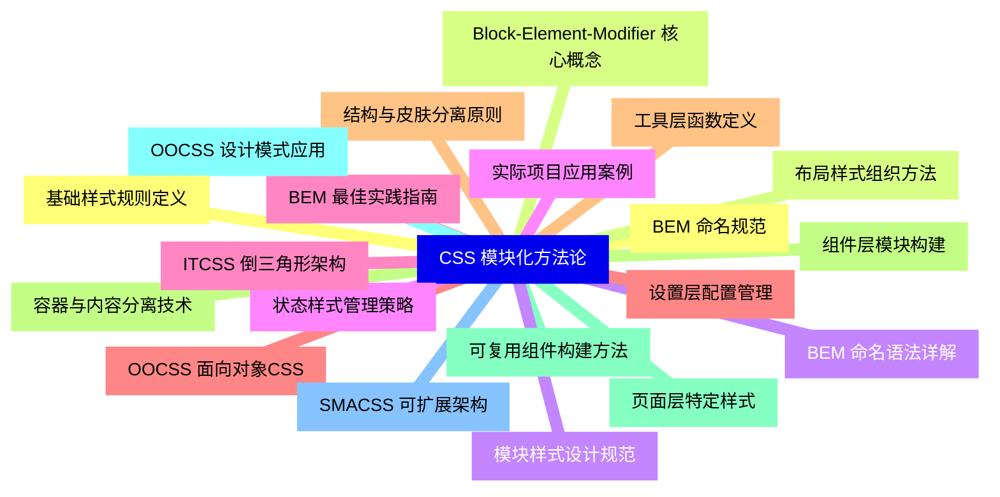
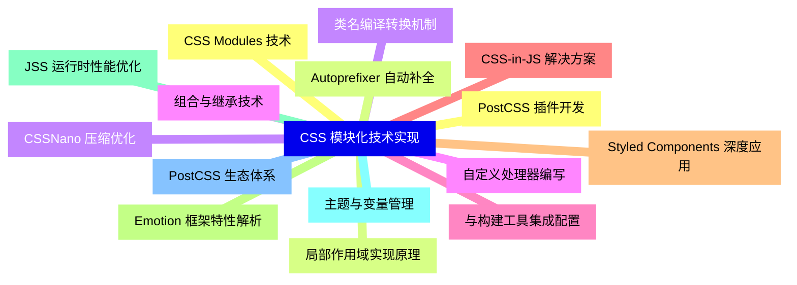
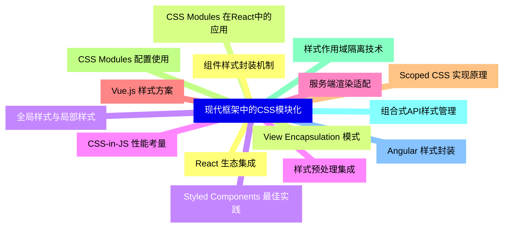
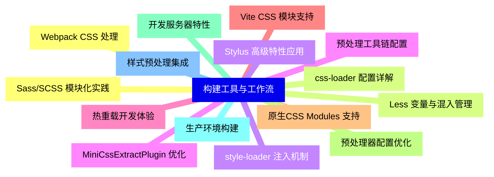
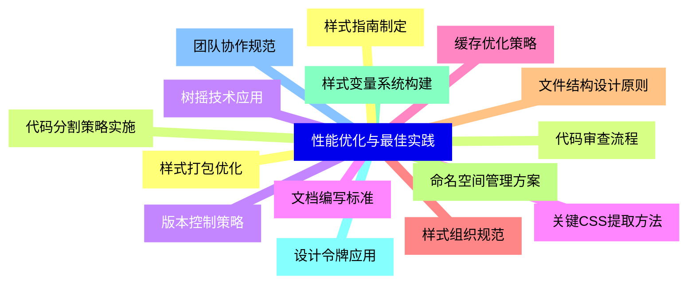
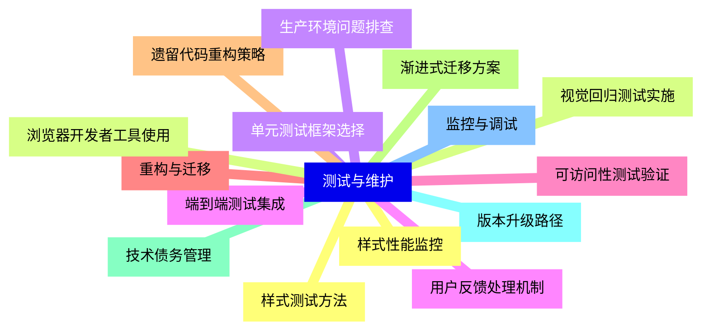


### 1 [CSS 模块化基础概念](#1)
#### 1.1 [模块化定义与价值](#1)
#### 1.2 [模块化CSS的核心思想](#1)
#### 1.3 [传统CSS开发痛点分析](#1)
#### 1.4 [模块化带来的优势与收益](#1)
#### 1.5 [代码可维护性提升策略](#1)
#### 1.6 [模块化设计原则](#1)
#### 1.7 [单一职责原则应用](#1)
#### 1.8 [开闭原则实现方法](#1)
#### 1.9 [样式隔离技术要点](#1)
#### 1.10 [组件独立性保障](#1)
### 2 [CSS 模块化方法论](#2)
#### 2.1 [BEM 命名规范](#2)
#### 2.2 [Block-Element-Modifier 核心概念](#2)
#### 2.3 [BEM 命名语法详解](#2)
#### 2.4 [实际项目应用案例](#2)
#### 2.5 [BEM 最佳实践指南](#2)
#### 2.6 [OOCSS 面向对象CSS](#2)
#### 2.7 [结构与皮肤分离原则](#2)
#### 2.8 [容器与内容分离技术](#2)
#### 2.9 [可复用组件构建方法](#2)
#### 2.10 [OOCSS 设计模式应用](#2)
#### 2.11 [SMACSS 可扩展架构](#2)
#### 2.12 [基础样式规则定义](#2)
#### 2.13 [布局样式组织方法](#2)
#### 2.14 [模块样式设计规范](#2)
#### 2.15 [状态样式管理策略](#2)
#### 2.16 [ITCSS 倒三角形架构](#2)
#### 2.17 [设置层配置管理](#2)
#### 2.18 [工具层函数定义](#2)
#### 2.19 [组件层模块构建](#2)
#### 2.20 [页面层特定样式](#2)
### 3 [CSS 模块化技术实现](#3)
#### 3.1 [CSS Modules 技术](#3)
#### 3.2 [局部作用域实现原理](#3)
#### 3.3 [类名编译转换机制](#3)
#### 3.4 [组合与继承技术](#3)
#### 3.5 [与构建工具集成配置](#3)
#### 3.6 [CSS-in-JS 解决方案](#3)
#### 3.7 [Styled Components 深度应用](#3)
#### 3.8 [Emotion 框架特性解析](#3)
#### 3.9 [JSS 运行时性能优化](#3)
#### 3.10 [主题与变量管理](#3)
#### 3.11 [PostCSS 生态体系](#3)
#### 3.12 [PostCSS 插件开发](#3)
#### 3.13 [Autoprefixer 自动补全](#3)
#### 3.14 [CSSNano 压缩优化](#3)
#### 3.15 [自定义处理器编写](#3)
### 4 [现代框架中的CSS模块化](#4)
#### 4.1 [React 生态集成](#4)
#### 4.2 [CSS Modules 在React中的应用](#4)
#### 4.3 [Styled Components 最佳实践](#4)
#### 4.4 [CSS-in-JS 性能考量](#4)
#### 4.5 [服务端渲染适配](#4)
#### 4.6 [Vue.js 样式方案](#4)
#### 4.7 [Scoped CSS 实现原理](#4)
#### 4.8 [CSS Modules 配置使用](#4)
#### 4.9 [样式作用域隔离技术](#4)
#### 4.10 [组合式API样式管理](#4)
#### 4.11 [Angular 样式封装](#4)
#### 4.12 [组件样式封装机制](#4)
#### 4.13 [View Encapsulation 模式](#4)
#### 4.14 [全局样式与局部样式](#4)
#### 4.15 [样式预处理集成](#4)
### 5 [构建工具与工作流](#5)
#### 5.1 [Webpack CSS 处理](#5)
#### 5.2 [css-loader 配置详解](#5)
#### 5.3 [style-loader 注入机制](#5)
#### 5.4 [MiniCssExtractPlugin 优化](#5)
#### 5.5 [热重载开发体验](#5)
#### 5.6 [Vite CSS 模块支持](#5)
#### 5.7 [原生CSS Modules 支持](#5)
#### 5.8 [预处理器配置优化](#5)
#### 5.9 [开发服务器特性](#5)
#### 5.10 [生产环境构建](#5)
#### 5.11 [样式预处理集成](#5)
#### 5.12 [Sass/SCSS 模块化实践](#5)
#### 5.13 [Less 变量与混入管理](#5)
#### 5.14 [Stylus 高级特性应用](#5)
#### 5.15 [预处理工具链配置](#5)
### 6 [性能优化与最佳实践](#6)
#### 6.1 [样式打包优化](#6)
#### 6.2 [代码分割策略实施](#6)
#### 6.3 [树摇技术应用](#6)
#### 6.4 [关键CSS提取方法](#6)
#### 6.5 [缓存优化策略](#6)
#### 6.6 [样式组织规范](#6)
#### 6.7 [文件结构设计原则](#6)
#### 6.8 [命名空间管理方案](#6)
#### 6.9 [样式变量系统构建](#6)
#### 6.10 [设计令牌应用](#6)
#### 6.11 [团队协作规范](#6)
#### 6.12 [样式指南制定](#6)
#### 6.13 [代码审查流程](#6)
#### 6.14 [版本控制策略](#6)
#### 6.15 [文档编写标准](#6)
### 7 [测试与维护](#7)
#### 7.1 [样式测试方法](#7)
#### 7.2 [视觉回归测试实施](#7)
#### 7.3 [单元测试框架选择](#7)
#### 7.4 [端到端测试集成](#7)
#### 7.5 [可访问性测试验证](#7)
#### 7.6 [重构与迁移](#7)
#### 7.7 [遗留代码重构策略](#7)
#### 7.8 [渐进式迁移方案](#7)
#### 7.9 [技术债务管理](#7)
#### 7.10 [版本升级路径](#7)
#### 7.11 [监控与调试](#7)
#### 7.12 [样式性能监控](#7)
#### 7.13 [浏览器开发者工具使用](#7)
#### 7.14 [生产环境问题排查](#7)
#### 7.15 [用户反馈处理机制](#7)




### 1 CSS 模块化基础概念

---
### 1 CSS 模块化基础概念
___
#### 1.1 模块化定义与价值
___
#### 1.2 模块化CSS的核心思想
___
#### 1.3 传统CSS开发痛点分析
___
#### 1.4 模块化带来的优势与收益
___
#### 1.5 代码可维护性提升策略
___
#### 1.6 模块化设计原则
___
#### 1.7 单一职责原则应用
___
#### 1.8 开闭原则实现方法
___
#### 1.9 样式隔离技术要点
___
#### 1.10 组件独立性保障
### 2 CSS 模块化方法论

---
### 2 CSS 模块化方法论
___
#### 2.1 BEM 命名规范
___
#### 2.2 Block-Element-Modifier 核心概念
___
#### 2.3 BEM 命名语法详解
___
#### 2.4 实际项目应用案例
___
#### 2.5 BEM 最佳实践指南
___
#### 2.6 OOCSS 面向对象CSS
___
#### 2.7 结构与皮肤分离原则
___
#### 2.8 容器与内容分离技术
___
#### 2.9 可复用组件构建方法
___
#### 2.10 OOCSS 设计模式应用
___
#### 2.11 SMACSS 可扩展架构
___
#### 2.12 基础样式规则定义
___
#### 2.13 布局样式组织方法
___
#### 2.14 模块样式设计规范
___
#### 2.15 状态样式管理策略
___
#### 2.16 ITCSS 倒三角形架构
___
#### 2.17 设置层配置管理
___
#### 2.18 工具层函数定义
___
#### 2.19 组件层模块构建
___
#### 2.20 页面层特定样式
### 3 CSS 模块化技术实现

---
### 3 CSS 模块化技术实现
___
#### 3.1 CSS Modules 技术
___
#### 3.2 局部作用域实现原理
___
#### 3.3 类名编译转换机制
___
#### 3.4 组合与继承技术
___
#### 3.5 与构建工具集成配置
___
#### 3.6 CSS-in-JS 解决方案
___
#### 3.7 Styled Components 深度应用
___
#### 3.8 Emotion 框架特性解析
___
#### 3.9 JSS 运行时性能优化
___
#### 3.10 主题与变量管理
___
#### 3.11 PostCSS 生态体系
___
#### 3.12 PostCSS 插件开发
___
#### 3.13 Autoprefixer 自动补全
___
#### 3.14 CSSNano 压缩优化
___
#### 3.15 自定义处理器编写
### 4 现代框架中的CSS模块化

---
### 4 现代框架中的CSS模块化
___
#### 4.1 React 生态集成
___
#### 4.2 CSS Modules 在React中的应用
___
#### 4.3 Styled Components 最佳实践
___
#### 4.4 CSS-in-JS 性能考量
___
#### 4.5 服务端渲染适配
___
#### 4.6 Vue.js 样式方案
___
#### 4.7 Scoped CSS 实现原理
___
#### 4.8 CSS Modules 配置使用
___
#### 4.9 样式作用域隔离技术
___
#### 4.10 组合式API样式管理
___
#### 4.11 Angular 样式封装
___
#### 4.12 组件样式封装机制
___
#### 4.13 View Encapsulation 模式
___
#### 4.14 全局样式与局部样式
___
#### 4.15 样式预处理集成
### 5 构建工具与工作流

---
### 5 构建工具与工作流
___
#### 5.1 Webpack CSS 处理
___
#### 5.2 css-loader 配置详解
___
#### 5.3 style-loader 注入机制
___
#### 5.4 MiniCssExtractPlugin 优化
___
#### 5.5 热重载开发体验
___
#### 5.6 Vite CSS 模块支持
___
#### 5.7 原生CSS Modules 支持
___
#### 5.8 预处理器配置优化
___
#### 5.9 开发服务器特性
___
#### 5.10 生产环境构建
___
#### 5.11 样式预处理集成
___
#### 5.12 Sass/SCSS 模块化实践
___
#### 5.13 Less 变量与混入管理
___
#### 5.14 Stylus 高级特性应用
___
#### 5.15 预处理工具链配置
### 6 性能优化与最佳实践

---
### 6 性能优化与最佳实践
___
#### 6.1 样式打包优化
___
#### 6.2 代码分割策略实施
___
#### 6.3 树摇技术应用
___
#### 6.4 关键CSS提取方法
___
#### 6.5 缓存优化策略
___
#### 6.6 样式组织规范
___
#### 6.7 文件结构设计原则
___
#### 6.8 命名空间管理方案
___
#### 6.9 样式变量系统构建
___
#### 6.10 设计令牌应用
___
#### 6.11 团队协作规范
___
#### 6.12 样式指南制定
___
#### 6.13 代码审查流程
___
#### 6.14 版本控制策略
___
#### 6.15 文档编写标准
### 7 测试与维护

---
### 7 测试与维护
___
#### 7.1 样式测试方法
___
#### 7.2 视觉回归测试实施
___
#### 7.3 单元测试框架选择
___
#### 7.4 端到端测试集成
___
#### 7.5 可访问性测试验证
___
#### 7.6 重构与迁移
___
#### 7.7 遗留代码重构策略
___
#### 7.8 渐进式迁移方案
___
#### 7.9 技术债务管理
___
#### 7.10 版本升级路径
___
#### 7.11 监控与调试
___
#### 7.12 样式性能监控
___
#### 7.13 浏览器开发者工具使用
___
#### 7.14 生产环境问题排查
___
#### 7.15 用户反馈处理机制


### 1 CSS 模块化基础概念{#1}

{}

<--->
{}
{}
{}
{}
{}
{}
{}
{}
{}
{}
{}
{}
{}
{}
{}
{}
{}
{}
{}
{}
{}

### 2 CSS 模块化方法论{#2}

{}
{}
{}
{}
{}
{}
{}
{}
{}
{}
{}
{}
{}
{}
{}
{}
{}
{}
{}
{}
{}
{}
{}
{}
{}
{}
{}
{}
{}
{}
{}
{}
{}
{}
{}
{}
{}
{}
{}
{}
{}
<--->

{}

### 3 CSS 模块化技术实现{#3}

{}

<--->
{}
{}
{}
{}
{}
{}
{}
{}
{}
{}
{}
{}
{}
{}
{}
{}
{}
{}
{}
{}
{}
{}
{}
{}
{}
{}
{}
{}
{}
{}
{}

### 4 现代框架中的CSS模块化{#4}

{}
{}
{}
{}
{}
{}
{}
{}
{}
{}
{}
{}
{}
{}
{}
{}
{}
{}
{}
{}
{}
{}
{}
{}
{}
{}
{}
{}
{}
{}
{}
<--->

{}

### 5 构建工具与工作流{#5}

{}

<--->
{}
{}
{}
{}
{}
{}
{}
{}
{}
{}
{}
{}
{}
{}
{}
{}
{}
{}
{}
{}
{}
{}
{}
{}
{}
{}
{}
{}
{}
{}
{}

### 6 性能优化与最佳实践{#6}

{}
{}
{}
{}
{}
{}
{}
{}
{}
{}
{}
{}
{}
{}
{}
{}
{}
{}
{}
{}
{}
{}
{}
{}
{}
{}
{}
{}
{}
{}
{}
<--->

{}

### 7 测试与维护{#7}

{}

<--->
{}
{}
{}
{}
{}
{}
{}
{}
{}
{}
{}
{}
{}
{}
{}
{}
{}
{}
{}
{}
{}
{}
{}
{}
{}
{}
{}
{}
{}
{}
{}
