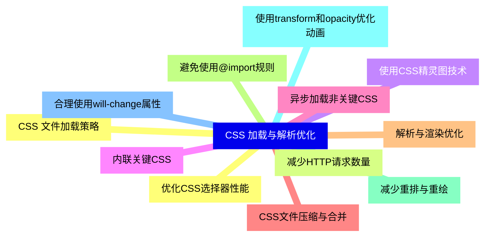
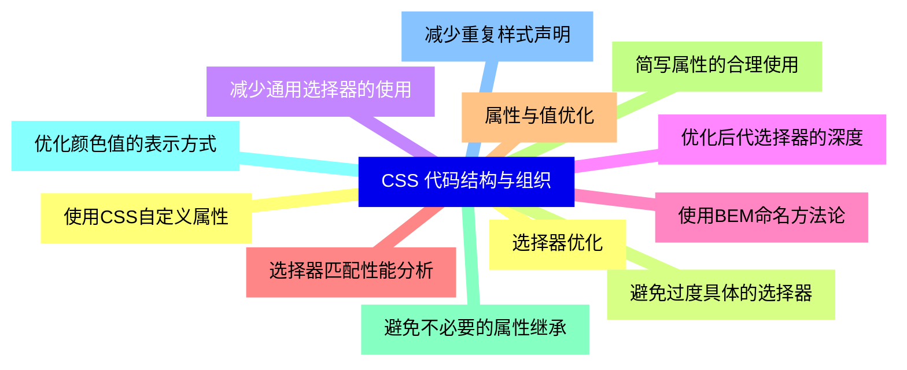
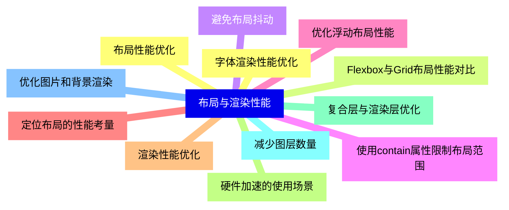
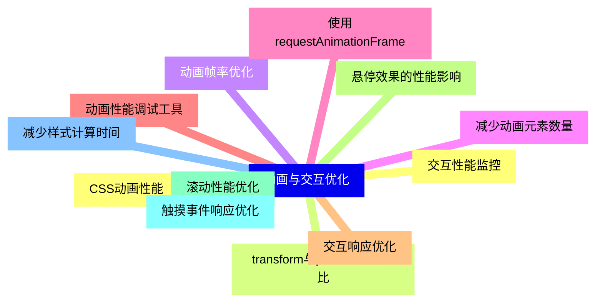
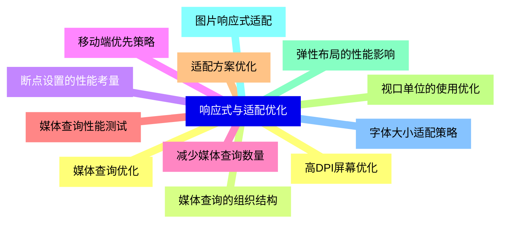
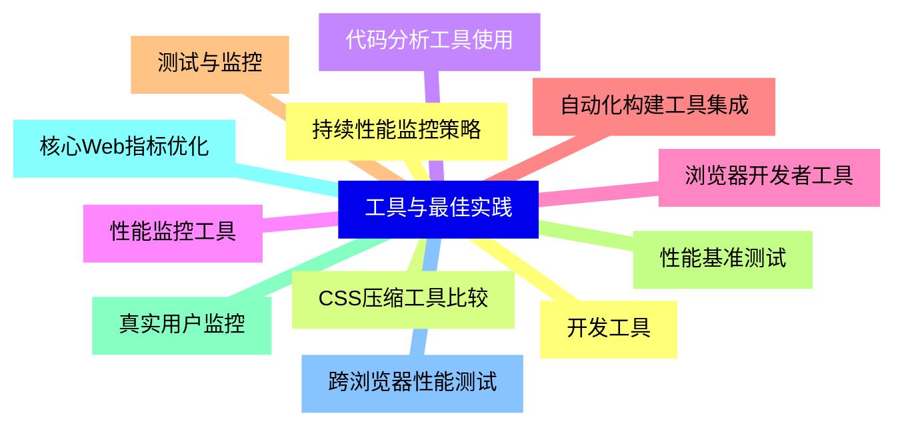
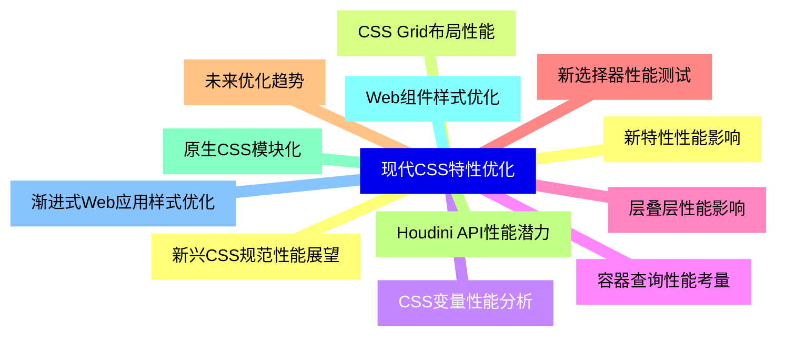


### 1 [CSS 加载与解析优化](#1)
#### 1.1 [CSS 文件加载策略](#1)
#### 1.2 [减少HTTP请求数量](#1)
#### 1.3 [使用CSS精灵图技术](#1)
#### 1.4 [内联关键CSS](#1)
#### 1.5 [异步加载非关键CSS](#1)
#### 1.6 [CSS文件压缩与合并](#1)
#### 1.7 [解析与渲染优化](#1)
#### 1.8 [避免使用@import规则](#1)
#### 1.9 [减少重排与重绘](#1)
#### 1.10 [使用transform和opacity优化动画](#1)
#### 1.11 [合理使用will-change属性](#1)
#### 1.12 [优化CSS选择器性能](#1)
### 2 [CSS 代码结构与组织](#2)
#### 2.1 [选择器优化](#2)
#### 2.2 [避免过度具体的选择器](#2)
#### 2.3 [减少通用选择器的使用](#2)
#### 2.4 [优化后代选择器的深度](#2)
#### 2.5 [使用BEM命名方法论](#2)
#### 2.6 [选择器匹配性能分析](#2)
#### 2.7 [属性与值优化](#2)
#### 2.8 [简写属性的合理使用](#2)
#### 2.9 [避免不必要的属性继承](#2)
#### 2.10 [优化颜色值的表示方式](#2)
#### 2.11 [减少重复样式声明](#2)
#### 2.12 [使用CSS自定义属性](#2)
### 3 [布局与渲染性能](#3)
#### 3.1 [布局性能优化](#3)
#### 3.2 [Flexbox与Grid布局性能对比](#3)
#### 3.3 [避免布局抖动](#3)
#### 3.4 [使用contain属性限制布局范围](#3)
#### 3.5 [优化浮动布局性能](#3)
#### 3.6 [定位布局的性能考量](#3)
#### 3.7 [渲染性能优化](#3)
#### 3.8 [硬件加速的使用场景](#3)
#### 3.9 [复合层与渲染层优化](#3)
#### 3.10 [减少图层数量](#3)
#### 3.11 [优化图片和背景渲染](#3)
#### 3.12 [字体渲染性能优化](#3)
### 4 [动画与交互优化](#4)
#### 4.1 [CSS动画性能](#4)
#### 4.2 [transform与position动画对比](#4)
#### 4.3 [动画帧率优化](#4)
#### 4.4 [减少动画元素数量](#4)
#### 4.5 [使用requestAnimationFrame](#4)
#### 4.6 [动画性能调试工具](#4)
#### 4.7 [交互响应优化](#4)
#### 4.8 [悬停效果的性能影响](#4)
#### 4.9 [滚动性能优化](#4)
#### 4.10 [触摸事件响应优化](#4)
#### 4.11 [减少样式计算时间](#4)
#### 4.12 [交互性能监控](#4)
### 5 [响应式与适配优化](#5)
#### 5.1 [媒体查询优化](#5)
#### 5.2 [媒体查询的组织结构](#5)
#### 5.3 [断点设置的性能考量](#5)
#### 5.4 [移动端优先策略](#5)
#### 5.5 [减少媒体查询数量](#5)
#### 5.6 [媒体查询性能测试](#5)
#### 5.7 [适配方案优化](#5)
#### 5.8 [视口单位的使用优化](#5)
#### 5.9 [弹性布局的性能影响](#5)
#### 5.10 [图片响应式适配](#5)
#### 5.11 [字体大小适配策略](#5)
#### 5.12 [高DPI屏幕优化](#5)
### 6 [工具与最佳实践](#6)
#### 6.1 [开发工具](#6)
#### 6.2 [CSS压缩工具比较](#6)
#### 6.3 [代码分析工具使用](#6)
#### 6.4 [性能监控工具](#6)
#### 6.5 [浏览器开发者工具](#6)
#### 6.6 [自动化构建工具集成](#6)
#### 6.7 [测试与监控](#6)
#### 6.8 [性能基准测试](#6)
#### 6.9 [真实用户监控](#6)
#### 6.10 [核心Web指标优化](#6)
#### 6.11 [跨浏览器性能测试](#6)
#### 6.12 [持续性能监控策略](#6)
### 7 [现代CSS特性优化](#7)
#### 7.1 [新特性性能影响](#7)
#### 7.2 [CSS Grid布局性能](#7)
#### 7.3 [CSS变量性能分析](#7)
#### 7.4 [容器查询性能考量](#7)
#### 7.5 [层叠层性能影响](#7)
#### 7.6 [新选择器性能测试](#7)
#### 7.7 [未来优化趋势](#7)
#### 7.8 [Houdini API性能潜力](#7)
#### 7.9 [原生CSS模块化](#7)
#### 7.10 [Web组件样式优化](#7)
#### 7.11 [渐进式Web应用样式优化](#7)
#### 7.12 [新兴CSS规范性能展望](#7)




### 1 CSS 加载与解析优化

---
### 1 CSS 加载与解析优化
___
#### 1.1 CSS 文件加载策略
___
#### 1.2 减少HTTP请求数量
___
#### 1.3 使用CSS精灵图技术
___
#### 1.4 内联关键CSS
___
#### 1.5 异步加载非关键CSS
___
#### 1.6 CSS文件压缩与合并
___
#### 1.7 解析与渲染优化
___
#### 1.8 避免使用@import规则
___
#### 1.9 减少重排与重绘
___
#### 1.10 使用transform和opacity优化动画
___
#### 1.11 合理使用will-change属性
___
#### 1.12 优化CSS选择器性能
### 2 CSS 代码结构与组织

---
### 2 CSS 代码结构与组织
___
#### 2.1 选择器优化
___
#### 2.2 避免过度具体的选择器
___
#### 2.3 减少通用选择器的使用
___
#### 2.4 优化后代选择器的深度
___
#### 2.5 使用BEM命名方法论
___
#### 2.6 选择器匹配性能分析
___
#### 2.7 属性与值优化
___
#### 2.8 简写属性的合理使用
___
#### 2.9 避免不必要的属性继承
___
#### 2.10 优化颜色值的表示方式
___
#### 2.11 减少重复样式声明
___
#### 2.12 使用CSS自定义属性
### 3 布局与渲染性能

---
### 3 布局与渲染性能
___
#### 3.1 布局性能优化
___
#### 3.2 Flexbox与Grid布局性能对比
___
#### 3.3 避免布局抖动
___
#### 3.4 使用contain属性限制布局范围
___
#### 3.5 优化浮动布局性能
___
#### 3.6 定位布局的性能考量
___
#### 3.7 渲染性能优化
___
#### 3.8 硬件加速的使用场景
___
#### 3.9 复合层与渲染层优化
___
#### 3.10 减少图层数量
___
#### 3.11 优化图片和背景渲染
___
#### 3.12 字体渲染性能优化
### 4 动画与交互优化

---
### 4 动画与交互优化
___
#### 4.1 CSS动画性能
___
#### 4.2 transform与position动画对比
___
#### 4.3 动画帧率优化
___
#### 4.4 减少动画元素数量
___
#### 4.5 使用requestAnimationFrame
___
#### 4.6 动画性能调试工具
___
#### 4.7 交互响应优化
___
#### 4.8 悬停效果的性能影响
___
#### 4.9 滚动性能优化
___
#### 4.10 触摸事件响应优化
___
#### 4.11 减少样式计算时间
___
#### 4.12 交互性能监控
### 5 响应式与适配优化

---
### 5 响应式与适配优化
___
#### 5.1 媒体查询优化
___
#### 5.2 媒体查询的组织结构
___
#### 5.3 断点设置的性能考量
___
#### 5.4 移动端优先策略
___
#### 5.5 减少媒体查询数量
___
#### 5.6 媒体查询性能测试
___
#### 5.7 适配方案优化
___
#### 5.8 视口单位的使用优化
___
#### 5.9 弹性布局的性能影响
___
#### 5.10 图片响应式适配
___
#### 5.11 字体大小适配策略
___
#### 5.12 高DPI屏幕优化
### 6 工具与最佳实践

---
### 6 工具与最佳实践
___
#### 6.1 开发工具
___
#### 6.2 CSS压缩工具比较
___
#### 6.3 代码分析工具使用
___
#### 6.4 性能监控工具
___
#### 6.5 浏览器开发者工具
___
#### 6.6 自动化构建工具集成
___
#### 6.7 测试与监控
___
#### 6.8 性能基准测试
___
#### 6.9 真实用户监控
___
#### 6.10 核心Web指标优化
___
#### 6.11 跨浏览器性能测试
___
#### 6.12 持续性能监控策略
### 7 现代CSS特性优化

---
### 7 现代CSS特性优化
___
#### 7.1 新特性性能影响
___
#### 7.2 CSS Grid布局性能
___
#### 7.3 CSS变量性能分析
___
#### 7.4 容器查询性能考量
___
#### 7.5 层叠层性能影响
___
#### 7.6 新选择器性能测试
___
#### 7.7 未来优化趋势
___
#### 7.8 Houdini API性能潜力
___
#### 7.9 原生CSS模块化
___
#### 7.10 Web组件样式优化
___
#### 7.11 渐进式Web应用样式优化
___
#### 7.12 新兴CSS规范性能展望


### 1 CSS 加载与解析优化{#1}

{}

<--->
{}
{}
{}
{}
{}
{}
{}
{}
{}
{}
{}
{}
{}
{}
{}
{}
{}
{}
{}
{}
{}
{}
{}
{}
{}

### 2 CSS 代码结构与组织{#2}

{}
{}
{}
{}
{}
{}
{}
{}
{}
{}
{}
{}
{}
{}
{}
{}
{}
{}
{}
{}
{}
{}
{}
{}
{}
<--->

{}

### 3 布局与渲染性能{#3}

{}

<--->
{}
{}
{}
{}
{}
{}
{}
{}
{}
{}
{}
{}
{}
{}
{}
{}
{}
{}
{}
{}
{}
{}
{}
{}
{}

### 4 动画与交互优化{#4}

{}
{}
{}
{}
{}
{}
{}
{}
{}
{}
{}
{}
{}
{}
{}
{}
{}
{}
{}
{}
{}
{}
{}
{}
{}
<--->

{}

### 5 响应式与适配优化{#5}

{}

<--->
{}
{}
{}
{}
{}
{}
{}
{}
{}
{}
{}
{}
{}
{}
{}
{}
{}
{}
{}
{}
{}
{}
{}
{}
{}

### 6 工具与最佳实践{#6}

{}
{}
{}
{}
{}
{}
{}
{}
{}
{}
{}
{}
{}
{}
{}
{}
{}
{}
{}
{}
{}
{}
{}
{}
{}
<--->

{}

### 7 现代CSS特性优化{#7}

{}

<--->
{}
{}
{}
{}
{}
{}
{}
{}
{}
{}
{}
{}
{}
{}
{}
{}
{}
{}
{}
{}
{}
{}
{}
{}
{}
