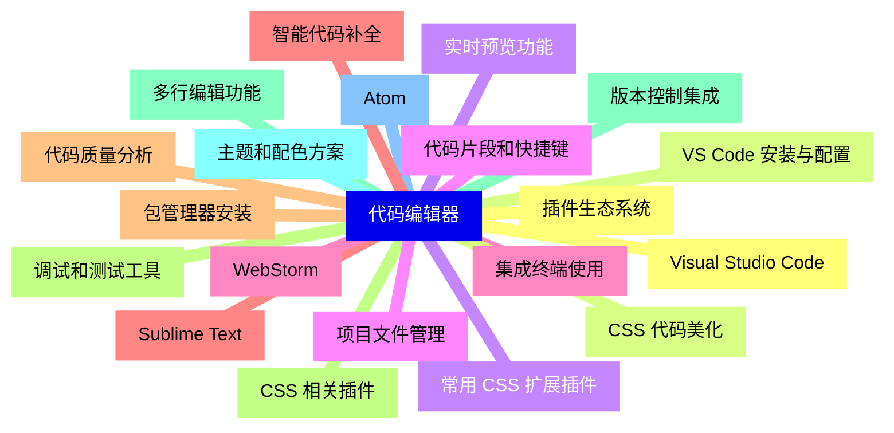
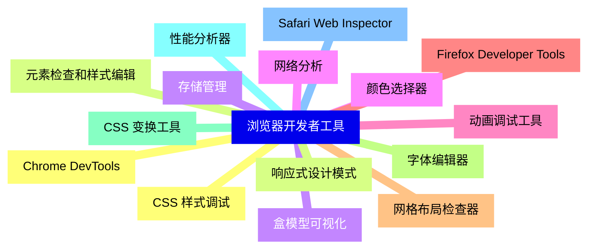
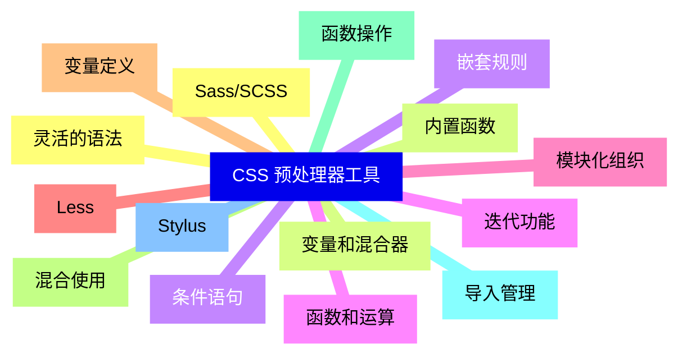
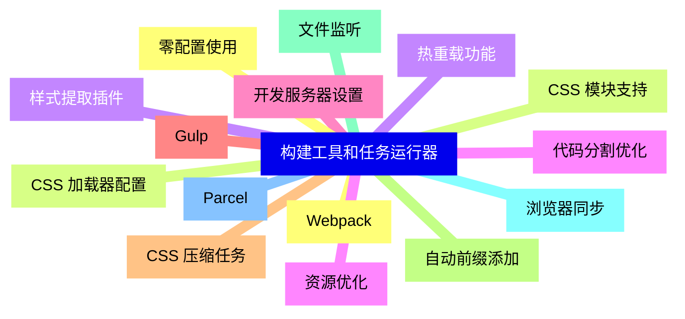
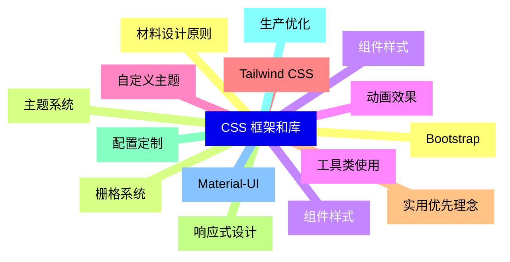
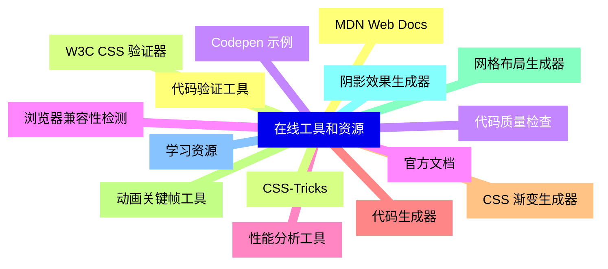
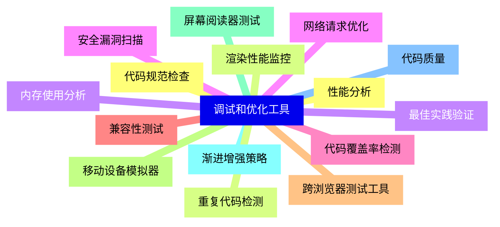
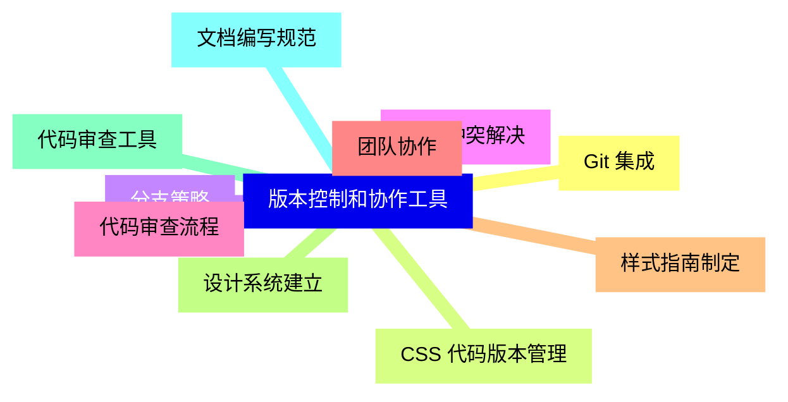
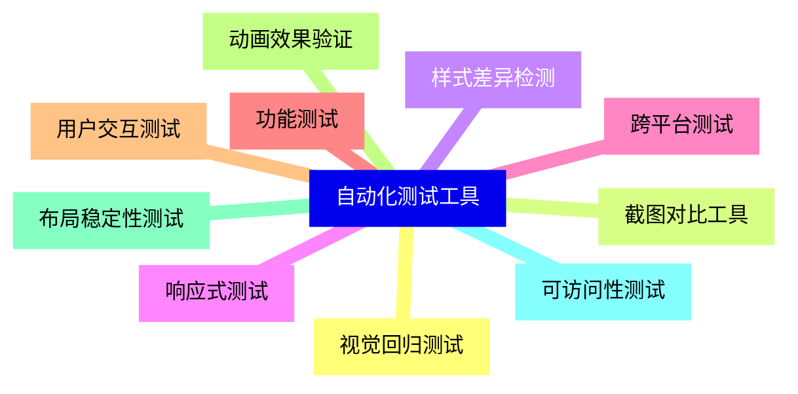
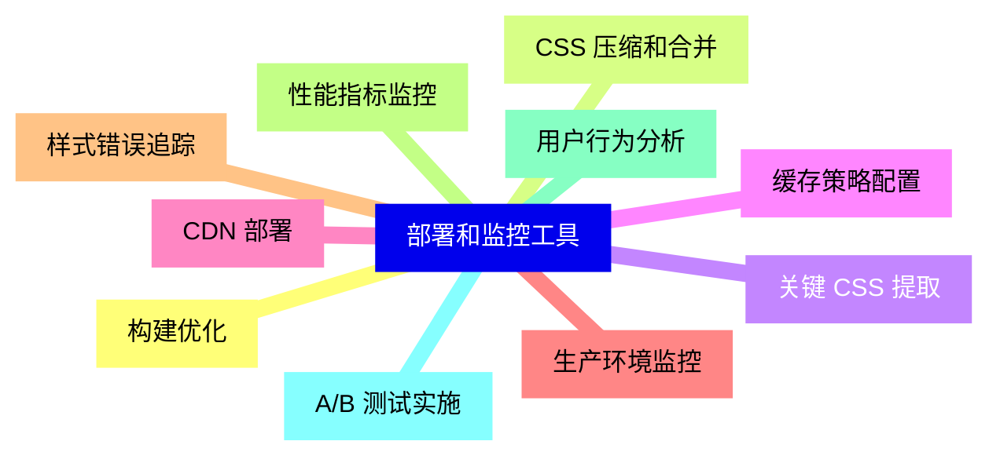


### 1 [代码编辑器](#1)
#### 1.1 [Visual Studio Code](#1)
#### 1.2 [VS Code 安装与配置](#1)
#### 1.3 [常用 CSS 扩展插件](#1)
#### 1.4 [代码片段和快捷键](#1)
#### 1.5 [集成终端使用](#1)
#### 1.6 [Sublime Text](#1)
#### 1.7 [包管理器安装](#1)
#### 1.8 [CSS 相关插件](#1)
#### 1.9 [多行编辑功能](#1)
#### 1.10 [主题和配色方案](#1)
#### 1.11 [Atom](#1)
#### 1.12 [插件生态系统](#1)
#### 1.13 [CSS 代码美化](#1)
#### 1.14 [实时预览功能](#1)
#### 1.15 [项目文件管理](#1)
#### 1.16 [WebStorm](#1)
#### 1.17 [智能代码补全](#1)
#### 1.18 [代码质量分析](#1)
#### 1.19 [调试和测试工具](#1)
#### 1.20 [版本控制集成](#1)
### 2 [浏览器开发者工具](#2)
#### 2.1 [Chrome DevTools](#2)
#### 2.2 [元素检查和样式编辑](#2)
#### 2.3 [盒模型可视化](#2)
#### 2.4 [颜色选择器](#2)
#### 2.5 [动画调试工具](#2)
#### 2.6 [Firefox Developer Tools](#2)
#### 2.7 [网格布局检查器](#2)
#### 2.8 [字体编辑器](#2)
#### 2.9 [CSS 变换工具](#2)
#### 2.10 [性能分析器](#2)
#### 2.11 [Safari Web Inspector](#2)
#### 2.12 [CSS 样式调试](#2)
#### 2.13 [响应式设计模式](#2)
#### 2.14 [存储管理](#2)
#### 2.15 [网络分析](#2)
### 3 [CSS 预处理器工具](#3)
#### 3.1 [Sass/SCSS](#3)
#### 3.2 [变量和混合器](#3)
#### 3.3 [嵌套规则](#3)
#### 3.4 [函数和运算](#3)
#### 3.5 [模块化组织](#3)
#### 3.6 [Less](#3)
#### 3.7 [变量定义](#3)
#### 3.8 [混合使用](#3)
#### 3.9 [函数操作](#3)
#### 3.10 [导入管理](#3)
#### 3.11 [Stylus](#3)
#### 3.12 [灵活的语法](#3)
#### 3.13 [内置函数](#3)
#### 3.14 [条件语句](#3)
#### 3.15 [迭代功能](#3)
### 4 [构建工具和任务运行器](#4)
#### 4.1 [Webpack](#4)
#### 4.2 [CSS 加载器配置](#4)
#### 4.3 [样式提取插件](#4)
#### 4.4 [代码分割优化](#4)
#### 4.5 [开发服务器设置](#4)
#### 4.6 [Gulp](#4)
#### 4.7 [CSS 压缩任务](#4)
#### 4.8 [自动前缀添加](#4)
#### 4.9 [文件监听](#4)
#### 4.10 [浏览器同步](#4)
#### 4.11 [Parcel](#4)
#### 4.12 [零配置使用](#4)
#### 4.13 [CSS 模块支持](#4)
#### 4.14 [热重载功能](#4)
#### 4.15 [资源优化](#4)
### 5 [CSS 框架和库](#5)
#### 5.1 [Bootstrap](#5)
#### 5.2 [栅格系统](#5)
#### 5.3 [组件样式](#5)
#### 5.4 [工具类使用](#5)
#### 5.5 [自定义主题](#5)
#### 5.6 [Tailwind CSS](#5)
#### 5.7 [实用优先理念](#5)
#### 5.8 [响应式设计](#5)
#### 5.9 [配置定制](#5)
#### 5.10 [生产优化](#5)
#### 5.11 [Material-UI](#5)
#### 5.12 [材料设计原则](#5)
#### 5.13 [主题系统](#5)
#### 5.14 [组件样式](#5)
#### 5.15 [动画效果](#5)
### 6 [在线工具和资源](#6)
#### 6.1 [代码验证工具](#6)
#### 6.2 [W3C CSS 验证器](#6)
#### 6.3 [代码质量检查](#6)
#### 6.4 [浏览器兼容性检测](#6)
#### 6.5 [性能分析工具](#6)
#### 6.6 [代码生成器](#6)
#### 6.7 [CSS 渐变生成器](#6)
#### 6.8 [动画关键帧工具](#6)
#### 6.9 [网格布局生成器](#6)
#### 6.10 [阴影效果生成器](#6)
#### 6.11 [学习资源](#6)
#### 6.12 [MDN Web Docs](#6)
#### 6.13 [CSS-Tricks](#6)
#### 6.14 [Codepen 示例](#6)
#### 6.15 [官方文档](#6)
### 7 [调试和优化工具](#7)
#### 7.1 [性能分析](#7)
#### 7.2 [渲染性能监控](#7)
#### 7.3 [内存使用分析](#7)
#### 7.4 [网络请求优化](#7)
#### 7.5 [代码覆盖率检测](#7)
#### 7.6 [兼容性测试](#7)
#### 7.7 [跨浏览器测试工具](#7)
#### 7.8 [移动设备模拟器](#7)
#### 7.9 [屏幕阅读器测试](#7)
#### 7.10 [渐进增强策略](#7)
#### 7.11 [代码质量](#7)
#### 7.12 [代码规范检查](#7)
#### 7.13 [重复代码检测](#7)
#### 7.14 [最佳实践验证](#7)
#### 7.15 [安全漏洞扫描](#7)
### 8 [版本控制和协作工具](#8)
#### 8.1 [Git 集成](#8)
#### 8.2 [CSS 代码版本管理](#8)
#### 8.3 [分支策略](#8)
#### 8.4 [合并冲突解决](#8)
#### 8.5 [代码审查流程](#8)
#### 8.6 [团队协作](#8)
#### 8.7 [样式指南制定](#8)
#### 8.8 [设计系统建立](#8)
#### 8.9 [代码审查工具](#8)
#### 8.10 [文档编写规范](#8)
### 9 [自动化测试工具](#9)
#### 9.1 [视觉回归测试](#9)
#### 9.2 [截图对比工具](#9)
#### 9.3 [样式差异检测](#9)
#### 9.4 [响应式测试](#9)
#### 9.5 [跨平台测试](#9)
#### 9.6 [功能测试](#9)
#### 9.7 [用户交互测试](#9)
#### 9.8 [动画效果验证](#9)
#### 9.9 [布局稳定性测试](#9)
#### 9.10 [可访问性测试](#9)
### 10 [部署和监控工具](#10)
#### 10.1 [构建优化](#10)
#### 10.2 [CSS 压缩和合并](#10)
#### 10.3 [关键 CSS 提取](#10)
#### 10.4 [缓存策略配置](#10)
#### 10.5 [CDN 部署](#10)
#### 10.6 [生产环境监控](#10)
#### 10.7 [样式错误追踪](#10)
#### 10.8 [性能指标监控](#10)
#### 10.9 [用户行为分析](#10)
#### 10.10 [A/B 测试实施](#10)




### 1 代码编辑器

---
### 1 代码编辑器
___
#### 1.1 Visual Studio Code
___
#### 1.2 VS Code 安装与配置
___
#### 1.3 常用 CSS 扩展插件
___
#### 1.4 代码片段和快捷键
___
#### 1.5 集成终端使用
___
#### 1.6 Sublime Text
___
#### 1.7 包管理器安装
___
#### 1.8 CSS 相关插件
___
#### 1.9 多行编辑功能
___
#### 1.10 主题和配色方案
___
#### 1.11 Atom
___
#### 1.12 插件生态系统
___
#### 1.13 CSS 代码美化
___
#### 1.14 实时预览功能
___
#### 1.15 项目文件管理
___
#### 1.16 WebStorm
___
#### 1.17 智能代码补全
___
#### 1.18 代码质量分析
___
#### 1.19 调试和测试工具
___
#### 1.20 版本控制集成
### 2 浏览器开发者工具

---
### 2 浏览器开发者工具
___
#### 2.1 Chrome DevTools
___
#### 2.2 元素检查和样式编辑
___
#### 2.3 盒模型可视化
___
#### 2.4 颜色选择器
___
#### 2.5 动画调试工具
___
#### 2.6 Firefox Developer Tools
___
#### 2.7 网格布局检查器
___
#### 2.8 字体编辑器
___
#### 2.9 CSS 变换工具
___
#### 2.10 性能分析器
___
#### 2.11 Safari Web Inspector
___
#### 2.12 CSS 样式调试
___
#### 2.13 响应式设计模式
___
#### 2.14 存储管理
___
#### 2.15 网络分析
### 3 CSS 预处理器工具

---
### 3 CSS 预处理器工具
___
#### 3.1 Sass/SCSS
___
#### 3.2 变量和混合器
___
#### 3.3 嵌套规则
___
#### 3.4 函数和运算
___
#### 3.5 模块化组织
___
#### 3.6 Less
___
#### 3.7 变量定义
___
#### 3.8 混合使用
___
#### 3.9 函数操作
___
#### 3.10 导入管理
___
#### 3.11 Stylus
___
#### 3.12 灵活的语法
___
#### 3.13 内置函数
___
#### 3.14 条件语句
___
#### 3.15 迭代功能
### 4 构建工具和任务运行器

---
### 4 构建工具和任务运行器
___
#### 4.1 Webpack
___
#### 4.2 CSS 加载器配置
___
#### 4.3 样式提取插件
___
#### 4.4 代码分割优化
___
#### 4.5 开发服务器设置
___
#### 4.6 Gulp
___
#### 4.7 CSS 压缩任务
___
#### 4.8 自动前缀添加
___
#### 4.9 文件监听
___
#### 4.10 浏览器同步
___
#### 4.11 Parcel
___
#### 4.12 零配置使用
___
#### 4.13 CSS 模块支持
___
#### 4.14 热重载功能
___
#### 4.15 资源优化
### 5 CSS 框架和库

---
### 5 CSS 框架和库
___
#### 5.1 Bootstrap
___
#### 5.2 栅格系统
___
#### 5.3 组件样式
___
#### 5.4 工具类使用
___
#### 5.5 自定义主题
___
#### 5.6 Tailwind CSS
___
#### 5.7 实用优先理念
___
#### 5.8 响应式设计
___
#### 5.9 配置定制
___
#### 5.10 生产优化
___
#### 5.11 Material-UI
___
#### 5.12 材料设计原则
___
#### 5.13 主题系统
___
#### 5.14 组件样式
___
#### 5.15 动画效果
### 6 在线工具和资源

---
### 6 在线工具和资源
___
#### 6.1 代码验证工具
___
#### 6.2 W3C CSS 验证器
___
#### 6.3 代码质量检查
___
#### 6.4 浏览器兼容性检测
___
#### 6.5 性能分析工具
___
#### 6.6 代码生成器
___
#### 6.7 CSS 渐变生成器
___
#### 6.8 动画关键帧工具
___
#### 6.9 网格布局生成器
___
#### 6.10 阴影效果生成器
___
#### 6.11 学习资源
___
#### 6.12 MDN Web Docs
___
#### 6.13 CSS-Tricks
___
#### 6.14 Codepen 示例
___
#### 6.15 官方文档
### 7 调试和优化工具

---
### 7 调试和优化工具
___
#### 7.1 性能分析
___
#### 7.2 渲染性能监控
___
#### 7.3 内存使用分析
___
#### 7.4 网络请求优化
___
#### 7.5 代码覆盖率检测
___
#### 7.6 兼容性测试
___
#### 7.7 跨浏览器测试工具
___
#### 7.8 移动设备模拟器
___
#### 7.9 屏幕阅读器测试
___
#### 7.10 渐进增强策略
___
#### 7.11 代码质量
___
#### 7.12 代码规范检查
___
#### 7.13 重复代码检测
___
#### 7.14 最佳实践验证
___
#### 7.15 安全漏洞扫描
### 8 版本控制和协作工具

---
### 8 版本控制和协作工具
___
#### 8.1 Git 集成
___
#### 8.2 CSS 代码版本管理
___
#### 8.3 分支策略
___
#### 8.4 合并冲突解决
___
#### 8.5 代码审查流程
___
#### 8.6 团队协作
___
#### 8.7 样式指南制定
___
#### 8.8 设计系统建立
___
#### 8.9 代码审查工具
___
#### 8.10 文档编写规范
### 9 自动化测试工具

---
### 9 自动化测试工具
___
#### 9.1 视觉回归测试
___
#### 9.2 截图对比工具
___
#### 9.3 样式差异检测
___
#### 9.4 响应式测试
___
#### 9.5 跨平台测试
___
#### 9.6 功能测试
___
#### 9.7 用户交互测试
___
#### 9.8 动画效果验证
___
#### 9.9 布局稳定性测试
___
#### 9.10 可访问性测试
### 10 部署和监控工具

---
### 10 部署和监控工具
___
#### 10.1 构建优化
___
#### 10.2 CSS 压缩和合并
___
#### 10.3 关键 CSS 提取
___
#### 10.4 缓存策略配置
___
#### 10.5 CDN 部署
___
#### 10.6 生产环境监控
___
#### 10.7 样式错误追踪
___
#### 10.8 性能指标监控
___
#### 10.9 用户行为分析
___
#### 10.10 A/B 测试实施


### 1 代码编辑器{#1}

{}

<--->
{}
{}
{}
{}
{}
{}
{}
{}
{}
{}
{}
{}
{}
{}
{}
{}
{}
{}
{}
{}
{}
{}
{}
{}
{}
{}
{}
{}
{}
{}
{}
{}
{}
{}
{}
{}
{}
{}
{}
{}
{}

### 2 浏览器开发者工具{#2}

{}
{}
{}
{}
{}
{}
{}
{}
{}
{}
{}
{}
{}
{}
{}
{}
{}
{}
{}
{}
{}
{}
{}
{}
{}
{}
{}
{}
{}
{}
{}
<--->

{}

### 3 CSS 预处理器工具{#3}

{}

<--->
{}
{}
{}
{}
{}
{}
{}
{}
{}
{}
{}
{}
{}
{}
{}
{}
{}
{}
{}
{}
{}
{}
{}
{}
{}
{}
{}
{}
{}
{}
{}

### 4 构建工具和任务运行器{#4}

{}
{}
{}
{}
{}
{}
{}
{}
{}
{}
{}
{}
{}
{}
{}
{}
{}
{}
{}
{}
{}
{}
{}
{}
{}
{}
{}
{}
{}
{}
{}
<--->

{}

### 5 CSS 框架和库{#5}

{}

<--->
{}
{}
{}
{}
{}
{}
{}
{}
{}
{}
{}
{}
{}
{}
{}
{}
{}
{}
{}
{}
{}
{}
{}
{}
{}
{}
{}
{}
{}
{}
{}

### 6 在线工具和资源{#6}

{}
{}
{}
{}
{}
{}
{}
{}
{}
{}
{}
{}
{}
{}
{}
{}
{}
{}
{}
{}
{}
{}
{}
{}
{}
{}
{}
{}
{}
{}
{}
<--->

{}

### 7 调试和优化工具{#7}

{}

<--->
{}
{}
{}
{}
{}
{}
{}
{}
{}
{}
{}
{}
{}
{}
{}
{}
{}
{}
{}
{}
{}
{}
{}
{}
{}
{}
{}
{}
{}
{}
{}

### 8 版本控制和协作工具{#8}

{}
{}
{}
{}
{}
{}
{}
{}
{}
{}
{}
{}
{}
{}
{}
{}
{}
{}
{}
{}
{}
<--->

{}

### 9 自动化测试工具{#9}

{}

<--->
{}
{}
{}
{}
{}
{}
{}
{}
{}
{}
{}
{}
{}
{}
{}
{}
{}
{}
{}
{}
{}

### 10 部署和监控工具{#10}

{}
{}
{}
{}
{}
{}
{}
{}
{}
{}
{}
{}
{}
{}
{}
{}
{}
{}
{}
{}
{}
<--->

{}
