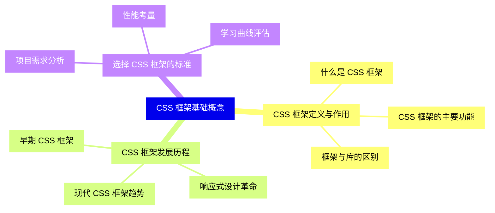
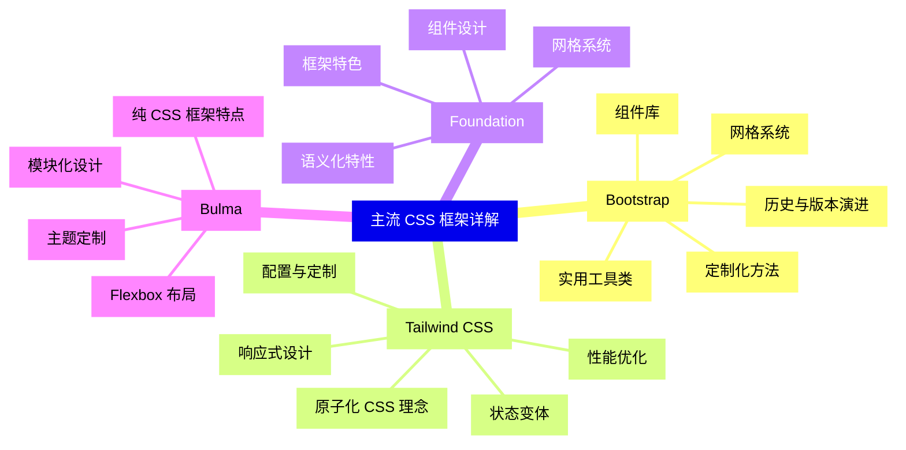
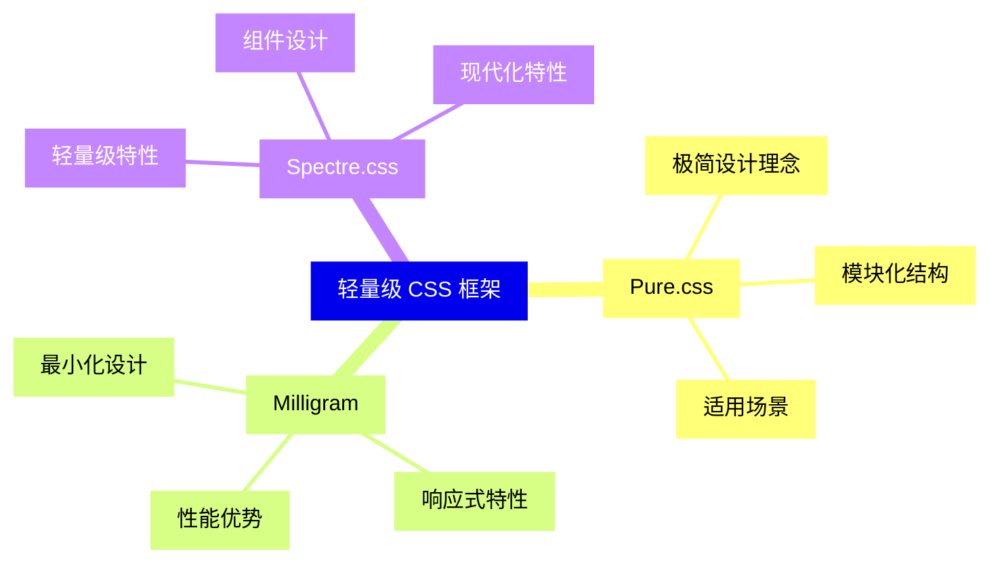
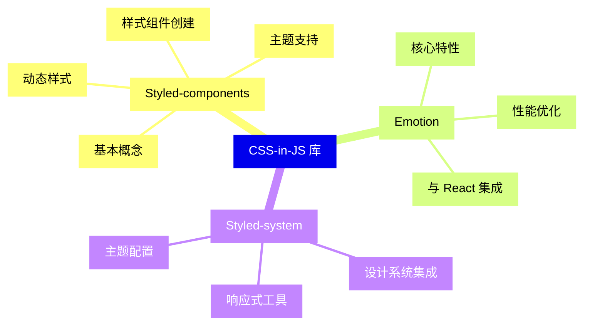
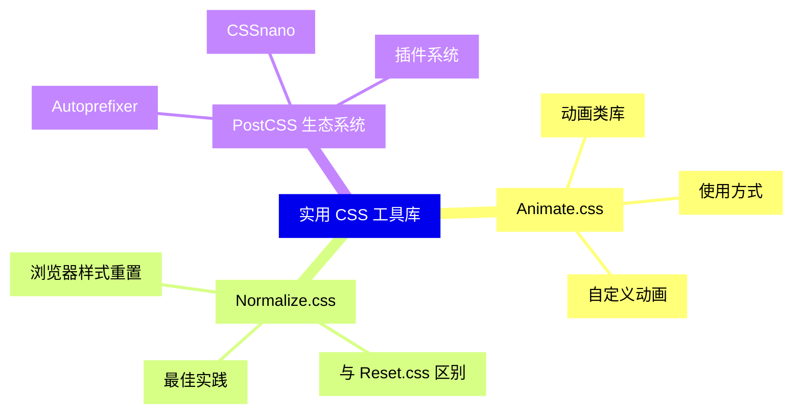
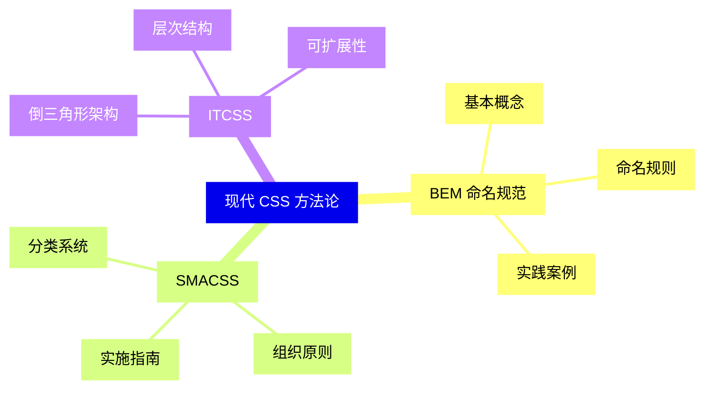
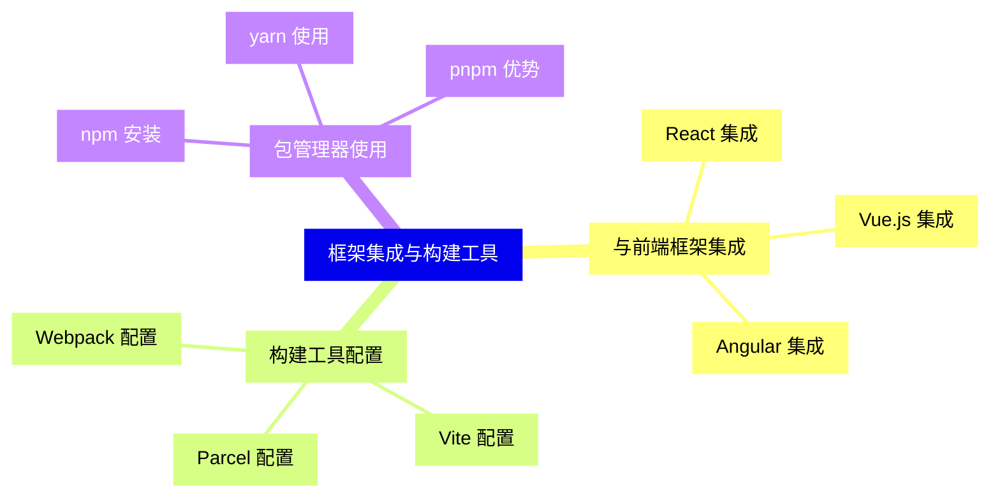
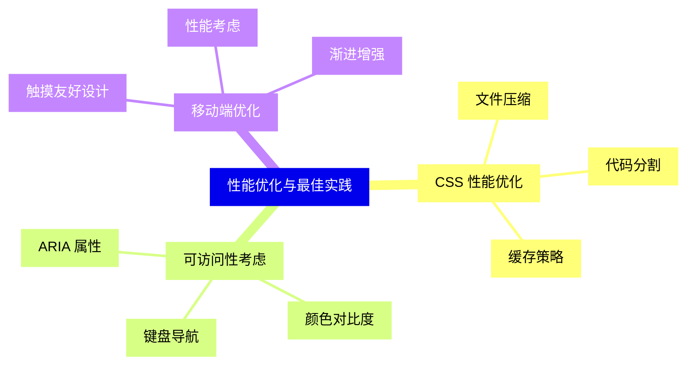
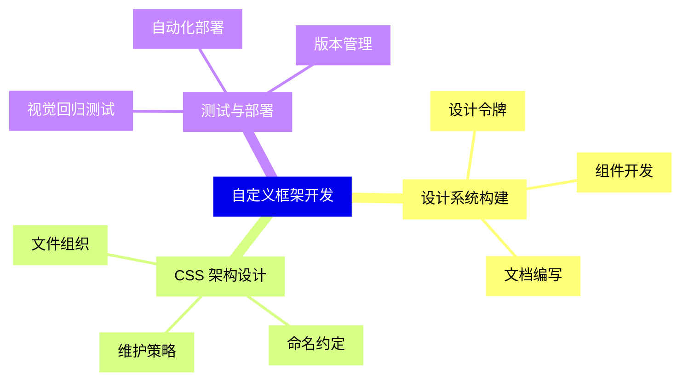
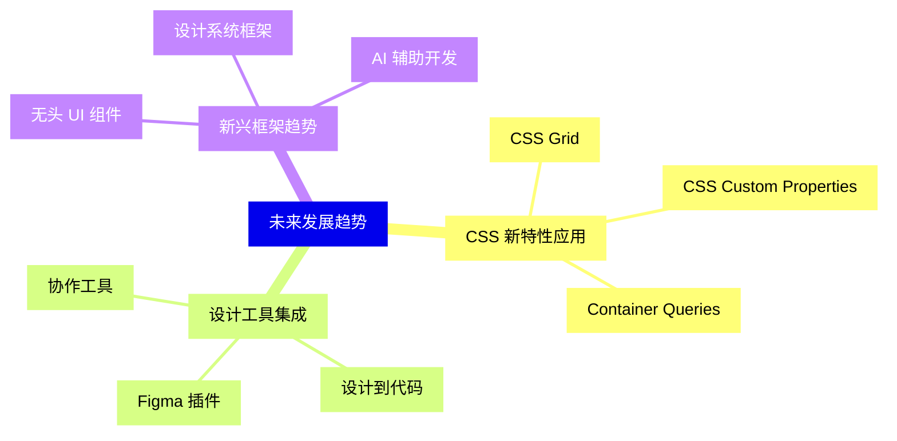


### 1 [CSS 框架基础概念](#1)
#### 1.1 [CSS 框架定义与作用](#1)
##### 1.1.1 [什么是 CSS 框架](#1)
##### 1.1.2 [CSS 框架的主要功能](#1)
##### 1.1.3 [框架与库的区别](#1)
#### 1.2 [CSS 框架发展历程](#1)
##### 1.2.1 [早期 CSS 框架](#1)
##### 1.2.2 [响应式设计革命](#1)
##### 1.2.3 [现代 CSS 框架趋势](#1)
#### 1.3 [选择 CSS 框架的标准](#1)
##### 1.3.1 [项目需求分析](#1)
##### 1.3.2 [性能考量](#1)
##### 1.3.3 [学习曲线评估](#1)
### 2 [主流 CSS 框架详解](#2)
#### 2.1 [Bootstrap](#2)
##### 2.1.1 [历史与版本演进](#2)
##### 2.1.2 [网格系统](#2)
##### 2.1.3 [组件库](#2)
##### 2.1.4 [实用工具类](#2)
##### 2.1.5 [定制化方法](#2)
#### 2.2 [Tailwind CSS](#2)
##### 2.2.1 [原子化 CSS 理念](#2)
##### 2.2.2 [配置与定制](#2)
##### 2.2.3 [响应式设计](#2)
##### 2.2.4 [状态变体](#2)
##### 2.2.5 [性能优化](#2)
#### 2.3 [Foundation](#2)
##### 2.3.1 [框架特色](#2)
##### 2.3.2 [网格系统](#2)
##### 2.3.3 [组件设计](#2)
##### 2.3.4 [语义化特性](#2)
#### 2.4 [Bulma](#2)
##### 2.4.1 [纯 CSS 框架特点](#2)
##### 2.4.2 [Flexbox 布局](#2)
##### 2.4.3 [模块化设计](#2)
##### 2.4.4 [主题定制](#2)
### 3 [轻量级 CSS 框架](#3)
#### 3.1 [Pure.css](#3)
##### 3.1.1 [极简设计理念](#3)
##### 3.1.2 [模块化结构](#3)
##### 3.1.3 [适用场景](#3)
#### 3.2 [Milligram](#3)
##### 3.2.1 [最小化设计](#3)
##### 3.2.2 [响应式特性](#3)
##### 3.2.3 [性能优势](#3)
#### 3.3 [Spectre.css](#3)
##### 3.3.1 [轻量级特性](#3)
##### 3.3.2 [组件设计](#3)
##### 3.3.3 [现代化特性](#3)
### 4 [CSS-in-JS 库](#4)
#### 4.1 [Styled-components](#4)
##### 4.1.1 [基本概念](#4)
##### 4.1.2 [样式组件创建](#4)
##### 4.1.3 [主题支持](#4)
##### 4.1.4 [动态样式](#4)
#### 4.2 [Emotion](#4)
##### 4.2.1 [核心特性](#4)
##### 4.2.2 [性能优化](#4)
##### 4.2.3 [与 React 集成](#4)
#### 4.3 [Styled-system](#4)
##### 4.3.1 [设计系统集成](#4)
##### 4.3.2 [响应式工具](#4)
##### 4.3.3 [主题配置](#4)
### 5 [实用 CSS 工具库](#5)
#### 5.1 [Animate.css](#5)
##### 5.1.1 [动画类库](#5)
##### 5.1.2 [使用方式](#5)
##### 5.1.3 [自定义动画](#5)
#### 5.2 [Normalize.css](#5)
##### 5.2.1 [浏览器样式重置](#5)
##### 5.2.2 [与 Reset.css 区别](#5)
##### 5.2.3 [最佳实践](#5)
#### 5.3 [PostCSS 生态系统](#5)
##### 5.3.1 [Autoprefixer](#5)
##### 5.3.2 [CSSnano](#5)
##### 5.3.3 [插件系统](#5)
### 6 [现代 CSS 方法论](#6)
#### 6.1 [BEM 命名规范](#6)
##### 6.1.1 [基本概念](#6)
##### 6.1.2 [命名规则](#6)
##### 6.1.3 [实践案例](#6)
#### 6.2 [SMACSS](#6)
##### 6.2.1 [分类系统](#6)
##### 6.2.2 [组织原则](#6)
##### 6.2.3 [实施指南](#6)
#### 6.3 [ITCSS](#6)
##### 6.3.1 [倒三角形架构](#6)
##### 6.3.2 [层次结构](#6)
##### 6.3.3 [可扩展性](#6)
### 7 [框架集成与构建工具](#7)
#### 7.1 [与前端框架集成](#7)
##### 7.1.1 [React 集成](#7)
##### 7.1.2 [Vue.js 集成](#7)
##### 7.1.3 [Angular 集成](#7)
#### 7.2 [构建工具配置](#7)
##### 7.2.1 [Webpack 配置](#7)
##### 7.2.2 [Vite 配置](#7)
##### 7.2.3 [Parcel 配置](#7)
#### 7.3 [包管理器使用](#7)
##### 7.3.1 [npm 安装](#7)
##### 7.3.2 [yarn 使用](#7)
##### 7.3.3 [pnpm 优势](#7)
### 8 [性能优化与最佳实践](#8)
#### 8.1 [CSS 性能优化](#8)
##### 8.1.1 [文件压缩](#8)
##### 8.1.2 [代码分割](#8)
##### 8.1.3 [缓存策略](#8)
#### 8.2 [可访问性考虑](#8)
##### 8.2.1 [ARIA 属性](#8)
##### 8.2.2 [颜色对比度](#8)
##### 8.2.3 [键盘导航](#8)
#### 8.3 [移动端优化](#8)
##### 8.3.1 [触摸友好设计](#8)
##### 8.3.2 [性能考虑](#8)
##### 8.3.3 [渐进增强](#8)
### 9 [自定义框架开发](#9)
#### 9.1 [设计系统构建](#9)
##### 9.1.1 [设计令牌](#9)
##### 9.1.2 [组件开发](#9)
##### 9.1.3 [文档编写](#9)
#### 9.2 [CSS 架构设计](#9)
##### 9.2.1 [文件组织](#9)
##### 9.2.2 [命名约定](#9)
##### 9.2.3 [维护策略](#9)
#### 9.3 [测试与部署](#9)
##### 9.3.1 [视觉回归测试](#9)
##### 9.3.2 [自动化部署](#9)
##### 9.3.3 [版本管理](#9)
### 10 [未来发展趋势](#10)
#### 10.1 [CSS 新特性应用](#10)
##### 10.1.1 [CSS Grid](#10)
##### 10.1.2 [CSS Custom Properties](#10)
##### 10.1.3 [Container Queries](#10)
#### 10.2 [设计工具集成](#10)
##### 10.2.1 [Figma 插件](#10)
##### 10.2.2 [设计到代码](#10)
##### 10.2.3 [协作工具](#10)
#### 10.3 [新兴框架趋势](#10)
##### 10.3.1 [无头 UI 组件](#10)
##### 10.3.2 [设计系统框架](#10)
##### 10.3.3 [AI 辅助开发](#10)




### 1 CSS 框架基础概念

---
### 1 CSS 框架基础概念
___
#### 1.1 CSS 框架定义与作用
___
##### 1.1.1 什么是 CSS 框架
___
##### 1.1.2 CSS 框架的主要功能
___
##### 1.1.3 框架与库的区别
___
#### 1.2 CSS 框架发展历程
___
##### 1.2.1 早期 CSS 框架
___
##### 1.2.2 响应式设计革命
___
##### 1.2.3 现代 CSS 框架趋势
___
#### 1.3 选择 CSS 框架的标准
___
##### 1.3.1 项目需求分析
___
##### 1.3.2 性能考量
___
##### 1.3.3 学习曲线评估
### 2 主流 CSS 框架详解

---
### 2 主流 CSS 框架详解
___
#### 2.1 Bootstrap
___
##### 2.1.1 历史与版本演进
___
##### 2.1.2 网格系统
___
##### 2.1.3 组件库
___
##### 2.1.4 实用工具类
___
##### 2.1.5 定制化方法
___
#### 2.2 Tailwind CSS
___
##### 2.2.1 原子化 CSS 理念
___
##### 2.2.2 配置与定制
___
##### 2.2.3 响应式设计
___
##### 2.2.4 状态变体
___
##### 2.2.5 性能优化
___
#### 2.3 Foundation
___
##### 2.3.1 框架特色
___
##### 2.3.2 网格系统
___
##### 2.3.3 组件设计
___
##### 2.3.4 语义化特性
___
#### 2.4 Bulma
___
##### 2.4.1 纯 CSS 框架特点
___
##### 2.4.2 Flexbox 布局
___
##### 2.4.3 模块化设计
___
##### 2.4.4 主题定制
### 3 轻量级 CSS 框架

---
### 3 轻量级 CSS 框架
___
#### 3.1 Pure.css
___
##### 3.1.1 极简设计理念
___
##### 3.1.2 模块化结构
___
##### 3.1.3 适用场景
___
#### 3.2 Milligram
___
##### 3.2.1 最小化设计
___
##### 3.2.2 响应式特性
___
##### 3.2.3 性能优势
___
#### 3.3 Spectre.css
___
##### 3.3.1 轻量级特性
___
##### 3.3.2 组件设计
___
##### 3.3.3 现代化特性
### 4 CSS-in-JS 库

---
### 4 CSS-in-JS 库
___
#### 4.1 Styled-components
___
##### 4.1.1 基本概念
___
##### 4.1.2 样式组件创建
___
##### 4.1.3 主题支持
___
##### 4.1.4 动态样式
___
#### 4.2 Emotion
___
##### 4.2.1 核心特性
___
##### 4.2.2 性能优化
___
##### 4.2.3 与 React 集成
___
#### 4.3 Styled-system
___
##### 4.3.1 设计系统集成
___
##### 4.3.2 响应式工具
___
##### 4.3.3 主题配置
### 5 实用 CSS 工具库

---
### 5 实用 CSS 工具库
___
#### 5.1 Animate.css
___
##### 5.1.1 动画类库
___
##### 5.1.2 使用方式
___
##### 5.1.3 自定义动画
___
#### 5.2 Normalize.css
___
##### 5.2.1 浏览器样式重置
___
##### 5.2.2 与 Reset.css 区别
___
##### 5.2.3 最佳实践
___
#### 5.3 PostCSS 生态系统
___
##### 5.3.1 Autoprefixer
___
##### 5.3.2 CSSnano
___
##### 5.3.3 插件系统
### 6 现代 CSS 方法论

---
### 6 现代 CSS 方法论
___
#### 6.1 BEM 命名规范
___
##### 6.1.1 基本概念
___
##### 6.1.2 命名规则
___
##### 6.1.3 实践案例
___
#### 6.2 SMACSS
___
##### 6.2.1 分类系统
___
##### 6.2.2 组织原则
___
##### 6.2.3 实施指南
___
#### 6.3 ITCSS
___
##### 6.3.1 倒三角形架构
___
##### 6.3.2 层次结构
___
##### 6.3.3 可扩展性
### 7 框架集成与构建工具

---
### 7 框架集成与构建工具
___
#### 7.1 与前端框架集成
___
##### 7.1.1 React 集成
___
##### 7.1.2 Vue.js 集成
___
##### 7.1.3 Angular 集成
___
#### 7.2 构建工具配置
___
##### 7.2.1 Webpack 配置
___
##### 7.2.2 Vite 配置
___
##### 7.2.3 Parcel 配置
___
#### 7.3 包管理器使用
___
##### 7.3.1 npm 安装
___
##### 7.3.2 yarn 使用
___
##### 7.3.3 pnpm 优势
### 8 性能优化与最佳实践

---
### 8 性能优化与最佳实践
___
#### 8.1 CSS 性能优化
___
##### 8.1.1 文件压缩
___
##### 8.1.2 代码分割
___
##### 8.1.3 缓存策略
___
#### 8.2 可访问性考虑
___
##### 8.2.1 ARIA 属性
___
##### 8.2.2 颜色对比度
___
##### 8.2.3 键盘导航
___
#### 8.3 移动端优化
___
##### 8.3.1 触摸友好设计
___
##### 8.3.2 性能考虑
___
##### 8.3.3 渐进增强
### 9 自定义框架开发

---
### 9 自定义框架开发
___
#### 9.1 设计系统构建
___
##### 9.1.1 设计令牌
___
##### 9.1.2 组件开发
___
##### 9.1.3 文档编写
___
#### 9.2 CSS 架构设计
___
##### 9.2.1 文件组织
___
##### 9.2.2 命名约定
___
##### 9.2.3 维护策略
___
#### 9.3 测试与部署
___
##### 9.3.1 视觉回归测试
___
##### 9.3.2 自动化部署
___
##### 9.3.3 版本管理
### 10 未来发展趋势

---
### 10 未来发展趋势
___
#### 10.1 CSS 新特性应用
___
##### 10.1.1 CSS Grid
___
##### 10.1.2 CSS Custom Properties
___
##### 10.1.3 Container Queries
___
#### 10.2 设计工具集成
___
##### 10.2.1 Figma 插件
___
##### 10.2.2 设计到代码
___
##### 10.2.3 协作工具
___
#### 10.3 新兴框架趋势
___
##### 10.3.1 无头 UI 组件
___
##### 10.3.2 设计系统框架
___
##### 10.3.3 AI 辅助开发


### 1 CSS 框架基础概念{#1}

{}

<--->
{}
{}
{}
{}
{}
{}
{}
{}
{}
{}
{}
{}
{}
{}
{}
{}
{}
{}
{}
{}
{}
{}
{}
{}
{}

### 2 主流 CSS 框架详解{#2}

{}
{}
{}
{}
{}
{}
{}
{}
{}
{}
{}
{}
{}
{}
{}
{}
{}
{}
{}
{}
{}
{}
{}
{}
{}
{}
{}
{}
{}
{}
{}
{}
{}
{}
{}
{}
{}
{}
{}
{}
{}
{}
{}
{}
{}
<--->

{}

### 3 轻量级 CSS 框架{#3}

{}

<--->
{}
{}
{}
{}
{}
{}
{}
{}
{}
{}
{}
{}
{}
{}
{}
{}
{}
{}
{}
{}
{}
{}
{}
{}
{}

### 4 CSS-in-JS 库{#4}

{}
{}
{}
{}
{}
{}
{}
{}
{}
{}
{}
{}
{}
{}
{}
{}
{}
{}
{}
{}
{}
{}
{}
{}
{}
{}
{}
<--->

{}

### 5 实用 CSS 工具库{#5}

{}

<--->
{}
{}
{}
{}
{}
{}
{}
{}
{}
{}
{}
{}
{}
{}
{}
{}
{}
{}
{}
{}
{}
{}
{}
{}
{}

### 6 现代 CSS 方法论{#6}

{}
{}
{}
{}
{}
{}
{}
{}
{}
{}
{}
{}
{}
{}
{}
{}
{}
{}
{}
{}
{}
{}
{}
{}
{}
<--->

{}

### 7 框架集成与构建工具{#7}

{}

<--->
{}
{}
{}
{}
{}
{}
{}
{}
{}
{}
{}
{}
{}
{}
{}
{}
{}
{}
{}
{}
{}
{}
{}
{}
{}

### 8 性能优化与最佳实践{#8}

{}
{}
{}
{}
{}
{}
{}
{}
{}
{}
{}
{}
{}
{}
{}
{}
{}
{}
{}
{}
{}
{}
{}
{}
{}
<--->

{}

### 9 自定义框架开发{#9}

{}

<--->
{}
{}
{}
{}
{}
{}
{}
{}
{}
{}
{}
{}
{}
{}
{}
{}
{}
{}
{}
{}
{}
{}
{}
{}
{}

### 10 未来发展趋势{#10}

{}
{}
{}
{}
{}
{}
{}
{}
{}
{}
{}
{}
{}
{}
{}
{}
{}
{}
{}
{}
{}
{}
{}
{}
{}
<--->

{}
