
### 1 [布局系统](#1)
#### 1.1 [Flexbox 布局](#1)
#### 1.2 [Flex 容器属性](#1)
#### 1.3 [Flex 项目属性](#1)
#### 1.4 [主轴与交叉轴概念](#1)
#### 1.5 [响应式 Flex 布局](#1)
#### 1.6 [Grid 布局](#1)
#### 1.7 [网格容器属性](#1)
#### 1.8 [网格项目属性](#1)
#### 1.9 [显式网格与隐式网格](#1)
#### 1.10 [网格模板区域](#1)
#### 1.11 [网格自动布局算法](#1)
#### 1.12 [多列布局](#1)
#### 1.13 [column-count 与 column-width](#1)
#### 1.14 [列间距与列规则](#1)
#### 1.15 [跨列元素设置](#1)
### 2 [响应式设计](#2)
#### 2.1 [媒体查询](#2)
#### 2.2 [视口尺寸查询](#2)
#### 2.3 [设备特性查询](#2)
#### 2.4 [媒体类型与逻辑操作符](#2)
#### 2.5 [响应式断点设置](#2)
#### 2.6 [容器查询](#2)
#### 2.7 [容器查询单位](#2)
#### 2.8 [容器查询条件](#2)
#### 2.9 [容器查询与媒体查询对比](#2)
#### 2.10 [视口单位](#2)
#### 2.11 [vw、vh、vmin、vmax](#2)
#### 2.12 [视口单位的应用场景](#2)
#### 2.13 [移动端适配方案](#2)
### 3 [选择器与伪类](#3)
#### 3.1 [属性选择器](#3)
#### 3.2 [精确匹配与部分匹配](#3)
#### 3.3 [属性值匹配模式](#3)
#### 3.4 [大小写敏感控制](#3)
#### 3.5 [结构伪类](#3)
#### 3.6 [:nth-child   系列](#3)
#### 3.7 [:first-of-type 与 :last-of-type](#3)
#### 3.8 [:only-child 与 :only-of-type](#3)
#### 3.9 [状态伪类](#3)
#### 3.10 [:focus-within](#3)
#### 3.11 [:placeholder-shown](#3)
#### 3.12 [:checked 与 :indeterminate](#3)
#### 3.13 [逻辑组合伪类](#3)
#### 3.14 [:is   选择器](#3)
#### 3.15 [:where   选择器](#3)
#### 3.16 [:has   选择器](#3)
### 4 [自定义属性与变量](#4)
#### 4.1 [CSS 变量定义](#4)
#### 4.2 [全局变量与局部变量](#4)
#### 4.3 [变量继承机制](#4)
#### 4.4 [变量回退值设置](#4)
#### 4.5 [变量应用](#4)
#### 4.6 [颜色主题切换](#4)
#### 4.7 [动态尺寸计算](#4)
#### 4.8 [响应式变量控制](#4)
#### 4.9 [变量与 JavaScript 交互](#4)
#### 4.10 [获取和修改变量值](#4)
#### 4.11 [实时样式更新](#4)
#### 4.12 [主题切换实现](#4)
### 5 [动画与过渡](#5)
#### 5.1 [CSS 过渡](#5)
#### 5.2 [transition 属性详解](#5)
#### 5.3 [缓动函数类型](#5)
#### 5.4 [过渡性能优化](#5)
#### 5.5 [CSS 动画](#5)
#### 5.6 [@keyframes 规则](#5)
#### 5.7 [animation 属性配置](#5)
#### 5.8 [动画填充模式](#5)
#### 5.9 [动画方向控制](#5)
#### 5.10 [变换效果](#5)
#### 5.11 [D 变换函数](#5)
#### 5.12 [D 变换与透视](#5)
#### 5.13 [变换原点设置](#5)
#### 5.14 [变换性能考虑](#5)
### 6 [滤镜与混合模式](#6)
#### 6.1 [滤镜效果](#6)
#### 6.2 [模糊与亮度调整](#6)
#### 6.3 [对比度与饱和度](#6)
#### 6.4 [色相旋转与反转](#6)
#### 6.5 [投影与发光效果](#6)
#### 6.6 [混合模式](#6)
#### 6.7 [背景混合模式](#6)
#### 6.8 [元素混合模式](#6)
#### 6.9 [混合模式应用场景](#6)
#### 6.10 [遮罩与裁剪](#6)
#### 6.11 [clip-path 属性](#6)
#### 6.12 [mask 属性](#6)
#### 6.13 [形状定义与路径裁剪](#6)
### 7 [排版与字体](#7)
#### 7.1 [可变字体](#7)
#### 7.2 [字体轴概念](#7)
#### 7.3 [字重与字宽变化](#7)
#### 7.4 [斜体与光学尺寸](#7)
#### 7.5 [文本效果](#7)
#### 7.6 [text-shadow 高级应用](#7)
#### 7.7 [文字描边效果](#7)
#### 7.8 [文字渐变与图案填充](#7)
#### 7.9 [排版控制](#7)
#### 7.10 [line-clamp 文本截断](#7)
#### 7.11 [首字下沉效果](#7)
#### 7.12 [文本对齐与换行控制](#7)
### 8 [颜色与背景](#8)
#### 8.1 [现代颜色格式](#8)
#### 8.2 [HSL 与 HSLA](#8)
#### 8.3 [RGB 与 RGBA](#8)
#### 8.4 [颜色函数与计算](#8)
#### 8.5 [渐变背景](#8)
#### 8.6 [线性渐变高级用法](#8)
#### 8.7 [径向渐变与锥形渐变](#8)
#### 8.8 [渐变图案与重复渐变](#8)
#### 8.9 [背景混合](#8)
#### 8.10 [background-blend-mode](#8)
#### 8.11 [多重背景叠加](#8)
#### 8.12 [背景裁剪与定位](#8)
### 9 [滚动与交互](#9)
#### 9.1 [滚动行为](#9)
#### 9.2 [scroll-behavior 平滑滚动](#9)
#### 9.3 [滚动捕捉点](#9)
#### 9.4 [自定义滚动条样式](#9)
#### 9.5 [用户交互](#9)
#### 9.6 [pointer-events 控制](#9)
#### 9.7 [user-select 文本选择](#9)
#### 9.8 [touch-action 触摸行为](#9)
#### 9.9 [焦点管理](#9)
#### 9.10 [focus-visible 伪类](#9)
#### 9.11 [焦点轮廓定制](#9)
#### 9.12 [无障碍焦点指示](#9)
### 10 [性能与优化](#10)
#### 10.1 [渲染性能](#10)
#### 10.2 [will-change 属性](#10)
#### 10.3 [合成层优化](#10)
#### 10.4 [重绘与重排避免](#10)
#### 10.5 [加载优化](#10)
#### 10.6 [content-visibility](#10)
#### 10.7 [懒加载技术](#10)
#### 10.8 [关键 CSS 提取](#10)
#### 10.9 [现代单位系统](#10)
#### 10.10 [相对长度单位](#10)
#### 10.11 [容器查询单位](#10)
#### 10.12 [逻辑属性与值](#10)
### 11 [新特性与实验性功能](#11)
#### 11.1 [CSS Houdini](#11)
#### 11.2 [自定义属性与类型](#11)
#### 11.3 [绘制 API](#11)
#### 11.4 [布局与动画工作集](#11)
#### 11.5 [嵌套规则](#11)
#### 11.6 [CSS 原生嵌套语法](#11)
#### 11.7 [嵌套选择器规则](#11)
#### 11.8 [嵌套与特异性关系](#11)
#### 11.9 [层叠层](#11)
#### 11.10 [@layer 规则](#11)
#### 11.11 [层优先级管理](#11)
#### 11.12 [第三方样式集成](#11)
### 12 [工具与工作流](#12)
#### 12.1 [现代 CSS 方法论](#12)
#### 12.2 [BEM 命名规范](#12)
#### 12.3 [ITCSS 架构](#12)
#### 12.4 [原子化 CSS 理念](#12)
#### 12.5 [构建工具集成](#12)
#### 12.6 [PostCSS 插件生态](#12)
#### 12.7 [CSS 模块化方案](#12)
#### 12.8 [样式压缩与优化](#12)
#### 12.9 [测试与调试](#12)
#### 12.10 [浏览器开发者工具](#12)
#### 12.11 [跨浏览器兼容性](#12)
#### 12.12 [性能分析工具](#12)




### 1 布局系统

---
### 1 布局系统
___
#### 1.1 Flexbox 布局
___
#### 1.2 Flex 容器属性
___
#### 1.3 Flex 项目属性
___
#### 1.4 主轴与交叉轴概念
___
#### 1.5 响应式 Flex 布局
___
#### 1.6 Grid 布局
___
#### 1.7 网格容器属性
___
#### 1.8 网格项目属性
___
#### 1.9 显式网格与隐式网格
___
#### 1.10 网格模板区域
___
#### 1.11 网格自动布局算法
___
#### 1.12 多列布局
___
#### 1.13 column-count 与 column-width
___
#### 1.14 列间距与列规则
___
#### 1.15 跨列元素设置
### 2 响应式设计

---
### 2 响应式设计
___
#### 2.1 媒体查询
___
#### 2.2 视口尺寸查询
___
#### 2.3 设备特性查询
___
#### 2.4 媒体类型与逻辑操作符
___
#### 2.5 响应式断点设置
___
#### 2.6 容器查询
___
#### 2.7 容器查询单位
___
#### 2.8 容器查询条件
___
#### 2.9 容器查询与媒体查询对比
___
#### 2.10 视口单位
___
#### 2.11 vw、vh、vmin、vmax
___
#### 2.12 视口单位的应用场景
___
#### 2.13 移动端适配方案
### 3 选择器与伪类

---
### 3 选择器与伪类
___
#### 3.1 属性选择器
___
#### 3.2 精确匹配与部分匹配
___
#### 3.3 属性值匹配模式
___
#### 3.4 大小写敏感控制
___
#### 3.5 结构伪类
___
#### 3.6 :nth-child   系列
___
#### 3.7 :first-of-type 与 :last-of-type
___
#### 3.8 :only-child 与 :only-of-type
___
#### 3.9 状态伪类
___
#### 3.10 :focus-within
___
#### 3.11 :placeholder-shown
___
#### 3.12 :checked 与 :indeterminate
___
#### 3.13 逻辑组合伪类
___
#### 3.14 :is   选择器
___
#### 3.15 :where   选择器
___
#### 3.16 :has   选择器
### 4 自定义属性与变量

---
### 4 自定义属性与变量
___
#### 4.1 CSS 变量定义
___
#### 4.2 全局变量与局部变量
___
#### 4.3 变量继承机制
___
#### 4.4 变量回退值设置
___
#### 4.5 变量应用
___
#### 4.6 颜色主题切换
___
#### 4.7 动态尺寸计算
___
#### 4.8 响应式变量控制
___
#### 4.9 变量与 JavaScript 交互
___
#### 4.10 获取和修改变量值
___
#### 4.11 实时样式更新
___
#### 4.12 主题切换实现
### 5 动画与过渡

---
### 5 动画与过渡
___
#### 5.1 CSS 过渡
___
#### 5.2 transition 属性详解
___
#### 5.3 缓动函数类型
___
#### 5.4 过渡性能优化
___
#### 5.5 CSS 动画
___
#### 5.6 @keyframes 规则
___
#### 5.7 animation 属性配置
___
#### 5.8 动画填充模式
___
#### 5.9 动画方向控制
___
#### 5.10 变换效果
___
#### 5.11 D 变换函数
___
#### 5.12 D 变换与透视
___
#### 5.13 变换原点设置
___
#### 5.14 变换性能考虑
### 6 滤镜与混合模式

---
### 6 滤镜与混合模式
___
#### 6.1 滤镜效果
___
#### 6.2 模糊与亮度调整
___
#### 6.3 对比度与饱和度
___
#### 6.4 色相旋转与反转
___
#### 6.5 投影与发光效果
___
#### 6.6 混合模式
___
#### 6.7 背景混合模式
___
#### 6.8 元素混合模式
___
#### 6.9 混合模式应用场景
___
#### 6.10 遮罩与裁剪
___
#### 6.11 clip-path 属性
___
#### 6.12 mask 属性
___
#### 6.13 形状定义与路径裁剪
### 7 排版与字体

---
### 7 排版与字体
___
#### 7.1 可变字体
___
#### 7.2 字体轴概念
___
#### 7.3 字重与字宽变化
___
#### 7.4 斜体与光学尺寸
___
#### 7.5 文本效果
___
#### 7.6 text-shadow 高级应用
___
#### 7.7 文字描边效果
___
#### 7.8 文字渐变与图案填充
___
#### 7.9 排版控制
___
#### 7.10 line-clamp 文本截断
___
#### 7.11 首字下沉效果
___
#### 7.12 文本对齐与换行控制
### 8 颜色与背景

---
### 8 颜色与背景
___
#### 8.1 现代颜色格式
___
#### 8.2 HSL 与 HSLA
___
#### 8.3 RGB 与 RGBA
___
#### 8.4 颜色函数与计算
___
#### 8.5 渐变背景
___
#### 8.6 线性渐变高级用法
___
#### 8.7 径向渐变与锥形渐变
___
#### 8.8 渐变图案与重复渐变
___
#### 8.9 背景混合
___
#### 8.10 background-blend-mode
___
#### 8.11 多重背景叠加
___
#### 8.12 背景裁剪与定位
### 9 滚动与交互

---
### 9 滚动与交互
___
#### 9.1 滚动行为
___
#### 9.2 scroll-behavior 平滑滚动
___
#### 9.3 滚动捕捉点
___
#### 9.4 自定义滚动条样式
___
#### 9.5 用户交互
___
#### 9.6 pointer-events 控制
___
#### 9.7 user-select 文本选择
___
#### 9.8 touch-action 触摸行为
___
#### 9.9 焦点管理
___
#### 9.10 focus-visible 伪类
___
#### 9.11 焦点轮廓定制
___
#### 9.12 无障碍焦点指示
### 10 性能与优化

---
### 10 性能与优化
___
#### 10.1 渲染性能
___
#### 10.2 will-change 属性
___
#### 10.3 合成层优化
___
#### 10.4 重绘与重排避免
___
#### 10.5 加载优化
___
#### 10.6 content-visibility
___
#### 10.7 懒加载技术
___
#### 10.8 关键 CSS 提取
___
#### 10.9 现代单位系统
___
#### 10.10 相对长度单位
___
#### 10.11 容器查询单位
___
#### 10.12 逻辑属性与值
### 11 新特性与实验性功能

---
### 11 新特性与实验性功能
___
#### 11.1 CSS Houdini
___
#### 11.2 自定义属性与类型
___
#### 11.3 绘制 API
___
#### 11.4 布局与动画工作集
___
#### 11.5 嵌套规则
___
#### 11.6 CSS 原生嵌套语法
___
#### 11.7 嵌套选择器规则
___
#### 11.8 嵌套与特异性关系
___
#### 11.9 层叠层
___
#### 11.10 @layer 规则
___
#### 11.11 层优先级管理
___
#### 11.12 第三方样式集成
### 12 工具与工作流

---
### 12 工具与工作流
___
#### 12.1 现代 CSS 方法论
___
#### 12.2 BEM 命名规范
___
#### 12.3 ITCSS 架构
___
#### 12.4 原子化 CSS 理念
___
#### 12.5 构建工具集成
___
#### 12.6 PostCSS 插件生态
___
#### 12.7 CSS 模块化方案
___
#### 12.8 样式压缩与优化
___
#### 12.9 测试与调试
___
#### 12.10 浏览器开发者工具
___
#### 12.11 跨浏览器兼容性
___
#### 12.12 性能分析工具


### 1 布局系统{#1}

{}
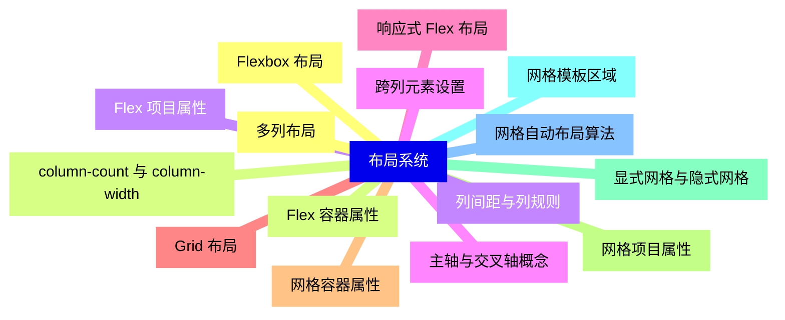

<--->
{}
{}
{}
{}
{}
{}
{}
{}
{}
{}
{}
{}
{}
{}
{}
{}
{}
{}
{}
{}
{}
{}
{}
{}
{}
{}
{}
{}
{}
{}
{}

### 2 响应式设计{#2}

{}
{}
{}
{}
{}
{}
{}
{}
{}
{}
{}
{}
{}
{}
{}
{}
{}
{}
{}
{}
{}
{}
{}
{}
{}
{}
{}
<--->
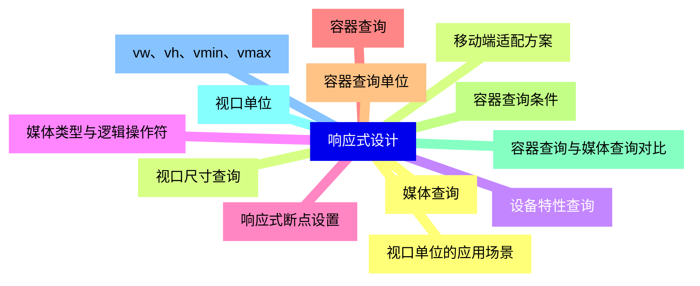

{}

### 3 选择器与伪类{#3}

{}
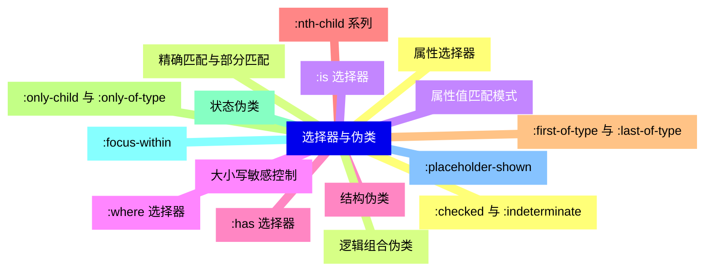

<--->
{}
{}
{}
{}
{}
{}
{}
{}
{}
{}
{}
{}
{}
{}
{}
{}
{}
{}
{}
{}
{}
{}
{}
{}
{}
{}
{}
{}
{}
{}
{}
{}
{}

### 4 自定义属性与变量{#4}

{}
{}
{}
{}
{}
{}
{}
{}
{}
{}
{}
{}
{}
{}
{}
{}
{}
{}
{}
{}
{}
{}
{}
{}
{}
<--->
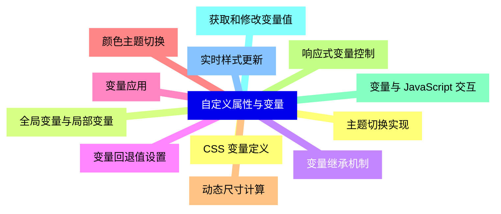

{}

### 5 动画与过渡{#5}

{}
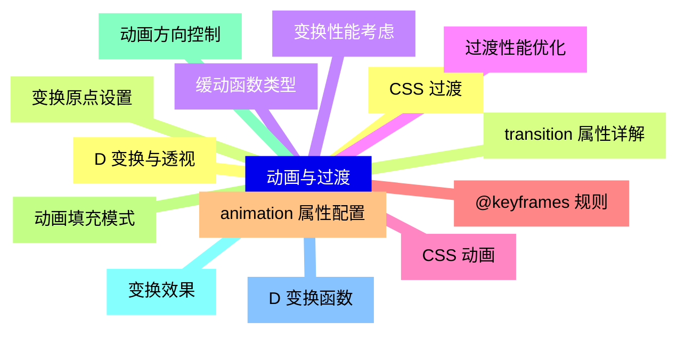

<--->
{}
{}
{}
{}
{}
{}
{}
{}
{}
{}
{}
{}
{}
{}
{}
{}
{}
{}
{}
{}
{}
{}
{}
{}
{}
{}
{}
{}
{}

### 6 滤镜与混合模式{#6}

{}
{}
{}
{}
{}
{}
{}
{}
{}
{}
{}
{}
{}
{}
{}
{}
{}
{}
{}
{}
{}
{}
{}
{}
{}
{}
{}
<--->
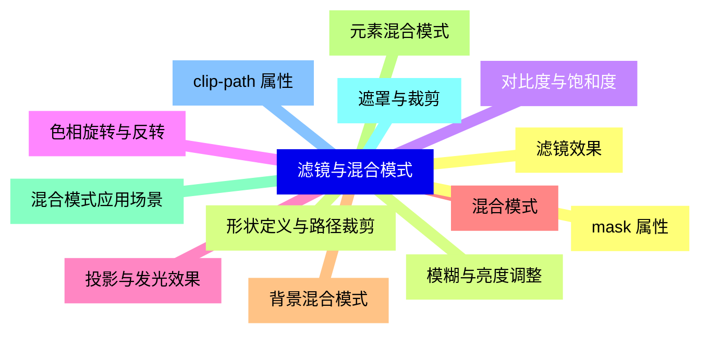

{}

### 7 排版与字体{#7}

{}
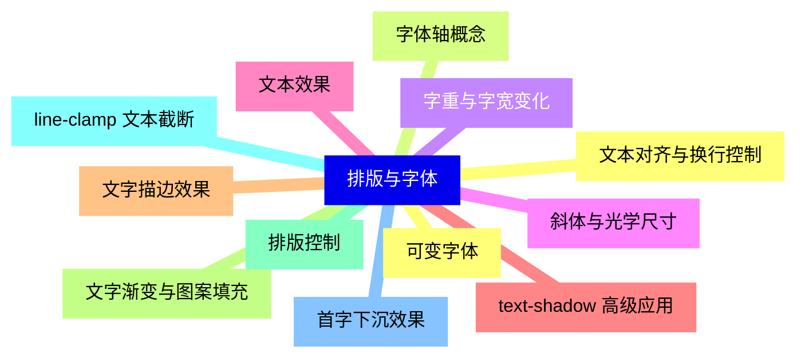

<--->
{}
{}
{}
{}
{}
{}
{}
{}
{}
{}
{}
{}
{}
{}
{}
{}
{}
{}
{}
{}
{}
{}
{}
{}
{}

### 8 颜色与背景{#8}

{}
{}
{}
{}
{}
{}
{}
{}
{}
{}
{}
{}
{}
{}
{}
{}
{}
{}
{}
{}
{}
{}
{}
{}
{}
<--->
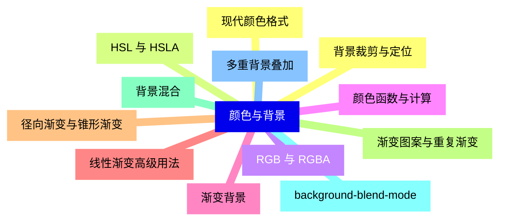

{}

### 9 滚动与交互{#9}

{}
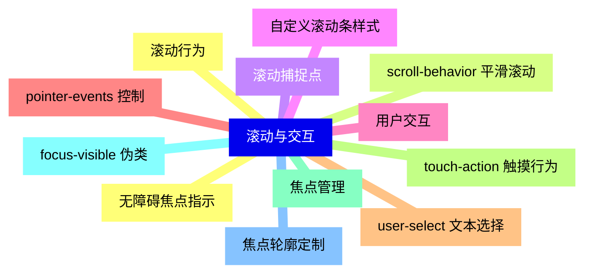

<--->
{}
{}
{}
{}
{}
{}
{}
{}
{}
{}
{}
{}
{}
{}
{}
{}
{}
{}
{}
{}
{}
{}
{}
{}
{}

### 10 性能与优化{#10}

{}
{}
{}
{}
{}
{}
{}
{}
{}
{}
{}
{}
{}
{}
{}
{}
{}
{}
{}
{}
{}
{}
{}
{}
{}
<--->
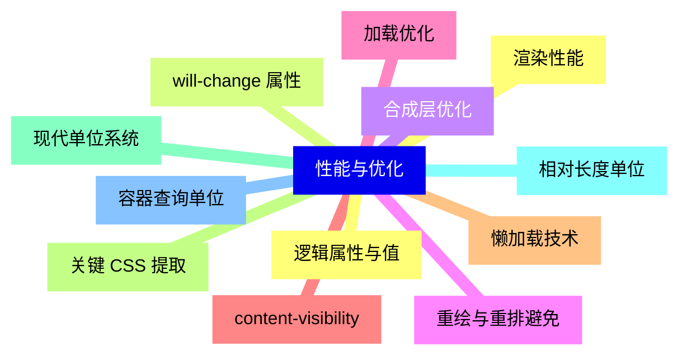

{}

### 11 新特性与实验性功能{#11}

{}
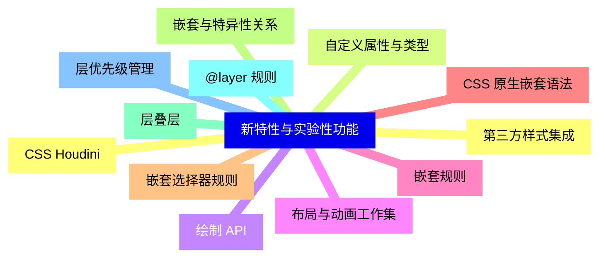

<--->
{}
{}
{}
{}
{}
{}
{}
{}
{}
{}
{}
{}
{}
{}
{}
{}
{}
{}
{}
{}
{}
{}
{}
{}
{}

### 12 工具与工作流{#12}

{}
{}
{}
{}
{}
{}
{}
{}
{}
{}
{}
{}
{}
{}
{}
{}
{}
{}
{}
{}
{}
{}
{}
{}
{}
<--->
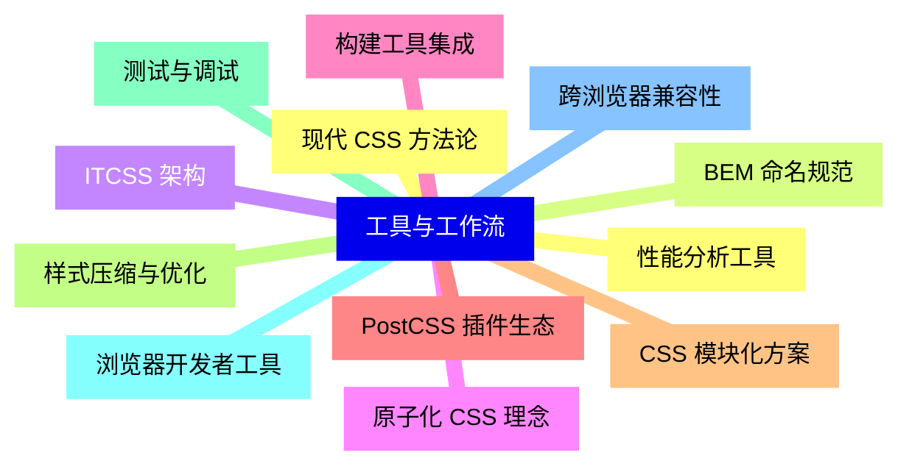

{}
