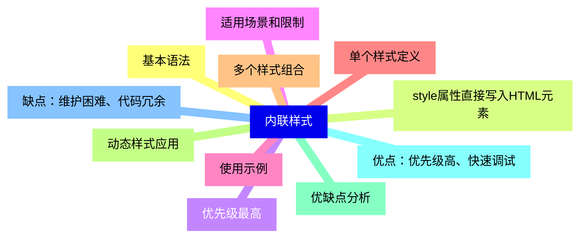
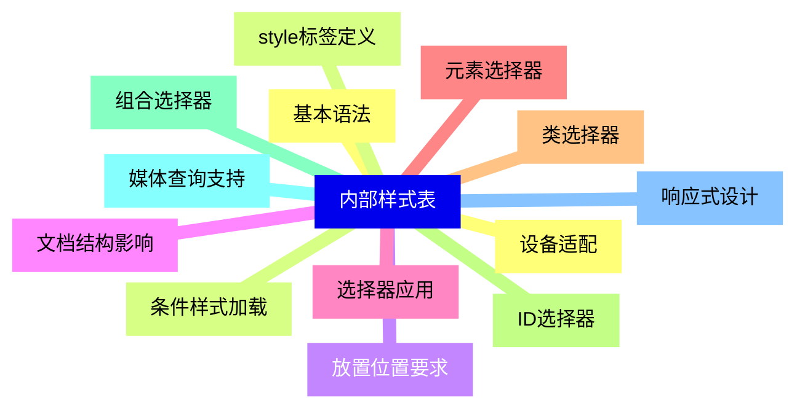
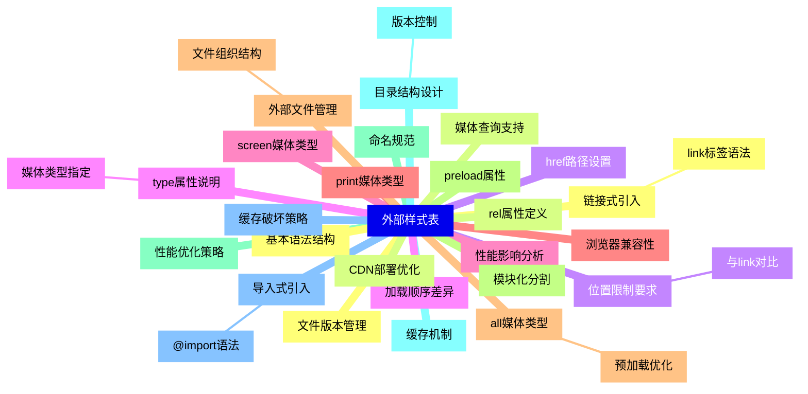
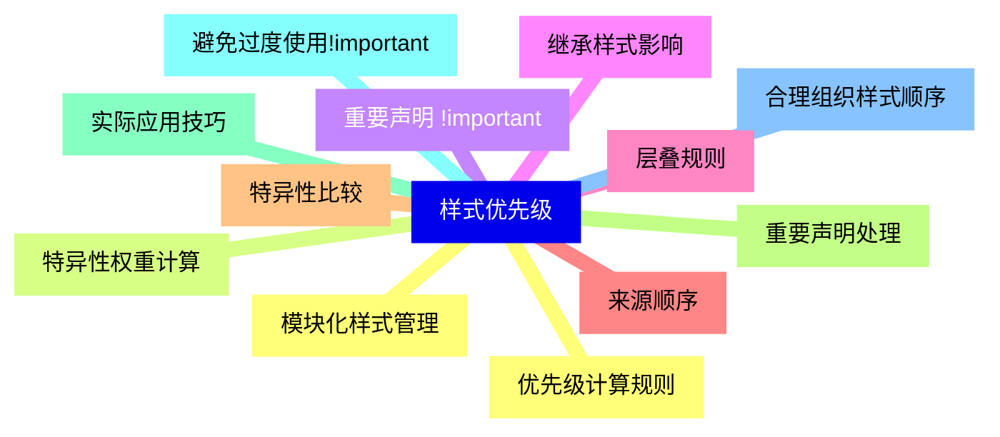
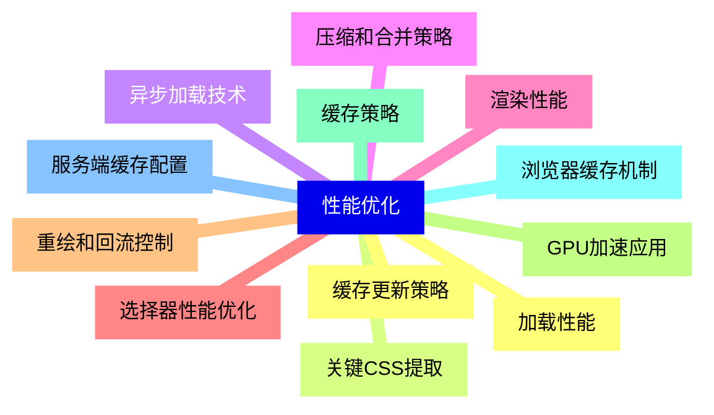
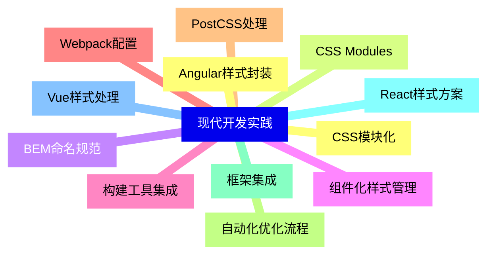
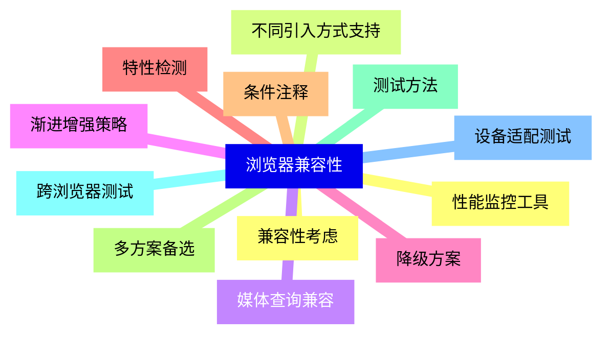


### 1 [内联样式](#1)
#### 1.1 [基本语法](#1)
#### 1.2 [style属性直接写入HTML元素](#1)
#### 1.3 [优先级最高](#1)
#### 1.4 [适用场景和限制](#1)
#### 1.5 [使用示例](#1)
#### 1.6 [单个样式定义](#1)
#### 1.7 [多个样式组合](#1)
#### 1.8 [动态样式应用](#1)
#### 1.9 [优缺点分析](#1)
#### 1.10 [优点：优先级高、快速调试](#1)
#### 1.11 [缺点：维护困难、代码冗余](#1)
### 2 [内部样式表](#2)
#### 2.1 [基本语法](#2)
#### 2.2 [style标签定义](#2)
#### 2.3 [放置位置要求](#2)
#### 2.4 [文档结构影响](#2)
#### 2.5 [选择器应用](#2)
#### 2.6 [元素选择器](#2)
#### 2.7 [类选择器](#2)
#### 2.8 [ID选择器](#2)
#### 2.9 [组合选择器](#2)
#### 2.10 [媒体查询支持](#2)
#### 2.11 [响应式设计](#2)
#### 2.12 [设备适配](#2)
#### 2.13 [条件样式加载](#2)
### 3 [外部样式表](#3)
#### 3.1 [链接式引入](#3)
##### 3.1.1 [link标签语法](#3)
#### 3.2 [rel属性定义](#3)
#### 3.3 [href路径设置](#3)
#### 3.4 [type属性说明](#3)
##### 3.4.1 [媒体类型指定](#3)
#### 3.5 [screen媒体类型](#3)
#### 3.6 [print媒体类型](#3)
#### 3.7 [all媒体类型](#3)
##### 3.7.1 [预加载优化](#3)
#### 3.8 [preload属性](#3)
#### 3.9 [性能优化策略](#3)
#### 3.10 [缓存机制](#3)
#### 3.11 [导入式引入](#3)
##### 3.11.1 [@import语法](#3)
#### 3.12 [基本语法结构](#3)
#### 3.13 [媒体查询支持](#3)
#### 3.14 [位置限制要求](#3)
##### 3.14.1 [与link对比](#3)
#### 3.15 [加载顺序差异](#3)
#### 3.16 [性能影响分析](#3)
#### 3.17 [浏览器兼容性](#3)
#### 3.18 [外部文件管理](#3)
##### 3.18.1 [文件组织结构](#3)
#### 3.19 [模块化分割](#3)
#### 3.20 [命名规范](#3)
#### 3.21 [目录结构设计](#3)
##### 3.21.1 [版本控制](#3)
#### 3.22 [缓存破坏策略](#3)
#### 3.23 [文件版本管理](#3)
#### 3.24 [CDN部署优化](#3)
### 4 [样式优先级](#4)
#### 4.1 [优先级计算规则](#4)
#### 4.2 [特异性权重计算](#4)
#### 4.3 [重要声明 !important](#4)
#### 4.4 [继承样式影响](#4)
#### 4.5 [层叠规则](#4)
#### 4.6 [来源顺序](#4)
#### 4.7 [特异性比较](#4)
#### 4.8 [重要声明处理](#4)
#### 4.9 [实际应用技巧](#4)
#### 4.10 [避免过度使用!important](#4)
#### 4.11 [合理组织样式顺序](#4)
#### 4.12 [模块化样式管理](#4)
### 5 [性能优化](#5)
#### 5.1 [加载性能](#5)
#### 5.2 [关键CSS提取](#5)
#### 5.3 [异步加载技术](#5)
#### 5.4 [压缩和合并策略](#5)
#### 5.5 [渲染性能](#5)
#### 5.6 [选择器性能优化](#5)
#### 5.7 [重绘和回流控制](#5)
#### 5.8 [GPU加速应用](#5)
#### 5.9 [缓存策略](#5)
#### 5.10 [浏览器缓存机制](#5)
#### 5.11 [服务端缓存配置](#5)
#### 5.12 [缓存更新策略](#5)
### 6 [现代开发实践](#6)
#### 6.1 [CSS模块化](#6)
#### 6.2 [CSS Modules](#6)
#### 6.3 [BEM命名规范](#6)
#### 6.4 [组件化样式管理](#6)
#### 6.5 [构建工具集成](#6)
#### 6.6 [Webpack配置](#6)
#### 6.7 [PostCSS处理](#6)
#### 6.8 [自动化优化流程](#6)
#### 6.9 [框架集成](#6)
#### 6.10 [React样式方案](#6)
#### 6.11 [Vue样式处理](#6)
#### 6.12 [Angular样式封装](#6)
### 7 [浏览器兼容性](#7)
#### 7.1 [兼容性考虑](#7)
#### 7.2 [不同引入方式支持](#7)
#### 7.3 [媒体查询兼容](#7)
#### 7.4 [渐进增强策略](#7)
#### 7.5 [降级方案](#7)
#### 7.6 [特性检测](#7)
#### 7.7 [条件注释](#7)
#### 7.8 [多方案备选](#7)
#### 7.9 [测试方法](#7)
#### 7.10 [跨浏览器测试](#7)
#### 7.11 [设备适配测试](#7)
#### 7.12 [性能监控工具](#7)




### 1 内联样式

---
### 1 内联样式
___
#### 1.1 基本语法
___
#### 1.2 style属性直接写入HTML元素
___
#### 1.3 优先级最高
___
#### 1.4 适用场景和限制
___
#### 1.5 使用示例
___
#### 1.6 单个样式定义
___
#### 1.7 多个样式组合
___
#### 1.8 动态样式应用
___
#### 1.9 优缺点分析
___
#### 1.10 优点：优先级高、快速调试
___
#### 1.11 缺点：维护困难、代码冗余
### 2 内部样式表

---
### 2 内部样式表
___
#### 2.1 基本语法
___
#### 2.2 style标签定义
___
#### 2.3 放置位置要求
___
#### 2.4 文档结构影响
___
#### 2.5 选择器应用
___
#### 2.6 元素选择器
___
#### 2.7 类选择器
___
#### 2.8 ID选择器
___
#### 2.9 组合选择器
___
#### 2.10 媒体查询支持
___
#### 2.11 响应式设计
___
#### 2.12 设备适配
___
#### 2.13 条件样式加载
### 3 外部样式表

---
### 3 外部样式表
___
#### 3.1 链接式引入
___
##### 3.1.1 link标签语法
___
#### 3.2 rel属性定义
___
#### 3.3 href路径设置
___
#### 3.4 type属性说明
___
##### 3.4.1 媒体类型指定
___
#### 3.5 screen媒体类型
___
#### 3.6 print媒体类型
___
#### 3.7 all媒体类型
___
##### 3.7.1 预加载优化
___
#### 3.8 preload属性
___
#### 3.9 性能优化策略
___
#### 3.10 缓存机制
___
#### 3.11 导入式引入
___
##### 3.11.1 @import语法
___
#### 3.12 基本语法结构
___
#### 3.13 媒体查询支持
___
#### 3.14 位置限制要求
___
##### 3.14.1 与link对比
___
#### 3.15 加载顺序差异
___
#### 3.16 性能影响分析
___
#### 3.17 浏览器兼容性
___
#### 3.18 外部文件管理
___
##### 3.18.1 文件组织结构
___
#### 3.19 模块化分割
___
#### 3.20 命名规范
___
#### 3.21 目录结构设计
___
##### 3.21.1 版本控制
___
#### 3.22 缓存破坏策略
___
#### 3.23 文件版本管理
___
#### 3.24 CDN部署优化
### 4 样式优先级

---
### 4 样式优先级
___
#### 4.1 优先级计算规则
___
#### 4.2 特异性权重计算
___
#### 4.3 重要声明 !important
___
#### 4.4 继承样式影响
___
#### 4.5 层叠规则
___
#### 4.6 来源顺序
___
#### 4.7 特异性比较
___
#### 4.8 重要声明处理
___
#### 4.9 实际应用技巧
___
#### 4.10 避免过度使用!important
___
#### 4.11 合理组织样式顺序
___
#### 4.12 模块化样式管理
### 5 性能优化

---
### 5 性能优化
___
#### 5.1 加载性能
___
#### 5.2 关键CSS提取
___
#### 5.3 异步加载技术
___
#### 5.4 压缩和合并策略
___
#### 5.5 渲染性能
___
#### 5.6 选择器性能优化
___
#### 5.7 重绘和回流控制
___
#### 5.8 GPU加速应用
___
#### 5.9 缓存策略
___
#### 5.10 浏览器缓存机制
___
#### 5.11 服务端缓存配置
___
#### 5.12 缓存更新策略
### 6 现代开发实践

---
### 6 现代开发实践
___
#### 6.1 CSS模块化
___
#### 6.2 CSS Modules
___
#### 6.3 BEM命名规范
___
#### 6.4 组件化样式管理
___
#### 6.5 构建工具集成
___
#### 6.6 Webpack配置
___
#### 6.7 PostCSS处理
___
#### 6.8 自动化优化流程
___
#### 6.9 框架集成
___
#### 6.10 React样式方案
___
#### 6.11 Vue样式处理
___
#### 6.12 Angular样式封装
### 7 浏览器兼容性

---
### 7 浏览器兼容性
___
#### 7.1 兼容性考虑
___
#### 7.2 不同引入方式支持
___
#### 7.3 媒体查询兼容
___
#### 7.4 渐进增强策略
___
#### 7.5 降级方案
___
#### 7.6 特性检测
___
#### 7.7 条件注释
___
#### 7.8 多方案备选
___
#### 7.9 测试方法
___
#### 7.10 跨浏览器测试
___
#### 7.11 设备适配测试
___
#### 7.12 性能监控工具


### 1 内联样式{#1}

{}

<--->
{}
{}
{}
{}
{}
{}
{}
{}
{}
{}
{}
{}
{}
{}
{}
{}
{}
{}
{}
{}
{}
{}
{}

### 2 内部样式表{#2}

{}
{}
{}
{}
{}
{}
{}
{}
{}
{}
{}
{}
{}
{}
{}
{}
{}
{}
{}
{}
{}
{}
{}
{}
{}
{}
{}
<--->

{}

### 3 外部样式表{#3}

{}

<--->
{}
{}
{}
{}
{}
{}
{}
{}
{}
{}
{}
{}
{}
{}
{}
{}
{}
{}
{}
{}
{}
{}
{}
{}
{}
{}
{}
{}
{}
{}
{}
{}
{}
{}
{}
{}
{}
{}
{}
{}
{}
{}
{}
{}
{}
{}
{}
{}
{}
{}
{}
{}
{}
{}
{}
{}
{}
{}
{}
{}
{}
{}
{}

### 4 样式优先级{#4}

{}
{}
{}
{}
{}
{}
{}
{}
{}
{}
{}
{}
{}
{}
{}
{}
{}
{}
{}
{}
{}
{}
{}
{}
{}
<--->

{}

### 5 性能优化{#5}

{}

<--->
{}
{}
{}
{}
{}
{}
{}
{}
{}
{}
{}
{}
{}
{}
{}
{}
{}
{}
{}
{}
{}
{}
{}
{}
{}

### 6 现代开发实践{#6}

{}
{}
{}
{}
{}
{}
{}
{}
{}
{}
{}
{}
{}
{}
{}
{}
{}
{}
{}
{}
{}
{}
{}
{}
{}
<--->

{}

### 7 浏览器兼容性{#7}

{}

<--->
{}
{}
{}
{}
{}
{}
{}
{}
{}
{}
{}
{}
{}
{}
{}
{}
{}
{}
{}
{}
{}
{}
{}
{}
{}
