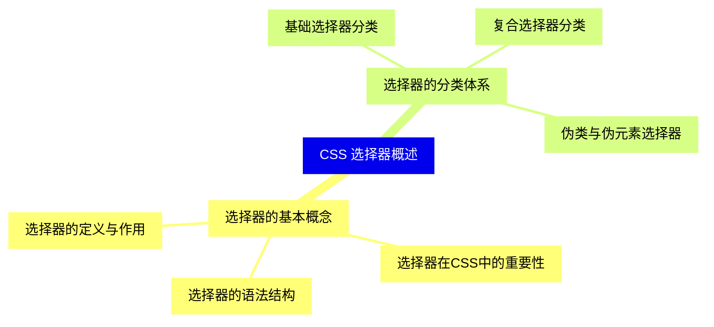
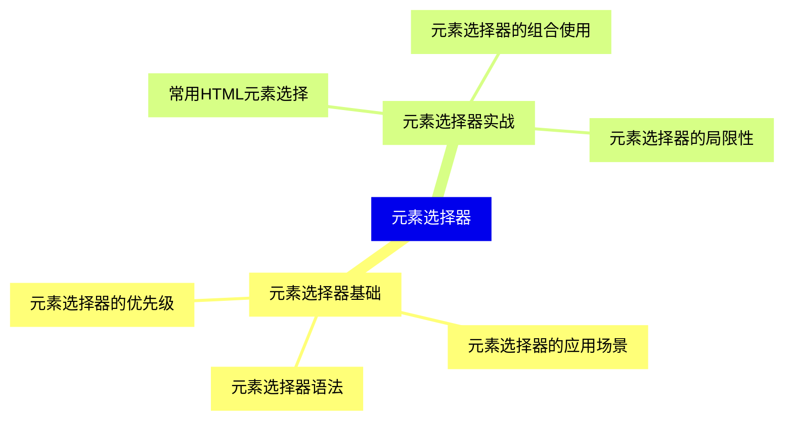
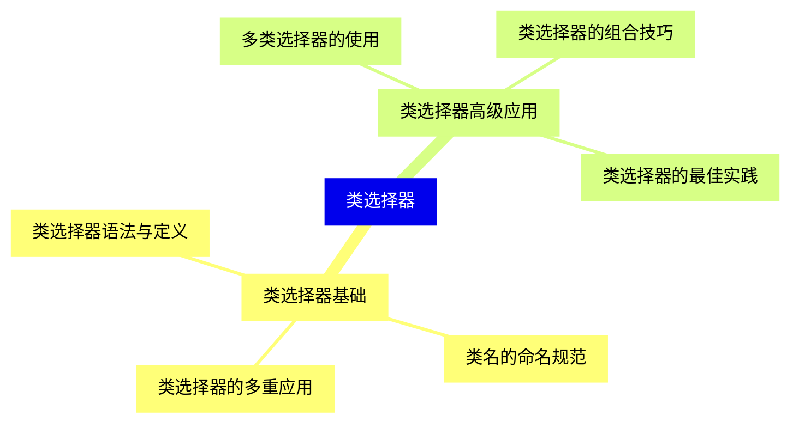
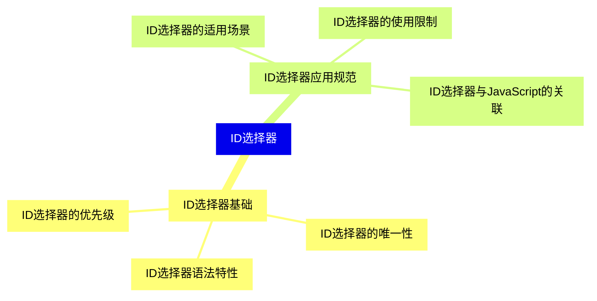
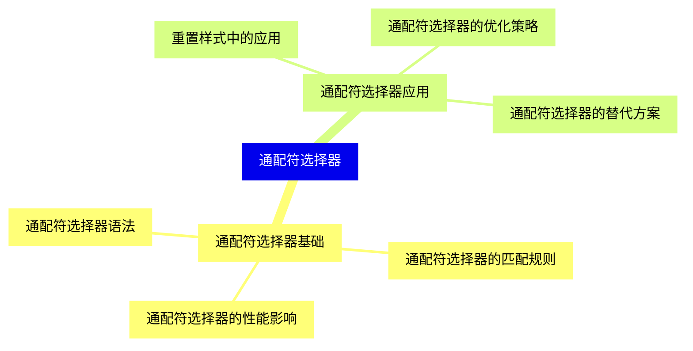
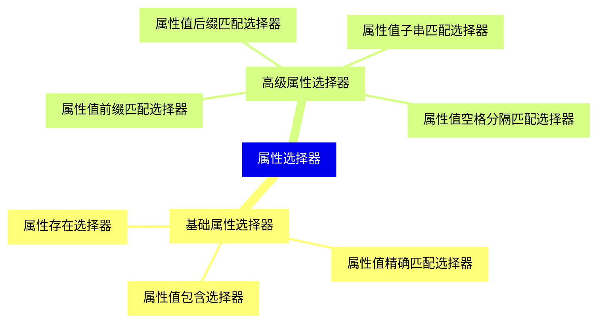
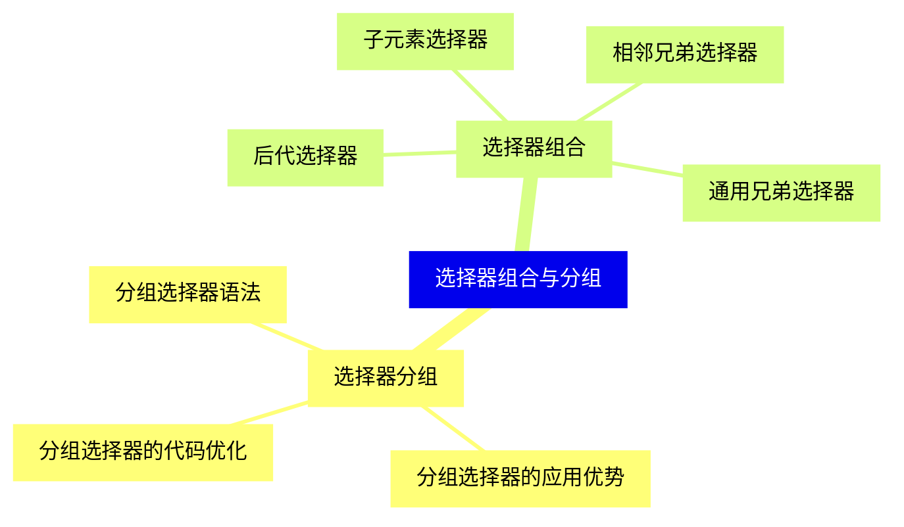
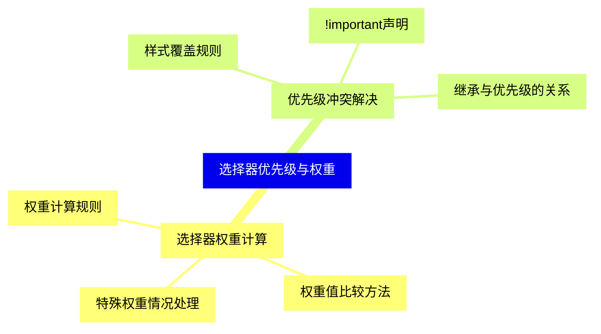
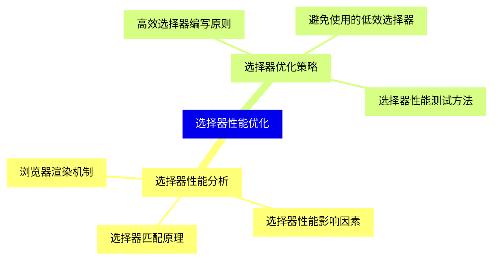
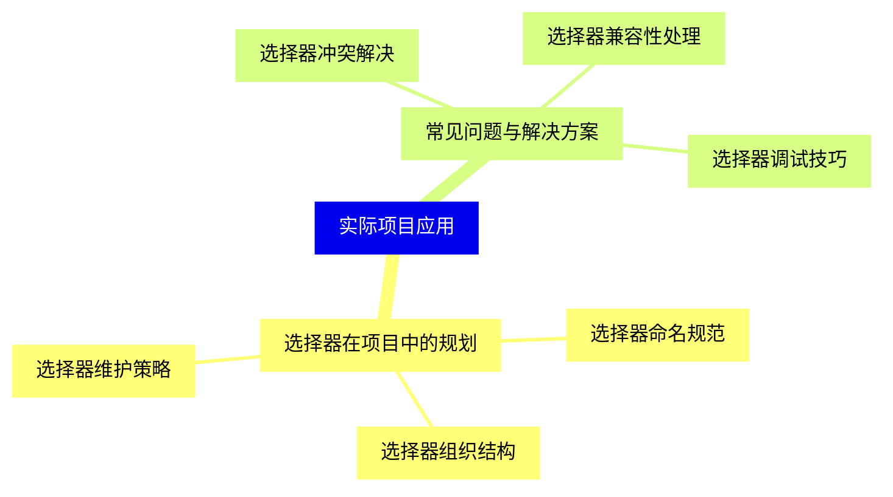


### 1 [CSS 选择器概述](#1)
#### 1.1 [选择器的基本概念](#1)
##### 1.1.1 [选择器的定义与作用](#1)
##### 1.1.2 [选择器在CSS中的重要性](#1)
##### 1.1.3 [选择器的语法结构](#1)
#### 1.2 [选择器的分类体系](#1)
##### 1.2.1 [基础选择器分类](#1)
##### 1.2.2 [复合选择器分类](#1)
##### 1.2.3 [伪类与伪元素选择器](#1)
### 2 [元素选择器](#2)
#### 2.1 [元素选择器基础](#2)
##### 2.1.1 [元素选择器语法](#2)
##### 2.1.2 [元素选择器的应用场景](#2)
##### 2.1.3 [元素选择器的优先级](#2)
#### 2.2 [元素选择器实战](#2)
##### 2.2.1 [常用HTML元素选择](#2)
##### 2.2.2 [元素选择器的组合使用](#2)
##### 2.2.3 [元素选择器的局限性](#2)
### 3 [类选择器](#3)
#### 3.1 [类选择器基础](#3)
##### 3.1.1 [类选择器语法与定义](#3)
##### 3.1.2 [类名的命名规范](#3)
##### 3.1.3 [类选择器的多重应用](#3)
#### 3.2 [类选择器高级应用](#3)
##### 3.2.1 [多类选择器的使用](#3)
##### 3.2.2 [类选择器的组合技巧](#3)
##### 3.2.3 [类选择器的最佳实践](#3)
### 4 [ID选择器](#4)
#### 4.1 [ID选择器基础](#4)
##### 4.1.1 [ID选择器语法特性](#4)
##### 4.1.2 [ID选择器的唯一性](#4)
##### 4.1.3 [ID选择器的优先级](#4)
#### 4.2 [ID选择器应用规范](#4)
##### 4.2.1 [ID选择器的适用场景](#4)
##### 4.2.2 [ID选择器的使用限制](#4)
##### 4.2.3 [ID选择器与JavaScript的关联](#4)
### 5 [通配符选择器](#5)
#### 5.1 [通配符选择器基础](#5)
##### 5.1.1 [通配符选择器语法](#5)
##### 5.1.2 [通配符选择器的匹配规则](#5)
##### 5.1.3 [通配符选择器的性能影响](#5)
#### 5.2 [通配符选择器应用](#5)
##### 5.2.1 [重置样式中的应用](#5)
##### 5.2.2 [通配符选择器的优化策略](#5)
##### 5.2.3 [通配符选择器的替代方案](#5)
### 6 [属性选择器](#6)
#### 6.1 [基础属性选择器](#6)
##### 6.1.1 [属性存在选择器](#6)
##### 6.1.2 [属性值精确匹配选择器](#6)
##### 6.1.3 [属性值包含选择器](#6)
#### 6.2 [高级属性选择器](#6)
##### 6.2.1 [属性值前缀匹配选择器](#6)
##### 6.2.2 [属性值后缀匹配选择器](#6)
##### 6.2.3 [属性值子串匹配选择器](#6)
##### 6.2.4 [属性值空格分隔匹配选择器](#6)
### 7 [选择器组合与分组](#7)
#### 7.1 [选择器分组](#7)
##### 7.1.1 [分组选择器语法](#7)
##### 7.1.2 [分组选择器的应用优势](#7)
##### 7.1.3 [分组选择器的代码优化](#7)
#### 7.2 [选择器组合](#7)
##### 7.2.1 [后代选择器](#7)
##### 7.2.2 [子元素选择器](#7)
##### 7.2.3 [相邻兄弟选择器](#7)
##### 7.2.4 [通用兄弟选择器](#7)
### 8 [选择器优先级与权重](#8)
#### 8.1 [选择器权重计算](#8)
##### 8.1.1 [权重计算规则](#8)
##### 8.1.2 [权重值比较方法](#8)
##### 8.1.3 [特殊权重情况处理](#8)
#### 8.2 [优先级冲突解决](#8)
##### 8.2.1 [样式覆盖规则](#8)
##### 8.2.2 [!important声明](#8)
##### 8.2.3 [继承与优先级的关系](#8)
### 9 [选择器性能优化](#9)
#### 9.1 [选择器性能分析](#9)
##### 9.1.1 [选择器匹配原理](#9)
##### 9.1.2 [选择器性能影响因素](#9)
##### 9.1.3 [浏览器渲染机制](#9)
#### 9.2 [选择器优化策略](#9)
##### 9.2.1 [高效选择器编写原则](#9)
##### 9.2.2 [避免使用的低效选择器](#9)
##### 9.2.3 [选择器性能测试方法](#9)
### 10 [实际项目应用](#10)
#### 10.1 [选择器在项目中的规划](#10)
##### 10.1.1 [选择器命名规范](#10)
##### 10.1.2 [选择器组织结构](#10)
##### 10.1.3 [选择器维护策略](#10)
#### 10.2 [常见问题与解决方案](#10)
##### 10.2.1 [选择器冲突解决](#10)
##### 10.2.2 [选择器兼容性处理](#10)
##### 10.2.3 [选择器调试技巧](#10)




### 1 CSS 选择器概述

---
### 1 CSS 选择器概述
___
#### 1.1 选择器的基本概念
___
##### 1.1.1 选择器的定义与作用
___
##### 1.1.2 选择器在CSS中的重要性
___
##### 1.1.3 选择器的语法结构
___
#### 1.2 选择器的分类体系
___
##### 1.2.1 基础选择器分类
___
##### 1.2.2 复合选择器分类
___
##### 1.2.3 伪类与伪元素选择器
### 2 元素选择器

---
### 2 元素选择器
___
#### 2.1 元素选择器基础
___
##### 2.1.1 元素选择器语法
___
##### 2.1.2 元素选择器的应用场景
___
##### 2.1.3 元素选择器的优先级
___
#### 2.2 元素选择器实战
___
##### 2.2.1 常用HTML元素选择
___
##### 2.2.2 元素选择器的组合使用
___
##### 2.2.3 元素选择器的局限性
### 3 类选择器

---
### 3 类选择器
___
#### 3.1 类选择器基础
___
##### 3.1.1 类选择器语法与定义
___
##### 3.1.2 类名的命名规范
___
##### 3.1.3 类选择器的多重应用
___
#### 3.2 类选择器高级应用
___
##### 3.2.1 多类选择器的使用
___
##### 3.2.2 类选择器的组合技巧
___
##### 3.2.3 类选择器的最佳实践
### 4 ID选择器

---
### 4 ID选择器
___
#### 4.1 ID选择器基础
___
##### 4.1.1 ID选择器语法特性
___
##### 4.1.2 ID选择器的唯一性
___
##### 4.1.3 ID选择器的优先级
___
#### 4.2 ID选择器应用规范
___
##### 4.2.1 ID选择器的适用场景
___
##### 4.2.2 ID选择器的使用限制
___
##### 4.2.3 ID选择器与JavaScript的关联
### 5 通配符选择器

---
### 5 通配符选择器
___
#### 5.1 通配符选择器基础
___
##### 5.1.1 通配符选择器语法
___
##### 5.1.2 通配符选择器的匹配规则
___
##### 5.1.3 通配符选择器的性能影响
___
#### 5.2 通配符选择器应用
___
##### 5.2.1 重置样式中的应用
___
##### 5.2.2 通配符选择器的优化策略
___
##### 5.2.3 通配符选择器的替代方案
### 6 属性选择器

---
### 6 属性选择器
___
#### 6.1 基础属性选择器
___
##### 6.1.1 属性存在选择器
___
##### 6.1.2 属性值精确匹配选择器
___
##### 6.1.3 属性值包含选择器
___
#### 6.2 高级属性选择器
___
##### 6.2.1 属性值前缀匹配选择器
___
##### 6.2.2 属性值后缀匹配选择器
___
##### 6.2.3 属性值子串匹配选择器
___
##### 6.2.4 属性值空格分隔匹配选择器
### 7 选择器组合与分组

---
### 7 选择器组合与分组
___
#### 7.1 选择器分组
___
##### 7.1.1 分组选择器语法
___
##### 7.1.2 分组选择器的应用优势
___
##### 7.1.3 分组选择器的代码优化
___
#### 7.2 选择器组合
___
##### 7.2.1 后代选择器
___
##### 7.2.2 子元素选择器
___
##### 7.2.3 相邻兄弟选择器
___
##### 7.2.4 通用兄弟选择器
### 8 选择器优先级与权重

---
### 8 选择器优先级与权重
___
#### 8.1 选择器权重计算
___
##### 8.1.1 权重计算规则
___
##### 8.1.2 权重值比较方法
___
##### 8.1.3 特殊权重情况处理
___
#### 8.2 优先级冲突解决
___
##### 8.2.1 样式覆盖规则
___
##### 8.2.2 !important声明
___
##### 8.2.3 继承与优先级的关系
### 9 选择器性能优化

---
### 9 选择器性能优化
___
#### 9.1 选择器性能分析
___
##### 9.1.1 选择器匹配原理
___
##### 9.1.2 选择器性能影响因素
___
##### 9.1.3 浏览器渲染机制
___
#### 9.2 选择器优化策略
___
##### 9.2.1 高效选择器编写原则
___
##### 9.2.2 避免使用的低效选择器
___
##### 9.2.3 选择器性能测试方法
### 10 实际项目应用

---
### 10 实际项目应用
___
#### 10.1 选择器在项目中的规划
___
##### 10.1.1 选择器命名规范
___
##### 10.1.2 选择器组织结构
___
##### 10.1.3 选择器维护策略
___
#### 10.2 常见问题与解决方案
___
##### 10.2.1 选择器冲突解决
___
##### 10.2.2 选择器兼容性处理
___
##### 10.2.3 选择器调试技巧


### 1 CSS 选择器概述{#1}

{}

<--->
{}
{}
{}
{}
{}
{}
{}
{}
{}
{}
{}
{}
{}
{}
{}
{}
{}

### 2 元素选择器{#2}

{}
{}
{}
{}
{}
{}
{}
{}
{}
{}
{}
{}
{}
{}
{}
{}
{}
<--->

{}

### 3 类选择器{#3}

{}

<--->
{}
{}
{}
{}
{}
{}
{}
{}
{}
{}
{}
{}
{}
{}
{}
{}
{}

### 4 ID选择器{#4}

{}
{}
{}
{}
{}
{}
{}
{}
{}
{}
{}
{}
{}
{}
{}
{}
{}
<--->

{}

### 5 通配符选择器{#5}

{}

<--->
{}
{}
{}
{}
{}
{}
{}
{}
{}
{}
{}
{}
{}
{}
{}
{}
{}

### 6 属性选择器{#6}

{}
{}
{}
{}
{}
{}
{}
{}
{}
{}
{}
{}
{}
{}
{}
{}
{}
{}
{}
<--->

{}

### 7 选择器组合与分组{#7}

{}

<--->
{}
{}
{}
{}
{}
{}
{}
{}
{}
{}
{}
{}
{}
{}
{}
{}
{}
{}
{}

### 8 选择器优先级与权重{#8}

{}
{}
{}
{}
{}
{}
{}
{}
{}
{}
{}
{}
{}
{}
{}
{}
{}
<--->

{}

### 9 选择器性能优化{#9}

{}

<--->
{}
{}
{}
{}
{}
{}
{}
{}
{}
{}
{}
{}
{}
{}
{}
{}
{}

### 10 实际项目应用{#10}

{}
{}
{}
{}
{}
{}
{}
{}
{}
{}
{}
{}
{}
{}
{}
{}
{}
<--->

{}
