
### 1 [CSS 组合选择器基础概念](#1)
#### 1.1 [组合选择器概述](#1)
#### 1.2 [组合选择器的定义与作用](#1)
#### 1.3 [组合选择器在CSS中的重要性](#1)
#### 1.4 [组合选择器与简单选择器的区别](#1)
#### 1.5 [组合选择器语法规则](#1)
#### 1.6 [组合选择器的基本语法结构](#1)
#### 1.7 [选择器之间的连接方式](#1)
#### 1.8 [空格、逗号、大于号等符号的含义](#1)
### 2 [后代选择器](#2)
#### 2.1 [后代选择器基础](#2)
#### 2.2 [后代选择器的定义与语法](#2)
#### 2.3 [空格分隔符的使用方法](#2)
#### 2.4 [多层级后代选择器的应用](#2)
#### 2.5 [后代选择器实战应用](#2)
#### 2.6 [嵌套结构中的样式控制](#2)
#### 2.7 [列表项的多级样式设置](#2)
#### 2.8 [表格单元格的样式继承](#2)
#### 2.9 [后代选择器注意事项](#2)
#### 2.10 [选择器性能优化](#2)
#### 2.11 [避免过度嵌套的问题](#2)
#### 2.12 [特异性计算规则](#2)
### 3 [子元素选择器](#3)
#### 3.1 [子元素选择器语法](#3)
#### 3.2 [大于号 > 的使用方法](#3)
#### 3.3 [直接子元素的匹配规则](#3)
#### 3.4 [单层级选择的特点](#3)
#### 3.5 [子元素选择器应用场景](#3)
#### 3.6 [导航菜单的直接子项控制](#3)
#### 3.7 [表单元素的直接子元素样式](#3)
#### 3.8 [布局容器的直接子元素管理](#3)
#### 3.9 [子元素与后代选择器对比](#3)
#### 3.10 [选择范围的差异](#3)
#### 3.11 [性能比较](#3)
#### 3.12 [适用场景分析](#3)
### 4 [相邻兄弟选择器](#4)
#### 4.1 [相邻兄弟选择器基础](#4)
#### 4.2 [加号 + 选择器的语法](#4)
#### 4.3 [紧邻兄弟元素的定义](#4)
#### 4.4 [选择器匹配条件](#4)
#### 4.5 [相邻兄弟选择器应用](#4)
#### 4.6 [列表项之间的样式控制](#4)
#### 4.7 [表单字段的相邻关系处理](#4)
#### 4.8 [标题与段落的相邻样式](#4)
#### 4.9 [相邻兄弟选择器限制](#4)
#### 4.10 [元素顺序的重要性](#4)
#### 4.11 [只能选择后一个兄弟的限制](#4)
#### 4.12 [实际开发中的使用技巧](#4)
### 5 [通用兄弟选择器](#5)
#### 5.1 [通用兄弟选择器语法](#5)
#### 5.2 [波浪号 ~ 选择器的使用](#5)
#### 5.3 [所有后续兄弟元素的匹配](#5)
#### 5.4 [选择器的工作机制](#5)
#### 5.5 [通用兄弟选择器应用](#5)
#### 5.6 [多兄弟元素的批量控制](#5)
#### 5.7 [条件性样式的实现](#5)
#### 5.8 [复杂布局中的兄弟关系处理](#5)
#### 5.9 [通用兄弟选择器特性](#5)
#### 5.10 [与相邻兄弟选择器的区别](#5)
#### 5.11 [选择范围的扩展性](#5)
#### 5.12 [实际项目中的应用案例](#5)
### 6 [选择器组合与分组](#6)
#### 6.1 [选择器分组](#6)
#### 6.2 [逗号分隔的多选择器](#6)
#### 6.3 [分组选择器的语法规则](#6)
#### 6.4 [样式复用的实现方式](#6)
#### 6.5 [复合选择器](#6)
#### 6.6 [多个简单选择器的组合](#6)
#### 6.7 [类选择器与ID选择器的组合](#6)
#### 6.8 [属性选择器的组合使用](#6)
#### 6.9 [选择器链](#6)
#### 6.10 [连续使用多个选择器](#6)
#### 6.11 [选择器链的特异性计算](#6)
#### 6.12 [链式选择的优化策略](#6)
### 7 [组合选择器的优先级](#7)
#### 7.1 [CSS特异性计算](#7)
#### 7.2 [特异性值的组成要素](#7)
#### 7.3 [组合选择器的特异性计算规则](#7)
#### 7.4 [不同类型选择器的权重比较](#7)
#### 7.5 [优先级冲突解决](#7)
#### 7.6 [相同特异性下的优先级规则](#7)
#### 7.7 [!important声明的使用](#7)
#### 7.8 [样式覆盖的解决方案](#7)
#### 7.9 [优先级优化策略](#7)
#### 7.10 [避免过度特异性](#7)
#### 7.11 [合理的选择器结构设计](#7)
#### 7.12 [维护性考虑](#7)
### 8 [高级组合技巧](#8)
#### 8.1 [伪类与组合选择器](#8)
#### 8.2 [:hover、:focus等伪类的组合使用](#8)
#### 8.3 [结构伪类的组合应用](#8)
#### 8.4 [状态伪类的组合技巧](#8)
#### 8.5 [伪元素与组合选择器](#8)
#### 8.6 [::before、::after与组合选择器](#8)
#### 8.7 [首字母、首行的组合选择](#8)
#### 8.8 [选择器与生成内容的结合](#8)
#### 8.9 [属性选择器的组合](#8)
#### 8.10 [属性存在性检查的组合](#8)
#### 8.11 [属性值匹配的组合选择](#8)
#### 8.12 [属性选择器的复杂条件](#8)
### 9 [性能优化与最佳实践](#9)
#### 9.1 [选择器性能分析](#9)
#### 9.2 [浏览器渲染机制与选择器性能](#9)
#### 9.3 [不同组合选择器的性能差异](#9)
#### 9.4 [性能测试工具与方法](#9)
#### 9.5 [高效选择器编写原则](#9)
#### 9.6 [选择器简洁性原则](#9)
#### 9.7 [避免过度具体化的选择器](#9)
#### 9.8 [可维护性考虑](#9)
#### 9.9 [实际项目中的应用规范](#9)
#### 9.10 [团队协作中的选择器命名规范](#9)
#### 9.11 [大型项目中的选择器管理](#9)
#### 9.12 [代码重构中的选择器优化](#9)
### 10 [响应式设计中的组合选择器](#10)
#### 10.1 [媒体查询与组合选择器](#10)
#### 10.2 [响应式断点中的选择器应用](#10)
#### 10.3 [移动优先策略下的选择器设计](#10)
#### 10.4 [不同设备的选择器适配](#10)
#### 10.5 [灵活布局的组合选择](#10)
#### 10.6 [Flexbox布局中的组合选择器](#10)
#### 10.7 [Grid布局的选择器应用](#10)
#### 10.8 [响应式网格系统的选择器设计](#10)
#### 10.9 [移动端优化技巧](#10)
#### 10.10 [触摸设备的选择器优化](#10)
#### 10.11 [性能敏感环境的选择器简化](#10)
#### 10.12 [移动端特有的组合选择模式](#10)
### 11 [框架与预处理器中的组合选择器](#11)
#### 11.1 [CSS预处理器的组合选择](#11)
#### 11.2 [Sass/SCSS中的嵌套选择器](#11)
#### 11.3 [Less中的选择器嵌套规则](#11)
#### 11.4 [预处理器中的选择器扩展](#11)
#### 11.5 [现代CSS框架的选择器应用](#11)
#### 11.6 [Bootstrap中的组合选择器使用](#11)
#### 11.7 [Tailwind CSS的选择器哲学](#11)
#### 11.8 [组件化开发中的选择器模式](#11)
#### 11.9 [模块化CSS的选择器策略](#11)
#### 11.10 [CSS Modules的组合选择器](#11)
#### 11.11 [Styled Components的选择器模式](#11)
#### 11.12 [作用域CSS的选择器管理](#11)
### 12 [调试与问题排查](#12)
#### 12.1 [选择器调试工具](#12)
#### 12.2 [浏览器开发者工具的使用](#12)
#### 12.3 [选择器匹配测试方法](#12)
#### 12.4 [特异性分析工具](#12)
#### 12.5 [常见问题与解决方案](#12)
#### 12.6 [选择器不生效的原因分析](#12)
#### 12.7 [特异性冲突的排查方法](#12)
#### 12.8 [继承与覆盖问题的解决](#12)
#### 12.9 [调试技巧与最佳实践](#12)
#### 12.10 [系统化的调试流程](#12)
#### 12.11 [预防性编码策略](#12)
#### 12.12 [团队协作中的调试规范](#12)




### 1 CSS 组合选择器基础概念

---
### 1 CSS 组合选择器基础概念
___
#### 1.1 组合选择器概述
___
#### 1.2 组合选择器的定义与作用
___
#### 1.3 组合选择器在CSS中的重要性
___
#### 1.4 组合选择器与简单选择器的区别
___
#### 1.5 组合选择器语法规则
___
#### 1.6 组合选择器的基本语法结构
___
#### 1.7 选择器之间的连接方式
___
#### 1.8 空格、逗号、大于号等符号的含义
### 2 后代选择器

---
### 2 后代选择器
___
#### 2.1 后代选择器基础
___
#### 2.2 后代选择器的定义与语法
___
#### 2.3 空格分隔符的使用方法
___
#### 2.4 多层级后代选择器的应用
___
#### 2.5 后代选择器实战应用
___
#### 2.6 嵌套结构中的样式控制
___
#### 2.7 列表项的多级样式设置
___
#### 2.8 表格单元格的样式继承
___
#### 2.9 后代选择器注意事项
___
#### 2.10 选择器性能优化
___
#### 2.11 避免过度嵌套的问题
___
#### 2.12 特异性计算规则
### 3 子元素选择器

---
### 3 子元素选择器
___
#### 3.1 子元素选择器语法
___
#### 3.2 大于号 > 的使用方法
___
#### 3.3 直接子元素的匹配规则
___
#### 3.4 单层级选择的特点
___
#### 3.5 子元素选择器应用场景
___
#### 3.6 导航菜单的直接子项控制
___
#### 3.7 表单元素的直接子元素样式
___
#### 3.8 布局容器的直接子元素管理
___
#### 3.9 子元素与后代选择器对比
___
#### 3.10 选择范围的差异
___
#### 3.11 性能比较
___
#### 3.12 适用场景分析
### 4 相邻兄弟选择器

---
### 4 相邻兄弟选择器
___
#### 4.1 相邻兄弟选择器基础
___
#### 4.2 加号 + 选择器的语法
___
#### 4.3 紧邻兄弟元素的定义
___
#### 4.4 选择器匹配条件
___
#### 4.5 相邻兄弟选择器应用
___
#### 4.6 列表项之间的样式控制
___
#### 4.7 表单字段的相邻关系处理
___
#### 4.8 标题与段落的相邻样式
___
#### 4.9 相邻兄弟选择器限制
___
#### 4.10 元素顺序的重要性
___
#### 4.11 只能选择后一个兄弟的限制
___
#### 4.12 实际开发中的使用技巧
### 5 通用兄弟选择器

---
### 5 通用兄弟选择器
___
#### 5.1 通用兄弟选择器语法
___
#### 5.2 波浪号 ~ 选择器的使用
___
#### 5.3 所有后续兄弟元素的匹配
___
#### 5.4 选择器的工作机制
___
#### 5.5 通用兄弟选择器应用
___
#### 5.6 多兄弟元素的批量控制
___
#### 5.7 条件性样式的实现
___
#### 5.8 复杂布局中的兄弟关系处理
___
#### 5.9 通用兄弟选择器特性
___
#### 5.10 与相邻兄弟选择器的区别
___
#### 5.11 选择范围的扩展性
___
#### 5.12 实际项目中的应用案例
### 6 选择器组合与分组

---
### 6 选择器组合与分组
___
#### 6.1 选择器分组
___
#### 6.2 逗号分隔的多选择器
___
#### 6.3 分组选择器的语法规则
___
#### 6.4 样式复用的实现方式
___
#### 6.5 复合选择器
___
#### 6.6 多个简单选择器的组合
___
#### 6.7 类选择器与ID选择器的组合
___
#### 6.8 属性选择器的组合使用
___
#### 6.9 选择器链
___
#### 6.10 连续使用多个选择器
___
#### 6.11 选择器链的特异性计算
___
#### 6.12 链式选择的优化策略
### 7 组合选择器的优先级

---
### 7 组合选择器的优先级
___
#### 7.1 CSS特异性计算
___
#### 7.2 特异性值的组成要素
___
#### 7.3 组合选择器的特异性计算规则
___
#### 7.4 不同类型选择器的权重比较
___
#### 7.5 优先级冲突解决
___
#### 7.6 相同特异性下的优先级规则
___
#### 7.7 !important声明的使用
___
#### 7.8 样式覆盖的解决方案
___
#### 7.9 优先级优化策略
___
#### 7.10 避免过度特异性
___
#### 7.11 合理的选择器结构设计
___
#### 7.12 维护性考虑
### 8 高级组合技巧

---
### 8 高级组合技巧
___
#### 8.1 伪类与组合选择器
___
#### 8.2 :hover、:focus等伪类的组合使用
___
#### 8.3 结构伪类的组合应用
___
#### 8.4 状态伪类的组合技巧
___
#### 8.5 伪元素与组合选择器
___
#### 8.6 ::before、::after与组合选择器
___
#### 8.7 首字母、首行的组合选择
___
#### 8.8 选择器与生成内容的结合
___
#### 8.9 属性选择器的组合
___
#### 8.10 属性存在性检查的组合
___
#### 8.11 属性值匹配的组合选择
___
#### 8.12 属性选择器的复杂条件
### 9 性能优化与最佳实践

---
### 9 性能优化与最佳实践
___
#### 9.1 选择器性能分析
___
#### 9.2 浏览器渲染机制与选择器性能
___
#### 9.3 不同组合选择器的性能差异
___
#### 9.4 性能测试工具与方法
___
#### 9.5 高效选择器编写原则
___
#### 9.6 选择器简洁性原则
___
#### 9.7 避免过度具体化的选择器
___
#### 9.8 可维护性考虑
___
#### 9.9 实际项目中的应用规范
___
#### 9.10 团队协作中的选择器命名规范
___
#### 9.11 大型项目中的选择器管理
___
#### 9.12 代码重构中的选择器优化
### 10 响应式设计中的组合选择器

---
### 10 响应式设计中的组合选择器
___
#### 10.1 媒体查询与组合选择器
___
#### 10.2 响应式断点中的选择器应用
___
#### 10.3 移动优先策略下的选择器设计
___
#### 10.4 不同设备的选择器适配
___
#### 10.5 灵活布局的组合选择
___
#### 10.6 Flexbox布局中的组合选择器
___
#### 10.7 Grid布局的选择器应用
___
#### 10.8 响应式网格系统的选择器设计
___
#### 10.9 移动端优化技巧
___
#### 10.10 触摸设备的选择器优化
___
#### 10.11 性能敏感环境的选择器简化
___
#### 10.12 移动端特有的组合选择模式
### 11 框架与预处理器中的组合选择器

---
### 11 框架与预处理器中的组合选择器
___
#### 11.1 CSS预处理器的组合选择
___
#### 11.2 Sass/SCSS中的嵌套选择器
___
#### 11.3 Less中的选择器嵌套规则
___
#### 11.4 预处理器中的选择器扩展
___
#### 11.5 现代CSS框架的选择器应用
___
#### 11.6 Bootstrap中的组合选择器使用
___
#### 11.7 Tailwind CSS的选择器哲学
___
#### 11.8 组件化开发中的选择器模式
___
#### 11.9 模块化CSS的选择器策略
___
#### 11.10 CSS Modules的组合选择器
___
#### 11.11 Styled Components的选择器模式
___
#### 11.12 作用域CSS的选择器管理
### 12 调试与问题排查

---
### 12 调试与问题排查
___
#### 12.1 选择器调试工具
___
#### 12.2 浏览器开发者工具的使用
___
#### 12.3 选择器匹配测试方法
___
#### 12.4 特异性分析工具
___
#### 12.5 常见问题与解决方案
___
#### 12.6 选择器不生效的原因分析
___
#### 12.7 特异性冲突的排查方法
___
#### 12.8 继承与覆盖问题的解决
___
#### 12.9 调试技巧与最佳实践
___
#### 12.10 系统化的调试流程
___
#### 12.11 预防性编码策略
___
#### 12.12 团队协作中的调试规范


### 1 CSS 组合选择器基础概念{#1}

{}
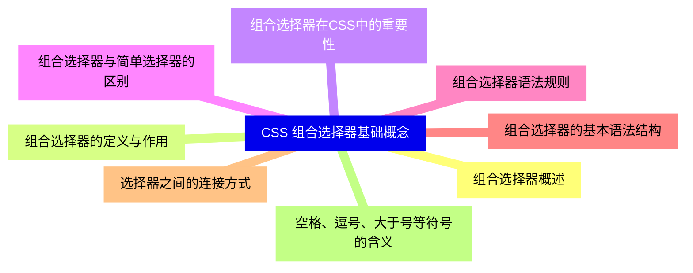

<--->
{}
{}
{}
{}
{}
{}
{}
{}
{}
{}
{}
{}
{}
{}
{}
{}
{}

### 2 后代选择器{#2}

{}
{}
{}
{}
{}
{}
{}
{}
{}
{}
{}
{}
{}
{}
{}
{}
{}
{}
{}
{}
{}
{}
{}
{}
{}
<--->
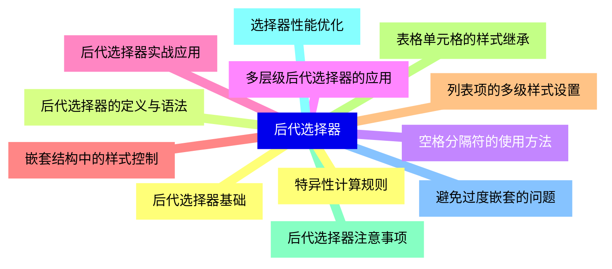

{}

### 3 子元素选择器{#3}

{}
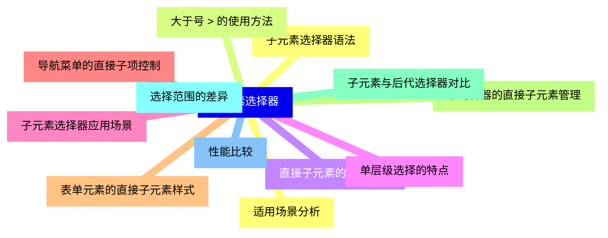

<--->
{}
{}
{}
{}
{}
{}
{}
{}
{}
{}
{}
{}
{}
{}
{}
{}
{}
{}
{}
{}
{}
{}
{}
{}
{}

### 4 相邻兄弟选择器{#4}

{}
{}
{}
{}
{}
{}
{}
{}
{}
{}
{}
{}
{}
{}
{}
{}
{}
{}
{}
{}
{}
{}
{}
{}
{}
<--->
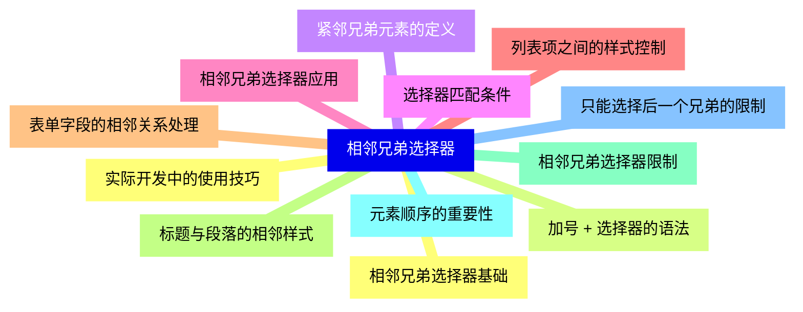

{}

### 5 通用兄弟选择器{#5}

{}
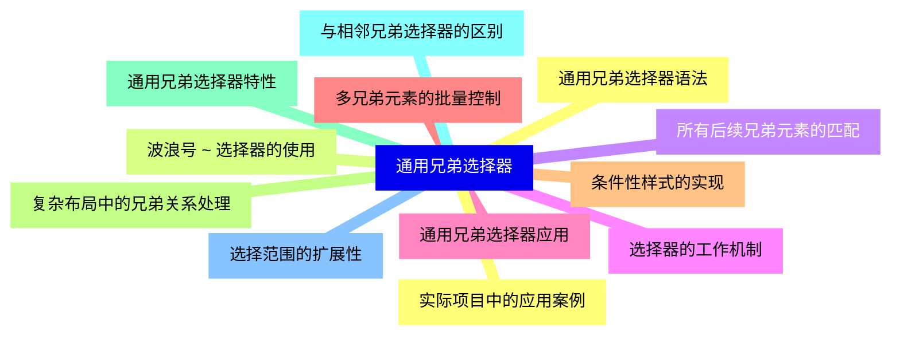

<--->
{}
{}
{}
{}
{}
{}
{}
{}
{}
{}
{}
{}
{}
{}
{}
{}
{}
{}
{}
{}
{}
{}
{}
{}
{}

### 6 选择器组合与分组{#6}

{}
{}
{}
{}
{}
{}
{}
{}
{}
{}
{}
{}
{}
{}
{}
{}
{}
{}
{}
{}
{}
{}
{}
{}
{}
<--->
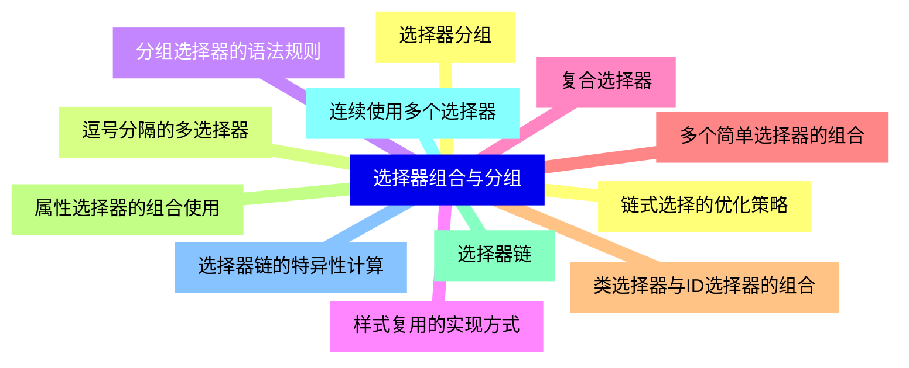

{}

### 7 组合选择器的优先级{#7}

{}
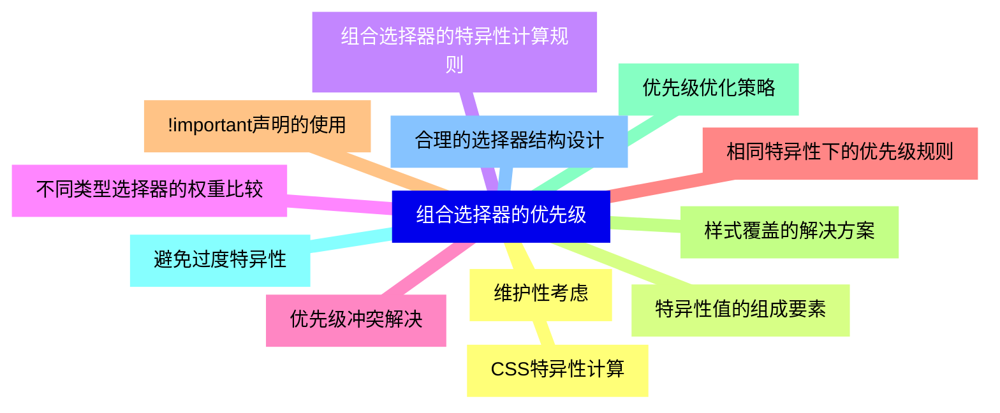

<--->
{}
{}
{}
{}
{}
{}
{}
{}
{}
{}
{}
{}
{}
{}
{}
{}
{}
{}
{}
{}
{}
{}
{}
{}
{}

### 8 高级组合技巧{#8}

{}
{}
{}
{}
{}
{}
{}
{}
{}
{}
{}
{}
{}
{}
{}
{}
{}
{}
{}
{}
{}
{}
{}
{}
{}
<--->
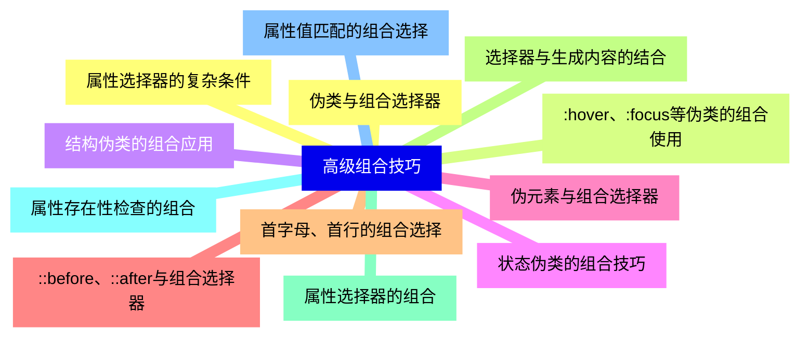

{}

### 9 性能优化与最佳实践{#9}

{}
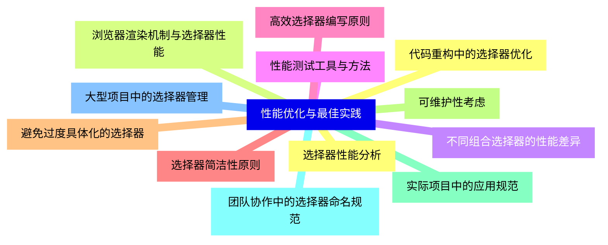

<--->
{}
{}
{}
{}
{}
{}
{}
{}
{}
{}
{}
{}
{}
{}
{}
{}
{}
{}
{}
{}
{}
{}
{}
{}
{}

### 10 响应式设计中的组合选择器{#10}

{}
{}
{}
{}
{}
{}
{}
{}
{}
{}
{}
{}
{}
{}
{}
{}
{}
{}
{}
{}
{}
{}
{}
{}
{}
<--->
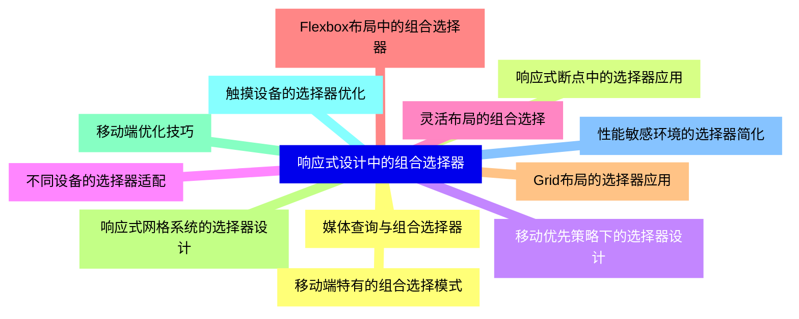

{}

### 11 框架与预处理器中的组合选择器{#11}

{}
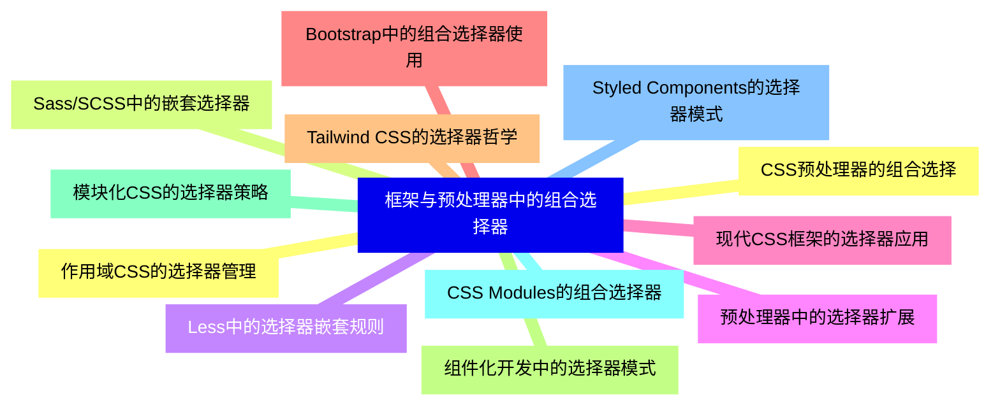

<--->
{}
{}
{}
{}
{}
{}
{}
{}
{}
{}
{}
{}
{}
{}
{}
{}
{}
{}
{}
{}
{}
{}
{}
{}
{}

### 12 调试与问题排查{#12}

{}
{}
{}
{}
{}
{}
{}
{}
{}
{}
{}
{}
{}
{}
{}
{}
{}
{}
{}
{}
{}
{}
{}
{}
{}
<--->
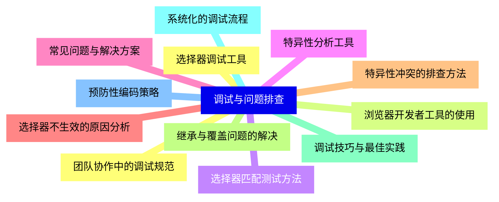

{}
