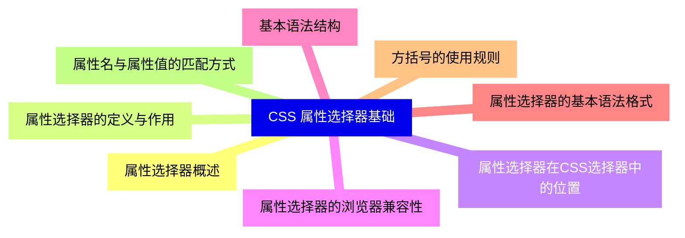
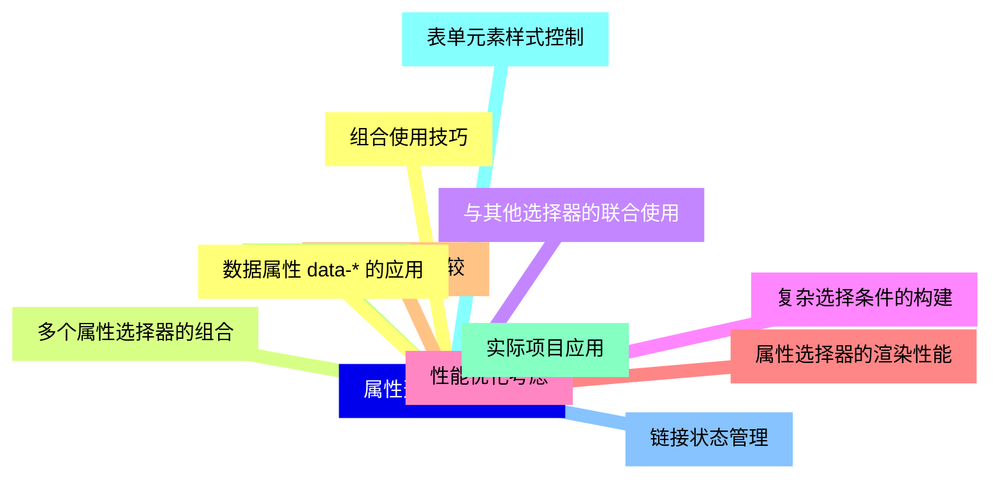
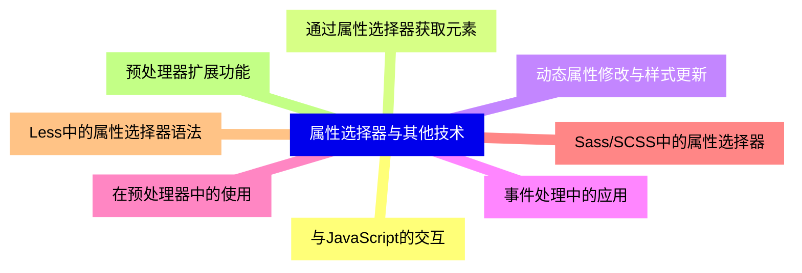
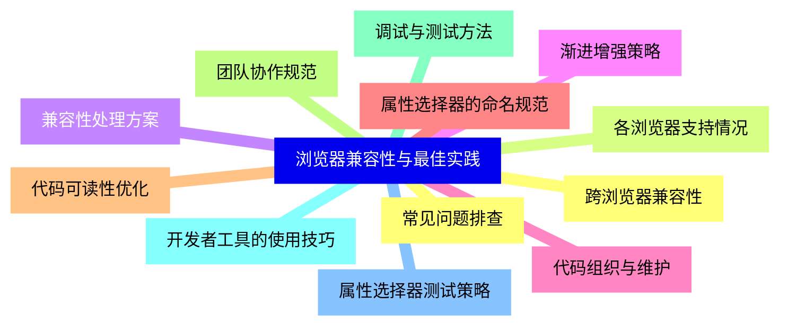


### 1 [CSS 属性选择器基础](#1)
#### 1.1 [属性选择器概述](#1)
#### 1.2 [属性选择器的定义与作用](#1)
#### 1.3 [属性选择器在CSS选择器中的位置](#1)
#### 1.4 [属性选择器的浏览器兼容性](#1)
#### 1.5 [基本语法结构](#1)
#### 1.6 [属性选择器的基本语法格式](#1)
#### 1.7 [方括号的使用规则](#1)
#### 1.8 [属性名与属性值的匹配方式](#1)
### 2 [属性选择器类型详解](#2)
#### 2.1 [存在性属性选择器](#2)
#### 2.2 [[attribute] 选择器语法](#2)
#### 2.3 [检查属性是否存在的方法](#2)
#### 2.4 [实际应用场景与示例](#2)
#### 2.5 [精确匹配属性选择器](#2)
#### 2.6 [[attribute="value"] 选择器](#2)
#### 2.7 [严格匹配属性值的规则](#2)
#### 2.8 [大小写敏感性问题](#2)
#### 2.9 [包含匹配属性选择器](#2)
#### 2.10 [[attribute~="value"] 选择器](#2)
#### 2.11 [空格分隔值的匹配原理](#2)
#### 2.12 [多值属性的应用](#2)
#### 2.13 [连字符匹配属性选择器](#2)
#### 2.14 [[attribute|="value"] 选择器](#2)
#### 2.15 [连字符分隔值的匹配规则](#2)
#### 2.16 [语言代码选择等特殊应用](#2)
#### 2.17 [前缀匹配属性选择器](#2)
#### 2.18 [[attribute^="value"] 选择器](#2)
#### 2.19 [匹配属性值开头的规则](#2)
#### 2.20 [URL和ID选择等应用场景](#2)
#### 2.21 [后缀匹配属性选择器](#2)
#### 2.22 [[attribute$="value"] 选择器](#2)
#### 2.23 [匹配属性值结尾的规则](#2)
#### 2.24 [文件扩展名选择等应用](#2)
#### 2.25 [子串匹配属性选择器](#2)
#### 2.26 [[attribute*="value"] 选择器](#2)
#### 2.27 [包含指定子串的匹配规则](#2)
#### 2.28 [模糊匹配的应用场景](#2)
### 3 [属性选择器高级应用](#3)
#### 3.1 [组合使用技巧](#3)
#### 3.2 [多个属性选择器的组合](#3)
#### 3.3 [与其他选择器的联合使用](#3)
#### 3.4 [复杂选择条件的构建](#3)
#### 3.5 [性能优化考虑](#3)
#### 3.6 [属性选择器的渲染性能](#3)
#### 3.7 [选择器效率比较](#3)
#### 3.8 [最佳实践建议](#3)
#### 3.9 [实际项目应用](#3)
#### 3.10 [表单元素样式控制](#3)
#### 3.11 [链接状态管理](#3)
#### 3.12 [数据属性 data-* 的应用](#3)
### 4 [属性选择器与CSS特性](#4)
#### 4.1 [特异性计算规则](#4)
#### 4.2 [属性选择器的特异性值](#4)
#### 4.3 [与其他选择器的特异性比较](#4)
#### 4.4 [层叠规则中的优先级](#4)
#### 4.5 [响应式设计中的应用](#4)
#### 4.6 [媒体查询中的属性选择器](#4)
#### 4.7 [移动端适配技巧](#4)
#### 4.8 [条件样式应用](#4)
### 5 [属性选择器与其他技术](#5)
#### 5.1 [与JavaScript的交互](#5)
#### 5.2 [通过属性选择器获取元素](#5)
#### 5.3 [动态属性修改与样式更新](#5)
#### 5.4 [事件处理中的应用](#5)
#### 5.5 [在预处理器中的使用](#5)
#### 5.6 [Sass/SCSS中的属性选择器](#5)
#### 5.7 [Less中的属性选择器语法](#5)
#### 5.8 [预处理器扩展功能](#5)
### 6 [浏览器兼容性与最佳实践](#6)
#### 6.1 [跨浏览器兼容性](#6)
#### 6.2 [各浏览器支持情况](#6)
#### 6.3 [兼容性处理方案](#6)
#### 6.4 [渐进增强策略](#6)
#### 6.5 [代码组织与维护](#6)
#### 6.6 [属性选择器的命名规范](#6)
#### 6.7 [代码可读性优化](#6)
#### 6.8 [团队协作规范](#6)
#### 6.9 [调试与测试方法](#6)
#### 6.10 [开发者工具的使用技巧](#6)
#### 6.11 [属性选择器测试策略](#6)
#### 6.12 [常见问题排查](#6)





### 1 CSS 属性选择器基础


---
### 1 CSS 属性选择器基础
___
#### 1.1 属性选择器概述
___
#### 1.2 属性选择器的定义与作用
___
#### 1.3 属性选择器在CSS选择器中的位置
___
#### 1.4 属性选择器的浏览器兼容性
___
#### 1.5 基本语法结构
___
#### 1.6 属性选择器的基本语法格式
___
#### 1.7 方括号的使用规则
___
#### 1.8 属性名与属性值的匹配方式
### 2 属性选择器类型详解


---
### 2 属性选择器类型详解
___
#### 2.1 存在性属性选择器
___
#### 2.2 [attribute] 选择器语法
___
#### 2.3 检查属性是否存在的方法
___
#### 2.4 实际应用场景与示例
___
#### 2.5 精确匹配属性选择器
___
#### 2.6 [attribute="value"] 选择器
___
#### 2.7 严格匹配属性值的规则
___
#### 2.8 大小写敏感性问题
___
#### 2.9 包含匹配属性选择器
___
#### 2.10 [attribute~="value"] 选择器
___
#### 2.11 空格分隔值的匹配原理
___
#### 2.12 多值属性的应用
___
#### 2.13 连字符匹配属性选择器
___
#### 2.14 [attribute|="value"] 选择器
___
#### 2.15 连字符分隔值的匹配规则
___
#### 2.16 语言代码选择等特殊应用
___
#### 2.17 前缀匹配属性选择器
___
#### 2.18 [attribute^="value"] 选择器
___
#### 2.19 匹配属性值开头的规则
___
#### 2.20 URL和ID选择等应用场景
___
#### 2.21 后缀匹配属性选择器
___
#### 2.22 [attribute$="value"] 选择器
___
#### 2.23 匹配属性值结尾的规则
___
#### 2.24 文件扩展名选择等应用
___
#### 2.25 子串匹配属性选择器
___
#### 2.26 [attribute*="value"] 选择器
___
#### 2.27 包含指定子串的匹配规则
___
#### 2.28 模糊匹配的应用场景
### 3 属性选择器高级应用


---
### 3 属性选择器高级应用
___
#### 3.1 组合使用技巧
___
#### 3.2 多个属性选择器的组合
___
#### 3.3 与其他选择器的联合使用
___
#### 3.4 复杂选择条件的构建
___
#### 3.5 性能优化考虑
___
#### 3.6 属性选择器的渲染性能
___
#### 3.7 选择器效率比较
___
#### 3.8 最佳实践建议
___
#### 3.9 实际项目应用
___
#### 3.10 表单元素样式控制
___
#### 3.11 链接状态管理
___
#### 3.12 数据属性 data-* 的应用
### 4 属性选择器与CSS特性


---
### 4 属性选择器与CSS特性
___
#### 4.1 特异性计算规则
___
#### 4.2 属性选择器的特异性值
___
#### 4.3 与其他选择器的特异性比较
___
#### 4.4 层叠规则中的优先级
___
#### 4.5 响应式设计中的应用
___
#### 4.6 媒体查询中的属性选择器
___
#### 4.7 移动端适配技巧
___
#### 4.8 条件样式应用
### 5 属性选择器与其他技术


---
### 5 属性选择器与其他技术
___
#### 5.1 与JavaScript的交互
___
#### 5.2 通过属性选择器获取元素
___
#### 5.3 动态属性修改与样式更新
___
#### 5.4 事件处理中的应用
___
#### 5.5 在预处理器中的使用
___
#### 5.6 Sass/SCSS中的属性选择器
___
#### 5.7 Less中的属性选择器语法
___
#### 5.8 预处理器扩展功能
### 6 浏览器兼容性与最佳实践


---
### 6 浏览器兼容性与最佳实践
___
#### 6.1 跨浏览器兼容性
___
#### 6.2 各浏览器支持情况
___
#### 6.3 兼容性处理方案
___
#### 6.4 渐进增强策略
___
#### 6.5 代码组织与维护
___
#### 6.6 属性选择器的命名规范
___
#### 6.7 代码可读性优化
___
#### 6.8 团队协作规范
___
#### 6.9 调试与测试方法
___
#### 6.10 开发者工具的使用技巧
___
#### 6.11 属性选择器测试策略
___
#### 6.12 常见问题排查



### 1 CSS 属性选择器基础{#1}


{}


<--->
{}
{}
{}
{}
{}
{}
{}
{}
{}
{}
{}
{}
{}
{}
{}
{}
{}

### 2 属性选择器类型详解{#2}


{}
{}
{}
{}
{}
{}
{}
{}
{}
{}
{}
{}
{}
{}
{}
{}
{}
{}
{}
{}
{}
{}
{}
{}
{}
{}
{}
{}
{}
{}
{}
{}
{}
{}
{}
{}
{}
{}
{}
{}
{}
{}
{}
{}
{}
{}
{}
{}
{}
{}
{}
{}
{}
{}
{}
{}
{}
<--->
```mermaid
mindmap
    id2[属性选择器类型详解]
        id2-1[存在性属性选择器]
        id2-2[[attribute] 选择器语法]
        id2-3[检查属性是否存在的方法]
        id2-4[实际应用场景与示例]
        id2-5[精确匹配属性选择器]
        id2-6[[attribute="value"] 选择器]
        id2-7[严格匹配属性值的规则]
        id2-8[大小写敏感性问题]
        id2-9[包含匹配属性选择器]
        id2-10[[attribute~="value"] 选择器]
        id2-11[空格分隔值的匹配原理]
        id2-12[多值属性的应用]
        id2-13[连字符匹配属性选择器]
        id2-14[[attribute|="value"] 选择器]
        id2-15[连字符分隔值的匹配规则]
        id2-16[语言代码选择等特殊应用]
        id2-17[前缀匹配属性选择器]
        id2-18[[attribute^="value"] 选择器]
        id2-19[匹配属性值开头的规则]
        id2-20[URL和ID选择等应用场景]
        id2-21[后缀匹配属性选择器]
        id2-22[[attribute$="value"] 选择器]
        id2-23[匹配属性值结尾的规则]
        id2-24[文件扩展名选择等应用]
        id2-25[子串匹配属性选择器]
        id2-26[[attribute*="value"] 选择器]
        id2-27[包含指定子串的匹配规则]
        id2-28[模糊匹配的应用场景]
```

{}

### 3 属性选择器高级应用{#3}


{}


<--->
{}
{}
{}
{}
{}
{}
{}
{}
{}
{}
{}
{}
{}
{}
{}
{}
{}
{}
{}
{}
{}
{}
{}
{}
{}

### 4 属性选择器与CSS特性{#4}


{}
{}
{}
{}
{}
{}
{}
{}
{}
{}
{}
{}
{}
{}
{}
{}
{}
<--->


{}

### 5 属性选择器与其他技术{#5}


{}


<--->
{}
{}
{}
{}
{}
{}
{}
{}
{}
{}
{}
{}
{}
{}
{}
{}
{}

### 6 浏览器兼容性与最佳实践{#6}


{}
{}
{}
{}
{}
{}
{}
{}
{}
{}
{}
{}
{}
{}
{}
{}
{}
{}
{}
{}
{}
{}
{}
{}
{}
<--->


{}
