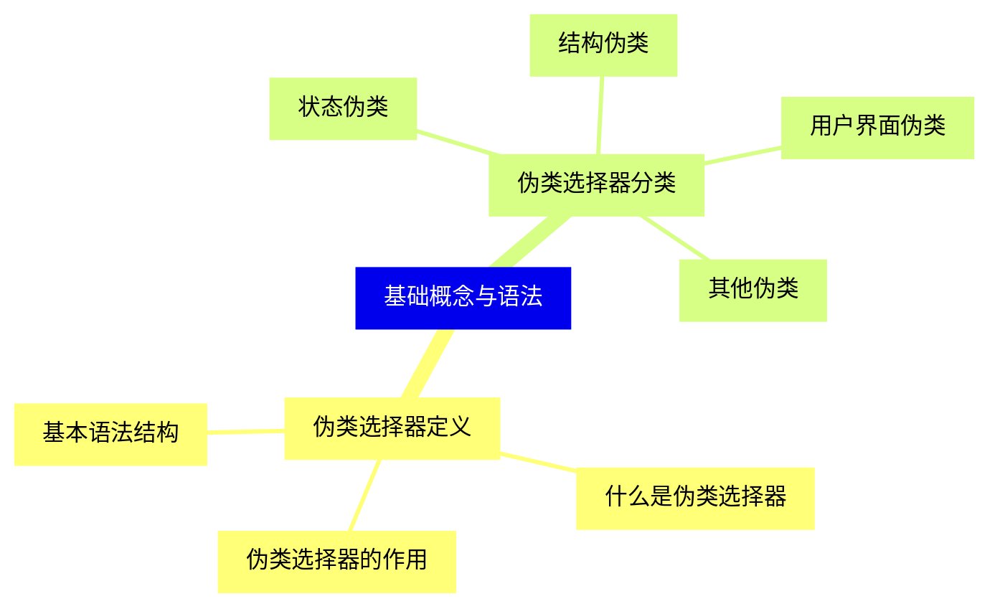
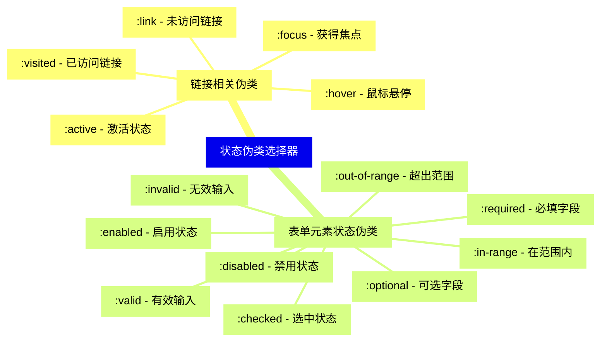
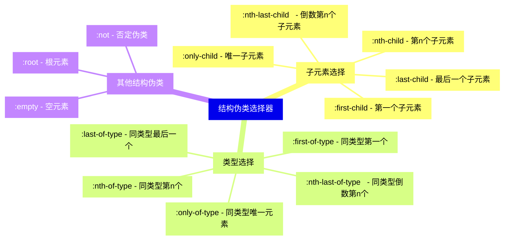
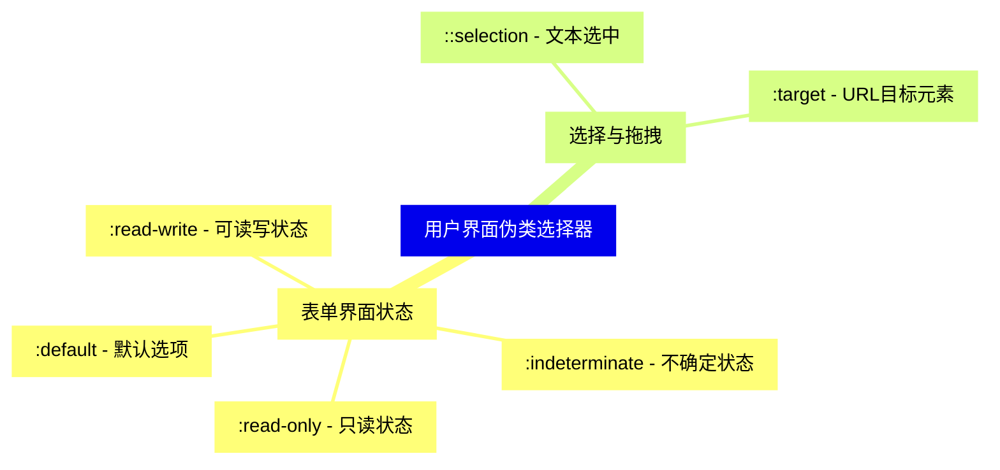
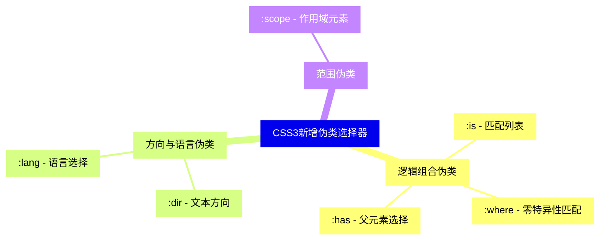
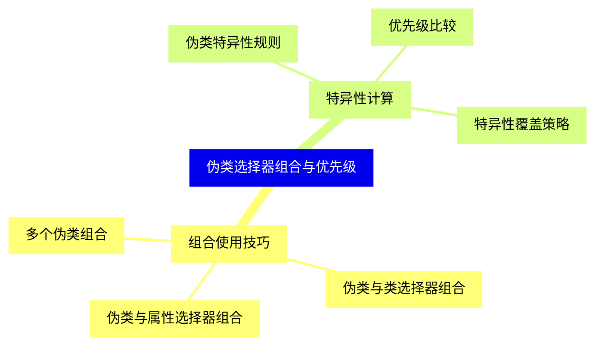
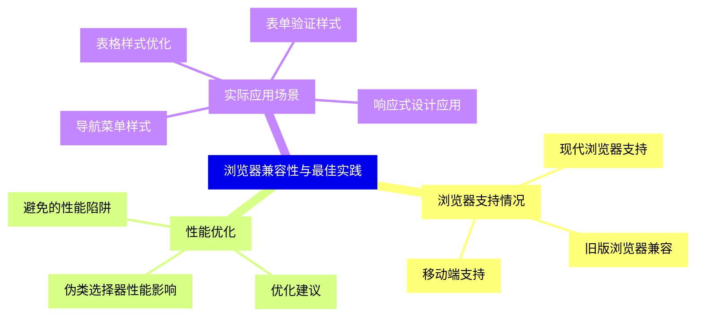
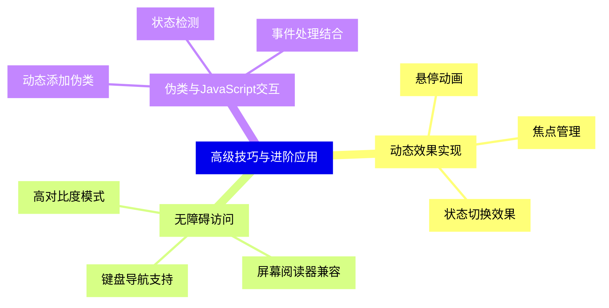


### 1 [基础概念与语法](#1)
#### 1.1 [伪类选择器定义](#1)
##### 1.1.1 [什么是伪类选择器](#1)
##### 1.1.2 [伪类选择器的作用](#1)
##### 1.1.3 [基本语法结构](#1)
#### 1.2 [伪类选择器分类](#1)
##### 1.2.1 [状态伪类](#1)
##### 1.2.2 [结构伪类](#1)
##### 1.2.3 [用户界面伪类](#1)
##### 1.2.4 [其他伪类](#1)
### 2 [状态伪类选择器](#2)
#### 2.1 [链接相关伪类](#2)
##### 2.1.1 [:link - 未访问链接](#2)
##### 2.1.2 [:visited - 已访问链接](#2)
##### 2.1.3 [:hover - 鼠标悬停](#2)
##### 2.1.4 [:active - 激活状态](#2)
##### 2.1.5 [:focus - 获得焦点](#2)
#### 2.2 [表单元素状态伪类](#2)
##### 2.2.1 [:checked - 选中状态](#2)
##### 2.2.2 [:disabled - 禁用状态](#2)
##### 2.2.3 [:enabled - 启用状态](#2)
##### 2.2.4 [:required - 必填字段](#2)
##### 2.2.5 [:optional - 可选字段](#2)
##### 2.2.6 [:valid - 有效输入](#2)
##### 2.2.7 [:invalid - 无效输入](#2)
##### 2.2.8 [:in-range - 在范围内](#2)
##### 2.2.9 [:out-of-range - 超出范围](#2)
### 3 [结构伪类选择器](#3)
#### 3.1 [子元素选择](#3)
##### 3.1.1 [:first-child - 第一个子元素](#3)
##### 3.1.2 [:last-child - 最后一个子元素](#3)
##### 3.1.3 [:nth-child   - 第n个子元素](#3)
##### 3.1.4 [:nth-last-child   - 倒数第n个子元素](#3)
##### 3.1.5 [:only-child - 唯一子元素](#3)
#### 3.2 [类型选择](#3)
##### 3.2.1 [:first-of-type - 同类型第一个](#3)
##### 3.2.2 [:last-of-type - 同类型最后一个](#3)
##### 3.2.3 [:nth-of-type   - 同类型第n个](#3)
##### 3.2.4 [:nth-last-of-type   - 同类型倒数第n个](#3)
##### 3.2.5 [:only-of-type - 同类型唯一元素](#3)
#### 3.3 [其他结构伪类](#3)
##### 3.3.1 [:root - 根元素](#3)
##### 3.3.2 [:empty - 空元素](#3)
##### 3.3.3 [:not   - 否定伪类](#3)
### 4 [用户界面伪类选择器](#4)
#### 4.1 [表单界面状态](#4)
##### 4.1.1 [:default - 默认选项](#4)
##### 4.1.2 [:indeterminate - 不确定状态](#4)
##### 4.1.3 [:read-only - 只读状态](#4)
##### 4.1.4 [:read-write - 可读写状态](#4)
#### 4.2 [选择与拖拽](#4)
##### 4.2.1 [::selection - 文本选中](#4)
##### 4.2.2 [:target - URL目标元素](#4)
### 5 [CSS3新增伪类选择器](#5)
#### 5.1 [逻辑组合伪类](#5)
##### 5.1.1 [:is   - 匹配列表](#5)
##### 5.1.2 [:where   - 零特异性匹配](#5)
##### 5.1.3 [:has   - 父元素选择](#5)
#### 5.2 [方向与语言伪类](#5)
##### 5.2.1 [:dir   - 文本方向](#5)
##### 5.2.2 [:lang   - 语言选择](#5)
#### 5.3 [范围伪类](#5)
##### 5.3.1 [:scope - 作用域元素](#5)
### 6 [伪类选择器组合与优先级](#6)
#### 6.1 [组合使用技巧](#6)
##### 6.1.1 [多个伪类组合](#6)
##### 6.1.2 [伪类与类选择器组合](#6)
##### 6.1.3 [伪类与属性选择器组合](#6)
#### 6.2 [特异性计算](#6)
##### 6.2.1 [伪类特异性规则](#6)
##### 6.2.2 [优先级比较](#6)
##### 6.2.3 [特异性覆盖策略](#6)
### 7 [浏览器兼容性与最佳实践](#7)
#### 7.1 [浏览器支持情况](#7)
##### 7.1.1 [现代浏览器支持](#7)
##### 7.1.2 [旧版浏览器兼容](#7)
##### 7.1.3 [移动端支持](#7)
#### 7.2 [性能优化](#7)
##### 7.2.1 [伪类选择器性能影响](#7)
##### 7.2.2 [优化建议](#7)
##### 7.2.3 [避免的性能陷阱](#7)
#### 7.3 [实际应用场景](#7)
##### 7.3.1 [导航菜单样式](#7)
##### 7.3.2 [表单验证样式](#7)
##### 7.3.3 [表格样式优化](#7)
##### 7.3.4 [响应式设计应用](#7)
### 8 [高级技巧与进阶应用](#8)
#### 8.1 [动态效果实现](#8)
##### 8.1.1 [悬停动画](#8)
##### 8.1.2 [焦点管理](#8)
##### 8.1.3 [状态切换效果](#8)
#### 8.2 [无障碍访问](#8)
##### 8.2.1 [键盘导航支持](#8)
##### 8.2.2 [屏幕阅读器兼容](#8)
##### 8.2.3 [高对比度模式](#8)
#### 8.3 [伪类与JavaScript交互](#8)
##### 8.3.1 [动态添加伪类](#8)
##### 8.3.2 [状态检测](#8)
##### 8.3.3 [事件处理结合](#8)




### 1 基础概念与语法

---
### 1 基础概念与语法
___
#### 1.1 伪类选择器定义
___
##### 1.1.1 什么是伪类选择器
___
##### 1.1.2 伪类选择器的作用
___
##### 1.1.3 基本语法结构
___
#### 1.2 伪类选择器分类
___
##### 1.2.1 状态伪类
___
##### 1.2.2 结构伪类
___
##### 1.2.3 用户界面伪类
___
##### 1.2.4 其他伪类
### 2 状态伪类选择器

---
### 2 状态伪类选择器
___
#### 2.1 链接相关伪类
___
##### 2.1.1 :link - 未访问链接
___
##### 2.1.2 :visited - 已访问链接
___
##### 2.1.3 :hover - 鼠标悬停
___
##### 2.1.4 :active - 激活状态
___
##### 2.1.5 :focus - 获得焦点
___
#### 2.2 表单元素状态伪类
___
##### 2.2.1 :checked - 选中状态
___
##### 2.2.2 :disabled - 禁用状态
___
##### 2.2.3 :enabled - 启用状态
___
##### 2.2.4 :required - 必填字段
___
##### 2.2.5 :optional - 可选字段
___
##### 2.2.6 :valid - 有效输入
___
##### 2.2.7 :invalid - 无效输入
___
##### 2.2.8 :in-range - 在范围内
___
##### 2.2.9 :out-of-range - 超出范围
### 3 结构伪类选择器

---
### 3 结构伪类选择器
___
#### 3.1 子元素选择
___
##### 3.1.1 :first-child - 第一个子元素
___
##### 3.1.2 :last-child - 最后一个子元素
___
##### 3.1.3 :nth-child   - 第n个子元素
___
##### 3.1.4 :nth-last-child   - 倒数第n个子元素
___
##### 3.1.5 :only-child - 唯一子元素
___
#### 3.2 类型选择
___
##### 3.2.1 :first-of-type - 同类型第一个
___
##### 3.2.2 :last-of-type - 同类型最后一个
___
##### 3.2.3 :nth-of-type   - 同类型第n个
___
##### 3.2.4 :nth-last-of-type   - 同类型倒数第n个
___
##### 3.2.5 :only-of-type - 同类型唯一元素
___
#### 3.3 其他结构伪类
___
##### 3.3.1 :root - 根元素
___
##### 3.3.2 :empty - 空元素
___
##### 3.3.3 :not   - 否定伪类
### 4 用户界面伪类选择器

---
### 4 用户界面伪类选择器
___
#### 4.1 表单界面状态
___
##### 4.1.1 :default - 默认选项
___
##### 4.1.2 :indeterminate - 不确定状态
___
##### 4.1.3 :read-only - 只读状态
___
##### 4.1.4 :read-write - 可读写状态
___
#### 4.2 选择与拖拽
___
##### 4.2.1 ::selection - 文本选中
___
##### 4.2.2 :target - URL目标元素
### 5 CSS3新增伪类选择器

---
### 5 CSS3新增伪类选择器
___
#### 5.1 逻辑组合伪类
___
##### 5.1.1 :is   - 匹配列表
___
##### 5.1.2 :where   - 零特异性匹配
___
##### 5.1.3 :has   - 父元素选择
___
#### 5.2 方向与语言伪类
___
##### 5.2.1 :dir   - 文本方向
___
##### 5.2.2 :lang   - 语言选择
___
#### 5.3 范围伪类
___
##### 5.3.1 :scope - 作用域元素
### 6 伪类选择器组合与优先级

---
### 6 伪类选择器组合与优先级
___
#### 6.1 组合使用技巧
___
##### 6.1.1 多个伪类组合
___
##### 6.1.2 伪类与类选择器组合
___
##### 6.1.3 伪类与属性选择器组合
___
#### 6.2 特异性计算
___
##### 6.2.1 伪类特异性规则
___
##### 6.2.2 优先级比较
___
##### 6.2.3 特异性覆盖策略
### 7 浏览器兼容性与最佳实践

---
### 7 浏览器兼容性与最佳实践
___
#### 7.1 浏览器支持情况
___
##### 7.1.1 现代浏览器支持
___
##### 7.1.2 旧版浏览器兼容
___
##### 7.1.3 移动端支持
___
#### 7.2 性能优化
___
##### 7.2.1 伪类选择器性能影响
___
##### 7.2.2 优化建议
___
##### 7.2.3 避免的性能陷阱
___
#### 7.3 实际应用场景
___
##### 7.3.1 导航菜单样式
___
##### 7.3.2 表单验证样式
___
##### 7.3.3 表格样式优化
___
##### 7.3.4 响应式设计应用
### 8 高级技巧与进阶应用

---
### 8 高级技巧与进阶应用
___
#### 8.1 动态效果实现
___
##### 8.1.1 悬停动画
___
##### 8.1.2 焦点管理
___
##### 8.1.3 状态切换效果
___
#### 8.2 无障碍访问
___
##### 8.2.1 键盘导航支持
___
##### 8.2.2 屏幕阅读器兼容
___
##### 8.2.3 高对比度模式
___
#### 8.3 伪类与JavaScript交互
___
##### 8.3.1 动态添加伪类
___
##### 8.3.2 状态检测
___
##### 8.3.3 事件处理结合


### 1 基础概念与语法{#1}

{}

<--->
{}
{}
{}
{}
{}
{}
{}
{}
{}
{}
{}
{}
{}
{}
{}
{}
{}
{}
{}

### 2 状态伪类选择器{#2}

{}
{}
{}
{}
{}
{}
{}
{}
{}
{}
{}
{}
{}
{}
{}
{}
{}
{}
{}
{}
{}
{}
{}
{}
{}
{}
{}
{}
{}
{}
{}
{}
{}
<--->

{}

### 3 结构伪类选择器{#3}

{}

<--->
{}
{}
{}
{}
{}
{}
{}
{}
{}
{}
{}
{}
{}
{}
{}
{}
{}
{}
{}
{}
{}
{}
{}
{}
{}
{}
{}
{}
{}
{}
{}
{}
{}

### 4 用户界面伪类选择器{#4}

{}
{}
{}
{}
{}
{}
{}
{}
{}
{}
{}
{}
{}
{}
{}
{}
{}
<--->

{}

### 5 CSS3新增伪类选择器{#5}

{}

<--->
{}
{}
{}
{}
{}
{}
{}
{}
{}
{}
{}
{}
{}
{}
{}
{}
{}
{}
{}

### 6 伪类选择器组合与优先级{#6}

{}
{}
{}
{}
{}
{}
{}
{}
{}
{}
{}
{}
{}
{}
{}
{}
{}
<--->

{}

### 7 浏览器兼容性与最佳实践{#7}

{}

<--->
{}
{}
{}
{}
{}
{}
{}
{}
{}
{}
{}
{}
{}
{}
{}
{}
{}
{}
{}
{}
{}
{}
{}
{}
{}
{}
{}

### 8 高级技巧与进阶应用{#8}

{}
{}
{}
{}
{}
{}
{}
{}
{}
{}
{}
{}
{}
{}
{}
{}
{}
{}
{}
{}
{}
{}
{}
{}
{}
<--->

{}
