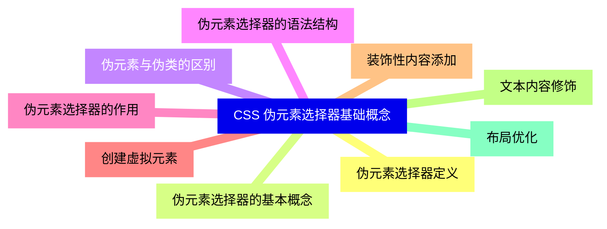
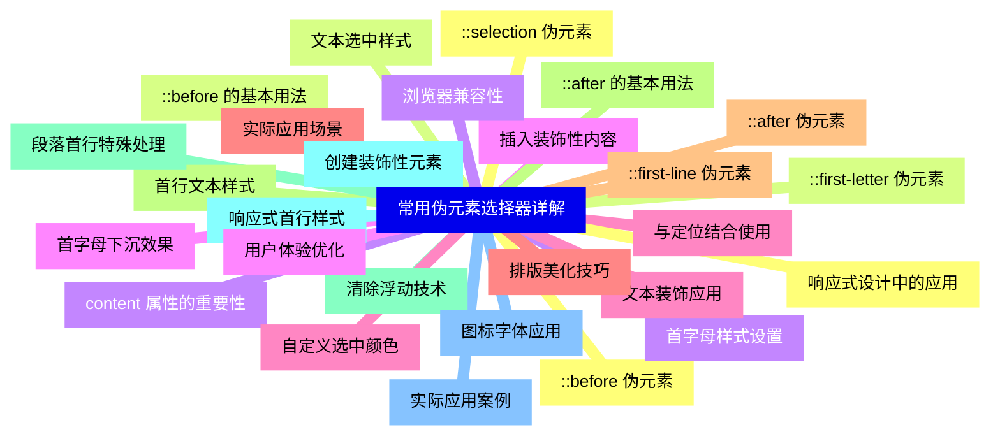
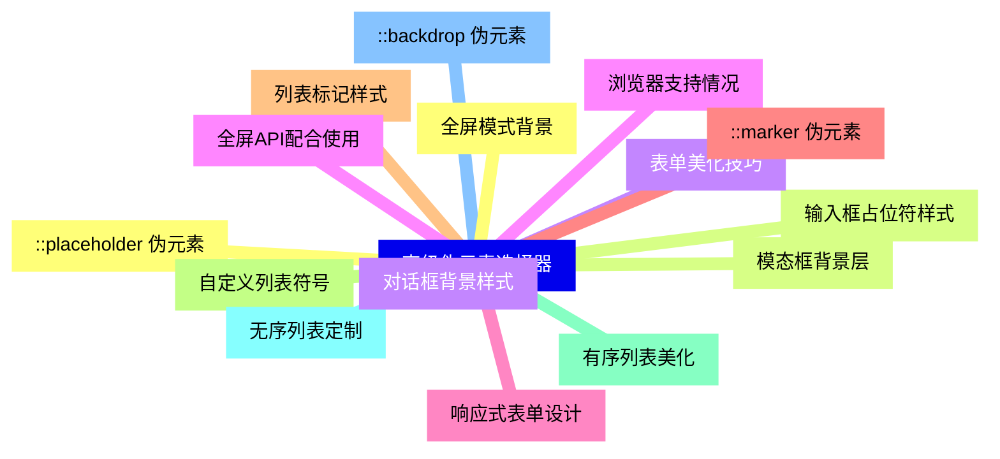
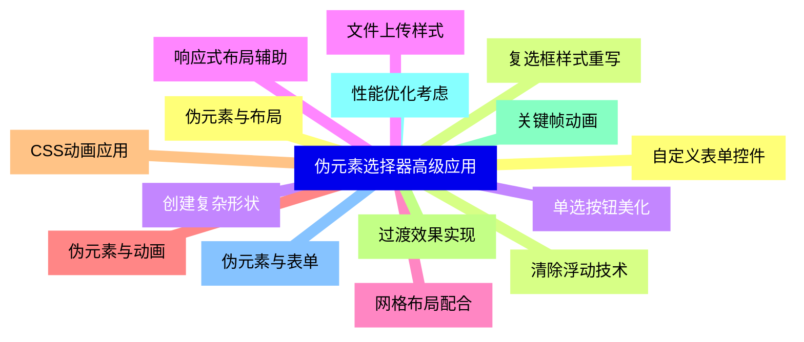
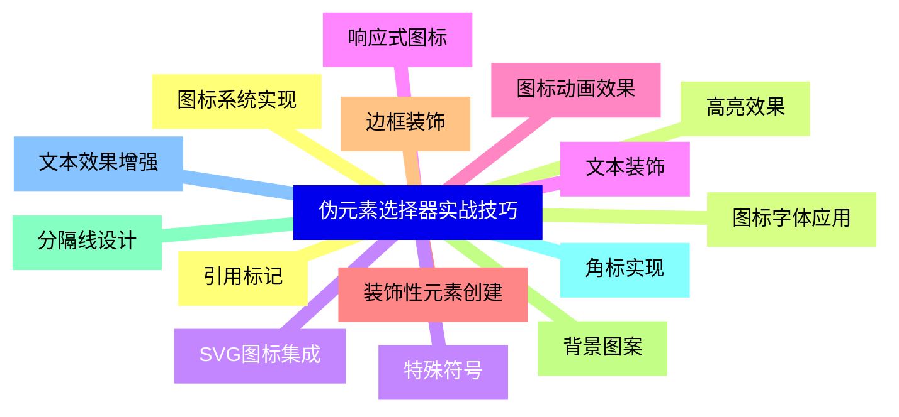
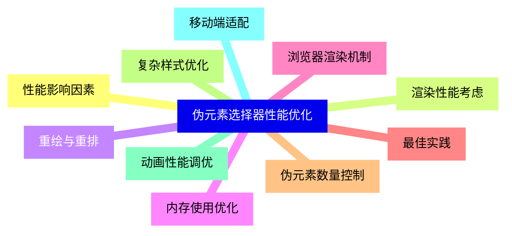
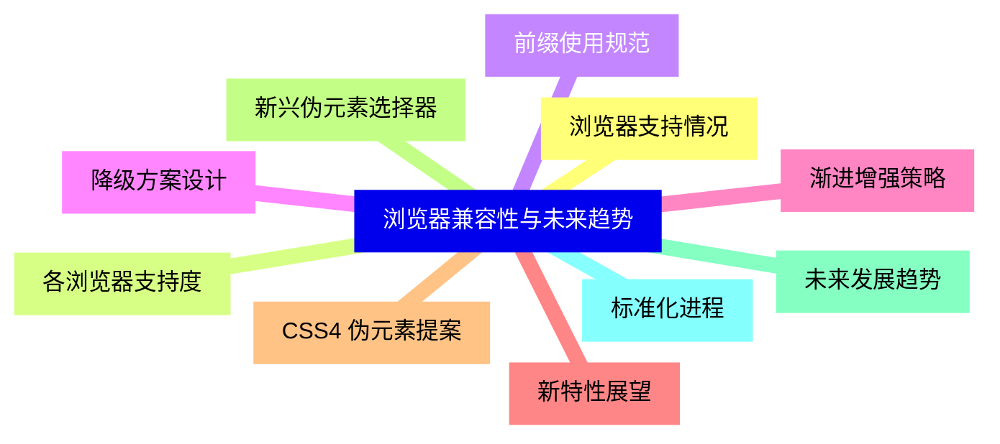


### 1 [CSS 伪元素选择器基础概念](#1)
#### 1.1 [伪元素选择器定义](#1)
#### 1.2 [伪元素选择器的基本概念](#1)
#### 1.3 [伪元素与伪类的区别](#1)
#### 1.4 [伪元素选择器的语法结构](#1)
#### 1.5 [伪元素选择器的作用](#1)
#### 1.6 [创建虚拟元素](#1)
#### 1.7 [装饰性内容添加](#1)
#### 1.8 [文本内容修饰](#1)
#### 1.9 [布局优化](#1)
### 2 [常用伪元素选择器详解](#2)
#### 2.1 [::before 伪元素](#2)
#### 2.2 [::before 的基本用法](#2)
#### 2.3 [content 属性的重要性](#2)
#### 2.4 [插入装饰性内容](#2)
#### 2.5 [与定位结合使用](#2)
#### 2.6 [实际应用场景](#2)
#### 2.7 [::after 伪元素](#2)
#### 2.8 [::after 的基本用法](#2)
#### 2.9 [清除浮动技术](#2)
#### 2.10 [创建装饰性元素](#2)
#### 2.11 [图标字体应用](#2)
#### 2.12 [响应式设计中的应用](#2)
#### 2.13 [::first-letter 伪元素](#2)
#### 2.14 [首字母样式设置](#2)
#### 2.15 [首字母下沉效果](#2)
#### 2.16 [文本装饰应用](#2)
#### 2.17 [排版美化技巧](#2)
#### 2.18 [::first-line 伪元素](#2)
#### 2.19 [首行文本样式](#2)
#### 2.20 [段落首行特殊处理](#2)
#### 2.21 [响应式首行样式](#2)
#### 2.22 [实际应用案例](#2)
#### 2.23 [::selection 伪元素](#2)
#### 2.24 [文本选中样式](#2)
#### 2.25 [浏览器兼容性](#2)
#### 2.26 [用户体验优化](#2)
#### 2.27 [自定义选中颜色](#2)
### 3 [高级伪元素选择器](#3)
#### 3.1 [::placeholder 伪元素](#3)
#### 3.2 [输入框占位符样式](#3)
#### 3.3 [表单美化技巧](#3)
#### 3.4 [浏览器支持情况](#3)
#### 3.5 [响应式表单设计](#3)
#### 3.6 [::marker 伪元素](#3)
#### 3.7 [列表标记样式](#3)
#### 3.8 [自定义列表符号](#3)
#### 3.9 [有序列表美化](#3)
#### 3.10 [无序列表定制](#3)
#### 3.11 [::backdrop 伪元素](#3)
#### 3.12 [全屏模式背景](#3)
#### 3.13 [模态框背景层](#3)
#### 3.14 [对话框背景样式](#3)
#### 3.15 [全屏API配合使用](#3)
### 4 [伪元素选择器高级应用](#4)
#### 4.1 [伪元素与布局](#4)
#### 4.2 [清除浮动技术](#4)
#### 4.3 [创建复杂形状](#4)
#### 4.4 [响应式布局辅助](#4)
#### 4.5 [网格布局配合](#4)
#### 4.6 [伪元素与动画](#4)
#### 4.7 [CSS动画应用](#4)
#### 4.8 [过渡效果实现](#4)
#### 4.9 [关键帧动画](#4)
#### 4.10 [性能优化考虑](#4)
#### 4.11 [伪元素与表单](#4)
#### 4.12 [自定义表单控件](#4)
#### 4.13 [复选框样式重写](#4)
#### 4.14 [单选按钮美化](#4)
#### 4.15 [文件上传样式](#4)
### 5 [伪元素选择器实战技巧](#5)
#### 5.1 [图标系统实现](#5)
#### 5.2 [图标字体应用](#5)
#### 5.3 [SVG图标集成](#5)
#### 5.4 [响应式图标](#5)
#### 5.5 [图标动画效果](#5)
#### 5.6 [装饰性元素创建](#5)
#### 5.7 [边框装饰](#5)
#### 5.8 [背景图案](#5)
#### 5.9 [分隔线设计](#5)
#### 5.10 [角标实现](#5)
#### 5.11 [文本效果增强](#5)
#### 5.12 [引用标记](#5)
#### 5.13 [高亮效果](#5)
#### 5.14 [特殊符号](#5)
#### 5.15 [文本装饰](#5)
### 6 [伪元素选择器性能优化](#6)
#### 6.1 [性能影响因素](#6)
#### 6.2 [渲染性能考虑](#6)
#### 6.3 [重绘与重排](#6)
#### 6.4 [内存使用优化](#6)
#### 6.5 [浏览器渲染机制](#6)
#### 6.6 [最佳实践](#6)
#### 6.7 [伪元素数量控制](#6)
#### 6.8 [复杂样式优化](#6)
#### 6.9 [动画性能调优](#6)
#### 6.10 [移动端适配](#6)
### 7 [浏览器兼容性与未来趋势](#7)
#### 7.1 [浏览器支持情况](#7)
#### 7.2 [各浏览器支持度](#7)
#### 7.3 [前缀使用规范](#7)
#### 7.4 [降级方案设计](#7)
#### 7.5 [渐进增强策略](#7)
#### 7.6 [新特性展望](#7)
#### 7.7 [CSS4 伪元素提案](#7)
#### 7.8 [新兴伪元素选择器](#7)
#### 7.9 [未来发展趋势](#7)
#### 7.10 [标准化进程](#7)




### 1 CSS 伪元素选择器基础概念

---
### 1 CSS 伪元素选择器基础概念
___
#### 1.1 伪元素选择器定义
___
#### 1.2 伪元素选择器的基本概念
___
#### 1.3 伪元素与伪类的区别
___
#### 1.4 伪元素选择器的语法结构
___
#### 1.5 伪元素选择器的作用
___
#### 1.6 创建虚拟元素
___
#### 1.7 装饰性内容添加
___
#### 1.8 文本内容修饰
___
#### 1.9 布局优化
### 2 常用伪元素选择器详解

---
### 2 常用伪元素选择器详解
___
#### 2.1 ::before 伪元素
___
#### 2.2 ::before 的基本用法
___
#### 2.3 content 属性的重要性
___
#### 2.4 插入装饰性内容
___
#### 2.5 与定位结合使用
___
#### 2.6 实际应用场景
___
#### 2.7 ::after 伪元素
___
#### 2.8 ::after 的基本用法
___
#### 2.9 清除浮动技术
___
#### 2.10 创建装饰性元素
___
#### 2.11 图标字体应用
___
#### 2.12 响应式设计中的应用
___
#### 2.13 ::first-letter 伪元素
___
#### 2.14 首字母样式设置
___
#### 2.15 首字母下沉效果
___
#### 2.16 文本装饰应用
___
#### 2.17 排版美化技巧
___
#### 2.18 ::first-line 伪元素
___
#### 2.19 首行文本样式
___
#### 2.20 段落首行特殊处理
___
#### 2.21 响应式首行样式
___
#### 2.22 实际应用案例
___
#### 2.23 ::selection 伪元素
___
#### 2.24 文本选中样式
___
#### 2.25 浏览器兼容性
___
#### 2.26 用户体验优化
___
#### 2.27 自定义选中颜色
### 3 高级伪元素选择器

---
### 3 高级伪元素选择器
___
#### 3.1 ::placeholder 伪元素
___
#### 3.2 输入框占位符样式
___
#### 3.3 表单美化技巧
___
#### 3.4 浏览器支持情况
___
#### 3.5 响应式表单设计
___
#### 3.6 ::marker 伪元素
___
#### 3.7 列表标记样式
___
#### 3.8 自定义列表符号
___
#### 3.9 有序列表美化
___
#### 3.10 无序列表定制
___
#### 3.11 ::backdrop 伪元素
___
#### 3.12 全屏模式背景
___
#### 3.13 模态框背景层
___
#### 3.14 对话框背景样式
___
#### 3.15 全屏API配合使用
### 4 伪元素选择器高级应用

---
### 4 伪元素选择器高级应用
___
#### 4.1 伪元素与布局
___
#### 4.2 清除浮动技术
___
#### 4.3 创建复杂形状
___
#### 4.4 响应式布局辅助
___
#### 4.5 网格布局配合
___
#### 4.6 伪元素与动画
___
#### 4.7 CSS动画应用
___
#### 4.8 过渡效果实现
___
#### 4.9 关键帧动画
___
#### 4.10 性能优化考虑
___
#### 4.11 伪元素与表单
___
#### 4.12 自定义表单控件
___
#### 4.13 复选框样式重写
___
#### 4.14 单选按钮美化
___
#### 4.15 文件上传样式
### 5 伪元素选择器实战技巧

---
### 5 伪元素选择器实战技巧
___
#### 5.1 图标系统实现
___
#### 5.2 图标字体应用
___
#### 5.3 SVG图标集成
___
#### 5.4 响应式图标
___
#### 5.5 图标动画效果
___
#### 5.6 装饰性元素创建
___
#### 5.7 边框装饰
___
#### 5.8 背景图案
___
#### 5.9 分隔线设计
___
#### 5.10 角标实现
___
#### 5.11 文本效果增强
___
#### 5.12 引用标记
___
#### 5.13 高亮效果
___
#### 5.14 特殊符号
___
#### 5.15 文本装饰
### 6 伪元素选择器性能优化

---
### 6 伪元素选择器性能优化
___
#### 6.1 性能影响因素
___
#### 6.2 渲染性能考虑
___
#### 6.3 重绘与重排
___
#### 6.4 内存使用优化
___
#### 6.5 浏览器渲染机制
___
#### 6.6 最佳实践
___
#### 6.7 伪元素数量控制
___
#### 6.8 复杂样式优化
___
#### 6.9 动画性能调优
___
#### 6.10 移动端适配
### 7 浏览器兼容性与未来趋势

---
### 7 浏览器兼容性与未来趋势
___
#### 7.1 浏览器支持情况
___
#### 7.2 各浏览器支持度
___
#### 7.3 前缀使用规范
___
#### 7.4 降级方案设计
___
#### 7.5 渐进增强策略
___
#### 7.6 新特性展望
___
#### 7.7 CSS4 伪元素提案
___
#### 7.8 新兴伪元素选择器
___
#### 7.9 未来发展趋势
___
#### 7.10 标准化进程


### 1 CSS 伪元素选择器基础概念{#1}

{}

<--->
{}
{}
{}
{}
{}
{}
{}
{}
{}
{}
{}
{}
{}
{}
{}
{}
{}
{}
{}

### 2 常用伪元素选择器详解{#2}

{}
{}
{}
{}
{}
{}
{}
{}
{}
{}
{}
{}
{}
{}
{}
{}
{}
{}
{}
{}
{}
{}
{}
{}
{}
{}
{}
{}
{}
{}
{}
{}
{}
{}
{}
{}
{}
{}
{}
{}
{}
{}
{}
{}
{}
{}
{}
{}
{}
{}
{}
{}
{}
{}
{}
<--->

{}

### 3 高级伪元素选择器{#3}

{}

<--->
{}
{}
{}
{}
{}
{}
{}
{}
{}
{}
{}
{}
{}
{}
{}
{}
{}
{}
{}
{}
{}
{}
{}
{}
{}
{}
{}
{}
{}
{}
{}

### 4 伪元素选择器高级应用{#4}

{}
{}
{}
{}
{}
{}
{}
{}
{}
{}
{}
{}
{}
{}
{}
{}
{}
{}
{}
{}
{}
{}
{}
{}
{}
{}
{}
{}
{}
{}
{}
<--->

{}

### 5 伪元素选择器实战技巧{#5}

{}

<--->
{}
{}
{}
{}
{}
{}
{}
{}
{}
{}
{}
{}
{}
{}
{}
{}
{}
{}
{}
{}
{}
{}
{}
{}
{}
{}
{}
{}
{}
{}
{}

### 6 伪元素选择器性能优化{#6}

{}
{}
{}
{}
{}
{}
{}
{}
{}
{}
{}
{}
{}
{}
{}
{}
{}
{}
{}
{}
{}
<--->

{}

### 7 浏览器兼容性与未来趋势{#7}

{}

<--->
{}
{}
{}
{}
{}
{}
{}
{}
{}
{}
{}
{}
{}
{}
{}
{}
{}
{}
{}
{}
{}
