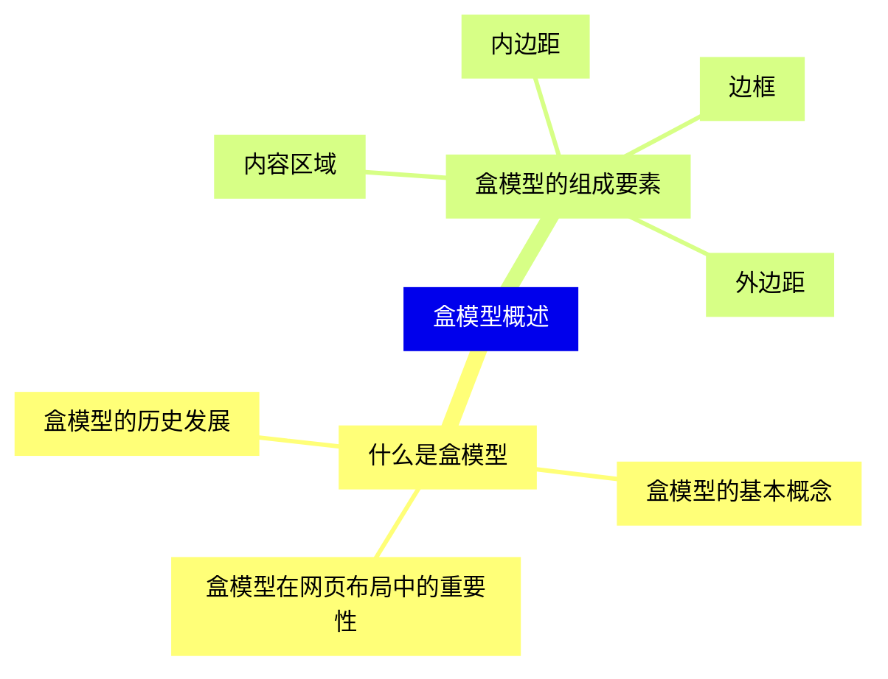
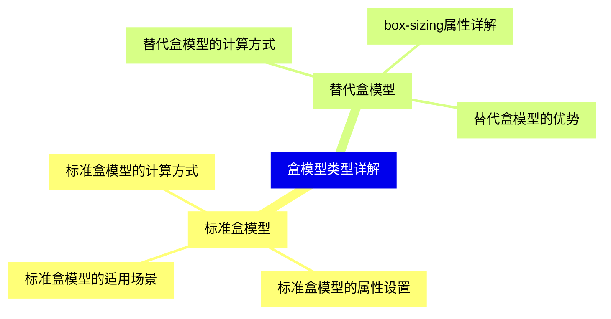
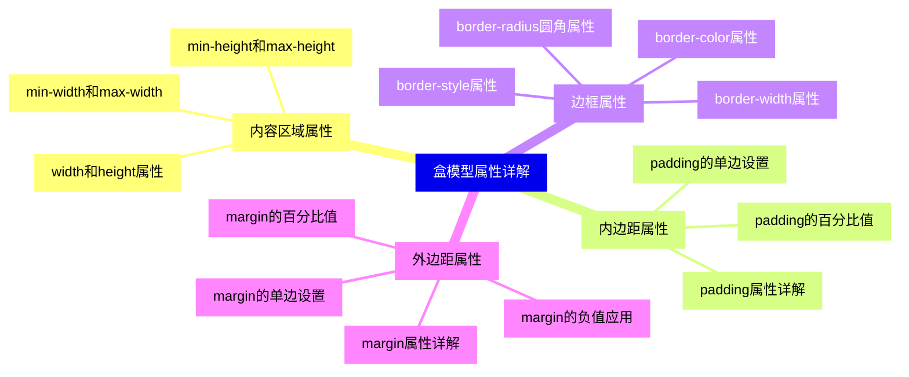
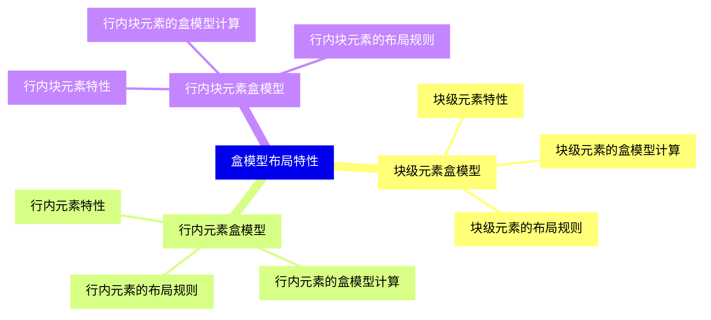
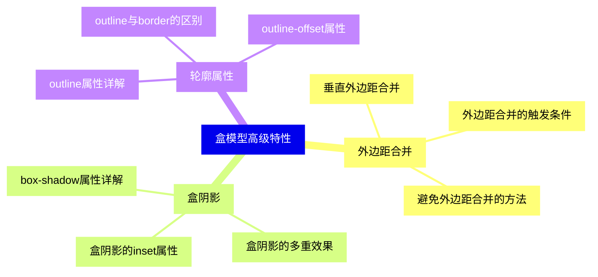
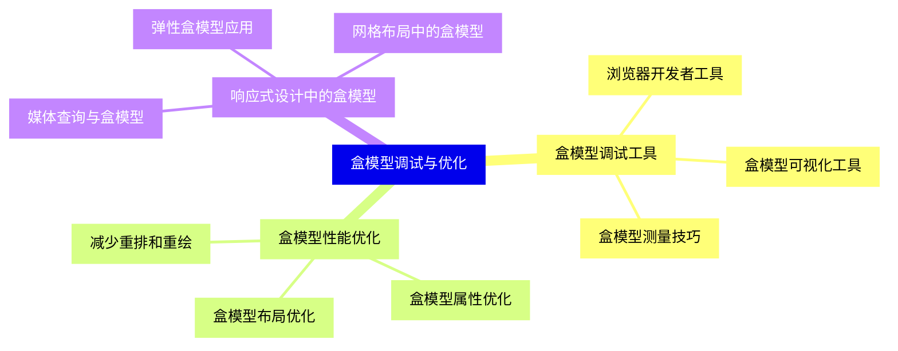
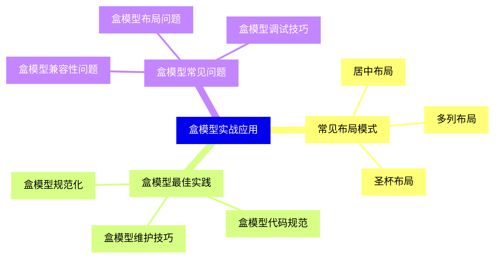


### 1 [盒模型概述](#1)
#### 1.1 [什么是盒模型](#1)
##### 1.1.1 [盒模型的基本概念](#1)
##### 1.1.2 [盒模型在网页布局中的重要性](#1)
##### 1.1.3 [盒模型的历史发展](#1)
#### 1.2 [盒模型的组成要素](#1)
##### 1.2.1 [内容区域](#1)
##### 1.2.2 [内边距](#1)
##### 1.2.3 [边框](#1)
##### 1.2.4 [外边距](#1)
### 2 [盒模型类型详解](#2)
#### 2.1 [标准盒模型](#2)
##### 2.1.1 [标准盒模型的计算方式](#2)
##### 2.1.2 [标准盒模型的属性设置](#2)
##### 2.1.3 [标准盒模型的适用场景](#2)
#### 2.2 [替代盒模型](#2)
##### 2.2.1 [替代盒模型的计算方式](#2)
##### 2.2.2 [box-sizing属性详解](#2)
##### 2.2.3 [替代盒模型的优势](#2)
### 3 [盒模型属性详解](#3)
#### 3.1 [内容区域属性](#3)
##### 3.1.1 [width和height属性](#3)
##### 3.1.2 [min-width和max-width](#3)
##### 3.1.3 [min-height和max-height](#3)
#### 3.2 [内边距属性](#3)
##### 3.2.1 [padding属性详解](#3)
##### 3.2.2 [padding的单边设置](#3)
##### 3.2.3 [padding的百分比值](#3)
#### 3.3 [边框属性](#3)
##### 3.3.1 [border-width属性](#3)
##### 3.3.2 [border-style属性](#3)
##### 3.3.3 [border-color属性](#3)
##### 3.3.4 [border-radius圆角属性](#3)
#### 3.4 [外边距属性](#3)
##### 3.4.1 [margin属性详解](#3)
##### 3.4.2 [margin的单边设置](#3)
##### 3.4.3 [margin的负值应用](#3)
##### 3.4.4 [margin的百分比值](#3)
### 4 [盒模型布局特性](#4)
#### 4.1 [块级元素盒模型](#4)
##### 4.1.1 [块级元素特性](#4)
##### 4.1.2 [块级元素的盒模型计算](#4)
##### 4.1.3 [块级元素的布局规则](#4)
#### 4.2 [行内元素盒模型](#4)
##### 4.2.1 [行内元素特性](#4)
##### 4.2.2 [行内元素的盒模型计算](#4)
##### 4.2.3 [行内元素的布局规则](#4)
#### 4.3 [行内块元素盒模型](#4)
##### 4.3.1 [行内块元素特性](#4)
##### 4.3.2 [行内块元素的盒模型计算](#4)
##### 4.3.3 [行内块元素的布局规则](#4)
### 5 [盒模型高级特性](#5)
#### 5.1 [外边距合并](#5)
##### 5.1.1 [垂直外边距合并](#5)
##### 5.1.2 [外边距合并的触发条件](#5)
##### 5.1.3 [避免外边距合并的方法](#5)
#### 5.2 [盒阴影](#5)
##### 5.2.1 [box-shadow属性详解](#5)
##### 5.2.2 [盒阴影的多重效果](#5)
##### 5.2.3 [盒阴影的inset属性](#5)
#### 5.3 [轮廓属性](#5)
##### 5.3.1 [outline属性详解](#5)
##### 5.3.2 [outline与border的区别](#5)
##### 5.3.3 [outline-offset属性](#5)
### 6 [盒模型调试与优化](#6)
#### 6.1 [盒模型调试工具](#6)
##### 6.1.1 [浏览器开发者工具](#6)
##### 6.1.2 [盒模型可视化工具](#6)
##### 6.1.3 [盒模型测量技巧](#6)
#### 6.2 [盒模型性能优化](#6)
##### 6.2.1 [减少重排和重绘](#6)
##### 6.2.2 [盒模型属性优化](#6)
##### 6.2.3 [盒模型布局优化](#6)
#### 6.3 [响应式设计中的盒模型](#6)
##### 6.3.1 [媒体查询与盒模型](#6)
##### 6.3.2 [弹性盒模型应用](#6)
##### 6.3.3 [网格布局中的盒模型](#6)
### 7 [盒模型实战应用](#7)
#### 7.1 [常见布局模式](#7)
##### 7.1.1 [居中布局](#7)
##### 7.1.2 [多列布局](#7)
##### 7.1.3 [圣杯布局](#7)
#### 7.2 [盒模型最佳实践](#7)
##### 7.2.1 [盒模型规范化](#7)
##### 7.2.2 [盒模型代码规范](#7)
##### 7.2.3 [盒模型维护技巧](#7)
#### 7.3 [盒模型常见问题](#7)
##### 7.3.1 [盒模型兼容性问题](#7)
##### 7.3.2 [盒模型布局问题](#7)
##### 7.3.3 [盒模型调试技巧](#7)




### 1 盒模型概述

---
### 1 盒模型概述
___
#### 1.1 什么是盒模型
___
##### 1.1.1 盒模型的基本概念
___
##### 1.1.2 盒模型在网页布局中的重要性
___
##### 1.1.3 盒模型的历史发展
___
#### 1.2 盒模型的组成要素
___
##### 1.2.1 内容区域
___
##### 1.2.2 内边距
___
##### 1.2.3 边框
___
##### 1.2.4 外边距
### 2 盒模型类型详解

---
### 2 盒模型类型详解
___
#### 2.1 标准盒模型
___
##### 2.1.1 标准盒模型的计算方式
___
##### 2.1.2 标准盒模型的属性设置
___
##### 2.1.3 标准盒模型的适用场景
___
#### 2.2 替代盒模型
___
##### 2.2.1 替代盒模型的计算方式
___
##### 2.2.2 box-sizing属性详解
___
##### 2.2.3 替代盒模型的优势
### 3 盒模型属性详解

---
### 3 盒模型属性详解
___
#### 3.1 内容区域属性
___
##### 3.1.1 width和height属性
___
##### 3.1.2 min-width和max-width
___
##### 3.1.3 min-height和max-height
___
#### 3.2 内边距属性
___
##### 3.2.1 padding属性详解
___
##### 3.2.2 padding的单边设置
___
##### 3.2.3 padding的百分比值
___
#### 3.3 边框属性
___
##### 3.3.1 border-width属性
___
##### 3.3.2 border-style属性
___
##### 3.3.3 border-color属性
___
##### 3.3.4 border-radius圆角属性
___
#### 3.4 外边距属性
___
##### 3.4.1 margin属性详解
___
##### 3.4.2 margin的单边设置
___
##### 3.4.3 margin的负值应用
___
##### 3.4.4 margin的百分比值
### 4 盒模型布局特性

---
### 4 盒模型布局特性
___
#### 4.1 块级元素盒模型
___
##### 4.1.1 块级元素特性
___
##### 4.1.2 块级元素的盒模型计算
___
##### 4.1.3 块级元素的布局规则
___
#### 4.2 行内元素盒模型
___
##### 4.2.1 行内元素特性
___
##### 4.2.2 行内元素的盒模型计算
___
##### 4.2.3 行内元素的布局规则
___
#### 4.3 行内块元素盒模型
___
##### 4.3.1 行内块元素特性
___
##### 4.3.2 行内块元素的盒模型计算
___
##### 4.3.3 行内块元素的布局规则
### 5 盒模型高级特性

---
### 5 盒模型高级特性
___
#### 5.1 外边距合并
___
##### 5.1.1 垂直外边距合并
___
##### 5.1.2 外边距合并的触发条件
___
##### 5.1.3 避免外边距合并的方法
___
#### 5.2 盒阴影
___
##### 5.2.1 box-shadow属性详解
___
##### 5.2.2 盒阴影的多重效果
___
##### 5.2.3 盒阴影的inset属性
___
#### 5.3 轮廓属性
___
##### 5.3.1 outline属性详解
___
##### 5.3.2 outline与border的区别
___
##### 5.3.3 outline-offset属性
### 6 盒模型调试与优化

---
### 6 盒模型调试与优化
___
#### 6.1 盒模型调试工具
___
##### 6.1.1 浏览器开发者工具
___
##### 6.1.2 盒模型可视化工具
___
##### 6.1.3 盒模型测量技巧
___
#### 6.2 盒模型性能优化
___
##### 6.2.1 减少重排和重绘
___
##### 6.2.2 盒模型属性优化
___
##### 6.2.3 盒模型布局优化
___
#### 6.3 响应式设计中的盒模型
___
##### 6.3.1 媒体查询与盒模型
___
##### 6.3.2 弹性盒模型应用
___
##### 6.3.3 网格布局中的盒模型
### 7 盒模型实战应用

---
### 7 盒模型实战应用
___
#### 7.1 常见布局模式
___
##### 7.1.1 居中布局
___
##### 7.1.2 多列布局
___
##### 7.1.3 圣杯布局
___
#### 7.2 盒模型最佳实践
___
##### 7.2.1 盒模型规范化
___
##### 7.2.2 盒模型代码规范
___
##### 7.2.3 盒模型维护技巧
___
#### 7.3 盒模型常见问题
___
##### 7.3.1 盒模型兼容性问题
___
##### 7.3.2 盒模型布局问题
___
##### 7.3.3 盒模型调试技巧


### 1 盒模型概述{#1}

{}

<--->
{}
{}
{}
{}
{}
{}
{}
{}
{}
{}
{}
{}
{}
{}
{}
{}
{}
{}
{}

### 2 盒模型类型详解{#2}

{}
{}
{}
{}
{}
{}
{}
{}
{}
{}
{}
{}
{}
{}
{}
{}
{}
<--->

{}

### 3 盒模型属性详解{#3}

{}

<--->
{}
{}
{}
{}
{}
{}
{}
{}
{}
{}
{}
{}
{}
{}
{}
{}
{}
{}
{}
{}
{}
{}
{}
{}
{}
{}
{}
{}
{}
{}
{}
{}
{}
{}
{}
{}
{}

### 4 盒模型布局特性{#4}

{}
{}
{}
{}
{}
{}
{}
{}
{}
{}
{}
{}
{}
{}
{}
{}
{}
{}
{}
{}
{}
{}
{}
{}
{}
<--->

{}

### 5 盒模型高级特性{#5}

{}

<--->
{}
{}
{}
{}
{}
{}
{}
{}
{}
{}
{}
{}
{}
{}
{}
{}
{}
{}
{}
{}
{}
{}
{}
{}
{}

### 6 盒模型调试与优化{#6}

{}
{}
{}
{}
{}
{}
{}
{}
{}
{}
{}
{}
{}
{}
{}
{}
{}
{}
{}
{}
{}
{}
{}
{}
{}
<--->

{}

### 7 盒模型实战应用{#7}

{}

<--->
{}
{}
{}
{}
{}
{}
{}
{}
{}
{}
{}
{}
{}
{}
{}
{}
{}
{}
{}
{}
{}
{}
{}
{}
{}
