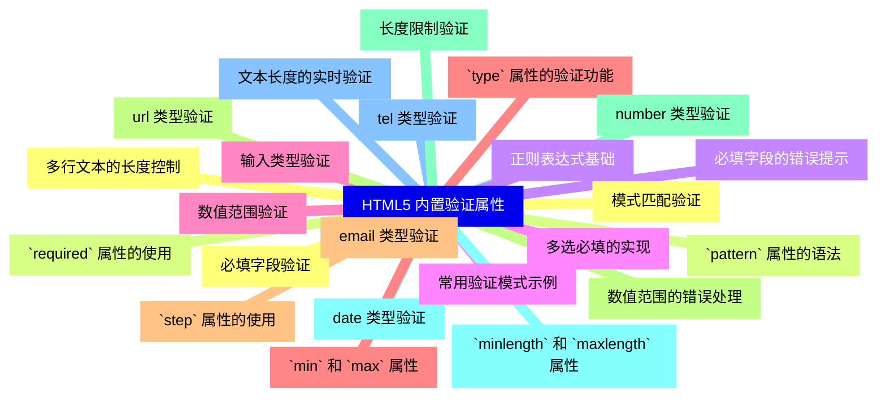
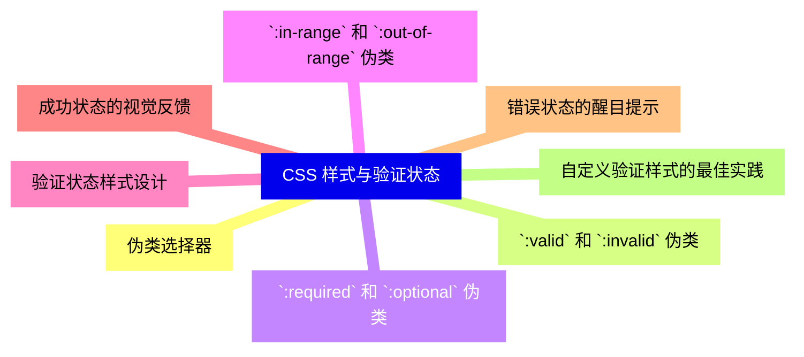
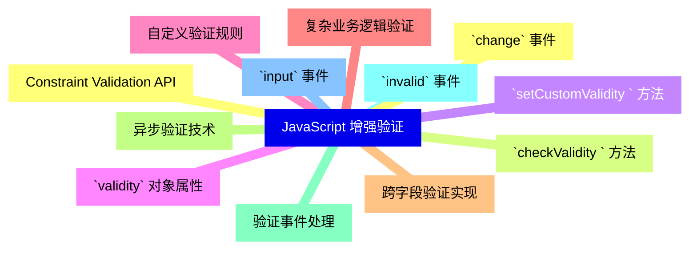
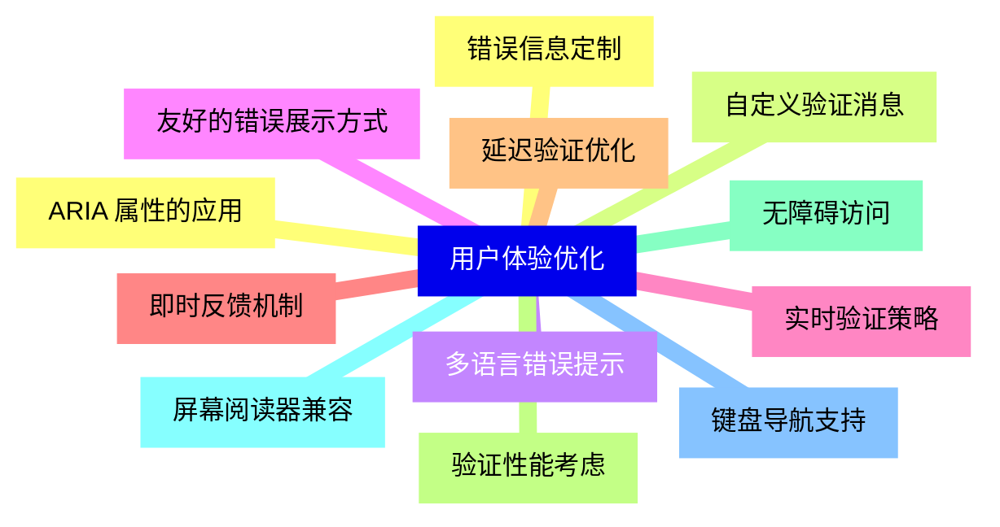
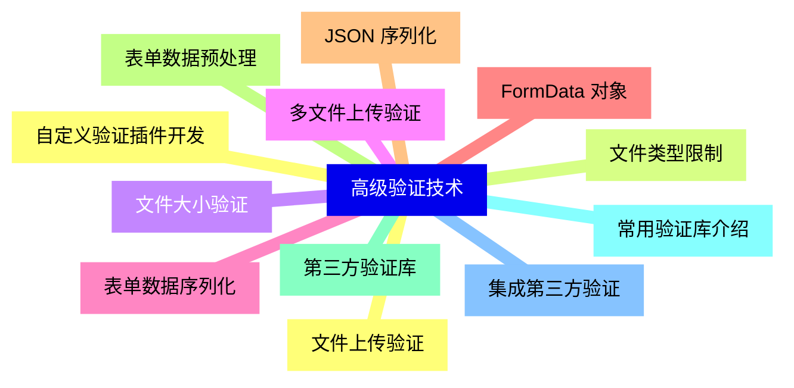
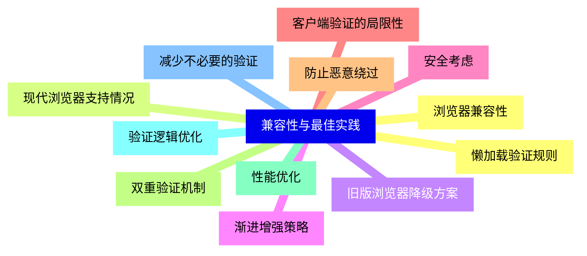
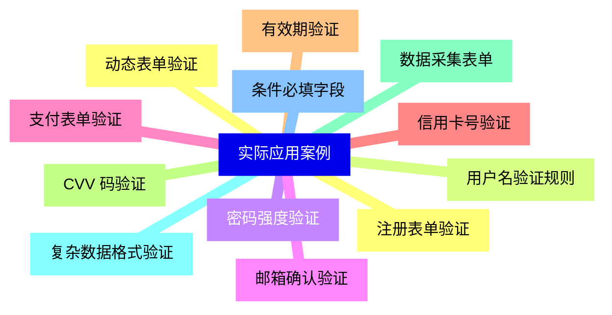
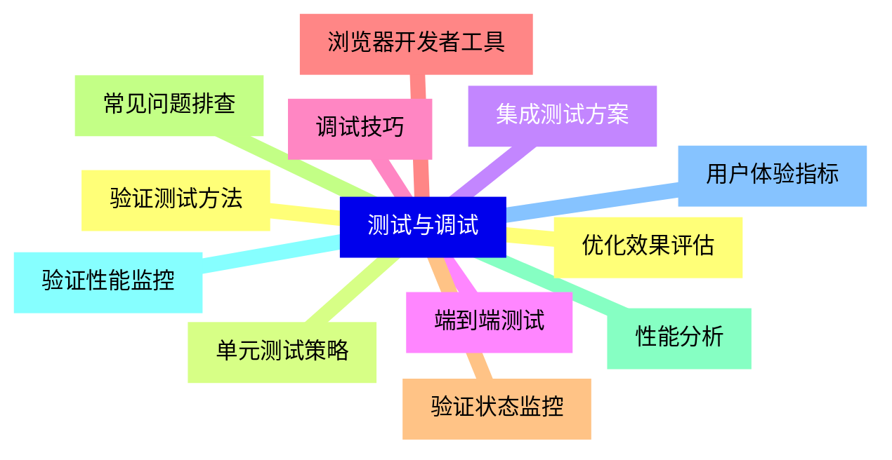

```mermaid
mindmap
    id1[HTML5 表单验证基础]
        id1-1[表单验证概述]
        id1-2[表单验证的定义与重要性]
        id1-3[客户端验证与服务器端验证的区别]
        id1-4[HTML5 表单验证的优势]
        id1-5[表单结构基础]
        id1-6[`<form>` 元素及其属性]
        id1-7[常用表单控件类型]
        id1-8[表单分组与布局]
```

### 1 [HTML5 表单验证基础](#1)
#### 1.1 [表单验证概述](#1)
#### 1.2 [表单验证的定义与重要性](#1)
#### 1.3 [客户端验证与服务器端验证的区别](#1)
#### 1.4 [HTML5 表单验证的优势](#1)
#### 1.5 [表单结构基础](#1)
#### 1.6 [`<form>` 元素及其属性](#1)
#### 1.7 [常用表单控件类型](#1)
#### 1.8 [表单分组与布局](#1)
### 2 [HTML5 内置验证属性](#2)
#### 2.1 [必填字段验证](#2)
#### 2.2 [`required` 属性的使用](#2)
#### 2.3 [必填字段的错误提示](#2)
#### 2.4 [多选必填的实现](#2)
#### 2.5 [输入类型验证](#2)
#### 2.6 [`type` 属性的验证功能](#2)
#### 2.7 [email 类型验证](#2)
#### 2.8 [url 类型验证](#2)
#### 2.9 [number 类型验证](#2)
#### 2.10 [date 类型验证](#2)
#### 2.11 [tel 类型验证](#2)
#### 2.12 [模式匹配验证](#2)
#### 2.13 [`pattern` 属性的语法](#2)
#### 2.14 [正则表达式基础](#2)
#### 2.15 [常用验证模式示例](#2)
#### 2.16 [数值范围验证](#2)
#### 2.17 [`min` 和 `max` 属性](#2)
#### 2.18 [`step` 属性的使用](#2)
#### 2.19 [数值范围的错误处理](#2)
#### 2.20 [长度限制验证](#2)
#### 2.21 [`minlength` 和 `maxlength` 属性](#2)
#### 2.22 [文本长度的实时验证](#2)
#### 2.23 [多行文本的长度控制](#2)
### 3 [CSS 样式与验证状态](#3)
#### 3.1 [伪类选择器](#3)
#### 3.2 [`:valid` 和 `:invalid` 伪类](#3)
#### 3.3 [`:required` 和 `:optional` 伪类](#3)
#### 3.4 [`:in-range` 和 `:out-of-range` 伪类](#3)
#### 3.5 [验证状态样式设计](#3)
#### 3.6 [成功状态的视觉反馈](#3)
#### 3.7 [错误状态的醒目提示](#3)
#### 3.8 [自定义验证样式的最佳实践](#3)
### 4 [JavaScript 增强验证](#4)
#### 4.1 [Constraint Validation API](#4)
#### 4.2 [`checkValidity  ` 方法](#4)
#### 4.3 [`setCustomValidity  ` 方法](#4)
#### 4.4 [`validity` 对象属性](#4)
#### 4.5 [自定义验证规则](#4)
#### 4.6 [复杂业务逻辑验证](#4)
#### 4.7 [跨字段验证实现](#4)
#### 4.8 [异步验证技术](#4)
#### 4.9 [验证事件处理](#4)
#### 4.10 [`invalid` 事件](#4)
#### 4.11 [`input` 事件](#4)
#### 4.12 [`change` 事件](#4)
### 5 [用户体验优化](#5)
#### 5.1 [错误信息定制](#5)
#### 5.2 [自定义验证消息](#5)
#### 5.3 [多语言错误提示](#5)
#### 5.4 [友好的错误展示方式](#5)
#### 5.5 [实时验证策略](#5)
#### 5.6 [即时反馈机制](#5)
#### 5.7 [延迟验证优化](#5)
#### 5.8 [验证性能考虑](#5)
#### 5.9 [无障碍访问](#5)
#### 5.10 [屏幕阅读器兼容](#5)
#### 5.11 [键盘导航支持](#5)
#### 5.12 [ARIA 属性的应用](#5)
### 6 [高级验证技术](#6)
#### 6.1 [文件上传验证](#6)
#### 6.2 [文件类型限制](#6)
#### 6.3 [文件大小验证](#6)
#### 6.4 [多文件上传验证](#6)
#### 6.5 [表单数据序列化](#6)
#### 6.6 [FormData 对象](#6)
#### 6.7 [JSON 序列化](#6)
#### 6.8 [表单数据预处理](#6)
#### 6.9 [第三方验证库](#6)
#### 6.10 [常用验证库介绍](#6)
#### 6.11 [集成第三方验证](#6)
#### 6.12 [自定义验证插件开发](#6)
### 7 [兼容性与最佳实践](#7)
#### 7.1 [浏览器兼容性](#7)
#### 7.2 [现代浏览器支持情况](#7)
#### 7.3 [旧版浏览器降级方案](#7)
#### 7.4 [渐进增强策略](#7)
#### 7.5 [安全考虑](#7)
#### 7.6 [客户端验证的局限性](#7)
#### 7.7 [防止恶意绕过](#7)
#### 7.8 [双重验证机制](#7)
#### 7.9 [性能优化](#7)
#### 7.10 [验证逻辑优化](#7)
#### 7.11 [减少不必要的验证](#7)
#### 7.12 [懒加载验证规则](#7)
### 8 [实际应用案例](#8)
#### 8.1 [注册表单验证](#8)
#### 8.2 [用户名验证规则](#8)
#### 8.3 [密码强度验证](#8)
#### 8.4 [邮箱确认验证](#8)
#### 8.5 [支付表单验证](#8)
#### 8.6 [信用卡号验证](#8)
#### 8.7 [有效期验证](#8)
#### 8.8 [CVV 码验证](#8)
#### 8.9 [数据采集表单](#8)
#### 8.10 [复杂数据格式验证](#8)
#### 8.11 [条件必填字段](#8)
#### 8.12 [动态表单验证](#8)
### 9 [测试与调试](#9)
#### 9.1 [验证测试方法](#9)
#### 9.2 [单元测试策略](#9)
#### 9.3 [集成测试方案](#9)
#### 9.4 [端到端测试](#9)
#### 9.5 [调试技巧](#9)
#### 9.6 [浏览器开发者工具](#9)
#### 9.7 [验证状态监控](#9)
#### 9.8 [常见问题排查](#9)
#### 9.9 [性能分析](#9)
#### 9.10 [验证性能监控](#9)
#### 9.11 [用户体验指标](#9)
#### 9.12 [优化效果评估](#9)




### 1 HTML5 表单验证基础

---
### 1 HTML5 表单验证基础
___
#### 1.1 表单验证概述
___
#### 1.2 表单验证的定义与重要性
___
#### 1.3 客户端验证与服务器端验证的区别
___
#### 1.4 HTML5 表单验证的优势
___
#### 1.5 表单结构基础
___
#### 1.6 `<form>` 元素及其属性
___
#### 1.7 常用表单控件类型
___
#### 1.8 表单分组与布局
### 2 HTML5 内置验证属性

---
### 2 HTML5 内置验证属性
___
#### 2.1 必填字段验证
___
#### 2.2 `required` 属性的使用
___
#### 2.3 必填字段的错误提示
___
#### 2.4 多选必填的实现
___
#### 2.5 输入类型验证
___
#### 2.6 `type` 属性的验证功能
___
#### 2.7 email 类型验证
___
#### 2.8 url 类型验证
___
#### 2.9 number 类型验证
___
#### 2.10 date 类型验证
___
#### 2.11 tel 类型验证
___
#### 2.12 模式匹配验证
___
#### 2.13 `pattern` 属性的语法
___
#### 2.14 正则表达式基础
___
#### 2.15 常用验证模式示例
___
#### 2.16 数值范围验证
___
#### 2.17 `min` 和 `max` 属性
___
#### 2.18 `step` 属性的使用
___
#### 2.19 数值范围的错误处理
___
#### 2.20 长度限制验证
___
#### 2.21 `minlength` 和 `maxlength` 属性
___
#### 2.22 文本长度的实时验证
___
#### 2.23 多行文本的长度控制
### 3 CSS 样式与验证状态

---
### 3 CSS 样式与验证状态
___
#### 3.1 伪类选择器
___
#### 3.2 `:valid` 和 `:invalid` 伪类
___
#### 3.3 `:required` 和 `:optional` 伪类
___
#### 3.4 `:in-range` 和 `:out-of-range` 伪类
___
#### 3.5 验证状态样式设计
___
#### 3.6 成功状态的视觉反馈
___
#### 3.7 错误状态的醒目提示
___
#### 3.8 自定义验证样式的最佳实践
### 4 JavaScript 增强验证

---
### 4 JavaScript 增强验证
___
#### 4.1 Constraint Validation API
___
#### 4.2 `checkValidity  ` 方法
___
#### 4.3 `setCustomValidity  ` 方法
___
#### 4.4 `validity` 对象属性
___
#### 4.5 自定义验证规则
___
#### 4.6 复杂业务逻辑验证
___
#### 4.7 跨字段验证实现
___
#### 4.8 异步验证技术
___
#### 4.9 验证事件处理
___
#### 4.10 `invalid` 事件
___
#### 4.11 `input` 事件
___
#### 4.12 `change` 事件
### 5 用户体验优化

---
### 5 用户体验优化
___
#### 5.1 错误信息定制
___
#### 5.2 自定义验证消息
___
#### 5.3 多语言错误提示
___
#### 5.4 友好的错误展示方式
___
#### 5.5 实时验证策略
___
#### 5.6 即时反馈机制
___
#### 5.7 延迟验证优化
___
#### 5.8 验证性能考虑
___
#### 5.9 无障碍访问
___
#### 5.10 屏幕阅读器兼容
___
#### 5.11 键盘导航支持
___
#### 5.12 ARIA 属性的应用
### 6 高级验证技术

---
### 6 高级验证技术
___
#### 6.1 文件上传验证
___
#### 6.2 文件类型限制
___
#### 6.3 文件大小验证
___
#### 6.4 多文件上传验证
___
#### 6.5 表单数据序列化
___
#### 6.6 FormData 对象
___
#### 6.7 JSON 序列化
___
#### 6.8 表单数据预处理
___
#### 6.9 第三方验证库
___
#### 6.10 常用验证库介绍
___
#### 6.11 集成第三方验证
___
#### 6.12 自定义验证插件开发
### 7 兼容性与最佳实践

---
### 7 兼容性与最佳实践
___
#### 7.1 浏览器兼容性
___
#### 7.2 现代浏览器支持情况
___
#### 7.3 旧版浏览器降级方案
___
#### 7.4 渐进增强策略
___
#### 7.5 安全考虑
___
#### 7.6 客户端验证的局限性
___
#### 7.7 防止恶意绕过
___
#### 7.8 双重验证机制
___
#### 7.9 性能优化
___
#### 7.10 验证逻辑优化
___
#### 7.11 减少不必要的验证
___
#### 7.12 懒加载验证规则
### 8 实际应用案例

---
### 8 实际应用案例
___
#### 8.1 注册表单验证
___
#### 8.2 用户名验证规则
___
#### 8.3 密码强度验证
___
#### 8.4 邮箱确认验证
___
#### 8.5 支付表单验证
___
#### 8.6 信用卡号验证
___
#### 8.7 有效期验证
___
#### 8.8 CVV 码验证
___
#### 8.9 数据采集表单
___
#### 8.10 复杂数据格式验证
___
#### 8.11 条件必填字段
___
#### 8.12 动态表单验证
### 9 测试与调试

---
### 9 测试与调试
___
#### 9.1 验证测试方法
___
#### 9.2 单元测试策略
___
#### 9.3 集成测试方案
___
#### 9.4 端到端测试
___
#### 9.5 调试技巧
___
#### 9.6 浏览器开发者工具
___
#### 9.7 验证状态监控
___
#### 9.8 常见问题排查
___
#### 9.9 性能分析
___
#### 9.10 验证性能监控
___
#### 9.11 用户体验指标
___
#### 9.12 优化效果评估


### 1 HTML5 表单验证基础{#1}

{}

<--->
{}
{}
{}
{}
{}
{}
{}
{}
{}
{}
{}
{}
{}
{}
{}
{}
{}

### 2 HTML5 内置验证属性{#2}

{}
{}
{}
{}
{}
{}
{}
{}
{}
{}
{}
{}
{}
{}
{}
{}
{}
{}
{}
{}
{}
{}
{}
{}
{}
{}
{}
{}
{}
{}
{}
{}
{}
{}
{}
{}
{}
{}
{}
{}
{}
{}
{}
{}
{}
{}
{}
<--->

{}

### 3 CSS 样式与验证状态{#3}

{}

<--->
{}
{}
{}
{}
{}
{}
{}
{}
{}
{}
{}
{}
{}
{}
{}
{}
{}

### 4 JavaScript 增强验证{#4}

{}
{}
{}
{}
{}
{}
{}
{}
{}
{}
{}
{}
{}
{}
{}
{}
{}
{}
{}
{}
{}
{}
{}
{}
{}
<--->

{}

### 5 用户体验优化{#5}

{}

<--->
{}
{}
{}
{}
{}
{}
{}
{}
{}
{}
{}
{}
{}
{}
{}
{}
{}
{}
{}
{}
{}
{}
{}
{}
{}

### 6 高级验证技术{#6}

{}
{}
{}
{}
{}
{}
{}
{}
{}
{}
{}
{}
{}
{}
{}
{}
{}
{}
{}
{}
{}
{}
{}
{}
{}
<--->

{}

### 7 兼容性与最佳实践{#7}

{}

<--->
{}
{}
{}
{}
{}
{}
{}
{}
{}
{}
{}
{}
{}
{}
{}
{}
{}
{}
{}
{}
{}
{}
{}
{}
{}

### 8 实际应用案例{#8}

{}
{}
{}
{}
{}
{}
{}
{}
{}
{}
{}
{}
{}
{}
{}
{}
{}
{}
{}
{}
{}
{}
{}
{}
{}
<--->

{}

### 9 测试与调试{#9}

{}

<--->
{}
{}
{}
{}
{}
{}
{}
{}
{}
{}
{}
{}
{}
{}
{}
{}
{}
{}
{}
{}
{}
{}
{}
{}
{}
