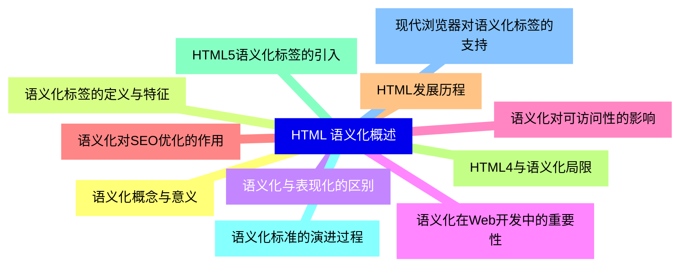
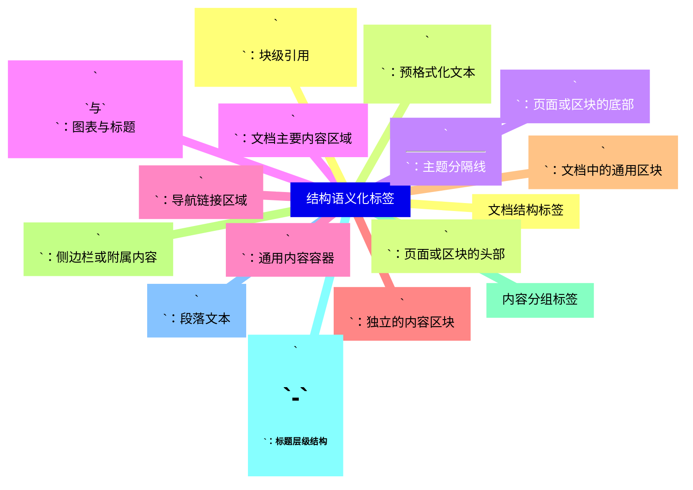
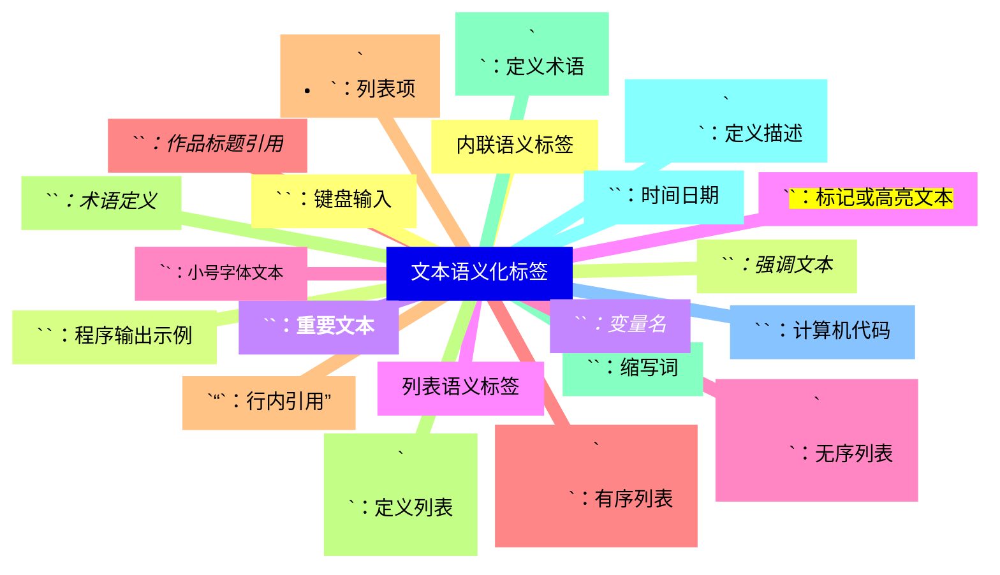
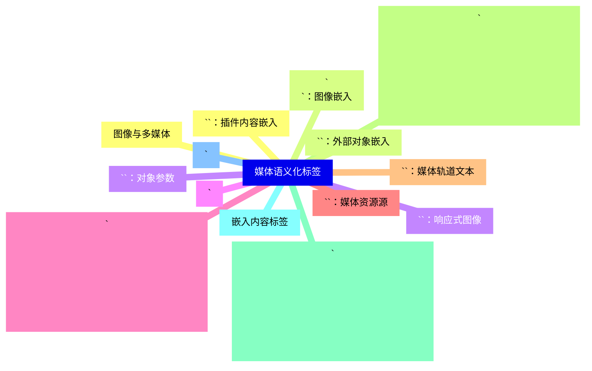
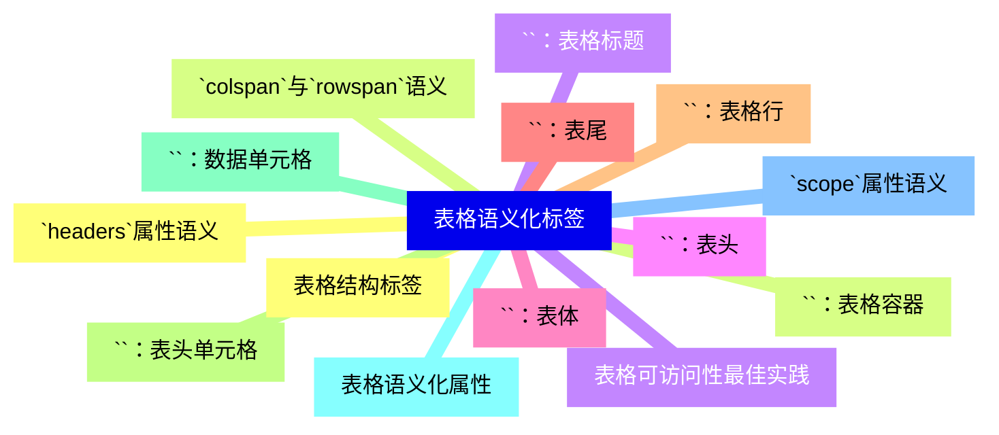
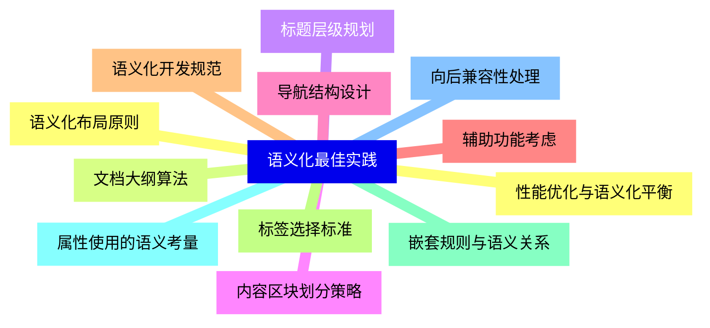
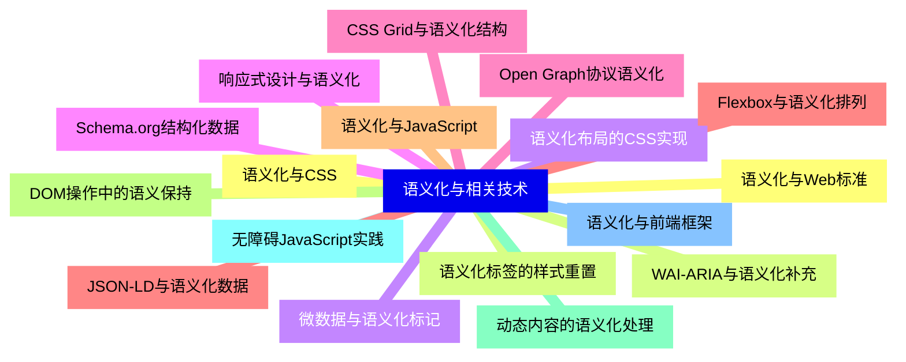
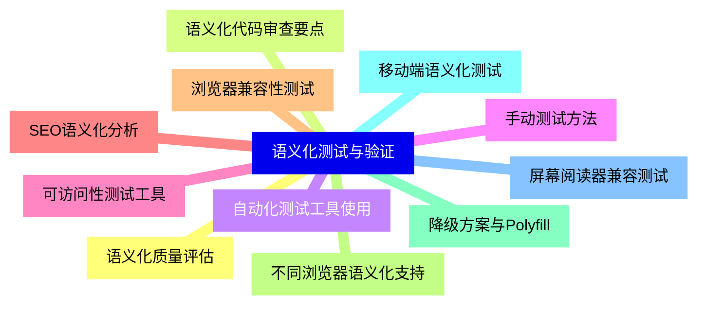
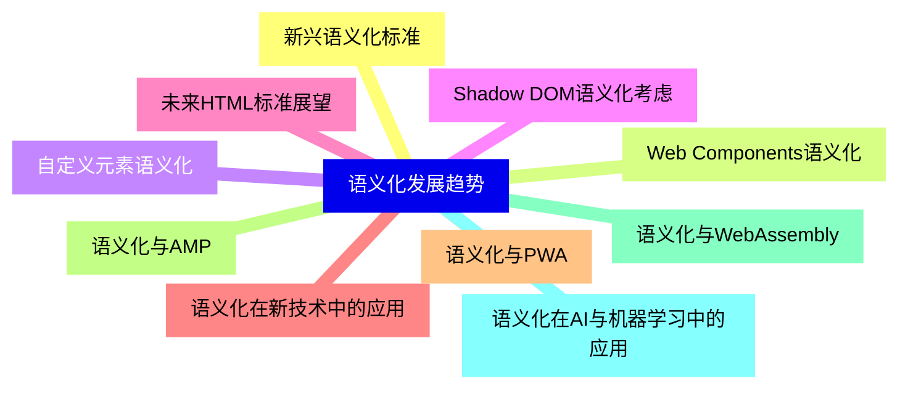

```mermaid
mindmap
    id5[表单语义化标签]
        id5-1[表单结构标签]
        id5-2[`<form>`：表单容器]
        id5-3[`<fieldset>`：表单分组]
        id5-4[`<legend>`：分组标题]
        id5-5[`<label>`：表单标签]
        id5-6[`<input>`：输入控件]
        id5-7[`<textarea>`：多行文本输入]
        id5-8[`<select>`：下拉选择]
        id5-9[`<option>`：选项]
        id5-10[`<optgroup>`：选项分组]
        id5-11[`<button>`：按钮]
        id5-12[`<datalist>`：数据列表]
        id5-13[`<output>`：计算结果输出]
        id5-14[`<progress>`：进度条]
        id5-15[`<meter>`：度量衡]
        id5-16[表单输入类型]
        id5-17[文本输入类型语义]
        id5-18[数字输入类型语义]
        id5-19[日期时间输入类型语义]
        id5-20[选择输入类型语义]
        id5-21[文件上传语义]
        id5-22[隐藏输入语义]
```

### 1 [HTML 语义化概述](#1)
#### 1.1 [语义化概念与意义](#1)
#### 1.2 [语义化标签的定义与特征](#1)
#### 1.3 [语义化与表现化的区别](#1)
#### 1.4 [语义化在Web开发中的重要性](#1)
#### 1.5 [语义化对可访问性的影响](#1)
#### 1.6 [语义化对SEO优化的作用](#1)
#### 1.7 [HTML发展历程](#1)
#### 1.8 [HTML4与语义化局限](#1)
#### 1.9 [HTML5语义化标签的引入](#1)
#### 1.10 [语义化标准的演进过程](#1)
#### 1.11 [现代浏览器对语义化标签的支持](#1)
### 2 [结构语义化标签](#2)
#### 2.1 [文档结构标签](#2)
#### 2.2 [`<header>`：页面或区块的头部](#2)
#### 2.3 [`<footer>`：页面或区块的底部](#2)
#### 2.4 [`<main>`：文档主要内容区域](#2)
#### 2.5 [`<nav>`：导航链接区域](#2)
#### 2.6 [`<article>`：独立的内容区块](#2)
#### 2.7 [`<section>`：文档中的通用区块](#2)
#### 2.8 [`<aside>`：侧边栏或附属内容](#2)
#### 2.9 [内容分组标签](#2)
#### 2.10 [`<h1>`-`<h6>`：标题层级结构](#2)
#### 2.11 [`
`：段落文本](#2)
#### 2.12 [`<blockquote>`：块级引用](#2)
#### 2.13 [`<pre>`：预格式化文本](#2)
#### 2.14 [`
`：主题分隔线](#2)
#### 2.15 [`<figure>`与`<figcaption>`：图表与标题](#2)
#### 2.16 [`
`：通用内容容器](#2)
### 3 [文本语义化标签](#3)
#### 3.1 [内联语义标签](#3)
#### 3.2 [`<em>`：强调文本](#3)
#### 3.3 [`<strong>`：重要文本](#3)
#### 3.4 [`<mark>`：标记或高亮文本](#3)
#### 3.5 [`<small>`：小号字体文本](#3)
#### 3.6 [`<cite>`：作品标题引用](#3)
#### 3.7 [`<q>`：行内引用](#3)
#### 3.8 [`<dfn>`：术语定义](#3)
#### 3.9 [`<abbr>`：缩写词](#3)
#### 3.10 [`<time>`：时间日期](#3)
#### 3.11 [`<code>`：计算机代码](#3)
#### 3.12 [`<kbd>`：键盘输入](#3)
#### 3.13 [`<samp>`：程序输出示例](#3)
#### 3.14 [`<var>`：变量名](#3)
#### 3.15 [列表语义标签](#3)
#### 3.16 [`<ul>`：无序列表](#3)
#### 3.17 [`<ol>`：有序列表](#3)
#### 3.18 [`<li>`：列表项](#3)
#### 3.19 [`<dl>`：定义列表](#3)
#### 3.20 [`<dt>`：定义术语](#3)
#### 3.21 [`<dd>`：定义描述](#3)
### 4 [媒体语义化标签](#4)
#### 4.1 [图像与多媒体](#4)
#### 4.2 [``：图像嵌入](#4)
#### 4.3 [`<picture>`：响应式图像](#4)
#### 4.4 [`<audio>`：音频内容](#4)
#### 4.5 [`<video>`：视频内容](#4)
#### 4.6 [`<source>`：媒体资源源](#4)
#### 4.7 [`<track>`：媒体轨道文本](#4)
#### 4.8 [`<canvas>`：图形绘制画布](#4)
#### 4.9 [`<svg>`：矢量图形](#4)
#### 4.10 [嵌入内容标签](#4)
#### 4.11 [`<iframe>`：内联框架](#4)
#### 4.12 [`<embed>`：插件内容嵌入](#4)
#### 4.13 [`<object>`：外部对象嵌入](#4)
#### 4.14 [`<param>`：对象参数](#4)
### 5 [表单语义化标签](#5)
#### 5.1 [表单结构标签](#5)
#### 5.2 [`<form>`：表单容器](#5)
#### 5.3 [`<fieldset>`：表单分组](#5)
#### 5.4 [`<legend>`：分组标题](#5)
#### 5.5 [`<label>`：表单标签](#5)
#### 5.6 [`<input>`：输入控件](#5)
#### 5.7 [`<textarea>`：多行文本输入](#5)
#### 5.8 [`<select>`：下拉选择](#5)
#### 5.9 [`<option>`：选项](#5)
#### 5.10 [`<optgroup>`：选项分组](#5)
#### 5.11 [`<button>`：按钮](#5)
#### 5.12 [`<datalist>`：数据列表](#5)
#### 5.13 [`<output>`：计算结果输出](#5)
#### 5.14 [`<progress>`：进度条](#5)
#### 5.15 [`<meter>`：度量衡](#5)
#### 5.16 [表单输入类型](#5)
#### 5.17 [文本输入类型语义](#5)
#### 5.18 [数字输入类型语义](#5)
#### 5.19 [日期时间输入类型语义](#5)
#### 5.20 [选择输入类型语义](#5)
#### 5.21 [文件上传语义](#5)
#### 5.22 [隐藏输入语义](#5)
### 6 [表格语义化标签](#6)
#### 6.1 [表格结构标签](#6)
#### 6.2 [`<table>`：表格容器](#6)
#### 6.3 [`<caption>`：表格标题](#6)
#### 6.4 [`<thead>`：表头](#6)
#### 6.5 [`<tbody>`：表体](#6)
#### 6.6 [`<tfoot>`：表尾](#6)
#### 6.7 [`<tr>`：表格行](#6)
#### 6.8 [`<th>`：表头单元格](#6)
#### 6.9 [`<td>`：数据单元格](#6)
#### 6.10 [表格语义化属性](#6)
#### 6.11 [`scope`属性语义](#6)
#### 6.12 [`headers`属性语义](#6)
#### 6.13 [`colspan`与`rowspan`语义](#6)
#### 6.14 [表格可访问性最佳实践](#6)
### 7 [语义化最佳实践](#7)
#### 7.1 [语义化布局原则](#7)
#### 7.2 [文档大纲算法](#7)
#### 7.3 [标题层级规划](#7)
#### 7.4 [内容区块划分策略](#7)
#### 7.5 [导航结构设计](#7)
#### 7.6 [辅助功能考虑](#7)
#### 7.7 [语义化开发规范](#7)
#### 7.8 [标签选择标准](#7)
#### 7.9 [嵌套规则与语义关系](#7)
#### 7.10 [属性使用的语义考量](#7)
#### 7.11 [向后兼容性处理](#7)
#### 7.12 [性能优化与语义化平衡](#7)
### 8 [语义化与相关技术](#8)
#### 8.1 [语义化与CSS](#8)
#### 8.2 [语义化标签的样式重置](#8)
#### 8.3 [语义化布局的CSS实现](#8)
#### 8.4 [响应式设计与语义化](#8)
#### 8.5 [CSS Grid与语义化结构](#8)
#### 8.6 [Flexbox与语义化排列](#8)
#### 8.7 [语义化与JavaScript](#8)
#### 8.8 [DOM操作中的语义保持](#8)
#### 8.9 [动态内容的语义化处理](#8)
#### 8.10 [无障碍JavaScript实践](#8)
#### 8.11 [语义化与前端框架](#8)
#### 8.12 [语义化与Web标准](#8)
#### 8.13 [WAI-ARIA与语义化补充](#8)
#### 8.14 [微数据与语义化标记](#8)
#### 8.15 [Schema.org结构化数据](#8)
#### 8.16 [Open Graph协议语义化](#8)
#### 8.17 [JSON-LD与语义化数据](#8)
### 9 [语义化测试与验证](#9)
#### 9.1 [语义化质量评估](#9)
#### 9.2 [语义化代码审查要点](#9)
#### 9.3 [自动化测试工具使用](#9)
#### 9.4 [手动测试方法](#9)
#### 9.5 [可访问性测试工具](#9)
#### 9.6 [SEO语义化分析](#9)
#### 9.7 [浏览器兼容性测试](#9)
#### 9.8 [不同浏览器语义化支持](#9)
#### 9.9 [降级方案与Polyfill](#9)
#### 9.10 [移动端语义化测试](#9)
#### 9.11 [屏幕阅读器兼容测试](#9)
### 10 [语义化发展趋势](#10)
#### 10.1 [新兴语义化标准](#10)
#### 10.2 [Web Components语义化](#10)
#### 10.3 [自定义元素语义化](#10)
#### 10.4 [Shadow DOM语义化考虑](#10)
#### 10.5 [未来HTML标准展望](#10)
#### 10.6 [语义化在新技术中的应用](#10)
#### 10.7 [语义化与PWA](#10)
#### 10.8 [语义化与AMP](#10)
#### 10.9 [语义化与WebAssembly](#10)
#### 10.10 [语义化在AI与机器学习中的应用](#10)




### 1 HTML 语义化概述

---
### 1 HTML 语义化概述
___
#### 1.1 语义化概念与意义
___
#### 1.2 语义化标签的定义与特征
___
#### 1.3 语义化与表现化的区别
___
#### 1.4 语义化在Web开发中的重要性
___
#### 1.5 语义化对可访问性的影响
___
#### 1.6 语义化对SEO优化的作用
___
#### 1.7 HTML发展历程
___
#### 1.8 HTML4与语义化局限
___
#### 1.9 HTML5语义化标签的引入
___
#### 1.10 语义化标准的演进过程
___
#### 1.11 现代浏览器对语义化标签的支持
### 2 结构语义化标签

---
### 2 结构语义化标签
___
#### 2.1 文档结构标签
___
#### 2.2 `<header>`：页面或区块的头部
___
#### 2.3 `<footer>`：页面或区块的底部
___
#### 2.4 `<main>`：文档主要内容区域
___
#### 2.5 `<nav>`：导航链接区域
___
#### 2.6 `<article>`：独立的内容区块
___
#### 2.7 `<section>`：文档中的通用区块
___
#### 2.8 `<aside>`：侧边栏或附属内容
___
#### 2.9 内容分组标签
___
#### 2.10 `<h1>`-`<h6>`：标题层级结构
___
#### 2.11 `
`：段落文本
___
#### 2.12 `<blockquote>`：块级引用
___
#### 2.13 `<pre>`：预格式化文本
___
#### 2.14 `
`：主题分隔线
___
#### 2.15 `<figure>`与`<figcaption>`：图表与标题
___
#### 2.16 `
`：通用内容容器
### 3 文本语义化标签

---
### 3 文本语义化标签
___
#### 3.1 内联语义标签
___
#### 3.2 `<em>`：强调文本
___
#### 3.3 `<strong>`：重要文本
___
#### 3.4 `<mark>`：标记或高亮文本
___
#### 3.5 `<small>`：小号字体文本
___
#### 3.6 `<cite>`：作品标题引用
___
#### 3.7 `<q>`：行内引用
___
#### 3.8 `<dfn>`：术语定义
___
#### 3.9 `<abbr>`：缩写词
___
#### 3.10 `<time>`：时间日期
___
#### 3.11 `<code>`：计算机代码
___
#### 3.12 `<kbd>`：键盘输入
___
#### 3.13 `<samp>`：程序输出示例
___
#### 3.14 `<var>`：变量名
___
#### 3.15 列表语义标签
___
#### 3.16 `<ul>`：无序列表
___
#### 3.17 `<ol>`：有序列表
___
#### 3.18 `<li>`：列表项
___
#### 3.19 `<dl>`：定义列表
___
#### 3.20 `<dt>`：定义术语
___
#### 3.21 `<dd>`：定义描述
### 4 媒体语义化标签

---
### 4 媒体语义化标签
___
#### 4.1 图像与多媒体
___
#### 4.2 ``：图像嵌入
___
#### 4.3 `<picture>`：响应式图像
___
#### 4.4 `<audio>`：音频内容
___
#### 4.5 `<video>`：视频内容
___
#### 4.6 `<source>`：媒体资源源
___
#### 4.7 `<track>`：媒体轨道文本
___
#### 4.8 `<canvas>`：图形绘制画布
___
#### 4.9 `<svg>`：矢量图形
___
#### 4.10 嵌入内容标签
___
#### 4.11 `<iframe>`：内联框架
___
#### 4.12 `<embed>`：插件内容嵌入
___
#### 4.13 `<object>`：外部对象嵌入
___
#### 4.14 `<param>`：对象参数
### 5 表单语义化标签

---
### 5 表单语义化标签
___
#### 5.1 表单结构标签
___
#### 5.2 `<form>`：表单容器
___
#### 5.3 `<fieldset>`：表单分组
___
#### 5.4 `<legend>`：分组标题
___
#### 5.5 `<label>`：表单标签
___
#### 5.6 `<input>`：输入控件
___
#### 5.7 `<textarea>`：多行文本输入
___
#### 5.8 `<select>`：下拉选择
___
#### 5.9 `<option>`：选项
___
#### 5.10 `<optgroup>`：选项分组
___
#### 5.11 `<button>`：按钮
___
#### 5.12 `<datalist>`：数据列表
___
#### 5.13 `<output>`：计算结果输出
___
#### 5.14 `<progress>`：进度条
___
#### 5.15 `<meter>`：度量衡
___
#### 5.16 表单输入类型
___
#### 5.17 文本输入类型语义
___
#### 5.18 数字输入类型语义
___
#### 5.19 日期时间输入类型语义
___
#### 5.20 选择输入类型语义
___
#### 5.21 文件上传语义
___
#### 5.22 隐藏输入语义
### 6 表格语义化标签

---
### 6 表格语义化标签
___
#### 6.1 表格结构标签
___
#### 6.2 `<table>`：表格容器
___
#### 6.3 `<caption>`：表格标题
___
#### 6.4 `<thead>`：表头
___
#### 6.5 `<tbody>`：表体
___
#### 6.6 `<tfoot>`：表尾
___
#### 6.7 `<tr>`：表格行
___
#### 6.8 `<th>`：表头单元格
___
#### 6.9 `<td>`：数据单元格
___
#### 6.10 表格语义化属性
___
#### 6.11 `scope`属性语义
___
#### 6.12 `headers`属性语义
___
#### 6.13 `colspan`与`rowspan`语义
___
#### 6.14 表格可访问性最佳实践
### 7 语义化最佳实践

---
### 7 语义化最佳实践
___
#### 7.1 语义化布局原则
___
#### 7.2 文档大纲算法
___
#### 7.3 标题层级规划
___
#### 7.4 内容区块划分策略
___
#### 7.5 导航结构设计
___
#### 7.6 辅助功能考虑
___
#### 7.7 语义化开发规范
___
#### 7.8 标签选择标准
___
#### 7.9 嵌套规则与语义关系
___
#### 7.10 属性使用的语义考量
___
#### 7.11 向后兼容性处理
___
#### 7.12 性能优化与语义化平衡
### 8 语义化与相关技术

---
### 8 语义化与相关技术
___
#### 8.1 语义化与CSS
___
#### 8.2 语义化标签的样式重置
___
#### 8.3 语义化布局的CSS实现
___
#### 8.4 响应式设计与语义化
___
#### 8.5 CSS Grid与语义化结构
___
#### 8.6 Flexbox与语义化排列
___
#### 8.7 语义化与JavaScript
___
#### 8.8 DOM操作中的语义保持
___
#### 8.9 动态内容的语义化处理
___
#### 8.10 无障碍JavaScript实践
___
#### 8.11 语义化与前端框架
___
#### 8.12 语义化与Web标准
___
#### 8.13 WAI-ARIA与语义化补充
___
#### 8.14 微数据与语义化标记
___
#### 8.15 Schema.org结构化数据
___
#### 8.16 Open Graph协议语义化
___
#### 8.17 JSON-LD与语义化数据
### 9 语义化测试与验证

---
### 9 语义化测试与验证
___
#### 9.1 语义化质量评估
___
#### 9.2 语义化代码审查要点
___
#### 9.3 自动化测试工具使用
___
#### 9.4 手动测试方法
___
#### 9.5 可访问性测试工具
___
#### 9.6 SEO语义化分析
___
#### 9.7 浏览器兼容性测试
___
#### 9.8 不同浏览器语义化支持
___
#### 9.9 降级方案与Polyfill
___
#### 9.10 移动端语义化测试
___
#### 9.11 屏幕阅读器兼容测试
### 10 语义化发展趋势

---
### 10 语义化发展趋势
___
#### 10.1 新兴语义化标准
___
#### 10.2 Web Components语义化
___
#### 10.3 自定义元素语义化
___
#### 10.4 Shadow DOM语义化考虑
___
#### 10.5 未来HTML标准展望
___
#### 10.6 语义化在新技术中的应用
___
#### 10.7 语义化与PWA
___
#### 10.8 语义化与AMP
___
#### 10.9 语义化与WebAssembly
___
#### 10.10 语义化在AI与机器学习中的应用


### 1 HTML 语义化概述{#1}

{}

<--->
{}
{}
{}
{}
{}
{}
{}
{}
{}
{}
{}
{}
{}
{}
{}
{}
{}
{}
{}
{}
{}
{}
{}

### 2 结构语义化标签{#2}

{}
{}
{}
{}
{}
{}
{}
{}
{}
{}
{}
{}
{}
{}
{}
{}
{}
{}
{}
{}
{}
{}
{}
{}
{}
{}
{}
{}
{}
{}
{}
{}
{}
<--->

{}

### 3 文本语义化标签{#3}

{}

<--->
{}
{}
{}
{}
{}
{}
{}
{}
{}
{}
{}
{}
{}
{}
{}
{}
{}
{}
{}
{}
{}
{}
{}
{}
{}
{}
{}
{}
{}
{}
{}
{}
{}
{}
{}
{}
{}
{}
{}
{}
{}
{}
{}

### 4 媒体语义化标签{#4}

{}
{}
{}
{}
{}
{}
{}
{}
{}
{}
{}
{}
{}
{}
{}
{}
{}
{}
{}
{}
{}
{}
{}
{}
{}
{}
{}
{}
{}
<--->

{}

### 5 表单语义化标签{#5}

{}

<--->
{}
{}
{}
{}
{}
{}
{}
{}
{}
{}
{}
{}
{}
{}
{}
{}
{}
{}
{}
{}
{}
{}
{}
{}
{}
{}
{}
{}
{}
{}
{}
{}
{}
{}
{}
{}
{}
{}
{}
{}
{}
{}
{}
{}
{}

### 6 表格语义化标签{#6}

{}
{}
{}
{}
{}
{}
{}
{}
{}
{}
{}
{}
{}
{}
{}
{}
{}
{}
{}
{}
{}
{}
{}
{}
{}
{}
{}
{}
{}
<--->

{}

### 7 语义化最佳实践{#7}

{}

<--->
{}
{}
{}
{}
{}
{}
{}
{}
{}
{}
{}
{}
{}
{}
{}
{}
{}
{}
{}
{}
{}
{}
{}
{}
{}

### 8 语义化与相关技术{#8}

{}
{}
{}
{}
{}
{}
{}
{}
{}
{}
{}
{}
{}
{}
{}
{}
{}
{}
{}
{}
{}
{}
{}
{}
{}
{}
{}
{}
{}
{}
{}
{}
{}
{}
{}
<--->

{}

### 9 语义化测试与验证{#9}

{}

<--->
{}
{}
{}
{}
{}
{}
{}
{}
{}
{}
{}
{}
{}
{}
{}
{}
{}
{}
{}
{}
{}
{}
{}

### 10 语义化发展趋势{#10}

{}
{}
{}
{}
{}
{}
{}
{}
{}
{}
{}
{}
{}
{}
{}
{}
{}
{}
{}
{}
{}
<--->

{}
