
### 1 [HTML多媒体基础概念](#1)
#### 1.1 [多媒体定义与分类](#1)
##### 1.1.1 [多媒体元素类型](#1)
##### 1.1.2 [多媒体格式标准](#1)
##### 1.1.3 [多媒体在Web中的应用场景](#1)
#### 1.2 [HTML5多媒体支持概述](#1)
##### 1.2.1 [HTML5多媒体元素介绍](#1)
##### 1.2.2 [浏览器兼容性考虑](#1)
##### 1.2.3 [多媒体性能优化原则](#1)
### 2 [音频支持](#2)
#### 2.1 [audio元素详解](#2)
##### 2.1.1 [audio元素基本语法](#2)
##### 2.1.2 [audio属性配置](#2)
##### 2.1.3 [audio事件处理](#2)
#### 2.2 [音频格式支持](#2)
##### 2.2.1 [MP3格式特性](#2)
##### 2.2.2 [WAV格式特性](#2)
##### 2.2.3 [OGG格式特性](#2)
##### 2.2.4 [AAC格式特性](#2)
#### 2.3 [音频控制与API](#2)
##### 2.3.1 [JavaScript音频控制方法](#2)
##### 2.3.2 [Web Audio API基础](#2)
##### 2.3.3 [音频可视化实现](#2)
### 3 [视频支持](#3)
#### 3.1 [video元素详解](#3)
##### 3.1.1 [video元素基本语法](#3)
##### 3.1.2 [video属性配置](#3)
##### 3.1.3 [video事件处理](#3)
#### 3.2 [视频格式支持](#3)
##### 3.2.1 [MP4格式特性](#3)
##### 3.2.2 [WebM格式特性](#3)
##### 3.2.3 [OGV格式特性](#3)
##### 3.2.4 [AVI格式特性](#3)
#### 3.3 [视频控制与API](#3)
##### 3.3.1 [JavaScript视频控制方法](#3)
##### 3.3.2 [Media Source Extensions](#3)
##### 3.3.3 [视频播放器定制开发](#3)
### 4 [多媒体容器与编解码器](#4)
#### 4.1 [容器格式解析](#4)
##### 4.1.1 [容器格式工作原理](#4)
##### 4.1.2 [常见容器格式对比](#4)
##### 4.1.3 [容器格式选择策略](#4)
#### 4.2 [视频编解码器](#4)
##### 4.2.1 [H.264编解码器](#4)
##### 4.2.2 [VP9编解码器](#4)
##### 4.2.3 [AV1编解码器](#4)
##### 4.2.4 [HEVC编解码器](#4)
#### 4.3 [音频编解码器](#4)
##### 4.3.1 [MP3编解码器](#4)
##### 4.3.2 [AAC编解码器](#4)
##### 4.3.3 [Opus编解码器](#4)
##### 4.3.4 [Vorbis编解码器](#4)
### 5 [多媒体源与格式兼容性](#5)
#### 5.1 [source元素应用](#5)
##### 5.1.1 [source元素语法结构](#5)
##### 5.1.2 [多源格式回退机制](#5)
##### 5.1.3 [媒体查询在source中的应用](#5)
#### 5.2 [浏览器兼容性处理](#5)
##### 5.2.1 [主流浏览器支持情况](#5)
##### 5.2.2 [兼容性检测方法](#5)
##### 5.2.3 [降级方案设计](#5)
#### 5.3 [媒体类型检测](#5)
##### 5.3.1 [MIME类型设置](#5)
##### 5.3.2 [格式支持检测](#5)
##### 5.3.3 [动态格式选择](#5)
### 6 [多媒体属性与配置](#6)
#### 6.1 [通用属性详解](#6)
##### 6.1.1 [src属性配置](#6)
##### 6.1.2 [controls属性使用](#6)
##### 6.1.3 [autoplay属性控制](#6)
##### 6.1.4 [loop属性设置](#6)
#### 6.2 [视频专用属性](#6)
##### 6.2.1 [poster属性应用](#6)
##### 6.2.2 [preload属性优化](#6)
##### 6.2.3 [width和height设置](#6)
##### 6.2.4 [muted属性控制](#6)
#### 6.3 [高级配置选项](#6)
##### 6.3.1 [跨域资源设置](#6)
##### 6.3.2 [媒体轨道配置](#6)
##### 6.3.3 [播放质量控制](#6)
### 7 [多媒体JavaScript API](#7)
#### 7.1 [媒体元素API基础](#7)
##### 7.1.1 [媒体属性访问](#7)
##### 7.1.2 [播放控制方法](#7)
##### 7.1.3 [状态监控事件](#7)
#### 7.2 [高级媒体API](#7)
##### 7.2.1 [MediaStream API](#7)
##### 7.2.2 [MediaRecorder API](#7)
##### 7.2.3 [Media Capabilities API](#7)
#### 7.3 [自定义播放器开发](#7)
##### 7.3.1 [播放器UI设计](#7)
##### 7.3.2 [控制逻辑实现](#7)
##### 7.3.3 [插件扩展开发](#7)
### 8 [多媒体事件处理](#8)
#### 8.1 [加载事件](#8)
##### 8.1.1 [loadstart事件](#8)
##### 8.1.2 [progress事件](#8)
##### 8.1.3 [loadeddata事件](#8)
##### 8.1.4 [canplay事件](#8)
#### 8.2 [播放控制事件](#8)
##### 8.2.1 [play事件](#8)
##### 8.2.2 [pause事件](#8)
##### 8.2.3 [seeking事件](#8)
##### 8.2.4 [timeupdate事件](#8)
#### 8.3 [错误与状态事件](#8)
##### 8.3.1 [error事件处理](#8)
##### 8.3.2 [ended事件处理](#8)
##### 8.3.3 [waiting事件处理](#8)
##### 8.3.4 [stalled事件处理](#8)
### 9 [多媒体性能优化](#9)
#### 9.1 [加载优化策略](#9)
##### 9.1.1 [预加载技术](#9)
##### 9.1.2 [懒加载实现](#9)
##### 9.1.3 [分段加载优化](#9)
#### 9.2 [播放性能优化](#9)
##### 9.2.1 [缓冲策略优化](#9)
##### 9.2.2 [码率自适应](#9)
##### 9.2.3 [内存管理优化](#9)
#### 9.3 [网络传输优化](#9)
##### 9.3.1 [CDN加速应用](#9)
##### 9.3.2 [压缩技术使用](#9)
##### 9.3.3 [协议优化选择](#9)
### 10 [高级多媒体技术](#10)
#### 10.1 [流媒体技术](#10)
##### 10.1.1 [HTTP Live Streaming](#10)
##### 10.1.2 [MPEG-DASH](#10)
##### 10.1.3 [实时流媒体协议](#10)
#### 10.2 [媒体加密与DRM](#10)
##### 10.2.1 [加密媒体扩展](#10)
##### 10.2.2 [数字版权管理](#10)
##### 10.2.3 [安全传输协议](#10)
#### 10.3 [新兴多媒体技术](#10)
##### 10.3.1 [WebRTC实时通信](#10)
##### 10.3.2 [媒体会话API](#10)
##### 10.3.3 [沉浸式媒体支持](#10)
### 11 [多媒体无障碍访问](#11)
#### 11.1 [字幕与文本轨道](#11)
##### 11.1.1 [track元素使用](#11)
##### 11.1.2 [WebVTT格式](#11)
##### 11.1.3 [字幕同步技术](#11)
#### 11.2 [音频描述与提示](#11)
##### 11.2.1 [音频描述实现](#11)
##### 11.2.2 [语音提示技术](#11)
##### 11.2.3 [听觉辅助功能](#11)
#### 11.3 [键盘导航与控制](#11)
##### 11.3.1 [键盘快捷键设计](#11)
##### 11.3.2 [屏幕阅读器兼容](#11)
##### 11.3.3 [焦点管理优化](#11)
### 12 [多媒体测试与调试](#12)
#### 12.1 [兼容性测试](#12)
##### 12.1.1 [跨浏览器测试](#12)
##### 12.1.2 [跨设备测试](#12)
##### 12.1.3 [网络环境测试](#12)
#### 12.2 [性能测试工具](#12)
##### 12.2.1 [开发者工具使用](#12)
##### 12.2.2 [性能监控指标](#12)
##### 12.2.3 [自动化测试方案](#12)
#### 12.3 [调试技巧与方法](#12)
##### 12.3.1 [常见问题排查](#12)
##### 12.3.2 [错误日志分析](#12)
##### 12.3.3 [调试工具使用](#12)




### 1 HTML多媒体基础概念

---
### 1 HTML多媒体基础概念
___
#### 1.1 多媒体定义与分类
___
##### 1.1.1 多媒体元素类型
___
##### 1.1.2 多媒体格式标准
___
##### 1.1.3 多媒体在Web中的应用场景
___
#### 1.2 HTML5多媒体支持概述
___
##### 1.2.1 HTML5多媒体元素介绍
___
##### 1.2.2 浏览器兼容性考虑
___
##### 1.2.3 多媒体性能优化原则
### 2 音频支持

---
### 2 音频支持
___
#### 2.1 audio元素详解
___
##### 2.1.1 audio元素基本语法
___
##### 2.1.2 audio属性配置
___
##### 2.1.3 audio事件处理
___
#### 2.2 音频格式支持
___
##### 2.2.1 MP3格式特性
___
##### 2.2.2 WAV格式特性
___
##### 2.2.3 OGG格式特性
___
##### 2.2.4 AAC格式特性
___
#### 2.3 音频控制与API
___
##### 2.3.1 JavaScript音频控制方法
___
##### 2.3.2 Web Audio API基础
___
##### 2.3.3 音频可视化实现
### 3 视频支持

---
### 3 视频支持
___
#### 3.1 video元素详解
___
##### 3.1.1 video元素基本语法
___
##### 3.1.2 video属性配置
___
##### 3.1.3 video事件处理
___
#### 3.2 视频格式支持
___
##### 3.2.1 MP4格式特性
___
##### 3.2.2 WebM格式特性
___
##### 3.2.3 OGV格式特性
___
##### 3.2.4 AVI格式特性
___
#### 3.3 视频控制与API
___
##### 3.3.1 JavaScript视频控制方法
___
##### 3.3.2 Media Source Extensions
___
##### 3.3.3 视频播放器定制开发
### 4 多媒体容器与编解码器

---
### 4 多媒体容器与编解码器
___
#### 4.1 容器格式解析
___
##### 4.1.1 容器格式工作原理
___
##### 4.1.2 常见容器格式对比
___
##### 4.1.3 容器格式选择策略
___
#### 4.2 视频编解码器
___
##### 4.2.1 H.264编解码器
___
##### 4.2.2 VP9编解码器
___
##### 4.2.3 AV1编解码器
___
##### 4.2.4 HEVC编解码器
___
#### 4.3 音频编解码器
___
##### 4.3.1 MP3编解码器
___
##### 4.3.2 AAC编解码器
___
##### 4.3.3 Opus编解码器
___
##### 4.3.4 Vorbis编解码器
### 5 多媒体源与格式兼容性

---
### 5 多媒体源与格式兼容性
___
#### 5.1 source元素应用
___
##### 5.1.1 source元素语法结构
___
##### 5.1.2 多源格式回退机制
___
##### 5.1.3 媒体查询在source中的应用
___
#### 5.2 浏览器兼容性处理
___
##### 5.2.1 主流浏览器支持情况
___
##### 5.2.2 兼容性检测方法
___
##### 5.2.3 降级方案设计
___
#### 5.3 媒体类型检测
___
##### 5.3.1 MIME类型设置
___
##### 5.3.2 格式支持检测
___
##### 5.3.3 动态格式选择
### 6 多媒体属性与配置

---
### 6 多媒体属性与配置
___
#### 6.1 通用属性详解
___
##### 6.1.1 src属性配置
___
##### 6.1.2 controls属性使用
___
##### 6.1.3 autoplay属性控制
___
##### 6.1.4 loop属性设置
___
#### 6.2 视频专用属性
___
##### 6.2.1 poster属性应用
___
##### 6.2.2 preload属性优化
___
##### 6.2.3 width和height设置
___
##### 6.2.4 muted属性控制
___
#### 6.3 高级配置选项
___
##### 6.3.1 跨域资源设置
___
##### 6.3.2 媒体轨道配置
___
##### 6.3.3 播放质量控制
### 7 多媒体JavaScript API

---
### 7 多媒体JavaScript API
___
#### 7.1 媒体元素API基础
___
##### 7.1.1 媒体属性访问
___
##### 7.1.2 播放控制方法
___
##### 7.1.3 状态监控事件
___
#### 7.2 高级媒体API
___
##### 7.2.1 MediaStream API
___
##### 7.2.2 MediaRecorder API
___
##### 7.2.3 Media Capabilities API
___
#### 7.3 自定义播放器开发
___
##### 7.3.1 播放器UI设计
___
##### 7.3.2 控制逻辑实现
___
##### 7.3.3 插件扩展开发
### 8 多媒体事件处理

---
### 8 多媒体事件处理
___
#### 8.1 加载事件
___
##### 8.1.1 loadstart事件
___
##### 8.1.2 progress事件
___
##### 8.1.3 loadeddata事件
___
##### 8.1.4 canplay事件
___
#### 8.2 播放控制事件
___
##### 8.2.1 play事件
___
##### 8.2.2 pause事件
___
##### 8.2.3 seeking事件
___
##### 8.2.4 timeupdate事件
___
#### 8.3 错误与状态事件
___
##### 8.3.1 error事件处理
___
##### 8.3.2 ended事件处理
___
##### 8.3.3 waiting事件处理
___
##### 8.3.4 stalled事件处理
### 9 多媒体性能优化

---
### 9 多媒体性能优化
___
#### 9.1 加载优化策略
___
##### 9.1.1 预加载技术
___
##### 9.1.2 懒加载实现
___
##### 9.1.3 分段加载优化
___
#### 9.2 播放性能优化
___
##### 9.2.1 缓冲策略优化
___
##### 9.2.2 码率自适应
___
##### 9.2.3 内存管理优化
___
#### 9.3 网络传输优化
___
##### 9.3.1 CDN加速应用
___
##### 9.3.2 压缩技术使用
___
##### 9.3.3 协议优化选择
### 10 高级多媒体技术

---
### 10 高级多媒体技术
___
#### 10.1 流媒体技术
___
##### 10.1.1 HTTP Live Streaming
___
##### 10.1.2 MPEG-DASH
___
##### 10.1.3 实时流媒体协议
___
#### 10.2 媒体加密与DRM
___
##### 10.2.1 加密媒体扩展
___
##### 10.2.2 数字版权管理
___
##### 10.2.3 安全传输协议
___
#### 10.3 新兴多媒体技术
___
##### 10.3.1 WebRTC实时通信
___
##### 10.3.2 媒体会话API
___
##### 10.3.3 沉浸式媒体支持
### 11 多媒体无障碍访问

---
### 11 多媒体无障碍访问
___
#### 11.1 字幕与文本轨道
___
##### 11.1.1 track元素使用
___
##### 11.1.2 WebVTT格式
___
##### 11.1.3 字幕同步技术
___
#### 11.2 音频描述与提示
___
##### 11.2.1 音频描述实现
___
##### 11.2.2 语音提示技术
___
##### 11.2.3 听觉辅助功能
___
#### 11.3 键盘导航与控制
___
##### 11.3.1 键盘快捷键设计
___
##### 11.3.2 屏幕阅读器兼容
___
##### 11.3.3 焦点管理优化
### 12 多媒体测试与调试

---
### 12 多媒体测试与调试
___
#### 12.1 兼容性测试
___
##### 12.1.1 跨浏览器测试
___
##### 12.1.2 跨设备测试
___
##### 12.1.3 网络环境测试
___
#### 12.2 性能测试工具
___
##### 12.2.1 开发者工具使用
___
##### 12.2.2 性能监控指标
___
##### 12.2.3 自动化测试方案
___
#### 12.3 调试技巧与方法
___
##### 12.3.1 常见问题排查
___
##### 12.3.2 错误日志分析
___
##### 12.3.3 调试工具使用


### 1 HTML多媒体基础概念{#1}

{}
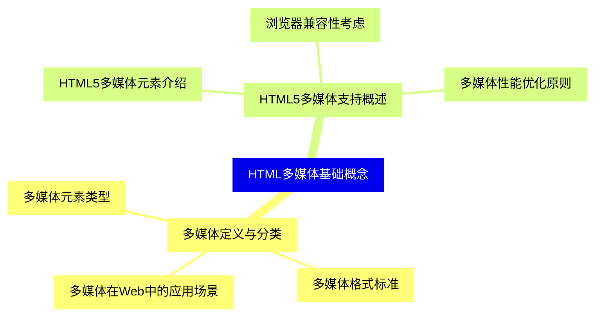

<--->
{}
{}
{}
{}
{}
{}
{}
{}
{}
{}
{}
{}
{}
{}
{}
{}
{}

### 2 音频支持{#2}

{}
{}
{}
{}
{}
{}
{}
{}
{}
{}
{}
{}
{}
{}
{}
{}
{}
{}
{}
{}
{}
{}
{}
{}
{}
{}
{}
<--->
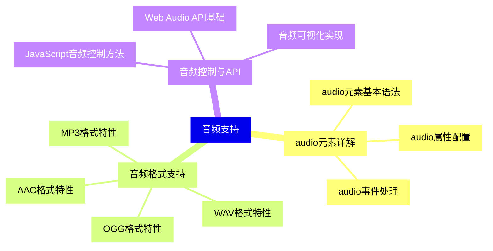

{}

### 3 视频支持{#3}

{}
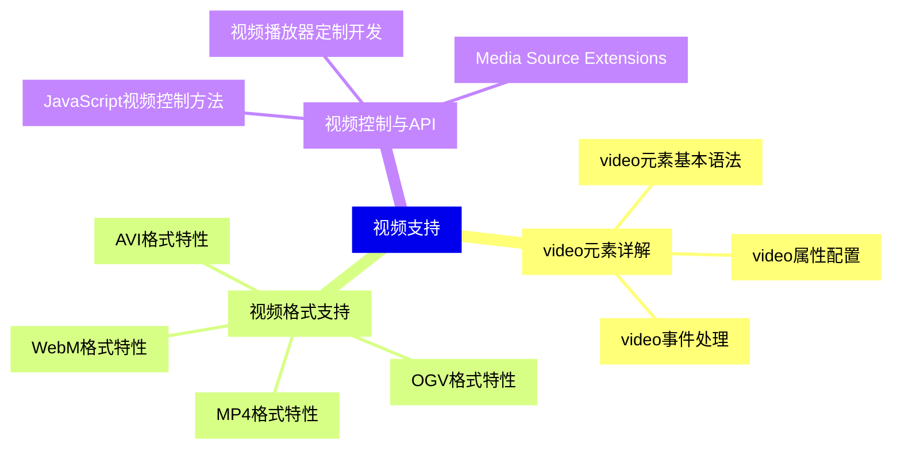

<--->
{}
{}
{}
{}
{}
{}
{}
{}
{}
{}
{}
{}
{}
{}
{}
{}
{}
{}
{}
{}
{}
{}
{}
{}
{}
{}
{}

### 4 多媒体容器与编解码器{#4}

{}
{}
{}
{}
{}
{}
{}
{}
{}
{}
{}
{}
{}
{}
{}
{}
{}
{}
{}
{}
{}
{}
{}
{}
{}
{}
{}
{}
{}
<--->
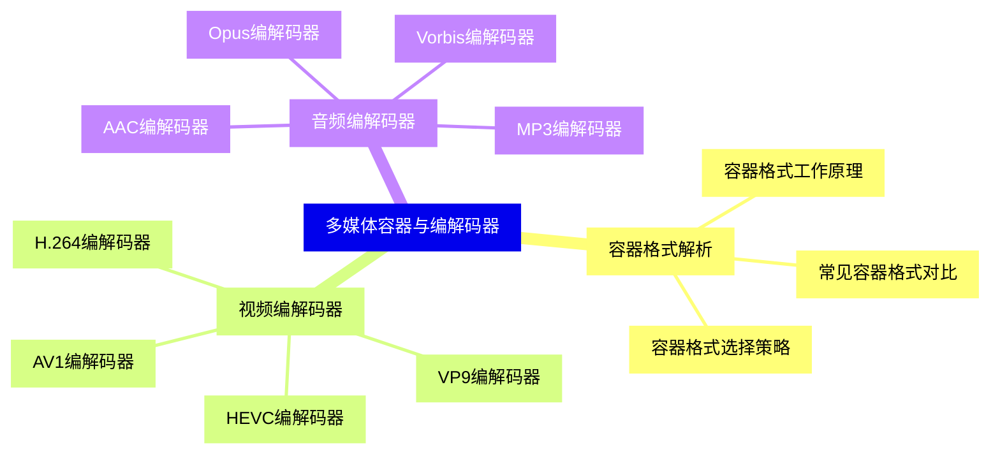

{}

### 5 多媒体源与格式兼容性{#5}

{}
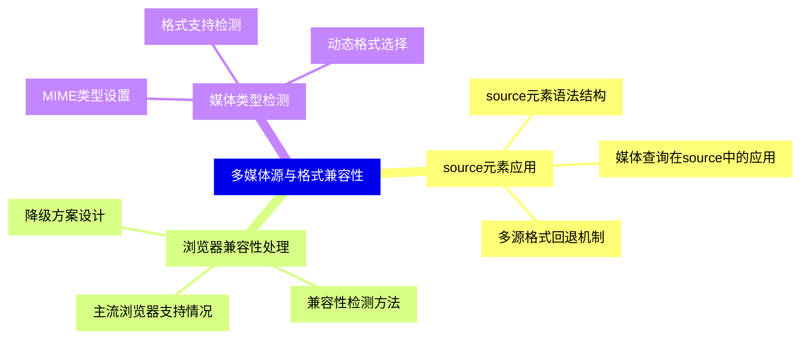

<--->
{}
{}
{}
{}
{}
{}
{}
{}
{}
{}
{}
{}
{}
{}
{}
{}
{}
{}
{}
{}
{}
{}
{}
{}
{}

### 6 多媒体属性与配置{#6}

{}
{}
{}
{}
{}
{}
{}
{}
{}
{}
{}
{}
{}
{}
{}
{}
{}
{}
{}
{}
{}
{}
{}
{}
{}
{}
{}
{}
{}
<--->
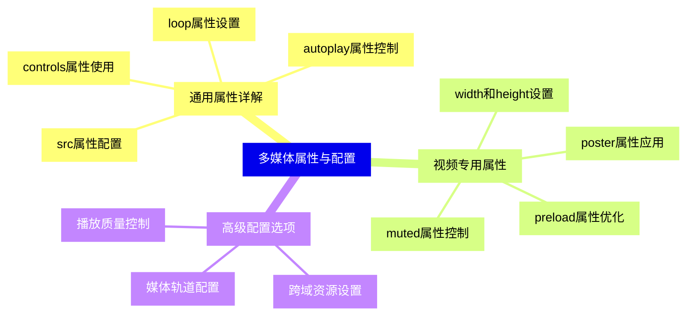

{}

### 7 多媒体JavaScript API{#7}

{}
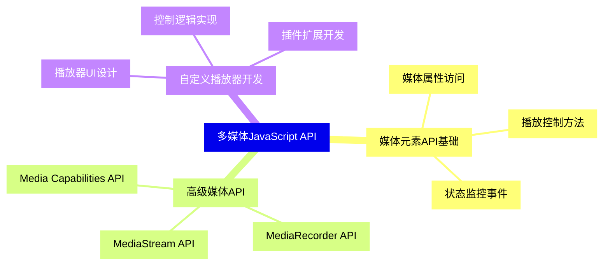

<--->
{}
{}
{}
{}
{}
{}
{}
{}
{}
{}
{}
{}
{}
{}
{}
{}
{}
{}
{}
{}
{}
{}
{}
{}
{}

### 8 多媒体事件处理{#8}

{}
{}
{}
{}
{}
{}
{}
{}
{}
{}
{}
{}
{}
{}
{}
{}
{}
{}
{}
{}
{}
{}
{}
{}
{}
{}
{}
{}
{}
{}
{}
<--->
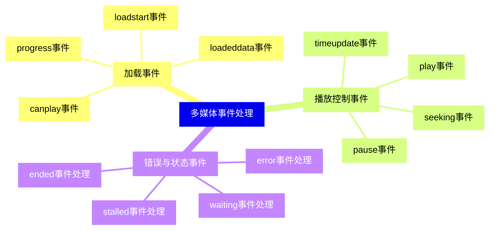

{}

### 9 多媒体性能优化{#9}

{}
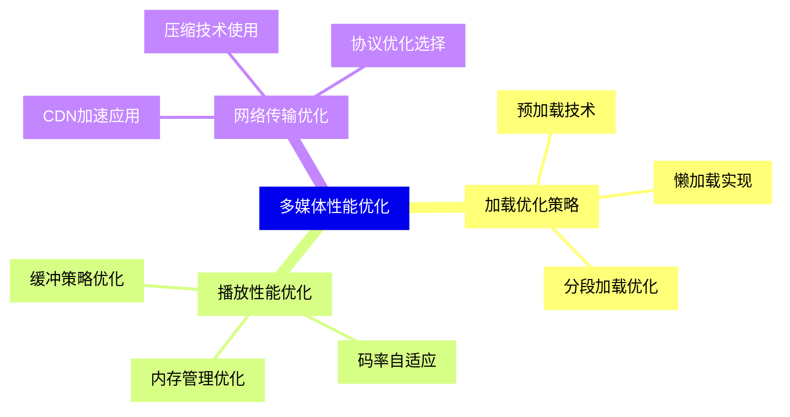

<--->
{}
{}
{}
{}
{}
{}
{}
{}
{}
{}
{}
{}
{}
{}
{}
{}
{}
{}
{}
{}
{}
{}
{}
{}
{}

### 10 高级多媒体技术{#10}

{}
{}
{}
{}
{}
{}
{}
{}
{}
{}
{}
{}
{}
{}
{}
{}
{}
{}
{}
{}
{}
{}
{}
{}
{}
<--->
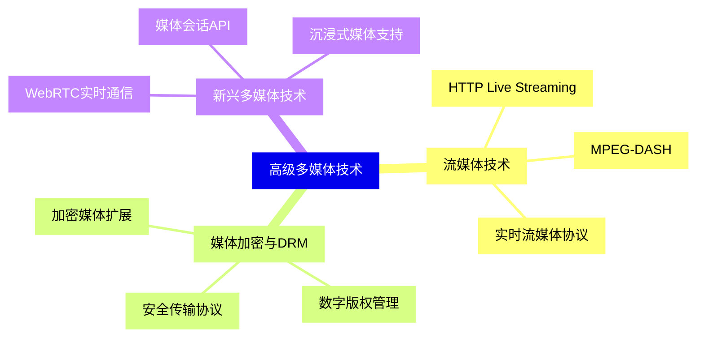

{}

### 11 多媒体无障碍访问{#11}

{}
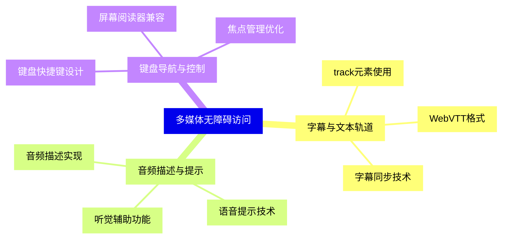

<--->
{}
{}
{}
{}
{}
{}
{}
{}
{}
{}
{}
{}
{}
{}
{}
{}
{}
{}
{}
{}
{}
{}
{}
{}
{}

### 12 多媒体测试与调试{#12}

{}
{}
{}
{}
{}
{}
{}
{}
{}
{}
{}
{}
{}
{}
{}
{}
{}
{}
{}
{}
{}
{}
{}
{}
{}
<--->
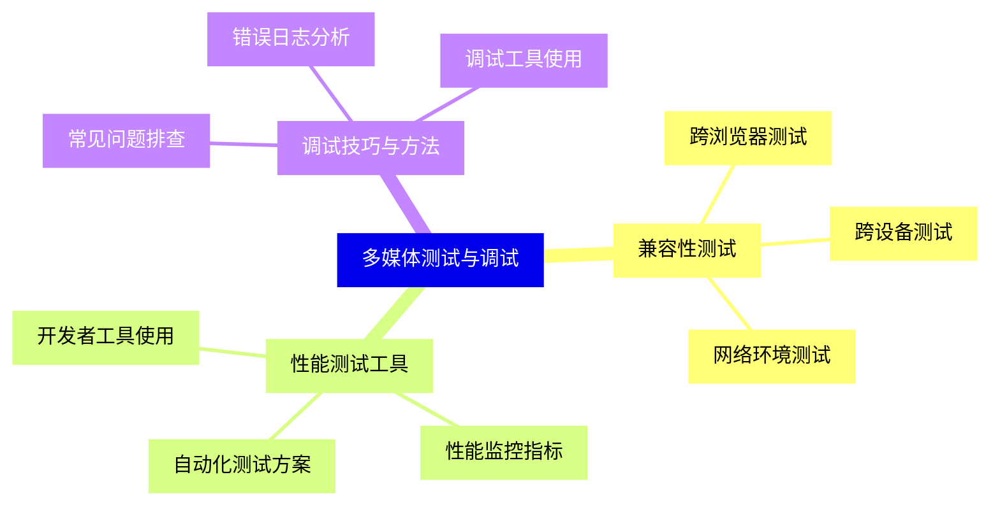

{}
