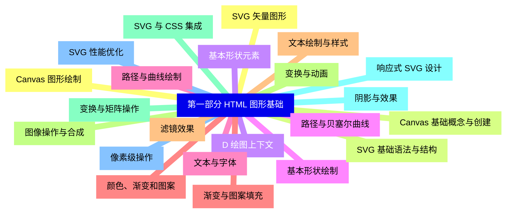
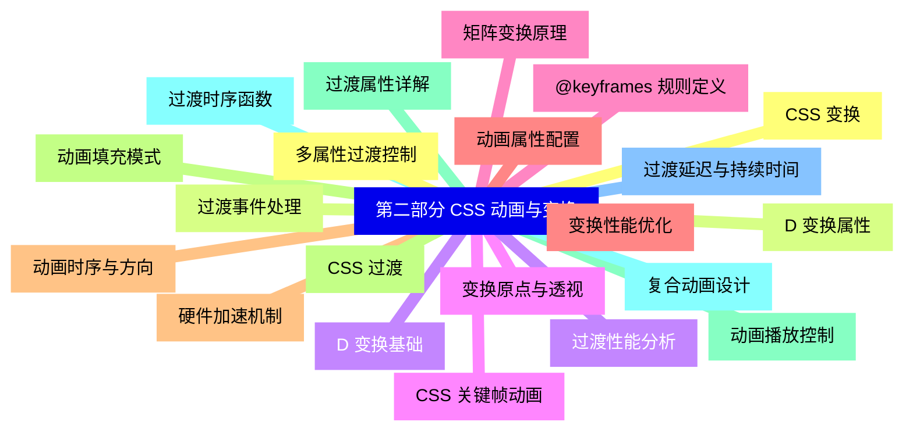
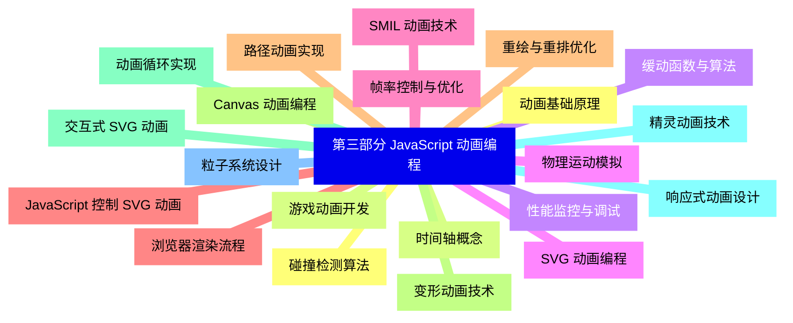
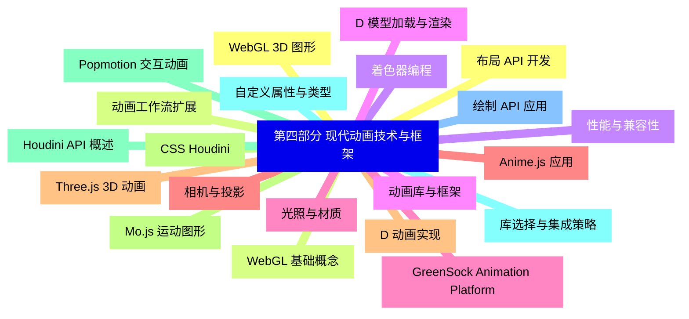
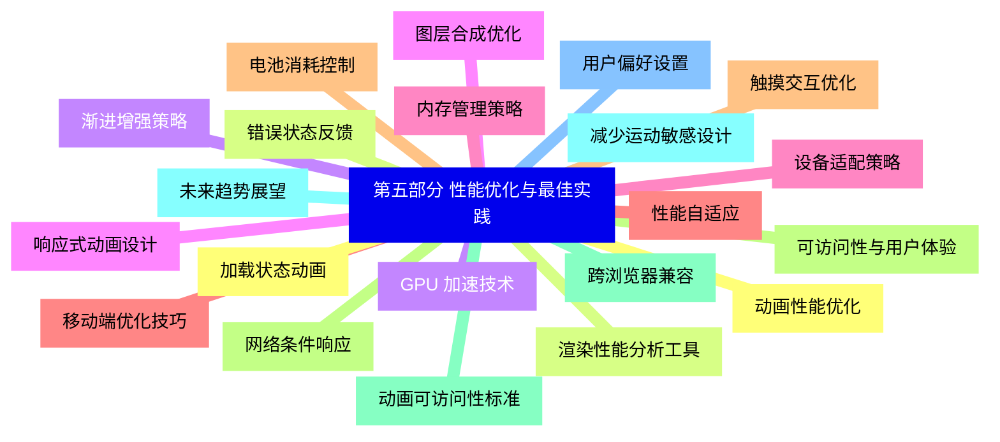


### 1 [第一部分 HTML 图形基础](#1)
#### 1.1 [Canvas 图形绘制](#1)
#### 1.2 [Canvas 基础概念与创建](#1)
#### 1.3 [D 绘图上下文](#1)
#### 1.4 [基本形状绘制](#1)
#### 1.5 [路径与曲线绘制](#1)
#### 1.6 [颜色、渐变和图案](#1)
#### 1.7 [文本绘制与样式](#1)
#### 1.8 [图像操作与合成](#1)
#### 1.9 [变换与矩阵操作](#1)
#### 1.10 [阴影与效果](#1)
#### 1.11 [像素级操作](#1)
#### 1.12 [SVG 矢量图形](#1)
#### 1.13 [SVG 基础语法与结构](#1)
#### 1.14 [基本形状元素](#1)
#### 1.15 [路径与贝塞尔曲线](#1)
#### 1.16 [文本与字体](#1)
#### 1.17 [渐变与图案填充](#1)
#### 1.18 [滤镜效果](#1)
#### 1.19 [变换与动画](#1)
#### 1.20 [SVG 与 CSS 集成](#1)
#### 1.21 [响应式 SVG 设计](#1)
#### 1.22 [SVG 性能优化](#1)
### 2 [第二部分 CSS 动画与变换](#2)
#### 2.1 [CSS 变换](#2)
#### 2.2 [D 变换属性](#2)
#### 2.3 [D 变换基础](#2)
#### 2.4 [变换原点与透视](#2)
#### 2.5 [矩阵变换原理](#2)
#### 2.6 [变换性能优化](#2)
#### 2.7 [硬件加速机制](#2)
#### 2.8 [CSS 过渡](#2)
#### 2.9 [过渡属性详解](#2)
#### 2.10 [过渡时序函数](#2)
#### 2.11 [过渡延迟与持续时间](#2)
#### 2.12 [多属性过渡控制](#2)
#### 2.13 [过渡事件处理](#2)
#### 2.14 [过渡性能分析](#2)
#### 2.15 [CSS 关键帧动画](#2)
#### 2.16 [@keyframes 规则定义](#2)
#### 2.17 [动画属性配置](#2)
#### 2.18 [动画时序与方向](#2)
#### 2.19 [动画填充模式](#2)
#### 2.20 [动画播放控制](#2)
#### 2.21 [复合动画设计](#2)
### 3 [第三部分 JavaScript 动画编程](#3)
#### 3.1 [动画基础原理](#3)
#### 3.2 [时间轴概念](#3)
#### 3.3 [缓动函数与算法](#3)
#### 3.4 [物理运动模拟](#3)
#### 3.5 [帧率控制与优化](#3)
#### 3.6 [浏览器渲染流程](#3)
#### 3.7 [重绘与重排优化](#3)
#### 3.8 [Canvas 动画编程](#3)
#### 3.9 [动画循环实现](#3)
#### 3.10 [精灵动画技术](#3)
#### 3.11 [粒子系统设计](#3)
#### 3.12 [碰撞检测算法](#3)
#### 3.13 [游戏动画开发](#3)
#### 3.14 [性能监控与调试](#3)
#### 3.15 [SVG 动画编程](#3)
#### 3.16 [SMIL 动画技术](#3)
#### 3.17 [JavaScript 控制 SVG 动画](#3)
#### 3.18 [路径动画实现](#3)
#### 3.19 [变形动画技术](#3)
#### 3.20 [交互式 SVG 动画](#3)
#### 3.21 [响应式动画设计](#3)
### 4 [第四部分 现代动画技术与框架](#4)
#### 4.1 [WebGL 3D 图形](#4)
#### 4.2 [WebGL 基础概念](#4)
#### 4.3 [着色器编程](#4)
#### 4.4 [D 模型加载与渲染](#4)
#### 4.5 [光照与材质](#4)
#### 4.6 [相机与投影](#4)
#### 4.7 [D 动画实现](#4)
#### 4.8 [CSS Houdini](#4)
#### 4.9 [Houdini API 概述](#4)
#### 4.10 [自定义属性与类型](#4)
#### 4.11 [绘制 API 应用](#4)
#### 4.12 [布局 API 开发](#4)
#### 4.13 [动画工作流扩展](#4)
#### 4.14 [性能与兼容性](#4)
#### 4.15 [动画库与框架](#4)
#### 4.16 [GreenSock Animation Platform](#4)
#### 4.17 [Anime.js 应用](#4)
#### 4.18 [Three.js 3D 动画](#4)
#### 4.19 [Mo.js 运动图形](#4)
#### 4.20 [Popmotion 交互动画](#4)
#### 4.21 [库选择与集成策略](#4)
### 5 [第五部分 性能优化与最佳实践](#5)
#### 5.1 [动画性能优化](#5)
#### 5.2 [渲染性能分析工具](#5)
#### 5.3 [GPU 加速技术](#5)
#### 5.4 [图层合成优化](#5)
#### 5.5 [内存管理策略](#5)
#### 5.6 [移动端优化技巧](#5)
#### 5.7 [电池消耗控制](#5)
#### 5.8 [可访问性与用户体验](#5)
#### 5.9 [动画可访问性标准](#5)
#### 5.10 [减少运动敏感设计](#5)
#### 5.11 [用户偏好设置](#5)
#### 5.12 [加载状态动画](#5)
#### 5.13 [错误状态反馈](#5)
#### 5.14 [渐进增强策略](#5)
#### 5.15 [响应式动画设计](#5)
#### 5.16 [设备适配策略](#5)
#### 5.17 [性能自适应](#5)
#### 5.18 [触摸交互优化](#5)
#### 5.19 [网络条件响应](#5)
#### 5.20 [跨浏览器兼容](#5)
#### 5.21 [未来趋势展望](#5)




### 1 第一部分 HTML 图形基础

---
### 1 第一部分 HTML 图形基础
___
#### 1.1 Canvas 图形绘制
___
#### 1.2 Canvas 基础概念与创建
___
#### 1.3 D 绘图上下文
___
#### 1.4 基本形状绘制
___
#### 1.5 路径与曲线绘制
___
#### 1.6 颜色、渐变和图案
___
#### 1.7 文本绘制与样式
___
#### 1.8 图像操作与合成
___
#### 1.9 变换与矩阵操作
___
#### 1.10 阴影与效果
___
#### 1.11 像素级操作
___
#### 1.12 SVG 矢量图形
___
#### 1.13 SVG 基础语法与结构
___
#### 1.14 基本形状元素
___
#### 1.15 路径与贝塞尔曲线
___
#### 1.16 文本与字体
___
#### 1.17 渐变与图案填充
___
#### 1.18 滤镜效果
___
#### 1.19 变换与动画
___
#### 1.20 SVG 与 CSS 集成
___
#### 1.21 响应式 SVG 设计
___
#### 1.22 SVG 性能优化
### 2 第二部分 CSS 动画与变换

---
### 2 第二部分 CSS 动画与变换
___
#### 2.1 CSS 变换
___
#### 2.2 D 变换属性
___
#### 2.3 D 变换基础
___
#### 2.4 变换原点与透视
___
#### 2.5 矩阵变换原理
___
#### 2.6 变换性能优化
___
#### 2.7 硬件加速机制
___
#### 2.8 CSS 过渡
___
#### 2.9 过渡属性详解
___
#### 2.10 过渡时序函数
___
#### 2.11 过渡延迟与持续时间
___
#### 2.12 多属性过渡控制
___
#### 2.13 过渡事件处理
___
#### 2.14 过渡性能分析
___
#### 2.15 CSS 关键帧动画
___
#### 2.16 @keyframes 规则定义
___
#### 2.17 动画属性配置
___
#### 2.18 动画时序与方向
___
#### 2.19 动画填充模式
___
#### 2.20 动画播放控制
___
#### 2.21 复合动画设计
### 3 第三部分 JavaScript 动画编程

---
### 3 第三部分 JavaScript 动画编程
___
#### 3.1 动画基础原理
___
#### 3.2 时间轴概念
___
#### 3.3 缓动函数与算法
___
#### 3.4 物理运动模拟
___
#### 3.5 帧率控制与优化
___
#### 3.6 浏览器渲染流程
___
#### 3.7 重绘与重排优化
___
#### 3.8 Canvas 动画编程
___
#### 3.9 动画循环实现
___
#### 3.10 精灵动画技术
___
#### 3.11 粒子系统设计
___
#### 3.12 碰撞检测算法
___
#### 3.13 游戏动画开发
___
#### 3.14 性能监控与调试
___
#### 3.15 SVG 动画编程
___
#### 3.16 SMIL 动画技术
___
#### 3.17 JavaScript 控制 SVG 动画
___
#### 3.18 路径动画实现
___
#### 3.19 变形动画技术
___
#### 3.20 交互式 SVG 动画
___
#### 3.21 响应式动画设计
### 4 第四部分 现代动画技术与框架

---
### 4 第四部分 现代动画技术与框架
___
#### 4.1 WebGL 3D 图形
___
#### 4.2 WebGL 基础概念
___
#### 4.3 着色器编程
___
#### 4.4 D 模型加载与渲染
___
#### 4.5 光照与材质
___
#### 4.6 相机与投影
___
#### 4.7 D 动画实现
___
#### 4.8 CSS Houdini
___
#### 4.9 Houdini API 概述
___
#### 4.10 自定义属性与类型
___
#### 4.11 绘制 API 应用
___
#### 4.12 布局 API 开发
___
#### 4.13 动画工作流扩展
___
#### 4.14 性能与兼容性
___
#### 4.15 动画库与框架
___
#### 4.16 GreenSock Animation Platform
___
#### 4.17 Anime.js 应用
___
#### 4.18 Three.js 3D 动画
___
#### 4.19 Mo.js 运动图形
___
#### 4.20 Popmotion 交互动画
___
#### 4.21 库选择与集成策略
### 5 第五部分 性能优化与最佳实践

---
### 5 第五部分 性能优化与最佳实践
___
#### 5.1 动画性能优化
___
#### 5.2 渲染性能分析工具
___
#### 5.3 GPU 加速技术
___
#### 5.4 图层合成优化
___
#### 5.5 内存管理策略
___
#### 5.6 移动端优化技巧
___
#### 5.7 电池消耗控制
___
#### 5.8 可访问性与用户体验
___
#### 5.9 动画可访问性标准
___
#### 5.10 减少运动敏感设计
___
#### 5.11 用户偏好设置
___
#### 5.12 加载状态动画
___
#### 5.13 错误状态反馈
___
#### 5.14 渐进增强策略
___
#### 5.15 响应式动画设计
___
#### 5.16 设备适配策略
___
#### 5.17 性能自适应
___
#### 5.18 触摸交互优化
___
#### 5.19 网络条件响应
___
#### 5.20 跨浏览器兼容
___
#### 5.21 未来趋势展望


### 1 第一部分 HTML 图形基础{#1}

{}

<--->
{}
{}
{}
{}
{}
{}
{}
{}
{}
{}
{}
{}
{}
{}
{}
{}
{}
{}
{}
{}
{}
{}
{}
{}
{}
{}
{}
{}
{}
{}
{}
{}
{}
{}
{}
{}
{}
{}
{}
{}
{}
{}
{}
{}
{}

### 2 第二部分 CSS 动画与变换{#2}

{}
{}
{}
{}
{}
{}
{}
{}
{}
{}
{}
{}
{}
{}
{}
{}
{}
{}
{}
{}
{}
{}
{}
{}
{}
{}
{}
{}
{}
{}
{}
{}
{}
{}
{}
{}
{}
{}
{}
{}
{}
{}
{}
<--->

{}

### 3 第三部分 JavaScript 动画编程{#3}

{}

<--->
{}
{}
{}
{}
{}
{}
{}
{}
{}
{}
{}
{}
{}
{}
{}
{}
{}
{}
{}
{}
{}
{}
{}
{}
{}
{}
{}
{}
{}
{}
{}
{}
{}
{}
{}
{}
{}
{}
{}
{}
{}
{}
{}

### 4 第四部分 现代动画技术与框架{#4}

{}
{}
{}
{}
{}
{}
{}
{}
{}
{}
{}
{}
{}
{}
{}
{}
{}
{}
{}
{}
{}
{}
{}
{}
{}
{}
{}
{}
{}
{}
{}
{}
{}
{}
{}
{}
{}
{}
{}
{}
{}
{}
{}
<--->

{}

### 5 第五部分 性能优化与最佳实践{#5}

{}

<--->
{}
{}
{}
{}
{}
{}
{}
{}
{}
{}
{}
{}
{}
{}
{}
{}
{}
{}
{}
{}
{}
{}
{}
{}
{}
{}
{}
{}
{}
{}
{}
{}
{}
{}
{}
{}
{}
{}
{}
{}
{}
{}
{}
