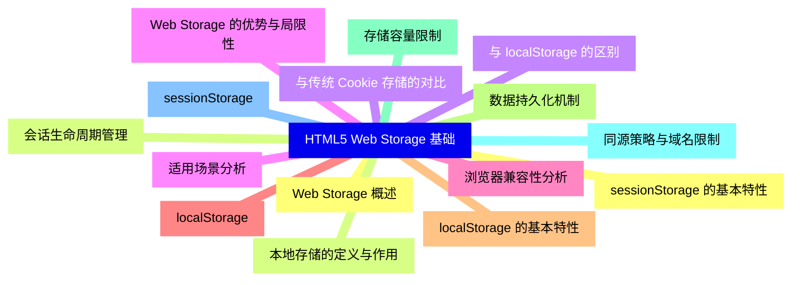
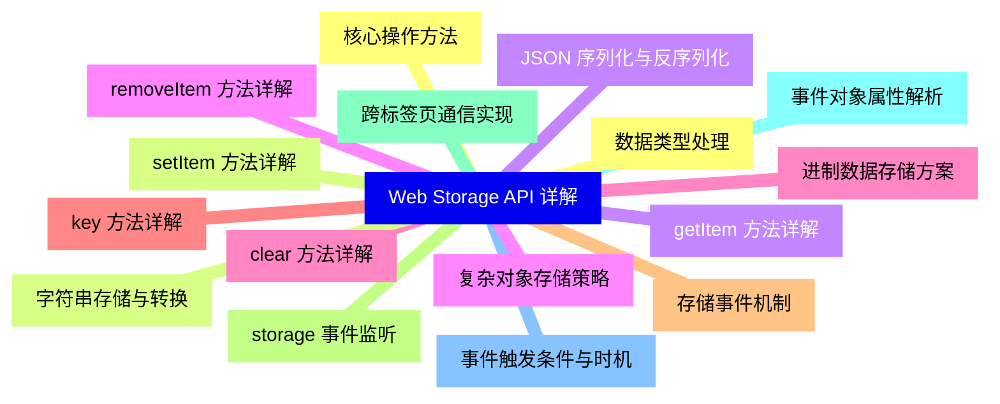
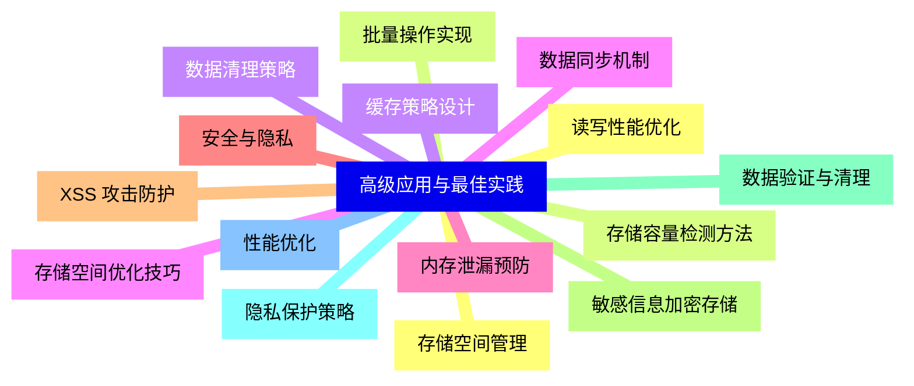
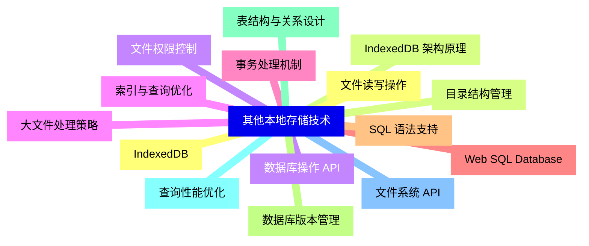
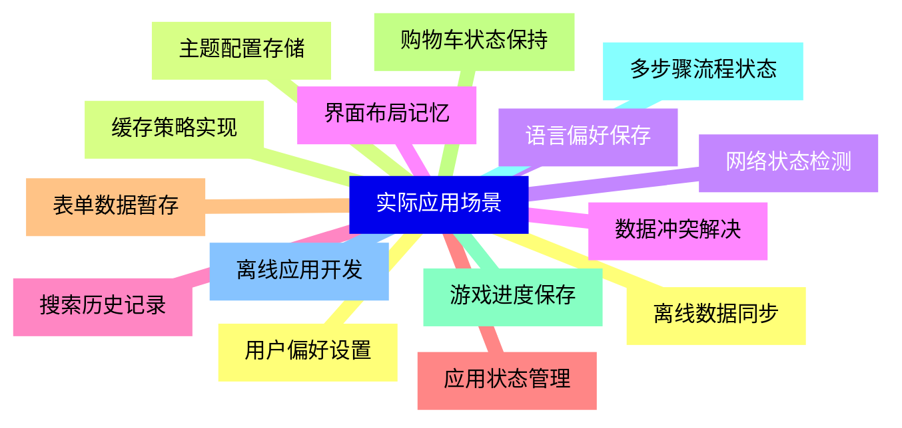
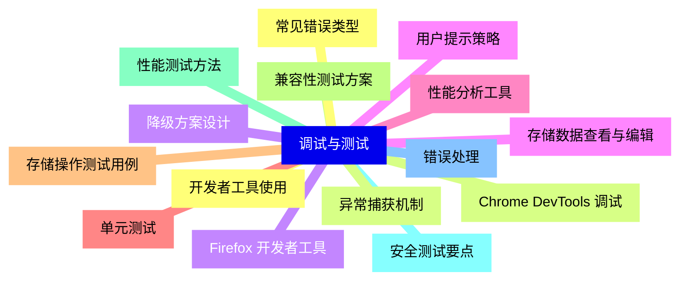
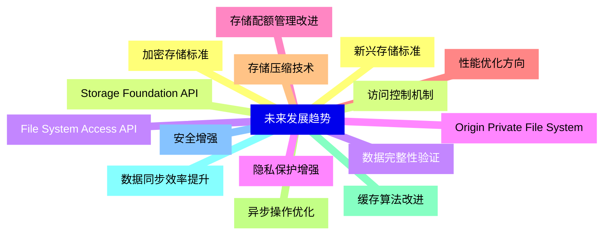


### 1 [HTML5 Web Storage 基础](#1)
#### 1.1 [Web Storage 概述](#1)
#### 1.2 [本地存储的定义与作用](#1)
#### 1.3 [与传统 Cookie 存储的对比](#1)
#### 1.4 [Web Storage 的优势与局限性](#1)
#### 1.5 [浏览器兼容性分析](#1)
#### 1.6 [localStorage](#1)
#### 1.7 [localStorage 的基本特性](#1)
#### 1.8 [数据持久化机制](#1)
#### 1.9 [存储容量限制](#1)
#### 1.10 [同源策略与域名限制](#1)
#### 1.11 [sessionStorage](#1)
#### 1.12 [sessionStorage 的基本特性](#1)
#### 1.13 [会话生命周期管理](#1)
#### 1.14 [与 localStorage 的区别](#1)
#### 1.15 [适用场景分析](#1)
### 2 [Web Storage API 详解](#2)
#### 2.1 [核心操作方法](#2)
#### 2.2 [setItem   方法详解](#2)
#### 2.3 [getItem   方法详解](#2)
#### 2.4 [removeItem   方法详解](#2)
#### 2.5 [clear   方法详解](#2)
#### 2.6 [key   方法详解](#2)
#### 2.7 [存储事件机制](#2)
#### 2.8 [storage 事件监听](#2)
#### 2.9 [跨标签页通信实现](#2)
#### 2.10 [事件对象属性解析](#2)
#### 2.11 [事件触发条件与时机](#2)
#### 2.12 [数据类型处理](#2)
#### 2.13 [字符串存储与转换](#2)
#### 2.14 [JSON 序列化与反序列化](#2)
#### 2.15 [复杂对象存储策略](#2)
#### 2.16 [进制数据存储方案](#2)
### 3 [高级应用与最佳实践](#3)
#### 3.1 [存储空间管理](#3)
#### 3.2 [存储容量检测方法](#3)
#### 3.3 [数据清理策略](#3)
#### 3.4 [存储空间优化技巧](#3)
#### 3.5 [内存泄漏预防](#3)
#### 3.6 [安全与隐私](#3)
#### 3.7 [XSS 攻击防护](#3)
#### 3.8 [敏感信息加密存储](#3)
#### 3.9 [数据验证与清理](#3)
#### 3.10 [隐私保护策略](#3)
#### 3.11 [性能优化](#3)
#### 3.12 [读写性能优化](#3)
#### 3.13 [批量操作实现](#3)
#### 3.14 [缓存策略设计](#3)
#### 3.15 [数据同步机制](#3)
### 4 [其他本地存储技术](#4)
#### 4.1 [IndexedDB](#4)
#### 4.2 [IndexedDB 架构原理](#4)
#### 4.3 [数据库操作 API](#4)
#### 4.4 [索引与查询优化](#4)
#### 4.5 [事务处理机制](#4)
#### 4.6 [Web SQL Database](#4)
#### 4.7 [SQL 语法支持](#4)
#### 4.8 [数据库版本管理](#4)
#### 4.9 [表结构与关系设计](#4)
#### 4.10 [查询性能优化](#4)
#### 4.11 [文件系统 API](#4)
#### 4.12 [文件读写操作](#4)
#### 4.13 [目录结构管理](#4)
#### 4.14 [文件权限控制](#4)
#### 4.15 [大文件处理策略](#4)
### 5 [实际应用场景](#5)
#### 5.1 [用户偏好设置](#5)
#### 5.2 [主题配置存储](#5)
#### 5.3 [语言偏好保存](#5)
#### 5.4 [界面布局记忆](#5)
#### 5.5 [搜索历史记录](#5)
#### 5.6 [应用状态管理](#5)
#### 5.7 [表单数据暂存](#5)
#### 5.8 [购物车状态保持](#5)
#### 5.9 [游戏进度保存](#5)
#### 5.10 [多步骤流程状态](#5)
#### 5.11 [离线应用开发](#5)
#### 5.12 [离线数据同步](#5)
#### 5.13 [缓存策略实现](#5)
#### 5.14 [网络状态检测](#5)
#### 5.15 [数据冲突解决](#5)
### 6 [调试与测试](#6)
#### 6.1 [开发者工具使用](#6)
#### 6.2 [Chrome DevTools 调试](#6)
#### 6.3 [Firefox 开发者工具](#6)
#### 6.4 [存储数据查看与编辑](#6)
#### 6.5 [性能分析工具](#6)
#### 6.6 [单元测试](#6)
#### 6.7 [存储操作测试用例](#6)
#### 6.8 [兼容性测试方案](#6)
#### 6.9 [性能测试方法](#6)
#### 6.10 [安全测试要点](#6)
#### 6.11 [错误处理](#6)
#### 6.12 [常见错误类型](#6)
#### 6.13 [异常捕获机制](#6)
#### 6.14 [降级方案设计](#6)
#### 6.15 [用户提示策略](#6)
### 7 [未来发展趋势](#7)
#### 7.1 [新兴存储标准](#7)
#### 7.2 [Storage Foundation API](#7)
#### 7.3 [File System Access API](#7)
#### 7.4 [Origin Private File System](#7)
#### 7.5 [存储配额管理改进](#7)
#### 7.6 [性能优化方向](#7)
#### 7.7 [存储压缩技术](#7)
#### 7.8 [异步操作优化](#7)
#### 7.9 [缓存算法改进](#7)
#### 7.10 [数据同步效率提升](#7)
#### 7.11 [安全增强](#7)
#### 7.12 [加密存储标准](#7)
#### 7.13 [访问控制机制](#7)
#### 7.14 [数据完整性验证](#7)
#### 7.15 [隐私保护增强](#7)




### 1 HTML5 Web Storage 基础

---
### 1 HTML5 Web Storage 基础
___
#### 1.1 Web Storage 概述
___
#### 1.2 本地存储的定义与作用
___
#### 1.3 与传统 Cookie 存储的对比
___
#### 1.4 Web Storage 的优势与局限性
___
#### 1.5 浏览器兼容性分析
___
#### 1.6 localStorage
___
#### 1.7 localStorage 的基本特性
___
#### 1.8 数据持久化机制
___
#### 1.9 存储容量限制
___
#### 1.10 同源策略与域名限制
___
#### 1.11 sessionStorage
___
#### 1.12 sessionStorage 的基本特性
___
#### 1.13 会话生命周期管理
___
#### 1.14 与 localStorage 的区别
___
#### 1.15 适用场景分析
### 2 Web Storage API 详解

---
### 2 Web Storage API 详解
___
#### 2.1 核心操作方法
___
#### 2.2 setItem   方法详解
___
#### 2.3 getItem   方法详解
___
#### 2.4 removeItem   方法详解
___
#### 2.5 clear   方法详解
___
#### 2.6 key   方法详解
___
#### 2.7 存储事件机制
___
#### 2.8 storage 事件监听
___
#### 2.9 跨标签页通信实现
___
#### 2.10 事件对象属性解析
___
#### 2.11 事件触发条件与时机
___
#### 2.12 数据类型处理
___
#### 2.13 字符串存储与转换
___
#### 2.14 JSON 序列化与反序列化
___
#### 2.15 复杂对象存储策略
___
#### 2.16 进制数据存储方案
### 3 高级应用与最佳实践

---
### 3 高级应用与最佳实践
___
#### 3.1 存储空间管理
___
#### 3.2 存储容量检测方法
___
#### 3.3 数据清理策略
___
#### 3.4 存储空间优化技巧
___
#### 3.5 内存泄漏预防
___
#### 3.6 安全与隐私
___
#### 3.7 XSS 攻击防护
___
#### 3.8 敏感信息加密存储
___
#### 3.9 数据验证与清理
___
#### 3.10 隐私保护策略
___
#### 3.11 性能优化
___
#### 3.12 读写性能优化
___
#### 3.13 批量操作实现
___
#### 3.14 缓存策略设计
___
#### 3.15 数据同步机制
### 4 其他本地存储技术

---
### 4 其他本地存储技术
___
#### 4.1 IndexedDB
___
#### 4.2 IndexedDB 架构原理
___
#### 4.3 数据库操作 API
___
#### 4.4 索引与查询优化
___
#### 4.5 事务处理机制
___
#### 4.6 Web SQL Database
___
#### 4.7 SQL 语法支持
___
#### 4.8 数据库版本管理
___
#### 4.9 表结构与关系设计
___
#### 4.10 查询性能优化
___
#### 4.11 文件系统 API
___
#### 4.12 文件读写操作
___
#### 4.13 目录结构管理
___
#### 4.14 文件权限控制
___
#### 4.15 大文件处理策略
### 5 实际应用场景

---
### 5 实际应用场景
___
#### 5.1 用户偏好设置
___
#### 5.2 主题配置存储
___
#### 5.3 语言偏好保存
___
#### 5.4 界面布局记忆
___
#### 5.5 搜索历史记录
___
#### 5.6 应用状态管理
___
#### 5.7 表单数据暂存
___
#### 5.8 购物车状态保持
___
#### 5.9 游戏进度保存
___
#### 5.10 多步骤流程状态
___
#### 5.11 离线应用开发
___
#### 5.12 离线数据同步
___
#### 5.13 缓存策略实现
___
#### 5.14 网络状态检测
___
#### 5.15 数据冲突解决
### 6 调试与测试

---
### 6 调试与测试
___
#### 6.1 开发者工具使用
___
#### 6.2 Chrome DevTools 调试
___
#### 6.3 Firefox 开发者工具
___
#### 6.4 存储数据查看与编辑
___
#### 6.5 性能分析工具
___
#### 6.6 单元测试
___
#### 6.7 存储操作测试用例
___
#### 6.8 兼容性测试方案
___
#### 6.9 性能测试方法
___
#### 6.10 安全测试要点
___
#### 6.11 错误处理
___
#### 6.12 常见错误类型
___
#### 6.13 异常捕获机制
___
#### 6.14 降级方案设计
___
#### 6.15 用户提示策略
### 7 未来发展趋势

---
### 7 未来发展趋势
___
#### 7.1 新兴存储标准
___
#### 7.2 Storage Foundation API
___
#### 7.3 File System Access API
___
#### 7.4 Origin Private File System
___
#### 7.5 存储配额管理改进
___
#### 7.6 性能优化方向
___
#### 7.7 存储压缩技术
___
#### 7.8 异步操作优化
___
#### 7.9 缓存算法改进
___
#### 7.10 数据同步效率提升
___
#### 7.11 安全增强
___
#### 7.12 加密存储标准
___
#### 7.13 访问控制机制
___
#### 7.14 数据完整性验证
___
#### 7.15 隐私保护增强


### 1 HTML5 Web Storage 基础{#1}

{}

<--->
{}
{}
{}
{}
{}
{}
{}
{}
{}
{}
{}
{}
{}
{}
{}
{}
{}
{}
{}
{}
{}
{}
{}
{}
{}
{}
{}
{}
{}
{}
{}

### 2 Web Storage API 详解{#2}

{}
{}
{}
{}
{}
{}
{}
{}
{}
{}
{}
{}
{}
{}
{}
{}
{}
{}
{}
{}
{}
{}
{}
{}
{}
{}
{}
{}
{}
{}
{}
{}
{}
<--->

{}

### 3 高级应用与最佳实践{#3}

{}

<--->
{}
{}
{}
{}
{}
{}
{}
{}
{}
{}
{}
{}
{}
{}
{}
{}
{}
{}
{}
{}
{}
{}
{}
{}
{}
{}
{}
{}
{}
{}
{}

### 4 其他本地存储技术{#4}

{}
{}
{}
{}
{}
{}
{}
{}
{}
{}
{}
{}
{}
{}
{}
{}
{}
{}
{}
{}
{}
{}
{}
{}
{}
{}
{}
{}
{}
{}
{}
<--->

{}

### 5 实际应用场景{#5}

{}

<--->
{}
{}
{}
{}
{}
{}
{}
{}
{}
{}
{}
{}
{}
{}
{}
{}
{}
{}
{}
{}
{}
{}
{}
{}
{}
{}
{}
{}
{}
{}
{}

### 6 调试与测试{#6}

{}
{}
{}
{}
{}
{}
{}
{}
{}
{}
{}
{}
{}
{}
{}
{}
{}
{}
{}
{}
{}
{}
{}
{}
{}
{}
{}
{}
{}
{}
{}
<--->

{}

### 7 未来发展趋势{#7}

{}

<--->
{}
{}
{}
{}
{}
{}
{}
{}
{}
{}
{}
{}
{}
{}
{}
{}
{}
{}
{}
{}
{}
{}
{}
{}
{}
{}
{}
{}
{}
{}
{}
