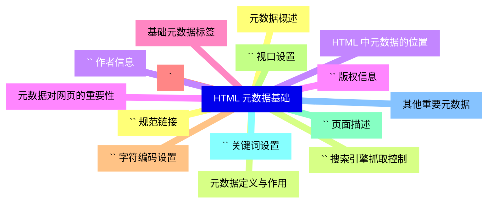
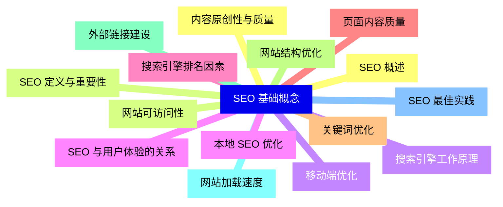
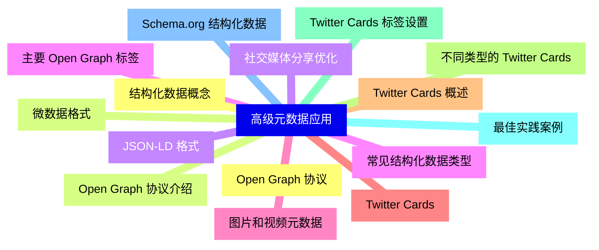
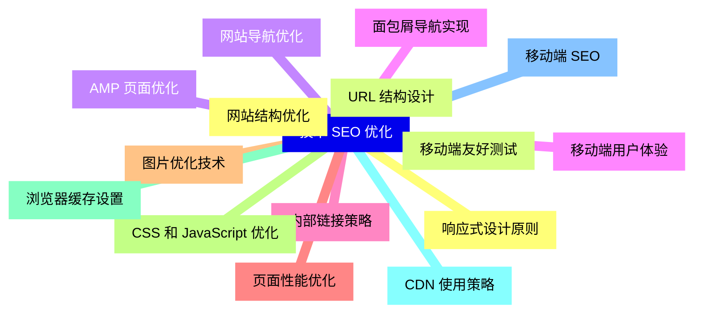
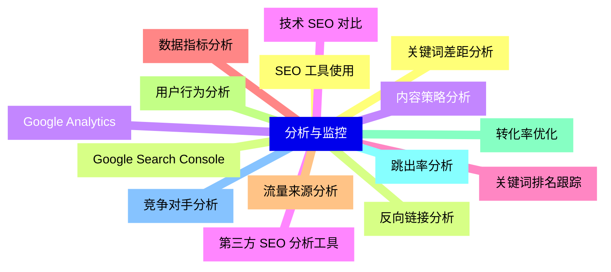
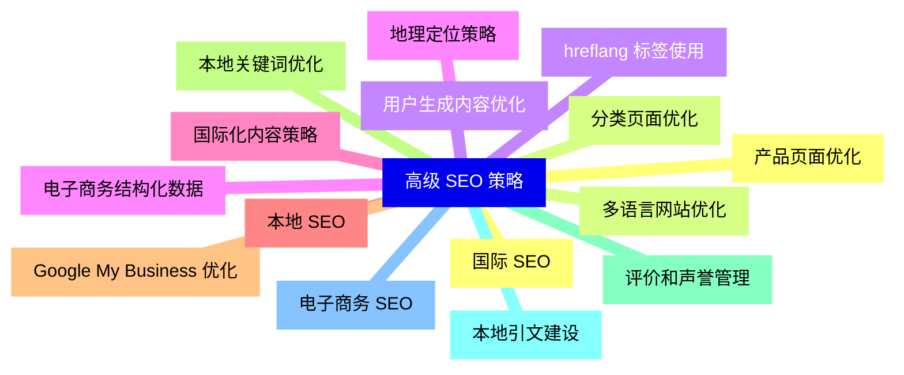
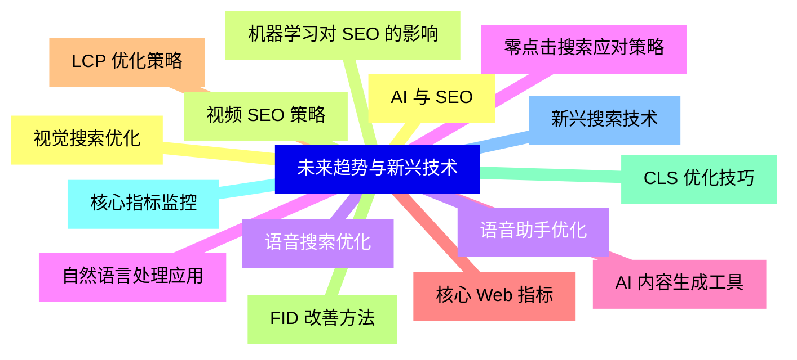


### 1 [HTML 元数据基础](#1)
#### 1.1 [元数据概述](#1)
#### 1.2 [元数据定义与作用](#1)
#### 1.3 [HTML 中元数据的位置](#1)
#### 1.4 [元数据对网页的重要性](#1)
#### 1.5 [基础元数据标签](#1)
#### 1.6 [`<title>` 标签详解](#1)
#### 1.7 [`<meta charset>` 字符编码设置](#1)
#### 1.8 [`<meta name="viewport">` 视口设置](#1)
#### 1.9 [`<meta name="description">` 页面描述](#1)
#### 1.10 [`<meta name="keywords">` 关键词设置](#1)
#### 1.11 [其他重要元数据](#1)
#### 1.12 [`<link rel="canonical">` 规范链接](#1)
#### 1.13 [`<meta name="robots">` 搜索引擎抓取控制](#1)
#### 1.14 [`<meta name="author">` 作者信息](#1)
#### 1.15 [`<meta name="copyright">` 版权信息](#1)
### 2 [SEO 基础概念](#2)
#### 2.1 [SEO 概述](#2)
#### 2.2 [SEO 定义与重要性](#2)
#### 2.3 [搜索引擎工作原理](#2)
#### 2.4 [SEO 与用户体验的关系](#2)
#### 2.5 [搜索引擎排名因素](#2)
#### 2.6 [页面内容质量](#2)
#### 2.7 [关键词优化](#2)
#### 2.8 [网站结构优化](#2)
#### 2.9 [外部链接建设](#2)
#### 2.10 [网站加载速度](#2)
#### 2.11 [SEO 最佳实践](#2)
#### 2.12 [内容原创性与质量](#2)
#### 2.13 [网站可访问性](#2)
#### 2.14 [移动端优化](#2)
#### 2.15 [本地 SEO 优化](#2)
### 3 [高级元数据应用](#3)
#### 3.1 [Open Graph 协议](#3)
#### 3.2 [Open Graph 协议介绍](#3)
#### 3.3 [社交媒体分享优化](#3)
#### 3.4 [主要 Open Graph 标签](#3)
#### 3.5 [图片和视频元数据](#3)
#### 3.6 [Twitter Cards](#3)
#### 3.7 [Twitter Cards 概述](#3)
#### 3.8 [不同类型的 Twitter Cards](#3)
#### 3.9 [Twitter Cards 标签设置](#3)
#### 3.10 [最佳实践案例](#3)
#### 3.11 [Schema.org 结构化数据](#3)
#### 3.12 [结构化数据概念](#3)
#### 3.13 [微数据格式](#3)
#### 3.14 [JSON-LD 格式](#3)
#### 3.15 [常见结构化数据类型](#3)
### 4 [技术 SEO 优化](#4)
#### 4.1 [网站结构优化](#4)
#### 4.2 [URL 结构设计](#4)
#### 4.3 [网站导航优化](#4)
#### 4.4 [面包屑导航实现](#4)
#### 4.5 [内部链接策略](#4)
#### 4.6 [页面性能优化](#4)
#### 4.7 [图片优化技术](#4)
#### 4.8 [CSS 和 JavaScript 优化](#4)
#### 4.9 [浏览器缓存设置](#4)
#### 4.10 [CDN 使用策略](#4)
#### 4.11 [移动端 SEO](#4)
#### 4.12 [响应式设计原则](#4)
#### 4.13 [移动端友好测试](#4)
#### 4.14 [AMP 页面优化](#4)
#### 4.15 [移动端用户体验](#4)
### 5 [分析与监控](#5)
#### 5.1 [SEO 工具使用](#5)
#### 5.2 [Google Search Console](#5)
#### 5.3 [Google Analytics](#5)
#### 5.4 [第三方 SEO 分析工具](#5)
#### 5.5 [关键词排名跟踪](#5)
#### 5.6 [数据指标分析](#5)
#### 5.7 [流量来源分析](#5)
#### 5.8 [用户行为分析](#5)
#### 5.9 [转化率优化](#5)
#### 5.10 [跳出率分析](#5)
#### 5.11 [竞争对手分析](#5)
#### 5.12 [关键词差距分析](#5)
#### 5.13 [反向链接分析](#5)
#### 5.14 [内容策略分析](#5)
#### 5.15 [技术 SEO 对比](#5)
### 6 [高级 SEO 策略](#6)
#### 6.1 [国际 SEO](#6)
#### 6.2 [多语言网站优化](#6)
#### 6.3 [hreflang 标签使用](#6)
#### 6.4 [地理定位策略](#6)
#### 6.5 [国际化内容策略](#6)
#### 6.6 [本地 SEO](#6)
#### 6.7 [Google My Business 优化](#6)
#### 6.8 [本地关键词优化](#6)
#### 6.9 [评价和声誉管理](#6)
#### 6.10 [本地引文建设](#6)
#### 6.11 [电子商务 SEO](#6)
#### 6.12 [产品页面优化](#6)
#### 6.13 [分类页面优化](#6)
#### 6.14 [用户生成内容优化](#6)
#### 6.15 [电子商务结构化数据](#6)
### 7 [未来趋势与新兴技术](#7)
#### 7.1 [AI 与 SEO](#7)
#### 7.2 [机器学习对 SEO 的影响](#7)
#### 7.3 [语音搜索优化](#7)
#### 7.4 [自然语言处理应用](#7)
#### 7.5 [AI 内容生成工具](#7)
#### 7.6 [核心 Web 指标](#7)
#### 7.7 [LCP 优化策略](#7)
#### 7.8 [FID 改善方法](#7)
#### 7.9 [CLS 优化技巧](#7)
#### 7.10 [核心指标监控](#7)
#### 7.11 [新兴搜索技术](#7)
#### 7.12 [视觉搜索优化](#7)
#### 7.13 [视频 SEO 策略](#7)
#### 7.14 [语音助手优化](#7)
#### 7.15 [零点击搜索应对策略](#7)




### 1 HTML 元数据基础

---
### 1 HTML 元数据基础
___
#### 1.1 元数据概述
___
#### 1.2 元数据定义与作用
___
#### 1.3 HTML 中元数据的位置
___
#### 1.4 元数据对网页的重要性
___
#### 1.5 基础元数据标签
___
#### 1.6 `<title>` 标签详解
___
#### 1.7 `<meta charset>` 字符编码设置
___
#### 1.8 `<meta name="viewport">` 视口设置
___
#### 1.9 `<meta name="description">` 页面描述
___
#### 1.10 `<meta name="keywords">` 关键词设置
___
#### 1.11 其他重要元数据
___
#### 1.12 `<link rel="canonical">` 规范链接
___
#### 1.13 `<meta name="robots">` 搜索引擎抓取控制
___
#### 1.14 `<meta name="author">` 作者信息
___
#### 1.15 `<meta name="copyright">` 版权信息
### 2 SEO 基础概念

---
### 2 SEO 基础概念
___
#### 2.1 SEO 概述
___
#### 2.2 SEO 定义与重要性
___
#### 2.3 搜索引擎工作原理
___
#### 2.4 SEO 与用户体验的关系
___
#### 2.5 搜索引擎排名因素
___
#### 2.6 页面内容质量
___
#### 2.7 关键词优化
___
#### 2.8 网站结构优化
___
#### 2.9 外部链接建设
___
#### 2.10 网站加载速度
___
#### 2.11 SEO 最佳实践
___
#### 2.12 内容原创性与质量
___
#### 2.13 网站可访问性
___
#### 2.14 移动端优化
___
#### 2.15 本地 SEO 优化
### 3 高级元数据应用

---
### 3 高级元数据应用
___
#### 3.1 Open Graph 协议
___
#### 3.2 Open Graph 协议介绍
___
#### 3.3 社交媒体分享优化
___
#### 3.4 主要 Open Graph 标签
___
#### 3.5 图片和视频元数据
___
#### 3.6 Twitter Cards
___
#### 3.7 Twitter Cards 概述
___
#### 3.8 不同类型的 Twitter Cards
___
#### 3.9 Twitter Cards 标签设置
___
#### 3.10 最佳实践案例
___
#### 3.11 Schema.org 结构化数据
___
#### 3.12 结构化数据概念
___
#### 3.13 微数据格式
___
#### 3.14 JSON-LD 格式
___
#### 3.15 常见结构化数据类型
### 4 技术 SEO 优化

---
### 4 技术 SEO 优化
___
#### 4.1 网站结构优化
___
#### 4.2 URL 结构设计
___
#### 4.3 网站导航优化
___
#### 4.4 面包屑导航实现
___
#### 4.5 内部链接策略
___
#### 4.6 页面性能优化
___
#### 4.7 图片优化技术
___
#### 4.8 CSS 和 JavaScript 优化
___
#### 4.9 浏览器缓存设置
___
#### 4.10 CDN 使用策略
___
#### 4.11 移动端 SEO
___
#### 4.12 响应式设计原则
___
#### 4.13 移动端友好测试
___
#### 4.14 AMP 页面优化
___
#### 4.15 移动端用户体验
### 5 分析与监控

---
### 5 分析与监控
___
#### 5.1 SEO 工具使用
___
#### 5.2 Google Search Console
___
#### 5.3 Google Analytics
___
#### 5.4 第三方 SEO 分析工具
___
#### 5.5 关键词排名跟踪
___
#### 5.6 数据指标分析
___
#### 5.7 流量来源分析
___
#### 5.8 用户行为分析
___
#### 5.9 转化率优化
___
#### 5.10 跳出率分析
___
#### 5.11 竞争对手分析
___
#### 5.12 关键词差距分析
___
#### 5.13 反向链接分析
___
#### 5.14 内容策略分析
___
#### 5.15 技术 SEO 对比
### 6 高级 SEO 策略

---
### 6 高级 SEO 策略
___
#### 6.1 国际 SEO
___
#### 6.2 多语言网站优化
___
#### 6.3 hreflang 标签使用
___
#### 6.4 地理定位策略
___
#### 6.5 国际化内容策略
___
#### 6.6 本地 SEO
___
#### 6.7 Google My Business 优化
___
#### 6.8 本地关键词优化
___
#### 6.9 评价和声誉管理
___
#### 6.10 本地引文建设
___
#### 6.11 电子商务 SEO
___
#### 6.12 产品页面优化
___
#### 6.13 分类页面优化
___
#### 6.14 用户生成内容优化
___
#### 6.15 电子商务结构化数据
### 7 未来趋势与新兴技术

---
### 7 未来趋势与新兴技术
___
#### 7.1 AI 与 SEO
___
#### 7.2 机器学习对 SEO 的影响
___
#### 7.3 语音搜索优化
___
#### 7.4 自然语言处理应用
___
#### 7.5 AI 内容生成工具
___
#### 7.6 核心 Web 指标
___
#### 7.7 LCP 优化策略
___
#### 7.8 FID 改善方法
___
#### 7.9 CLS 优化技巧
___
#### 7.10 核心指标监控
___
#### 7.11 新兴搜索技术
___
#### 7.12 视觉搜索优化
___
#### 7.13 视频 SEO 策略
___
#### 7.14 语音助手优化
___
#### 7.15 零点击搜索应对策略


### 1 HTML 元数据基础{#1}

{}

<--->
{}
{}
{}
{}
{}
{}
{}
{}
{}
{}
{}
{}
{}
{}
{}
{}
{}
{}
{}
{}
{}
{}
{}
{}
{}
{}
{}
{}
{}
{}
{}

### 2 SEO 基础概念{#2}

{}
{}
{}
{}
{}
{}
{}
{}
{}
{}
{}
{}
{}
{}
{}
{}
{}
{}
{}
{}
{}
{}
{}
{}
{}
{}
{}
{}
{}
{}
{}
<--->

{}

### 3 高级元数据应用{#3}

{}

<--->
{}
{}
{}
{}
{}
{}
{}
{}
{}
{}
{}
{}
{}
{}
{}
{}
{}
{}
{}
{}
{}
{}
{}
{}
{}
{}
{}
{}
{}
{}
{}

### 4 技术 SEO 优化{#4}

{}
{}
{}
{}
{}
{}
{}
{}
{}
{}
{}
{}
{}
{}
{}
{}
{}
{}
{}
{}
{}
{}
{}
{}
{}
{}
{}
{}
{}
{}
{}
<--->

{}

### 5 分析与监控{#5}

{}

<--->
{}
{}
{}
{}
{}
{}
{}
{}
{}
{}
{}
{}
{}
{}
{}
{}
{}
{}
{}
{}
{}
{}
{}
{}
{}
{}
{}
{}
{}
{}
{}

### 6 高级 SEO 策略{#6}

{}
{}
{}
{}
{}
{}
{}
{}
{}
{}
{}
{}
{}
{}
{}
{}
{}
{}
{}
{}
{}
{}
{}
{}
{}
{}
{}
{}
{}
{}
{}
<--->

{}

### 7 未来趋势与新兴技术{#7}

{}

<--->
{}
{}
{}
{}
{}
{}
{}
{}
{}
{}
{}
{}
{}
{}
{}
{}
{}
{}
{}
{}
{}
{}
{}
{}
{}
{}
{}
{}
{}
{}
{}
