
### 1 [HTML 可访问性基础概念](#1)
#### 1.1 [什么是Web可访问性](#1)
#### 1.2 [可访问性的定义与重要性](#1)
#### 1.3 [不同残障用户的需求分析](#1)
#### 1.4 [法律与合规性要求](#1)
#### 1.5 [可访问性标准发展历程](#1)
#### 1.6 [WAI-ARIA概述](#1)
#### 1.7 [ARIA的角色与属性](#1)
#### 1.8 [地标区域定义](#1)
#### 1.9 [状态与属性管理](#1)
#### 1.10 [ARIA与原生HTML的配合使用](#1)
### 2 [语义化HTML结构](#2)
#### 2.1 [文档结构语义化](#2)
#### 2.2 [标题层级结构 h1-h6](#2)
#### 2.3 [段落与列表语义](#2)
#### 2.4 [引用与强调标签](#2)
#### 2.5 [表格的正确使用](#2)
#### 2.6 [导航与地标区域](#2)
#### 2.7 [main、nav、header、footer区域](#2)
#### 2.8 [aside与section的区别](#2)
#### 2.9 [article与section的应用场景](#2)
#### 2.10 [搜索区域与表单区域](#2)
### 3 [表单可访问性](#3)
#### 3.1 [表单控件标签](#3)
#### 3.2 [label与输入字段的关联](#3)
#### 3.3 [fieldset与legend的使用](#3)
#### 3.4 [占位符文本的局限性](#3)
#### 3.5 [错误提示与验证信息](#3)
#### 3.6 [复杂表单交互](#3)
#### 3.7 [自动完成功能](#3)
#### 3.8 [必填字段标识](#3)
#### 3.9 [表单分组与说明](#3)
#### 3.10 [多步骤表单导航](#3)
### 4 [多媒体内容可访问性](#4)
#### 4.1 [图像可访问性](#4)
#### 4.2 [alt属性的正确使用](#4)
#### 4.3 [装饰性图像处理](#4)
#### 4.4 [复杂图像的长描述](#4)
#### 4.5 [图标与SVG的可访问性](#4)
#### 4.6 [音频与视频内容](#4)
#### 4.7 [字幕与隐藏式字幕](#4)
#### 4.8 [音频描述](#4)
#### 4.9 [媒体播放器控制](#4)
#### 4.10 [转录文本提供](#4)
### 5 [交互元素可访问性](#5)
#### 5.1 [链接与按钮](#5)
#### 5.2 [链接文本的语义化](#5)
#### 5.3 [按钮与链接的区别使用](#5)
#### 5.4 [操作结果的可预测性](#5)
#### 5.5 [键盘焦点指示](#5)
#### 5.6 [复杂交互组件](#5)
#### 5.7 [下拉菜单与导航](#5)
#### 5.8 [模态对话框](#5)
#### 5.9 [标签页与手风琴](#5)
#### 5.10 [自动更新内容](#5)
### 6 [颜色与视觉设计](#6)
#### 6.1 [颜色对比度](#6)
#### 6.2 [WCAG对比度标准](#6)
#### 6.3 [文本与背景对比](#6)
#### 6.4 [非文本元素对比](#6)
#### 6.5 [颜色依赖的避免](#6)
#### 6.6 [视觉反馈与状态](#6)
#### 6.7 [焦点状态设计](#6)
#### 6.8 [悬停状态的可访问性](#6)
#### 6.9 [错误状态指示](#6)
#### 6.10 [成功状态确认](#6)
### 7 [键盘导航与操作](#7)
#### 7.1 [键盘导航基础](#7)
#### 7.2 [Tab键导航顺序](#7)
#### 7.3 [焦点管理策略](#7)
#### 7.4 [跳过导航链接](#7)
#### 7.5 [快捷键设计](#7)
#### 7.6 [复杂键盘交互](#7)
#### 7.7 [箭头键导航](#7)
#### 7.8 [Esc键功能](#7)
#### 7.9 [自定义快捷键](#7)
#### 7.10 [移动设备键盘支持](#7)
### 8 [辅助技术兼容性](#8)
#### 8.1 [屏幕阅读器支持](#8)
#### 8.2 [屏幕阅读器工作原理](#8)
#### 8.3 [语义标记的朗读](#8)
#### 8.4 [动态内容更新通知](#8)
#### 8.5 [表单字段朗读顺序](#8)
#### 8.6 [其他辅助技术](#8)
#### 8.7 [语音识别软件](#8)
#### 8.8 [屏幕放大器](#8)
#### 8.9 [开关控制设备](#8)
#### 8.10 [盲文显示器](#8)
### 9 [移动设备可访问性](#9)
#### 9.1 [触摸界面优化](#9)
#### 9.2 [触摸目标尺寸](#9)
#### 9.3 [手势操作替代](#9)
#### 9.4 [设备方向支持](#9)
#### 9.5 [振动反馈使用](#9)
#### 9.6 [响应式设计的可访问性](#9)
#### 9.7 [视口设置](#9)
#### 9.8 [缩放功能保留](#9)
#### 9.9 [布局变化的影响](#9)
#### 9.10 [移动端表单优化](#9)
### 10 [测试与评估方法](#10)
#### 10.1 [自动化测试工具](#10)
#### 10.2 [可访问性检查器](#10)
#### 10.3 [颜色对比度测试](#10)
#### 10.4 [代码验证工具](#10)
#### 10.5 [浏览器开发者工具](#10)
#### 10.6 [人工测试方法](#10)
#### 10.7 [键盘导航测试](#10)
#### 10.8 [屏幕阅读器测试](#10)
#### 10.9 [用户测试组织](#10)
#### 10.10 [问题记录与跟踪](#10)
### 11 [高级可访问性技术](#11)
#### 11.1 [动态内容可访问性](#11)
#### 11.2 [实时区域定义](#11)
#### 11.3 [加载状态指示](#11)
#### 11.4 [错误消息通知](#11)
#### 11.5 [成功操作反馈](#11)
#### 11.6 [渐进增强策略](#11)
#### 11.7 [无JavaScript支持](#11)
#### 11.8 [功能检测技术](#11)
#### 11.9 [回退方案设计](#11)
#### 11.10 [性能与可访问性平衡](#11)
### 12 [可访问性维护与优化](#12)
#### 12.1 [持续改进流程](#12)
#### 12.2 [可访问性审计](#12)
#### 12.3 [团队培训计划](#12)
#### 12.4 [文档与指南建立](#12)
#### 12.5 [版本控制中的可访问性](#12)
#### 12.6 [新兴技术与趋势](#12)
#### 12.7 [AI与可访问性](#12)
#### 12.8 [语音界面集成](#12)
#### 12.9 [虚拟现实可访问性](#12)
#### 12.10 [未来标准发展](#12)




### 1 HTML 可访问性基础概念

---
### 1 HTML 可访问性基础概念
___
#### 1.1 什么是Web可访问性
___
#### 1.2 可访问性的定义与重要性
___
#### 1.3 不同残障用户的需求分析
___
#### 1.4 法律与合规性要求
___
#### 1.5 可访问性标准发展历程
___
#### 1.6 WAI-ARIA概述
___
#### 1.7 ARIA的角色与属性
___
#### 1.8 地标区域定义
___
#### 1.9 状态与属性管理
___
#### 1.10 ARIA与原生HTML的配合使用
### 2 语义化HTML结构

---
### 2 语义化HTML结构
___
#### 2.1 文档结构语义化
___
#### 2.2 标题层级结构 h1-h6
___
#### 2.3 段落与列表语义
___
#### 2.4 引用与强调标签
___
#### 2.5 表格的正确使用
___
#### 2.6 导航与地标区域
___
#### 2.7 main、nav、header、footer区域
___
#### 2.8 aside与section的区别
___
#### 2.9 article与section的应用场景
___
#### 2.10 搜索区域与表单区域
### 3 表单可访问性

---
### 3 表单可访问性
___
#### 3.1 表单控件标签
___
#### 3.2 label与输入字段的关联
___
#### 3.3 fieldset与legend的使用
___
#### 3.4 占位符文本的局限性
___
#### 3.5 错误提示与验证信息
___
#### 3.6 复杂表单交互
___
#### 3.7 自动完成功能
___
#### 3.8 必填字段标识
___
#### 3.9 表单分组与说明
___
#### 3.10 多步骤表单导航
### 4 多媒体内容可访问性

---
### 4 多媒体内容可访问性
___
#### 4.1 图像可访问性
___
#### 4.2 alt属性的正确使用
___
#### 4.3 装饰性图像处理
___
#### 4.4 复杂图像的长描述
___
#### 4.5 图标与SVG的可访问性
___
#### 4.6 音频与视频内容
___
#### 4.7 字幕与隐藏式字幕
___
#### 4.8 音频描述
___
#### 4.9 媒体播放器控制
___
#### 4.10 转录文本提供
### 5 交互元素可访问性

---
### 5 交互元素可访问性
___
#### 5.1 链接与按钮
___
#### 5.2 链接文本的语义化
___
#### 5.3 按钮与链接的区别使用
___
#### 5.4 操作结果的可预测性
___
#### 5.5 键盘焦点指示
___
#### 5.6 复杂交互组件
___
#### 5.7 下拉菜单与导航
___
#### 5.8 模态对话框
___
#### 5.9 标签页与手风琴
___
#### 5.10 自动更新内容
### 6 颜色与视觉设计

---
### 6 颜色与视觉设计
___
#### 6.1 颜色对比度
___
#### 6.2 WCAG对比度标准
___
#### 6.3 文本与背景对比
___
#### 6.4 非文本元素对比
___
#### 6.5 颜色依赖的避免
___
#### 6.6 视觉反馈与状态
___
#### 6.7 焦点状态设计
___
#### 6.8 悬停状态的可访问性
___
#### 6.9 错误状态指示
___
#### 6.10 成功状态确认
### 7 键盘导航与操作

---
### 7 键盘导航与操作
___
#### 7.1 键盘导航基础
___
#### 7.2 Tab键导航顺序
___
#### 7.3 焦点管理策略
___
#### 7.4 跳过导航链接
___
#### 7.5 快捷键设计
___
#### 7.6 复杂键盘交互
___
#### 7.7 箭头键导航
___
#### 7.8 Esc键功能
___
#### 7.9 自定义快捷键
___
#### 7.10 移动设备键盘支持
### 8 辅助技术兼容性

---
### 8 辅助技术兼容性
___
#### 8.1 屏幕阅读器支持
___
#### 8.2 屏幕阅读器工作原理
___
#### 8.3 语义标记的朗读
___
#### 8.4 动态内容更新通知
___
#### 8.5 表单字段朗读顺序
___
#### 8.6 其他辅助技术
___
#### 8.7 语音识别软件
___
#### 8.8 屏幕放大器
___
#### 8.9 开关控制设备
___
#### 8.10 盲文显示器
### 9 移动设备可访问性

---
### 9 移动设备可访问性
___
#### 9.1 触摸界面优化
___
#### 9.2 触摸目标尺寸
___
#### 9.3 手势操作替代
___
#### 9.4 设备方向支持
___
#### 9.5 振动反馈使用
___
#### 9.6 响应式设计的可访问性
___
#### 9.7 视口设置
___
#### 9.8 缩放功能保留
___
#### 9.9 布局变化的影响
___
#### 9.10 移动端表单优化
### 10 测试与评估方法

---
### 10 测试与评估方法
___
#### 10.1 自动化测试工具
___
#### 10.2 可访问性检查器
___
#### 10.3 颜色对比度测试
___
#### 10.4 代码验证工具
___
#### 10.5 浏览器开发者工具
___
#### 10.6 人工测试方法
___
#### 10.7 键盘导航测试
___
#### 10.8 屏幕阅读器测试
___
#### 10.9 用户测试组织
___
#### 10.10 问题记录与跟踪
### 11 高级可访问性技术

---
### 11 高级可访问性技术
___
#### 11.1 动态内容可访问性
___
#### 11.2 实时区域定义
___
#### 11.3 加载状态指示
___
#### 11.4 错误消息通知
___
#### 11.5 成功操作反馈
___
#### 11.6 渐进增强策略
___
#### 11.7 无JavaScript支持
___
#### 11.8 功能检测技术
___
#### 11.9 回退方案设计
___
#### 11.10 性能与可访问性平衡
### 12 可访问性维护与优化

---
### 12 可访问性维护与优化
___
#### 12.1 持续改进流程
___
#### 12.2 可访问性审计
___
#### 12.3 团队培训计划
___
#### 12.4 文档与指南建立
___
#### 12.5 版本控制中的可访问性
___
#### 12.6 新兴技术与趋势
___
#### 12.7 AI与可访问性
___
#### 12.8 语音界面集成
___
#### 12.9 虚拟现实可访问性
___
#### 12.10 未来标准发展


### 1 HTML 可访问性基础概念{#1}

{}
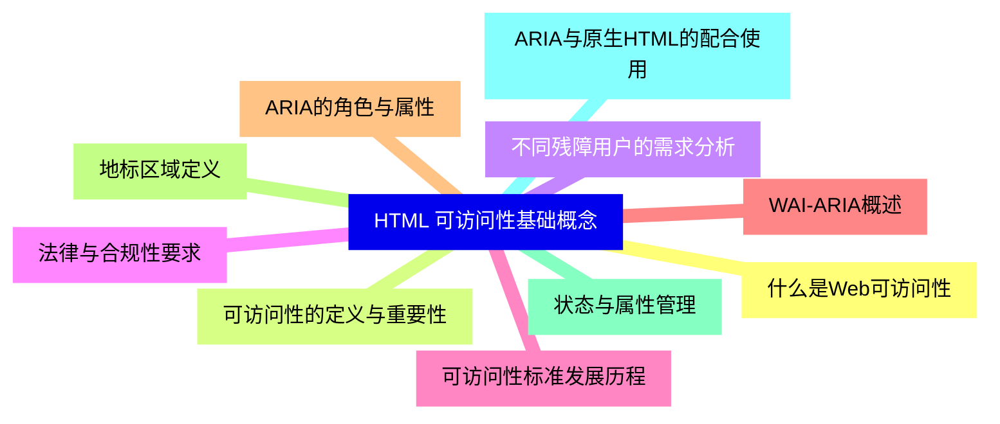

<--->
{}
{}
{}
{}
{}
{}
{}
{}
{}
{}
{}
{}
{}
{}
{}
{}
{}
{}
{}
{}
{}

### 2 语义化HTML结构{#2}

{}
{}
{}
{}
{}
{}
{}
{}
{}
{}
{}
{}
{}
{}
{}
{}
{}
{}
{}
{}
{}
<--->
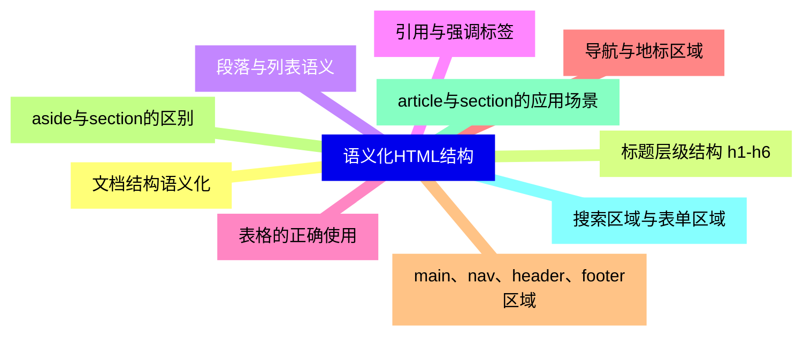

{}

### 3 表单可访问性{#3}

{}
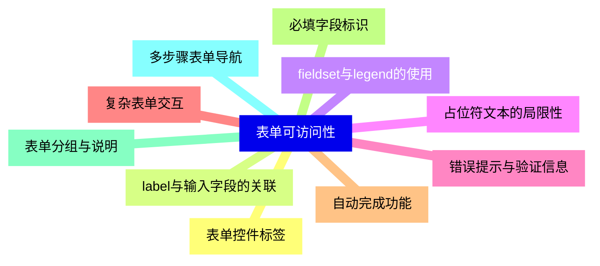

<--->
{}
{}
{}
{}
{}
{}
{}
{}
{}
{}
{}
{}
{}
{}
{}
{}
{}
{}
{}
{}
{}

### 4 多媒体内容可访问性{#4}

{}
{}
{}
{}
{}
{}
{}
{}
{}
{}
{}
{}
{}
{}
{}
{}
{}
{}
{}
{}
{}
<--->
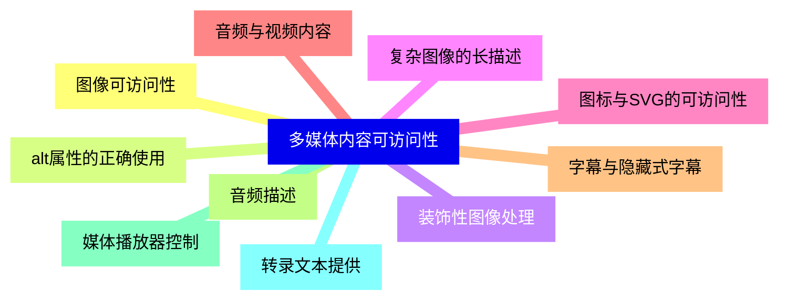

{}

### 5 交互元素可访问性{#5}

{}
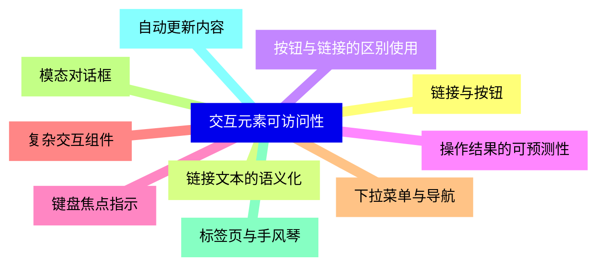

<--->
{}
{}
{}
{}
{}
{}
{}
{}
{}
{}
{}
{}
{}
{}
{}
{}
{}
{}
{}
{}
{}

### 6 颜色与视觉设计{#6}

{}
{}
{}
{}
{}
{}
{}
{}
{}
{}
{}
{}
{}
{}
{}
{}
{}
{}
{}
{}
{}
<--->
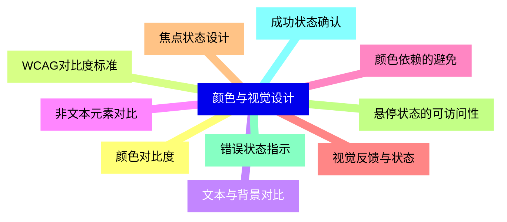

{}

### 7 键盘导航与操作{#7}

{}
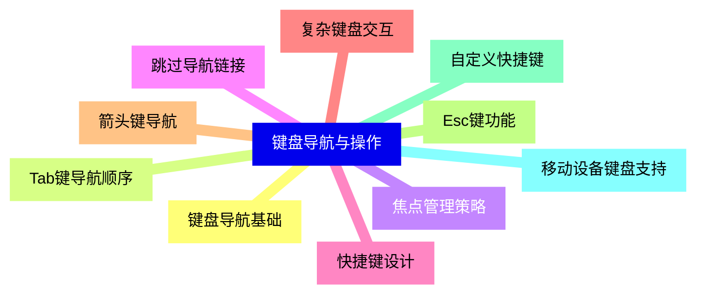

<--->
{}
{}
{}
{}
{}
{}
{}
{}
{}
{}
{}
{}
{}
{}
{}
{}
{}
{}
{}
{}
{}

### 8 辅助技术兼容性{#8}

{}
{}
{}
{}
{}
{}
{}
{}
{}
{}
{}
{}
{}
{}
{}
{}
{}
{}
{}
{}
{}
<--->
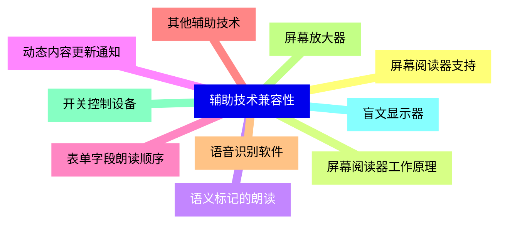

{}

### 9 移动设备可访问性{#9}

{}
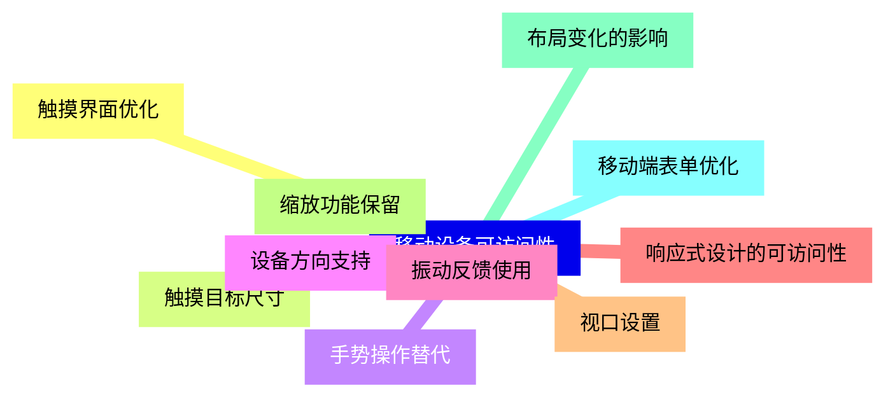

<--->
{}
{}
{}
{}
{}
{}
{}
{}
{}
{}
{}
{}
{}
{}
{}
{}
{}
{}
{}
{}
{}

### 10 测试与评估方法{#10}

{}
{}
{}
{}
{}
{}
{}
{}
{}
{}
{}
{}
{}
{}
{}
{}
{}
{}
{}
{}
{}
<--->
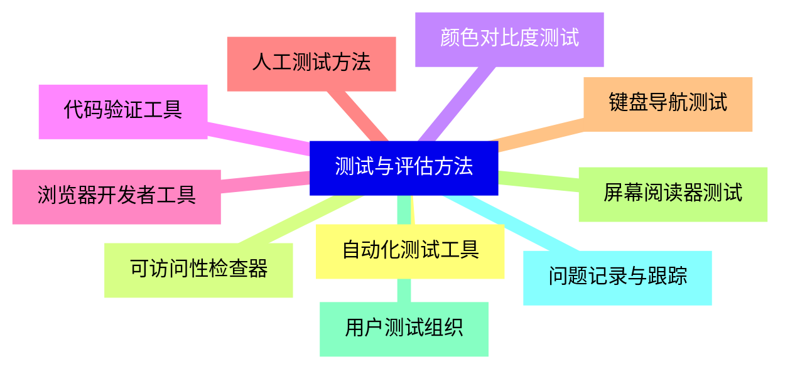

{}

### 11 高级可访问性技术{#11}

{}
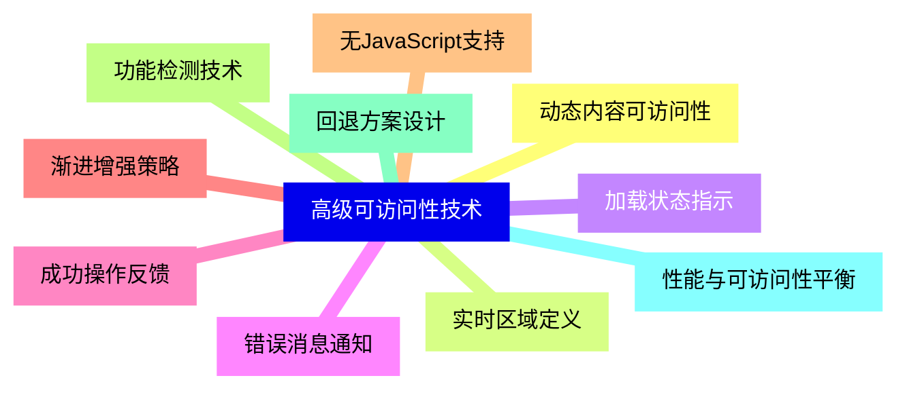

<--->
{}
{}
{}
{}
{}
{}
{}
{}
{}
{}
{}
{}
{}
{}
{}
{}
{}
{}
{}
{}
{}

### 12 可访问性维护与优化{#12}

{}
{}
{}
{}
{}
{}
{}
{}
{}
{}
{}
{}
{}
{}
{}
{}
{}
{}
{}
{}
{}
<--->
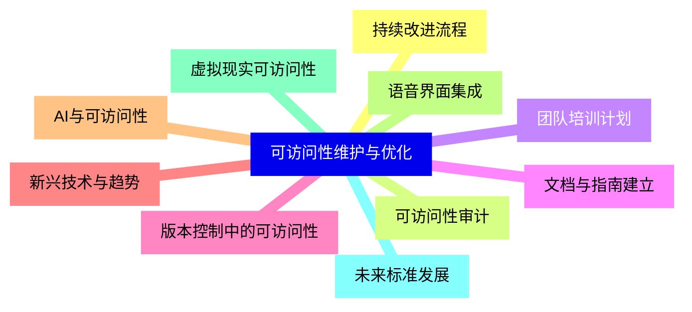

{}
