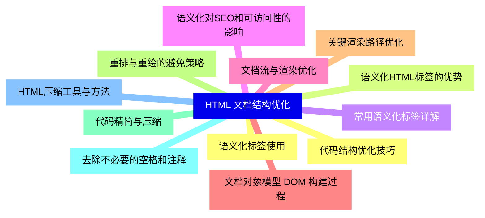
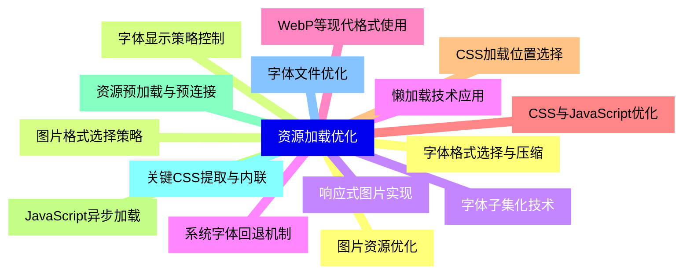
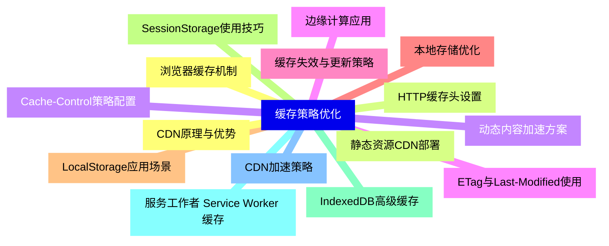
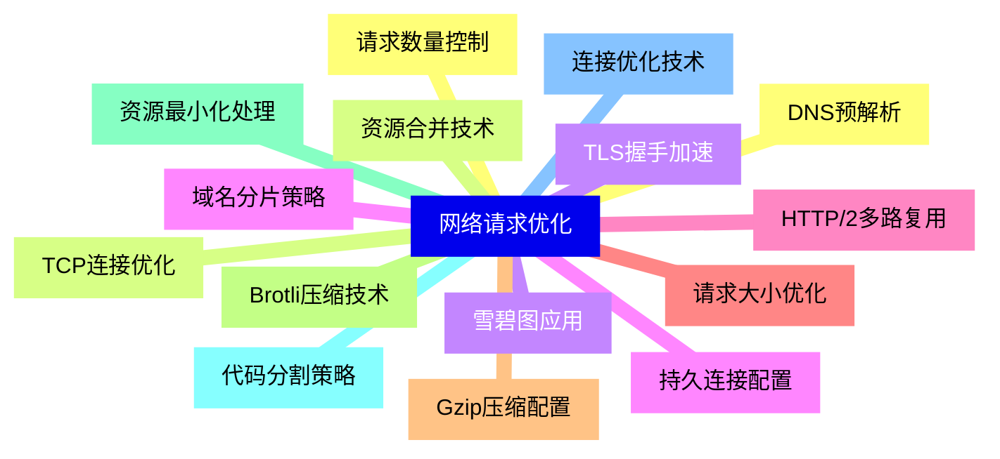
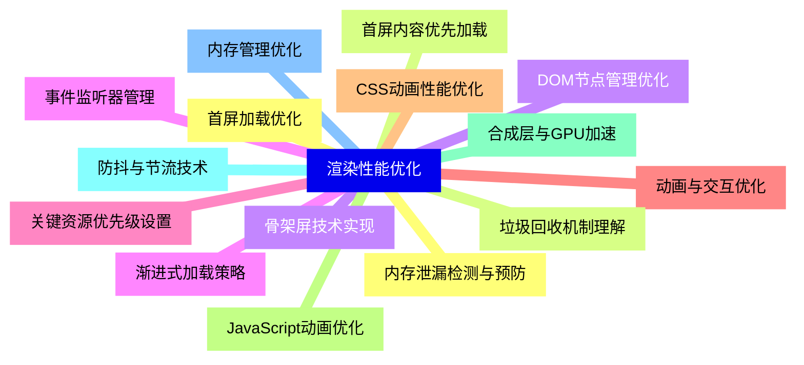
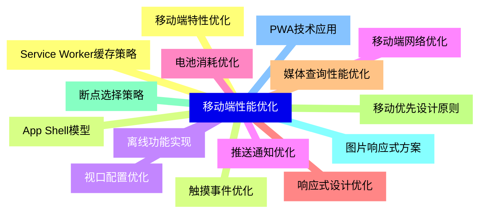
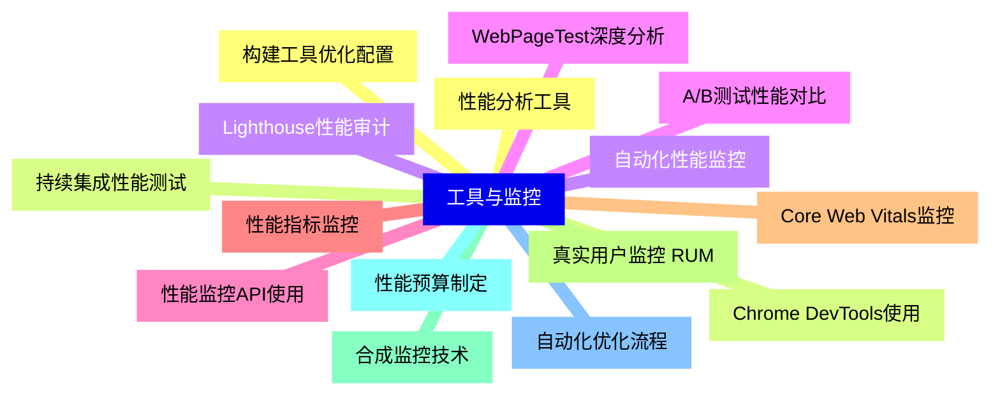
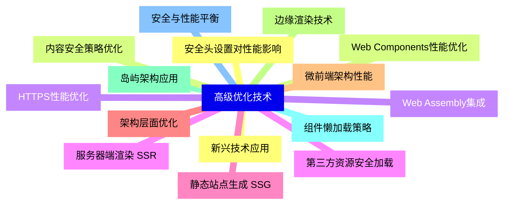


### 1 [HTML 文档结构优化](#1)
#### 1.1 [语义化标签使用](#1)
#### 1.2 [语义化HTML标签的优势](#1)
#### 1.3 [常用语义化标签详解](#1)
#### 1.4 [语义化对SEO和可访问性的影响](#1)
#### 1.5 [文档流与渲染优化](#1)
#### 1.6 [文档对象模型 DOM 构建过程](#1)
#### 1.7 [关键渲染路径优化](#1)
#### 1.8 [重排与重绘的避免策略](#1)
#### 1.9 [代码精简与压缩](#1)
#### 1.10 [去除不必要的空格和注释](#1)
#### 1.11 [HTML压缩工具与方法](#1)
#### 1.12 [代码结构优化技巧](#1)
### 2 [资源加载优化](#2)
#### 2.1 [图片资源优化](#2)
#### 2.2 [图片格式选择策略](#2)
#### 2.3 [响应式图片实现](#2)
#### 2.4 [懒加载技术应用](#2)
#### 2.5 [WebP等现代格式使用](#2)
#### 2.6 [CSS与JavaScript优化](#2)
#### 2.7 [CSS加载位置选择](#2)
#### 2.8 [JavaScript异步加载](#2)
#### 2.9 [资源预加载与预连接](#2)
#### 2.10 [关键CSS提取与内联](#2)
#### 2.11 [字体文件优化](#2)
#### 2.12 [字体格式选择与压缩](#2)
#### 2.13 [字体显示策略控制](#2)
#### 2.14 [字体子集化技术](#2)
#### 2.15 [系统字体回退机制](#2)
### 3 [缓存策略优化](#3)
#### 3.1 [浏览器缓存机制](#3)
#### 3.2 [HTTP缓存头设置](#3)
#### 3.3 [Cache-Control策略配置](#3)
#### 3.4 [ETag与Last-Modified使用](#3)
#### 3.5 [缓存失效与更新策略](#3)
#### 3.6 [本地存储优化](#3)
#### 3.7 [LocalStorage应用场景](#3)
#### 3.8 [SessionStorage使用技巧](#3)
#### 3.9 [IndexedDB高级缓存](#3)
#### 3.10 [服务工作者 Service Worker 缓存](#3)
#### 3.11 [CDN加速策略](#3)
#### 3.12 [CDN原理与优势](#3)
#### 3.13 [静态资源CDN部署](#3)
#### 3.14 [动态内容加速方案](#3)
#### 3.15 [边缘计算应用](#3)
### 4 [网络请求优化](#4)
#### 4.1 [请求数量控制](#4)
#### 4.2 [资源合并技术](#4)
#### 4.3 [雪碧图应用](#4)
#### 4.4 [域名分片策略](#4)
#### 4.5 [HTTP/2多路复用](#4)
#### 4.6 [请求大小优化](#4)
#### 4.7 [Gzip压缩配置](#4)
#### 4.8 [Brotli压缩技术](#4)
#### 4.9 [资源最小化处理](#4)
#### 4.10 [代码分割策略](#4)
#### 4.11 [连接优化技术](#4)
#### 4.12 [DNS预解析](#4)
#### 4.13 [TCP连接优化](#4)
#### 4.14 [TLS握手加速](#4)
#### 4.15 [持久连接配置](#4)
### 5 [渲染性能优化](#5)
#### 5.1 [首屏加载优化](#5)
#### 5.2 [首屏内容优先加载](#5)
#### 5.3 [骨架屏技术实现](#5)
#### 5.4 [渐进式加载策略](#5)
#### 5.5 [关键资源优先级设置](#5)
#### 5.6 [动画与交互优化](#5)
#### 5.7 [CSS动画性能优化](#5)
#### 5.8 [JavaScript动画优化](#5)
#### 5.9 [合成层与GPU加速](#5)
#### 5.10 [防抖与节流技术](#5)
#### 5.11 [内存管理优化](#5)
#### 5.12 [内存泄漏检测与预防](#5)
#### 5.13 [垃圾回收机制理解](#5)
#### 5.14 [DOM节点管理优化](#5)
#### 5.15 [事件监听器管理](#5)
### 6 [移动端性能优化](#6)
#### 6.1 [移动端特性优化](#6)
#### 6.2 [触摸事件优化](#6)
#### 6.3 [视口配置优化](#6)
#### 6.4 [移动端网络优化](#6)
#### 6.5 [电池消耗优化](#6)
#### 6.6 [响应式设计优化](#6)
#### 6.7 [媒体查询性能优化](#6)
#### 6.8 [移动优先设计原则](#6)
#### 6.9 [断点选择策略](#6)
#### 6.10 [图片响应式方案](#6)
#### 6.11 [PWA技术应用](#6)
#### 6.12 [Service Worker缓存策略](#6)
#### 6.13 [App Shell模型](#6)
#### 6.14 [离线功能实现](#6)
#### 6.15 [推送通知优化](#6)
### 7 [工具与监控](#7)
#### 7.1 [性能分析工具](#7)
#### 7.2 [Chrome DevTools使用](#7)
#### 7.3 [Lighthouse性能审计](#7)
#### 7.4 [WebPageTest深度分析](#7)
#### 7.5 [性能监控API使用](#7)
#### 7.6 [性能指标监控](#7)
#### 7.7 [Core Web Vitals监控](#7)
#### 7.8 [真实用户监控 RUM](#7)
#### 7.9 [合成监控技术](#7)
#### 7.10 [性能预算制定](#7)
#### 7.11 [自动化优化流程](#7)
#### 7.12 [构建工具优化配置](#7)
#### 7.13 [持续集成性能测试](#7)
#### 7.14 [自动化性能监控](#7)
#### 7.15 [A/B测试性能对比](#7)
### 8 [高级优化技术](#8)
#### 8.1 [新兴技术应用](#8)
#### 8.2 [Web Components性能优化](#8)
#### 8.3 [Web Assembly集成](#8)
#### 8.4 [服务器端渲染 SSR](#8)
#### 8.5 [静态站点生成 SSG](#8)
#### 8.6 [架构层面优化](#8)
#### 8.7 [微前端架构性能](#8)
#### 8.8 [边缘渲染技术](#8)
#### 8.9 [岛屿架构应用](#8)
#### 8.10 [组件懒加载策略](#8)
#### 8.11 [安全与性能平衡](#8)
#### 8.12 [安全头设置对性能影响](#8)
#### 8.13 [内容安全策略优化](#8)
#### 8.14 [HTTPS性能优化](#8)
#### 8.15 [第三方资源安全加载](#8)




### 1 HTML 文档结构优化

---
### 1 HTML 文档结构优化
___
#### 1.1 语义化标签使用
___
#### 1.2 语义化HTML标签的优势
___
#### 1.3 常用语义化标签详解
___
#### 1.4 语义化对SEO和可访问性的影响
___
#### 1.5 文档流与渲染优化
___
#### 1.6 文档对象模型 DOM 构建过程
___
#### 1.7 关键渲染路径优化
___
#### 1.8 重排与重绘的避免策略
___
#### 1.9 代码精简与压缩
___
#### 1.10 去除不必要的空格和注释
___
#### 1.11 HTML压缩工具与方法
___
#### 1.12 代码结构优化技巧
### 2 资源加载优化

---
### 2 资源加载优化
___
#### 2.1 图片资源优化
___
#### 2.2 图片格式选择策略
___
#### 2.3 响应式图片实现
___
#### 2.4 懒加载技术应用
___
#### 2.5 WebP等现代格式使用
___
#### 2.6 CSS与JavaScript优化
___
#### 2.7 CSS加载位置选择
___
#### 2.8 JavaScript异步加载
___
#### 2.9 资源预加载与预连接
___
#### 2.10 关键CSS提取与内联
___
#### 2.11 字体文件优化
___
#### 2.12 字体格式选择与压缩
___
#### 2.13 字体显示策略控制
___
#### 2.14 字体子集化技术
___
#### 2.15 系统字体回退机制
### 3 缓存策略优化

---
### 3 缓存策略优化
___
#### 3.1 浏览器缓存机制
___
#### 3.2 HTTP缓存头设置
___
#### 3.3 Cache-Control策略配置
___
#### 3.4 ETag与Last-Modified使用
___
#### 3.5 缓存失效与更新策略
___
#### 3.6 本地存储优化
___
#### 3.7 LocalStorage应用场景
___
#### 3.8 SessionStorage使用技巧
___
#### 3.9 IndexedDB高级缓存
___
#### 3.10 服务工作者 Service Worker 缓存
___
#### 3.11 CDN加速策略
___
#### 3.12 CDN原理与优势
___
#### 3.13 静态资源CDN部署
___
#### 3.14 动态内容加速方案
___
#### 3.15 边缘计算应用
### 4 网络请求优化

---
### 4 网络请求优化
___
#### 4.1 请求数量控制
___
#### 4.2 资源合并技术
___
#### 4.3 雪碧图应用
___
#### 4.4 域名分片策略
___
#### 4.5 HTTP/2多路复用
___
#### 4.6 请求大小优化
___
#### 4.7 Gzip压缩配置
___
#### 4.8 Brotli压缩技术
___
#### 4.9 资源最小化处理
___
#### 4.10 代码分割策略
___
#### 4.11 连接优化技术
___
#### 4.12 DNS预解析
___
#### 4.13 TCP连接优化
___
#### 4.14 TLS握手加速
___
#### 4.15 持久连接配置
### 5 渲染性能优化

---
### 5 渲染性能优化
___
#### 5.1 首屏加载优化
___
#### 5.2 首屏内容优先加载
___
#### 5.3 骨架屏技术实现
___
#### 5.4 渐进式加载策略
___
#### 5.5 关键资源优先级设置
___
#### 5.6 动画与交互优化
___
#### 5.7 CSS动画性能优化
___
#### 5.8 JavaScript动画优化
___
#### 5.9 合成层与GPU加速
___
#### 5.10 防抖与节流技术
___
#### 5.11 内存管理优化
___
#### 5.12 内存泄漏检测与预防
___
#### 5.13 垃圾回收机制理解
___
#### 5.14 DOM节点管理优化
___
#### 5.15 事件监听器管理
### 6 移动端性能优化

---
### 6 移动端性能优化
___
#### 6.1 移动端特性优化
___
#### 6.2 触摸事件优化
___
#### 6.3 视口配置优化
___
#### 6.4 移动端网络优化
___
#### 6.5 电池消耗优化
___
#### 6.6 响应式设计优化
___
#### 6.7 媒体查询性能优化
___
#### 6.8 移动优先设计原则
___
#### 6.9 断点选择策略
___
#### 6.10 图片响应式方案
___
#### 6.11 PWA技术应用
___
#### 6.12 Service Worker缓存策略
___
#### 6.13 App Shell模型
___
#### 6.14 离线功能实现
___
#### 6.15 推送通知优化
### 7 工具与监控

---
### 7 工具与监控
___
#### 7.1 性能分析工具
___
#### 7.2 Chrome DevTools使用
___
#### 7.3 Lighthouse性能审计
___
#### 7.4 WebPageTest深度分析
___
#### 7.5 性能监控API使用
___
#### 7.6 性能指标监控
___
#### 7.7 Core Web Vitals监控
___
#### 7.8 真实用户监控 RUM
___
#### 7.9 合成监控技术
___
#### 7.10 性能预算制定
___
#### 7.11 自动化优化流程
___
#### 7.12 构建工具优化配置
___
#### 7.13 持续集成性能测试
___
#### 7.14 自动化性能监控
___
#### 7.15 A/B测试性能对比
### 8 高级优化技术

---
### 8 高级优化技术
___
#### 8.1 新兴技术应用
___
#### 8.2 Web Components性能优化
___
#### 8.3 Web Assembly集成
___
#### 8.4 服务器端渲染 SSR
___
#### 8.5 静态站点生成 SSG
___
#### 8.6 架构层面优化
___
#### 8.7 微前端架构性能
___
#### 8.8 边缘渲染技术
___
#### 8.9 岛屿架构应用
___
#### 8.10 组件懒加载策略
___
#### 8.11 安全与性能平衡
___
#### 8.12 安全头设置对性能影响
___
#### 8.13 内容安全策略优化
___
#### 8.14 HTTPS性能优化
___
#### 8.15 第三方资源安全加载


### 1 HTML 文档结构优化{#1}

{}

<--->
{}
{}
{}
{}
{}
{}
{}
{}
{}
{}
{}
{}
{}
{}
{}
{}
{}
{}
{}
{}
{}
{}
{}
{}
{}

### 2 资源加载优化{#2}

{}
{}
{}
{}
{}
{}
{}
{}
{}
{}
{}
{}
{}
{}
{}
{}
{}
{}
{}
{}
{}
{}
{}
{}
{}
{}
{}
{}
{}
{}
{}
<--->

{}

### 3 缓存策略优化{#3}

{}

<--->
{}
{}
{}
{}
{}
{}
{}
{}
{}
{}
{}
{}
{}
{}
{}
{}
{}
{}
{}
{}
{}
{}
{}
{}
{}
{}
{}
{}
{}
{}
{}

### 4 网络请求优化{#4}

{}
{}
{}
{}
{}
{}
{}
{}
{}
{}
{}
{}
{}
{}
{}
{}
{}
{}
{}
{}
{}
{}
{}
{}
{}
{}
{}
{}
{}
{}
{}
<--->

{}

### 5 渲染性能优化{#5}

{}

<--->
{}
{}
{}
{}
{}
{}
{}
{}
{}
{}
{}
{}
{}
{}
{}
{}
{}
{}
{}
{}
{}
{}
{}
{}
{}
{}
{}
{}
{}
{}
{}

### 6 移动端性能优化{#6}

{}
{}
{}
{}
{}
{}
{}
{}
{}
{}
{}
{}
{}
{}
{}
{}
{}
{}
{}
{}
{}
{}
{}
{}
{}
{}
{}
{}
{}
{}
{}
<--->

{}

### 7 工具与监控{#7}

{}

<--->
{}
{}
{}
{}
{}
{}
{}
{}
{}
{}
{}
{}
{}
{}
{}
{}
{}
{}
{}
{}
{}
{}
{}
{}
{}
{}
{}
{}
{}
{}
{}

### 8 高级优化技术{#8}

{}
{}
{}
{}
{}
{}
{}
{}
{}
{}
{}
{}
{}
{}
{}
{}
{}
{}
{}
{}
{}
{}
{}
{}
{}
{}
{}
{}
{}
{}
{}
<--->

{}
