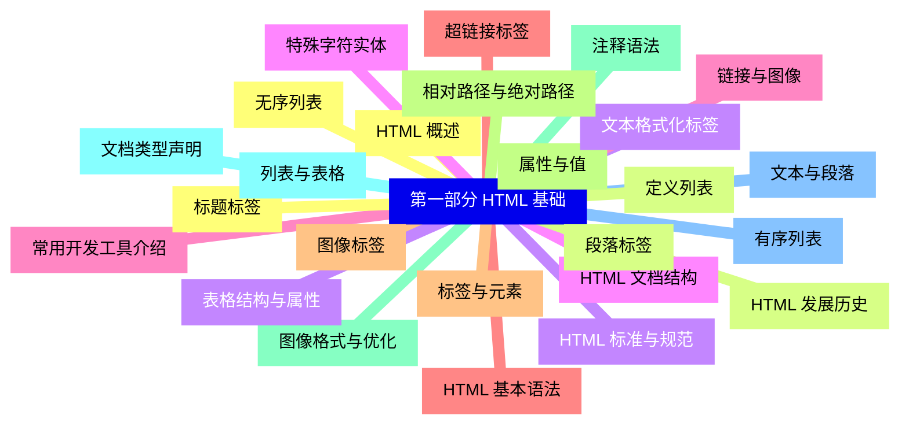
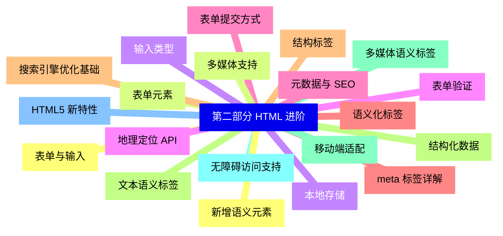
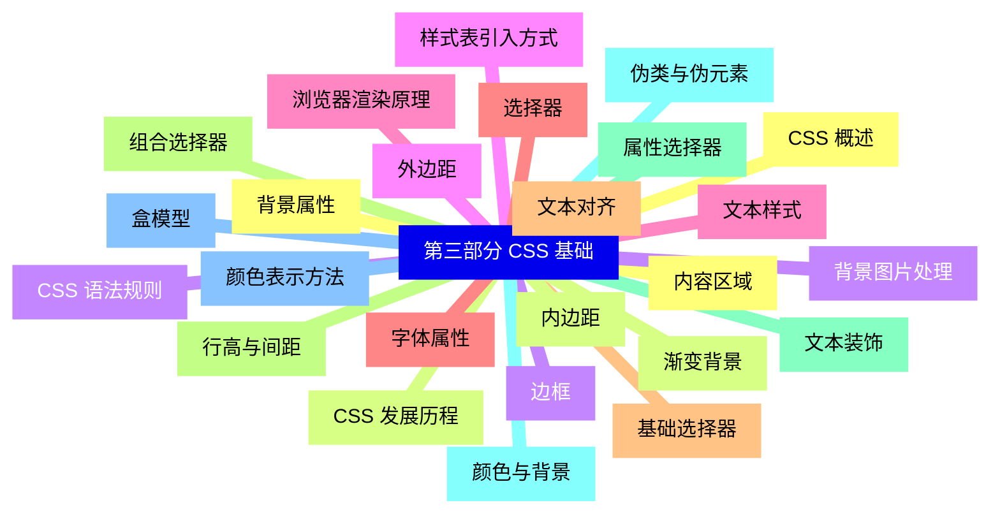
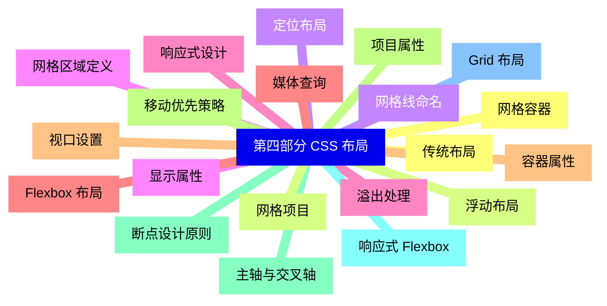
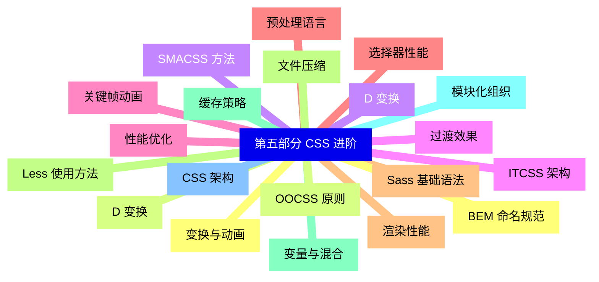
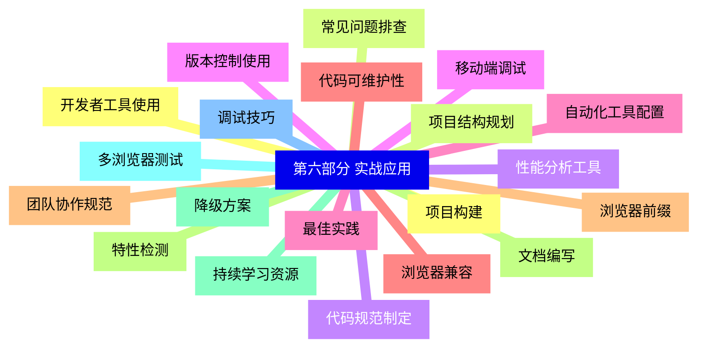


### 1 [第一部分 HTML 基础](#1)
#### 1.1 [HTML 概述](#1)
#### 1.2 [HTML 发展历史](#1)
#### 1.3 [HTML 标准与规范](#1)
#### 1.4 [HTML 文档结构](#1)
#### 1.5 [常用开发工具介绍](#1)
#### 1.6 [HTML 基本语法](#1)
#### 1.7 [标签与元素](#1)
#### 1.8 [属性与值](#1)
#### 1.9 [注释语法](#1)
#### 1.10 [文档类型声明](#1)
#### 1.11 [文本与段落](#1)
#### 1.12 [标题标签](#1)
#### 1.13 [段落标签](#1)
#### 1.14 [文本格式化标签](#1)
#### 1.15 [特殊字符实体](#1)
#### 1.16 [链接与图像](#1)
#### 1.17 [超链接标签](#1)
#### 1.18 [图像标签](#1)
#### 1.19 [相对路径与绝对路径](#1)
#### 1.20 [图像格式与优化](#1)
#### 1.21 [列表与表格](#1)
#### 1.22 [有序列表](#1)
#### 1.23 [无序列表](#1)
#### 1.24 [定义列表](#1)
#### 1.25 [表格结构与属性](#1)
### 2 [第二部分 HTML 进阶](#2)
#### 2.1 [表单与输入](#2)
#### 2.2 [表单元素](#2)
#### 2.3 [输入类型](#2)
#### 2.4 [表单验证](#2)
#### 2.5 [表单提交方式](#2)
#### 2.6 [语义化标签](#2)
#### 2.7 [结构标签](#2)
#### 2.8 [文本语义标签](#2)
#### 2.9 [多媒体语义标签](#2)
#### 2.10 [无障碍访问支持](#2)
#### 2.11 [HTML5 新特性](#2)
#### 2.12 [新增语义元素](#2)
#### 2.13 [多媒体支持](#2)
#### 2.14 [本地存储](#2)
#### 2.15 [地理定位 API](#2)
#### 2.16 [元数据与 SEO](#2)
#### 2.17 [meta 标签详解](#2)
#### 2.18 [搜索引擎优化基础](#2)
#### 2.19 [结构化数据](#2)
#### 2.20 [移动端适配](#2)
### 3 [第三部分 CSS 基础](#3)
#### 3.1 [CSS 概述](#3)
#### 3.2 [CSS 发展历程](#3)
#### 3.3 [CSS 语法规则](#3)
#### 3.4 [样式表引入方式](#3)
#### 3.5 [浏览器渲染原理](#3)
#### 3.6 [选择器](#3)
#### 3.7 [基础选择器](#3)
#### 3.8 [组合选择器](#3)
#### 3.9 [属性选择器](#3)
#### 3.10 [伪类与伪元素](#3)
#### 3.11 [盒模型](#3)
#### 3.12 [内容区域](#3)
#### 3.13 [内边距](#3)
#### 3.14 [边框](#3)
#### 3.15 [外边距](#3)
#### 3.16 [文本样式](#3)
#### 3.17 [字体属性](#3)
#### 3.18 [文本对齐](#3)
#### 3.19 [行高与间距](#3)
#### 3.20 [文本装饰](#3)
#### 3.21 [颜色与背景](#3)
#### 3.22 [颜色表示方法](#3)
#### 3.23 [背景属性](#3)
#### 3.24 [渐变背景](#3)
#### 3.25 [背景图片处理](#3)
### 4 [第四部分 CSS 布局](#4)
#### 4.1 [传统布局](#4)
#### 4.2 [浮动布局](#4)
#### 4.3 [定位布局](#4)
#### 4.4 [显示属性](#4)
#### 4.5 [溢出处理](#4)
#### 4.6 [Flexbox 布局](#4)
#### 4.7 [容器属性](#4)
#### 4.8 [项目属性](#4)
#### 4.9 [主轴与交叉轴](#4)
#### 4.10 [响应式 Flexbox](#4)
#### 4.11 [Grid 布局](#4)
#### 4.12 [网格容器](#4)
#### 4.13 [网格项目](#4)
#### 4.14 [网格线命名](#4)
#### 4.15 [网格区域定义](#4)
#### 4.16 [响应式设计](#4)
#### 4.17 [媒体查询](#4)
#### 4.18 [视口设置](#4)
#### 4.19 [移动优先策略](#4)
#### 4.20 [断点设计原则](#4)
### 5 [第五部分 CSS 进阶](#5)
#### 5.1 [变换与动画](#5)
#### 5.2 [D 变换](#5)
#### 5.3 [D 变换](#5)
#### 5.4 [过渡效果](#5)
#### 5.5 [关键帧动画](#5)
#### 5.6 [预处理语言](#5)
#### 5.7 [Sass 基础语法](#5)
#### 5.8 [Less 使用方法](#5)
#### 5.9 [变量与混合](#5)
#### 5.10 [模块化组织](#5)
#### 5.11 [CSS 架构](#5)
#### 5.12 [BEM 命名规范](#5)
#### 5.13 [OOCSS 原则](#5)
#### 5.14 [SMACSS 方法](#5)
#### 5.15 [ITCSS 架构](#5)
#### 5.16 [性能优化](#5)
#### 5.17 [选择器性能](#5)
#### 5.18 [渲染性能](#5)
#### 5.19 [文件压缩](#5)
#### 5.20 [缓存策略](#5)
### 6 [第六部分 实战应用](#6)
#### 6.1 [项目构建](#6)
#### 6.2 [项目结构规划](#6)
#### 6.3 [代码规范制定](#6)
#### 6.4 [版本控制使用](#6)
#### 6.5 [自动化工具配置](#6)
#### 6.6 [浏览器兼容](#6)
#### 6.7 [浏览器前缀](#6)
#### 6.8 [特性检测](#6)
#### 6.9 [降级方案](#6)
#### 6.10 [多浏览器测试](#6)
#### 6.11 [调试技巧](#6)
#### 6.12 [开发者工具使用](#6)
#### 6.13 [常见问题排查](#6)
#### 6.14 [性能分析工具](#6)
#### 6.15 [移动端调试](#6)
#### 6.16 [最佳实践](#6)
#### 6.17 [代码可维护性](#6)
#### 6.18 [团队协作规范](#6)
#### 6.19 [文档编写](#6)
#### 6.20 [持续学习资源](#6)




### 1 第一部分 HTML 基础

---
### 1 第一部分 HTML 基础
___
#### 1.1 HTML 概述
___
#### 1.2 HTML 发展历史
___
#### 1.3 HTML 标准与规范
___
#### 1.4 HTML 文档结构
___
#### 1.5 常用开发工具介绍
___
#### 1.6 HTML 基本语法
___
#### 1.7 标签与元素
___
#### 1.8 属性与值
___
#### 1.9 注释语法
___
#### 1.10 文档类型声明
___
#### 1.11 文本与段落
___
#### 1.12 标题标签
___
#### 1.13 段落标签
___
#### 1.14 文本格式化标签
___
#### 1.15 特殊字符实体
___
#### 1.16 链接与图像
___
#### 1.17 超链接标签
___
#### 1.18 图像标签
___
#### 1.19 相对路径与绝对路径
___
#### 1.20 图像格式与优化
___
#### 1.21 列表与表格
___
#### 1.22 有序列表
___
#### 1.23 无序列表
___
#### 1.24 定义列表
___
#### 1.25 表格结构与属性
### 2 第二部分 HTML 进阶

---
### 2 第二部分 HTML 进阶
___
#### 2.1 表单与输入
___
#### 2.2 表单元素
___
#### 2.3 输入类型
___
#### 2.4 表单验证
___
#### 2.5 表单提交方式
___
#### 2.6 语义化标签
___
#### 2.7 结构标签
___
#### 2.8 文本语义标签
___
#### 2.9 多媒体语义标签
___
#### 2.10 无障碍访问支持
___
#### 2.11 HTML5 新特性
___
#### 2.12 新增语义元素
___
#### 2.13 多媒体支持
___
#### 2.14 本地存储
___
#### 2.15 地理定位 API
___
#### 2.16 元数据与 SEO
___
#### 2.17 meta 标签详解
___
#### 2.18 搜索引擎优化基础
___
#### 2.19 结构化数据
___
#### 2.20 移动端适配
### 3 第三部分 CSS 基础

---
### 3 第三部分 CSS 基础
___
#### 3.1 CSS 概述
___
#### 3.2 CSS 发展历程
___
#### 3.3 CSS 语法规则
___
#### 3.4 样式表引入方式
___
#### 3.5 浏览器渲染原理
___
#### 3.6 选择器
___
#### 3.7 基础选择器
___
#### 3.8 组合选择器
___
#### 3.9 属性选择器
___
#### 3.10 伪类与伪元素
___
#### 3.11 盒模型
___
#### 3.12 内容区域
___
#### 3.13 内边距
___
#### 3.14 边框
___
#### 3.15 外边距
___
#### 3.16 文本样式
___
#### 3.17 字体属性
___
#### 3.18 文本对齐
___
#### 3.19 行高与间距
___
#### 3.20 文本装饰
___
#### 3.21 颜色与背景
___
#### 3.22 颜色表示方法
___
#### 3.23 背景属性
___
#### 3.24 渐变背景
___
#### 3.25 背景图片处理
### 4 第四部分 CSS 布局

---
### 4 第四部分 CSS 布局
___
#### 4.1 传统布局
___
#### 4.2 浮动布局
___
#### 4.3 定位布局
___
#### 4.4 显示属性
___
#### 4.5 溢出处理
___
#### 4.6 Flexbox 布局
___
#### 4.7 容器属性
___
#### 4.8 项目属性
___
#### 4.9 主轴与交叉轴
___
#### 4.10 响应式 Flexbox
___
#### 4.11 Grid 布局
___
#### 4.12 网格容器
___
#### 4.13 网格项目
___
#### 4.14 网格线命名
___
#### 4.15 网格区域定义
___
#### 4.16 响应式设计
___
#### 4.17 媒体查询
___
#### 4.18 视口设置
___
#### 4.19 移动优先策略
___
#### 4.20 断点设计原则
### 5 第五部分 CSS 进阶

---
### 5 第五部分 CSS 进阶
___
#### 5.1 变换与动画
___
#### 5.2 D 变换
___
#### 5.3 D 变换
___
#### 5.4 过渡效果
___
#### 5.5 关键帧动画
___
#### 5.6 预处理语言
___
#### 5.7 Sass 基础语法
___
#### 5.8 Less 使用方法
___
#### 5.9 变量与混合
___
#### 5.10 模块化组织
___
#### 5.11 CSS 架构
___
#### 5.12 BEM 命名规范
___
#### 5.13 OOCSS 原则
___
#### 5.14 SMACSS 方法
___
#### 5.15 ITCSS 架构
___
#### 5.16 性能优化
___
#### 5.17 选择器性能
___
#### 5.18 渲染性能
___
#### 5.19 文件压缩
___
#### 5.20 缓存策略
### 6 第六部分 实战应用

---
### 6 第六部分 实战应用
___
#### 6.1 项目构建
___
#### 6.2 项目结构规划
___
#### 6.3 代码规范制定
___
#### 6.4 版本控制使用
___
#### 6.5 自动化工具配置
___
#### 6.6 浏览器兼容
___
#### 6.7 浏览器前缀
___
#### 6.8 特性检测
___
#### 6.9 降级方案
___
#### 6.10 多浏览器测试
___
#### 6.11 调试技巧
___
#### 6.12 开发者工具使用
___
#### 6.13 常见问题排查
___
#### 6.14 性能分析工具
___
#### 6.15 移动端调试
___
#### 6.16 最佳实践
___
#### 6.17 代码可维护性
___
#### 6.18 团队协作规范
___
#### 6.19 文档编写
___
#### 6.20 持续学习资源


### 1 第一部分 HTML 基础{#1}

{}

<--->
{}
{}
{}
{}
{}
{}
{}
{}
{}
{}
{}
{}
{}
{}
{}
{}
{}
{}
{}
{}
{}
{}
{}
{}
{}
{}
{}
{}
{}
{}
{}
{}
{}
{}
{}
{}
{}
{}
{}
{}
{}
{}
{}
{}
{}
{}
{}
{}
{}
{}
{}

### 2 第二部分 HTML 进阶{#2}

{}
{}
{}
{}
{}
{}
{}
{}
{}
{}
{}
{}
{}
{}
{}
{}
{}
{}
{}
{}
{}
{}
{}
{}
{}
{}
{}
{}
{}
{}
{}
{}
{}
{}
{}
{}
{}
{}
{}
{}
{}
<--->

{}

### 3 第三部分 CSS 基础{#3}

{}

<--->
{}
{}
{}
{}
{}
{}
{}
{}
{}
{}
{}
{}
{}
{}
{}
{}
{}
{}
{}
{}
{}
{}
{}
{}
{}
{}
{}
{}
{}
{}
{}
{}
{}
{}
{}
{}
{}
{}
{}
{}
{}
{}
{}
{}
{}
{}
{}
{}
{}
{}
{}

### 4 第四部分 CSS 布局{#4}

{}
{}
{}
{}
{}
{}
{}
{}
{}
{}
{}
{}
{}
{}
{}
{}
{}
{}
{}
{}
{}
{}
{}
{}
{}
{}
{}
{}
{}
{}
{}
{}
{}
{}
{}
{}
{}
{}
{}
{}
{}
<--->

{}

### 5 第五部分 CSS 进阶{#5}

{}

<--->
{}
{}
{}
{}
{}
{}
{}
{}
{}
{}
{}
{}
{}
{}
{}
{}
{}
{}
{}
{}
{}
{}
{}
{}
{}
{}
{}
{}
{}
{}
{}
{}
{}
{}
{}
{}
{}
{}
{}
{}
{}

### 6 第六部分 实战应用{#6}

{}
{}
{}
{}
{}
{}
{}
{}
{}
{}
{}
{}
{}
{}
{}
{}
{}
{}
{}
{}
{}
{}
{}
{}
{}
{}
{}
{}
{}
{}
{}
{}
{}
{}
{}
{}
{}
{}
{}
{}
{}
<--->

{}
