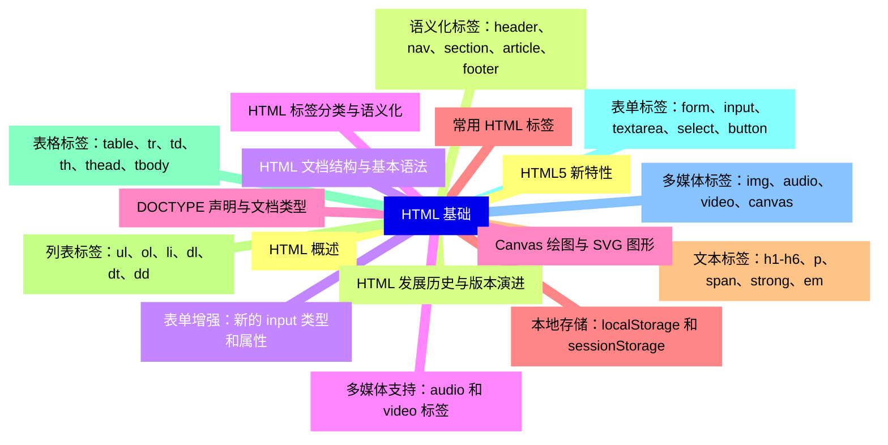
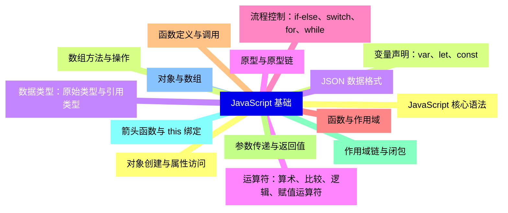
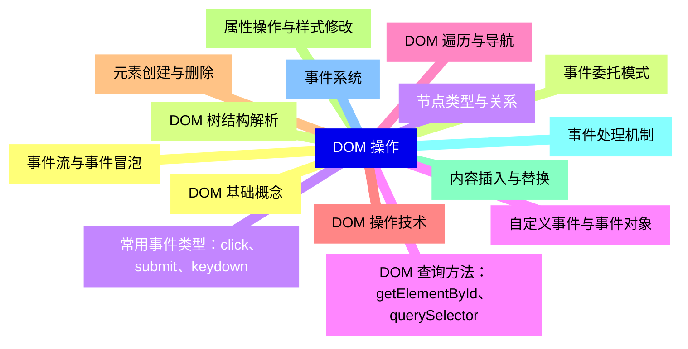
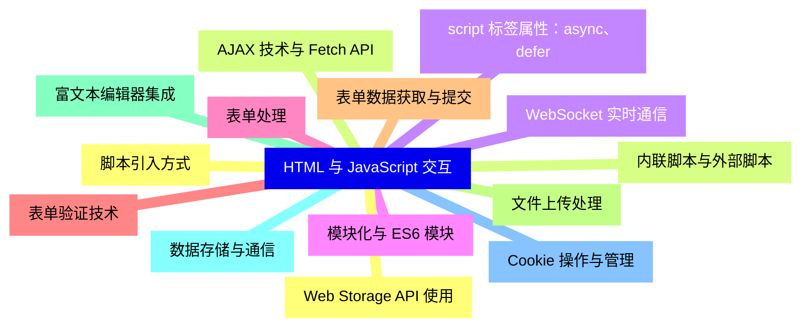
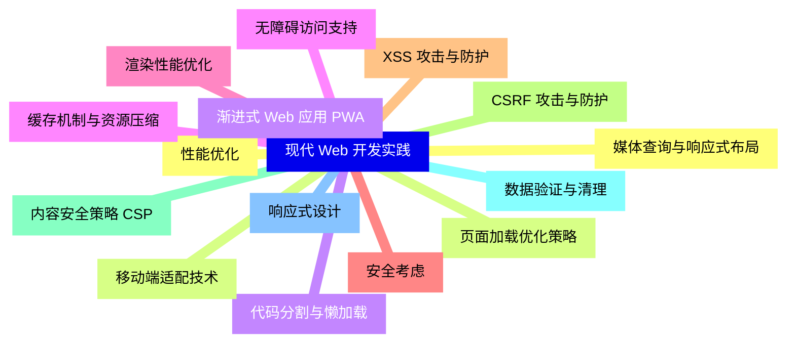
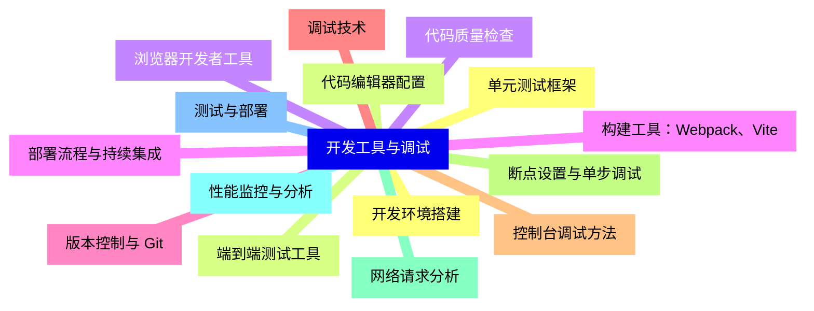


### 1 [HTML 基础](#1)
#### 1.1 [HTML 概述](#1)
#### 1.2 [HTML 发展历史与版本演进](#1)
#### 1.3 [HTML 文档结构与基本语法](#1)
#### 1.4 [HTML 标签分类与语义化](#1)
#### 1.5 [DOCTYPE 声明与文档类型](#1)
#### 1.6 [常用 HTML 标签](#1)
#### 1.7 [文本标签：h1-h6、p、span、strong、em](#1)
#### 1.8 [列表标签：ul、ol、li、dl、dt、dd](#1)
#### 1.9 [表格标签：table、tr、td、th、thead、tbody](#1)
#### 1.10 [表单标签：form、input、textarea、select、button](#1)
#### 1.11 [多媒体标签：img、audio、video、canvas](#1)
#### 1.12 [HTML5 新特性](#1)
#### 1.13 [语义化标签：header、nav、section、article、footer](#1)
#### 1.14 [表单增强：新的 input 类型和属性](#1)
#### 1.15 [多媒体支持：audio 和 video 标签](#1)
#### 1.16 [Canvas 绘图与 SVG 图形](#1)
#### 1.17 [本地存储：localStorage 和 sessionStorage](#1)
### 2 [JavaScript 基础](#2)
#### 2.1 [JavaScript 核心语法](#2)
#### 2.2 [变量声明：var、let、const](#2)
#### 2.3 [数据类型：原始类型与引用类型](#2)
#### 2.4 [运算符：算术、比较、逻辑、赋值运算符](#2)
#### 2.5 [流程控制：if-else、switch、for、while](#2)
#### 2.6 [函数与作用域](#2)
#### 2.7 [函数定义与调用](#2)
#### 2.8 [参数传递与返回值](#2)
#### 2.9 [作用域链与闭包](#2)
#### 2.10 [箭头函数与 this 绑定](#2)
#### 2.11 [对象与数组](#2)
#### 2.12 [对象创建与属性访问](#2)
#### 2.13 [数组方法与操作](#2)
#### 2.14 [JSON 数据格式](#2)
#### 2.15 [原型与原型链](#2)
### 3 [DOM 操作](#3)
#### 3.1 [DOM 基础概念](#3)
#### 3.2 [DOM 树结构解析](#3)
#### 3.3 [节点类型与关系](#3)
#### 3.4 [DOM 查询方法：getElementById、querySelector](#3)
#### 3.5 [DOM 遍历与导航](#3)
#### 3.6 [DOM 操作技术](#3)
#### 3.7 [元素创建与删除](#3)
#### 3.8 [属性操作与样式修改](#3)
#### 3.9 [内容插入与替换](#3)
#### 3.10 [事件处理机制](#3)
#### 3.11 [事件系统](#3)
#### 3.12 [事件流与事件冒泡](#3)
#### 3.13 [事件委托模式](#3)
#### 3.14 [常用事件类型：click、submit、keydown](#3)
#### 3.15 [自定义事件与事件对象](#3)
### 4 [HTML 与 JavaScript 交互](#4)
#### 4.1 [脚本引入方式](#4)
#### 4.2 [内联脚本与外部脚本](#4)
#### 4.3 [script 标签属性：async、defer](#4)
#### 4.4 [模块化与 ES6 模块](#4)
#### 4.5 [表单处理](#4)
#### 4.6 [表单验证技术](#4)
#### 4.7 [表单数据获取与提交](#4)
#### 4.8 [文件上传处理](#4)
#### 4.9 [富文本编辑器集成](#4)
#### 4.10 [数据存储与通信](#4)
#### 4.11 [Cookie 操作与管理](#4)
#### 4.12 [Web Storage API 使用](#4)
#### 4.13 [AJAX 技术与 Fetch API](#4)
#### 4.14 [WebSocket 实时通信](#4)
### 5 [现代 Web 开发实践](#5)
#### 5.1 [性能优化](#5)
#### 5.2 [页面加载优化策略](#5)
#### 5.3 [代码分割与懒加载](#5)
#### 5.4 [缓存机制与资源压缩](#5)
#### 5.5 [渲染性能优化](#5)
#### 5.6 [安全考虑](#5)
#### 5.7 [XSS 攻击与防护](#5)
#### 5.8 [CSRF 攻击与防护](#5)
#### 5.9 [内容安全策略 CSP](#5)
#### 5.10 [数据验证与清理](#5)
#### 5.11 [响应式设计](#5)
#### 5.12 [媒体查询与响应式布局](#5)
#### 5.13 [移动端适配技术](#5)
#### 5.14 [渐进式 Web 应用 PWA](#5)
#### 5.15 [无障碍访问支持](#5)
### 6 [开发工具与调试](#6)
#### 6.1 [开发环境搭建](#6)
#### 6.2 [代码编辑器配置](#6)
#### 6.3 [浏览器开发者工具](#6)
#### 6.4 [构建工具：Webpack、Vite](#6)
#### 6.5 [版本控制与 Git](#6)
#### 6.6 [调试技术](#6)
#### 6.7 [控制台调试方法](#6)
#### 6.8 [断点设置与单步调试](#6)
#### 6.9 [网络请求分析](#6)
#### 6.10 [性能监控与分析](#6)
#### 6.11 [测试与部署](#6)
#### 6.12 [单元测试框架](#6)
#### 6.13 [端到端测试工具](#6)
#### 6.14 [代码质量检查](#6)
#### 6.15 [部署流程与持续集成](#6)




### 1 HTML 基础

---
### 1 HTML 基础
___
#### 1.1 HTML 概述
___
#### 1.2 HTML 发展历史与版本演进
___
#### 1.3 HTML 文档结构与基本语法
___
#### 1.4 HTML 标签分类与语义化
___
#### 1.5 DOCTYPE 声明与文档类型
___
#### 1.6 常用 HTML 标签
___
#### 1.7 文本标签：h1-h6、p、span、strong、em
___
#### 1.8 列表标签：ul、ol、li、dl、dt、dd
___
#### 1.9 表格标签：table、tr、td、th、thead、tbody
___
#### 1.10 表单标签：form、input、textarea、select、button
___
#### 1.11 多媒体标签：img、audio、video、canvas
___
#### 1.12 HTML5 新特性
___
#### 1.13 语义化标签：header、nav、section、article、footer
___
#### 1.14 表单增强：新的 input 类型和属性
___
#### 1.15 多媒体支持：audio 和 video 标签
___
#### 1.16 Canvas 绘图与 SVG 图形
___
#### 1.17 本地存储：localStorage 和 sessionStorage
### 2 JavaScript 基础

---
### 2 JavaScript 基础
___
#### 2.1 JavaScript 核心语法
___
#### 2.2 变量声明：var、let、const
___
#### 2.3 数据类型：原始类型与引用类型
___
#### 2.4 运算符：算术、比较、逻辑、赋值运算符
___
#### 2.5 流程控制：if-else、switch、for、while
___
#### 2.6 函数与作用域
___
#### 2.7 函数定义与调用
___
#### 2.8 参数传递与返回值
___
#### 2.9 作用域链与闭包
___
#### 2.10 箭头函数与 this 绑定
___
#### 2.11 对象与数组
___
#### 2.12 对象创建与属性访问
___
#### 2.13 数组方法与操作
___
#### 2.14 JSON 数据格式
___
#### 2.15 原型与原型链
### 3 DOM 操作

---
### 3 DOM 操作
___
#### 3.1 DOM 基础概念
___
#### 3.2 DOM 树结构解析
___
#### 3.3 节点类型与关系
___
#### 3.4 DOM 查询方法：getElementById、querySelector
___
#### 3.5 DOM 遍历与导航
___
#### 3.6 DOM 操作技术
___
#### 3.7 元素创建与删除
___
#### 3.8 属性操作与样式修改
___
#### 3.9 内容插入与替换
___
#### 3.10 事件处理机制
___
#### 3.11 事件系统
___
#### 3.12 事件流与事件冒泡
___
#### 3.13 事件委托模式
___
#### 3.14 常用事件类型：click、submit、keydown
___
#### 3.15 自定义事件与事件对象
### 4 HTML 与 JavaScript 交互

---
### 4 HTML 与 JavaScript 交互
___
#### 4.1 脚本引入方式
___
#### 4.2 内联脚本与外部脚本
___
#### 4.3 script 标签属性：async、defer
___
#### 4.4 模块化与 ES6 模块
___
#### 4.5 表单处理
___
#### 4.6 表单验证技术
___
#### 4.7 表单数据获取与提交
___
#### 4.8 文件上传处理
___
#### 4.9 富文本编辑器集成
___
#### 4.10 数据存储与通信
___
#### 4.11 Cookie 操作与管理
___
#### 4.12 Web Storage API 使用
___
#### 4.13 AJAX 技术与 Fetch API
___
#### 4.14 WebSocket 实时通信
### 5 现代 Web 开发实践

---
### 5 现代 Web 开发实践
___
#### 5.1 性能优化
___
#### 5.2 页面加载优化策略
___
#### 5.3 代码分割与懒加载
___
#### 5.4 缓存机制与资源压缩
___
#### 5.5 渲染性能优化
___
#### 5.6 安全考虑
___
#### 5.7 XSS 攻击与防护
___
#### 5.8 CSRF 攻击与防护
___
#### 5.9 内容安全策略 CSP
___
#### 5.10 数据验证与清理
___
#### 5.11 响应式设计
___
#### 5.12 媒体查询与响应式布局
___
#### 5.13 移动端适配技术
___
#### 5.14 渐进式 Web 应用 PWA
___
#### 5.15 无障碍访问支持
### 6 开发工具与调试

---
### 6 开发工具与调试
___
#### 6.1 开发环境搭建
___
#### 6.2 代码编辑器配置
___
#### 6.3 浏览器开发者工具
___
#### 6.4 构建工具：Webpack、Vite
___
#### 6.5 版本控制与 Git
___
#### 6.6 调试技术
___
#### 6.7 控制台调试方法
___
#### 6.8 断点设置与单步调试
___
#### 6.9 网络请求分析
___
#### 6.10 性能监控与分析
___
#### 6.11 测试与部署
___
#### 6.12 单元测试框架
___
#### 6.13 端到端测试工具
___
#### 6.14 代码质量检查
___
#### 6.15 部署流程与持续集成


### 1 HTML 基础{#1}

{}

<--->
{}
{}
{}
{}
{}
{}
{}
{}
{}
{}
{}
{}
{}
{}
{}
{}
{}
{}
{}
{}
{}
{}
{}
{}
{}
{}
{}
{}
{}
{}
{}
{}
{}
{}
{}

### 2 JavaScript 基础{#2}

{}
{}
{}
{}
{}
{}
{}
{}
{}
{}
{}
{}
{}
{}
{}
{}
{}
{}
{}
{}
{}
{}
{}
{}
{}
{}
{}
{}
{}
{}
{}
<--->

{}

### 3 DOM 操作{#3}

{}

<--->
{}
{}
{}
{}
{}
{}
{}
{}
{}
{}
{}
{}
{}
{}
{}
{}
{}
{}
{}
{}
{}
{}
{}
{}
{}
{}
{}
{}
{}
{}
{}

### 4 HTML 与 JavaScript 交互{#4}

{}
{}
{}
{}
{}
{}
{}
{}
{}
{}
{}
{}
{}
{}
{}
{}
{}
{}
{}
{}
{}
{}
{}
{}
{}
{}
{}
{}
{}
<--->

{}

### 5 现代 Web 开发实践{#5}

{}

<--->
{}
{}
{}
{}
{}
{}
{}
{}
{}
{}
{}
{}
{}
{}
{}
{}
{}
{}
{}
{}
{}
{}
{}
{}
{}
{}
{}
{}
{}
{}
{}

### 6 开发工具与调试{#6}

{}
{}
{}
{}
{}
{}
{}
{}
{}
{}
{}
{}
{}
{}
{}
{}
{}
{}
{}
{}
{}
{}
{}
{}
{}
{}
{}
{}
{}
{}
{}
<--->

{}
