
### 1 [HTML 基础概念](#1)
#### 1.1 [什么是HTML](#1)
#### 1.2 [HTML 定义与全称](#1)
#### 1.3 [HTML 在Web开发中的角色](#1)
#### 1.4 [HTML 文档基本结构](#1)
#### 1.5 [HTML 发展历史](#1)
#### 1.6 [HTML 版本演变](#1)
#### 1.7 [HTML4 到 HTML5 的转变](#1)
#### 1.8 [标准化组织与规范制定](#1)
#### 1.9 [HTML 基本语法](#1)
#### 1.10 [标签与元素结构](#1)
#### 1.11 [属性及其用法](#1)
#### 1.12 [注释语法](#1)
#### 1.13 [文档类型声明](#1)
### 2 [HTML 文档结构](#2)
#### 2.1 [文档类型与元信息](#2)
#### 2.2 [DOCTYPE 声明](#2)
#### 2.3 [html 根元素](#2)
#### 2.4 [head 部分详解](#2)
#### 2.5 [body 主体内容](#2)
#### 2.6 [常用结构标签](#2)
#### 2.7 [标题标签 h1-h6](#2)
#### 2.8 [段落标签 p](#2)
#### 2.9 [换行与水平线](#2)
#### 2.10 [文本格式化标签](#2)
### 3 [HTML 元素分类](#3)
#### 3.1 [块级元素](#3)
#### 3.2 [块级元素特性](#3)
#### 3.3 [常见块级元素列表](#3)
#### 3.4 [块级元素使用场景](#3)
#### 3.5 [行内元素](#3)
#### 3.6 [行内元素特性](#3)
#### 3.7 [常见行内元素列表](#3)
#### 3.8 [行内元素使用场景](#3)
#### 3.9 [空元素](#3)
#### 3.10 [空元素定义](#3)
#### 3.11 [自闭合标签](#3)
#### 3.12 [常用空元素示例](#3)
### 4 [HTML 属性详解](#4)
#### 4.1 [全局属性](#4)
#### 4.2 [class 和 id 属性](#4)
#### 4.3 [style 属性](#4)
#### 4.4 [title 属性](#4)
#### 4.5 [data-* 自定义属性](#4)
#### 4.6 [事件处理属性](#4)
#### 4.7 [鼠标事件属性](#4)
#### 4.8 [键盘事件属性](#4)
#### 4.9 [表单事件属性](#4)
### 5 [HTML 语义化](#5)
#### 5.1 [语义化概念](#5)
#### 5.2 [语义化定义](#5)
#### 5.3 [语义化的重要性](#5)
#### 5.4 [SEO 与可访问性](#5)
#### 5.5 [语义化标签](#5)
#### 5.6 [结构语义标签](#5)
#### 5.7 [文本语义标签](#5)
#### 5.8 [嵌入内容语义标签](#5)
### 6 [HTML5 新特性](#6)
#### 6.1 [新增结构元素](#6)
#### 6.2 [header、footer 标签](#6)
#### 6.3 [nav、article 标签](#6)
#### 6.4 [section、aside 标签](#6)
#### 6.5 [新增表单元素](#6)
#### 6.6 [input 类型扩展](#6)
#### 6.7 [datalist 元素](#6)
#### 6.8 [progress 和 meter 元素](#6)
#### 6.9 [多媒体支持](#6)
#### 6.10 [audio 音频元素](#6)
#### 6.11 [video 视频元素](#6)
#### 6.12 [canvas 画布元素](#6)
### 7 [HTML 表单](#7)
#### 7.1 [表单基础](#7)
#### 7.2 [form 元素属性](#7)
#### 7.3 [输入控件类型](#7)
#### 7.4 [表单验证机制](#7)
#### 7.5 [表单元素详解](#7)
#### 7.6 [input 各种类型](#7)
#### 7.7 [select 和 option](#7)
#### 7.8 [textarea 多行文本](#7)
#### 7.9 [button 按钮类型](#7)
### 8 [HTML 链接与媒体](#8)
#### 8.1 [超链接](#8)
#### 8.2 [a 标签属性](#8)
#### 8.3 [链接类型分类](#8)
#### 8.4 [锚点链接使用](#8)
#### 8.5 [图像与多媒体](#8)
#### 8.6 [img 图像标签](#8)
#### 8.7 [图像格式选择](#8)
#### 8.8 [多媒体嵌入方法](#8)
### 9 [HTML 表格](#9)
#### 9.1 [表格结构](#9)
#### 9.2 [table 基本结构](#9)
#### 9.3 [行与单元格](#9)
#### 9.4 [表头与表体](#9)
#### 9.5 [表格属性](#9)
#### 9.6 [边框与间距](#9)
#### 9.7 [合并单元格](#9)
#### 9.8 [表格样式控制](#9)
### 10 [HTML 列表](#10)
#### 10.1 [列表类型](#10)
#### 10.2 [无序列表 ul](#10)
#### 10.3 [有序列表 ol](#10)
#### 10.4 [定义列表 dl](#10)
#### 10.5 [列表应用](#10)
#### 10.6 [导航菜单实现](#10)
#### 10.7 [内容层次展示](#10)
#### 10.8 [自定义列表样式](#10)
### 11 [HTML 其他重要概念](#11)
#### 11.1 [字符实体](#11)
#### 11.2 [常用字符实体](#11)
#### 11.3 [特殊符号表示](#11)
#### 11.4 [编码规范](#11)
#### 11.5 [文档对象模型](#11)
#### 11.6 [DOM 树结构](#11)
#### 11.7 [节点类型](#11)
#### 11.8 [DOM 操作基础](#11)
#### 11.9 [可访问性考虑](#11)
#### 11.10 [ARIA 角色](#11)
#### 11.11 [无障碍设计原则](#11)
#### 11.12 [屏幕阅读器兼容](#11)




### 1 HTML 基础概念

---
### 1 HTML 基础概念
___
#### 1.1 什么是HTML
___
#### 1.2 HTML 定义与全称
___
#### 1.3 HTML 在Web开发中的角色
___
#### 1.4 HTML 文档基本结构
___
#### 1.5 HTML 发展历史
___
#### 1.6 HTML 版本演变
___
#### 1.7 HTML4 到 HTML5 的转变
___
#### 1.8 标准化组织与规范制定
___
#### 1.9 HTML 基本语法
___
#### 1.10 标签与元素结构
___
#### 1.11 属性及其用法
___
#### 1.12 注释语法
___
#### 1.13 文档类型声明
### 2 HTML 文档结构

---
### 2 HTML 文档结构
___
#### 2.1 文档类型与元信息
___
#### 2.2 DOCTYPE 声明
___
#### 2.3 html 根元素
___
#### 2.4 head 部分详解
___
#### 2.5 body 主体内容
___
#### 2.6 常用结构标签
___
#### 2.7 标题标签 h1-h6
___
#### 2.8 段落标签 p
___
#### 2.9 换行与水平线
___
#### 2.10 文本格式化标签
### 3 HTML 元素分类

---
### 3 HTML 元素分类
___
#### 3.1 块级元素
___
#### 3.2 块级元素特性
___
#### 3.3 常见块级元素列表
___
#### 3.4 块级元素使用场景
___
#### 3.5 行内元素
___
#### 3.6 行内元素特性
___
#### 3.7 常见行内元素列表
___
#### 3.8 行内元素使用场景
___
#### 3.9 空元素
___
#### 3.10 空元素定义
___
#### 3.11 自闭合标签
___
#### 3.12 常用空元素示例
### 4 HTML 属性详解

---
### 4 HTML 属性详解
___
#### 4.1 全局属性
___
#### 4.2 class 和 id 属性
___
#### 4.3 style 属性
___
#### 4.4 title 属性
___
#### 4.5 data-* 自定义属性
___
#### 4.6 事件处理属性
___
#### 4.7 鼠标事件属性
___
#### 4.8 键盘事件属性
___
#### 4.9 表单事件属性
### 5 HTML 语义化

---
### 5 HTML 语义化
___
#### 5.1 语义化概念
___
#### 5.2 语义化定义
___
#### 5.3 语义化的重要性
___
#### 5.4 SEO 与可访问性
___
#### 5.5 语义化标签
___
#### 5.6 结构语义标签
___
#### 5.7 文本语义标签
___
#### 5.8 嵌入内容语义标签
### 6 HTML5 新特性

---
### 6 HTML5 新特性
___
#### 6.1 新增结构元素
___
#### 6.2 header、footer 标签
___
#### 6.3 nav、article 标签
___
#### 6.4 section、aside 标签
___
#### 6.5 新增表单元素
___
#### 6.6 input 类型扩展
___
#### 6.7 datalist 元素
___
#### 6.8 progress 和 meter 元素
___
#### 6.9 多媒体支持
___
#### 6.10 audio 音频元素
___
#### 6.11 video 视频元素
___
#### 6.12 canvas 画布元素
### 7 HTML 表单

---
### 7 HTML 表单
___
#### 7.1 表单基础
___
#### 7.2 form 元素属性
___
#### 7.3 输入控件类型
___
#### 7.4 表单验证机制
___
#### 7.5 表单元素详解
___
#### 7.6 input 各种类型
___
#### 7.7 select 和 option
___
#### 7.8 textarea 多行文本
___
#### 7.9 button 按钮类型
### 8 HTML 链接与媒体

---
### 8 HTML 链接与媒体
___
#### 8.1 超链接
___
#### 8.2 a 标签属性
___
#### 8.3 链接类型分类
___
#### 8.4 锚点链接使用
___
#### 8.5 图像与多媒体
___
#### 8.6 img 图像标签
___
#### 8.7 图像格式选择
___
#### 8.8 多媒体嵌入方法
### 9 HTML 表格

---
### 9 HTML 表格
___
#### 9.1 表格结构
___
#### 9.2 table 基本结构
___
#### 9.3 行与单元格
___
#### 9.4 表头与表体
___
#### 9.5 表格属性
___
#### 9.6 边框与间距
___
#### 9.7 合并单元格
___
#### 9.8 表格样式控制
### 10 HTML 列表

---
### 10 HTML 列表
___
#### 10.1 列表类型
___
#### 10.2 无序列表 ul
___
#### 10.3 有序列表 ol
___
#### 10.4 定义列表 dl
___
#### 10.5 列表应用
___
#### 10.6 导航菜单实现
___
#### 10.7 内容层次展示
___
#### 10.8 自定义列表样式
### 11 HTML 其他重要概念

---
### 11 HTML 其他重要概念
___
#### 11.1 字符实体
___
#### 11.2 常用字符实体
___
#### 11.3 特殊符号表示
___
#### 11.4 编码规范
___
#### 11.5 文档对象模型
___
#### 11.6 DOM 树结构
___
#### 11.7 节点类型
___
#### 11.8 DOM 操作基础
___
#### 11.9 可访问性考虑
___
#### 11.10 ARIA 角色
___
#### 11.11 无障碍设计原则
___
#### 11.12 屏幕阅读器兼容


### 1 HTML 基础概念{#1}

{}
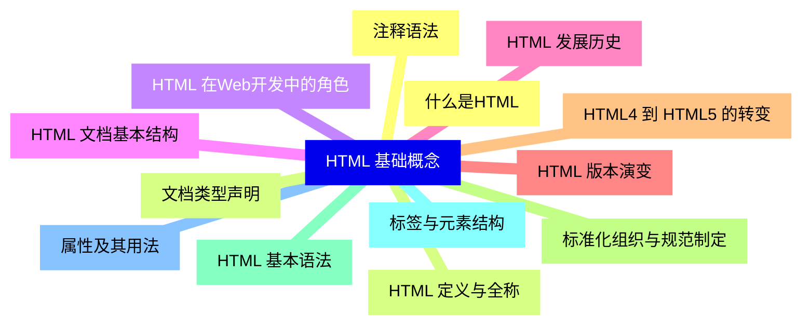

<--->
{}
{}
{}
{}
{}
{}
{}
{}
{}
{}
{}
{}
{}
{}
{}
{}
{}
{}
{}
{}
{}
{}
{}
{}
{}
{}
{}

### 2 HTML 文档结构{#2}

{}
{}
{}
{}
{}
{}
{}
{}
{}
{}
{}
{}
{}
{}
{}
{}
{}
{}
{}
{}
{}
<--->
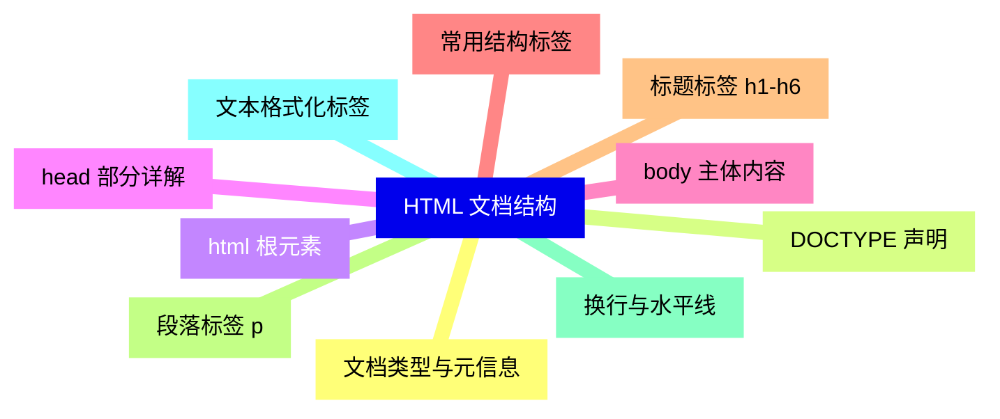

{}

### 3 HTML 元素分类{#3}

{}
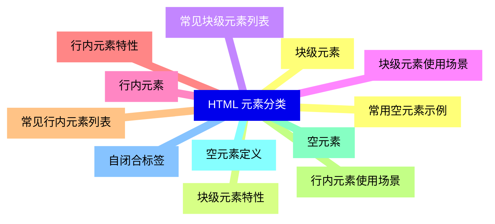

<--->
{}
{}
{}
{}
{}
{}
{}
{}
{}
{}
{}
{}
{}
{}
{}
{}
{}
{}
{}
{}
{}
{}
{}
{}
{}

### 4 HTML 属性详解{#4}

{}
{}
{}
{}
{}
{}
{}
{}
{}
{}
{}
{}
{}
{}
{}
{}
{}
{}
{}
<--->
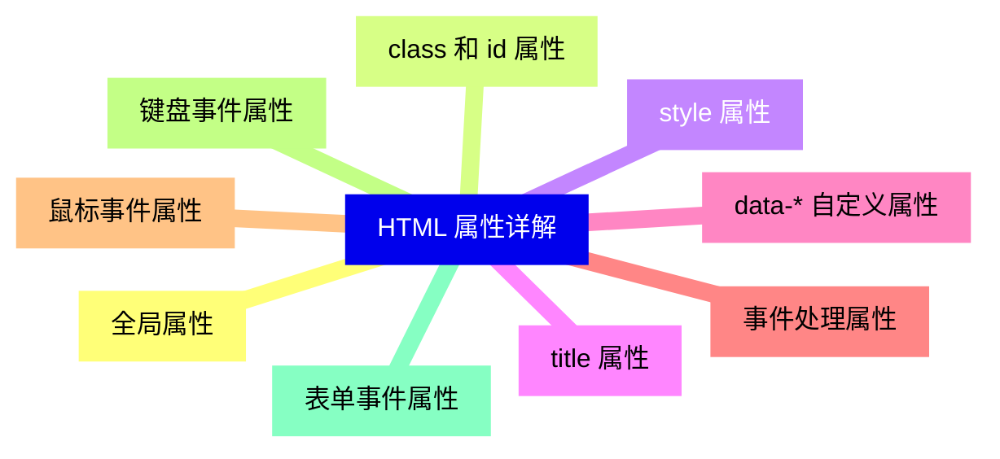

{}

### 5 HTML 语义化{#5}

{}
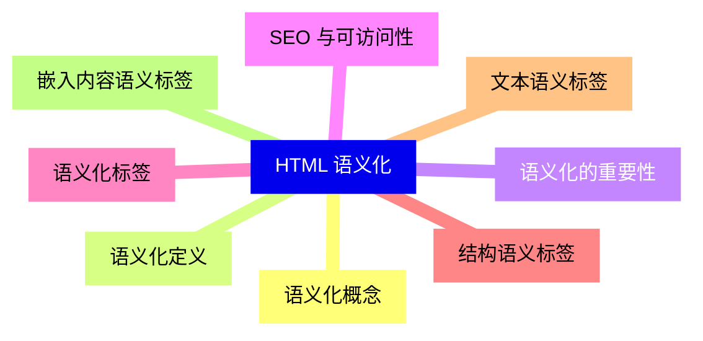

<--->
{}
{}
{}
{}
{}
{}
{}
{}
{}
{}
{}
{}
{}
{}
{}
{}
{}

### 6 HTML5 新特性{#6}

{}
{}
{}
{}
{}
{}
{}
{}
{}
{}
{}
{}
{}
{}
{}
{}
{}
{}
{}
{}
{}
{}
{}
{}
{}
<--->
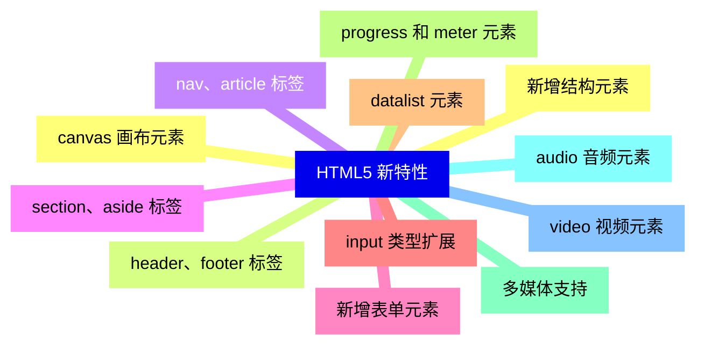

{}

### 7 HTML 表单{#7}

{}
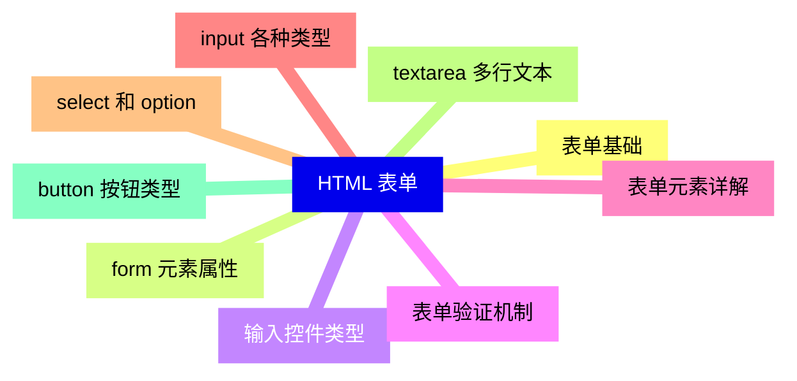

<--->
{}
{}
{}
{}
{}
{}
{}
{}
{}
{}
{}
{}
{}
{}
{}
{}
{}
{}
{}

### 8 HTML 链接与媒体{#8}

{}
{}
{}
{}
{}
{}
{}
{}
{}
{}
{}
{}
{}
{}
{}
{}
{}
<--->
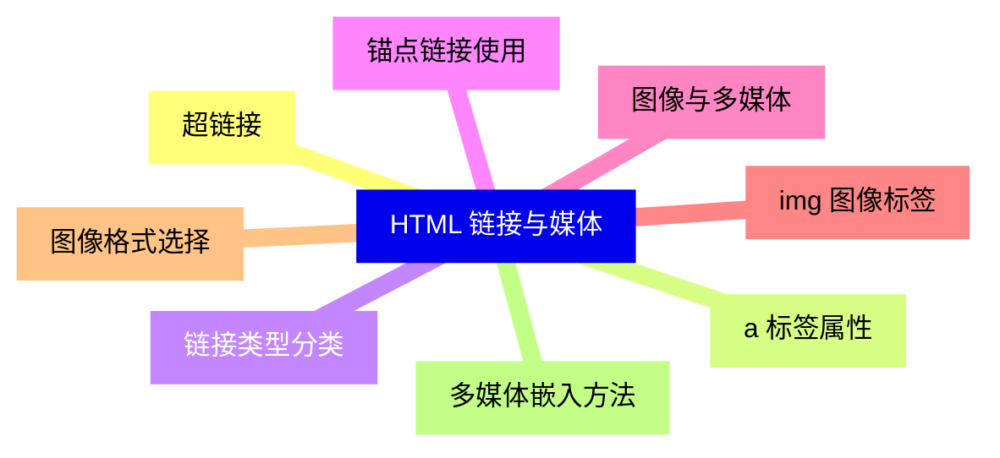

{}

### 9 HTML 表格{#9}

{}
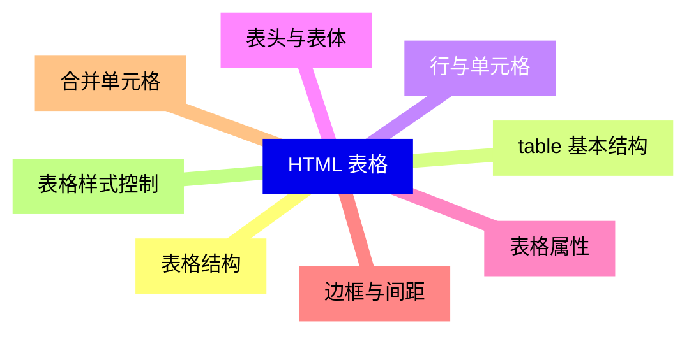

<--->
{}
{}
{}
{}
{}
{}
{}
{}
{}
{}
{}
{}
{}
{}
{}
{}
{}

### 10 HTML 列表{#10}

{}
{}
{}
{}
{}
{}
{}
{}
{}
{}
{}
{}
{}
{}
{}
{}
{}
<--->
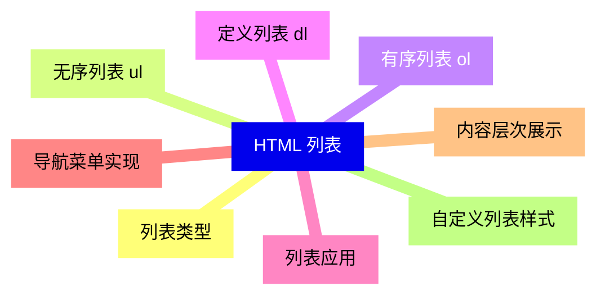

{}

### 11 HTML 其他重要概念{#11}

{}
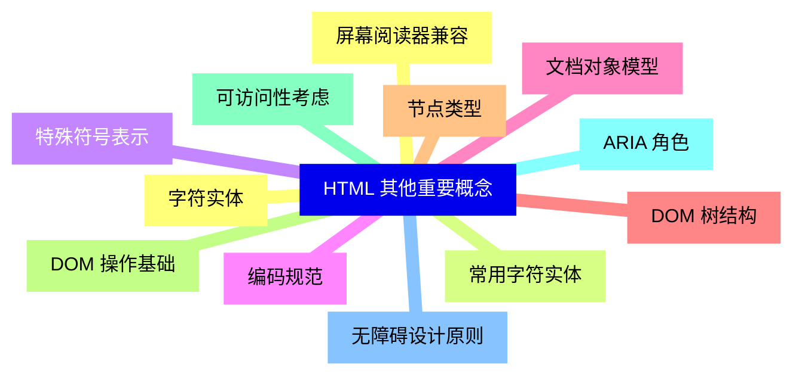

<--->
{}
{}
{}
{}
{}
{}
{}
{}
{}
{}
{}
{}
{}
{}
{}
{}
{}
{}
{}
{}
{}
{}
{}
{}
{}
