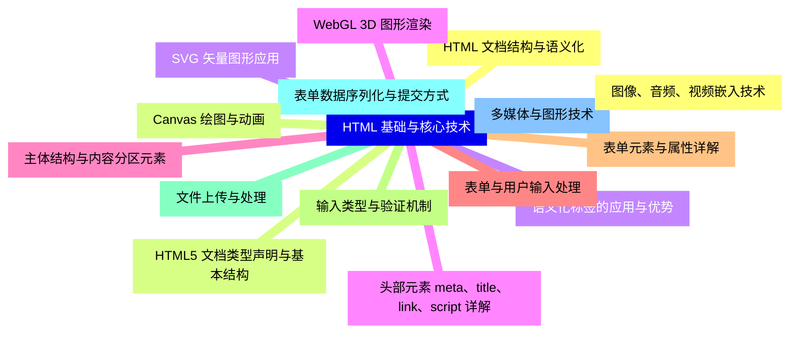
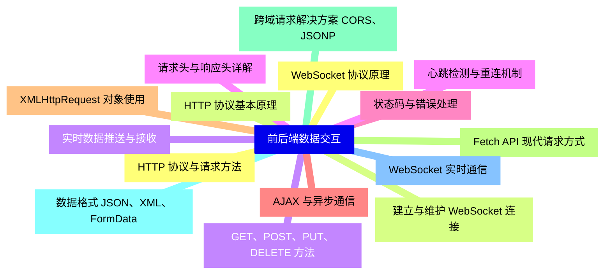
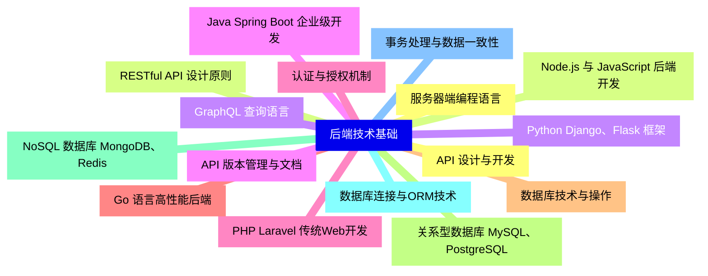
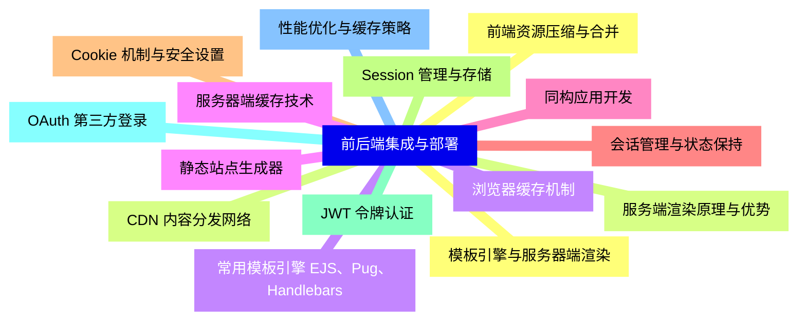
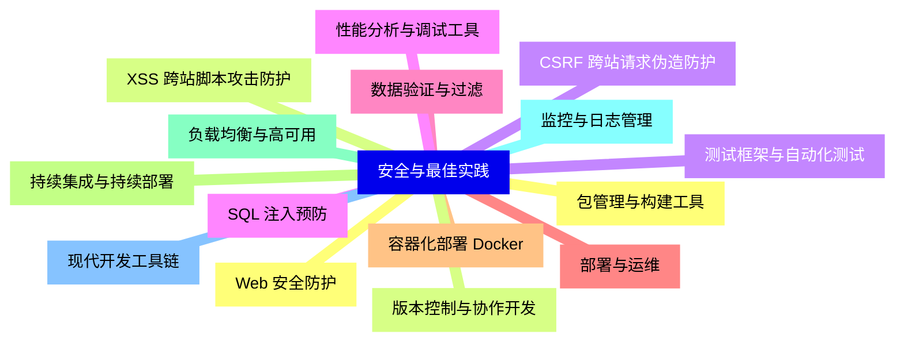


### 1 [HTML 基础与核心技术](#1)
#### 1.1 [HTML 文档结构与语义化](#1)
#### 1.2 [HTML5 文档类型声明与基本结构](#1)
#### 1.3 [语义化标签的应用与优势](#1)
#### 1.4 [头部元素 meta、title、link、script 详解](#1)
#### 1.5 [主体结构与内容分区元素](#1)
#### 1.6 [表单与用户输入处理](#1)
#### 1.7 [表单元素与属性详解](#1)
#### 1.8 [输入类型与验证机制](#1)
#### 1.9 [文件上传与处理](#1)
#### 1.10 [表单数据序列化与提交方式](#1)
#### 1.11 [多媒体与图形技术](#1)
#### 1.12 [图像、音频、视频嵌入技术](#1)
#### 1.13 [Canvas 绘图与动画](#1)
#### 1.14 [SVG 矢量图形应用](#1)
#### 1.15 [WebGL 3D 图形渲染](#1)
### 2 [前后端数据交互](#2)
#### 2.1 [HTTP 协议与请求方法](#2)
#### 2.2 [HTTP 协议基本原理](#2)
#### 2.3 [GET、POST、PUT、DELETE 方法](#2)
#### 2.4 [请求头与响应头详解](#2)
#### 2.5 [状态码与错误处理](#2)
#### 2.6 [AJAX 与异步通信](#2)
#### 2.7 [XMLHttpRequest 对象使用](#2)
#### 2.8 [Fetch API 现代请求方式](#2)
#### 2.9 [跨域请求解决方案 CORS、JSONP](#2)
#### 2.10 [数据格式 JSON、XML、FormData](#2)
#### 2.11 [WebSocket 实时通信](#2)
#### 2.12 [WebSocket 协议原理](#2)
#### 2.13 [建立与维护 WebSocket 连接](#2)
#### 2.14 [实时数据推送与接收](#2)
#### 2.15 [心跳检测与重连机制](#2)
### 3 [后端技术基础](#3)
#### 3.1 [服务器端编程语言](#3)
#### 3.2 [Node.js 与 JavaScript 后端开发](#3)
#### 3.3 [Python Django、Flask 框架](#3)
#### 3.4 [Java Spring Boot 企业级开发](#3)
#### 3.5 [PHP Laravel 传统Web开发](#3)
#### 3.6 [Go 语言高性能后端](#3)
#### 3.7 [数据库技术与操作](#3)
#### 3.8 [关系型数据库 MySQL、PostgreSQL](#3)
#### 3.9 [NoSQL 数据库 MongoDB、Redis](#3)
#### 3.10 [数据库连接与ORM技术](#3)
#### 3.11 [事务处理与数据一致性](#3)
#### 3.12 [API 设计与开发](#3)
#### 3.13 [RESTful API 设计原则](#3)
#### 3.14 [GraphQL 查询语言](#3)
#### 3.15 [API 版本管理与文档](#3)
#### 3.16 [认证与授权机制](#3)
### 4 [前后端集成与部署](#4)
#### 4.1 [模板引擎与服务器端渲染](#4)
#### 4.2 [服务端渲染原理与优势](#4)
#### 4.3 [常用模板引擎 EJS、Pug、Handlebars](#4)
#### 4.4 [静态站点生成器](#4)
#### 4.5 [同构应用开发](#4)
#### 4.6 [会话管理与状态保持](#4)
#### 4.7 [Cookie 机制与安全设置](#4)
#### 4.8 [Session 管理与存储](#4)
#### 4.9 [JWT 令牌认证](#4)
#### 4.10 [OAuth 第三方登录](#4)
#### 4.11 [性能优化与缓存策略](#4)
#### 4.12 [前端资源压缩与合并](#4)
#### 4.13 [CDN 内容分发网络](#4)
#### 4.14 [浏览器缓存机制](#4)
#### 4.15 [服务器端缓存技术](#4)
### 5 [安全与最佳实践](#5)
#### 5.1 [Web 安全防护](#5)
#### 5.2 [XSS 跨站脚本攻击防护](#5)
#### 5.3 [CSRF 跨站请求伪造防护](#5)
#### 5.4 [SQL 注入预防](#5)
#### 5.5 [数据验证与过滤](#5)
#### 5.6 [部署与运维](#5)
#### 5.7 [容器化部署 Docker](#5)
#### 5.8 [持续集成与持续部署](#5)
#### 5.9 [负载均衡与高可用](#5)
#### 5.10 [监控与日志管理](#5)
#### 5.11 [现代开发工具链](#5)
#### 5.12 [包管理与构建工具](#5)
#### 5.13 [版本控制与协作开发](#5)
#### 5.14 [测试框架与自动化测试](#5)
#### 5.15 [性能分析与调试工具](#5)




### 1 HTML 基础与核心技术

---
### 1 HTML 基础与核心技术
___
#### 1.1 HTML 文档结构与语义化
___
#### 1.2 HTML5 文档类型声明与基本结构
___
#### 1.3 语义化标签的应用与优势
___
#### 1.4 头部元素 meta、title、link、script 详解
___
#### 1.5 主体结构与内容分区元素
___
#### 1.6 表单与用户输入处理
___
#### 1.7 表单元素与属性详解
___
#### 1.8 输入类型与验证机制
___
#### 1.9 文件上传与处理
___
#### 1.10 表单数据序列化与提交方式
___
#### 1.11 多媒体与图形技术
___
#### 1.12 图像、音频、视频嵌入技术
___
#### 1.13 Canvas 绘图与动画
___
#### 1.14 SVG 矢量图形应用
___
#### 1.15 WebGL 3D 图形渲染
### 2 前后端数据交互

---
### 2 前后端数据交互
___
#### 2.1 HTTP 协议与请求方法
___
#### 2.2 HTTP 协议基本原理
___
#### 2.3 GET、POST、PUT、DELETE 方法
___
#### 2.4 请求头与响应头详解
___
#### 2.5 状态码与错误处理
___
#### 2.6 AJAX 与异步通信
___
#### 2.7 XMLHttpRequest 对象使用
___
#### 2.8 Fetch API 现代请求方式
___
#### 2.9 跨域请求解决方案 CORS、JSONP
___
#### 2.10 数据格式 JSON、XML、FormData
___
#### 2.11 WebSocket 实时通信
___
#### 2.12 WebSocket 协议原理
___
#### 2.13 建立与维护 WebSocket 连接
___
#### 2.14 实时数据推送与接收
___
#### 2.15 心跳检测与重连机制
### 3 后端技术基础

---
### 3 后端技术基础
___
#### 3.1 服务器端编程语言
___
#### 3.2 Node.js 与 JavaScript 后端开发
___
#### 3.3 Python Django、Flask 框架
___
#### 3.4 Java Spring Boot 企业级开发
___
#### 3.5 PHP Laravel 传统Web开发
___
#### 3.6 Go 语言高性能后端
___
#### 3.7 数据库技术与操作
___
#### 3.8 关系型数据库 MySQL、PostgreSQL
___
#### 3.9 NoSQL 数据库 MongoDB、Redis
___
#### 3.10 数据库连接与ORM技术
___
#### 3.11 事务处理与数据一致性
___
#### 3.12 API 设计与开发
___
#### 3.13 RESTful API 设计原则
___
#### 3.14 GraphQL 查询语言
___
#### 3.15 API 版本管理与文档
___
#### 3.16 认证与授权机制
### 4 前后端集成与部署

---
### 4 前后端集成与部署
___
#### 4.1 模板引擎与服务器端渲染
___
#### 4.2 服务端渲染原理与优势
___
#### 4.3 常用模板引擎 EJS、Pug、Handlebars
___
#### 4.4 静态站点生成器
___
#### 4.5 同构应用开发
___
#### 4.6 会话管理与状态保持
___
#### 4.7 Cookie 机制与安全设置
___
#### 4.8 Session 管理与存储
___
#### 4.9 JWT 令牌认证
___
#### 4.10 OAuth 第三方登录
___
#### 4.11 性能优化与缓存策略
___
#### 4.12 前端资源压缩与合并
___
#### 4.13 CDN 内容分发网络
___
#### 4.14 浏览器缓存机制
___
#### 4.15 服务器端缓存技术
### 5 安全与最佳实践

---
### 5 安全与最佳实践
___
#### 5.1 Web 安全防护
___
#### 5.2 XSS 跨站脚本攻击防护
___
#### 5.3 CSRF 跨站请求伪造防护
___
#### 5.4 SQL 注入预防
___
#### 5.5 数据验证与过滤
___
#### 5.6 部署与运维
___
#### 5.7 容器化部署 Docker
___
#### 5.8 持续集成与持续部署
___
#### 5.9 负载均衡与高可用
___
#### 5.10 监控与日志管理
___
#### 5.11 现代开发工具链
___
#### 5.12 包管理与构建工具
___
#### 5.13 版本控制与协作开发
___
#### 5.14 测试框架与自动化测试
___
#### 5.15 性能分析与调试工具


### 1 HTML 基础与核心技术{#1}

{}

<--->
{}
{}
{}
{}
{}
{}
{}
{}
{}
{}
{}
{}
{}
{}
{}
{}
{}
{}
{}
{}
{}
{}
{}
{}
{}
{}
{}
{}
{}
{}
{}

### 2 前后端数据交互{#2}

{}
{}
{}
{}
{}
{}
{}
{}
{}
{}
{}
{}
{}
{}
{}
{}
{}
{}
{}
{}
{}
{}
{}
{}
{}
{}
{}
{}
{}
{}
{}
<--->

{}

### 3 后端技术基础{#3}

{}

<--->
{}
{}
{}
{}
{}
{}
{}
{}
{}
{}
{}
{}
{}
{}
{}
{}
{}
{}
{}
{}
{}
{}
{}
{}
{}
{}
{}
{}
{}
{}
{}
{}
{}

### 4 前后端集成与部署{#4}

{}
{}
{}
{}
{}
{}
{}
{}
{}
{}
{}
{}
{}
{}
{}
{}
{}
{}
{}
{}
{}
{}
{}
{}
{}
{}
{}
{}
{}
{}
{}
<--->

{}

### 5 安全与最佳实践{#5}

{}

<--->
{}
{}
{}
{}
{}
{}
{}
{}
{}
{}
{}
{}
{}
{}
{}
{}
{}
{}
{}
{}
{}
{}
{}
{}
{}
{}
{}
{}
{}
{}
{}
