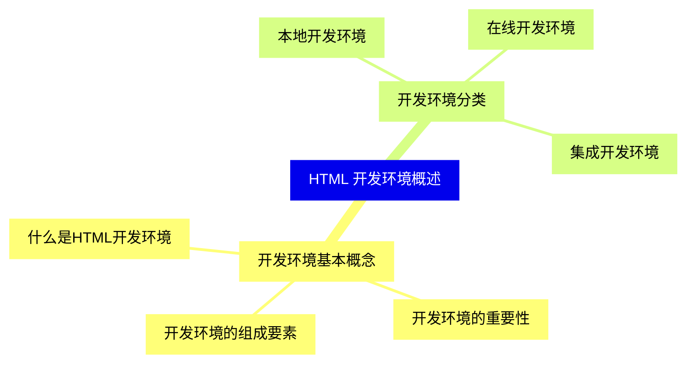
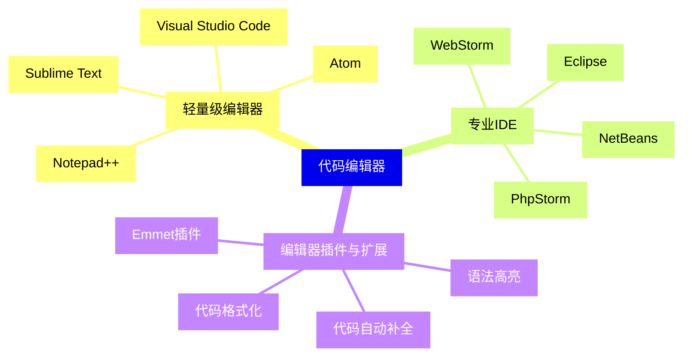
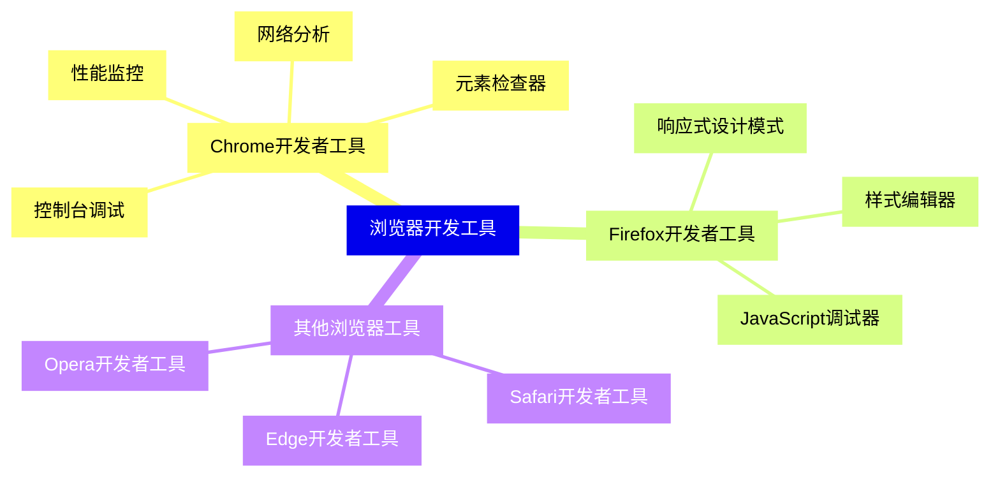
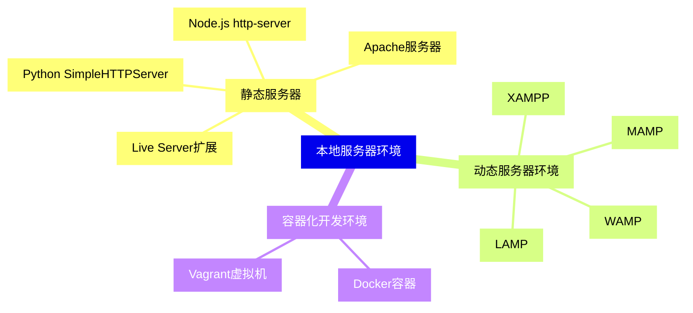
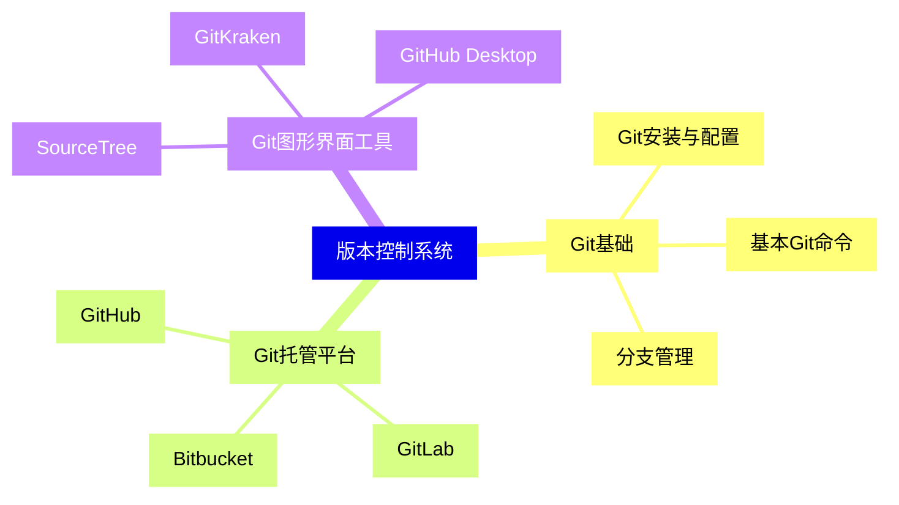
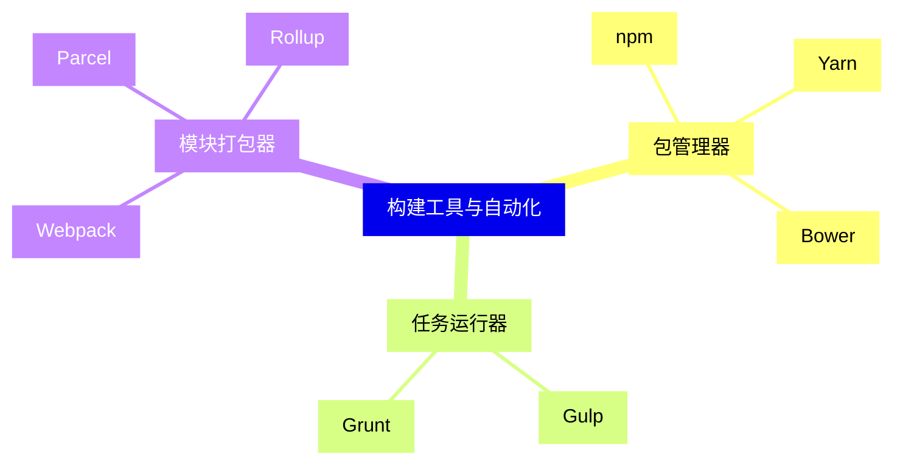
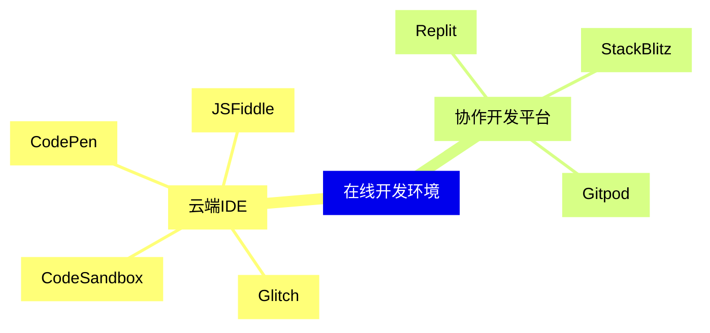
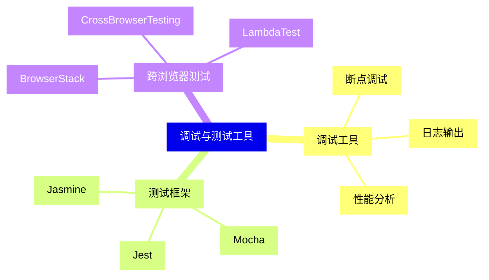
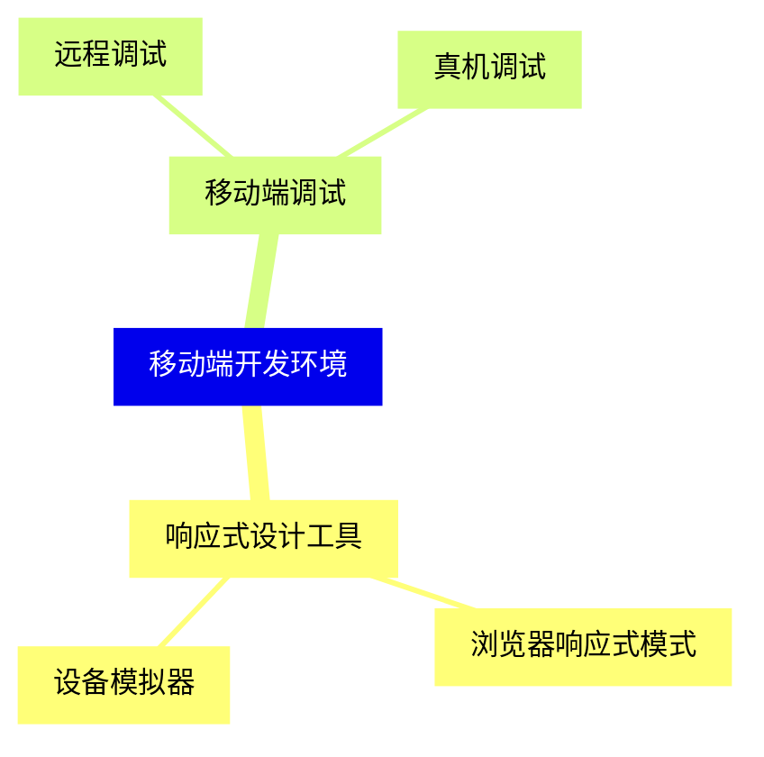
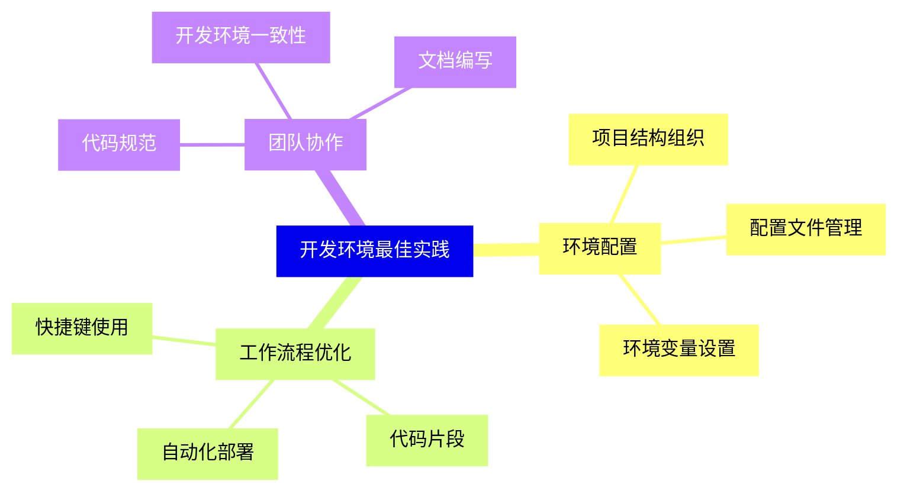


### 1 [HTML 开发环境概述](#1)
#### 1.1 [开发环境基本概念](#1)
##### 1.1.1 [什么是HTML开发环境](#1)
##### 1.1.2 [开发环境的重要性](#1)
##### 1.1.3 [开发环境的组成要素](#1)
#### 1.2 [开发环境分类](#1)
##### 1.2.1 [本地开发环境](#1)
##### 1.2.2 [在线开发环境](#1)
##### 1.2.3 [集成开发环境](#1)
### 2 [代码编辑器](#2)
#### 2.1 [轻量级编辑器](#2)
##### 2.1.1 [Visual Studio Code](#2)
##### 2.1.2 [Sublime Text](#2)
##### 2.1.3 [Atom](#2)
##### 2.1.4 [Notepad++](#2)
#### 2.2 [专业IDE](#2)
##### 2.2.1 [WebStorm](#2)
##### 2.2.2 [PhpStorm](#2)
##### 2.2.3 [Eclipse](#2)
##### 2.2.4 [NetBeans](#2)
#### 2.3 [编辑器插件与扩展](#2)
##### 2.3.1 [Emmet插件](#2)
##### 2.3.2 [语法高亮](#2)
##### 2.3.3 [代码自动补全](#2)
##### 2.3.4 [代码格式化](#2)
### 3 [浏览器开发工具](#3)
#### 3.1 [Chrome开发者工具](#3)
##### 3.1.1 [元素检查器](#3)
##### 3.1.2 [控制台调试](#3)
##### 3.1.3 [网络分析](#3)
##### 3.1.4 [性能监控](#3)
#### 3.2 [Firefox开发者工具](#3)
##### 3.2.1 [响应式设计模式](#3)
##### 3.2.2 [样式编辑器](#3)
##### 3.2.3 [JavaScript调试器](#3)
#### 3.3 [其他浏览器工具](#3)
##### 3.3.1 [Safari开发者工具](#3)
##### 3.3.2 [Edge开发者工具](#3)
##### 3.3.3 [Opera开发者工具](#3)
### 4 [本地服务器环境](#4)
#### 4.1 [静态服务器](#4)
##### 4.1.1 [Live Server扩展](#4)
##### 4.1.2 [Python SimpleHTTPServer](#4)
##### 4.1.3 [Node.js http-server](#4)
##### 4.1.4 [Apache服务器](#4)
#### 4.2 [动态服务器环境](#4)
##### 4.2.1 [XAMPP](#4)
##### 4.2.2 [WAMP](#4)
##### 4.2.3 [MAMP](#4)
##### 4.2.4 [LAMP](#4)
#### 4.3 [容器化开发环境](#4)
##### 4.3.1 [Docker容器](#4)
##### 4.3.2 [Vagrant虚拟机](#4)
### 5 [版本控制系统](#5)
#### 5.1 [Git基础](#5)
##### 5.1.1 [Git安装与配置](#5)
##### 5.1.2 [基本Git命令](#5)
##### 5.1.3 [分支管理](#5)
#### 5.2 [Git托管平台](#5)
##### 5.2.1 [GitHub](#5)
##### 5.2.2 [GitLab](#5)
##### 5.2.3 [Bitbucket](#5)
#### 5.3 [Git图形界面工具](#5)
##### 5.3.1 [SourceTree](#5)
##### 5.3.2 [GitKraken](#5)
##### 5.3.3 [GitHub Desktop](#5)
### 6 [构建工具与自动化](#6)
#### 6.1 [包管理器](#6)
##### 6.1.1 [npm](#6)
##### 6.1.2 [Yarn](#6)
##### 6.1.3 [Bower](#6)
#### 6.2 [任务运行器](#6)
##### 6.2.1 [Gulp](#6)
##### 6.2.2 [Grunt](#6)
#### 6.3 [模块打包器](#6)
##### 6.3.1 [Webpack](#6)
##### 6.3.2 [Parcel](#6)
##### 6.3.3 [Rollup](#6)
### 7 [在线开发环境](#7)
#### 7.1 [云端IDE](#7)
##### 7.1.1 [CodePen](#7)
##### 7.1.2 [JSFiddle](#7)
##### 7.1.3 [CodeSandbox](#7)
##### 7.1.4 [Glitch](#7)
#### 7.2 [协作开发平台](#7)
##### 7.2.1 [Replit](#7)
##### 7.2.2 [StackBlitz](#7)
##### 7.2.3 [Gitpod](#7)
### 8 [调试与测试工具](#8)
#### 8.1 [调试工具](#8)
##### 8.1.1 [断点调试](#8)
##### 8.1.2 [日志输出](#8)
##### 8.1.3 [性能分析](#8)
#### 8.2 [测试框架](#8)
##### 8.2.1 [Jest](#8)
##### 8.2.2 [Mocha](#8)
##### 8.2.3 [Jasmine](#8)
#### 8.3 [跨浏览器测试](#8)
##### 8.3.1 [BrowserStack](#8)
##### 8.3.2 [CrossBrowserTesting](#8)
##### 8.3.3 [LambdaTest](#8)
### 9 [移动端开发环境](#9)
#### 9.1 [响应式设计工具](#9)
##### 9.1.1 [浏览器响应式模式](#9)
##### 9.1.2 [设备模拟器](#9)
#### 9.2 [移动端调试](#9)
##### 9.2.1 [远程调试](#9)
##### 9.2.2 [真机调试](#9)
### 10 [开发环境最佳实践](#10)
#### 10.1 [环境配置](#10)
##### 10.1.1 [项目结构组织](#10)
##### 10.1.2 [配置文件管理](#10)
##### 10.1.3 [环境变量设置](#10)
#### 10.2 [工作流程优化](#10)
##### 10.2.1 [快捷键使用](#10)
##### 10.2.2 [代码片段](#10)
##### 10.2.3 [自动化部署](#10)
#### 10.3 [团队协作](#10)
##### 10.3.1 [代码规范](#10)
##### 10.3.2 [开发环境一致性](#10)
##### 10.3.3 [文档编写](#10)




### 1 HTML 开发环境概述

---
### 1 HTML 开发环境概述
___
#### 1.1 开发环境基本概念
___
##### 1.1.1 什么是HTML开发环境
___
##### 1.1.2 开发环境的重要性
___
##### 1.1.3 开发环境的组成要素
___
#### 1.2 开发环境分类
___
##### 1.2.1 本地开发环境
___
##### 1.2.2 在线开发环境
___
##### 1.2.3 集成开发环境
### 2 代码编辑器

---
### 2 代码编辑器
___
#### 2.1 轻量级编辑器
___
##### 2.1.1 Visual Studio Code
___
##### 2.1.2 Sublime Text
___
##### 2.1.3 Atom
___
##### 2.1.4 Notepad++
___
#### 2.2 专业IDE
___
##### 2.2.1 WebStorm
___
##### 2.2.2 PhpStorm
___
##### 2.2.3 Eclipse
___
##### 2.2.4 NetBeans
___
#### 2.3 编辑器插件与扩展
___
##### 2.3.1 Emmet插件
___
##### 2.3.2 语法高亮
___
##### 2.3.3 代码自动补全
___
##### 2.3.4 代码格式化
### 3 浏览器开发工具

---
### 3 浏览器开发工具
___
#### 3.1 Chrome开发者工具
___
##### 3.1.1 元素检查器
___
##### 3.1.2 控制台调试
___
##### 3.1.3 网络分析
___
##### 3.1.4 性能监控
___
#### 3.2 Firefox开发者工具
___
##### 3.2.1 响应式设计模式
___
##### 3.2.2 样式编辑器
___
##### 3.2.3 JavaScript调试器
___
#### 3.3 其他浏览器工具
___
##### 3.3.1 Safari开发者工具
___
##### 3.3.2 Edge开发者工具
___
##### 3.3.3 Opera开发者工具
### 4 本地服务器环境

---
### 4 本地服务器环境
___
#### 4.1 静态服务器
___
##### 4.1.1 Live Server扩展
___
##### 4.1.2 Python SimpleHTTPServer
___
##### 4.1.3 Node.js http-server
___
##### 4.1.4 Apache服务器
___
#### 4.2 动态服务器环境
___
##### 4.2.1 XAMPP
___
##### 4.2.2 WAMP
___
##### 4.2.3 MAMP
___
##### 4.2.4 LAMP
___
#### 4.3 容器化开发环境
___
##### 4.3.1 Docker容器
___
##### 4.3.2 Vagrant虚拟机
### 5 版本控制系统

---
### 5 版本控制系统
___
#### 5.1 Git基础
___
##### 5.1.1 Git安装与配置
___
##### 5.1.2 基本Git命令
___
##### 5.1.3 分支管理
___
#### 5.2 Git托管平台
___
##### 5.2.1 GitHub
___
##### 5.2.2 GitLab
___
##### 5.2.3 Bitbucket
___
#### 5.3 Git图形界面工具
___
##### 5.3.1 SourceTree
___
##### 5.3.2 GitKraken
___
##### 5.3.3 GitHub Desktop
### 6 构建工具与自动化

---
### 6 构建工具与自动化
___
#### 6.1 包管理器
___
##### 6.1.1 npm
___
##### 6.1.2 Yarn
___
##### 6.1.3 Bower
___
#### 6.2 任务运行器
___
##### 6.2.1 Gulp
___
##### 6.2.2 Grunt
___
#### 6.3 模块打包器
___
##### 6.3.1 Webpack
___
##### 6.3.2 Parcel
___
##### 6.3.3 Rollup
### 7 在线开发环境

---
### 7 在线开发环境
___
#### 7.1 云端IDE
___
##### 7.1.1 CodePen
___
##### 7.1.2 JSFiddle
___
##### 7.1.3 CodeSandbox
___
##### 7.1.4 Glitch
___
#### 7.2 协作开发平台
___
##### 7.2.1 Replit
___
##### 7.2.2 StackBlitz
___
##### 7.2.3 Gitpod
### 8 调试与测试工具

---
### 8 调试与测试工具
___
#### 8.1 调试工具
___
##### 8.1.1 断点调试
___
##### 8.1.2 日志输出
___
##### 8.1.3 性能分析
___
#### 8.2 测试框架
___
##### 8.2.1 Jest
___
##### 8.2.2 Mocha
___
##### 8.2.3 Jasmine
___
#### 8.3 跨浏览器测试
___
##### 8.3.1 BrowserStack
___
##### 8.3.2 CrossBrowserTesting
___
##### 8.3.3 LambdaTest
### 9 移动端开发环境

---
### 9 移动端开发环境
___
#### 9.1 响应式设计工具
___
##### 9.1.1 浏览器响应式模式
___
##### 9.1.2 设备模拟器
___
#### 9.2 移动端调试
___
##### 9.2.1 远程调试
___
##### 9.2.2 真机调试
### 10 开发环境最佳实践

---
### 10 开发环境最佳实践
___
#### 10.1 环境配置
___
##### 10.1.1 项目结构组织
___
##### 10.1.2 配置文件管理
___
##### 10.1.3 环境变量设置
___
#### 10.2 工作流程优化
___
##### 10.2.1 快捷键使用
___
##### 10.2.2 代码片段
___
##### 10.2.3 自动化部署
___
#### 10.3 团队协作
___
##### 10.3.1 代码规范
___
##### 10.3.2 开发环境一致性
___
##### 10.3.3 文档编写


### 1 HTML 开发环境概述{#1}

{}

<--->
{}
{}
{}
{}
{}
{}
{}
{}
{}
{}
{}
{}
{}
{}
{}
{}
{}

### 2 代码编辑器{#2}

{}
{}
{}
{}
{}
{}
{}
{}
{}
{}
{}
{}
{}
{}
{}
{}
{}
{}
{}
{}
{}
{}
{}
{}
{}
{}
{}
{}
{}
{}
{}
<--->

{}

### 3 浏览器开发工具{#3}

{}

<--->
{}
{}
{}
{}
{}
{}
{}
{}
{}
{}
{}
{}
{}
{}
{}
{}
{}
{}
{}
{}
{}
{}
{}
{}
{}
{}
{}

### 4 本地服务器环境{#4}

{}
{}
{}
{}
{}
{}
{}
{}
{}
{}
{}
{}
{}
{}
{}
{}
{}
{}
{}
{}
{}
{}
{}
{}
{}
{}
{}
<--->

{}

### 5 版本控制系统{#5}

{}

<--->
{}
{}
{}
{}
{}
{}
{}
{}
{}
{}
{}
{}
{}
{}
{}
{}
{}
{}
{}
{}
{}
{}
{}
{}
{}

### 6 构建工具与自动化{#6}

{}
{}
{}
{}
{}
{}
{}
{}
{}
{}
{}
{}
{}
{}
{}
{}
{}
{}
{}
{}
{}
{}
{}
<--->

{}

### 7 在线开发环境{#7}

{}

<--->
{}
{}
{}
{}
{}
{}
{}
{}
{}
{}
{}
{}
{}
{}
{}
{}
{}
{}
{}

### 8 调试与测试工具{#8}

{}
{}
{}
{}
{}
{}
{}
{}
{}
{}
{}
{}
{}
{}
{}
{}
{}
{}
{}
{}
{}
{}
{}
{}
{}
<--->

{}

### 9 移动端开发环境{#9}

{}

<--->
{}
{}
{}
{}
{}
{}
{}
{}
{}
{}
{}
{}
{}

### 10 开发环境最佳实践{#10}

{}
{}
{}
{}
{}
{}
{}
{}
{}
{}
{}
{}
{}
{}
{}
{}
{}
{}
{}
{}
{}
{}
{}
{}
{}
<--->

{}
