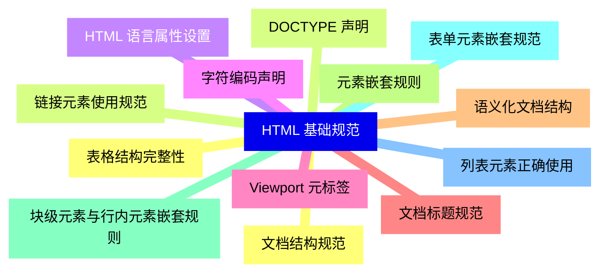
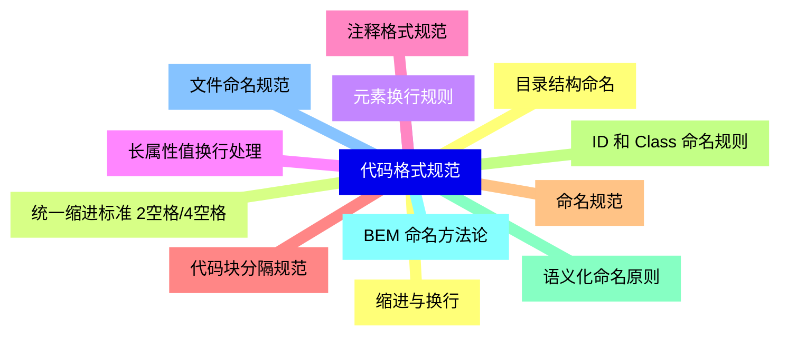
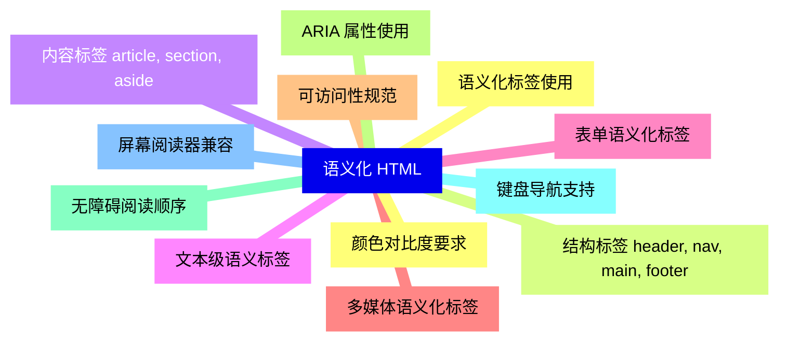
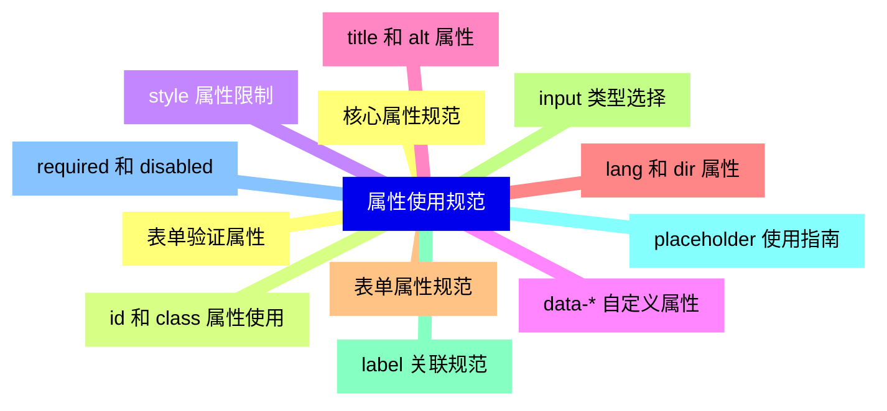
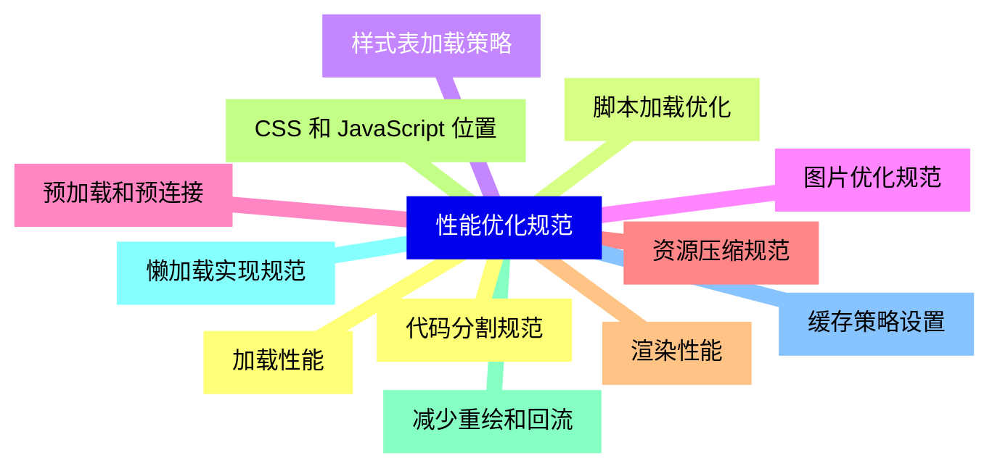
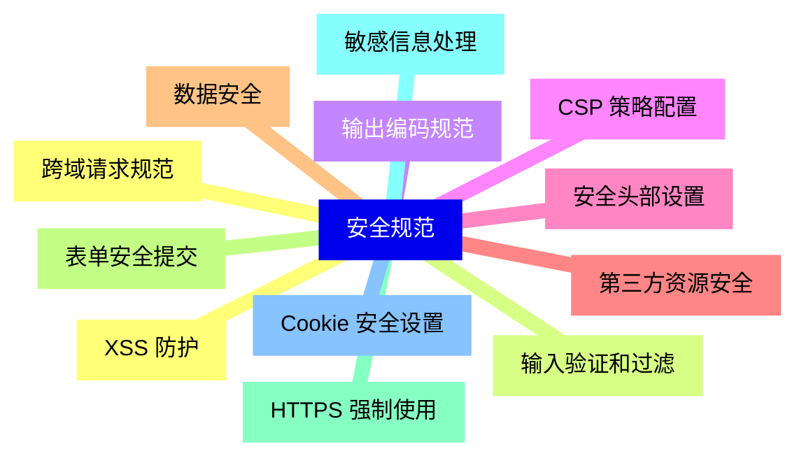
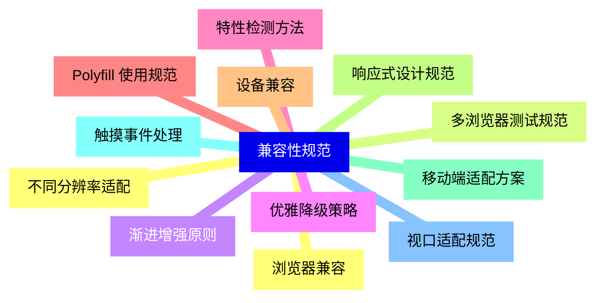
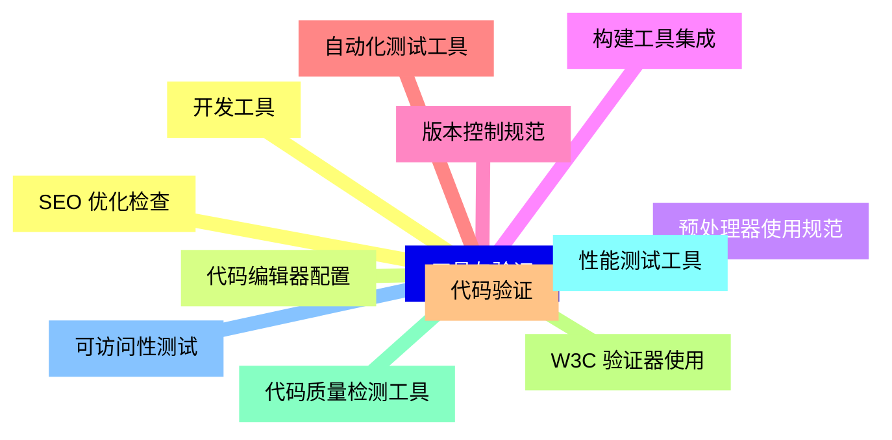
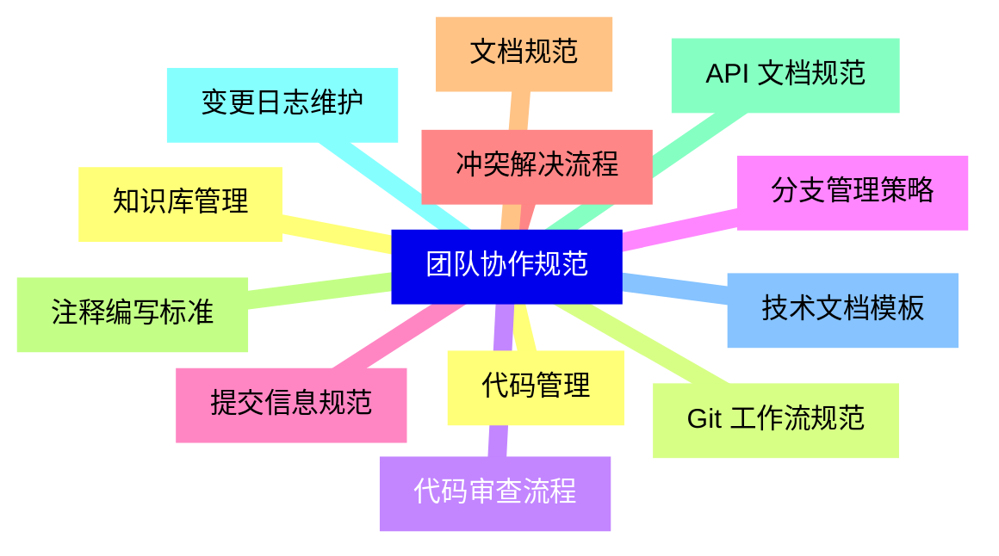


### 1 [HTML 基础规范](#1)
#### 1.1 [文档结构规范](#1)
#### 1.2 [DOCTYPE 声明](#1)
#### 1.3 [HTML 语言属性设置](#1)
#### 1.4 [字符编码声明](#1)
#### 1.5 [Viewport 元标签](#1)
#### 1.6 [文档标题规范](#1)
#### 1.7 [语义化文档结构](#1)
#### 1.8 [元素嵌套规则](#1)
#### 1.9 [块级元素与行内元素嵌套规则](#1)
#### 1.10 [表单元素嵌套规范](#1)
#### 1.11 [列表元素正确使用](#1)
#### 1.12 [表格结构完整性](#1)
#### 1.13 [链接元素使用规范](#1)
### 2 [代码格式规范](#2)
#### 2.1 [缩进与换行](#2)
#### 2.2 [统一缩进标准 2空格/4空格](#2)
#### 2.3 [元素换行规则](#2)
#### 2.4 [长属性值换行处理](#2)
#### 2.5 [注释格式规范](#2)
#### 2.6 [代码块分隔规范](#2)
#### 2.7 [命名规范](#2)
#### 2.8 [ID 和 Class 命名规则](#2)
#### 2.9 [语义化命名原则](#2)
#### 2.10 [BEM 命名方法论](#2)
#### 2.11 [文件命名规范](#2)
#### 2.12 [目录结构命名](#2)
### 3 [语义化 HTML](#3)
#### 3.1 [语义化标签使用](#3)
#### 3.2 [结构标签 header, nav, main, footer](#3)
#### 3.3 [内容标签 article, section, aside](#3)
#### 3.4 [文本级语义标签](#3)
#### 3.5 [表单语义化标签](#3)
#### 3.6 [多媒体语义化标签](#3)
#### 3.7 [可访问性规范](#3)
#### 3.8 [ARIA 属性使用](#3)
#### 3.9 [无障碍阅读顺序](#3)
#### 3.10 [键盘导航支持](#3)
#### 3.11 [屏幕阅读器兼容](#3)
#### 3.12 [颜色对比度要求](#3)
### 4 [属性使用规范](#4)
#### 4.1 [核心属性规范](#4)
#### 4.2 [id 和 class 属性使用](#4)
#### 4.3 [style 属性限制](#4)
#### 4.4 [data-* 自定义属性](#4)
#### 4.5 [title 和 alt 属性](#4)
#### 4.6 [lang 和 dir 属性](#4)
#### 4.7 [表单属性规范](#4)
#### 4.8 [input 类型选择](#4)
#### 4.9 [label 关联规范](#4)
#### 4.10 [placeholder 使用指南](#4)
#### 4.11 [required 和 disabled](#4)
#### 4.12 [表单验证属性](#4)
### 5 [性能优化规范](#5)
#### 5.1 [加载性能](#5)
#### 5.2 [脚本加载优化](#5)
#### 5.3 [样式表加载策略](#5)
#### 5.4 [图片优化规范](#5)
#### 5.5 [预加载和预连接](#5)
#### 5.6 [资源压缩规范](#5)
#### 5.7 [渲染性能](#5)
#### 5.8 [CSS 和 JavaScript 位置](#5)
#### 5.9 [减少重绘和回流](#5)
#### 5.10 [懒加载实现规范](#5)
#### 5.11 [缓存策略设置](#5)
#### 5.12 [代码分割规范](#5)
### 6 [安全规范](#6)
#### 6.1 [XSS 防护](#6)
#### 6.2 [输入验证和过滤](#6)
#### 6.3 [输出编码规范](#6)
#### 6.4 [CSP 策略配置](#6)
#### 6.5 [安全头部设置](#6)
#### 6.6 [第三方资源安全](#6)
#### 6.7 [数据安全](#6)
#### 6.8 [表单安全提交](#6)
#### 6.9 [HTTPS 强制使用](#6)
#### 6.10 [敏感信息处理](#6)
#### 6.11 [Cookie 安全设置](#6)
#### 6.12 [跨域请求规范](#6)
### 7 [兼容性规范](#7)
#### 7.1 [浏览器兼容](#7)
#### 7.2 [多浏览器测试规范](#7)
#### 7.3 [渐进增强原则](#7)
#### 7.4 [优雅降级策略](#7)
#### 7.5 [特性检测方法](#7)
#### 7.6 [Polyfill 使用规范](#7)
#### 7.7 [设备兼容](#7)
#### 7.8 [响应式设计规范](#7)
#### 7.9 [移动端适配方案](#7)
#### 7.10 [触摸事件处理](#7)
#### 7.11 [视口适配规范](#7)
#### 7.12 [不同分辨率适配](#7)
### 8 [工具与验证](#8)
#### 8.1 [开发工具](#8)
#### 8.2 [代码编辑器配置](#8)
#### 8.3 [预处理器使用规范](#8)
#### 8.4 [构建工具集成](#8)
#### 8.5 [版本控制规范](#8)
#### 8.6 [自动化测试工具](#8)
#### 8.7 [代码验证](#8)
#### 8.8 [W3C 验证器使用](#8)
#### 8.9 [代码质量检测工具](#8)
#### 8.10 [性能测试工具](#8)
#### 8.11 [可访问性测试](#8)
#### 8.12 [SEO 优化检查](#8)
### 9 [团队协作规范](#9)
#### 9.1 [代码管理](#9)
#### 9.2 [Git 工作流规范](#9)
#### 9.3 [代码审查流程](#9)
#### 9.4 [分支管理策略](#9)
#### 9.5 [提交信息规范](#9)
#### 9.6 [冲突解决流程](#9)
#### 9.7 [文档规范](#9)
#### 9.8 [注释编写标准](#9)
#### 9.9 [API 文档规范](#9)
#### 9.10 [变更日志维护](#9)
#### 9.11 [技术文档模板](#9)
#### 9.12 [知识库管理](#9)




### 1 HTML 基础规范

---
### 1 HTML 基础规范
___
#### 1.1 文档结构规范
___
#### 1.2 DOCTYPE 声明
___
#### 1.3 HTML 语言属性设置
___
#### 1.4 字符编码声明
___
#### 1.5 Viewport 元标签
___
#### 1.6 文档标题规范
___
#### 1.7 语义化文档结构
___
#### 1.8 元素嵌套规则
___
#### 1.9 块级元素与行内元素嵌套规则
___
#### 1.10 表单元素嵌套规范
___
#### 1.11 列表元素正确使用
___
#### 1.12 表格结构完整性
___
#### 1.13 链接元素使用规范
### 2 代码格式规范

---
### 2 代码格式规范
___
#### 2.1 缩进与换行
___
#### 2.2 统一缩进标准 2空格/4空格
___
#### 2.3 元素换行规则
___
#### 2.4 长属性值换行处理
___
#### 2.5 注释格式规范
___
#### 2.6 代码块分隔规范
___
#### 2.7 命名规范
___
#### 2.8 ID 和 Class 命名规则
___
#### 2.9 语义化命名原则
___
#### 2.10 BEM 命名方法论
___
#### 2.11 文件命名规范
___
#### 2.12 目录结构命名
### 3 语义化 HTML

---
### 3 语义化 HTML
___
#### 3.1 语义化标签使用
___
#### 3.2 结构标签 header, nav, main, footer
___
#### 3.3 内容标签 article, section, aside
___
#### 3.4 文本级语义标签
___
#### 3.5 表单语义化标签
___
#### 3.6 多媒体语义化标签
___
#### 3.7 可访问性规范
___
#### 3.8 ARIA 属性使用
___
#### 3.9 无障碍阅读顺序
___
#### 3.10 键盘导航支持
___
#### 3.11 屏幕阅读器兼容
___
#### 3.12 颜色对比度要求
### 4 属性使用规范

---
### 4 属性使用规范
___
#### 4.1 核心属性规范
___
#### 4.2 id 和 class 属性使用
___
#### 4.3 style 属性限制
___
#### 4.4 data-* 自定义属性
___
#### 4.5 title 和 alt 属性
___
#### 4.6 lang 和 dir 属性
___
#### 4.7 表单属性规范
___
#### 4.8 input 类型选择
___
#### 4.9 label 关联规范
___
#### 4.10 placeholder 使用指南
___
#### 4.11 required 和 disabled
___
#### 4.12 表单验证属性
### 5 性能优化规范

---
### 5 性能优化规范
___
#### 5.1 加载性能
___
#### 5.2 脚本加载优化
___
#### 5.3 样式表加载策略
___
#### 5.4 图片优化规范
___
#### 5.5 预加载和预连接
___
#### 5.6 资源压缩规范
___
#### 5.7 渲染性能
___
#### 5.8 CSS 和 JavaScript 位置
___
#### 5.9 减少重绘和回流
___
#### 5.10 懒加载实现规范
___
#### 5.11 缓存策略设置
___
#### 5.12 代码分割规范
### 6 安全规范

---
### 6 安全规范
___
#### 6.1 XSS 防护
___
#### 6.2 输入验证和过滤
___
#### 6.3 输出编码规范
___
#### 6.4 CSP 策略配置
___
#### 6.5 安全头部设置
___
#### 6.6 第三方资源安全
___
#### 6.7 数据安全
___
#### 6.8 表单安全提交
___
#### 6.9 HTTPS 强制使用
___
#### 6.10 敏感信息处理
___
#### 6.11 Cookie 安全设置
___
#### 6.12 跨域请求规范
### 7 兼容性规范

---
### 7 兼容性规范
___
#### 7.1 浏览器兼容
___
#### 7.2 多浏览器测试规范
___
#### 7.3 渐进增强原则
___
#### 7.4 优雅降级策略
___
#### 7.5 特性检测方法
___
#### 7.6 Polyfill 使用规范
___
#### 7.7 设备兼容
___
#### 7.8 响应式设计规范
___
#### 7.9 移动端适配方案
___
#### 7.10 触摸事件处理
___
#### 7.11 视口适配规范
___
#### 7.12 不同分辨率适配
### 8 工具与验证

---
### 8 工具与验证
___
#### 8.1 开发工具
___
#### 8.2 代码编辑器配置
___
#### 8.3 预处理器使用规范
___
#### 8.4 构建工具集成
___
#### 8.5 版本控制规范
___
#### 8.6 自动化测试工具
___
#### 8.7 代码验证
___
#### 8.8 W3C 验证器使用
___
#### 8.9 代码质量检测工具
___
#### 8.10 性能测试工具
___
#### 8.11 可访问性测试
___
#### 8.12 SEO 优化检查
### 9 团队协作规范

---
### 9 团队协作规范
___
#### 9.1 代码管理
___
#### 9.2 Git 工作流规范
___
#### 9.3 代码审查流程
___
#### 9.4 分支管理策略
___
#### 9.5 提交信息规范
___
#### 9.6 冲突解决流程
___
#### 9.7 文档规范
___
#### 9.8 注释编写标准
___
#### 9.9 API 文档规范
___
#### 9.10 变更日志维护
___
#### 9.11 技术文档模板
___
#### 9.12 知识库管理


### 1 HTML 基础规范{#1}

{}

<--->
{}
{}
{}
{}
{}
{}
{}
{}
{}
{}
{}
{}
{}
{}
{}
{}
{}
{}
{}
{}
{}
{}
{}
{}
{}
{}
{}

### 2 代码格式规范{#2}

{}
{}
{}
{}
{}
{}
{}
{}
{}
{}
{}
{}
{}
{}
{}
{}
{}
{}
{}
{}
{}
{}
{}
{}
{}
<--->

{}

### 3 语义化 HTML{#3}

{}

<--->
{}
{}
{}
{}
{}
{}
{}
{}
{}
{}
{}
{}
{}
{}
{}
{}
{}
{}
{}
{}
{}
{}
{}
{}
{}

### 4 属性使用规范{#4}

{}
{}
{}
{}
{}
{}
{}
{}
{}
{}
{}
{}
{}
{}
{}
{}
{}
{}
{}
{}
{}
{}
{}
{}
{}
<--->

{}

### 5 性能优化规范{#5}

{}

<--->
{}
{}
{}
{}
{}
{}
{}
{}
{}
{}
{}
{}
{}
{}
{}
{}
{}
{}
{}
{}
{}
{}
{}
{}
{}

### 6 安全规范{#6}

{}
{}
{}
{}
{}
{}
{}
{}
{}
{}
{}
{}
{}
{}
{}
{}
{}
{}
{}
{}
{}
{}
{}
{}
{}
<--->

{}

### 7 兼容性规范{#7}

{}

<--->
{}
{}
{}
{}
{}
{}
{}
{}
{}
{}
{}
{}
{}
{}
{}
{}
{}
{}
{}
{}
{}
{}
{}
{}
{}

### 8 工具与验证{#8}

{}
{}
{}
{}
{}
{}
{}
{}
{}
{}
{}
{}
{}
{}
{}
{}
{}
{}
{}
{}
{}
{}
{}
{}
{}
<--->

{}

### 9 团队协作规范{#9}

{}

<--->
{}
{}
{}
{}
{}
{}
{}
{}
{}
{}
{}
{}
{}
{}
{}
{}
{}
{}
{}
{}
{}
{}
{}
{}
{}
