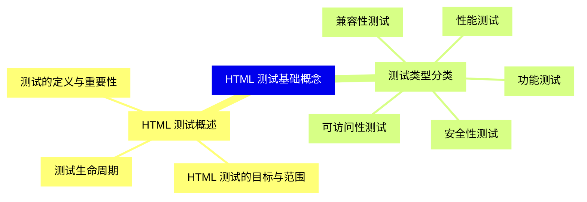
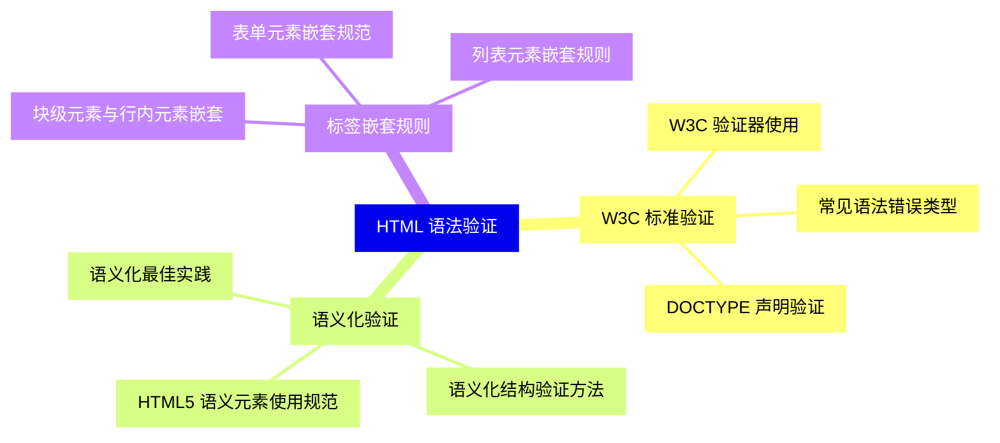
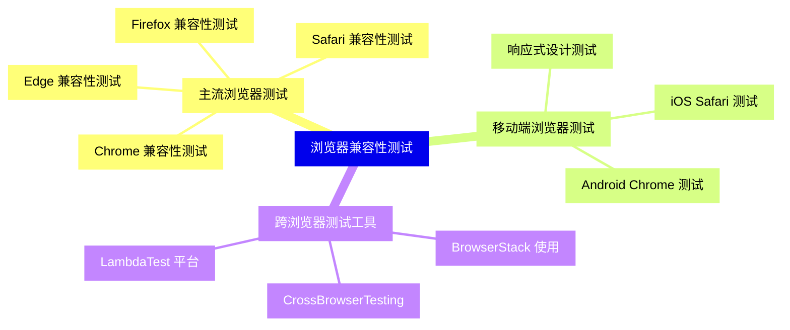
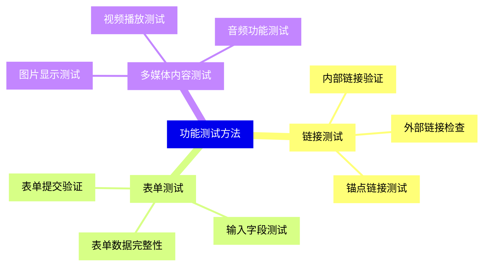
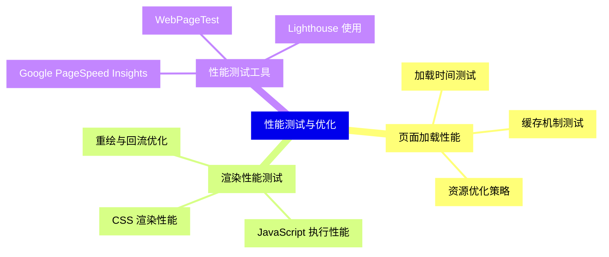
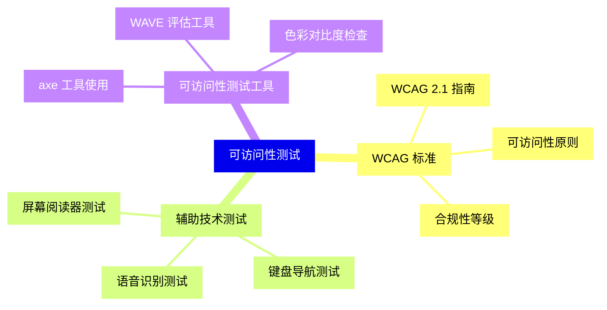
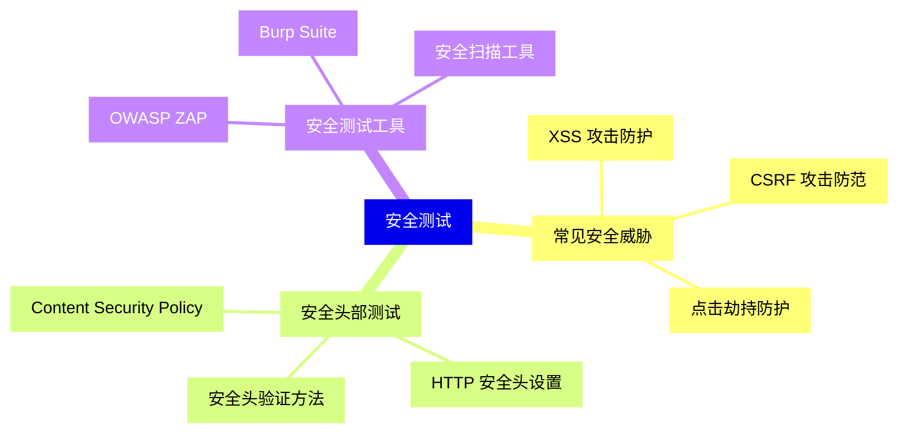
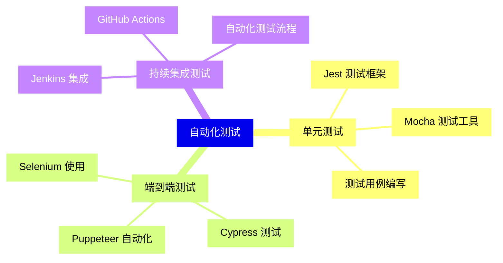
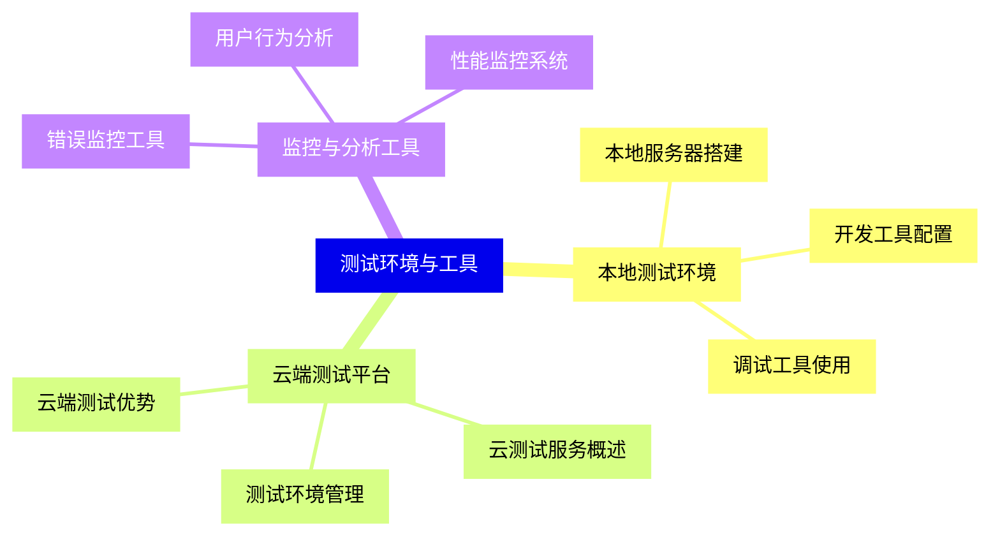
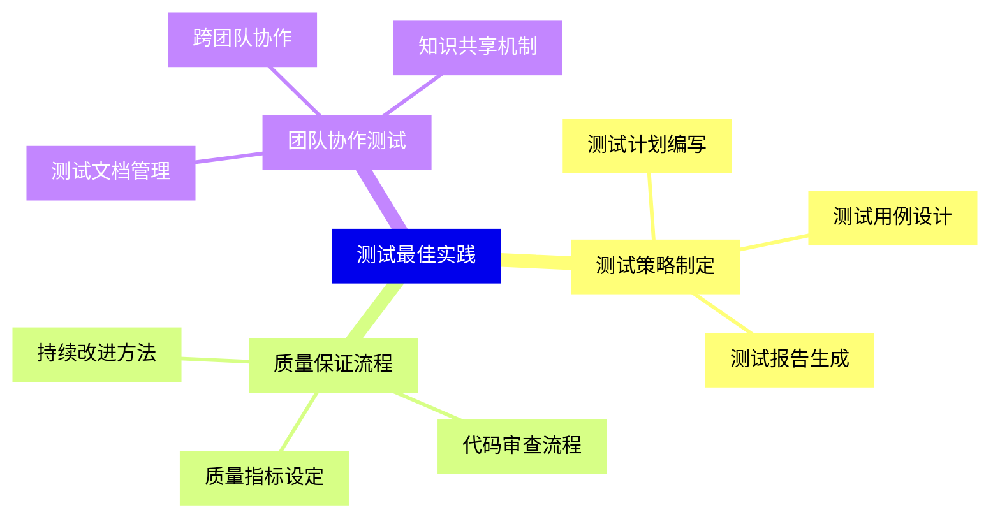


### 1 [HTML 测试基础概念](#1)
#### 1.1 [HTML 测试概述](#1)
##### 1.1.1 [测试的定义与重要性](#1)
##### 1.1.2 [HTML 测试的目标与范围](#1)
##### 1.1.3 [测试生命周期](#1)
#### 1.2 [测试类型分类](#1)
##### 1.2.1 [功能测试](#1)
##### 1.2.2 [兼容性测试](#1)
##### 1.2.3 [性能测试](#1)
##### 1.2.4 [安全性测试](#1)
##### 1.2.5 [可访问性测试](#1)
### 2 [HTML 语法验证](#2)
#### 2.1 [W3C 标准验证](#2)
##### 2.1.1 [W3C 验证器使用](#2)
##### 2.1.2 [常见语法错误类型](#2)
##### 2.1.3 [DOCTYPE 声明验证](#2)
#### 2.2 [语义化验证](#2)
##### 2.2.1 [HTML5 语义元素使用规范](#2)
##### 2.2.2 [语义化结构验证方法](#2)
##### 2.2.3 [语义化最佳实践](#2)
#### 2.3 [标签嵌套规则](#2)
##### 2.3.1 [块级元素与行内元素嵌套](#2)
##### 2.3.2 [表单元素嵌套规范](#2)
##### 2.3.3 [列表元素嵌套规则](#2)
### 3 [浏览器兼容性测试](#3)
#### 3.1 [主流浏览器测试](#3)
##### 3.1.1 [Chrome 兼容性测试](#3)
##### 3.1.2 [Firefox 兼容性测试](#3)
##### 3.1.3 [Safari 兼容性测试](#3)
##### 3.1.4 [Edge 兼容性测试](#3)
#### 3.2 [移动端浏览器测试](#3)
##### 3.2.1 [iOS Safari 测试](#3)
##### 3.2.2 [Android Chrome 测试](#3)
##### 3.2.3 [响应式设计测试](#3)
#### 3.3 [跨浏览器测试工具](#3)
##### 3.3.1 [BrowserStack 使用](#3)
##### 3.3.2 [CrossBrowserTesting](#3)
##### 3.3.3 [LambdaTest 平台](#3)
### 4 [功能测试方法](#4)
#### 4.1 [链接测试](#4)
##### 4.1.1 [内部链接验证](#4)
##### 4.1.2 [外部链接检查](#4)
##### 4.1.3 [锚点链接测试](#4)
#### 4.2 [表单测试](#4)
##### 4.2.1 [表单提交验证](#4)
##### 4.2.2 [输入字段测试](#4)
##### 4.2.3 [表单数据完整性](#4)
#### 4.3 [多媒体内容测试](#4)
##### 4.3.1 [图片显示测试](#4)
##### 4.3.2 [视频播放测试](#4)
##### 4.3.3 [音频功能测试](#4)
### 5 [性能测试与优化](#5)
#### 5.1 [页面加载性能](#5)
##### 5.1.1 [加载时间测试](#5)
##### 5.1.2 [资源优化策略](#5)
##### 5.1.3 [缓存机制测试](#5)
#### 5.2 [渲染性能测试](#5)
##### 5.2.1 [CSS 渲染性能](#5)
##### 5.2.2 [JavaScript 执行性能](#5)
##### 5.2.3 [重绘与回流优化](#5)
#### 5.3 [性能测试工具](#5)
##### 5.3.1 [Google PageSpeed Insights](#5)
##### 5.3.2 [WebPageTest](#5)
##### 5.3.3 [Lighthouse 使用](#5)
### 6 [可访问性测试](#6)
#### 6.1 [WCAG 标准](#6)
##### 6.1.1 [WCAG 2.1 指南](#6)
##### 6.1.2 [可访问性原则](#6)
##### 6.1.3 [合规性等级](#6)
#### 6.2 [辅助技术测试](#6)
##### 6.2.1 [屏幕阅读器测试](#6)
##### 6.2.2 [键盘导航测试](#6)
##### 6.2.3 [语音识别测试](#6)
#### 6.3 [可访问性测试工具](#6)
##### 6.3.1 [axe 工具使用](#6)
##### 6.3.2 [WAVE 评估工具](#6)
##### 6.3.3 [色彩对比度检查](#6)
### 7 [安全测试](#7)
#### 7.1 [常见安全威胁](#7)
##### 7.1.1 [XSS 攻击防护](#7)
##### 7.1.2 [CSRF 攻击防范](#7)
##### 7.1.3 [点击劫持防护](#7)
#### 7.2 [安全头部测试](#7)
##### 7.2.1 [Content Security Policy](#7)
##### 7.2.2 [HTTP 安全头设置](#7)
##### 7.2.3 [安全头验证方法](#7)
#### 7.3 [安全测试工具](#7)
##### 7.3.1 [OWASP ZAP](#7)
##### 7.3.2 [Burp Suite](#7)
##### 7.3.3 [安全扫描工具](#7)
### 8 [自动化测试](#8)
#### 8.1 [单元测试](#8)
##### 8.1.1 [Jest 测试框架](#8)
##### 8.1.2 [Mocha 测试工具](#8)
##### 8.1.3 [测试用例编写](#8)
#### 8.2 [端到端测试](#8)
##### 8.2.1 [Selenium 使用](#8)
##### 8.2.2 [Cypress 测试](#8)
##### 8.2.3 [Puppeteer 自动化](#8)
#### 8.3 [持续集成测试](#8)
##### 8.3.1 [Jenkins 集成](#8)
##### 8.3.2 [GitHub Actions](#8)
##### 8.3.3 [自动化测试流程](#8)
### 9 [测试环境与工具](#9)
#### 9.1 [本地测试环境](#9)
##### 9.1.1 [本地服务器搭建](#9)
##### 9.1.2 [开发工具配置](#9)
##### 9.1.3 [调试工具使用](#9)
#### 9.2 [云端测试平台](#9)
##### 9.2.1 [云测试服务概述](#9)
##### 9.2.2 [测试环境管理](#9)
##### 9.2.3 [云端测试优势](#9)
#### 9.3 [监控与分析工具](#9)
##### 9.3.1 [错误监控工具](#9)
##### 9.3.2 [用户行为分析](#9)
##### 9.3.3 [性能监控系统](#9)
### 10 [测试最佳实践](#10)
#### 10.1 [测试策略制定](#10)
##### 10.1.1 [测试计划编写](#10)
##### 10.1.2 [测试用例设计](#10)
##### 10.1.3 [测试报告生成](#10)
#### 10.2 [质量保证流程](#10)
##### 10.2.1 [代码审查流程](#10)
##### 10.2.2 [质量指标设定](#10)
##### 10.2.3 [持续改进方法](#10)
#### 10.3 [团队协作测试](#10)
##### 10.3.1 [测试文档管理](#10)
##### 10.3.2 [跨团队协作](#10)
##### 10.3.3 [知识共享机制](#10)




### 1 HTML 测试基础概念

---
### 1 HTML 测试基础概念
___
#### 1.1 HTML 测试概述
___
##### 1.1.1 测试的定义与重要性
___
##### 1.1.2 HTML 测试的目标与范围
___
##### 1.1.3 测试生命周期
___
#### 1.2 测试类型分类
___
##### 1.2.1 功能测试
___
##### 1.2.2 兼容性测试
___
##### 1.2.3 性能测试
___
##### 1.2.4 安全性测试
___
##### 1.2.5 可访问性测试
### 2 HTML 语法验证

---
### 2 HTML 语法验证
___
#### 2.1 W3C 标准验证
___
##### 2.1.1 W3C 验证器使用
___
##### 2.1.2 常见语法错误类型
___
##### 2.1.3 DOCTYPE 声明验证
___
#### 2.2 语义化验证
___
##### 2.2.1 HTML5 语义元素使用规范
___
##### 2.2.2 语义化结构验证方法
___
##### 2.2.3 语义化最佳实践
___
#### 2.3 标签嵌套规则
___
##### 2.3.1 块级元素与行内元素嵌套
___
##### 2.3.2 表单元素嵌套规范
___
##### 2.3.3 列表元素嵌套规则
### 3 浏览器兼容性测试

---
### 3 浏览器兼容性测试
___
#### 3.1 主流浏览器测试
___
##### 3.1.1 Chrome 兼容性测试
___
##### 3.1.2 Firefox 兼容性测试
___
##### 3.1.3 Safari 兼容性测试
___
##### 3.1.4 Edge 兼容性测试
___
#### 3.2 移动端浏览器测试
___
##### 3.2.1 iOS Safari 测试
___
##### 3.2.2 Android Chrome 测试
___
##### 3.2.3 响应式设计测试
___
#### 3.3 跨浏览器测试工具
___
##### 3.3.1 BrowserStack 使用
___
##### 3.3.2 CrossBrowserTesting
___
##### 3.3.3 LambdaTest 平台
### 4 功能测试方法

---
### 4 功能测试方法
___
#### 4.1 链接测试
___
##### 4.1.1 内部链接验证
___
##### 4.1.2 外部链接检查
___
##### 4.1.3 锚点链接测试
___
#### 4.2 表单测试
___
##### 4.2.1 表单提交验证
___
##### 4.2.2 输入字段测试
___
##### 4.2.3 表单数据完整性
___
#### 4.3 多媒体内容测试
___
##### 4.3.1 图片显示测试
___
##### 4.3.2 视频播放测试
___
##### 4.3.3 音频功能测试
### 5 性能测试与优化

---
### 5 性能测试与优化
___
#### 5.1 页面加载性能
___
##### 5.1.1 加载时间测试
___
##### 5.1.2 资源优化策略
___
##### 5.1.3 缓存机制测试
___
#### 5.2 渲染性能测试
___
##### 5.2.1 CSS 渲染性能
___
##### 5.2.2 JavaScript 执行性能
___
##### 5.2.3 重绘与回流优化
___
#### 5.3 性能测试工具
___
##### 5.3.1 Google PageSpeed Insights
___
##### 5.3.2 WebPageTest
___
##### 5.3.3 Lighthouse 使用
### 6 可访问性测试

---
### 6 可访问性测试
___
#### 6.1 WCAG 标准
___
##### 6.1.1 WCAG 2.1 指南
___
##### 6.1.2 可访问性原则
___
##### 6.1.3 合规性等级
___
#### 6.2 辅助技术测试
___
##### 6.2.1 屏幕阅读器测试
___
##### 6.2.2 键盘导航测试
___
##### 6.2.3 语音识别测试
___
#### 6.3 可访问性测试工具
___
##### 6.3.1 axe 工具使用
___
##### 6.3.2 WAVE 评估工具
___
##### 6.3.3 色彩对比度检查
### 7 安全测试

---
### 7 安全测试
___
#### 7.1 常见安全威胁
___
##### 7.1.1 XSS 攻击防护
___
##### 7.1.2 CSRF 攻击防范
___
##### 7.1.3 点击劫持防护
___
#### 7.2 安全头部测试
___
##### 7.2.1 Content Security Policy
___
##### 7.2.2 HTTP 安全头设置
___
##### 7.2.3 安全头验证方法
___
#### 7.3 安全测试工具
___
##### 7.3.1 OWASP ZAP
___
##### 7.3.2 Burp Suite
___
##### 7.3.3 安全扫描工具
### 8 自动化测试

---
### 8 自动化测试
___
#### 8.1 单元测试
___
##### 8.1.1 Jest 测试框架
___
##### 8.1.2 Mocha 测试工具
___
##### 8.1.3 测试用例编写
___
#### 8.2 端到端测试
___
##### 8.2.1 Selenium 使用
___
##### 8.2.2 Cypress 测试
___
##### 8.2.3 Puppeteer 自动化
___
#### 8.3 持续集成测试
___
##### 8.3.1 Jenkins 集成
___
##### 8.3.2 GitHub Actions
___
##### 8.3.3 自动化测试流程
### 9 测试环境与工具

---
### 9 测试环境与工具
___
#### 9.1 本地测试环境
___
##### 9.1.1 本地服务器搭建
___
##### 9.1.2 开发工具配置
___
##### 9.1.3 调试工具使用
___
#### 9.2 云端测试平台
___
##### 9.2.1 云测试服务概述
___
##### 9.2.2 测试环境管理
___
##### 9.2.3 云端测试优势
___
#### 9.3 监控与分析工具
___
##### 9.3.1 错误监控工具
___
##### 9.3.2 用户行为分析
___
##### 9.3.3 性能监控系统
### 10 测试最佳实践

---
### 10 测试最佳实践
___
#### 10.1 测试策略制定
___
##### 10.1.1 测试计划编写
___
##### 10.1.2 测试用例设计
___
##### 10.1.3 测试报告生成
___
#### 10.2 质量保证流程
___
##### 10.2.1 代码审查流程
___
##### 10.2.2 质量指标设定
___
##### 10.2.3 持续改进方法
___
#### 10.3 团队协作测试
___
##### 10.3.1 测试文档管理
___
##### 10.3.2 跨团队协作
___
##### 10.3.3 知识共享机制


### 1 HTML 测试基础概念{#1}

{}

<--->
{}
{}
{}
{}
{}
{}
{}
{}
{}
{}
{}
{}
{}
{}
{}
{}
{}
{}
{}
{}
{}

### 2 HTML 语法验证{#2}

{}
{}
{}
{}
{}
{}
{}
{}
{}
{}
{}
{}
{}
{}
{}
{}
{}
{}
{}
{}
{}
{}
{}
{}
{}
<--->

{}

### 3 浏览器兼容性测试{#3}

{}

<--->
{}
{}
{}
{}
{}
{}
{}
{}
{}
{}
{}
{}
{}
{}
{}
{}
{}
{}
{}
{}
{}
{}
{}
{}
{}
{}
{}

### 4 功能测试方法{#4}

{}
{}
{}
{}
{}
{}
{}
{}
{}
{}
{}
{}
{}
{}
{}
{}
{}
{}
{}
{}
{}
{}
{}
{}
{}
<--->

{}

### 5 性能测试与优化{#5}

{}

<--->
{}
{}
{}
{}
{}
{}
{}
{}
{}
{}
{}
{}
{}
{}
{}
{}
{}
{}
{}
{}
{}
{}
{}
{}
{}

### 6 可访问性测试{#6}

{}
{}
{}
{}
{}
{}
{}
{}
{}
{}
{}
{}
{}
{}
{}
{}
{}
{}
{}
{}
{}
{}
{}
{}
{}
<--->

{}

### 7 安全测试{#7}

{}

<--->
{}
{}
{}
{}
{}
{}
{}
{}
{}
{}
{}
{}
{}
{}
{}
{}
{}
{}
{}
{}
{}
{}
{}
{}
{}

### 8 自动化测试{#8}

{}
{}
{}
{}
{}
{}
{}
{}
{}
{}
{}
{}
{}
{}
{}
{}
{}
{}
{}
{}
{}
{}
{}
{}
{}
<--->

{}

### 9 测试环境与工具{#9}

{}

<--->
{}
{}
{}
{}
{}
{}
{}
{}
{}
{}
{}
{}
{}
{}
{}
{}
{}
{}
{}
{}
{}
{}
{}
{}
{}

### 10 测试最佳实践{#10}

{}
{}
{}
{}
{}
{}
{}
{}
{}
{}
{}
{}
{}
{}
{}
{}
{}
{}
{}
{}
{}
{}
{}
{}
{}
<--->

{}
