
### 1 [第一部分：Web 组件基础概念](#1)
#### 1.1 [Web 组件概述](#1)
##### 1.1.1 [什么是Web组件](#1)
##### 1.1.2 [Web组件的发展历史](#1)
##### 1.1.3 [Web组件的核心优势](#1)
##### 1.1.4 [Web组件与传统框架组件对比](#1)
#### 1.2 [Web 组件四大支柱](#1)
##### 1.2.1 [Custom Elements 自定义元素](#1)
##### 1.2.2 [Shadow DOM 影子DOM](#1)
##### 1.2.3 [HTML Templates HTML模板](#1)
##### 1.2.4 [HTML Imports HTML导入](#1)
### 2 [第二部分：自定义元素详解](#2)
#### 2.1 [自定义元素基础](#2)
##### 2.1.1 [自定义元素定义与注册](#2)
##### 2.1.2 [自定义元素生命周期](#2)
##### 2.1.3 [自定义元素属性与特性](#2)
##### 2.1.4 [自定义元素方法定义](#2)
#### 2.2 [自定义元素类型](#2)
##### 2.2.1 [自主自定义元素](#2)
##### 2.2.2 [内置自定义元素](#2)
##### 2.2.3 [自定义内置元素扩展](#2)
#### 2.3 [自定义元素高级特性](#2)
##### 2.3.1 [元素属性反射](#2)
##### 2.3.2 [元素事件处理](#2)
##### 2.3.3 [元素样式控制](#2)
##### 2.3.4 [元素内容插槽](#2)
### 3 [第三部分：Shadow DOM 技术](#3)
#### 3.1 [Shadow DOM 基础](#3)
##### 3.1.1 [Shadow DOM 概念与作用](#3)
##### 3.1.2 [Shadow DOM 与 Light DOM](#3)
##### 3.1.3 [Shadow DOM 的封装特性](#3)
#### 3.2 [Shadow DOM 操作](#3)
##### 3.2.1 [Shadow Root 创建与管理](#3)
##### 3.2.2 [Shadow DOM 样式封装](#3)
##### 3.2.3 [Shadow DOM 事件处理](#3)
##### 3.2.4 [Shadow DOM 内容投影](#3)
#### 3.3 [Shadow DOM 高级应用](#3)
##### 3.3.1 [多级 Shadow DOM](#3)
##### 3.3.2 [Shadow DOM 样式穿透](#3)
##### 3.3.3 [Shadow DOM 性能优化](#3)
### 4 [第四部分：HTML 模板与插槽](#4)
#### 4.1 [HTML 模板技术](#4)
##### 4.1.1 [template 元素使用](#4)
##### 4.1.2 [模板内容克隆](#4)
##### 4.1.3 [模板性能优势](#4)
##### 4.1.4 [模板与数据绑定](#4)
#### 4.2 [插槽机制](#4)
##### 4.2.1 [slot 元素基础](#4)
##### 4.2.2 [命名插槽](#4)
##### 4.2.3 [默认插槽](#4)
##### 4.2.4 [插槽内容分发](#4)
#### 4.3 [模板与插槽高级应用](#4)
##### 4.3.1 [动态模板渲染](#4)
##### 4.3.2 [插槽内容控制](#4)
##### 4.3.3 [模板继承与组合](#4)
### 5 [第五部分：Web 组件样式与主题](#5)
#### 5.1 [Web 组件样式封装](#5)
##### 5.1.1 [Shadow DOM 样式隔离](#5)
##### 5.1.2 [CSS 变量在组件中的应用](#5)
##### 5.1.3 [组件样式继承](#5)
##### 5.1.4 [组件样式覆盖](#5)
#### 5.2 [组件主题系统](#5)
##### 5.2.1 [主题变量定义](#5)
##### 5.2.2 [主题切换机制](#5)
##### 5.2.3 [响应式主题设计](#5)
##### 5.2.4 [主题一致性维护](#5)
#### 5.3 [组件样式最佳实践](#5)
##### 5.3.1 [样式性能优化](#5)
##### 5.3.2 [样式模块化](#5)
##### 5.3.3 [样式测试策略](#5)
### 6 [第六部分：Web 组件数据与状态管理](#6)
#### 6.1 [组件数据流](#6)
##### 6.1.1 [属性与属性变化](#6)
##### 6.1.2 [事件通信机制](#6)
##### 6.1.3 [数据双向绑定](#6)
##### 6.1.4 [组件间数据传递](#6)
#### 6.2 [组件状态管理](#6)
##### 6.2.1 [内部状态管理](#6)
##### 6.2.2 [外部状态集成](#6)
##### 6.2.3 [状态持久化](#6)
##### 6.2.4 [状态同步策略](#6)
#### 6.3 [组件生命周期管理](#6)
##### 6.3.1 [生命周期钩子函数](#6)
##### 6.3.2 [组件挂载与卸载](#6)
##### 6.3.3 [组件更新优化](#6)
##### 6.3.4 [内存泄漏预防](#6)
### 7 [第七部分：Web 组件与框架集成](#7)
#### 7.1 [与主流框架集成](#7)
##### 7.1.1 [与React集成](#7)
##### 7.1.2 [与Vue集成](#7)
##### 7.1.3 [与Angular集成](#7)
##### 7.1.4 [与Svelte集成](#7)
#### 7.2 [框架组件封装](#7)
##### 7.2.1 [框架组件Web组件化](#7)
##### 7.2.2 [双向数据绑定实现](#7)
##### 7.2.3 [事件系统集成](#7)
##### 7.2.4 [性能优化策略](#7)
#### 7.3 [混合开发模式](#7)
##### 7.3.1 [渐进式Web组件采用](#7)
##### 7.3.2 [遗留系统Web组件改造](#7)
##### 7.3.3 [多框架共存方案](#7)
### 8 [第八部分：Web 组件性能优化](#8)
#### 8.1 [组件性能分析](#8)
##### 8.1.1 [组件渲染性能](#8)
##### 8.1.2 [组件内存使用](#8)
##### 8.1.3 [组件加载性能](#8)
##### 8.1.4 [组件更新性能](#8)
#### 8.2 [性能优化技术](#8)
##### 8.2.1 [懒加载与代码分割](#8)
##### 8.2.2 [组件缓存策略](#8)
##### 8.2.3 [虚拟DOM应用](#8)
##### 8.2.4 [渲染优化技巧](#8)
#### 8.3 [性能监控与调试](#8)
##### 8.3.1 [性能指标监控](#8)
##### 8.3.2 [性能问题诊断](#8)
##### 8.3.3 [性能测试工具](#8)
### 9 [第九部分：Web 组件测试与调试](#9)
#### 9.1 [组件测试策略](#9)
##### 9.1.1 [单元测试](#9)
##### 9.1.2 [集成测试](#9)
##### 9.1.3 [端到端测试](#9)
##### 9.1.4 [视觉回归测试](#9)
#### 9.2 [测试工具与框架](#9)
##### 9.2.1 [Jest测试框架](#9)
##### 9.2.2 [Puppeteer自动化测试](#9)
##### 9.2.3 [Testing Library](#9)
##### 9.2.4 [自定义测试工具](#9)
#### 9.3 [组件调试技术](#9)
##### 9.3.1 [浏览器开发者工具](#9)
##### 9.3.2 [Shadow DOM调试](#9)
##### 9.3.3 [事件调试技巧](#9)
##### 9.3.4 [性能调试方法](#9)
### 10 [第十部分：Web 组件最佳实践与架构](#10)
#### 10.1 [组件设计原则](#10)
##### 10.1.1 [单一职责原则](#10)
##### 10.1.2 [开闭原则](#10)
##### 10.1.3 [依赖倒置原则](#10)
##### 10.1.4 [接口隔离原则](#10)
#### 10.2 [组件架构模式](#10)
##### 10.2.1 [组件组合模式](#10)
##### 10.2.2 [高阶组件模式](#10)
##### 10.2.3 [渲染代理模式](#10)
##### 10.2.4 [状态提升模式](#10)
#### 10.3 [企业级组件库建设](#10)
##### 10.3.1 [组件库架构设计](#10)
##### 10.3.2 [组件文档系统](#10)
##### 10.3.3 [组件版本管理](#10)
##### 10.3.4 [组件发布流程](#10)
### 11 [第十一部分：Web 组件未来发展趋势](#11)
#### 11.1 [新兴标准与技术](#11)
##### 11.1.1 [Web Components 2.0](#11)
##### 11.1.2 [Declarative Shadow DOM](#11)
##### 11.1.3 [Scoped Custom Element Registries](#11)
##### 11.1.4 [CSS Shadow Parts](#11)
#### 11.2 [生态系统发展](#11)
##### 11.2.1 [工具链完善](#11)
##### 11.2.2 [社区资源丰富](#11)
##### 11.2.3 [企业采用趋势](#11)
##### 11.2.4 [跨平台应用](#11)
#### 11.3 [技术融合创新](#11)
##### 11.3.1 [Web组件与微前端](#11)
##### 11.3.2 [Web组件与PWA](#11)
##### 11.3.3 [Web组件与Serverless](#11)
##### 11.3.4 [Web组件与AI集成](#11)




### 1 第一部分：Web 组件基础概念

---
### 1 第一部分：Web 组件基础概念
___
#### 1.1 Web 组件概述
___
##### 1.1.1 什么是Web组件
___
##### 1.1.2 Web组件的发展历史
___
##### 1.1.3 Web组件的核心优势
___
##### 1.1.4 Web组件与传统框架组件对比
___
#### 1.2 Web 组件四大支柱
___
##### 1.2.1 Custom Elements 自定义元素
___
##### 1.2.2 Shadow DOM 影子DOM
___
##### 1.2.3 HTML Templates HTML模板
___
##### 1.2.4 HTML Imports HTML导入
### 2 第二部分：自定义元素详解

---
### 2 第二部分：自定义元素详解
___
#### 2.1 自定义元素基础
___
##### 2.1.1 自定义元素定义与注册
___
##### 2.1.2 自定义元素生命周期
___
##### 2.1.3 自定义元素属性与特性
___
##### 2.1.4 自定义元素方法定义
___
#### 2.2 自定义元素类型
___
##### 2.2.1 自主自定义元素
___
##### 2.2.2 内置自定义元素
___
##### 2.2.3 自定义内置元素扩展
___
#### 2.3 自定义元素高级特性
___
##### 2.3.1 元素属性反射
___
##### 2.3.2 元素事件处理
___
##### 2.3.3 元素样式控制
___
##### 2.3.4 元素内容插槽
### 3 第三部分：Shadow DOM 技术

---
### 3 第三部分：Shadow DOM 技术
___
#### 3.1 Shadow DOM 基础
___
##### 3.1.1 Shadow DOM 概念与作用
___
##### 3.1.2 Shadow DOM 与 Light DOM
___
##### 3.1.3 Shadow DOM 的封装特性
___
#### 3.2 Shadow DOM 操作
___
##### 3.2.1 Shadow Root 创建与管理
___
##### 3.2.2 Shadow DOM 样式封装
___
##### 3.2.3 Shadow DOM 事件处理
___
##### 3.2.4 Shadow DOM 内容投影
___
#### 3.3 Shadow DOM 高级应用
___
##### 3.3.1 多级 Shadow DOM
___
##### 3.3.2 Shadow DOM 样式穿透
___
##### 3.3.3 Shadow DOM 性能优化
### 4 第四部分：HTML 模板与插槽

---
### 4 第四部分：HTML 模板与插槽
___
#### 4.1 HTML 模板技术
___
##### 4.1.1 template 元素使用
___
##### 4.1.2 模板内容克隆
___
##### 4.1.3 模板性能优势
___
##### 4.1.4 模板与数据绑定
___
#### 4.2 插槽机制
___
##### 4.2.1 slot 元素基础
___
##### 4.2.2 命名插槽
___
##### 4.2.3 默认插槽
___
##### 4.2.4 插槽内容分发
___
#### 4.3 模板与插槽高级应用
___
##### 4.3.1 动态模板渲染
___
##### 4.3.2 插槽内容控制
___
##### 4.3.3 模板继承与组合
### 5 第五部分：Web 组件样式与主题

---
### 5 第五部分：Web 组件样式与主题
___
#### 5.1 Web 组件样式封装
___
##### 5.1.1 Shadow DOM 样式隔离
___
##### 5.1.2 CSS 变量在组件中的应用
___
##### 5.1.3 组件样式继承
___
##### 5.1.4 组件样式覆盖
___
#### 5.2 组件主题系统
___
##### 5.2.1 主题变量定义
___
##### 5.2.2 主题切换机制
___
##### 5.2.3 响应式主题设计
___
##### 5.2.4 主题一致性维护
___
#### 5.3 组件样式最佳实践
___
##### 5.3.1 样式性能优化
___
##### 5.3.2 样式模块化
___
##### 5.3.3 样式测试策略
### 6 第六部分：Web 组件数据与状态管理

---
### 6 第六部分：Web 组件数据与状态管理
___
#### 6.1 组件数据流
___
##### 6.1.1 属性与属性变化
___
##### 6.1.2 事件通信机制
___
##### 6.1.3 数据双向绑定
___
##### 6.1.4 组件间数据传递
___
#### 6.2 组件状态管理
___
##### 6.2.1 内部状态管理
___
##### 6.2.2 外部状态集成
___
##### 6.2.3 状态持久化
___
##### 6.2.4 状态同步策略
___
#### 6.3 组件生命周期管理
___
##### 6.3.1 生命周期钩子函数
___
##### 6.3.2 组件挂载与卸载
___
##### 6.3.3 组件更新优化
___
##### 6.3.4 内存泄漏预防
### 7 第七部分：Web 组件与框架集成

---
### 7 第七部分：Web 组件与框架集成
___
#### 7.1 与主流框架集成
___
##### 7.1.1 与React集成
___
##### 7.1.2 与Vue集成
___
##### 7.1.3 与Angular集成
___
##### 7.1.4 与Svelte集成
___
#### 7.2 框架组件封装
___
##### 7.2.1 框架组件Web组件化
___
##### 7.2.2 双向数据绑定实现
___
##### 7.2.3 事件系统集成
___
##### 7.2.4 性能优化策略
___
#### 7.3 混合开发模式
___
##### 7.3.1 渐进式Web组件采用
___
##### 7.3.2 遗留系统Web组件改造
___
##### 7.3.3 多框架共存方案
### 8 第八部分：Web 组件性能优化

---
### 8 第八部分：Web 组件性能优化
___
#### 8.1 组件性能分析
___
##### 8.1.1 组件渲染性能
___
##### 8.1.2 组件内存使用
___
##### 8.1.3 组件加载性能
___
##### 8.1.4 组件更新性能
___
#### 8.2 性能优化技术
___
##### 8.2.1 懒加载与代码分割
___
##### 8.2.2 组件缓存策略
___
##### 8.2.3 虚拟DOM应用
___
##### 8.2.4 渲染优化技巧
___
#### 8.3 性能监控与调试
___
##### 8.3.1 性能指标监控
___
##### 8.3.2 性能问题诊断
___
##### 8.3.3 性能测试工具
### 9 第九部分：Web 组件测试与调试

---
### 9 第九部分：Web 组件测试与调试
___
#### 9.1 组件测试策略
___
##### 9.1.1 单元测试
___
##### 9.1.2 集成测试
___
##### 9.1.3 端到端测试
___
##### 9.1.4 视觉回归测试
___
#### 9.2 测试工具与框架
___
##### 9.2.1 Jest测试框架
___
##### 9.2.2 Puppeteer自动化测试
___
##### 9.2.3 Testing Library
___
##### 9.2.4 自定义测试工具
___
#### 9.3 组件调试技术
___
##### 9.3.1 浏览器开发者工具
___
##### 9.3.2 Shadow DOM调试
___
##### 9.3.3 事件调试技巧
___
##### 9.3.4 性能调试方法
### 10 第十部分：Web 组件最佳实践与架构

---
### 10 第十部分：Web 组件最佳实践与架构
___
#### 10.1 组件设计原则
___
##### 10.1.1 单一职责原则
___
##### 10.1.2 开闭原则
___
##### 10.1.3 依赖倒置原则
___
##### 10.1.4 接口隔离原则
___
#### 10.2 组件架构模式
___
##### 10.2.1 组件组合模式
___
##### 10.2.2 高阶组件模式
___
##### 10.2.3 渲染代理模式
___
##### 10.2.4 状态提升模式
___
#### 10.3 企业级组件库建设
___
##### 10.3.1 组件库架构设计
___
##### 10.3.2 组件文档系统
___
##### 10.3.3 组件版本管理
___
##### 10.3.4 组件发布流程
### 11 第十一部分：Web 组件未来发展趋势

---
### 11 第十一部分：Web 组件未来发展趋势
___
#### 11.1 新兴标准与技术
___
##### 11.1.1 Web Components 2.0
___
##### 11.1.2 Declarative Shadow DOM
___
##### 11.1.3 Scoped Custom Element Registries
___
##### 11.1.4 CSS Shadow Parts
___
#### 11.2 生态系统发展
___
##### 11.2.1 工具链完善
___
##### 11.2.2 社区资源丰富
___
##### 11.2.3 企业采用趋势
___
##### 11.2.4 跨平台应用
___
#### 11.3 技术融合创新
___
##### 11.3.1 Web组件与微前端
___
##### 11.3.2 Web组件与PWA
___
##### 11.3.3 Web组件与Serverless
___
##### 11.3.4 Web组件与AI集成


### 1 第一部分：Web 组件基础概念{#1}

{}
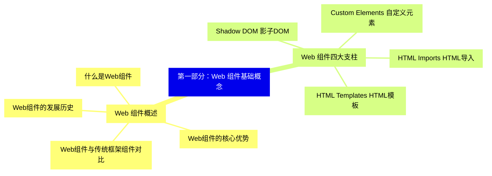

<--->
{}
{}
{}
{}
{}
{}
{}
{}
{}
{}
{}
{}
{}
{}
{}
{}
{}
{}
{}
{}
{}

### 2 第二部分：自定义元素详解{#2}

{}
{}
{}
{}
{}
{}
{}
{}
{}
{}
{}
{}
{}
{}
{}
{}
{}
{}
{}
{}
{}
{}
{}
{}
{}
{}
{}
{}
{}
<--->
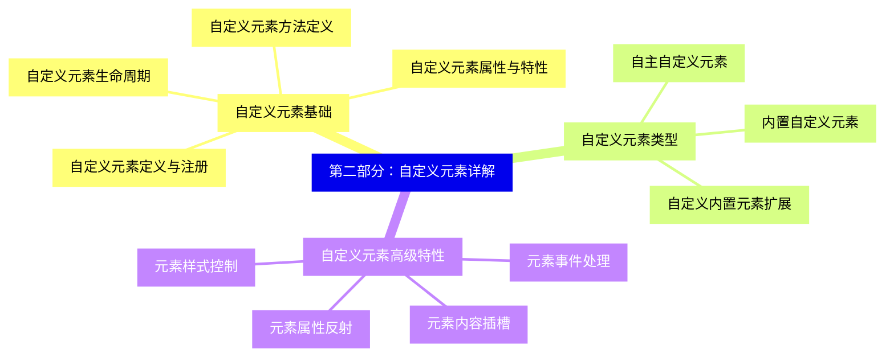

{}

### 3 第三部分：Shadow DOM 技术{#3}

{}
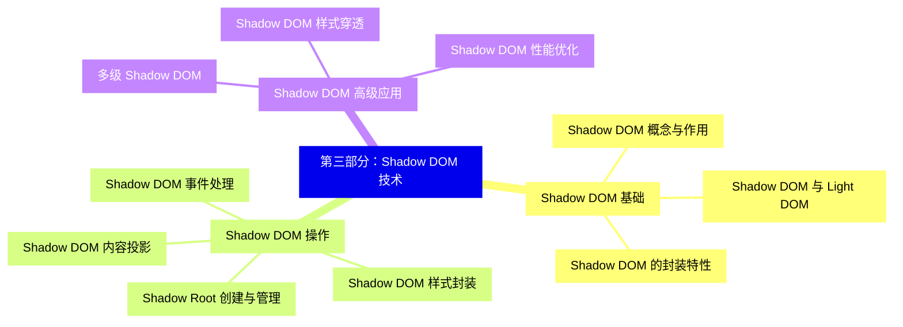

<--->
{}
{}
{}
{}
{}
{}
{}
{}
{}
{}
{}
{}
{}
{}
{}
{}
{}
{}
{}
{}
{}
{}
{}
{}
{}
{}
{}

### 4 第四部分：HTML 模板与插槽{#4}

{}
{}
{}
{}
{}
{}
{}
{}
{}
{}
{}
{}
{}
{}
{}
{}
{}
{}
{}
{}
{}
{}
{}
{}
{}
{}
{}
{}
{}
<--->
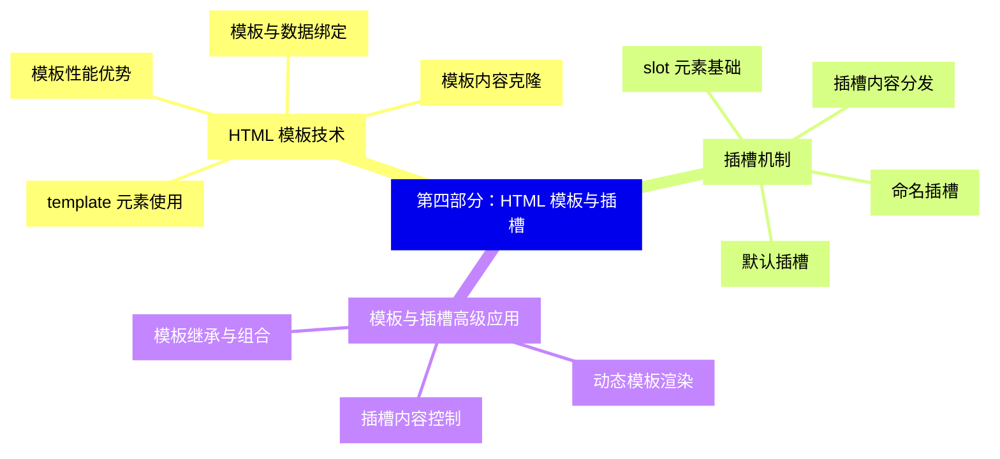

{}

### 5 第五部分：Web 组件样式与主题{#5}

{}
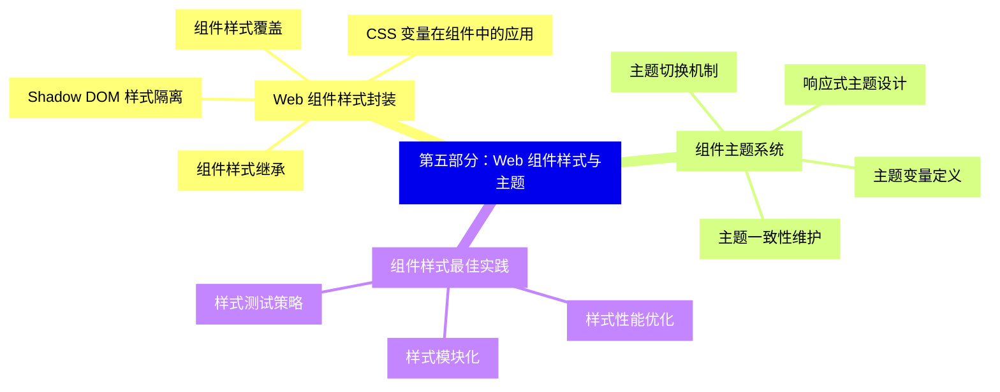

<--->
{}
{}
{}
{}
{}
{}
{}
{}
{}
{}
{}
{}
{}
{}
{}
{}
{}
{}
{}
{}
{}
{}
{}
{}
{}
{}
{}
{}
{}

### 6 第六部分：Web 组件数据与状态管理{#6}

{}
{}
{}
{}
{}
{}
{}
{}
{}
{}
{}
{}
{}
{}
{}
{}
{}
{}
{}
{}
{}
{}
{}
{}
{}
{}
{}
{}
{}
{}
{}
<--->
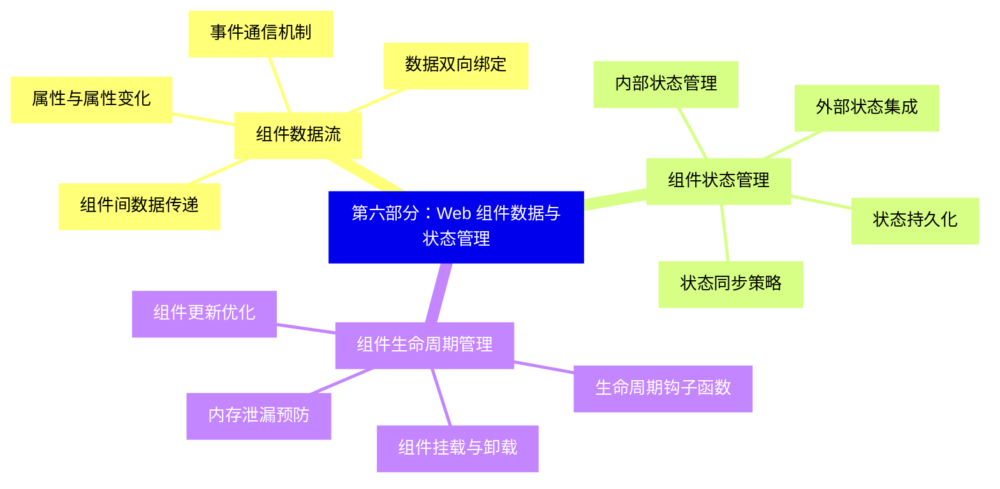

{}

### 7 第七部分：Web 组件与框架集成{#7}

{}
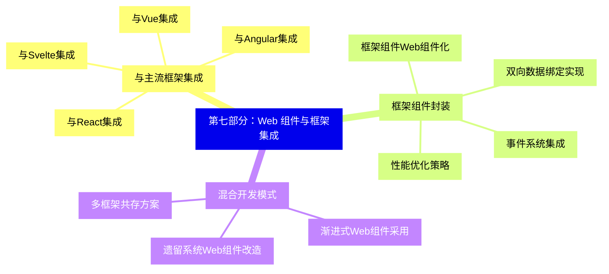

<--->
{}
{}
{}
{}
{}
{}
{}
{}
{}
{}
{}
{}
{}
{}
{}
{}
{}
{}
{}
{}
{}
{}
{}
{}
{}
{}
{}
{}
{}

### 8 第八部分：Web 组件性能优化{#8}

{}
{}
{}
{}
{}
{}
{}
{}
{}
{}
{}
{}
{}
{}
{}
{}
{}
{}
{}
{}
{}
{}
{}
{}
{}
{}
{}
{}
{}
<--->
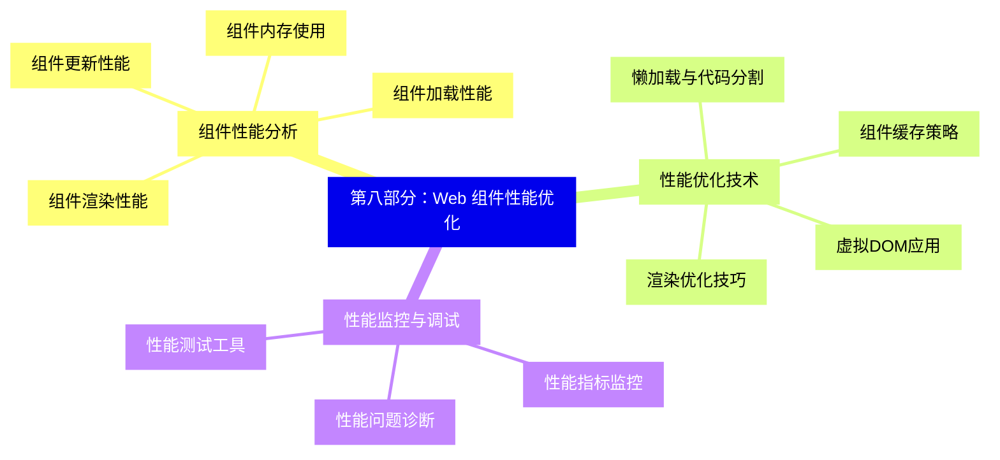

{}

### 9 第九部分：Web 组件测试与调试{#9}

{}
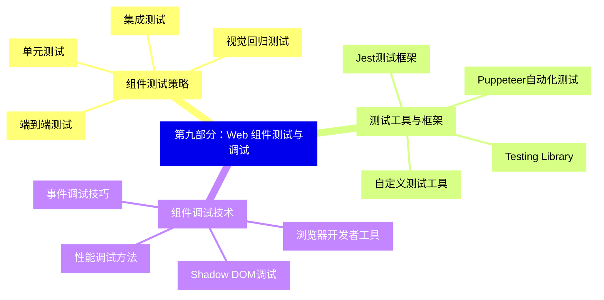

<--->
{}
{}
{}
{}
{}
{}
{}
{}
{}
{}
{}
{}
{}
{}
{}
{}
{}
{}
{}
{}
{}
{}
{}
{}
{}
{}
{}
{}
{}
{}
{}

### 10 第十部分：Web 组件最佳实践与架构{#10}

{}
{}
{}
{}
{}
{}
{}
{}
{}
{}
{}
{}
{}
{}
{}
{}
{}
{}
{}
{}
{}
{}
{}
{}
{}
{}
{}
{}
{}
{}
{}
<--->
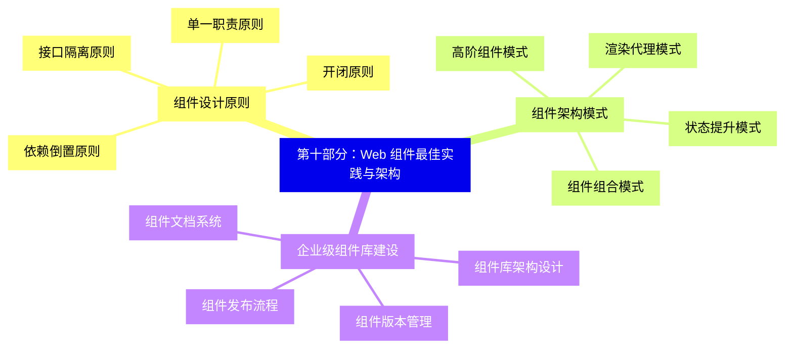

{}

### 11 第十一部分：Web 组件未来发展趋势{#11}

{}
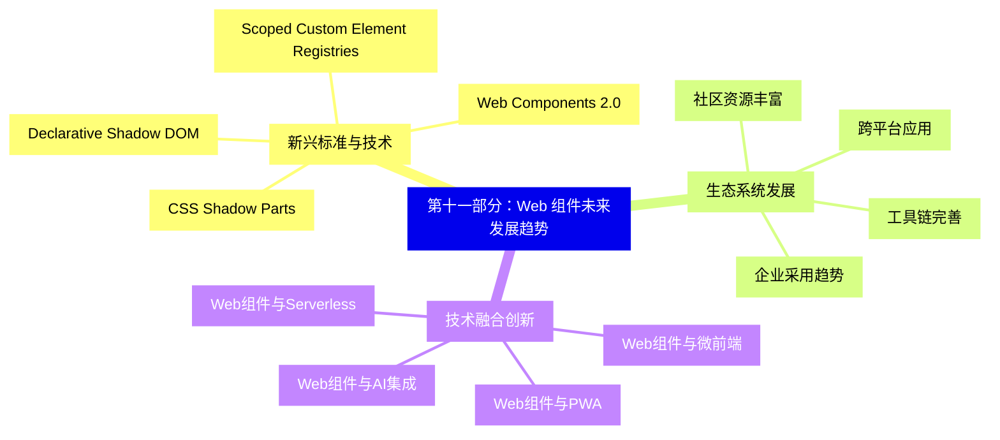

<--->
{}
{}
{}
{}
{}
{}
{}
{}
{}
{}
{}
{}
{}
{}
{}
{}
{}
{}
{}
{}
{}
{}
{}
{}
{}
{}
{}
{}
{}
{}
{}
