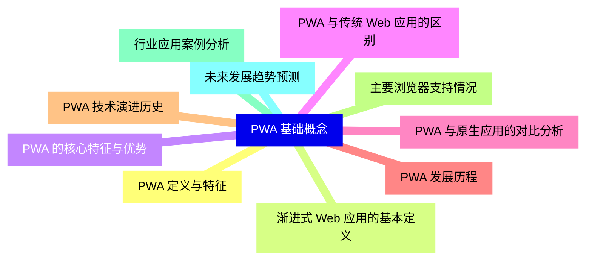
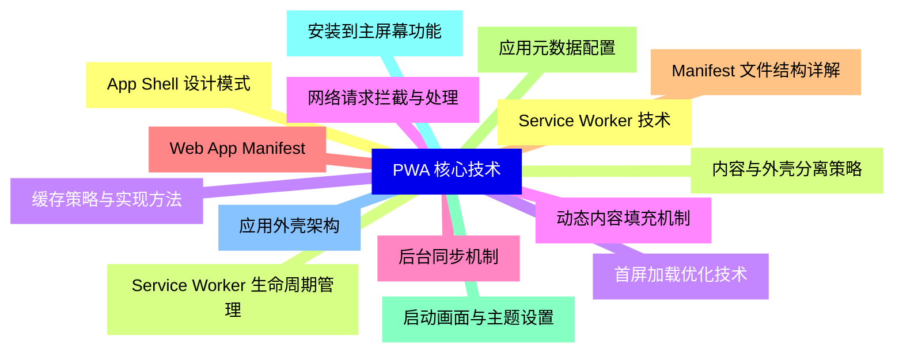
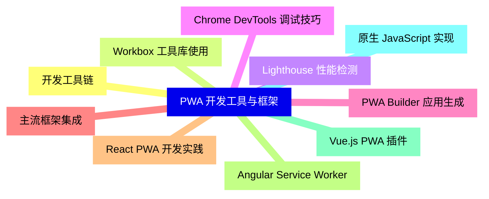
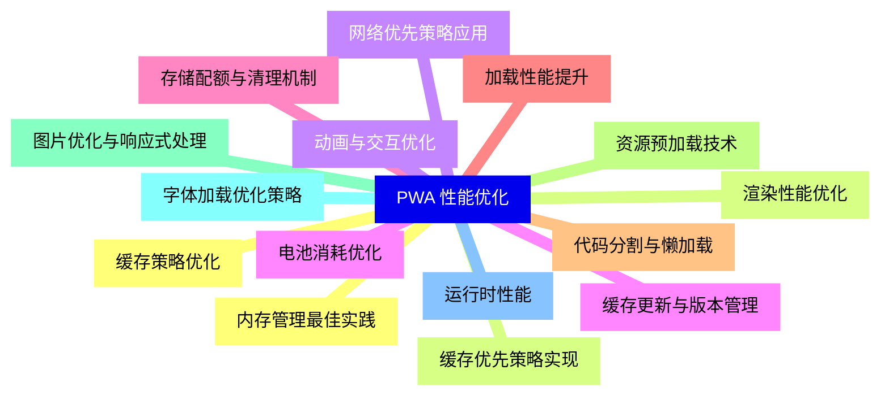
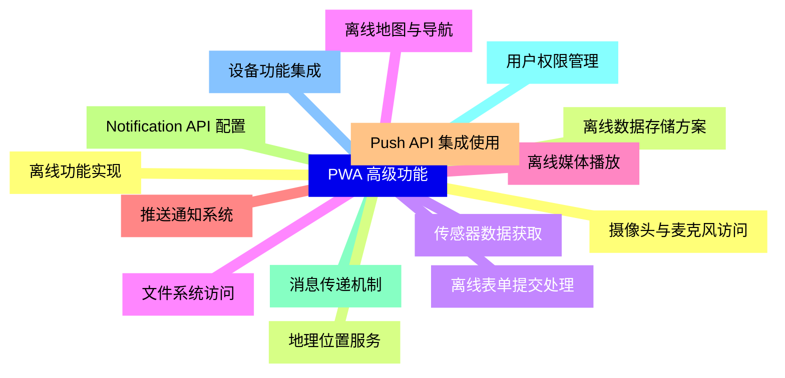
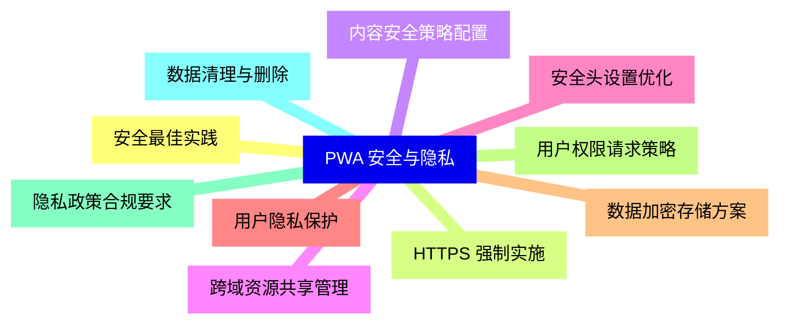
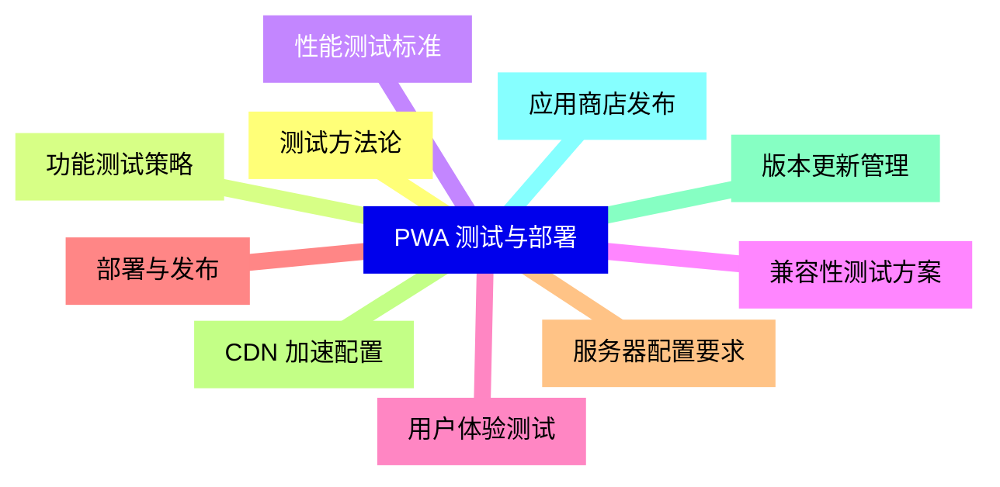
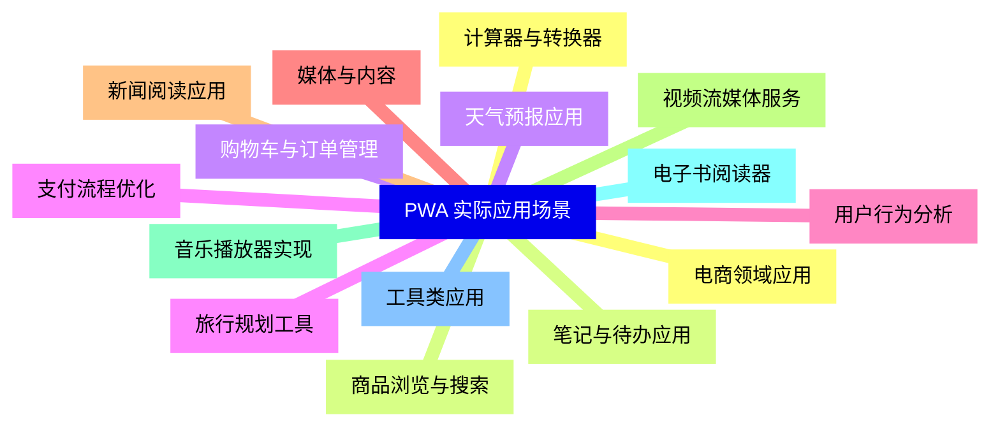
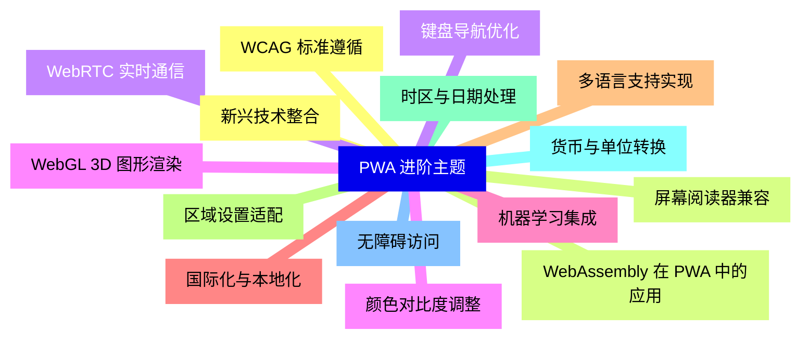


### 1 [PWA 基础概念](#1)
#### 1.1 [PWA 定义与特征](#1)
#### 1.2 [渐进式 Web 应用的基本定义](#1)
#### 1.3 [PWA 的核心特征与优势](#1)
#### 1.4 [PWA 与传统 Web 应用的区别](#1)
#### 1.5 [PWA 与原生应用的对比分析](#1)
#### 1.6 [PWA 发展历程](#1)
#### 1.7 [PWA 技术演进历史](#1)
#### 1.8 [主要浏览器支持情况](#1)
#### 1.9 [行业应用案例分析](#1)
#### 1.10 [未来发展趋势预测](#1)
### 2 [PWA 核心技术](#2)
#### 2.1 [Service Worker 技术](#2)
#### 2.2 [Service Worker 生命周期管理](#2)
#### 2.3 [缓存策略与实现方法](#2)
#### 2.4 [网络请求拦截与处理](#2)
#### 2.5 [后台同步机制](#2)
#### 2.6 [Web App Manifest](#2)
#### 2.7 [Manifest 文件结构详解](#2)
#### 2.8 [应用元数据配置](#2)
#### 2.9 [启动画面与主题设置](#2)
#### 2.10 [安装到主屏幕功能](#2)
#### 2.11 [应用外壳架构](#2)
#### 2.12 [App Shell 设计模式](#2)
#### 2.13 [内容与外壳分离策略](#2)
#### 2.14 [首屏加载优化技术](#2)
#### 2.15 [动态内容填充机制](#2)
### 3 [PWA 开发工具与框架](#3)
#### 3.1 [开发工具链](#3)
#### 3.2 [Workbox 工具库使用](#3)
#### 3.3 [Lighthouse 性能检测](#3)
#### 3.4 [Chrome DevTools 调试技巧](#3)
#### 3.5 [PWA Builder 应用生成](#3)
#### 3.6 [主流框架集成](#3)
#### 3.7 [React PWA 开发实践](#3)
#### 3.8 [Angular Service Worker](#3)
#### 3.9 [Vue.js PWA 插件](#3)
#### 3.10 [原生 JavaScript 实现](#3)
### 4 [PWA 性能优化](#4)
#### 4.1 [缓存策略优化](#4)
#### 4.2 [缓存优先策略实现](#4)
#### 4.3 [网络优先策略应用](#4)
#### 4.4 [缓存更新与版本管理](#4)
#### 4.5 [存储配额与清理机制](#4)
#### 4.6 [加载性能提升](#4)
#### 4.7 [代码分割与懒加载](#4)
#### 4.8 [资源预加载技术](#4)
#### 4.9 [图片优化与响应式处理](#4)
#### 4.10 [字体加载优化策略](#4)
#### 4.11 [运行时性能](#4)
#### 4.12 [内存管理最佳实践](#4)
#### 4.13 [渲染性能优化](#4)
#### 4.14 [动画与交互优化](#4)
#### 4.15 [电池消耗优化](#4)
### 5 [PWA 高级功能](#5)
#### 5.1 [离线功能实现](#5)
#### 5.2 [离线数据存储方案](#5)
#### 5.3 [离线表单提交处理](#5)
#### 5.4 [离线地图与导航](#5)
#### 5.5 [离线媒体播放](#5)
#### 5.6 [推送通知系统](#5)
#### 5.7 [Push API 集成使用](#5)
#### 5.8 [Notification API 配置](#5)
#### 5.9 [消息传递机制](#5)
#### 5.10 [用户权限管理](#5)
#### 5.11 [设备功能集成](#5)
#### 5.12 [摄像头与麦克风访问](#5)
#### 5.13 [地理位置服务](#5)
#### 5.14 [传感器数据获取](#5)
#### 5.15 [文件系统访问](#5)
### 6 [PWA 安全与隐私](#6)
#### 6.1 [安全最佳实践](#6)
#### 6.2 [HTTPS 强制实施](#6)
#### 6.3 [内容安全策略配置](#6)
#### 6.4 [跨域资源共享管理](#6)
#### 6.5 [安全头设置优化](#6)
#### 6.6 [用户隐私保护](#6)
#### 6.7 [数据加密存储方案](#6)
#### 6.8 [用户权限请求策略](#6)
#### 6.9 [隐私政策合规要求](#6)
#### 6.10 [数据清理与删除](#6)
### 7 [PWA 测试与部署](#7)
#### 7.1 [测试方法论](#7)
#### 7.2 [功能测试策略](#7)
#### 7.3 [性能测试标准](#7)
#### 7.4 [兼容性测试方案](#7)
#### 7.5 [用户体验测试](#7)
#### 7.6 [部署与发布](#7)
#### 7.7 [服务器配置要求](#7)
#### 7.8 [CDN 加速配置](#7)
#### 7.9 [版本更新管理](#7)
#### 7.10 [应用商店发布](#7)
### 8 [PWA 实际应用场景](#8)
#### 8.1 [电商领域应用](#8)
#### 8.2 [商品浏览与搜索](#8)
#### 8.3 [购物车与订单管理](#8)
#### 8.4 [支付流程优化](#8)
#### 8.5 [用户行为分析](#8)
#### 8.6 [媒体与内容](#8)
#### 8.7 [新闻阅读应用](#8)
#### 8.8 [视频流媒体服务](#8)
#### 8.9 [音乐播放器实现](#8)
#### 8.10 [电子书阅读器](#8)
#### 8.11 [工具类应用](#8)
#### 8.12 [计算器与转换器](#8)
#### 8.13 [笔记与待办应用](#8)
#### 8.14 [天气预报应用](#8)
#### 8.15 [旅行规划工具](#8)
### 9 [PWA 进阶主题](#9)
#### 9.1 [新兴技术整合](#9)
#### 9.2 [WebAssembly 在 PWA 中的应用](#9)
#### 9.3 [WebRTC 实时通信](#9)
#### 9.4 [WebGL 3D 图形渲染](#9)
#### 9.5 [机器学习集成](#9)
#### 9.6 [国际化与本地化](#9)
#### 9.7 [多语言支持实现](#9)
#### 9.8 [区域设置适配](#9)
#### 9.9 [时区与日期处理](#9)
#### 9.10 [货币与单位转换](#9)
#### 9.11 [无障碍访问](#9)
#### 9.12 [WCAG 标准遵循](#9)
#### 9.13 [屏幕阅读器兼容](#9)
#### 9.14 [键盘导航优化](#9)
#### 9.15 [颜色对比度调整](#9)




### 1 PWA 基础概念

---
### 1 PWA 基础概念
___
#### 1.1 PWA 定义与特征
___
#### 1.2 渐进式 Web 应用的基本定义
___
#### 1.3 PWA 的核心特征与优势
___
#### 1.4 PWA 与传统 Web 应用的区别
___
#### 1.5 PWA 与原生应用的对比分析
___
#### 1.6 PWA 发展历程
___
#### 1.7 PWA 技术演进历史
___
#### 1.8 主要浏览器支持情况
___
#### 1.9 行业应用案例分析
___
#### 1.10 未来发展趋势预测
### 2 PWA 核心技术

---
### 2 PWA 核心技术
___
#### 2.1 Service Worker 技术
___
#### 2.2 Service Worker 生命周期管理
___
#### 2.3 缓存策略与实现方法
___
#### 2.4 网络请求拦截与处理
___
#### 2.5 后台同步机制
___
#### 2.6 Web App Manifest
___
#### 2.7 Manifest 文件结构详解
___
#### 2.8 应用元数据配置
___
#### 2.9 启动画面与主题设置
___
#### 2.10 安装到主屏幕功能
___
#### 2.11 应用外壳架构
___
#### 2.12 App Shell 设计模式
___
#### 2.13 内容与外壳分离策略
___
#### 2.14 首屏加载优化技术
___
#### 2.15 动态内容填充机制
### 3 PWA 开发工具与框架

---
### 3 PWA 开发工具与框架
___
#### 3.1 开发工具链
___
#### 3.2 Workbox 工具库使用
___
#### 3.3 Lighthouse 性能检测
___
#### 3.4 Chrome DevTools 调试技巧
___
#### 3.5 PWA Builder 应用生成
___
#### 3.6 主流框架集成
___
#### 3.7 React PWA 开发实践
___
#### 3.8 Angular Service Worker
___
#### 3.9 Vue.js PWA 插件
___
#### 3.10 原生 JavaScript 实现
### 4 PWA 性能优化

---
### 4 PWA 性能优化
___
#### 4.1 缓存策略优化
___
#### 4.2 缓存优先策略实现
___
#### 4.3 网络优先策略应用
___
#### 4.4 缓存更新与版本管理
___
#### 4.5 存储配额与清理机制
___
#### 4.6 加载性能提升
___
#### 4.7 代码分割与懒加载
___
#### 4.8 资源预加载技术
___
#### 4.9 图片优化与响应式处理
___
#### 4.10 字体加载优化策略
___
#### 4.11 运行时性能
___
#### 4.12 内存管理最佳实践
___
#### 4.13 渲染性能优化
___
#### 4.14 动画与交互优化
___
#### 4.15 电池消耗优化
### 5 PWA 高级功能

---
### 5 PWA 高级功能
___
#### 5.1 离线功能实现
___
#### 5.2 离线数据存储方案
___
#### 5.3 离线表单提交处理
___
#### 5.4 离线地图与导航
___
#### 5.5 离线媒体播放
___
#### 5.6 推送通知系统
___
#### 5.7 Push API 集成使用
___
#### 5.8 Notification API 配置
___
#### 5.9 消息传递机制
___
#### 5.10 用户权限管理
___
#### 5.11 设备功能集成
___
#### 5.12 摄像头与麦克风访问
___
#### 5.13 地理位置服务
___
#### 5.14 传感器数据获取
___
#### 5.15 文件系统访问
### 6 PWA 安全与隐私

---
### 6 PWA 安全与隐私
___
#### 6.1 安全最佳实践
___
#### 6.2 HTTPS 强制实施
___
#### 6.3 内容安全策略配置
___
#### 6.4 跨域资源共享管理
___
#### 6.5 安全头设置优化
___
#### 6.6 用户隐私保护
___
#### 6.7 数据加密存储方案
___
#### 6.8 用户权限请求策略
___
#### 6.9 隐私政策合规要求
___
#### 6.10 数据清理与删除
### 7 PWA 测试与部署

---
### 7 PWA 测试与部署
___
#### 7.1 测试方法论
___
#### 7.2 功能测试策略
___
#### 7.3 性能测试标准
___
#### 7.4 兼容性测试方案
___
#### 7.5 用户体验测试
___
#### 7.6 部署与发布
___
#### 7.7 服务器配置要求
___
#### 7.8 CDN 加速配置
___
#### 7.9 版本更新管理
___
#### 7.10 应用商店发布
### 8 PWA 实际应用场景

---
### 8 PWA 实际应用场景
___
#### 8.1 电商领域应用
___
#### 8.2 商品浏览与搜索
___
#### 8.3 购物车与订单管理
___
#### 8.4 支付流程优化
___
#### 8.5 用户行为分析
___
#### 8.6 媒体与内容
___
#### 8.7 新闻阅读应用
___
#### 8.8 视频流媒体服务
___
#### 8.9 音乐播放器实现
___
#### 8.10 电子书阅读器
___
#### 8.11 工具类应用
___
#### 8.12 计算器与转换器
___
#### 8.13 笔记与待办应用
___
#### 8.14 天气预报应用
___
#### 8.15 旅行规划工具
### 9 PWA 进阶主题

---
### 9 PWA 进阶主题
___
#### 9.1 新兴技术整合
___
#### 9.2 WebAssembly 在 PWA 中的应用
___
#### 9.3 WebRTC 实时通信
___
#### 9.4 WebGL 3D 图形渲染
___
#### 9.5 机器学习集成
___
#### 9.6 国际化与本地化
___
#### 9.7 多语言支持实现
___
#### 9.8 区域设置适配
___
#### 9.9 时区与日期处理
___
#### 9.10 货币与单位转换
___
#### 9.11 无障碍访问
___
#### 9.12 WCAG 标准遵循
___
#### 9.13 屏幕阅读器兼容
___
#### 9.14 键盘导航优化
___
#### 9.15 颜色对比度调整


### 1 PWA 基础概念{#1}

{}

<--->
{}
{}
{}
{}
{}
{}
{}
{}
{}
{}
{}
{}
{}
{}
{}
{}
{}
{}
{}
{}
{}

### 2 PWA 核心技术{#2}

{}
{}
{}
{}
{}
{}
{}
{}
{}
{}
{}
{}
{}
{}
{}
{}
{}
{}
{}
{}
{}
{}
{}
{}
{}
{}
{}
{}
{}
{}
{}
<--->

{}

### 3 PWA 开发工具与框架{#3}

{}

<--->
{}
{}
{}
{}
{}
{}
{}
{}
{}
{}
{}
{}
{}
{}
{}
{}
{}
{}
{}
{}
{}

### 4 PWA 性能优化{#4}

{}
{}
{}
{}
{}
{}
{}
{}
{}
{}
{}
{}
{}
{}
{}
{}
{}
{}
{}
{}
{}
{}
{}
{}
{}
{}
{}
{}
{}
{}
{}
<--->

{}

### 5 PWA 高级功能{#5}

{}

<--->
{}
{}
{}
{}
{}
{}
{}
{}
{}
{}
{}
{}
{}
{}
{}
{}
{}
{}
{}
{}
{}
{}
{}
{}
{}
{}
{}
{}
{}
{}
{}

### 6 PWA 安全与隐私{#6}

{}
{}
{}
{}
{}
{}
{}
{}
{}
{}
{}
{}
{}
{}
{}
{}
{}
{}
{}
{}
{}
<--->

{}

### 7 PWA 测试与部署{#7}

{}

<--->
{}
{}
{}
{}
{}
{}
{}
{}
{}
{}
{}
{}
{}
{}
{}
{}
{}
{}
{}
{}
{}

### 8 PWA 实际应用场景{#8}

{}
{}
{}
{}
{}
{}
{}
{}
{}
{}
{}
{}
{}
{}
{}
{}
{}
{}
{}
{}
{}
{}
{}
{}
{}
{}
{}
{}
{}
{}
{}
<--->

{}

### 9 PWA 进阶主题{#9}

{}

<--->
{}
{}
{}
{}
{}
{}
{}
{}
{}
{}
{}
{}
{}
{}
{}
{}
{}
{}
{}
{}
{}
{}
{}
{}
{}
{}
{}
{}
{}
{}
{}
