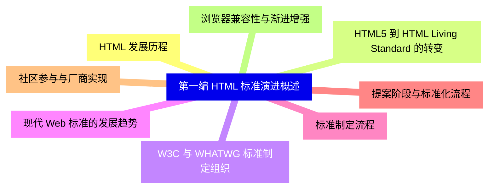
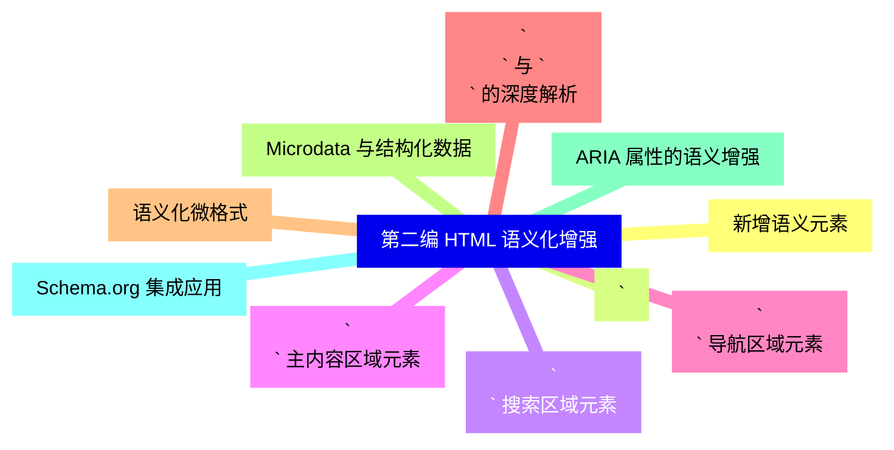
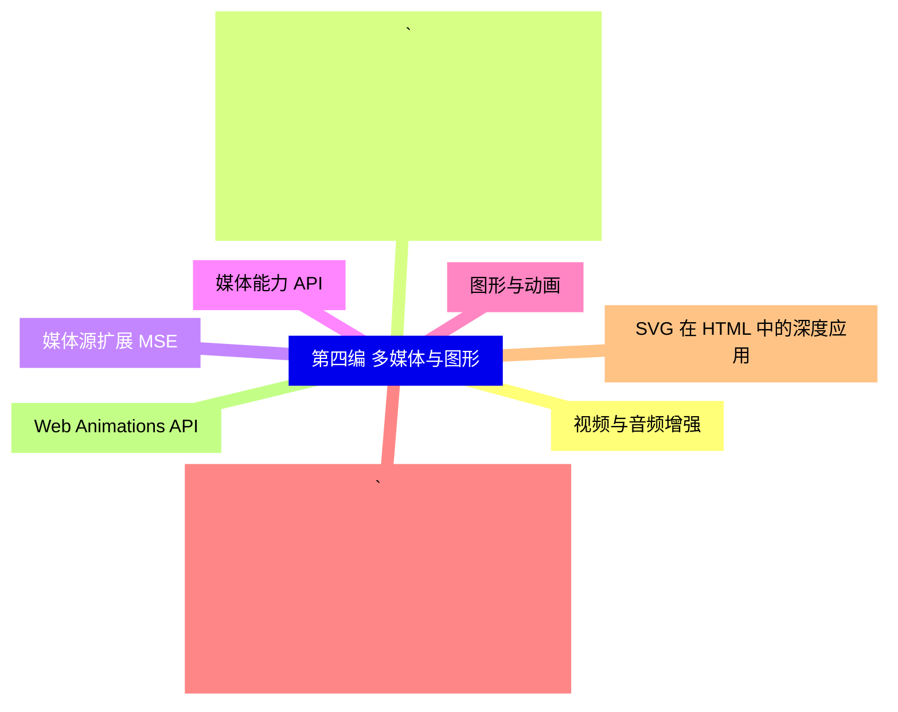
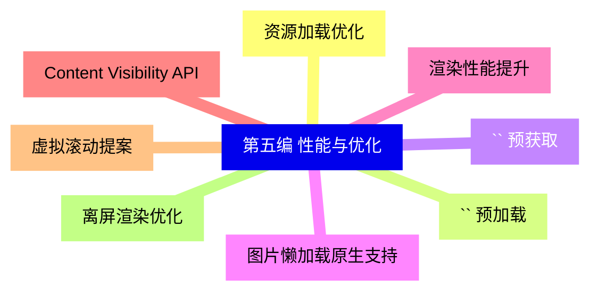
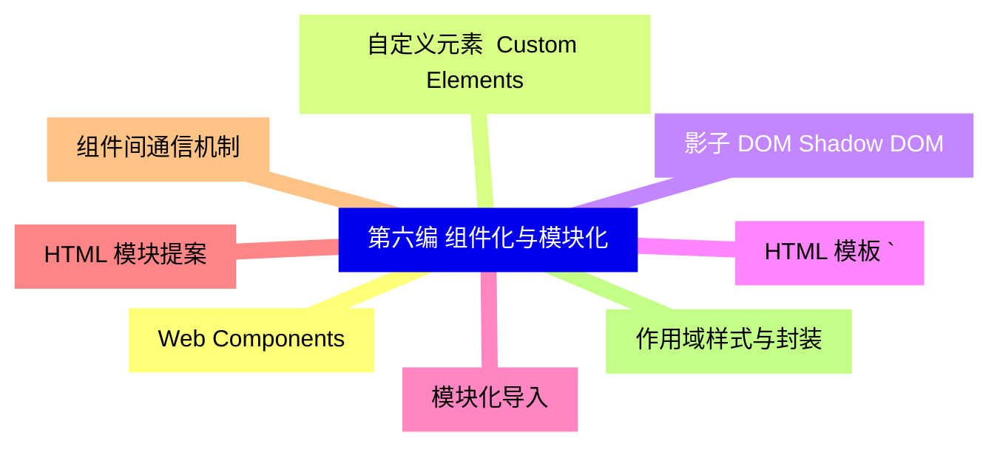
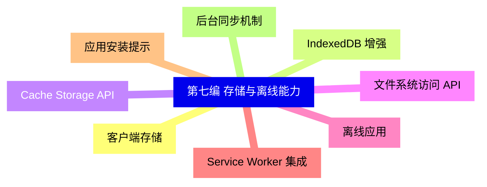
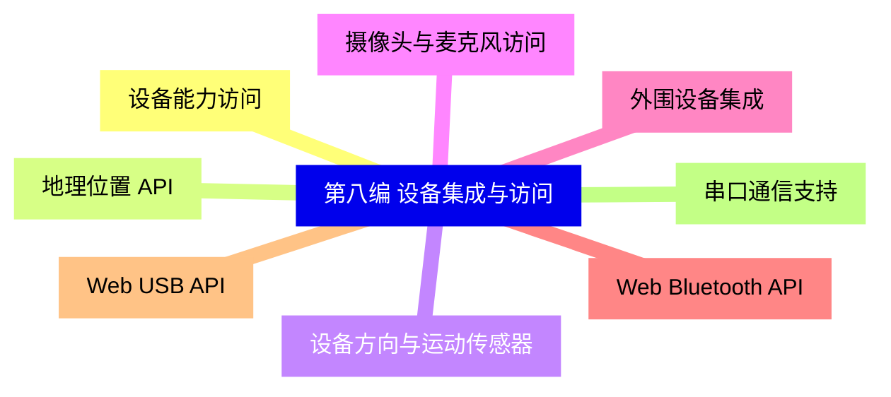
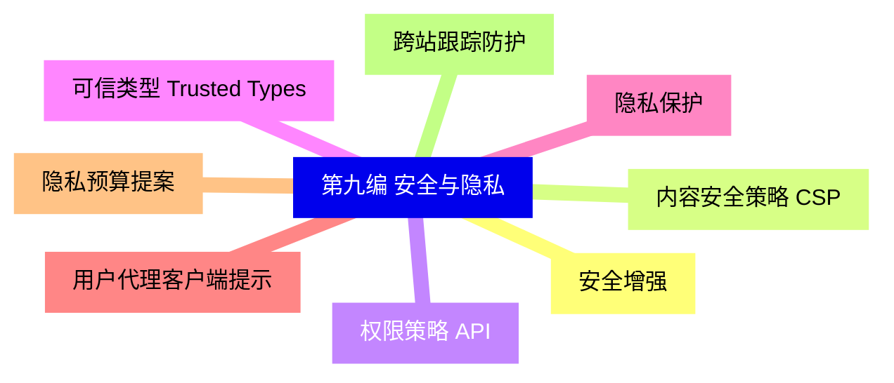
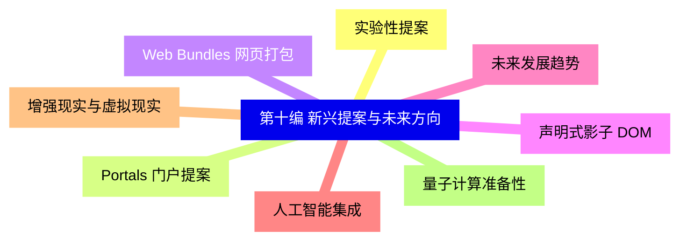

```mermaid
mindmap
    id3[第三编 表单与用户交互]
        id3-1[表单控件增强]
        id3-2[原生日期选择器 `<input type="date">`]
        id3-3[颜色选择器 `<input type="color">`]
        id3-4[范围滑块 `<input type="range">`]
        id3-5[文件上传增强 `<input type="file">`]
        id3-6[输入验证与约束]
        id3-7[原生表单验证 API]
        id3-8[自定义验证规则]
        id3-9[约束验证 API 详解]
```

### 1 [第一编 HTML 标准演进概述](#1)
#### 1.1 [HTML 发展历程](#1)
#### 1.2 [HTML5 到 HTML Living Standard 的转变](#1)
#### 1.3 [W3C 与 WHATWG 标准制定组织](#1)
#### 1.4 [现代 Web 标准的发展趋势](#1)
#### 1.5 [标准制定流程](#1)
#### 1.6 [提案阶段与标准化流程](#1)
#### 1.7 [社区参与与厂商实现](#1)
#### 1.8 [浏览器兼容性与渐进增强](#1)
### 2 [第二编 HTML 语义化增强](#2)
#### 2.1 [新增语义元素](#2)
#### 2.2 [`<dialog>` 对话框元素](#2)
#### 2.3 [`<search>` 搜索区域元素](#2)
#### 2.4 [`<main>` 主内容区域元素](#2)
#### 2.5 [`<nav>` 导航区域元素](#2)
#### 2.6 [`<article>` 与 `<section>` 的深度解析](#2)
#### 2.7 [语义化微格式](#2)
#### 2.8 [Microdata 与结构化数据](#2)
#### 2.9 [ARIA 属性的语义增强](#2)
#### 2.10 [Schema.org 集成应用](#2)
### 3 [第三编 表单与用户交互](#3)
#### 3.1 [表单控件增强](#3)
#### 3.2 [原生日期选择器 `<input type="date">`](#3)
#### 3.3 [颜色选择器 `<input type="color">`](#3)
#### 3.4 [范围滑块 `<input type="range">`](#3)
#### 3.5 [文件上传增强 `<input type="file">`](#3)
#### 3.6 [输入验证与约束](#3)
#### 3.7 [原生表单验证 API](#3)
#### 3.8 [自定义验证规则](#3)
#### 3.9 [约束验证 API 详解](#3)
### 4 [第四编 多媒体与图形](#4)
#### 4.1 [视频与音频增强](#4)
#### 4.2 [`<video>` 与 `<audio>` 元素扩展](#4)
#### 4.3 [媒体源扩展  MSE](#4)
#### 4.4 [媒体能力 API](#4)
#### 4.5 [图形与动画](#4)
#### 4.6 [`<canvas>` 2D 与 WebGL 集成](#4)
#### 4.7 [SVG 在 HTML 中的深度应用](#4)
#### 4.8 [Web Animations API](#4)
### 5 [第五编 性能与优化](#5)
#### 5.1 [资源加载优化](#5)
#### 5.2 [`<link rel="preload">` 预加载](#5)
#### 5.3 [`<link rel="prefetch">` 预获取](#5)
#### 5.4 [图片懒加载原生支持](#5)
#### 5.5 [渲染性能提升](#5)
#### 5.6 [Content Visibility API](#5)
#### 5.7 [虚拟滚动提案](#5)
#### 5.8 [离屏渲染优化](#5)
### 6 [第六编 组件化与模块化](#6)
#### 6.1 [Web Components](#6)
#### 6.2 [自定义元素  Custom Elements](#6)
#### 6.3 [影子 DOM  Shadow DOM](#6)
#### 6.4 [HTML 模板 `<template>`](#6)
#### 6.5 [模块化导入](#6)
#### 6.6 [HTML 模块提案](#6)
#### 6.7 [组件间通信机制](#6)
#### 6.8 [作用域样式与封装](#6)
### 7 [第七编 存储与离线能力](#7)
#### 7.1 [客户端存储](#7)
#### 7.2 [IndexedDB 增强](#7)
#### 7.3 [Cache Storage API](#7)
#### 7.4 [文件系统访问 API](#7)
#### 7.5 [离线应用](#7)
#### 7.6 [Service Worker 集成](#7)
#### 7.7 [应用安装提示](#7)
#### 7.8 [后台同步机制](#7)
### 8 [第八编 设备集成与访问](#8)
#### 8.1 [设备能力访问](#8)
#### 8.2 [地理位置 API](#8)
#### 8.3 [设备方向与运动传感器](#8)
#### 8.4 [摄像头与麦克风访问](#8)
#### 8.5 [外围设备集成](#8)
#### 8.6 [Web Bluetooth API](#8)
#### 8.7 [Web USB API](#8)
#### 8.8 [串口通信支持](#8)
### 9 [第九编 安全与隐私](#9)
#### 9.1 [安全增强](#9)
#### 9.2 [内容安全策略  CSP](#9)
#### 9.3 [权限策略 API](#9)
#### 9.4 [可信类型  Trusted Types](#9)
#### 9.5 [隐私保护](#9)
#### 9.6 [用户代理客户端提示](#9)
#### 9.7 [隐私预算提案](#9)
#### 9.8 [跨站跟踪防护](#9)
### 10 [第十编 新兴提案与未来方向](#10)
#### 10.1 [实验性提案](#10)
#### 10.2 [Portals 门户提案](#10)
#### 10.3 [Web Bundles 网页打包](#10)
#### 10.4 [声明式影子 DOM](#10)
#### 10.5 [未来发展趋势](#10)
#### 10.6 [人工智能集成](#10)
#### 10.7 [增强现实与虚拟现实](#10)
#### 10.8 [量子计算准备性](#10)




### 1 第一编 HTML 标准演进概述

---
### 1 第一编 HTML 标准演进概述
___
#### 1.1 HTML 发展历程
___
#### 1.2 HTML5 到 HTML Living Standard 的转变
___
#### 1.3 W3C 与 WHATWG 标准制定组织
___
#### 1.4 现代 Web 标准的发展趋势
___
#### 1.5 标准制定流程
___
#### 1.6 提案阶段与标准化流程
___
#### 1.7 社区参与与厂商实现
___
#### 1.8 浏览器兼容性与渐进增强
### 2 第二编 HTML 语义化增强

---
### 2 第二编 HTML 语义化增强
___
#### 2.1 新增语义元素
___
#### 2.2 `<dialog>` 对话框元素
___
#### 2.3 `<search>` 搜索区域元素
___
#### 2.4 `<main>` 主内容区域元素
___
#### 2.5 `<nav>` 导航区域元素
___
#### 2.6 `<article>` 与 `<section>` 的深度解析
___
#### 2.7 语义化微格式
___
#### 2.8 Microdata 与结构化数据
___
#### 2.9 ARIA 属性的语义增强
___
#### 2.10 Schema.org 集成应用
### 3 第三编 表单与用户交互

---
### 3 第三编 表单与用户交互
___
#### 3.1 表单控件增强
___
#### 3.2 原生日期选择器 `<input type="date">`
___
#### 3.3 颜色选择器 `<input type="color">`
___
#### 3.4 范围滑块 `<input type="range">`
___
#### 3.5 文件上传增强 `<input type="file">`
___
#### 3.6 输入验证与约束
___
#### 3.7 原生表单验证 API
___
#### 3.8 自定义验证规则
___
#### 3.9 约束验证 API 详解
### 4 第四编 多媒体与图形

---
### 4 第四编 多媒体与图形
___
#### 4.1 视频与音频增强
___
#### 4.2 `<video>` 与 `<audio>` 元素扩展
___
#### 4.3 媒体源扩展  MSE
___
#### 4.4 媒体能力 API
___
#### 4.5 图形与动画
___
#### 4.6 `<canvas>` 2D 与 WebGL 集成
___
#### 4.7 SVG 在 HTML 中的深度应用
___
#### 4.8 Web Animations API
### 5 第五编 性能与优化

---
### 5 第五编 性能与优化
___
#### 5.1 资源加载优化
___
#### 5.2 `<link rel="preload">` 预加载
___
#### 5.3 `<link rel="prefetch">` 预获取
___
#### 5.4 图片懒加载原生支持
___
#### 5.5 渲染性能提升
___
#### 5.6 Content Visibility API
___
#### 5.7 虚拟滚动提案
___
#### 5.8 离屏渲染优化
### 6 第六编 组件化与模块化

---
### 6 第六编 组件化与模块化
___
#### 6.1 Web Components
___
#### 6.2 自定义元素  Custom Elements
___
#### 6.3 影子 DOM  Shadow DOM
___
#### 6.4 HTML 模板 `<template>`
___
#### 6.5 模块化导入
___
#### 6.6 HTML 模块提案
___
#### 6.7 组件间通信机制
___
#### 6.8 作用域样式与封装
### 7 第七编 存储与离线能力

---
### 7 第七编 存储与离线能力
___
#### 7.1 客户端存储
___
#### 7.2 IndexedDB 增强
___
#### 7.3 Cache Storage API
___
#### 7.4 文件系统访问 API
___
#### 7.5 离线应用
___
#### 7.6 Service Worker 集成
___
#### 7.7 应用安装提示
___
#### 7.8 后台同步机制
### 8 第八编 设备集成与访问

---
### 8 第八编 设备集成与访问
___
#### 8.1 设备能力访问
___
#### 8.2 地理位置 API
___
#### 8.3 设备方向与运动传感器
___
#### 8.4 摄像头与麦克风访问
___
#### 8.5 外围设备集成
___
#### 8.6 Web Bluetooth API
___
#### 8.7 Web USB API
___
#### 8.8 串口通信支持
### 9 第九编 安全与隐私

---
### 9 第九编 安全与隐私
___
#### 9.1 安全增强
___
#### 9.2 内容安全策略  CSP
___
#### 9.3 权限策略 API
___
#### 9.4 可信类型  Trusted Types
___
#### 9.5 隐私保护
___
#### 9.6 用户代理客户端提示
___
#### 9.7 隐私预算提案
___
#### 9.8 跨站跟踪防护
### 10 第十编 新兴提案与未来方向

---
### 10 第十编 新兴提案与未来方向
___
#### 10.1 实验性提案
___
#### 10.2 Portals 门户提案
___
#### 10.3 Web Bundles 网页打包
___
#### 10.4 声明式影子 DOM
___
#### 10.5 未来发展趋势
___
#### 10.6 人工智能集成
___
#### 10.7 增强现实与虚拟现实
___
#### 10.8 量子计算准备性


### 1 第一编 HTML 标准演进概述{#1}

{}

<--->
{}
{}
{}
{}
{}
{}
{}
{}
{}
{}
{}
{}
{}
{}
{}
{}
{}

### 2 第二编 HTML 语义化增强{#2}

{}
{}
{}
{}
{}
{}
{}
{}
{}
{}
{}
{}
{}
{}
{}
{}
{}
{}
{}
{}
{}
<--->

{}

### 3 第三编 表单与用户交互{#3}

{}

<--->
{}
{}
{}
{}
{}
{}
{}
{}
{}
{}
{}
{}
{}
{}
{}
{}
{}
{}
{}

### 4 第四编 多媒体与图形{#4}

{}
{}
{}
{}
{}
{}
{}
{}
{}
{}
{}
{}
{}
{}
{}
{}
{}
<--->

{}

### 5 第五编 性能与优化{#5}

{}

<--->
{}
{}
{}
{}
{}
{}
{}
{}
{}
{}
{}
{}
{}
{}
{}
{}
{}

### 6 第六编 组件化与模块化{#6}

{}
{}
{}
{}
{}
{}
{}
{}
{}
{}
{}
{}
{}
{}
{}
{}
{}
<--->

{}

### 7 第七编 存储与离线能力{#7}

{}

<--->
{}
{}
{}
{}
{}
{}
{}
{}
{}
{}
{}
{}
{}
{}
{}
{}
{}

### 8 第八编 设备集成与访问{#8}

{}
{}
{}
{}
{}
{}
{}
{}
{}
{}
{}
{}
{}
{}
{}
{}
{}
<--->

{}

### 9 第九编 安全与隐私{#9}

{}

<--->
{}
{}
{}
{}
{}
{}
{}
{}
{}
{}
{}
{}
{}
{}
{}
{}
{}

### 10 第十编 新兴提案与未来方向{#10}

{}
{}
{}
{}
{}
{}
{}
{}
{}
{}
{}
{}
{}
{}
{}
{}
{}
<--->

{}
