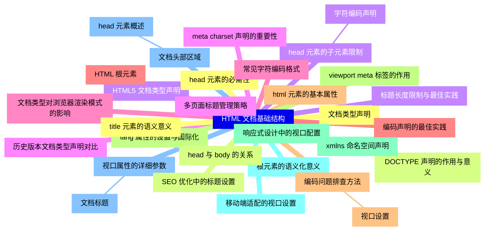
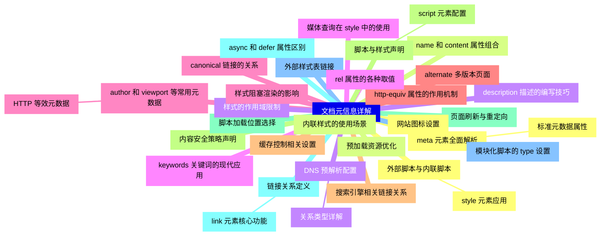
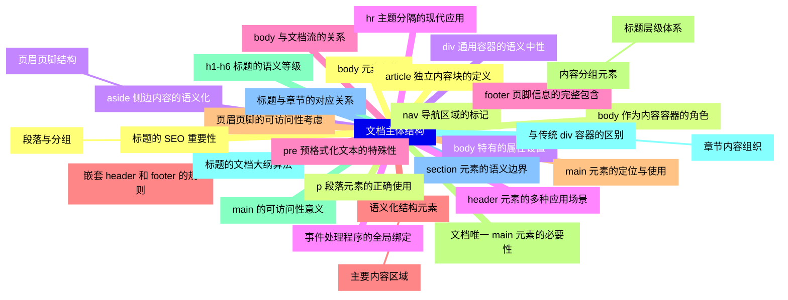
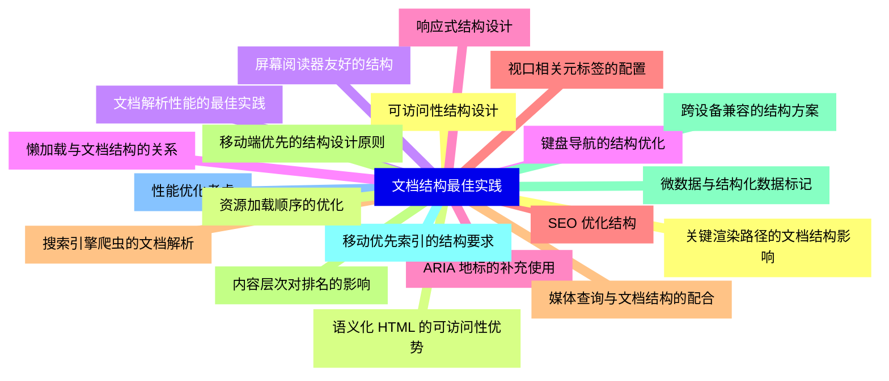
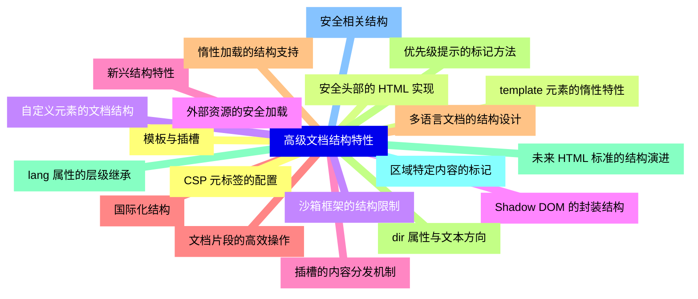


### 1 [HTML 文档基础结构](#1)
#### 1.1 [文档类型声明](#1)
#### 1.2 [DOCTYPE 声明的作用与意义](#1)
#### 1.3 [HTML5 文档类型声明](#1)
#### 1.4 [历史版本文档类型声明对比](#1)
#### 1.5 [文档类型对浏览器渲染模式的影响](#1)
#### 1.6 [HTML 根元素](#1)
#### 1.7 [html 元素的基本属性](#1)
#### 1.8 [lang 属性的设置与国际化](#1)
#### 1.9 [xmlns 命名空间声明](#1)
#### 1.10 [根元素的语义化意义](#1)
#### 1.11 [文档头部区域](#1)
##### 1.11.1 [head 元素概述](#1)
#### 1.12 [head 元素的必需性](#1)
#### 1.13 [head 与 body 的关系](#1)
#### 1.14 [head 元素的子元素限制](#1)
##### 1.14.1 [字符编码声明](#1)
#### 1.15 [meta charset 声明的重要性](#1)
#### 1.16 [常见字符编码格式](#1)
#### 1.17 [编码声明的最佳实践](#1)
#### 1.18 [编码问题排查方法](#1)
##### 1.18.1 [视口设置](#1)
#### 1.19 [viewport meta 标签的作用](#1)
#### 1.20 [响应式设计中的视口配置](#1)
#### 1.21 [移动端适配的视口设置](#1)
#### 1.22 [视口属性的详细参数](#1)
##### 1.22.1 [文档标题](#1)
#### 1.23 [title 元素的语义意义](#1)
#### 1.24 [SEO 优化中的标题设置](#1)
#### 1.25 [标题长度限制与最佳实践](#1)
#### 1.26 [多页面标题管理策略](#1)
### 2 [文档元信息详解](#2)
#### 2.1 [meta 元素全面解析](#2)
##### 2.1.1 [标准元数据属性](#2)
#### 2.2 [name 和 content 属性组合](#2)
#### 2.3 [description 描述的编写技巧](#2)
#### 2.4 [keywords 关键词的现代应用](#2)
#### 2.5 [author 和 viewport 等常用元数据](#2)
##### 2.5.1 [HTTP 等效元数据](#2)
#### 2.6 [http-equiv 属性的作用机制](#2)
#### 2.7 [缓存控制相关设置](#2)
#### 2.8 [内容安全策略声明](#2)
#### 2.9 [页面刷新与重定向](#2)
#### 2.10 [链接关系定义](#2)
##### 2.10.1 [link 元素核心功能](#2)
#### 2.11 [外部样式表链接](#2)
#### 2.12 [网站图标设置](#2)
#### 2.13 [预加载资源优化](#2)
#### 2.14 [DNS 预解析配置](#2)
##### 2.14.1 [关系类型详解](#2)
#### 2.15 [rel 属性的各种取值](#2)
#### 2.16 [canonical 链接的关系](#2)
#### 2.17 [alternate 多版本页面](#2)
#### 2.18 [搜索引擎相关链接关系](#2)
#### 2.19 [脚本与样式声明](#2)
##### 2.19.1 [script 元素配置](#2)
#### 2.20 [脚本加载位置选择](#2)
#### 2.21 [async 和 defer 属性区别](#2)
#### 2.22 [模块化脚本的 type 设置](#2)
#### 2.23 [外部脚本与内联脚本](#2)
##### 2.23.1 [style 元素应用](#2)
#### 2.24 [内联样式的使用场景](#2)
#### 2.25 [样式的作用域限制](#2)
#### 2.26 [媒体查询在 style 中的使用](#2)
#### 2.27 [样式阻塞渲染的影响](#2)
### 3 [文档主体结构](#3)
#### 3.1 [body 元素架构](#3)
#### 3.2 [body 作为内容容器的角色](#3)
#### 3.3 [body 特有的属性设置](#3)
#### 3.4 [事件处理程序的全局绑定](#3)
#### 3.5 [body 与文档流的关系](#3)
#### 3.6 [语义化结构元素](#3)
##### 3.6.1 [主要内容区域](#3)
#### 3.7 [main 元素的定位与使用](#3)
#### 3.8 [文档唯一 main 元素的必要性](#3)
#### 3.9 [main 的可访问性意义](#3)
#### 3.10 [与传统 div 容器的区别](#3)
##### 3.10.1 [章节内容组织](#3)
#### 3.11 [section 元素的语义边界](#3)
#### 3.12 [article 独立内容块的定义](#3)
#### 3.13 [nav 导航区域的标记](#3)
#### 3.14 [aside 侧边内容的语义化](#3)
##### 3.14.1 [页眉页脚结构](#3)
#### 3.15 [header 元素的多种应用场景](#3)
#### 3.16 [footer 页脚信息的完整包含](#3)
#### 3.17 [嵌套 header 和 footer 的规则](#3)
#### 3.18 [页眉页脚的可访问性考虑](#3)
#### 3.19 [内容分组元素](#3)
##### 3.19.1 [标题层级体系](#3)
#### 3.20 [h1-h6 标题的语义等级](#3)
#### 3.21 [标题的文档大纲算法](#3)
#### 3.22 [标题与章节的对应关系](#3)
#### 3.23 [标题的 SEO 重要性](#3)
##### 3.23.1 [段落与分组](#3)
#### 3.24 [p 段落元素的正确使用](#3)
#### 3.25 [div 通用容器的语义中性](#3)
#### 3.26 [hr 主题分隔的现代应用](#3)
#### 3.27 [pre 预格式化文本的特殊性](#3)
### 4 [文档结构最佳实践](#4)
#### 4.1 [可访问性结构设计](#4)
#### 4.2 [语义化 HTML 的可访问性优势](#4)
#### 4.3 [屏幕阅读器友好的结构](#4)
#### 4.4 [键盘导航的结构优化](#4)
#### 4.5 [ARIA 地标的补充使用](#4)
#### 4.6 [SEO 优化结构](#4)
#### 4.7 [搜索引擎爬虫的文档解析](#4)
#### 4.8 [内容层次对排名的影响](#4)
#### 4.9 [微数据与结构化数据标记](#4)
#### 4.10 [移动优先索引的结构要求](#4)
#### 4.11 [性能优化考虑](#4)
#### 4.12 [关键渲染路径的文档结构影响](#4)
#### 4.13 [资源加载顺序的优化](#4)
#### 4.14 [文档解析性能的最佳实践](#4)
#### 4.15 [懒加载与文档结构的关系](#4)
#### 4.16 [响应式结构设计](#4)
#### 4.17 [视口相关元标签的配置](#4)
#### 4.18 [媒体查询与文档结构的配合](#4)
#### 4.19 [移动端优先的结构设计原则](#4)
#### 4.20 [跨设备兼容的结构方案](#4)
### 5 [高级文档结构特性](#5)
#### 5.1 [模板与插槽](#5)
#### 5.2 [template 元素的惰性特性](#5)
#### 5.3 [自定义元素的文档结构](#5)
#### 5.4 [Shadow DOM 的封装结构](#5)
#### 5.5 [插槽的内容分发机制](#5)
#### 5.6 [国际化结构](#5)
#### 5.7 [多语言文档的结构设计](#5)
#### 5.8 [dir 属性与文本方向](#5)
#### 5.9 [lang 属性的层级继承](#5)
#### 5.10 [区域特定内容的标记](#5)
#### 5.11 [安全相关结构](#5)
#### 5.12 [CSP 元标签的配置](#5)
#### 5.13 [安全头部的 HTML 实现](#5)
#### 5.14 [沙箱框架的结构限制](#5)
#### 5.15 [外部资源的安全加载](#5)
#### 5.16 [新兴结构特性](#5)
#### 5.17 [文档片段的高效操作](#5)
#### 5.18 [惰性加载的结构支持](#5)
#### 5.19 [优先级提示的标记方法](#5)
#### 5.20 [未来 HTML 标准的结构演进](#5)




### 1 HTML 文档基础结构

---
### 1 HTML 文档基础结构
___
#### 1.1 文档类型声明
___
#### 1.2 DOCTYPE 声明的作用与意义
___
#### 1.3 HTML5 文档类型声明
___
#### 1.4 历史版本文档类型声明对比
___
#### 1.5 文档类型对浏览器渲染模式的影响
___
#### 1.6 HTML 根元素
___
#### 1.7 html 元素的基本属性
___
#### 1.8 lang 属性的设置与国际化
___
#### 1.9 xmlns 命名空间声明
___
#### 1.10 根元素的语义化意义
___
#### 1.11 文档头部区域
___
##### 1.11.1 head 元素概述
___
#### 1.12 head 元素的必需性
___
#### 1.13 head 与 body 的关系
___
#### 1.14 head 元素的子元素限制
___
##### 1.14.1 字符编码声明
___
#### 1.15 meta charset 声明的重要性
___
#### 1.16 常见字符编码格式
___
#### 1.17 编码声明的最佳实践
___
#### 1.18 编码问题排查方法
___
##### 1.18.1 视口设置
___
#### 1.19 viewport meta 标签的作用
___
#### 1.20 响应式设计中的视口配置
___
#### 1.21 移动端适配的视口设置
___
#### 1.22 视口属性的详细参数
___
##### 1.22.1 文档标题
___
#### 1.23 title 元素的语义意义
___
#### 1.24 SEO 优化中的标题设置
___
#### 1.25 标题长度限制与最佳实践
___
#### 1.26 多页面标题管理策略
### 2 文档元信息详解

---
### 2 文档元信息详解
___
#### 2.1 meta 元素全面解析
___
##### 2.1.1 标准元数据属性
___
#### 2.2 name 和 content 属性组合
___
#### 2.3 description 描述的编写技巧
___
#### 2.4 keywords 关键词的现代应用
___
#### 2.5 author 和 viewport 等常用元数据
___
##### 2.5.1 HTTP 等效元数据
___
#### 2.6 http-equiv 属性的作用机制
___
#### 2.7 缓存控制相关设置
___
#### 2.8 内容安全策略声明
___
#### 2.9 页面刷新与重定向
___
#### 2.10 链接关系定义
___
##### 2.10.1 link 元素核心功能
___
#### 2.11 外部样式表链接
___
#### 2.12 网站图标设置
___
#### 2.13 预加载资源优化
___
#### 2.14 DNS 预解析配置
___
##### 2.14.1 关系类型详解
___
#### 2.15 rel 属性的各种取值
___
#### 2.16 canonical 链接的关系
___
#### 2.17 alternate 多版本页面
___
#### 2.18 搜索引擎相关链接关系
___
#### 2.19 脚本与样式声明
___
##### 2.19.1 script 元素配置
___
#### 2.20 脚本加载位置选择
___
#### 2.21 async 和 defer 属性区别
___
#### 2.22 模块化脚本的 type 设置
___
#### 2.23 外部脚本与内联脚本
___
##### 2.23.1 style 元素应用
___
#### 2.24 内联样式的使用场景
___
#### 2.25 样式的作用域限制
___
#### 2.26 媒体查询在 style 中的使用
___
#### 2.27 样式阻塞渲染的影响
### 3 文档主体结构

---
### 3 文档主体结构
___
#### 3.1 body 元素架构
___
#### 3.2 body 作为内容容器的角色
___
#### 3.3 body 特有的属性设置
___
#### 3.4 事件处理程序的全局绑定
___
#### 3.5 body 与文档流的关系
___
#### 3.6 语义化结构元素
___
##### 3.6.1 主要内容区域
___
#### 3.7 main 元素的定位与使用
___
#### 3.8 文档唯一 main 元素的必要性
___
#### 3.9 main 的可访问性意义
___
#### 3.10 与传统 div 容器的区别
___
##### 3.10.1 章节内容组织
___
#### 3.11 section 元素的语义边界
___
#### 3.12 article 独立内容块的定义
___
#### 3.13 nav 导航区域的标记
___
#### 3.14 aside 侧边内容的语义化
___
##### 3.14.1 页眉页脚结构
___
#### 3.15 header 元素的多种应用场景
___
#### 3.16 footer 页脚信息的完整包含
___
#### 3.17 嵌套 header 和 footer 的规则
___
#### 3.18 页眉页脚的可访问性考虑
___
#### 3.19 内容分组元素
___
##### 3.19.1 标题层级体系
___
#### 3.20 h1-h6 标题的语义等级
___
#### 3.21 标题的文档大纲算法
___
#### 3.22 标题与章节的对应关系
___
#### 3.23 标题的 SEO 重要性
___
##### 3.23.1 段落与分组
___
#### 3.24 p 段落元素的正确使用
___
#### 3.25 div 通用容器的语义中性
___
#### 3.26 hr 主题分隔的现代应用
___
#### 3.27 pre 预格式化文本的特殊性
### 4 文档结构最佳实践

---
### 4 文档结构最佳实践
___
#### 4.1 可访问性结构设计
___
#### 4.2 语义化 HTML 的可访问性优势
___
#### 4.3 屏幕阅读器友好的结构
___
#### 4.4 键盘导航的结构优化
___
#### 4.5 ARIA 地标的补充使用
___
#### 4.6 SEO 优化结构
___
#### 4.7 搜索引擎爬虫的文档解析
___
#### 4.8 内容层次对排名的影响
___
#### 4.9 微数据与结构化数据标记
___
#### 4.10 移动优先索引的结构要求
___
#### 4.11 性能优化考虑
___
#### 4.12 关键渲染路径的文档结构影响
___
#### 4.13 资源加载顺序的优化
___
#### 4.14 文档解析性能的最佳实践
___
#### 4.15 懒加载与文档结构的关系
___
#### 4.16 响应式结构设计
___
#### 4.17 视口相关元标签的配置
___
#### 4.18 媒体查询与文档结构的配合
___
#### 4.19 移动端优先的结构设计原则
___
#### 4.20 跨设备兼容的结构方案
### 5 高级文档结构特性

---
### 5 高级文档结构特性
___
#### 5.1 模板与插槽
___
#### 5.2 template 元素的惰性特性
___
#### 5.3 自定义元素的文档结构
___
#### 5.4 Shadow DOM 的封装结构
___
#### 5.5 插槽的内容分发机制
___
#### 5.6 国际化结构
___
#### 5.7 多语言文档的结构设计
___
#### 5.8 dir 属性与文本方向
___
#### 5.9 lang 属性的层级继承
___
#### 5.10 区域特定内容的标记
___
#### 5.11 安全相关结构
___
#### 5.12 CSP 元标签的配置
___
#### 5.13 安全头部的 HTML 实现
___
#### 5.14 沙箱框架的结构限制
___
#### 5.15 外部资源的安全加载
___
#### 5.16 新兴结构特性
___
#### 5.17 文档片段的高效操作
___
#### 5.18 惰性加载的结构支持
___
#### 5.19 优先级提示的标记方法
___
#### 5.20 未来 HTML 标准的结构演进


### 1 HTML 文档基础结构{#1}

{}

<--->
{}
{}
{}
{}
{}
{}
{}
{}
{}
{}
{}
{}
{}
{}
{}
{}
{}
{}
{}
{}
{}
{}
{}
{}
{}
{}
{}
{}
{}
{}
{}
{}
{}
{}
{}
{}
{}
{}
{}
{}
{}
{}
{}
{}
{}
{}
{}
{}
{}
{}
{}
{}
{}
{}
{}
{}
{}
{}
{}
{}
{}

### 2 文档元信息详解{#2}

{}
{}
{}
{}
{}
{}
{}
{}
{}
{}
{}
{}
{}
{}
{}
{}
{}
{}
{}
{}
{}
{}
{}
{}
{}
{}
{}
{}
{}
{}
{}
{}
{}
{}
{}
{}
{}
{}
{}
{}
{}
{}
{}
{}
{}
{}
{}
{}
{}
{}
{}
{}
{}
{}
{}
{}
{}
{}
{}
{}
{}
{}
{}
{}
{}
{}
{}
<--->

{}

### 3 文档主体结构{#3}

{}

<--->
{}
{}
{}
{}
{}
{}
{}
{}
{}
{}
{}
{}
{}
{}
{}
{}
{}
{}
{}
{}
{}
{}
{}
{}
{}
{}
{}
{}
{}
{}
{}
{}
{}
{}
{}
{}
{}
{}
{}
{}
{}
{}
{}
{}
{}
{}
{}
{}
{}
{}
{}
{}
{}
{}
{}
{}
{}
{}
{}
{}
{}
{}
{}
{}
{}

### 4 文档结构最佳实践{#4}

{}
{}
{}
{}
{}
{}
{}
{}
{}
{}
{}
{}
{}
{}
{}
{}
{}
{}
{}
{}
{}
{}
{}
{}
{}
{}
{}
{}
{}
{}
{}
{}
{}
{}
{}
{}
{}
{}
{}
{}
{}
<--->

{}

### 5 高级文档结构特性{#5}

{}

<--->
{}
{}
{}
{}
{}
{}
{}
{}
{}
{}
{}
{}
{}
{}
{}
{}
{}
{}
{}
{}
{}
{}
{}
{}
{}
{}
{}
{}
{}
{}
{}
{}
{}
{}
{}
{}
{}
{}
{}
{}
{}
