
### 1 [HTML 文本元素基础概念](#1)
#### 1.1 [HTML 文本元素定义](#1)
##### 1.1.1 [文本元素的基本概念](#1)
##### 1.1.2 [文本元素在网页中的作用](#1)
##### 1.1.3 [文本元素的分类体系](#1)
#### 1.2 [HTML 文档结构](#1)
##### 1.2.1 [DOCTYPE 声明](#1)
##### 1.2.2 [html 根元素](#1)
##### 1.2.3 [head 与 body 部分](#1)
### 2 [标题与段落元素](#2)
#### 2.1 [标题元素](#2)
##### 2.1.1 [h1-h6 标题标签](#2)
##### 2.1.2 [标题的语义化意义](#2)
##### 2.1.3 [标题的嵌套规则](#2)
#### 2.2 [段落元素](#2)
##### 2.2.1 [p 标签的基本用法](#2)
##### 2.2.2 [段落的换行与空格处理](#2)
##### 2.2.3 [段落的内联元素嵌套](#2)
### 3 [文本格式化元素](#3)
#### 3.1 [物理样式元素](#3)
##### 3.1.1 [b 粗体标签](#3)
##### 3.1.2 [i 斜体标签](#3)
##### 3.1.3 [u 下划线标签](#3)
##### 3.1.4 [s 删除线标签](#3)
#### 3.2 [语义化样式元素](#3)
##### 3.2.1 [strong 强调标签](#3)
##### 3.2.2 [em 着重标签](#3)
##### 3.2.3 [mark 标记标签](#3)
##### 3.2.4 [small 小号文本标签](#3)
#### 3.3 [引用与代码元素](#3)
##### 3.3.1 [blockquote 块级引用](#3)
##### 3.3.2 [q 行内引用](#3)
##### 3.3.3 [code 代码片段](#3)
##### 3.3.4 [pre 预格式化文本](#3)
### 4 [列表元素](#4)
#### 4.1 [无序列表](#4)
##### 4.1.1 [ul 无序列表标签](#4)
##### 4.1.2 [li 列表项标签](#4)
##### 4.1.3 [无序列表的嵌套](#4)
#### 4.2 [有序列表](#4)
##### 4.2.1 [ol 有序列表标签](#4)
##### 4.2.2 [有序列表的序号类型](#4)
##### 4.2.3 [有序列表的起始值](#4)
#### 4.3 [定义列表](#4)
##### 4.3.1 [dl 定义列表标签](#4)
##### 4.3.2 [dt 定义术语标签](#4)
##### 4.3.3 [dd 定义描述标签](#4)
### 5 [超链接与锚点](#5)
#### 5.1 [超链接元素](#5)
##### 5.1.1 [a 链接标签](#5)
##### 5.1.2 [href 属性详解](#5)
##### 5.1.3 [target 目标属性](#5)
##### 5.1.4 [相对路径与绝对路径](#5)
#### 5.2 [锚点功能](#5)
##### 5.2.1 [页面内跳转](#5)
##### 5.2.2 [跨页面跳转](#5)
##### 5.2.3 [邮件与电话链接](#5)
### 6 [文本语义化元素](#6)
#### 6.1 [时间与日期](#6)
##### 6.1.1 [time 时间标签](#6)
##### 6.1.2 [datetime 属性格式](#6)
#### 6.2 [缩写与术语](#6)
##### 6.2.1 [abbr 缩写标签](#6)
##### 6.2.2 [dfn 定义术语标签](#6)
#### 6.3 [其他语义化元素](#6)
##### 6.3.1 [cite 引用来源](#6)
##### 6.3.2 [address 联系信息](#6)
##### 6.3.3 [ins 与 del 修改标记](#6)
### 7 [特殊文本元素](#7)
#### 7.1 [换行与水平线](#7)
##### 7.1.1 [br 换行标签](#7)
##### 7.1.2 [hr 水平线标签](#7)
#### 7.2 [上下标元素](#7)
##### 7.2.1 [sup 上标标签](#7)
##### 7.2.2 [sub 下标标签](#7)
#### 7.3 [特殊字符实体](#7)
##### 7.3.1 [HTML 实体概述](#7)
##### 7.3.2 [常用字符实体](#7)
##### 7.3.3 [数学符号实体](#7)
### 8 [文本元素的属性](#8)
#### 8.1 [全局属性](#8)
##### 8.1.1 [class 与 id](#8)
##### 8.1.2 [style 内联样式](#8)
##### 8.1.3 [title 提示文本](#8)
##### 8.1.4 [lang 语言属性](#8)
#### 8.2 [事件属性](#8)
##### 8.2.1 [onclick 点击事件](#8)
##### 8.2.2 [onmouseover 鼠标悬停](#8)
##### 8.2.3 [其他常用事件](#8)
### 9 [文本元素的最佳实践](#9)
#### 9.1 [语义化使用原则](#9)
##### 9.1.1 [选择合适的语义标签](#9)
##### 9.1.2 [避免滥用 div 和 span](#9)
##### 9.1.3 [可访问性考虑](#9)
#### 9.2 [SEO 优化](#9)
##### 9.2.1 [标题层级优化](#9)
##### 9.2.2 [关键词合理分布](#9)
##### 9.2.3 [语义化对 SEO 的影响](#9)
#### 9.3 [性能优化](#9)
##### 9.3.1 [减少不必要的标签](#9)
##### 9.3.2 [合理的文本结构](#9)
##### 9.3.3 [代码压缩与优化](#9)
### 10 [HTML5 新增文本元素](#10)
#### 10.1 [语义化增强元素](#10)
##### 10.1.1 [article 文章内容](#10)
##### 10.1.2 [section 文档分区](#10)
##### 10.1.3 [header 与 footer](#10)
#### 10.2 [文本相关新特性](#10)
##### 10.2.1 [新的输入类型](#10)
##### 10.2.2 [内容可编辑属性](#10)
##### 10.2.3 [数据属性使用](#10)
### 11 [文本元素的样式控制](#11)
#### 11.1 [CSS 基础样式](#11)
##### 11.1.1 [字体属性控制](#11)
##### 11.1.2 [颜色与背景](#11)
##### 11.1.3 [文本对齐与间距](#11)
#### 11.2 [响应式文本设计](#11)
##### 11.2.1 [媒体查询应用](#11)
##### 11.2.2 [相对单位使用](#11)
##### 11.2.3 [移动端适配](#11)
### 12 [文本元素的兼容性](#12)
#### 12.1 [浏览器兼容性](#12)
##### 12.1.1 [主流浏览器支持](#12)
##### 12.1.2 [兼容性处理技巧](#12)
##### 12.1.3 [渐进增强策略](#12)
#### 12.2 [设备兼容性](#12)
##### 12.2.1 [移动设备适配](#12)
##### 12.2.2 [屏幕阅读器支持](#12)
##### 12.2.3 [打印样式优化](#12)




### 1 HTML 文本元素基础概念

---
### 1 HTML 文本元素基础概念
___
#### 1.1 HTML 文本元素定义
___
##### 1.1.1 文本元素的基本概念
___
##### 1.1.2 文本元素在网页中的作用
___
##### 1.1.3 文本元素的分类体系
___
#### 1.2 HTML 文档结构
___
##### 1.2.1 DOCTYPE 声明
___
##### 1.2.2 html 根元素
___
##### 1.2.3 head 与 body 部分
### 2 标题与段落元素

---
### 2 标题与段落元素
___
#### 2.1 标题元素
___
##### 2.1.1 h1-h6 标题标签
___
##### 2.1.2 标题的语义化意义
___
##### 2.1.3 标题的嵌套规则
___
#### 2.2 段落元素
___
##### 2.2.1 p 标签的基本用法
___
##### 2.2.2 段落的换行与空格处理
___
##### 2.2.3 段落的内联元素嵌套
### 3 文本格式化元素

---
### 3 文本格式化元素
___
#### 3.1 物理样式元素
___
##### 3.1.1 b 粗体标签
___
##### 3.1.2 i 斜体标签
___
##### 3.1.3 u 下划线标签
___
##### 3.1.4 s 删除线标签
___
#### 3.2 语义化样式元素
___
##### 3.2.1 strong 强调标签
___
##### 3.2.2 em 着重标签
___
##### 3.2.3 mark 标记标签
___
##### 3.2.4 small 小号文本标签
___
#### 3.3 引用与代码元素
___
##### 3.3.1 blockquote 块级引用
___
##### 3.3.2 q 行内引用
___
##### 3.3.3 code 代码片段
___
##### 3.3.4 pre 预格式化文本
### 4 列表元素

---
### 4 列表元素
___
#### 4.1 无序列表
___
##### 4.1.1 ul 无序列表标签
___
##### 4.1.2 li 列表项标签
___
##### 4.1.3 无序列表的嵌套
___
#### 4.2 有序列表
___
##### 4.2.1 ol 有序列表标签
___
##### 4.2.2 有序列表的序号类型
___
##### 4.2.3 有序列表的起始值
___
#### 4.3 定义列表
___
##### 4.3.1 dl 定义列表标签
___
##### 4.3.2 dt 定义术语标签
___
##### 4.3.3 dd 定义描述标签
### 5 超链接与锚点

---
### 5 超链接与锚点
___
#### 5.1 超链接元素
___
##### 5.1.1 a 链接标签
___
##### 5.1.2 href 属性详解
___
##### 5.1.3 target 目标属性
___
##### 5.1.4 相对路径与绝对路径
___
#### 5.2 锚点功能
___
##### 5.2.1 页面内跳转
___
##### 5.2.2 跨页面跳转
___
##### 5.2.3 邮件与电话链接
### 6 文本语义化元素

---
### 6 文本语义化元素
___
#### 6.1 时间与日期
___
##### 6.1.1 time 时间标签
___
##### 6.1.2 datetime 属性格式
___
#### 6.2 缩写与术语
___
##### 6.2.1 abbr 缩写标签
___
##### 6.2.2 dfn 定义术语标签
___
#### 6.3 其他语义化元素
___
##### 6.3.1 cite 引用来源
___
##### 6.3.2 address 联系信息
___
##### 6.3.3 ins 与 del 修改标记
### 7 特殊文本元素

---
### 7 特殊文本元素
___
#### 7.1 换行与水平线
___
##### 7.1.1 br 换行标签
___
##### 7.1.2 hr 水平线标签
___
#### 7.2 上下标元素
___
##### 7.2.1 sup 上标标签
___
##### 7.2.2 sub 下标标签
___
#### 7.3 特殊字符实体
___
##### 7.3.1 HTML 实体概述
___
##### 7.3.2 常用字符实体
___
##### 7.3.3 数学符号实体
### 8 文本元素的属性

---
### 8 文本元素的属性
___
#### 8.1 全局属性
___
##### 8.1.1 class 与 id
___
##### 8.1.2 style 内联样式
___
##### 8.1.3 title 提示文本
___
##### 8.1.4 lang 语言属性
___
#### 8.2 事件属性
___
##### 8.2.1 onclick 点击事件
___
##### 8.2.2 onmouseover 鼠标悬停
___
##### 8.2.3 其他常用事件
### 9 文本元素的最佳实践

---
### 9 文本元素的最佳实践
___
#### 9.1 语义化使用原则
___
##### 9.1.1 选择合适的语义标签
___
##### 9.1.2 避免滥用 div 和 span
___
##### 9.1.3 可访问性考虑
___
#### 9.2 SEO 优化
___
##### 9.2.1 标题层级优化
___
##### 9.2.2 关键词合理分布
___
##### 9.2.3 语义化对 SEO 的影响
___
#### 9.3 性能优化
___
##### 9.3.1 减少不必要的标签
___
##### 9.3.2 合理的文本结构
___
##### 9.3.3 代码压缩与优化
### 10 HTML5 新增文本元素

---
### 10 HTML5 新增文本元素
___
#### 10.1 语义化增强元素
___
##### 10.1.1 article 文章内容
___
##### 10.1.2 section 文档分区
___
##### 10.1.3 header 与 footer
___
#### 10.2 文本相关新特性
___
##### 10.2.1 新的输入类型
___
##### 10.2.2 内容可编辑属性
___
##### 10.2.3 数据属性使用
### 11 文本元素的样式控制

---
### 11 文本元素的样式控制
___
#### 11.1 CSS 基础样式
___
##### 11.1.1 字体属性控制
___
##### 11.1.2 颜色与背景
___
##### 11.1.3 文本对齐与间距
___
#### 11.2 响应式文本设计
___
##### 11.2.1 媒体查询应用
___
##### 11.2.2 相对单位使用
___
##### 11.2.3 移动端适配
### 12 文本元素的兼容性

---
### 12 文本元素的兼容性
___
#### 12.1 浏览器兼容性
___
##### 12.1.1 主流浏览器支持
___
##### 12.1.2 兼容性处理技巧
___
##### 12.1.3 渐进增强策略
___
#### 12.2 设备兼容性
___
##### 12.2.1 移动设备适配
___
##### 12.2.2 屏幕阅读器支持
___
##### 12.2.3 打印样式优化


### 1 HTML 文本元素基础概念{#1}

{}
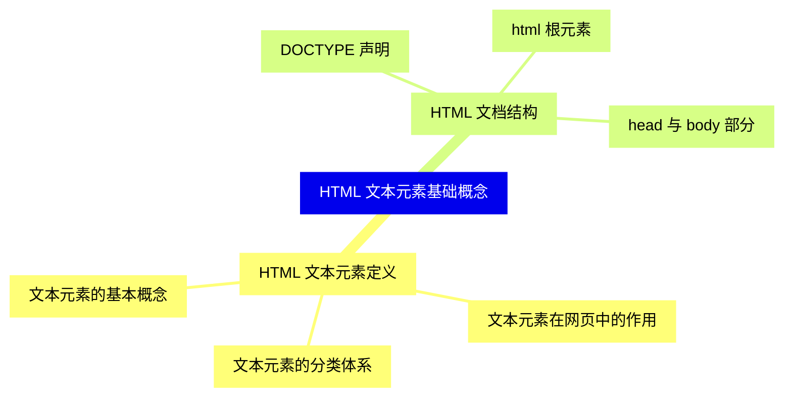

<--->
{}
{}
{}
{}
{}
{}
{}
{}
{}
{}
{}
{}
{}
{}
{}
{}
{}

### 2 标题与段落元素{#2}

{}
{}
{}
{}
{}
{}
{}
{}
{}
{}
{}
{}
{}
{}
{}
{}
{}
<--->
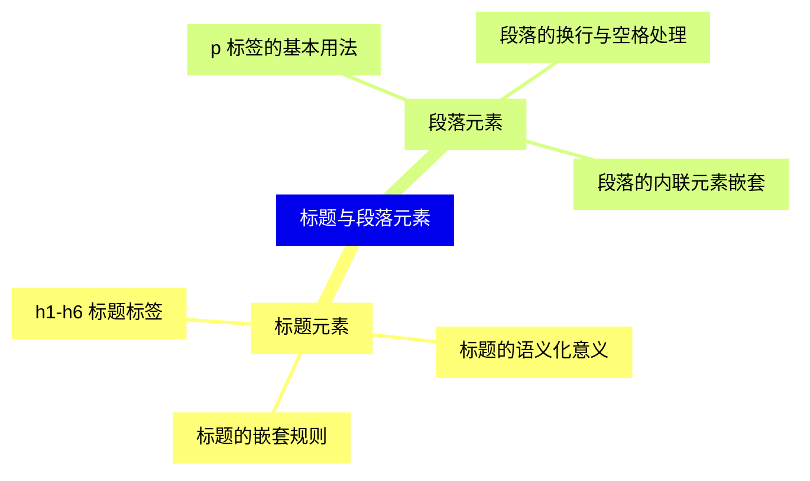

{}

### 3 文本格式化元素{#3}

{}
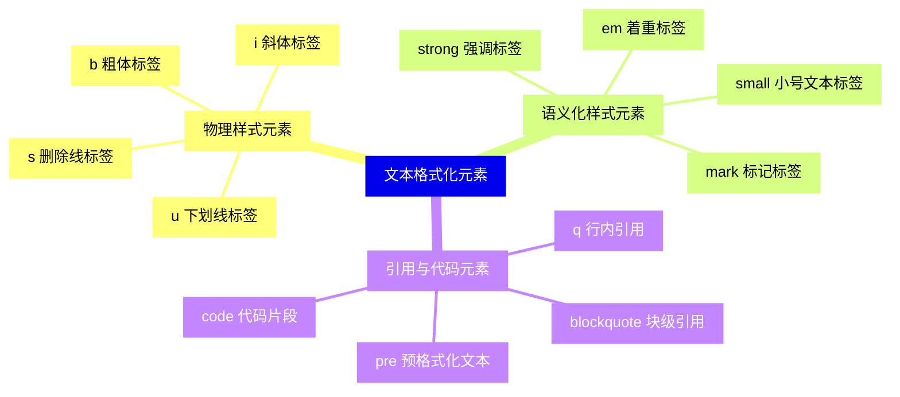

<--->
{}
{}
{}
{}
{}
{}
{}
{}
{}
{}
{}
{}
{}
{}
{}
{}
{}
{}
{}
{}
{}
{}
{}
{}
{}
{}
{}
{}
{}
{}
{}

### 4 列表元素{#4}

{}
{}
{}
{}
{}
{}
{}
{}
{}
{}
{}
{}
{}
{}
{}
{}
{}
{}
{}
{}
{}
{}
{}
{}
{}
<--->
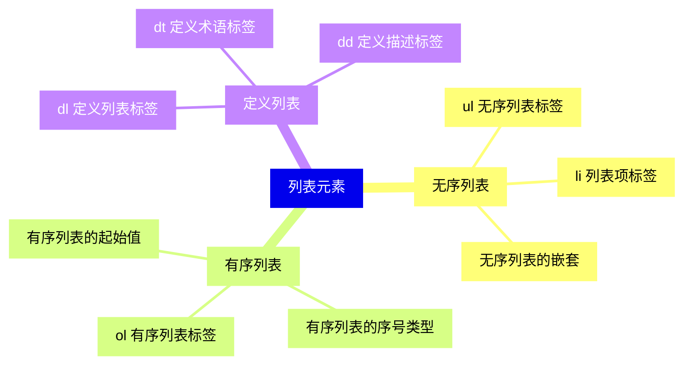

{}

### 5 超链接与锚点{#5}

{}
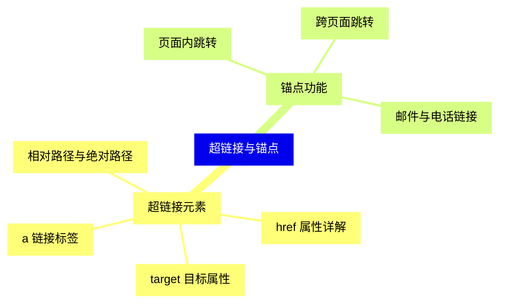

<--->
{}
{}
{}
{}
{}
{}
{}
{}
{}
{}
{}
{}
{}
{}
{}
{}
{}
{}
{}

### 6 文本语义化元素{#6}

{}
{}
{}
{}
{}
{}
{}
{}
{}
{}
{}
{}
{}
{}
{}
{}
{}
{}
{}
{}
{}
<--->
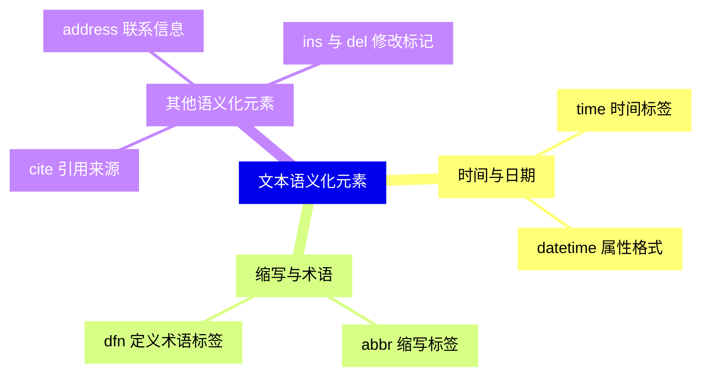

{}

### 7 特殊文本元素{#7}

{}
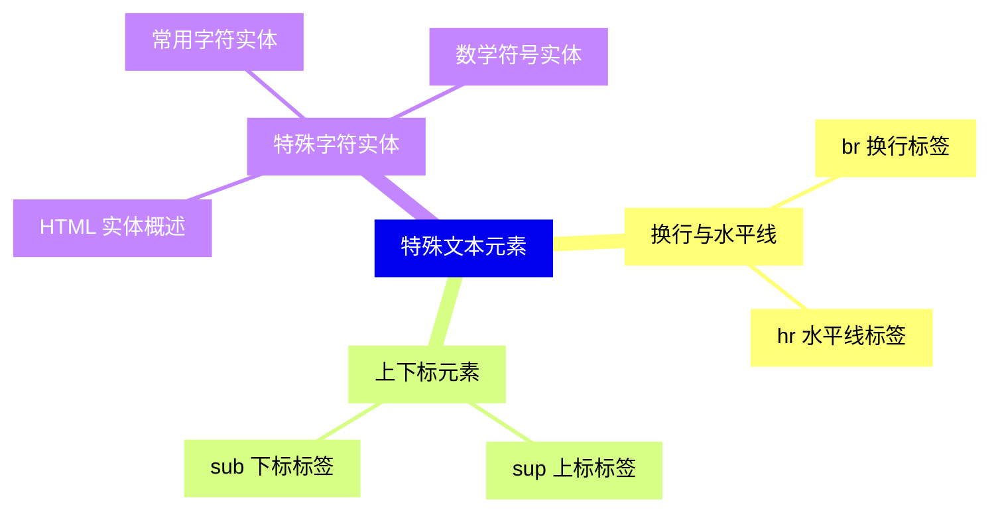

<--->
{}
{}
{}
{}
{}
{}
{}
{}
{}
{}
{}
{}
{}
{}
{}
{}
{}
{}
{}
{}
{}

### 8 文本元素的属性{#8}

{}
{}
{}
{}
{}
{}
{}
{}
{}
{}
{}
{}
{}
{}
{}
{}
{}
{}
{}
<--->
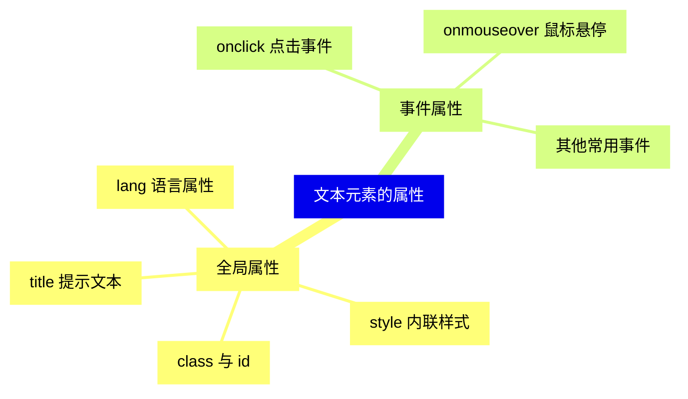

{}

### 9 文本元素的最佳实践{#9}

{}
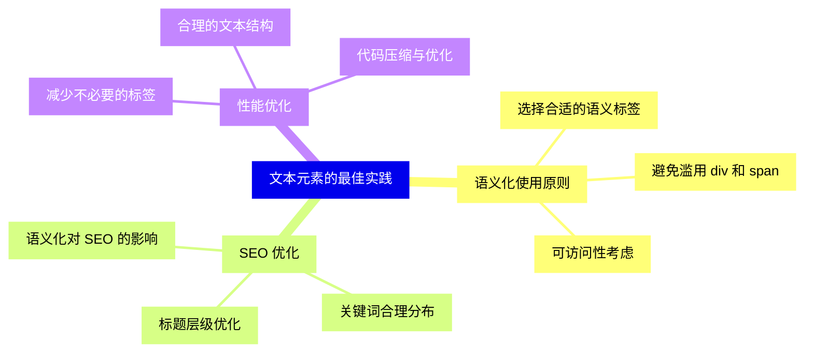

<--->
{}
{}
{}
{}
{}
{}
{}
{}
{}
{}
{}
{}
{}
{}
{}
{}
{}
{}
{}
{}
{}
{}
{}
{}
{}

### 10 HTML5 新增文本元素{#10}

{}
{}
{}
{}
{}
{}
{}
{}
{}
{}
{}
{}
{}
{}
{}
{}
{}
<--->
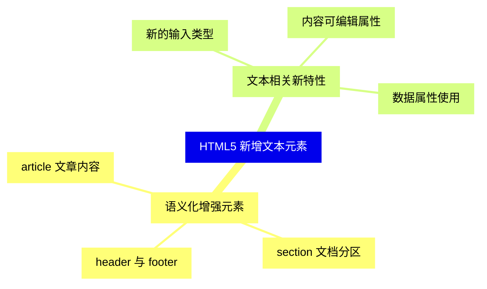

{}

### 11 文本元素的样式控制{#11}

{}
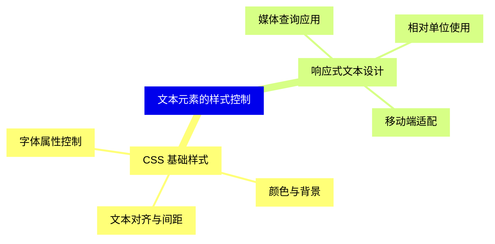

<--->
{}
{}
{}
{}
{}
{}
{}
{}
{}
{}
{}
{}
{}
{}
{}
{}
{}

### 12 文本元素的兼容性{#12}

{}
{}
{}
{}
{}
{}
{}
{}
{}
{}
{}
{}
{}
{}
{}
{}
{}
<--->
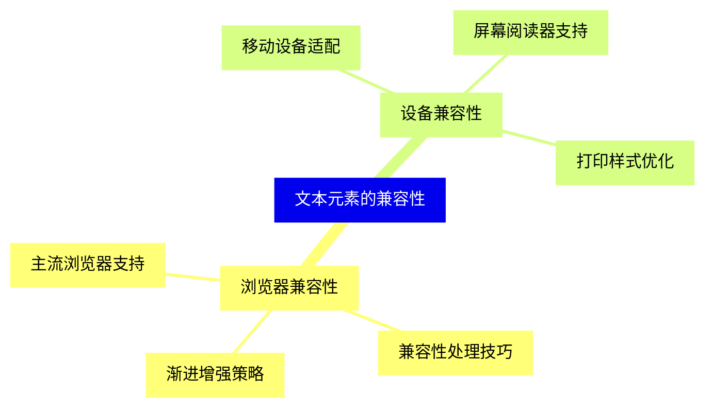

{}
