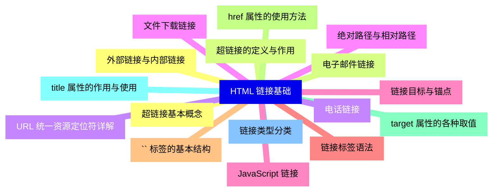
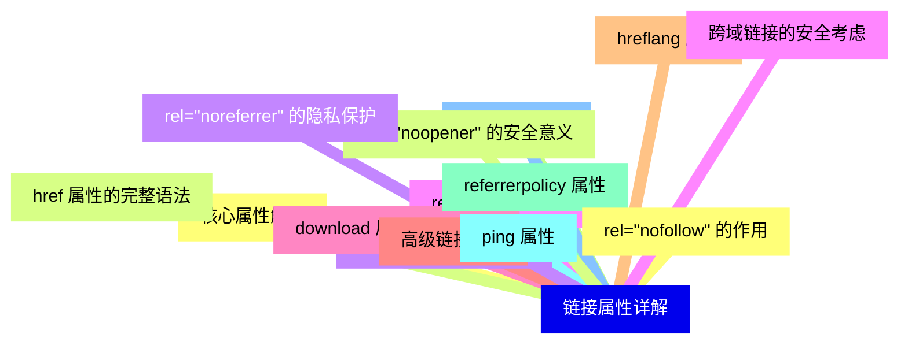
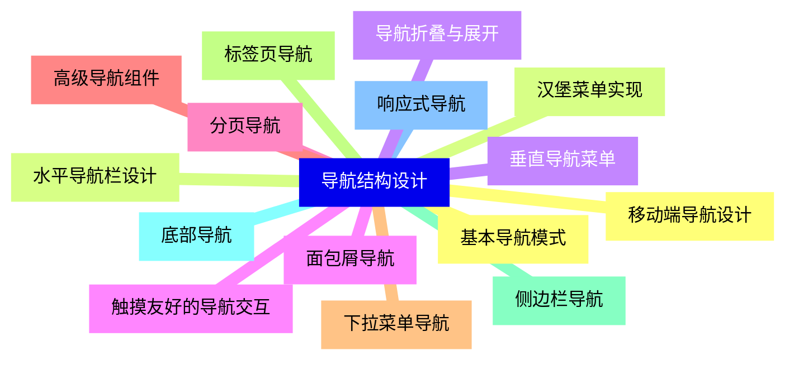
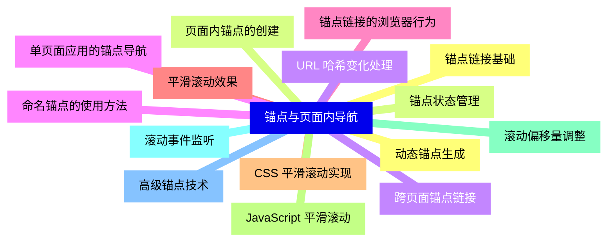
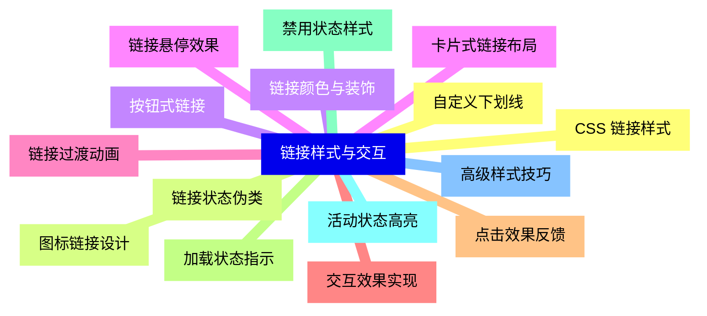
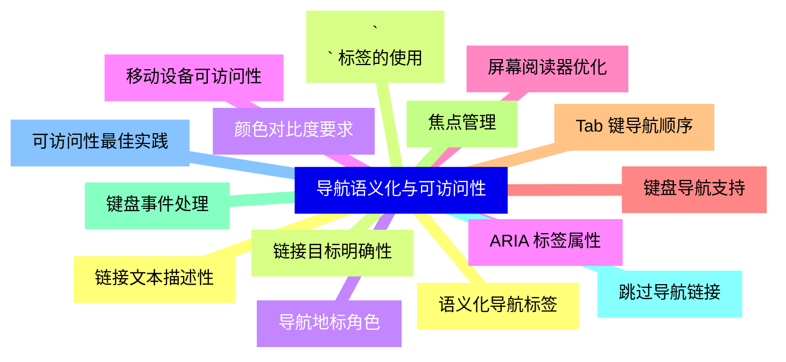
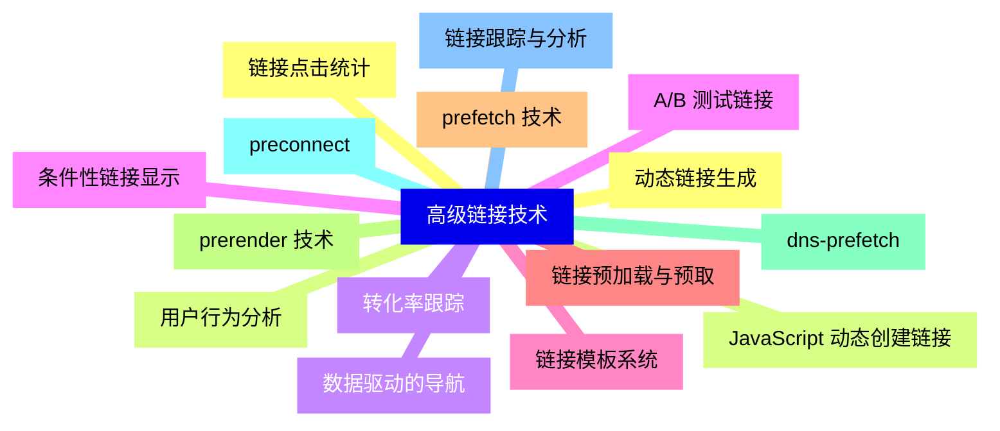
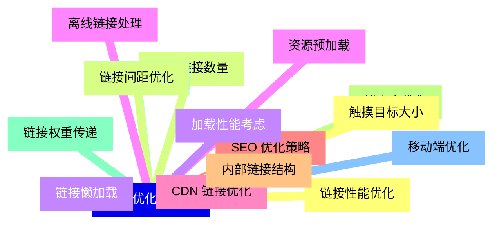
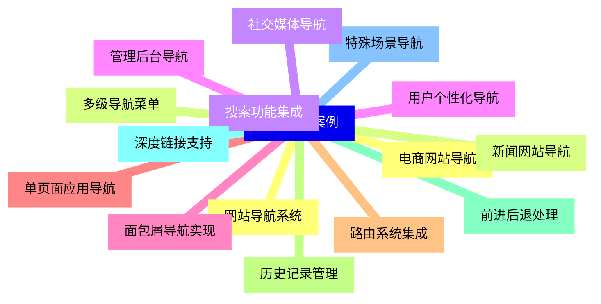
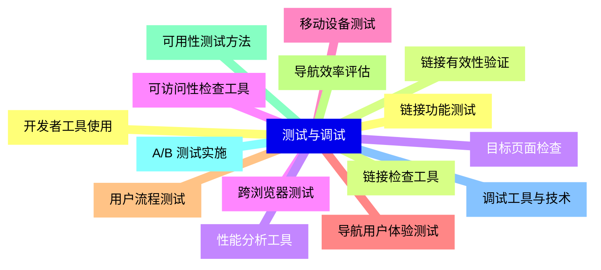


### 1 [HTML 链接基础](#1)
#### 1.1 [超链接基本概念](#1)
#### 1.2 [超链接的定义与作用](#1)
#### 1.3 [URL 统一资源定位符详解](#1)
#### 1.4 [绝对路径与相对路径](#1)
#### 1.5 [链接目标与锚点](#1)
#### 1.6 [链接标签语法](#1)
#### 1.7 [`<a>` 标签的基本结构](#1)
#### 1.8 [href 属性的使用方法](#1)
#### 1.9 [target 属性的各种取值](#1)
#### 1.10 [title 属性的作用与使用](#1)
#### 1.11 [链接类型分类](#1)
#### 1.12 [外部链接与内部链接](#1)
#### 1.13 [电子邮件链接](#1)
#### 1.14 [电话链接](#1)
#### 1.15 [文件下载链接](#1)
#### 1.16 [JavaScript 链接](#1)
### 2 [链接属性详解](#2)
#### 2.1 [核心属性解析](#2)
#### 2.2 [href 属性的完整语法](#2)
#### 2.3 [target 属性的详细说明](#2)
#### 2.4 [rel 属性的各种取值](#2)
#### 2.5 [download 属性的使用方法](#2)
#### 2.6 [高级链接属性](#2)
#### 2.7 [hreflang 属性](#2)
#### 2.8 [type 属性](#2)
#### 2.9 [referrerpolicy 属性](#2)
#### 2.10 [ping 属性](#2)
#### 2.11 [链接安全属性](#2)
#### 2.12 [rel="nofollow" 的作用](#2)
#### 2.13 [rel="noopener" 的安全意义](#2)
#### 2.14 [rel="noreferrer" 的隐私保护](#2)
#### 2.15 [跨域链接的安全考虑](#2)
### 3 [导航结构设计](#3)
#### 3.1 [基本导航模式](#3)
#### 3.2 [水平导航栏设计](#3)
#### 3.3 [垂直导航菜单](#3)
#### 3.4 [面包屑导航](#3)
#### 3.5 [分页导航](#3)
#### 3.6 [高级导航组件](#3)
#### 3.7 [下拉菜单导航](#3)
#### 3.8 [标签页导航](#3)
#### 3.9 [侧边栏导航](#3)
#### 3.10 [底部导航](#3)
#### 3.11 [响应式导航](#3)
#### 3.12 [移动端导航设计](#3)
#### 3.13 [汉堡菜单实现](#3)
#### 3.14 [导航折叠与展开](#3)
#### 3.15 [触摸友好的导航交互](#3)
### 4 [锚点与页面内导航](#4)
#### 4.1 [锚点链接基础](#4)
#### 4.2 [页面内锚点的创建](#4)
#### 4.3 [跨页面锚点链接](#4)
#### 4.4 [命名锚点的使用方法](#4)
#### 4.5 [锚点链接的浏览器行为](#4)
#### 4.6 [平滑滚动效果](#4)
#### 4.7 [CSS 平滑滚动实现](#4)
#### 4.8 [JavaScript 平滑滚动](#4)
#### 4.9 [滚动偏移量调整](#4)
#### 4.10 [滚动事件监听](#4)
#### 4.11 [高级锚点技术](#4)
#### 4.12 [动态锚点生成](#4)
#### 4.13 [锚点状态管理](#4)
#### 4.14 [URL 哈希变化处理](#4)
#### 4.15 [单页面应用的锚点导航](#4)
### 5 [链接样式与交互](#5)
#### 5.1 [CSS 链接样式](#5)
#### 5.2 [链接状态伪类](#5)
#### 5.3 [链接颜色与装饰](#5)
#### 5.4 [链接悬停效果](#5)
#### 5.5 [链接过渡动画](#5)
#### 5.6 [交互效果实现](#5)
#### 5.7 [点击效果反馈](#5)
#### 5.8 [加载状态指示](#5)
#### 5.9 [禁用状态样式](#5)
#### 5.10 [活动状态高亮](#5)
#### 5.11 [高级样式技巧](#5)
#### 5.12 [自定义下划线](#5)
#### 5.13 [图标链接设计](#5)
#### 5.14 [按钮式链接](#5)
#### 5.15 [卡片式链接布局](#5)
### 6 [导航语义化与可访问性](#6)
#### 6.1 [语义化导航标签](#6)
#### 6.2 [`<nav>` 标签的使用](#6)
#### 6.3 [导航地标角色](#6)
#### 6.4 [ARIA 标签属性](#6)
#### 6.5 [屏幕阅读器优化](#6)
#### 6.6 [键盘导航支持](#6)
#### 6.7 [Tab 键导航顺序](#6)
#### 6.8 [焦点管理](#6)
#### 6.9 [键盘事件处理](#6)
#### 6.10 [跳过导航链接](#6)
#### 6.11 [可访问性最佳实践](#6)
#### 6.12 [链接文本描述性](#6)
#### 6.13 [链接目标明确性](#6)
#### 6.14 [颜色对比度要求](#6)
#### 6.15 [移动设备可访问性](#6)
### 7 [高级链接技术](#7)
#### 7.1 [动态链接生成](#7)
#### 7.2 [JavaScript 动态创建链接](#7)
#### 7.3 [数据驱动的导航](#7)
#### 7.4 [条件性链接显示](#7)
#### 7.5 [链接模板系统](#7)
#### 7.6 [链接预加载与预取](#7)
#### 7.7 [prefetch 技术](#7)
#### 7.8 [prerender 技术](#7)
#### 7.9 [dns-prefetch](#7)
#### 7.10 [preconnect](#7)
#### 7.11 [链接跟踪与分析](#7)
#### 7.12 [链接点击统计](#7)
#### 7.13 [用户行为分析](#7)
#### 7.14 [转化率跟踪](#7)
#### 7.15 [A/B 测试链接](#7)
### 8 [链接优化与性能](#8)
#### 8.1 [链接性能优化](#8)
#### 8.2 [减少链接数量](#8)
#### 8.3 [链接懒加载](#8)
#### 8.4 [资源预加载](#8)
#### 8.5 [CDN 链接优化](#8)
#### 8.6 [SEO 优化策略](#8)
#### 8.7 [内部链接结构](#8)
#### 8.8 [锚文本优化](#8)
#### 8.9 [链接权重传递](#8)
#### 8.10 [避免链接陷阱](#8)
#### 8.11 [移动端优化](#8)
#### 8.12 [触摸目标大小](#8)
#### 8.13 [链接间距优化](#8)
#### 8.14 [加载性能考虑](#8)
#### 8.15 [离线链接处理](#8)
### 9 [实际应用案例](#9)
#### 9.1 [网站导航系统](#9)
#### 9.2 [多级导航菜单](#9)
#### 9.3 [搜索功能集成](#9)
#### 9.4 [用户个性化导航](#9)
#### 9.5 [面包屑导航实现](#9)
#### 9.6 [单页面应用导航](#9)
#### 9.7 [路由系统集成](#9)
#### 9.8 [历史记录管理](#9)
#### 9.9 [前进后退处理](#9)
#### 9.10 [深度链接支持](#9)
#### 9.11 [特殊场景导航](#9)
#### 9.12 [电商网站导航](#9)
#### 9.13 [新闻网站导航](#9)
#### 9.14 [社交媒体导航](#9)
#### 9.15 [管理后台导航](#9)
### 10 [测试与调试](#10)
#### 10.1 [链接功能测试](#10)
#### 10.2 [链接有效性验证](#10)
#### 10.3 [目标页面检查](#10)
#### 10.4 [跨浏览器测试](#10)
#### 10.5 [移动设备测试](#10)
#### 10.6 [导航用户体验测试](#10)
#### 10.7 [用户流程测试](#10)
#### 10.8 [导航效率评估](#10)
#### 10.9 [可用性测试方法](#10)
#### 10.10 [A/B 测试实施](#10)
#### 10.11 [调试工具与技术](#10)
#### 10.12 [开发者工具使用](#10)
#### 10.13 [链接检查工具](#10)
#### 10.14 [性能分析工具](#10)
#### 10.15 [可访问性检查工具](#10)




### 1 HTML 链接基础

---
### 1 HTML 链接基础
___
#### 1.1 超链接基本概念
___
#### 1.2 超链接的定义与作用
___
#### 1.3 URL 统一资源定位符详解
___
#### 1.4 绝对路径与相对路径
___
#### 1.5 链接目标与锚点
___
#### 1.6 链接标签语法
___
#### 1.7 `<a>` 标签的基本结构
___
#### 1.8 href 属性的使用方法
___
#### 1.9 target 属性的各种取值
___
#### 1.10 title 属性的作用与使用
___
#### 1.11 链接类型分类
___
#### 1.12 外部链接与内部链接
___
#### 1.13 电子邮件链接
___
#### 1.14 电话链接
___
#### 1.15 文件下载链接
___
#### 1.16 JavaScript 链接
### 2 链接属性详解

---
### 2 链接属性详解
___
#### 2.1 核心属性解析
___
#### 2.2 href 属性的完整语法
___
#### 2.3 target 属性的详细说明
___
#### 2.4 rel 属性的各种取值
___
#### 2.5 download 属性的使用方法
___
#### 2.6 高级链接属性
___
#### 2.7 hreflang 属性
___
#### 2.8 type 属性
___
#### 2.9 referrerpolicy 属性
___
#### 2.10 ping 属性
___
#### 2.11 链接安全属性
___
#### 2.12 rel="nofollow" 的作用
___
#### 2.13 rel="noopener" 的安全意义
___
#### 2.14 rel="noreferrer" 的隐私保护
___
#### 2.15 跨域链接的安全考虑
### 3 导航结构设计

---
### 3 导航结构设计
___
#### 3.1 基本导航模式
___
#### 3.2 水平导航栏设计
___
#### 3.3 垂直导航菜单
___
#### 3.4 面包屑导航
___
#### 3.5 分页导航
___
#### 3.6 高级导航组件
___
#### 3.7 下拉菜单导航
___
#### 3.8 标签页导航
___
#### 3.9 侧边栏导航
___
#### 3.10 底部导航
___
#### 3.11 响应式导航
___
#### 3.12 移动端导航设计
___
#### 3.13 汉堡菜单实现
___
#### 3.14 导航折叠与展开
___
#### 3.15 触摸友好的导航交互
### 4 锚点与页面内导航

---
### 4 锚点与页面内导航
___
#### 4.1 锚点链接基础
___
#### 4.2 页面内锚点的创建
___
#### 4.3 跨页面锚点链接
___
#### 4.4 命名锚点的使用方法
___
#### 4.5 锚点链接的浏览器行为
___
#### 4.6 平滑滚动效果
___
#### 4.7 CSS 平滑滚动实现
___
#### 4.8 JavaScript 平滑滚动
___
#### 4.9 滚动偏移量调整
___
#### 4.10 滚动事件监听
___
#### 4.11 高级锚点技术
___
#### 4.12 动态锚点生成
___
#### 4.13 锚点状态管理
___
#### 4.14 URL 哈希变化处理
___
#### 4.15 单页面应用的锚点导航
### 5 链接样式与交互

---
### 5 链接样式与交互
___
#### 5.1 CSS 链接样式
___
#### 5.2 链接状态伪类
___
#### 5.3 链接颜色与装饰
___
#### 5.4 链接悬停效果
___
#### 5.5 链接过渡动画
___
#### 5.6 交互效果实现
___
#### 5.7 点击效果反馈
___
#### 5.8 加载状态指示
___
#### 5.9 禁用状态样式
___
#### 5.10 活动状态高亮
___
#### 5.11 高级样式技巧
___
#### 5.12 自定义下划线
___
#### 5.13 图标链接设计
___
#### 5.14 按钮式链接
___
#### 5.15 卡片式链接布局
### 6 导航语义化与可访问性

---
### 6 导航语义化与可访问性
___
#### 6.1 语义化导航标签
___
#### 6.2 `<nav>` 标签的使用
___
#### 6.3 导航地标角色
___
#### 6.4 ARIA 标签属性
___
#### 6.5 屏幕阅读器优化
___
#### 6.6 键盘导航支持
___
#### 6.7 Tab 键导航顺序
___
#### 6.8 焦点管理
___
#### 6.9 键盘事件处理
___
#### 6.10 跳过导航链接
___
#### 6.11 可访问性最佳实践
___
#### 6.12 链接文本描述性
___
#### 6.13 链接目标明确性
___
#### 6.14 颜色对比度要求
___
#### 6.15 移动设备可访问性
### 7 高级链接技术

---
### 7 高级链接技术
___
#### 7.1 动态链接生成
___
#### 7.2 JavaScript 动态创建链接
___
#### 7.3 数据驱动的导航
___
#### 7.4 条件性链接显示
___
#### 7.5 链接模板系统
___
#### 7.6 链接预加载与预取
___
#### 7.7 prefetch 技术
___
#### 7.8 prerender 技术
___
#### 7.9 dns-prefetch
___
#### 7.10 preconnect
___
#### 7.11 链接跟踪与分析
___
#### 7.12 链接点击统计
___
#### 7.13 用户行为分析
___
#### 7.14 转化率跟踪
___
#### 7.15 A/B 测试链接
### 8 链接优化与性能

---
### 8 链接优化与性能
___
#### 8.1 链接性能优化
___
#### 8.2 减少链接数量
___
#### 8.3 链接懒加载
___
#### 8.4 资源预加载
___
#### 8.5 CDN 链接优化
___
#### 8.6 SEO 优化策略
___
#### 8.7 内部链接结构
___
#### 8.8 锚文本优化
___
#### 8.9 链接权重传递
___
#### 8.10 避免链接陷阱
___
#### 8.11 移动端优化
___
#### 8.12 触摸目标大小
___
#### 8.13 链接间距优化
___
#### 8.14 加载性能考虑
___
#### 8.15 离线链接处理
### 9 实际应用案例

---
### 9 实际应用案例
___
#### 9.1 网站导航系统
___
#### 9.2 多级导航菜单
___
#### 9.3 搜索功能集成
___
#### 9.4 用户个性化导航
___
#### 9.5 面包屑导航实现
___
#### 9.6 单页面应用导航
___
#### 9.7 路由系统集成
___
#### 9.8 历史记录管理
___
#### 9.9 前进后退处理
___
#### 9.10 深度链接支持
___
#### 9.11 特殊场景导航
___
#### 9.12 电商网站导航
___
#### 9.13 新闻网站导航
___
#### 9.14 社交媒体导航
___
#### 9.15 管理后台导航
### 10 测试与调试

---
### 10 测试与调试
___
#### 10.1 链接功能测试
___
#### 10.2 链接有效性验证
___
#### 10.3 目标页面检查
___
#### 10.4 跨浏览器测试
___
#### 10.5 移动设备测试
___
#### 10.6 导航用户体验测试
___
#### 10.7 用户流程测试
___
#### 10.8 导航效率评估
___
#### 10.9 可用性测试方法
___
#### 10.10 A/B 测试实施
___
#### 10.11 调试工具与技术
___
#### 10.12 开发者工具使用
___
#### 10.13 链接检查工具
___
#### 10.14 性能分析工具
___
#### 10.15 可访问性检查工具


### 1 HTML 链接基础{#1}

{}

<--->
{}
{}
{}
{}
{}
{}
{}
{}
{}
{}
{}
{}
{}
{}
{}
{}
{}
{}
{}
{}
{}
{}
{}
{}
{}
{}
{}
{}
{}
{}
{}
{}
{}

### 2 链接属性详解{#2}

{}
{}
{}
{}
{}
{}
{}
{}
{}
{}
{}
{}
{}
{}
{}
{}
{}
{}
{}
{}
{}
{}
{}
{}
{}
{}
{}
{}
{}
{}
{}
<--->

{}

### 3 导航结构设计{#3}

{}

<--->
{}
{}
{}
{}
{}
{}
{}
{}
{}
{}
{}
{}
{}
{}
{}
{}
{}
{}
{}
{}
{}
{}
{}
{}
{}
{}
{}
{}
{}
{}
{}

### 4 锚点与页面内导航{#4}

{}
{}
{}
{}
{}
{}
{}
{}
{}
{}
{}
{}
{}
{}
{}
{}
{}
{}
{}
{}
{}
{}
{}
{}
{}
{}
{}
{}
{}
{}
{}
<--->

{}

### 5 链接样式与交互{#5}

{}

<--->
{}
{}
{}
{}
{}
{}
{}
{}
{}
{}
{}
{}
{}
{}
{}
{}
{}
{}
{}
{}
{}
{}
{}
{}
{}
{}
{}
{}
{}
{}
{}

### 6 导航语义化与可访问性{#6}

{}
{}
{}
{}
{}
{}
{}
{}
{}
{}
{}
{}
{}
{}
{}
{}
{}
{}
{}
{}
{}
{}
{}
{}
{}
{}
{}
{}
{}
{}
{}
<--->

{}

### 7 高级链接技术{#7}

{}

<--->
{}
{}
{}
{}
{}
{}
{}
{}
{}
{}
{}
{}
{}
{}
{}
{}
{}
{}
{}
{}
{}
{}
{}
{}
{}
{}
{}
{}
{}
{}
{}

### 8 链接优化与性能{#8}

{}
{}
{}
{}
{}
{}
{}
{}
{}
{}
{}
{}
{}
{}
{}
{}
{}
{}
{}
{}
{}
{}
{}
{}
{}
{}
{}
{}
{}
{}
{}
<--->

{}

### 9 实际应用案例{#9}

{}

<--->
{}
{}
{}
{}
{}
{}
{}
{}
{}
{}
{}
{}
{}
{}
{}
{}
{}
{}
{}
{}
{}
{}
{}
{}
{}
{}
{}
{}
{}
{}
{}

### 10 测试与调试{#10}

{}
{}
{}
{}
{}
{}
{}
{}
{}
{}
{}
{}
{}
{}
{}
{}
{}
{}
{}
{}
{}
{}
{}
{}
{}
{}
{}
{}
{}
{}
{}
<--->

{}
