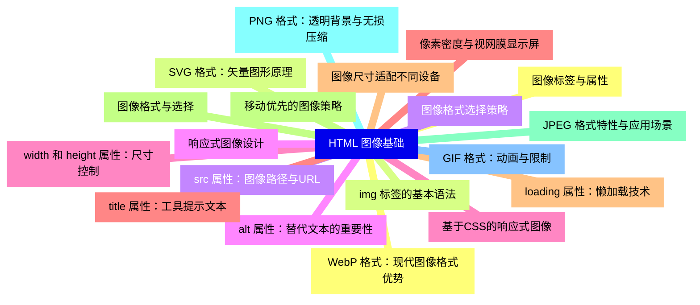
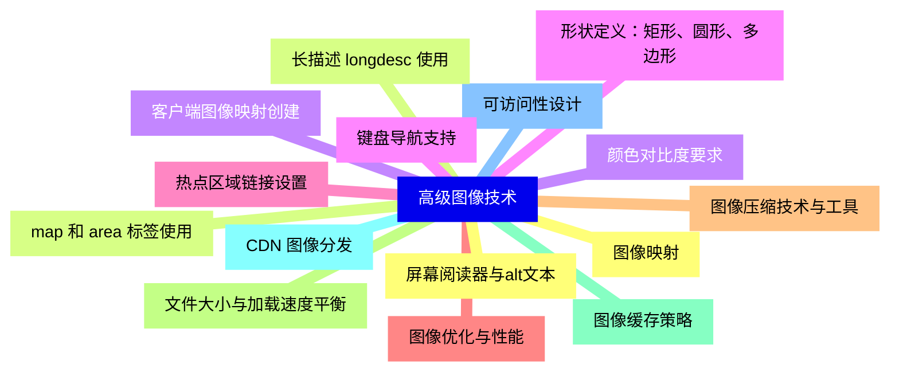
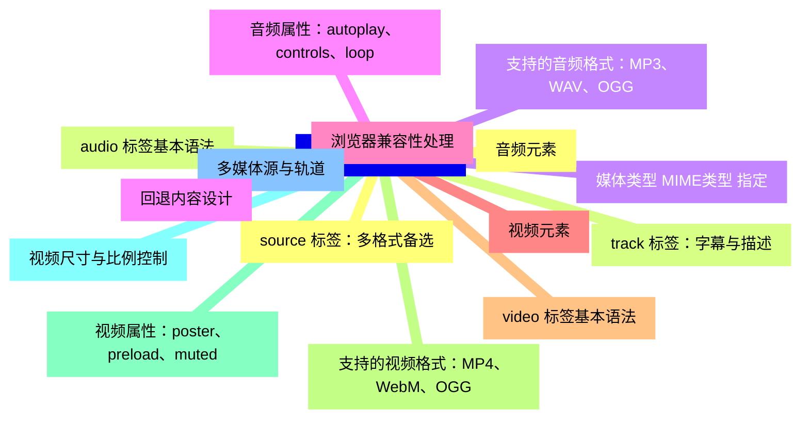
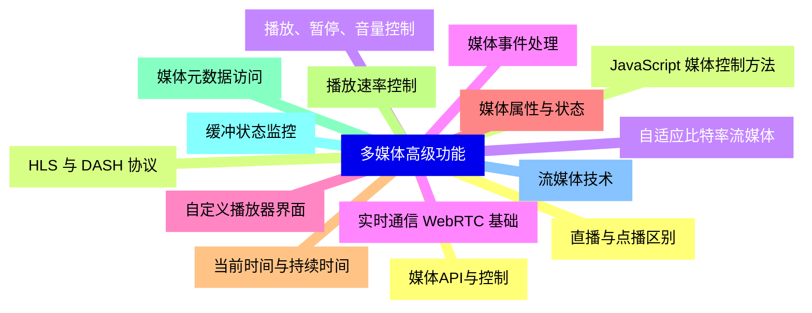
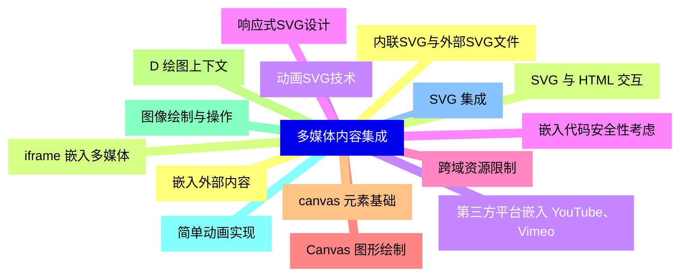
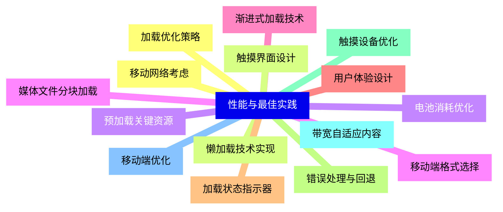
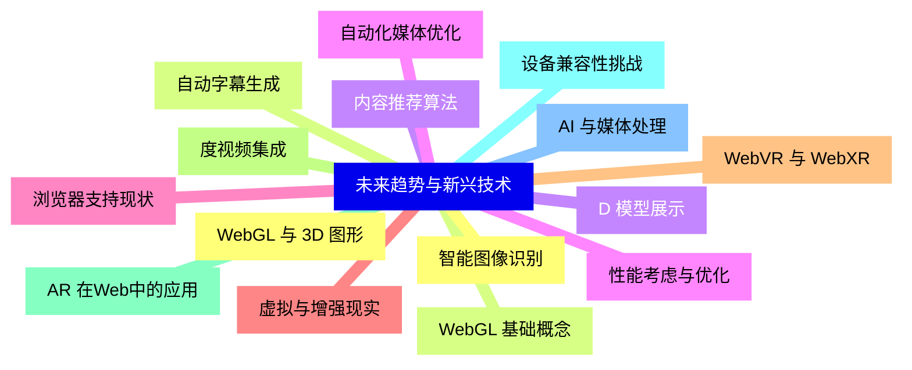


### 1 [HTML 图像基础](#1)
#### 1.1 [图像标签与属性](#1)
#### 1.2 [img 标签的基本语法](#1)
#### 1.3 [src 属性：图像路径与URL](#1)
#### 1.4 [alt 属性：替代文本的重要性](#1)
#### 1.5 [width 和 height 属性：尺寸控制](#1)
#### 1.6 [title 属性：工具提示文本](#1)
#### 1.7 [loading 属性：懒加载技术](#1)
#### 1.8 [图像格式与选择](#1)
#### 1.9 [JPEG 格式特性与应用场景](#1)
#### 1.10 [PNG 格式：透明背景与无损压缩](#1)
#### 1.11 [GIF 格式：动画与限制](#1)
#### 1.12 [WebP 格式：现代图像格式优势](#1)
#### 1.13 [SVG 格式：矢量图形原理](#1)
#### 1.14 [图像格式选择策略](#1)
#### 1.15 [响应式图像设计](#1)
#### 1.16 [基于CSS的响应式图像](#1)
#### 1.17 [像素密度与视网膜显示屏](#1)
#### 1.18 [图像尺寸适配不同设备](#1)
#### 1.19 [移动优先的图像策略](#1)
### 2 [高级图像技术](#2)
#### 2.1 [图像映射](#2)
#### 2.2 [map 和 area 标签使用](#2)
#### 2.3 [客户端图像映射创建](#2)
#### 2.4 [形状定义：矩形、圆形、多边形](#2)
#### 2.5 [热点区域链接设置](#2)
#### 2.6 [图像优化与性能](#2)
#### 2.7 [图像压缩技术与工具](#2)
#### 2.8 [文件大小与加载速度平衡](#2)
#### 2.9 [图像缓存策略](#2)
#### 2.10 [CDN 图像分发](#2)
#### 2.11 [可访问性设计](#2)
#### 2.12 [屏幕阅读器与alt文本](#2)
#### 2.13 [长描述 longdesc 使用](#2)
#### 2.14 [颜色对比度要求](#2)
#### 2.15 [键盘导航支持](#2)
### 3 [HTML5 多媒体基础](#3)
#### 3.1 [音频元素](#3)
#### 3.2 [audio 标签基本语法](#3)
#### 3.3 [支持的音频格式：MP3、WAV、OGG](#3)
#### 3.4 [音频属性：autoplay、controls、loop](#3)
#### 3.5 [浏览器兼容性处理](#3)
#### 3.6 [视频元素](#3)
#### 3.7 [video 标签基本语法](#3)
#### 3.8 [支持的视频格式：MP4、WebM、OGG](#3)
#### 3.9 [视频属性：poster、preload、muted](#3)
#### 3.10 [视频尺寸与比例控制](#3)
#### 3.11 [多媒体源与轨道](#3)
#### 3.12 [source 标签：多格式备选](#3)
#### 3.13 [track 标签：字幕与描述](#3)
#### 3.14 [媒体类型 MIME类型 指定](#3)
#### 3.15 [回退内容设计](#3)
### 4 [多媒体高级功能](#4)
#### 4.1 [媒体API与控制](#4)
#### 4.2 [JavaScript 媒体控制方法](#4)
#### 4.3 [播放、暂停、音量控制](#4)
#### 4.4 [媒体事件处理](#4)
#### 4.5 [自定义播放器界面](#4)
#### 4.6 [媒体属性与状态](#4)
#### 4.7 [当前时间与持续时间](#4)
#### 4.8 [播放速率控制](#4)
#### 4.9 [媒体元数据访问](#4)
#### 4.10 [缓冲状态监控](#4)
#### 4.11 [流媒体技术](#4)
#### 4.12 [直播与点播区别](#4)
#### 4.13 [HLS 与 DASH 协议](#4)
#### 4.14 [自适应比特率流媒体](#4)
#### 4.15 [实时通信 WebRTC 基础](#4)
### 5 [多媒体内容集成](#5)
#### 5.1 [嵌入外部内容](#5)
#### 5.2 [iframe 嵌入多媒体](#5)
#### 5.3 [第三方平台嵌入 YouTube、Vimeo](#5)
#### 5.4 [嵌入代码安全性考虑](#5)
#### 5.5 [跨域资源限制](#5)
#### 5.6 [Canvas 图形绘制](#5)
#### 5.7 [canvas 元素基础](#5)
#### 5.8 [D 绘图上下文](#5)
#### 5.9 [图像绘制与操作](#5)
#### 5.10 [简单动画实现](#5)
#### 5.11 [SVG 集成](#5)
#### 5.12 [内联SVG与外部SVG文件](#5)
#### 5.13 [SVG 与 HTML 交互](#5)
#### 5.14 [动画SVG技术](#5)
#### 5.15 [响应式SVG设计](#5)
### 6 [性能与最佳实践](#6)
#### 6.1 [加载优化策略](#6)
#### 6.2 [懒加载技术实现](#6)
#### 6.3 [预加载关键资源](#6)
#### 6.4 [媒体文件分块加载](#6)
#### 6.5 [渐进式加载技术](#6)
#### 6.6 [用户体验设计](#6)
#### 6.7 [加载状态指示器](#6)
#### 6.8 [错误处理与回退](#6)
#### 6.9 [触摸设备优化](#6)
#### 6.10 [带宽自适应内容](#6)
#### 6.11 [移动端优化](#6)
#### 6.12 [移动网络考虑](#6)
#### 6.13 [触摸界面设计](#6)
#### 6.14 [电池消耗优化](#6)
#### 6.15 [移动端格式选择](#6)
### 7 [未来趋势与新兴技术](#7)
#### 7.1 [WebGL 与 3D 图形](#7)
#### 7.2 [WebGL 基础概念](#7)
#### 7.3 [D 模型展示](#7)
#### 7.4 [性能考虑与优化](#7)
#### 7.5 [浏览器支持现状](#7)
#### 7.6 [虚拟与增强现实](#7)
#### 7.7 [WebVR 与 WebXR](#7)
#### 7.8 [度视频集成](#7)
#### 7.9 [AR 在Web中的应用](#7)
#### 7.10 [设备兼容性挑战](#7)
#### 7.11 [AI 与媒体处理](#7)
#### 7.12 [智能图像识别](#7)
#### 7.13 [自动字幕生成](#7)
#### 7.14 [内容推荐算法](#7)
#### 7.15 [自动化媒体优化](#7)




### 1 HTML 图像基础

---
### 1 HTML 图像基础
___
#### 1.1 图像标签与属性
___
#### 1.2 img 标签的基本语法
___
#### 1.3 src 属性：图像路径与URL
___
#### 1.4 alt 属性：替代文本的重要性
___
#### 1.5 width 和 height 属性：尺寸控制
___
#### 1.6 title 属性：工具提示文本
___
#### 1.7 loading 属性：懒加载技术
___
#### 1.8 图像格式与选择
___
#### 1.9 JPEG 格式特性与应用场景
___
#### 1.10 PNG 格式：透明背景与无损压缩
___
#### 1.11 GIF 格式：动画与限制
___
#### 1.12 WebP 格式：现代图像格式优势
___
#### 1.13 SVG 格式：矢量图形原理
___
#### 1.14 图像格式选择策略
___
#### 1.15 响应式图像设计
___
#### 1.16 基于CSS的响应式图像
___
#### 1.17 像素密度与视网膜显示屏
___
#### 1.18 图像尺寸适配不同设备
___
#### 1.19 移动优先的图像策略
### 2 高级图像技术

---
### 2 高级图像技术
___
#### 2.1 图像映射
___
#### 2.2 map 和 area 标签使用
___
#### 2.3 客户端图像映射创建
___
#### 2.4 形状定义：矩形、圆形、多边形
___
#### 2.5 热点区域链接设置
___
#### 2.6 图像优化与性能
___
#### 2.7 图像压缩技术与工具
___
#### 2.8 文件大小与加载速度平衡
___
#### 2.9 图像缓存策略
___
#### 2.10 CDN 图像分发
___
#### 2.11 可访问性设计
___
#### 2.12 屏幕阅读器与alt文本
___
#### 2.13 长描述 longdesc 使用
___
#### 2.14 颜色对比度要求
___
#### 2.15 键盘导航支持
### 3 HTML5 多媒体基础

---
### 3 HTML5 多媒体基础
___
#### 3.1 音频元素
___
#### 3.2 audio 标签基本语法
___
#### 3.3 支持的音频格式：MP3、WAV、OGG
___
#### 3.4 音频属性：autoplay、controls、loop
___
#### 3.5 浏览器兼容性处理
___
#### 3.6 视频元素
___
#### 3.7 video 标签基本语法
___
#### 3.8 支持的视频格式：MP4、WebM、OGG
___
#### 3.9 视频属性：poster、preload、muted
___
#### 3.10 视频尺寸与比例控制
___
#### 3.11 多媒体源与轨道
___
#### 3.12 source 标签：多格式备选
___
#### 3.13 track 标签：字幕与描述
___
#### 3.14 媒体类型 MIME类型 指定
___
#### 3.15 回退内容设计
### 4 多媒体高级功能

---
### 4 多媒体高级功能
___
#### 4.1 媒体API与控制
___
#### 4.2 JavaScript 媒体控制方法
___
#### 4.3 播放、暂停、音量控制
___
#### 4.4 媒体事件处理
___
#### 4.5 自定义播放器界面
___
#### 4.6 媒体属性与状态
___
#### 4.7 当前时间与持续时间
___
#### 4.8 播放速率控制
___
#### 4.9 媒体元数据访问
___
#### 4.10 缓冲状态监控
___
#### 4.11 流媒体技术
___
#### 4.12 直播与点播区别
___
#### 4.13 HLS 与 DASH 协议
___
#### 4.14 自适应比特率流媒体
___
#### 4.15 实时通信 WebRTC 基础
### 5 多媒体内容集成

---
### 5 多媒体内容集成
___
#### 5.1 嵌入外部内容
___
#### 5.2 iframe 嵌入多媒体
___
#### 5.3 第三方平台嵌入 YouTube、Vimeo
___
#### 5.4 嵌入代码安全性考虑
___
#### 5.5 跨域资源限制
___
#### 5.6 Canvas 图形绘制
___
#### 5.7 canvas 元素基础
___
#### 5.8 D 绘图上下文
___
#### 5.9 图像绘制与操作
___
#### 5.10 简单动画实现
___
#### 5.11 SVG 集成
___
#### 5.12 内联SVG与外部SVG文件
___
#### 5.13 SVG 与 HTML 交互
___
#### 5.14 动画SVG技术
___
#### 5.15 响应式SVG设计
### 6 性能与最佳实践

---
### 6 性能与最佳实践
___
#### 6.1 加载优化策略
___
#### 6.2 懒加载技术实现
___
#### 6.3 预加载关键资源
___
#### 6.4 媒体文件分块加载
___
#### 6.5 渐进式加载技术
___
#### 6.6 用户体验设计
___
#### 6.7 加载状态指示器
___
#### 6.8 错误处理与回退
___
#### 6.9 触摸设备优化
___
#### 6.10 带宽自适应内容
___
#### 6.11 移动端优化
___
#### 6.12 移动网络考虑
___
#### 6.13 触摸界面设计
___
#### 6.14 电池消耗优化
___
#### 6.15 移动端格式选择
### 7 未来趋势与新兴技术

---
### 7 未来趋势与新兴技术
___
#### 7.1 WebGL 与 3D 图形
___
#### 7.2 WebGL 基础概念
___
#### 7.3 D 模型展示
___
#### 7.4 性能考虑与优化
___
#### 7.5 浏览器支持现状
___
#### 7.6 虚拟与增强现实
___
#### 7.7 WebVR 与 WebXR
___
#### 7.8 度视频集成
___
#### 7.9 AR 在Web中的应用
___
#### 7.10 设备兼容性挑战
___
#### 7.11 AI 与媒体处理
___
#### 7.12 智能图像识别
___
#### 7.13 自动字幕生成
___
#### 7.14 内容推荐算法
___
#### 7.15 自动化媒体优化


### 1 HTML 图像基础{#1}

{}

<--->
{}
{}
{}
{}
{}
{}
{}
{}
{}
{}
{}
{}
{}
{}
{}
{}
{}
{}
{}
{}
{}
{}
{}
{}
{}
{}
{}
{}
{}
{}
{}
{}
{}
{}
{}
{}
{}
{}
{}

### 2 高级图像技术{#2}

{}
{}
{}
{}
{}
{}
{}
{}
{}
{}
{}
{}
{}
{}
{}
{}
{}
{}
{}
{}
{}
{}
{}
{}
{}
{}
{}
{}
{}
{}
{}
<--->

{}

### 3 HTML5 多媒体基础{#3}

{}

<--->
{}
{}
{}
{}
{}
{}
{}
{}
{}
{}
{}
{}
{}
{}
{}
{}
{}
{}
{}
{}
{}
{}
{}
{}
{}
{}
{}
{}
{}
{}
{}

### 4 多媒体高级功能{#4}

{}
{}
{}
{}
{}
{}
{}
{}
{}
{}
{}
{}
{}
{}
{}
{}
{}
{}
{}
{}
{}
{}
{}
{}
{}
{}
{}
{}
{}
{}
{}
<--->

{}

### 5 多媒体内容集成{#5}

{}

<--->
{}
{}
{}
{}
{}
{}
{}
{}
{}
{}
{}
{}
{}
{}
{}
{}
{}
{}
{}
{}
{}
{}
{}
{}
{}
{}
{}
{}
{}
{}
{}

### 6 性能与最佳实践{#6}

{}
{}
{}
{}
{}
{}
{}
{}
{}
{}
{}
{}
{}
{}
{}
{}
{}
{}
{}
{}
{}
{}
{}
{}
{}
{}
{}
{}
{}
{}
{}
<--->

{}

### 7 未来趋势与新兴技术{#7}

{}

<--->
{}
{}
{}
{}
{}
{}
{}
{}
{}
{}
{}
{}
{}
{}
{}
{}
{}
{}
{}
{}
{}
{}
{}
{}
{}
{}
{}
{}
{}
{}
{}
