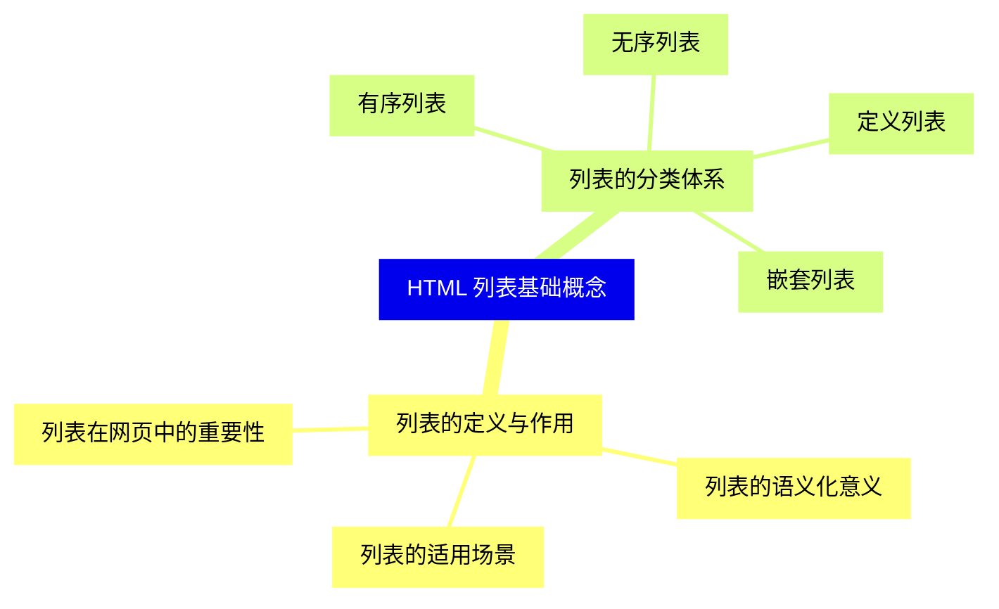
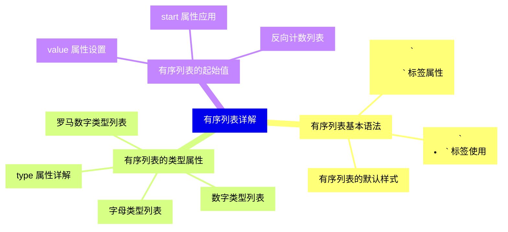
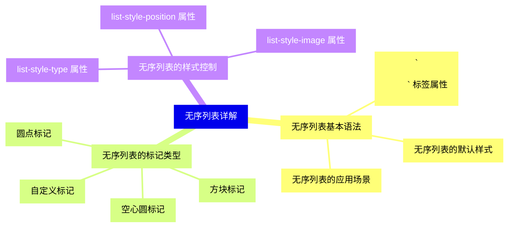
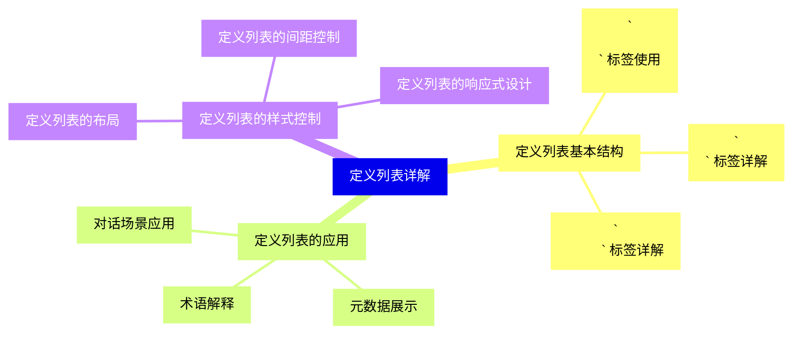
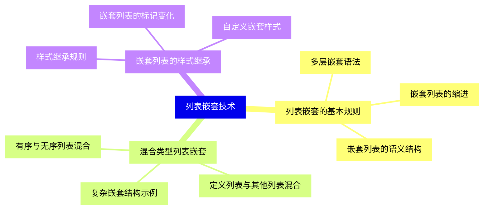
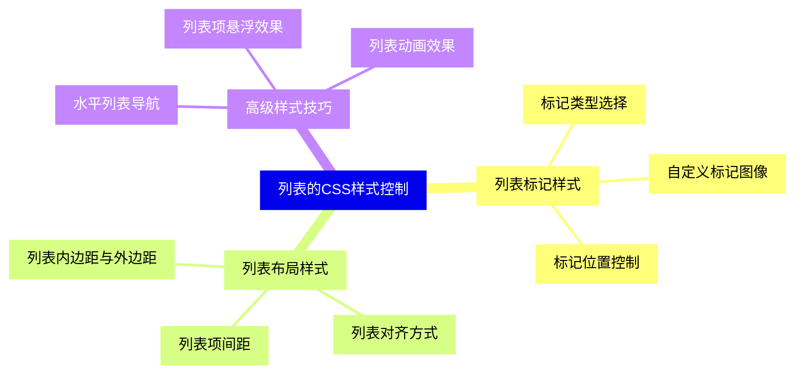
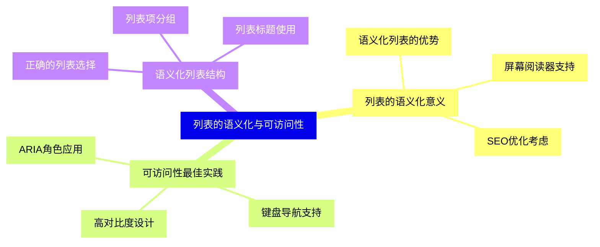
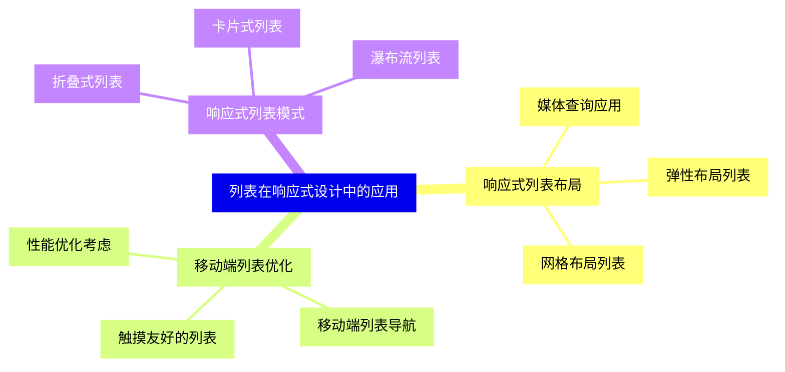
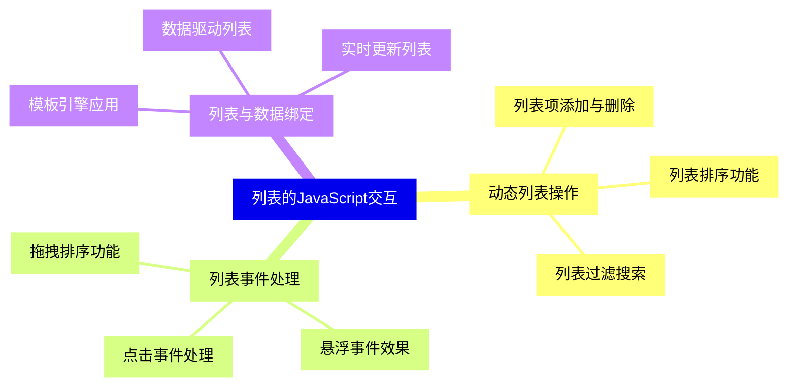
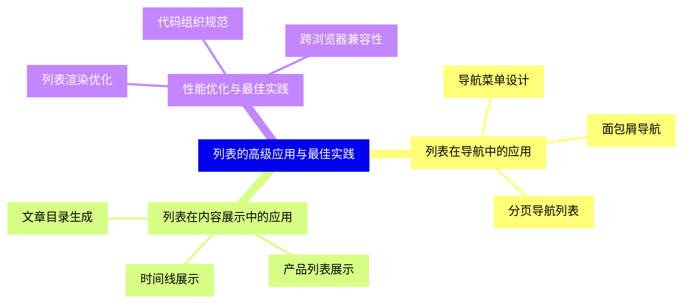


### 1 [HTML 列表基础概念](#1)
#### 1.1 [列表的定义与作用](#1)
##### 1.1.1 [列表在网页中的重要性](#1)
##### 1.1.2 [列表的语义化意义](#1)
##### 1.1.3 [列表的适用场景](#1)
#### 1.2 [列表的分类体系](#1)
##### 1.2.1 [有序列表](#1)
##### 1.2.2 [无序列表](#1)
##### 1.2.3 [定义列表](#1)
##### 1.2.4 [嵌套列表](#1)
### 2 [有序列表详解](#2)
#### 2.1 [有序列表基本语法](#2)
##### 2.1.1 [`<ol>` 标签属性](#2)
##### 2.1.2 [`<li>` 标签使用](#2)
##### 2.1.3 [有序列表的默认样式](#2)
#### 2.2 [有序列表的类型属性](#2)
##### 2.2.1 [type 属性详解](#2)
##### 2.2.2 [数字类型列表](#2)
##### 2.2.3 [字母类型列表](#2)
##### 2.2.4 [罗马数字类型列表](#2)
#### 2.3 [有序列表的起始值](#2)
##### 2.3.1 [start 属性应用](#2)
##### 2.3.2 [value 属性设置](#2)
##### 2.3.3 [反向计数列表](#2)
### 3 [无序列表详解](#3)
#### 3.1 [无序列表基本语法](#3)
##### 3.1.1 [`<ul>` 标签属性](#3)
##### 3.1.2 [无序列表的默认样式](#3)
##### 3.1.3 [无序列表的应用场景](#3)
#### 3.2 [无序列表的标记类型](#3)
##### 3.2.1 [圆点标记](#3)
##### 3.2.2 [方块标记](#3)
##### 3.2.3 [空心圆标记](#3)
##### 3.2.4 [自定义标记](#3)
#### 3.3 [无序列表的样式控制](#3)
##### 3.3.1 [list-style-type 属性](#3)
##### 3.3.2 [list-style-image 属性](#3)
##### 3.3.3 [list-style-position 属性](#3)
### 4 [定义列表详解](#4)
#### 4.1 [定义列表基本结构](#4)
##### 4.1.1 [`<dl>` 标签使用](#4)
##### 4.1.2 [`<dt>` 标签详解](#4)
##### 4.1.3 [`<dd>` 标签详解](#4)
#### 4.2 [定义列表的应用](#4)
##### 4.2.1 [术语解释](#4)
##### 4.2.2 [元数据展示](#4)
##### 4.2.3 [对话场景应用](#4)
#### 4.3 [定义列表的样式控制](#4)
##### 4.3.1 [定义列表的布局](#4)
##### 4.3.2 [定义列表的间距控制](#4)
##### 4.3.3 [定义列表的响应式设计](#4)
### 5 [列表嵌套技术](#5)
#### 5.1 [列表嵌套的基本规则](#5)
##### 5.1.1 [多层嵌套语法](#5)
##### 5.1.2 [嵌套列表的缩进](#5)
##### 5.1.3 [嵌套列表的语义结构](#5)
#### 5.2 [混合类型列表嵌套](#5)
##### 5.2.1 [有序与无序列表混合](#5)
##### 5.2.2 [定义列表与其他列表混合](#5)
##### 5.2.3 [复杂嵌套结构示例](#5)
#### 5.3 [嵌套列表的样式继承](#5)
##### 5.3.1 [样式继承规则](#5)
##### 5.3.2 [嵌套列表的标记变化](#5)
##### 5.3.3 [自定义嵌套样式](#5)
### 6 [列表的CSS样式控制](#6)
#### 6.1 [列表标记样式](#6)
##### 6.1.1 [标记类型选择](#6)
##### 6.1.2 [自定义标记图像](#6)
##### 6.1.3 [标记位置控制](#6)
#### 6.2 [列表布局样式](#6)
##### 6.2.1 [列表项间距](#6)
##### 6.2.2 [列表对齐方式](#6)
##### 6.2.3 [列表内边距与外边距](#6)
#### 6.3 [高级样式技巧](#6)
##### 6.3.1 [水平列表导航](#6)
##### 6.3.2 [列表项悬浮效果](#6)
##### 6.3.3 [列表动画效果](#6)
### 7 [列表的语义化与可访问性](#7)
#### 7.1 [列表的语义化意义](#7)
##### 7.1.1 [语义化列表的优势](#7)
##### 7.1.2 [屏幕阅读器支持](#7)
##### 7.1.3 [SEO优化考虑](#7)
#### 7.2 [可访问性最佳实践](#7)
##### 7.2.1 [ARIA角色应用](#7)
##### 7.2.2 [键盘导航支持](#7)
##### 7.2.3 [高对比度设计](#7)
#### 7.3 [语义化列表结构](#7)
##### 7.3.1 [正确的列表选择](#7)
##### 7.3.2 [列表项分组](#7)
##### 7.3.3 [列表标题使用](#7)
### 8 [列表在响应式设计中的应用](#8)
#### 8.1 [响应式列表布局](#8)
##### 8.1.1 [媒体查询应用](#8)
##### 8.1.2 [弹性布局列表](#8)
##### 8.1.3 [网格布局列表](#8)
#### 8.2 [移动端列表优化](#8)
##### 8.2.1 [触摸友好的列表](#8)
##### 8.2.2 [移动端列表导航](#8)
##### 8.2.3 [性能优化考虑](#8)
#### 8.3 [响应式列表模式](#8)
##### 8.3.1 [折叠式列表](#8)
##### 8.3.2 [卡片式列表](#8)
##### 8.3.3 [瀑布流列表](#8)
### 9 [列表的JavaScript交互](#9)
#### 9.1 [动态列表操作](#9)
##### 9.1.1 [列表项添加与删除](#9)
##### 9.1.2 [列表排序功能](#9)
##### 9.1.3 [列表过滤搜索](#9)
#### 9.2 [列表事件处理](#9)
##### 9.2.1 [点击事件处理](#9)
##### 9.2.2 [悬浮事件效果](#9)
##### 9.2.3 [拖拽排序功能](#9)
#### 9.3 [列表与数据绑定](#9)
##### 9.3.1 [模板引擎应用](#9)
##### 9.3.2 [数据驱动列表](#9)
##### 9.3.3 [实时更新列表](#9)
### 10 [列表的高级应用与最佳实践](#10)
#### 10.1 [列表在导航中的应用](#10)
##### 10.1.1 [导航菜单设计](#10)
##### 10.1.2 [面包屑导航](#10)
##### 10.1.3 [分页导航列表](#10)
#### 10.2 [列表在内容展示中的应用](#10)
##### 10.2.1 [文章目录生成](#10)
##### 10.2.2 [产品列表展示](#10)
##### 10.2.3 [时间线展示](#10)
#### 10.3 [性能优化与最佳实践](#10)
##### 10.3.1 [列表渲染优化](#10)
##### 10.3.2 [代码组织规范](#10)
##### 10.3.3 [跨浏览器兼容性](#10)




### 1 HTML 列表基础概念

---
### 1 HTML 列表基础概念
___
#### 1.1 列表的定义与作用
___
##### 1.1.1 列表在网页中的重要性
___
##### 1.1.2 列表的语义化意义
___
##### 1.1.3 列表的适用场景
___
#### 1.2 列表的分类体系
___
##### 1.2.1 有序列表
___
##### 1.2.2 无序列表
___
##### 1.2.3 定义列表
___
##### 1.2.4 嵌套列表
### 2 有序列表详解

---
### 2 有序列表详解
___
#### 2.1 有序列表基本语法
___
##### 2.1.1 `<ol>` 标签属性
___
##### 2.1.2 `<li>` 标签使用
___
##### 2.1.3 有序列表的默认样式
___
#### 2.2 有序列表的类型属性
___
##### 2.2.1 type 属性详解
___
##### 2.2.2 数字类型列表
___
##### 2.2.3 字母类型列表
___
##### 2.2.4 罗马数字类型列表
___
#### 2.3 有序列表的起始值
___
##### 2.3.1 start 属性应用
___
##### 2.3.2 value 属性设置
___
##### 2.3.3 反向计数列表
### 3 无序列表详解

---
### 3 无序列表详解
___
#### 3.1 无序列表基本语法
___
##### 3.1.1 `<ul>` 标签属性
___
##### 3.1.2 无序列表的默认样式
___
##### 3.1.3 无序列表的应用场景
___
#### 3.2 无序列表的标记类型
___
##### 3.2.1 圆点标记
___
##### 3.2.2 方块标记
___
##### 3.2.3 空心圆标记
___
##### 3.2.4 自定义标记
___
#### 3.3 无序列表的样式控制
___
##### 3.3.1 list-style-type 属性
___
##### 3.3.2 list-style-image 属性
___
##### 3.3.3 list-style-position 属性
### 4 定义列表详解

---
### 4 定义列表详解
___
#### 4.1 定义列表基本结构
___
##### 4.1.1 `<dl>` 标签使用
___
##### 4.1.2 `<dt>` 标签详解
___
##### 4.1.3 `<dd>` 标签详解
___
#### 4.2 定义列表的应用
___
##### 4.2.1 术语解释
___
##### 4.2.2 元数据展示
___
##### 4.2.3 对话场景应用
___
#### 4.3 定义列表的样式控制
___
##### 4.3.1 定义列表的布局
___
##### 4.3.2 定义列表的间距控制
___
##### 4.3.3 定义列表的响应式设计
### 5 列表嵌套技术

---
### 5 列表嵌套技术
___
#### 5.1 列表嵌套的基本规则
___
##### 5.1.1 多层嵌套语法
___
##### 5.1.2 嵌套列表的缩进
___
##### 5.1.3 嵌套列表的语义结构
___
#### 5.2 混合类型列表嵌套
___
##### 5.2.1 有序与无序列表混合
___
##### 5.2.2 定义列表与其他列表混合
___
##### 5.2.3 复杂嵌套结构示例
___
#### 5.3 嵌套列表的样式继承
___
##### 5.3.1 样式继承规则
___
##### 5.3.2 嵌套列表的标记变化
___
##### 5.3.3 自定义嵌套样式
### 6 列表的CSS样式控制

---
### 6 列表的CSS样式控制
___
#### 6.1 列表标记样式
___
##### 6.1.1 标记类型选择
___
##### 6.1.2 自定义标记图像
___
##### 6.1.3 标记位置控制
___
#### 6.2 列表布局样式
___
##### 6.2.1 列表项间距
___
##### 6.2.2 列表对齐方式
___
##### 6.2.3 列表内边距与外边距
___
#### 6.3 高级样式技巧
___
##### 6.3.1 水平列表导航
___
##### 6.3.2 列表项悬浮效果
___
##### 6.3.3 列表动画效果
### 7 列表的语义化与可访问性

---
### 7 列表的语义化与可访问性
___
#### 7.1 列表的语义化意义
___
##### 7.1.1 语义化列表的优势
___
##### 7.1.2 屏幕阅读器支持
___
##### 7.1.3 SEO优化考虑
___
#### 7.2 可访问性最佳实践
___
##### 7.2.1 ARIA角色应用
___
##### 7.2.2 键盘导航支持
___
##### 7.2.3 高对比度设计
___
#### 7.3 语义化列表结构
___
##### 7.3.1 正确的列表选择
___
##### 7.3.2 列表项分组
___
##### 7.3.3 列表标题使用
### 8 列表在响应式设计中的应用

---
### 8 列表在响应式设计中的应用
___
#### 8.1 响应式列表布局
___
##### 8.1.1 媒体查询应用
___
##### 8.1.2 弹性布局列表
___
##### 8.1.3 网格布局列表
___
#### 8.2 移动端列表优化
___
##### 8.2.1 触摸友好的列表
___
##### 8.2.2 移动端列表导航
___
##### 8.2.3 性能优化考虑
___
#### 8.3 响应式列表模式
___
##### 8.3.1 折叠式列表
___
##### 8.3.2 卡片式列表
___
##### 8.3.3 瀑布流列表
### 9 列表的JavaScript交互

---
### 9 列表的JavaScript交互
___
#### 9.1 动态列表操作
___
##### 9.1.1 列表项添加与删除
___
##### 9.1.2 列表排序功能
___
##### 9.1.3 列表过滤搜索
___
#### 9.2 列表事件处理
___
##### 9.2.1 点击事件处理
___
##### 9.2.2 悬浮事件效果
___
##### 9.2.3 拖拽排序功能
___
#### 9.3 列表与数据绑定
___
##### 9.3.1 模板引擎应用
___
##### 9.3.2 数据驱动列表
___
##### 9.3.3 实时更新列表
### 10 列表的高级应用与最佳实践

---
### 10 列表的高级应用与最佳实践
___
#### 10.1 列表在导航中的应用
___
##### 10.1.1 导航菜单设计
___
##### 10.1.2 面包屑导航
___
##### 10.1.3 分页导航列表
___
#### 10.2 列表在内容展示中的应用
___
##### 10.2.1 文章目录生成
___
##### 10.2.2 产品列表展示
___
##### 10.2.3 时间线展示
___
#### 10.3 性能优化与最佳实践
___
##### 10.3.1 列表渲染优化
___
##### 10.3.2 代码组织规范
___
##### 10.3.3 跨浏览器兼容性


### 1 HTML 列表基础概念{#1}

{}

<--->
{}
{}
{}
{}
{}
{}
{}
{}
{}
{}
{}
{}
{}
{}
{}
{}
{}
{}
{}

### 2 有序列表详解{#2}

{}
{}
{}
{}
{}
{}
{}
{}
{}
{}
{}
{}
{}
{}
{}
{}
{}
{}
{}
{}
{}
{}
{}
{}
{}
{}
{}
<--->

{}

### 3 无序列表详解{#3}

{}

<--->
{}
{}
{}
{}
{}
{}
{}
{}
{}
{}
{}
{}
{}
{}
{}
{}
{}
{}
{}
{}
{}
{}
{}
{}
{}
{}
{}

### 4 定义列表详解{#4}

{}
{}
{}
{}
{}
{}
{}
{}
{}
{}
{}
{}
{}
{}
{}
{}
{}
{}
{}
{}
{}
{}
{}
{}
{}
<--->

{}

### 5 列表嵌套技术{#5}

{}

<--->
{}
{}
{}
{}
{}
{}
{}
{}
{}
{}
{}
{}
{}
{}
{}
{}
{}
{}
{}
{}
{}
{}
{}
{}
{}

### 6 列表的CSS样式控制{#6}

{}
{}
{}
{}
{}
{}
{}
{}
{}
{}
{}
{}
{}
{}
{}
{}
{}
{}
{}
{}
{}
{}
{}
{}
{}
<--->

{}

### 7 列表的语义化与可访问性{#7}

{}

<--->
{}
{}
{}
{}
{}
{}
{}
{}
{}
{}
{}
{}
{}
{}
{}
{}
{}
{}
{}
{}
{}
{}
{}
{}
{}

### 8 列表在响应式设计中的应用{#8}

{}
{}
{}
{}
{}
{}
{}
{}
{}
{}
{}
{}
{}
{}
{}
{}
{}
{}
{}
{}
{}
{}
{}
{}
{}
<--->

{}

### 9 列表的JavaScript交互{#9}

{}

<--->
{}
{}
{}
{}
{}
{}
{}
{}
{}
{}
{}
{}
{}
{}
{}
{}
{}
{}
{}
{}
{}
{}
{}
{}
{}

### 10 列表的高级应用与最佳实践{#10}

{}
{}
{}
{}
{}
{}
{}
{}
{}
{}
{}
{}
{}
{}
{}
{}
{}
{}
{}
{}
{}
{}
{}
{}
{}
<--->

{}
