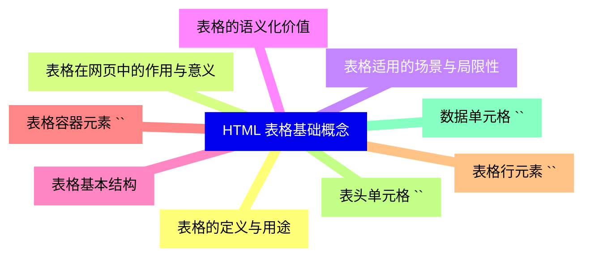
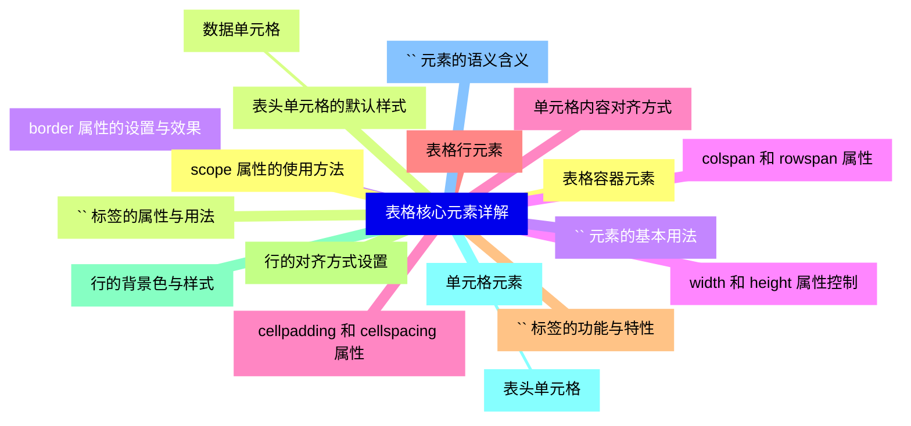
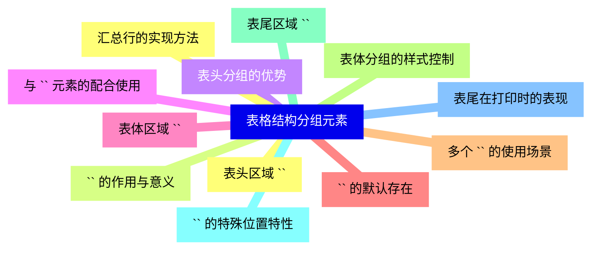
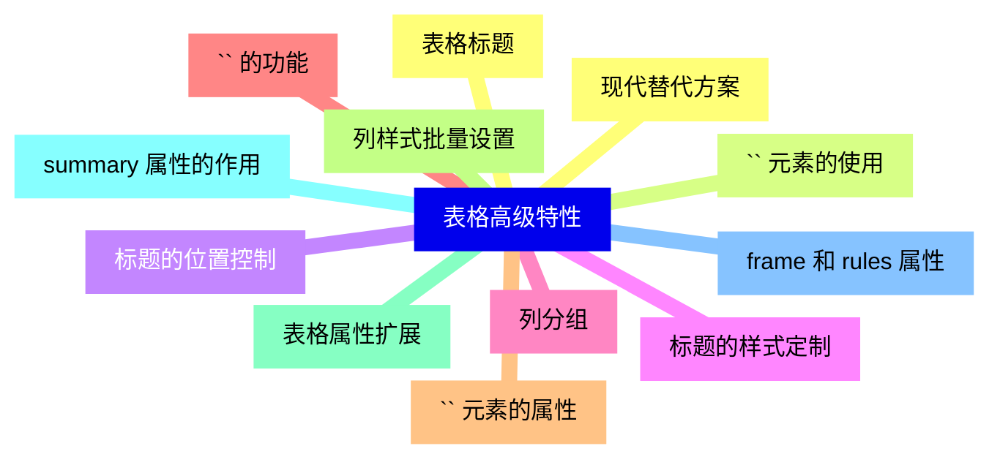
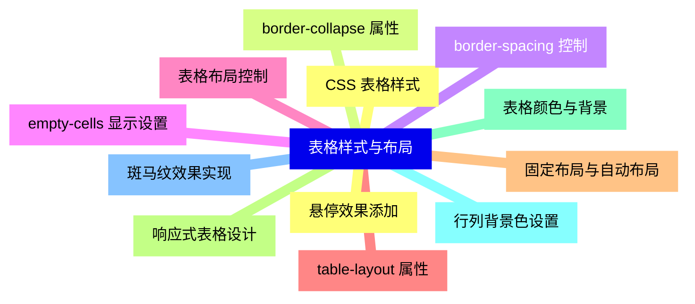
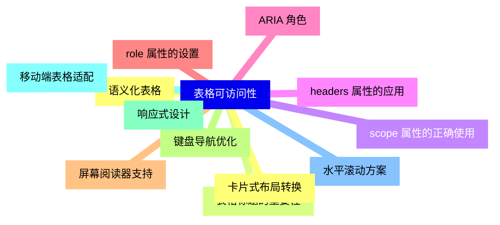
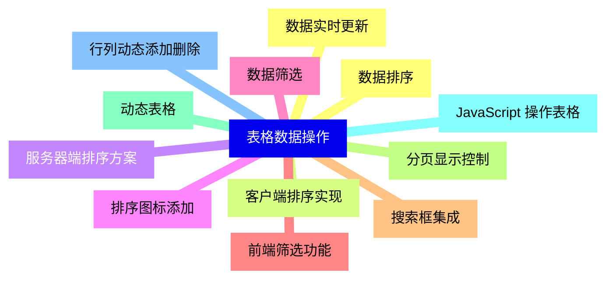
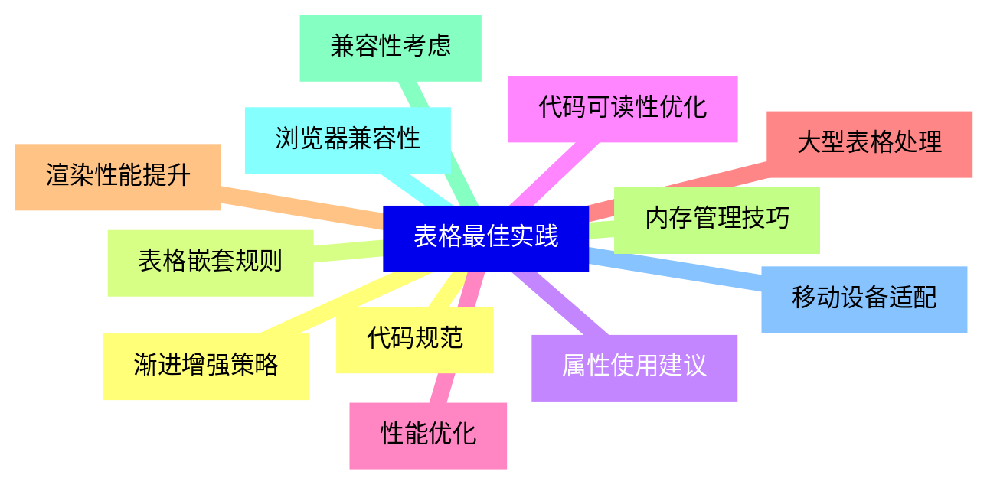
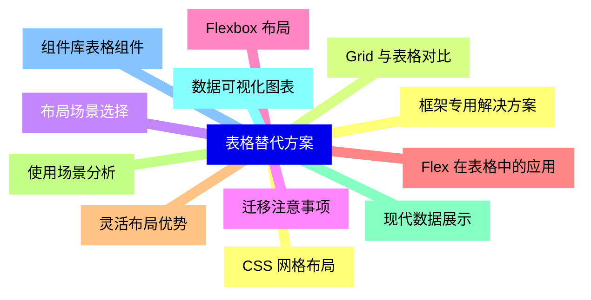


### 1 [HTML 表格基础概念](#1)
#### 1.1 [表格的定义与用途](#1)
#### 1.2 [表格在网页中的作用与意义](#1)
#### 1.3 [表格适用的场景与局限性](#1)
#### 1.4 [表格的语义化价值](#1)
#### 1.5 [表格基本结构](#1)
#### 1.6 [表格容器元素 `<table>`](#1)
#### 1.7 [表格行元素 `<tr>`](#1)
#### 1.8 [表头单元格 `<th>`](#1)
#### 1.9 [数据单元格 `<td>`](#1)
### 2 [表格核心元素详解](#2)
#### 2.1 [表格容器元素](#2)
#### 2.2 [`<table>` 标签的属性与用法](#2)
#### 2.3 [border 属性的设置与效果](#2)
#### 2.4 [width 和 height 属性控制](#2)
#### 2.5 [cellpadding 和 cellspacing 属性](#2)
#### 2.6 [表格行元素](#2)
#### 2.7 [`<tr>` 标签的功能与特性](#2)
#### 2.8 [行的对齐方式设置](#2)
#### 2.9 [行的背景色与样式](#2)
#### 2.10 [单元格元素](#2)
##### 2.10.1 [表头单元格](#2)
#### 2.11 [`<th>` 元素的语义含义](#2)
#### 2.12 [scope 属性的使用方法](#2)
#### 2.13 [表头单元格的默认样式](#2)
##### 2.13.1 [数据单元格](#2)
#### 2.14 [`<td>` 元素的基本用法](#2)
#### 2.15 [colspan 和 rowspan 属性](#2)
#### 2.16 [单元格内容对齐方式](#2)
### 3 [表格结构分组元素](#3)
#### 3.1 [表头区域 `<thead>`](#3)
#### 3.2 [`<thead>` 的作用与意义](#3)
#### 3.3 [表头分组的优势](#3)
#### 3.4 [与 `<th>` 元素的配合使用](#3)
#### 3.5 [表体区域 `<tbody>`](#3)
#### 3.6 [`<tbody>` 的默认存在](#3)
#### 3.7 [多个 `<tbody>` 的使用场景](#3)
#### 3.8 [表体分组的样式控制](#3)
#### 3.9 [表尾区域 `<tfoot>`](#3)
#### 3.10 [`<tfoot>` 的特殊位置特性](#3)
#### 3.11 [表尾在打印时的表现](#3)
#### 3.12 [汇总行的实现方法](#3)
### 4 [表格高级特性](#4)
#### 4.1 [表格标题](#4)
#### 4.2 [`<caption>` 元素的使用](#4)
#### 4.3 [标题的位置控制](#4)
#### 4.4 [标题的样式定制](#4)
#### 4.5 [列分组](#4)
#### 4.6 [`<colgroup>` 的功能](#4)
#### 4.7 [`<col>` 元素的属性](#4)
#### 4.8 [列样式批量设置](#4)
#### 4.9 [表格属性扩展](#4)
#### 4.10 [summary 属性的作用](#4)
#### 4.11 [frame 和 rules 属性](#4)
#### 4.12 [现代替代方案](#4)
### 5 [表格样式与布局](#5)
#### 5.1 [CSS 表格样式](#5)
#### 5.2 [border-collapse 属性](#5)
#### 5.3 [border-spacing 控制](#5)
#### 5.4 [empty-cells 显示设置](#5)
#### 5.5 [表格布局控制](#5)
#### 5.6 [table-layout 属性](#5)
#### 5.7 [固定布局与自动布局](#5)
#### 5.8 [响应式表格设计](#5)
#### 5.9 [表格颜色与背景](#5)
#### 5.10 [行列背景色设置](#5)
#### 5.11 [斑马纹效果实现](#5)
#### 5.12 [悬停效果添加](#5)
### 6 [表格可访问性](#6)
#### 6.1 [语义化表格](#6)
#### 6.2 [表格标题的重要性](#6)
#### 6.3 [scope 属性的正确使用](#6)
#### 6.4 [headers 属性的应用](#6)
#### 6.5 [ARIA 角色](#6)
#### 6.6 [role 属性的设置](#6)
#### 6.7 [屏幕阅读器支持](#6)
#### 6.8 [键盘导航优化](#6)
#### 6.9 [响应式设计](#6)
#### 6.10 [移动端表格适配](#6)
#### 6.11 [水平滚动方案](#6)
#### 6.12 [卡片式布局转换](#6)
### 7 [表格数据操作](#7)
#### 7.1 [数据排序](#7)
#### 7.2 [客户端排序实现](#7)
#### 7.3 [服务器端排序方案](#7)
#### 7.4 [排序图标添加](#7)
#### 7.5 [数据筛选](#7)
#### 7.6 [前端筛选功能](#7)
#### 7.7 [搜索框集成](#7)
#### 7.8 [分页显示控制](#7)
#### 7.9 [动态表格](#7)
#### 7.10 [JavaScript 操作表格](#7)
#### 7.11 [行列动态添加删除](#7)
#### 7.12 [数据实时更新](#7)
### 8 [表格最佳实践](#8)
#### 8.1 [代码规范](#8)
#### 8.2 [表格嵌套规则](#8)
#### 8.3 [属性使用建议](#8)
#### 8.4 [代码可读性优化](#8)
#### 8.5 [性能优化](#8)
#### 8.6 [大型表格处理](#8)
#### 8.7 [渲染性能提升](#8)
#### 8.8 [内存管理技巧](#8)
#### 8.9 [兼容性考虑](#8)
#### 8.10 [浏览器兼容性](#8)
#### 8.11 [移动设备适配](#8)
#### 8.12 [渐进增强策略](#8)
### 9 [表格替代方案](#9)
#### 9.1 [CSS 网格布局](#9)
#### 9.2 [Grid 与表格对比](#9)
#### 9.3 [布局场景选择](#9)
#### 9.4 [迁移注意事项](#9)
#### 9.5 [Flexbox 布局](#9)
#### 9.6 [Flex 在表格中的应用](#9)
#### 9.7 [灵活布局优势](#9)
#### 9.8 [使用场景分析](#9)
#### 9.9 [现代数据展示](#9)
#### 9.10 [数据可视化图表](#9)
#### 9.11 [组件库表格组件](#9)
#### 9.12 [框架专用解决方案](#9)




### 1 HTML 表格基础概念

---
### 1 HTML 表格基础概念
___
#### 1.1 表格的定义与用途
___
#### 1.2 表格在网页中的作用与意义
___
#### 1.3 表格适用的场景与局限性
___
#### 1.4 表格的语义化价值
___
#### 1.5 表格基本结构
___
#### 1.6 表格容器元素 `<table>`
___
#### 1.7 表格行元素 `<tr>`
___
#### 1.8 表头单元格 `<th>`
___
#### 1.9 数据单元格 `<td>`
### 2 表格核心元素详解

---
### 2 表格核心元素详解
___
#### 2.1 表格容器元素
___
#### 2.2 `<table>` 标签的属性与用法
___
#### 2.3 border 属性的设置与效果
___
#### 2.4 width 和 height 属性控制
___
#### 2.5 cellpadding 和 cellspacing 属性
___
#### 2.6 表格行元素
___
#### 2.7 `<tr>` 标签的功能与特性
___
#### 2.8 行的对齐方式设置
___
#### 2.9 行的背景色与样式
___
#### 2.10 单元格元素
___
##### 2.10.1 表头单元格
___
#### 2.11 `<th>` 元素的语义含义
___
#### 2.12 scope 属性的使用方法
___
#### 2.13 表头单元格的默认样式
___
##### 2.13.1 数据单元格
___
#### 2.14 `<td>` 元素的基本用法
___
#### 2.15 colspan 和 rowspan 属性
___
#### 2.16 单元格内容对齐方式
### 3 表格结构分组元素

---
### 3 表格结构分组元素
___
#### 3.1 表头区域 `<thead>`
___
#### 3.2 `<thead>` 的作用与意义
___
#### 3.3 表头分组的优势
___
#### 3.4 与 `<th>` 元素的配合使用
___
#### 3.5 表体区域 `<tbody>`
___
#### 3.6 `<tbody>` 的默认存在
___
#### 3.7 多个 `<tbody>` 的使用场景
___
#### 3.8 表体分组的样式控制
___
#### 3.9 表尾区域 `<tfoot>`
___
#### 3.10 `<tfoot>` 的特殊位置特性
___
#### 3.11 表尾在打印时的表现
___
#### 3.12 汇总行的实现方法
### 4 表格高级特性

---
### 4 表格高级特性
___
#### 4.1 表格标题
___
#### 4.2 `<caption>` 元素的使用
___
#### 4.3 标题的位置控制
___
#### 4.4 标题的样式定制
___
#### 4.5 列分组
___
#### 4.6 `<colgroup>` 的功能
___
#### 4.7 `<col>` 元素的属性
___
#### 4.8 列样式批量设置
___
#### 4.9 表格属性扩展
___
#### 4.10 summary 属性的作用
___
#### 4.11 frame 和 rules 属性
___
#### 4.12 现代替代方案
### 5 表格样式与布局

---
### 5 表格样式与布局
___
#### 5.1 CSS 表格样式
___
#### 5.2 border-collapse 属性
___
#### 5.3 border-spacing 控制
___
#### 5.4 empty-cells 显示设置
___
#### 5.5 表格布局控制
___
#### 5.6 table-layout 属性
___
#### 5.7 固定布局与自动布局
___
#### 5.8 响应式表格设计
___
#### 5.9 表格颜色与背景
___
#### 5.10 行列背景色设置
___
#### 5.11 斑马纹效果实现
___
#### 5.12 悬停效果添加
### 6 表格可访问性

---
### 6 表格可访问性
___
#### 6.1 语义化表格
___
#### 6.2 表格标题的重要性
___
#### 6.3 scope 属性的正确使用
___
#### 6.4 headers 属性的应用
___
#### 6.5 ARIA 角色
___
#### 6.6 role 属性的设置
___
#### 6.7 屏幕阅读器支持
___
#### 6.8 键盘导航优化
___
#### 6.9 响应式设计
___
#### 6.10 移动端表格适配
___
#### 6.11 水平滚动方案
___
#### 6.12 卡片式布局转换
### 7 表格数据操作

---
### 7 表格数据操作
___
#### 7.1 数据排序
___
#### 7.2 客户端排序实现
___
#### 7.3 服务器端排序方案
___
#### 7.4 排序图标添加
___
#### 7.5 数据筛选
___
#### 7.6 前端筛选功能
___
#### 7.7 搜索框集成
___
#### 7.8 分页显示控制
___
#### 7.9 动态表格
___
#### 7.10 JavaScript 操作表格
___
#### 7.11 行列动态添加删除
___
#### 7.12 数据实时更新
### 8 表格最佳实践

---
### 8 表格最佳实践
___
#### 8.1 代码规范
___
#### 8.2 表格嵌套规则
___
#### 8.3 属性使用建议
___
#### 8.4 代码可读性优化
___
#### 8.5 性能优化
___
#### 8.6 大型表格处理
___
#### 8.7 渲染性能提升
___
#### 8.8 内存管理技巧
___
#### 8.9 兼容性考虑
___
#### 8.10 浏览器兼容性
___
#### 8.11 移动设备适配
___
#### 8.12 渐进增强策略
### 9 表格替代方案

---
### 9 表格替代方案
___
#### 9.1 CSS 网格布局
___
#### 9.2 Grid 与表格对比
___
#### 9.3 布局场景选择
___
#### 9.4 迁移注意事项
___
#### 9.5 Flexbox 布局
___
#### 9.6 Flex 在表格中的应用
___
#### 9.7 灵活布局优势
___
#### 9.8 使用场景分析
___
#### 9.9 现代数据展示
___
#### 9.10 数据可视化图表
___
#### 9.11 组件库表格组件
___
#### 9.12 框架专用解决方案


### 1 HTML 表格基础概念{#1}

{}

<--->
{}
{}
{}
{}
{}
{}
{}
{}
{}
{}
{}
{}
{}
{}
{}
{}
{}
{}
{}

### 2 表格核心元素详解{#2}

{}
{}
{}
{}
{}
{}
{}
{}
{}
{}
{}
{}
{}
{}
{}
{}
{}
{}
{}
{}
{}
{}
{}
{}
{}
{}
{}
{}
{}
{}
{}
{}
{}
{}
{}
{}
{}
<--->

{}

### 3 表格结构分组元素{#3}

{}

<--->
{}
{}
{}
{}
{}
{}
{}
{}
{}
{}
{}
{}
{}
{}
{}
{}
{}
{}
{}
{}
{}
{}
{}
{}
{}

### 4 表格高级特性{#4}

{}
{}
{}
{}
{}
{}
{}
{}
{}
{}
{}
{}
{}
{}
{}
{}
{}
{}
{}
{}
{}
{}
{}
{}
{}
<--->

{}

### 5 表格样式与布局{#5}

{}

<--->
{}
{}
{}
{}
{}
{}
{}
{}
{}
{}
{}
{}
{}
{}
{}
{}
{}
{}
{}
{}
{}
{}
{}
{}
{}

### 6 表格可访问性{#6}

{}
{}
{}
{}
{}
{}
{}
{}
{}
{}
{}
{}
{}
{}
{}
{}
{}
{}
{}
{}
{}
{}
{}
{}
{}
<--->

{}

### 7 表格数据操作{#7}

{}

<--->
{}
{}
{}
{}
{}
{}
{}
{}
{}
{}
{}
{}
{}
{}
{}
{}
{}
{}
{}
{}
{}
{}
{}
{}
{}

### 8 表格最佳实践{#8}

{}
{}
{}
{}
{}
{}
{}
{}
{}
{}
{}
{}
{}
{}
{}
{}
{}
{}
{}
{}
{}
{}
{}
{}
{}
<--->

{}

### 9 表格替代方案{#9}

{}

<--->
{}
{}
{}
{}
{}
{}
{}
{}
{}
{}
{}
{}
{}
{}
{}
{}
{}
{}
{}
{}
{}
{}
{}
{}
{}
