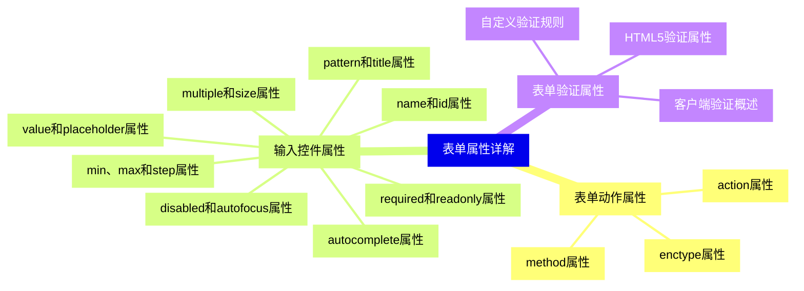
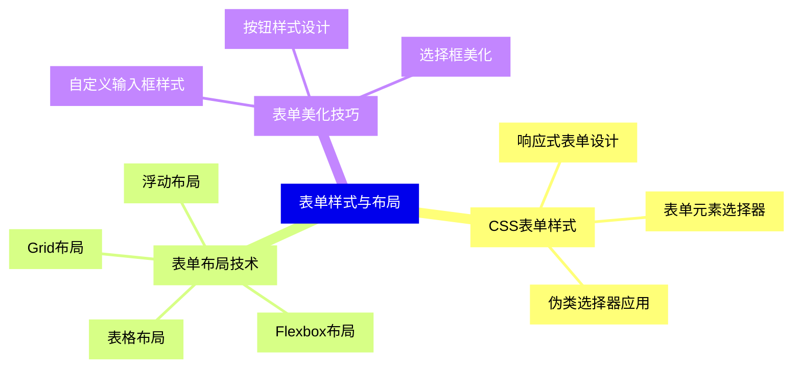
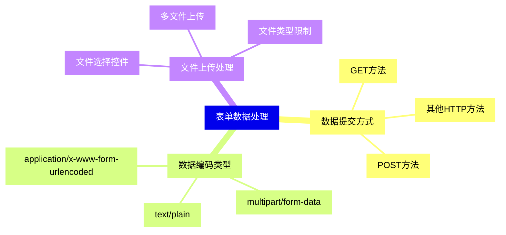
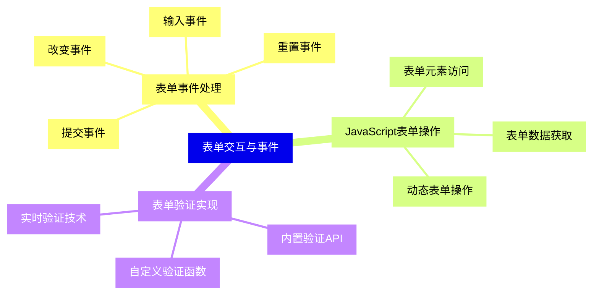
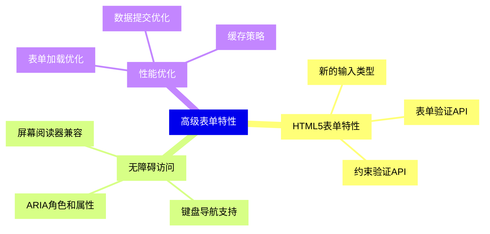
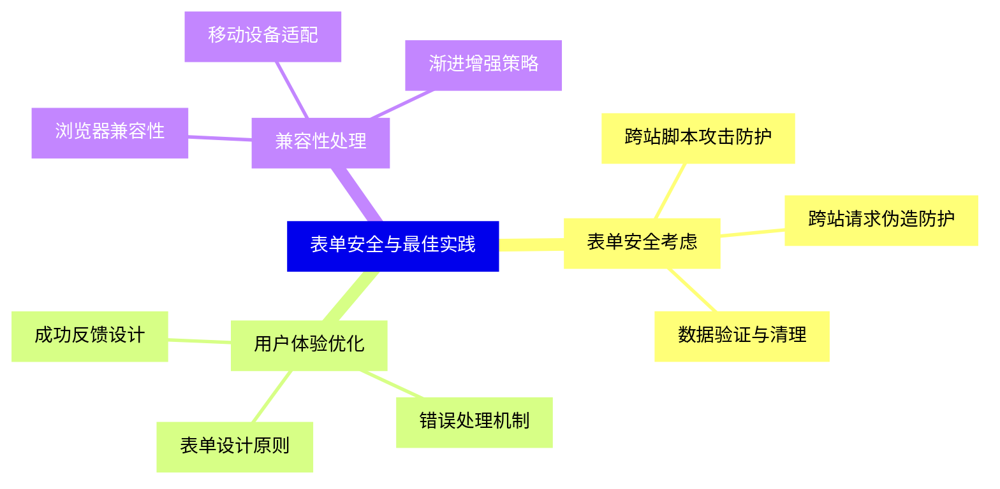

```mermaid
mindmap
    id1[HTML 表单概述]
        id1-1[表单的基本概念]
            id1-1-1[表单的定义与作用]
            id1-1-2[表单在Web开发中的重要性]
            id1-1-3[表单数据提交流程]
        id1-2[表单元素结构]
            id1-2-1[`<form>`标签详解]
            id1-2-2[表单属性概述]
            id1-2-3[表单嵌套规则]
```

```mermaid
mindmap
    id2[表单核心元素]
        id2-1[输入控件]
            id2-1-1[`<input>`标签类型]
        id2-2[文本输入框]
        id2-3[密码框]
        id2-4[单选按钮]
        id2-5[复选框]
        id2-6[文件上传]
        id2-7[隐藏字段]
        id2-8[提交按钮]
        id2-9[重置按钮]
        id2-10[图像按钮]
        id2-11[数字输入]
        id2-12[日期时间选择器]
        id2-13[颜色选择器]
        id2-14[范围滑块]
        id2-15[搜索框]
        id2-16[电话输入]
        id2-17[URL输入]
        id2-18[邮箱输入]
            id2-18-1[`<textarea>`多行文本域]
            id2-18-2[`<select>`下拉选择框]
            id2-18-3[`<button>`按钮元素]
        id2-19[标签与分组]
            id2-19-1[`<label>`标签的使用]
            id2-19-2[`<fieldset>`字段集]
            id2-19-3[`<legend>`图例说明]
        id2-20[数据列表]
            id2-20-1[`<datalist>`数据列表]
            id2-20-2[`<option>`选项元素]
            id2-20-3[`<optgroup>`选项分组]
```

### 1 [HTML 表单概述](#1)
#### 1.1 [表单的基本概念](#1)
##### 1.1.1 [表单的定义与作用](#1)
##### 1.1.2 [表单在Web开发中的重要性](#1)
##### 1.1.3 [表单数据提交流程](#1)
#### 1.2 [表单元素结构](#1)
##### 1.2.1 [`<form>`标签详解](#1)
##### 1.2.2 [表单属性概述](#1)
##### 1.2.3 [表单嵌套规则](#1)
### 2 [表单核心元素](#2)
#### 2.1 [输入控件](#2)
##### 2.1.1 [`<input>`标签类型](#2)
#### 2.2 [文本输入框](#2)
#### 2.3 [密码框](#2)
#### 2.4 [单选按钮](#2)
#### 2.5 [复选框](#2)
#### 2.6 [文件上传](#2)
#### 2.7 [隐藏字段](#2)
#### 2.8 [提交按钮](#2)
#### 2.9 [重置按钮](#2)
#### 2.10 [图像按钮](#2)
#### 2.11 [数字输入](#2)
#### 2.12 [日期时间选择器](#2)
#### 2.13 [颜色选择器](#2)
#### 2.14 [范围滑块](#2)
#### 2.15 [搜索框](#2)
#### 2.16 [电话输入](#2)
#### 2.17 [URL输入](#2)
#### 2.18 [邮箱输入](#2)
##### 2.18.1 [`<textarea>`多行文本域](#2)
##### 2.18.2 [`<select>`下拉选择框](#2)
##### 2.18.3 [`<button>`按钮元素](#2)
#### 2.19 [标签与分组](#2)
##### 2.19.1 [`<label>`标签的使用](#2)
##### 2.19.2 [`<fieldset>`字段集](#2)
##### 2.19.3 [`<legend>`图例说明](#2)
#### 2.20 [数据列表](#2)
##### 2.20.1 [`<datalist>`数据列表](#2)
##### 2.20.2 [`<option>`选项元素](#2)
##### 2.20.3 [`<optgroup>`选项分组](#2)
### 3 [表单属性详解](#3)
#### 3.1 [表单动作属性](#3)
##### 3.1.1 [action属性](#3)
##### 3.1.2 [method属性](#3)
##### 3.1.3 [enctype属性](#3)
#### 3.2 [输入控件属性](#3)
##### 3.2.1 [name和id属性](#3)
##### 3.2.2 [value和placeholder属性](#3)
##### 3.2.3 [required和readonly属性](#3)
##### 3.2.4 [disabled和autofocus属性](#3)
##### 3.2.5 [pattern和title属性](#3)
##### 3.2.6 [min、max和step属性](#3)
##### 3.2.7 [multiple和size属性](#3)
##### 3.2.8 [autocomplete属性](#3)
#### 3.3 [表单验证属性](#3)
##### 3.3.1 [客户端验证概述](#3)
##### 3.3.2 [HTML5验证属性](#3)
##### 3.3.3 [自定义验证规则](#3)
### 4 [表单样式与布局](#4)
#### 4.1 [CSS表单样式](#4)
##### 4.1.1 [表单元素选择器](#4)
##### 4.1.2 [伪类选择器应用](#4)
##### 4.1.3 [响应式表单设计](#4)
#### 4.2 [表单布局技术](#4)
##### 4.2.1 [表格布局](#4)
##### 4.2.2 [Flexbox布局](#4)
##### 4.2.3 [Grid布局](#4)
##### 4.2.4 [浮动布局](#4)
#### 4.3 [表单美化技巧](#4)
##### 4.3.1 [自定义输入框样式](#4)
##### 4.3.2 [按钮样式设计](#4)
##### 4.3.3 [选择框美化](#4)
### 5 [表单数据处理](#5)
#### 5.1 [数据提交方式](#5)
##### 5.1.1 [GET方法](#5)
##### 5.1.2 [POST方法](#5)
##### 5.1.3 [其他HTTP方法](#5)
#### 5.2 [数据编码类型](#5)
##### 5.2.1 [application/x-www-form-urlencoded](#5)
##### 5.2.2 [multipart/form-data](#5)
##### 5.2.3 [text/plain](#5)
#### 5.3 [文件上传处理](#5)
##### 5.3.1 [文件选择控件](#5)
##### 5.3.2 [多文件上传](#5)
##### 5.3.3 [文件类型限制](#5)
### 6 [表单交互与事件](#6)
#### 6.1 [表单事件处理](#6)
##### 6.1.1 [提交事件](#6)
##### 6.1.2 [重置事件](#6)
##### 6.1.3 [输入事件](#6)
##### 6.1.4 [改变事件](#6)
#### 6.2 [JavaScript表单操作](#6)
##### 6.2.1 [表单元素访问](#6)
##### 6.2.2 [表单数据获取](#6)
##### 6.2.3 [动态表单操作](#6)
#### 6.3 [表单验证实现](#6)
##### 6.3.1 [内置验证API](#6)
##### 6.3.2 [自定义验证函数](#6)
##### 6.3.3 [实时验证技术](#6)
### 7 [高级表单特性](#7)
#### 7.1 [HTML5表单特性](#7)
##### 7.1.1 [新的输入类型](#7)
##### 7.1.2 [表单验证API](#7)
##### 7.1.3 [约束验证API](#7)
#### 7.2 [无障碍访问](#7)
##### 7.2.1 [ARIA角色和属性](#7)
##### 7.2.2 [键盘导航支持](#7)
##### 7.2.3 [屏幕阅读器兼容](#7)
#### 7.3 [性能优化](#7)
##### 7.3.1 [表单加载优化](#7)
##### 7.3.2 [数据提交优化](#7)
##### 7.3.3 [缓存策略](#7)
### 8 [表单安全与最佳实践](#8)
#### 8.1 [表单安全考虑](#8)
##### 8.1.1 [跨站脚本攻击防护](#8)
##### 8.1.2 [跨站请求伪造防护](#8)
##### 8.1.3 [数据验证与清理](#8)
#### 8.2 [用户体验优化](#8)
##### 8.2.1 [表单设计原则](#8)
##### 8.2.2 [错误处理机制](#8)
##### 8.2.3 [成功反馈设计](#8)
#### 8.3 [兼容性处理](#8)
##### 8.3.1 [浏览器兼容性](#8)
##### 8.3.2 [移动设备适配](#8)
##### 8.3.3 [渐进增强策略](#8)




### 1 HTML 表单概述

---
### 1 HTML 表单概述
___
#### 1.1 表单的基本概念
___
##### 1.1.1 表单的定义与作用
___
##### 1.1.2 表单在Web开发中的重要性
___
##### 1.1.3 表单数据提交流程
___
#### 1.2 表单元素结构
___
##### 1.2.1 `<form>`标签详解
___
##### 1.2.2 表单属性概述
___
##### 1.2.3 表单嵌套规则
### 2 表单核心元素

---
### 2 表单核心元素
___
#### 2.1 输入控件
___
##### 2.1.1 `<input>`标签类型
___
#### 2.2 文本输入框
___
#### 2.3 密码框
___
#### 2.4 单选按钮
___
#### 2.5 复选框
___
#### 2.6 文件上传
___
#### 2.7 隐藏字段
___
#### 2.8 提交按钮
___
#### 2.9 重置按钮
___
#### 2.10 图像按钮
___
#### 2.11 数字输入
___
#### 2.12 日期时间选择器
___
#### 2.13 颜色选择器
___
#### 2.14 范围滑块
___
#### 2.15 搜索框
___
#### 2.16 电话输入
___
#### 2.17 URL输入
___
#### 2.18 邮箱输入
___
##### 2.18.1 `<textarea>`多行文本域
___
##### 2.18.2 `<select>`下拉选择框
___
##### 2.18.3 `<button>`按钮元素
___
#### 2.19 标签与分组
___
##### 2.19.1 `<label>`标签的使用
___
##### 2.19.2 `<fieldset>`字段集
___
##### 2.19.3 `<legend>`图例说明
___
#### 2.20 数据列表
___
##### 2.20.1 `<datalist>`数据列表
___
##### 2.20.2 `<option>`选项元素
___
##### 2.20.3 `<optgroup>`选项分组
### 3 表单属性详解

---
### 3 表单属性详解
___
#### 3.1 表单动作属性
___
##### 3.1.1 action属性
___
##### 3.1.2 method属性
___
##### 3.1.3 enctype属性
___
#### 3.2 输入控件属性
___
##### 3.2.1 name和id属性
___
##### 3.2.2 value和placeholder属性
___
##### 3.2.3 required和readonly属性
___
##### 3.2.4 disabled和autofocus属性
___
##### 3.2.5 pattern和title属性
___
##### 3.2.6 min、max和step属性
___
##### 3.2.7 multiple和size属性
___
##### 3.2.8 autocomplete属性
___
#### 3.3 表单验证属性
___
##### 3.3.1 客户端验证概述
___
##### 3.3.2 HTML5验证属性
___
##### 3.3.3 自定义验证规则
### 4 表单样式与布局

---
### 4 表单样式与布局
___
#### 4.1 CSS表单样式
___
##### 4.1.1 表单元素选择器
___
##### 4.1.2 伪类选择器应用
___
##### 4.1.3 响应式表单设计
___
#### 4.2 表单布局技术
___
##### 4.2.1 表格布局
___
##### 4.2.2 Flexbox布局
___
##### 4.2.3 Grid布局
___
##### 4.2.4 浮动布局
___
#### 4.3 表单美化技巧
___
##### 4.3.1 自定义输入框样式
___
##### 4.3.2 按钮样式设计
___
##### 4.3.3 选择框美化
### 5 表单数据处理

---
### 5 表单数据处理
___
#### 5.1 数据提交方式
___
##### 5.1.1 GET方法
___
##### 5.1.2 POST方法
___
##### 5.1.3 其他HTTP方法
___
#### 5.2 数据编码类型
___
##### 5.2.1 application/x-www-form-urlencoded
___
##### 5.2.2 multipart/form-data
___
##### 5.2.3 text/plain
___
#### 5.3 文件上传处理
___
##### 5.3.1 文件选择控件
___
##### 5.3.2 多文件上传
___
##### 5.3.3 文件类型限制
### 6 表单交互与事件

---
### 6 表单交互与事件
___
#### 6.1 表单事件处理
___
##### 6.1.1 提交事件
___
##### 6.1.2 重置事件
___
##### 6.1.3 输入事件
___
##### 6.1.4 改变事件
___
#### 6.2 JavaScript表单操作
___
##### 6.2.1 表单元素访问
___
##### 6.2.2 表单数据获取
___
##### 6.2.3 动态表单操作
___
#### 6.3 表单验证实现
___
##### 6.3.1 内置验证API
___
##### 6.3.2 自定义验证函数
___
##### 6.3.3 实时验证技术
### 7 高级表单特性

---
### 7 高级表单特性
___
#### 7.1 HTML5表单特性
___
##### 7.1.1 新的输入类型
___
##### 7.1.2 表单验证API
___
##### 7.1.3 约束验证API
___
#### 7.2 无障碍访问
___
##### 7.2.1 ARIA角色和属性
___
##### 7.2.2 键盘导航支持
___
##### 7.2.3 屏幕阅读器兼容
___
#### 7.3 性能优化
___
##### 7.3.1 表单加载优化
___
##### 7.3.2 数据提交优化
___
##### 7.3.3 缓存策略
### 8 表单安全与最佳实践

---
### 8 表单安全与最佳实践
___
#### 8.1 表单安全考虑
___
##### 8.1.1 跨站脚本攻击防护
___
##### 8.1.2 跨站请求伪造防护
___
##### 8.1.3 数据验证与清理
___
#### 8.2 用户体验优化
___
##### 8.2.1 表单设计原则
___
##### 8.2.2 错误处理机制
___
##### 8.2.3 成功反馈设计
___
#### 8.3 兼容性处理
___
##### 8.3.1 浏览器兼容性
___
##### 8.3.2 移动设备适配
___
##### 8.3.3 渐进增强策略


### 1 HTML 表单概述{#1}

{}

<--->
{}
{}
{}
{}
{}
{}
{}
{}
{}
{}
{}
{}
{}
{}
{}
{}
{}

### 2 表单核心元素{#2}

{}
{}
{}
{}
{}
{}
{}
{}
{}
{}
{}
{}
{}
{}
{}
{}
{}
{}
{}
{}
{}
{}
{}
{}
{}
{}
{}
{}
{}
{}
{}
{}
{}
{}
{}
{}
{}
{}
{}
{}
{}
{}
{}
{}
{}
{}
{}
{}
{}
{}
{}
{}
{}
{}
{}
{}
{}
{}
{}
{}
{}
<--->

{}

### 3 表单属性详解{#3}

{}

<--->
{}
{}
{}
{}
{}
{}
{}
{}
{}
{}
{}
{}
{}
{}
{}
{}
{}
{}
{}
{}
{}
{}
{}
{}
{}
{}
{}
{}
{}
{}
{}
{}
{}
{}
{}

### 4 表单样式与布局{#4}

{}
{}
{}
{}
{}
{}
{}
{}
{}
{}
{}
{}
{}
{}
{}
{}
{}
{}
{}
{}
{}
{}
{}
{}
{}
{}
{}
<--->

{}

### 5 表单数据处理{#5}

{}

<--->
{}
{}
{}
{}
{}
{}
{}
{}
{}
{}
{}
{}
{}
{}
{}
{}
{}
{}
{}
{}
{}
{}
{}
{}
{}

### 6 表单交互与事件{#6}

{}
{}
{}
{}
{}
{}
{}
{}
{}
{}
{}
{}
{}
{}
{}
{}
{}
{}
{}
{}
{}
{}
{}
{}
{}
{}
{}
<--->

{}

### 7 高级表单特性{#7}

{}

<--->
{}
{}
{}
{}
{}
{}
{}
{}
{}
{}
{}
{}
{}
{}
{}
{}
{}
{}
{}
{}
{}
{}
{}
{}
{}

### 8 表单安全与最佳实践{#8}

{}
{}
{}
{}
{}
{}
{}
{}
{}
{}
{}
{}
{}
{}
{}
{}
{}
{}
{}
{}
{}
{}
{}
{}
{}
<--->

{}
