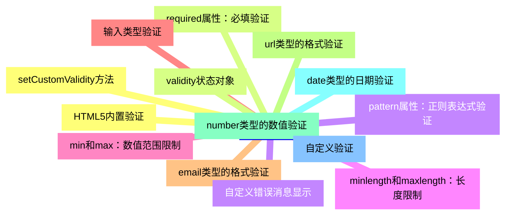
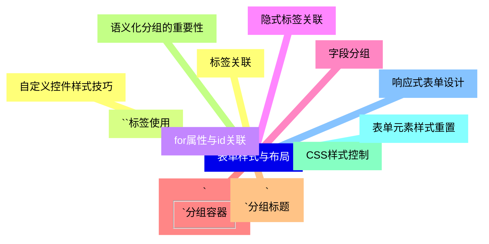
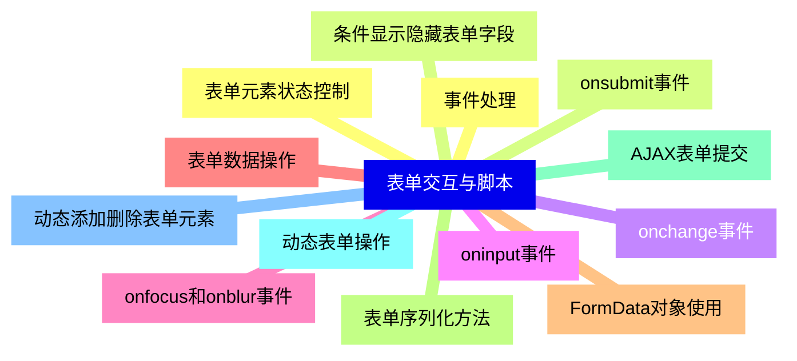
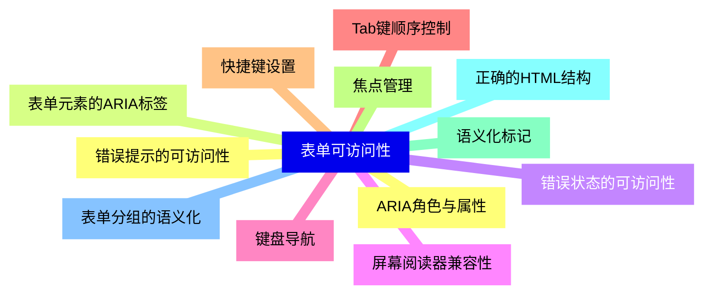
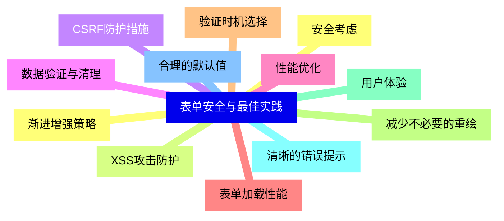

```mermaid
mindmap
    id1[表单基础概念]
        id1-1[表单的定义与作用]
        id1-2[表单在网页中的功能定位]
        id1-3[数据收集与用户交互的重要性]
        id1-4[表单在现代Web应用中的角色]
        id1-5[表单基本结构]
        id1-6[`<form>`标签及其属性]
        id1-7[action和method属性详解]
        id1-8[enctype属性与数据编码方式]
        id1-9[表单元素通用属性]
        id1-10[name属性：数据标识]
        id1-11[value属性：默认值设置]
        id1-12[disabled和readonly属性区别]
        id1-13[required属性与表单验证]
```

```mermaid
mindmap
    id2[输入类控件]
        id2-1[文本输入控件]
        id2-2[`<input type="text">`：单行文本输入]
        id2-3[`<input type="password">`：密码输入框]
        id2-4[`<input type="email">`：邮箱格式验证]
        id2-5[`<input type="url">`：URL格式验证]
        id2-6[`<input type="tel">`：电话号码输入]
        id2-7[`<input type="search">`：搜索框]
        id2-8[数字与范围控件]
        id2-9[`<input type="number">`：数字输入]
        id2-10[`<input type="range">`：滑块控件]
        id2-11[min、max和step属性详解]
        id2-12[日期时间控件]
        id2-13[`<input type="date">`：日期选择]
        id2-14[`<input type="time">`：时间选择]
        id2-15[`<input type="datetime-local">`：本地日期时间]
        id2-16[`<input type="month">`：月份选择]
        id2-17[`<input type="week">`：周选择]
        id2-18[选择类控件]
        id2-19[`<input type="checkbox">`：复选框]
        id2-20[`<input type="radio">`：单选框]
        id2-21[分组与name属性关系]
        id2-22[checked属性与默认选中]
        id2-23[文件上传控件]
        id2-24[`<input type="file">`：文件选择]
        id2-25[accept属性与文件类型限制]
        id2-26[multiple属性与多文件上传]
        id2-27[文件上传的安全考虑]
        id2-28[特殊用途输入控件]
        id2-29[`<input type="color">`：颜色选择器]
        id2-30[`<input type="hidden">`：隐藏字段]
        id2-31[`<input type="submit">`：提交按钮]
        id2-32[`<input type="reset">`：重置按钮]
        id2-33[`<input type="button">`：普通按钮]
```

```mermaid
mindmap
    id3[其他表单控件]
        id3-1[文本区域]
        id3-2[`<textarea>`标签使用]
        id3-3[rows和cols属性设置]
        id3-4[多行文本输入特性]
        id3-5[下拉选择框]
        id3-6[`<select>`和`<option>`标签]
        id3-7[单选与多选模式]
        id3-8[optgroup分组功能]
        id3-9[selected属性与默认选项]
        id3-10[数据列表]
        id3-11[`<datalist>`与`<input list>`配合]
        id3-12[自动完成功能实现]
        id3-13[与select元素的区别]
        id3-14[输出控件]
        id3-15[`<output>`标签使用]
        id3-16[动态结果显示]
        id3-17[与JavaScript的配合]
```

### 1 [表单基础概念](#1)
#### 1.1 [表单的定义与作用](#1)
#### 1.2 [表单在网页中的功能定位](#1)
#### 1.3 [数据收集与用户交互的重要性](#1)
#### 1.4 [表单在现代Web应用中的角色](#1)
#### 1.5 [表单基本结构](#1)
#### 1.6 [`<form>`标签及其属性](#1)
#### 1.7 [action和method属性详解](#1)
#### 1.8 [enctype属性与数据编码方式](#1)
#### 1.9 [表单元素通用属性](#1)
#### 1.10 [name属性：数据标识](#1)
#### 1.11 [value属性：默认值设置](#1)
#### 1.12 [disabled和readonly属性区别](#1)
#### 1.13 [required属性与表单验证](#1)
### 2 [输入类控件](#2)
#### 2.1 [文本输入控件](#2)
#### 2.2 [`<input type="text">`：单行文本输入](#2)
#### 2.3 [`<input type="password">`：密码输入框](#2)
#### 2.4 [`<input type="email">`：邮箱格式验证](#2)
#### 2.5 [`<input type="url">`：URL格式验证](#2)
#### 2.6 [`<input type="tel">`：电话号码输入](#2)
#### 2.7 [`<input type="search">`：搜索框](#2)
#### 2.8 [数字与范围控件](#2)
#### 2.9 [`<input type="number">`：数字输入](#2)
#### 2.10 [`<input type="range">`：滑块控件](#2)
#### 2.11 [min、max和step属性详解](#2)
#### 2.12 [日期时间控件](#2)
#### 2.13 [`<input type="date">`：日期选择](#2)
#### 2.14 [`<input type="time">`：时间选择](#2)
#### 2.15 [`<input type="datetime-local">`：本地日期时间](#2)
#### 2.16 [`<input type="month">`：月份选择](#2)
#### 2.17 [`<input type="week">`：周选择](#2)
#### 2.18 [选择类控件](#2)
#### 2.19 [`<input type="checkbox">`：复选框](#2)
#### 2.20 [`<input type="radio">`：单选框](#2)
#### 2.21 [分组与name属性关系](#2)
#### 2.22 [checked属性与默认选中](#2)
#### 2.23 [文件上传控件](#2)
#### 2.24 [`<input type="file">`：文件选择](#2)
#### 2.25 [accept属性与文件类型限制](#2)
#### 2.26 [multiple属性与多文件上传](#2)
#### 2.27 [文件上传的安全考虑](#2)
#### 2.28 [特殊用途输入控件](#2)
#### 2.29 [`<input type="color">`：颜色选择器](#2)
#### 2.30 [`<input type="hidden">`：隐藏字段](#2)
#### 2.31 [`<input type="submit">`：提交按钮](#2)
#### 2.32 [`<input type="reset">`：重置按钮](#2)
#### 2.33 [`<input type="button">`：普通按钮](#2)
### 3 [其他表单控件](#3)
#### 3.1 [文本区域](#3)
#### 3.2 [`<textarea>`标签使用](#3)
#### 3.3 [rows和cols属性设置](#3)
#### 3.4 [多行文本输入特性](#3)
#### 3.5 [下拉选择框](#3)
#### 3.6 [`<select>`和`<option>`标签](#3)
#### 3.7 [单选与多选模式](#3)
#### 3.8 [optgroup分组功能](#3)
#### 3.9 [selected属性与默认选项](#3)
#### 3.10 [数据列表](#3)
#### 3.11 [`<datalist>`与`<input list>`配合](#3)
#### 3.12 [自动完成功能实现](#3)
#### 3.13 [与select元素的区别](#3)
#### 3.14 [输出控件](#3)
#### 3.15 [`<output>`标签使用](#3)
#### 3.16 [动态结果显示](#3)
#### 3.17 [与JavaScript的配合](#3)
### 4 [表单验证](#4)
#### 4.1 [HTML5内置验证](#4)
#### 4.2 [required属性：必填验证](#4)
#### 4.3 [pattern属性：正则表达式验证](#4)
#### 4.4 [minlength和maxlength：长度限制](#4)
#### 4.5 [min和max：数值范围限制](#4)
#### 4.6 [输入类型验证](#4)
#### 4.7 [email类型的格式验证](#4)
#### 4.8 [url类型的格式验证](#4)
#### 4.9 [number类型的数值验证](#4)
#### 4.10 [date类型的日期验证](#4)
#### 4.11 [自定义验证](#4)
#### 4.12 [setCustomValidity方法](#4)
#### 4.13 [validity状态对象](#4)
#### 4.14 [自定义错误消息显示](#4)
### 5 [表单样式与布局](#5)
#### 5.1 [标签关联](#5)
#### 5.2 [`<label>`标签使用](#5)
#### 5.3 [for属性与id关联](#5)
#### 5.4 [隐式标签关联](#5)
#### 5.5 [字段分组](#5)
#### 5.6 [`<fieldset>`分组容器](#5)
#### 5.7 [`<legend>`分组标题](#5)
#### 5.8 [语义化分组的重要性](#5)
#### 5.9 [CSS样式控制](#5)
#### 5.10 [表单元素样式重置](#5)
#### 5.11 [响应式表单设计](#5)
#### 5.12 [自定义控件样式技巧](#5)
### 6 [表单交互与脚本](#6)
#### 6.1 [事件处理](#6)
#### 6.2 [onsubmit事件](#6)
#### 6.3 [onchange事件](#6)
#### 6.4 [oninput事件](#6)
#### 6.5 [onfocus和onblur事件](#6)
#### 6.6 [表单数据操作](#6)
#### 6.7 [FormData对象使用](#6)
#### 6.8 [表单序列化方法](#6)
#### 6.9 [AJAX表单提交](#6)
#### 6.10 [动态表单操作](#6)
#### 6.11 [动态添加删除表单元素](#6)
#### 6.12 [表单元素状态控制](#6)
#### 6.13 [条件显示隐藏表单字段](#6)
### 7 [表单可访问性](#7)
#### 7.1 [ARIA角色与属性](#7)
#### 7.2 [表单元素的ARIA标签](#7)
#### 7.3 [错误状态的可访问性](#7)
#### 7.4 [屏幕阅读器兼容性](#7)
#### 7.5 [键盘导航](#7)
#### 7.6 [Tab键顺序控制](#7)
#### 7.7 [快捷键设置](#7)
#### 7.8 [焦点管理](#7)
#### 7.9 [语义化标记](#7)
#### 7.10 [正确的HTML结构](#7)
#### 7.11 [表单分组的语义化](#7)
#### 7.12 [错误提示的可访问性](#7)
### 8 [表单安全与最佳实践](#8)
#### 8.1 [安全考虑](#8)
#### 8.2 [XSS攻击防护](#8)
#### 8.3 [CSRF防护措施](#8)
#### 8.4 [数据验证与清理](#8)
#### 8.5 [性能优化](#8)
#### 8.6 [表单加载性能](#8)
#### 8.7 [验证时机选择](#8)
#### 8.8 [减少不必要的重绘](#8)
#### 8.9 [用户体验](#8)
#### 8.10 [清晰的错误提示](#8)
#### 8.11 [合理的默认值](#8)
#### 8.12 [渐进增强策略](#8)




### 1 表单基础概念

---
### 1 表单基础概念
___
#### 1.1 表单的定义与作用
___
#### 1.2 表单在网页中的功能定位
___
#### 1.3 数据收集与用户交互的重要性
___
#### 1.4 表单在现代Web应用中的角色
___
#### 1.5 表单基本结构
___
#### 1.6 `<form>`标签及其属性
___
#### 1.7 action和method属性详解
___
#### 1.8 enctype属性与数据编码方式
___
#### 1.9 表单元素通用属性
___
#### 1.10 name属性：数据标识
___
#### 1.11 value属性：默认值设置
___
#### 1.12 disabled和readonly属性区别
___
#### 1.13 required属性与表单验证
### 2 输入类控件

---
### 2 输入类控件
___
#### 2.1 文本输入控件
___
#### 2.2 `<input type="text">`：单行文本输入
___
#### 2.3 `<input type="password">`：密码输入框
___
#### 2.4 `<input type="email">`：邮箱格式验证
___
#### 2.5 `<input type="url">`：URL格式验证
___
#### 2.6 `<input type="tel">`：电话号码输入
___
#### 2.7 `<input type="search">`：搜索框
___
#### 2.8 数字与范围控件
___
#### 2.9 `<input type="number">`：数字输入
___
#### 2.10 `<input type="range">`：滑块控件
___
#### 2.11 min、max和step属性详解
___
#### 2.12 日期时间控件
___
#### 2.13 `<input type="date">`：日期选择
___
#### 2.14 `<input type="time">`：时间选择
___
#### 2.15 `<input type="datetime-local">`：本地日期时间
___
#### 2.16 `<input type="month">`：月份选择
___
#### 2.17 `<input type="week">`：周选择
___
#### 2.18 选择类控件
___
#### 2.19 `<input type="checkbox">`：复选框
___
#### 2.20 `<input type="radio">`：单选框
___
#### 2.21 分组与name属性关系
___
#### 2.22 checked属性与默认选中
___
#### 2.23 文件上传控件
___
#### 2.24 `<input type="file">`：文件选择
___
#### 2.25 accept属性与文件类型限制
___
#### 2.26 multiple属性与多文件上传
___
#### 2.27 文件上传的安全考虑
___
#### 2.28 特殊用途输入控件
___
#### 2.29 `<input type="color">`：颜色选择器
___
#### 2.30 `<input type="hidden">`：隐藏字段
___
#### 2.31 `<input type="submit">`：提交按钮
___
#### 2.32 `<input type="reset">`：重置按钮
___
#### 2.33 `<input type="button">`：普通按钮
### 3 其他表单控件

---
### 3 其他表单控件
___
#### 3.1 文本区域
___
#### 3.2 `<textarea>`标签使用
___
#### 3.3 rows和cols属性设置
___
#### 3.4 多行文本输入特性
___
#### 3.5 下拉选择框
___
#### 3.6 `<select>`和`<option>`标签
___
#### 3.7 单选与多选模式
___
#### 3.8 optgroup分组功能
___
#### 3.9 selected属性与默认选项
___
#### 3.10 数据列表
___
#### 3.11 `<datalist>`与`<input list>`配合
___
#### 3.12 自动完成功能实现
___
#### 3.13 与select元素的区别
___
#### 3.14 输出控件
___
#### 3.15 `<output>`标签使用
___
#### 3.16 动态结果显示
___
#### 3.17 与JavaScript的配合
### 4 表单验证

---
### 4 表单验证
___
#### 4.1 HTML5内置验证
___
#### 4.2 required属性：必填验证
___
#### 4.3 pattern属性：正则表达式验证
___
#### 4.4 minlength和maxlength：长度限制
___
#### 4.5 min和max：数值范围限制
___
#### 4.6 输入类型验证
___
#### 4.7 email类型的格式验证
___
#### 4.8 url类型的格式验证
___
#### 4.9 number类型的数值验证
___
#### 4.10 date类型的日期验证
___
#### 4.11 自定义验证
___
#### 4.12 setCustomValidity方法
___
#### 4.13 validity状态对象
___
#### 4.14 自定义错误消息显示
### 5 表单样式与布局

---
### 5 表单样式与布局
___
#### 5.1 标签关联
___
#### 5.2 `<label>`标签使用
___
#### 5.3 for属性与id关联
___
#### 5.4 隐式标签关联
___
#### 5.5 字段分组
___
#### 5.6 `<fieldset>`分组容器
___
#### 5.7 `<legend>`分组标题
___
#### 5.8 语义化分组的重要性
___
#### 5.9 CSS样式控制
___
#### 5.10 表单元素样式重置
___
#### 5.11 响应式表单设计
___
#### 5.12 自定义控件样式技巧
### 6 表单交互与脚本

---
### 6 表单交互与脚本
___
#### 6.1 事件处理
___
#### 6.2 onsubmit事件
___
#### 6.3 onchange事件
___
#### 6.4 oninput事件
___
#### 6.5 onfocus和onblur事件
___
#### 6.6 表单数据操作
___
#### 6.7 FormData对象使用
___
#### 6.8 表单序列化方法
___
#### 6.9 AJAX表单提交
___
#### 6.10 动态表单操作
___
#### 6.11 动态添加删除表单元素
___
#### 6.12 表单元素状态控制
___
#### 6.13 条件显示隐藏表单字段
### 7 表单可访问性

---
### 7 表单可访问性
___
#### 7.1 ARIA角色与属性
___
#### 7.2 表单元素的ARIA标签
___
#### 7.3 错误状态的可访问性
___
#### 7.4 屏幕阅读器兼容性
___
#### 7.5 键盘导航
___
#### 7.6 Tab键顺序控制
___
#### 7.7 快捷键设置
___
#### 7.8 焦点管理
___
#### 7.9 语义化标记
___
#### 7.10 正确的HTML结构
___
#### 7.11 表单分组的语义化
___
#### 7.12 错误提示的可访问性
### 8 表单安全与最佳实践

---
### 8 表单安全与最佳实践
___
#### 8.1 安全考虑
___
#### 8.2 XSS攻击防护
___
#### 8.3 CSRF防护措施
___
#### 8.4 数据验证与清理
___
#### 8.5 性能优化
___
#### 8.6 表单加载性能
___
#### 8.7 验证时机选择
___
#### 8.8 减少不必要的重绘
___
#### 8.9 用户体验
___
#### 8.10 清晰的错误提示
___
#### 8.11 合理的默认值
___
#### 8.12 渐进增强策略


### 1 表单基础概念{#1}

{}

<--->
{}
{}
{}
{}
{}
{}
{}
{}
{}
{}
{}
{}
{}
{}
{}
{}
{}
{}
{}
{}
{}
{}
{}
{}
{}
{}
{}

### 2 输入类控件{#2}

{}
{}
{}
{}
{}
{}
{}
{}
{}
{}
{}
{}
{}
{}
{}
{}
{}
{}
{}
{}
{}
{}
{}
{}
{}
{}
{}
{}
{}
{}
{}
{}
{}
{}
{}
{}
{}
{}
{}
{}
{}
{}
{}
{}
{}
{}
{}
{}
{}
{}
{}
{}
{}
{}
{}
{}
{}
{}
{}
{}
{}
{}
{}
{}
{}
{}
{}
<--->

{}

### 3 其他表单控件{#3}

{}

<--->
{}
{}
{}
{}
{}
{}
{}
{}
{}
{}
{}
{}
{}
{}
{}
{}
{}
{}
{}
{}
{}
{}
{}
{}
{}
{}
{}
{}
{}
{}
{}
{}
{}
{}
{}

### 4 表单验证{#4}

{}
{}
{}
{}
{}
{}
{}
{}
{}
{}
{}
{}
{}
{}
{}
{}
{}
{}
{}
{}
{}
{}
{}
{}
{}
{}
{}
{}
{}
<--->

{}

### 5 表单样式与布局{#5}

{}

<--->
{}
{}
{}
{}
{}
{}
{}
{}
{}
{}
{}
{}
{}
{}
{}
{}
{}
{}
{}
{}
{}
{}
{}
{}
{}

### 6 表单交互与脚本{#6}

{}
{}
{}
{}
{}
{}
{}
{}
{}
{}
{}
{}
{}
{}
{}
{}
{}
{}
{}
{}
{}
{}
{}
{}
{}
{}
{}
<--->

{}

### 7 表单可访问性{#7}

{}

<--->
{}
{}
{}
{}
{}
{}
{}
{}
{}
{}
{}
{}
{}
{}
{}
{}
{}
{}
{}
{}
{}
{}
{}
{}
{}

### 8 表单安全与最佳实践{#8}

{}
{}
{}
{}
{}
{}
{}
{}
{}
{}
{}
{}
{}
{}
{}
{}
{}
{}
{}
{}
{}
{}
{}
{}
{}
<--->

{}
