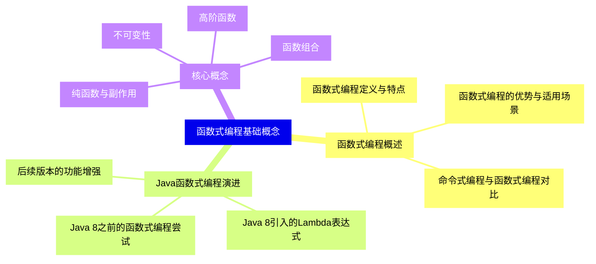
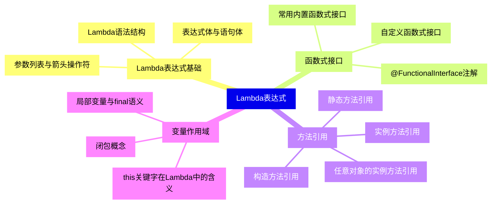
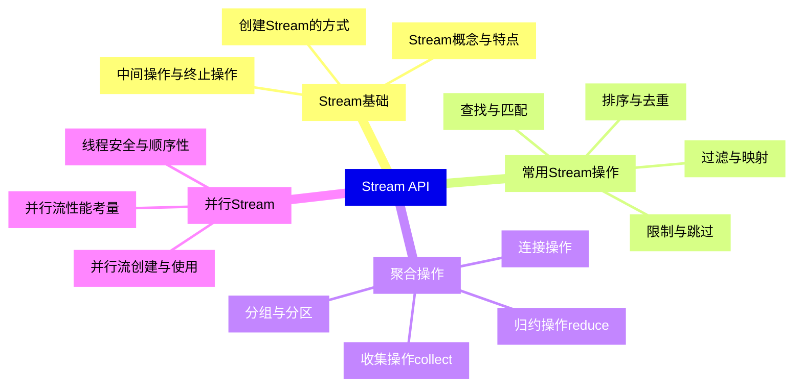
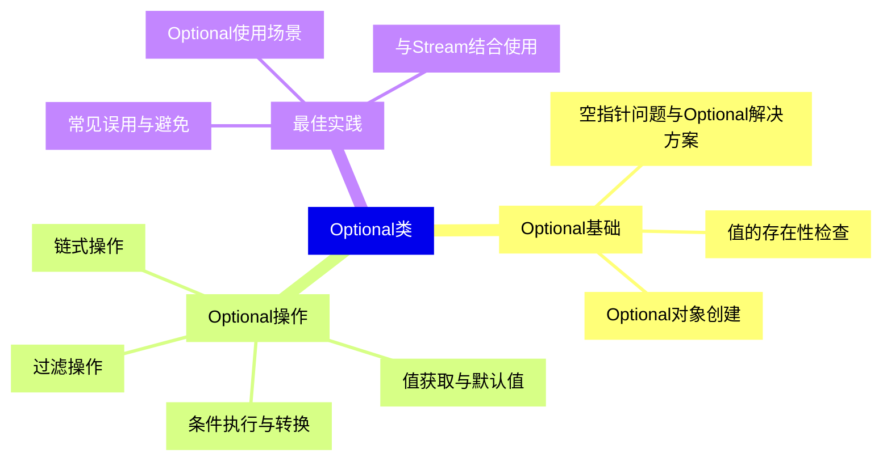
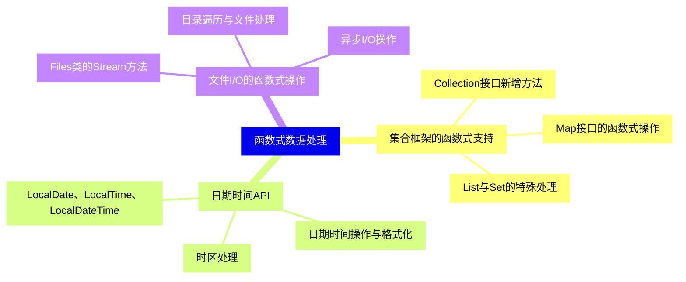
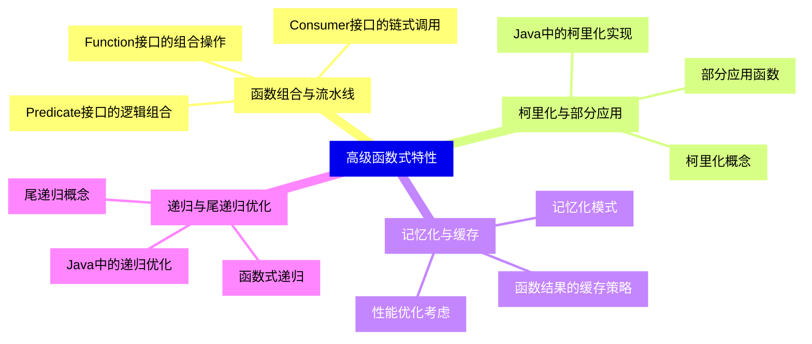
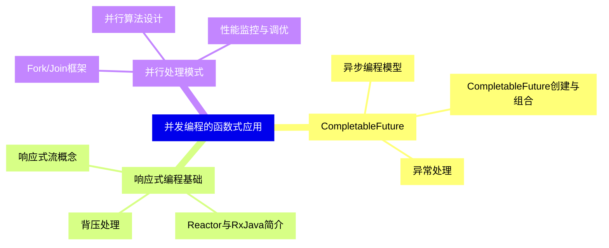
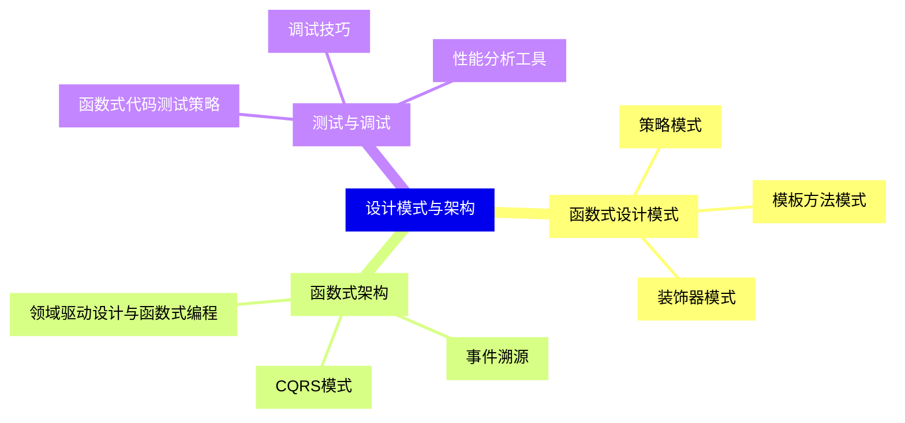
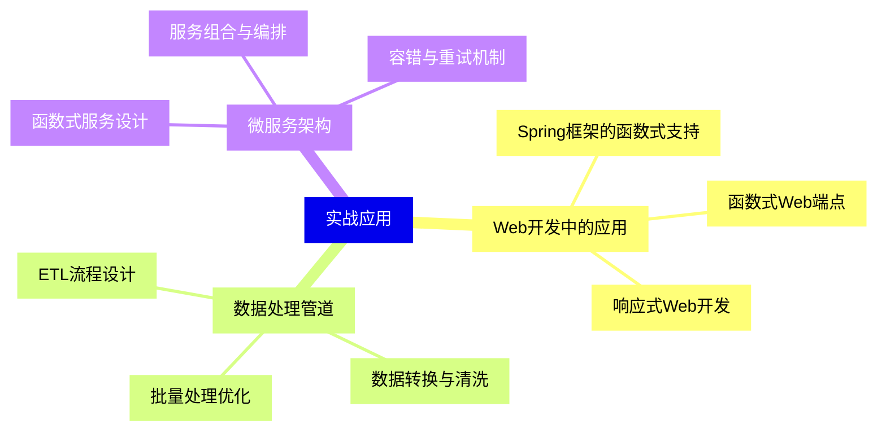
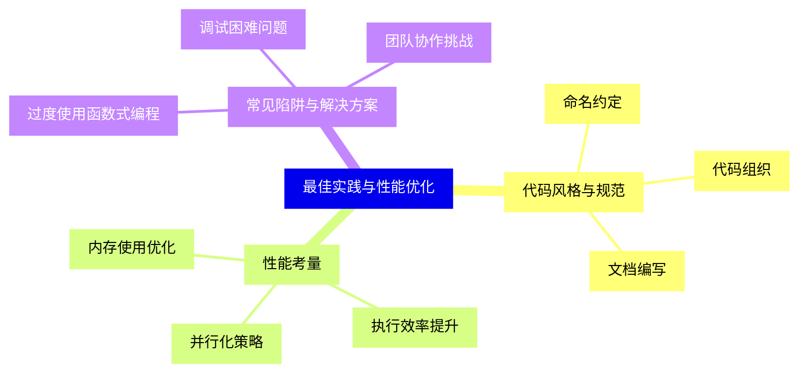


### 1 [函数式编程基础概念](#1)
#### 1.1 [函数式编程概述](#1)
##### 1.1.1 [函数式编程定义与特点](#1)
##### 1.1.2 [命令式编程与函数式编程对比](#1)
##### 1.1.3 [函数式编程的优势与适用场景](#1)
#### 1.2 [Java函数式编程演进](#1)
##### 1.2.1 [Java 8之前的函数式编程尝试](#1)
##### 1.2.2 [Java 8引入的Lambda表达式](#1)
##### 1.2.3 [后续版本的功能增强](#1)
#### 1.3 [核心概念](#1)
##### 1.3.1 [纯函数与副作用](#1)
##### 1.3.2 [不可变性](#1)
##### 1.3.3 [高阶函数](#1)
##### 1.3.4 [函数组合](#1)
### 2 [Lambda表达式](#2)
#### 2.1 [Lambda表达式基础](#2)
##### 2.1.1 [Lambda语法结构](#2)
##### 2.1.2 [参数列表与箭头操作符](#2)
##### 2.1.3 [表达式体与语句体](#2)
#### 2.2 [函数式接口](#2)
##### 2.2.1 [@FunctionalInterface注解](#2)
##### 2.2.2 [常用内置函数式接口](#2)
##### 2.2.3 [自定义函数式接口](#2)
#### 2.3 [方法引用](#2)
##### 2.3.1 [静态方法引用](#2)
##### 2.3.2 [实例方法引用](#2)
##### 2.3.3 [构造方法引用](#2)
##### 2.3.4 [任意对象的实例方法引用](#2)
#### 2.4 [变量作用域](#2)
##### 2.4.1 [局部变量与final语义](#2)
##### 2.4.2 [this关键字在Lambda中的含义](#2)
##### 2.4.3 [闭包概念](#2)
### 3 [Stream API](#3)
#### 3.1 [Stream基础](#3)
##### 3.1.1 [Stream概念与特点](#3)
##### 3.1.2 [创建Stream的方式](#3)
##### 3.1.3 [中间操作与终止操作](#3)
#### 3.2 [常用Stream操作](#3)
##### 3.2.1 [过滤与映射](#3)
##### 3.2.2 [排序与去重](#3)
##### 3.2.3 [限制与跳过](#3)
##### 3.2.4 [查找与匹配](#3)
#### 3.3 [聚合操作](#3)
##### 3.3.1 [归约操作reduce](#3)
##### 3.3.2 [收集操作collect](#3)
##### 3.3.3 [分组与分区](#3)
##### 3.3.4 [连接操作](#3)
#### 3.4 [并行Stream](#3)
##### 3.4.1 [并行流创建与使用](#3)
##### 3.4.2 [并行流性能考量](#3)
##### 3.4.3 [线程安全与顺序性](#3)
### 4 [Optional类](#4)
#### 4.1 [Optional基础](#4)
##### 4.1.1 [空指针问题与Optional解决方案](#4)
##### 4.1.2 [Optional对象创建](#4)
##### 4.1.3 [值的存在性检查](#4)
#### 4.2 [Optional操作](#4)
##### 4.2.1 [值获取与默认值](#4)
##### 4.2.2 [条件执行与转换](#4)
##### 4.2.3 [链式操作](#4)
##### 4.2.4 [过滤操作](#4)
#### 4.3 [最佳实践](#4)
##### 4.3.1 [Optional使用场景](#4)
##### 4.3.2 [常见误用与避免](#4)
##### 4.3.3 [与Stream结合使用](#4)
### 5 [函数式数据处理](#5)
#### 5.1 [集合框架的函数式支持](#5)
##### 5.1.1 [Collection接口新增方法](#5)
##### 5.1.2 [Map接口的函数式操作](#5)
##### 5.1.3 [List与Set的特殊处理](#5)
#### 5.2 [日期时间API](#5)
##### 5.2.1 [LocalDate、LocalTime、LocalDateTime](#5)
##### 5.2.2 [日期时间操作与格式化](#5)
##### 5.2.3 [时区处理](#5)
#### 5.3 [文件I/O的函数式操作](#5)
##### 5.3.1 [Files类的Stream方法](#5)
##### 5.3.2 [目录遍历与文件处理](#5)
##### 5.3.3 [异步I/O操作](#5)
### 6 [高级函数式特性](#6)
#### 6.1 [函数组合与流水线](#6)
##### 6.1.1 [Function接口的组合操作](#6)
##### 6.1.2 [Predicate接口的逻辑组合](#6)
##### 6.1.3 [Consumer接口的链式调用](#6)
#### 6.2 [柯里化与部分应用](#6)
##### 6.2.1 [柯里化概念](#6)
##### 6.2.2 [Java中的柯里化实现](#6)
##### 6.2.3 [部分应用函数](#6)
#### 6.3 [记忆化与缓存](#6)
##### 6.3.1 [记忆化模式](#6)
##### 6.3.2 [函数结果的缓存策略](#6)
##### 6.3.3 [性能优化考虑](#6)
#### 6.4 [递归与尾递归优化](#6)
##### 6.4.1 [函数式递归](#6)
##### 6.4.2 [尾递归概念](#6)
##### 6.4.3 [Java中的递归优化](#6)
### 7 [并发编程的函数式应用](#7)
#### 7.1 [CompletableFuture](#7)
##### 7.1.1 [异步编程模型](#7)
##### 7.1.2 [CompletableFuture创建与组合](#7)
##### 7.1.3 [异常处理](#7)
#### 7.2 [响应式编程基础](#7)
##### 7.2.1 [响应式流概念](#7)
##### 7.2.2 [Reactor与RxJava简介](#7)
##### 7.2.3 [背压处理](#7)
#### 7.3 [并行处理模式](#7)
##### 7.3.1 [Fork/Join框架](#7)
##### 7.3.2 [并行算法设计](#7)
##### 7.3.3 [性能监控与调优](#7)
### 8 [设计模式与架构](#8)
#### 8.1 [函数式设计模式](#8)
##### 8.1.1 [策略模式](#8)
##### 8.1.2 [模板方法模式](#8)
##### 8.1.3 [装饰器模式](#8)
#### 8.2 [函数式架构](#8)
##### 8.2.1 [领域驱动设计与函数式编程](#8)
##### 8.2.2 [事件溯源](#8)
##### 8.2.3 [CQRS模式](#8)
#### 8.3 [测试与调试](#8)
##### 8.3.1 [函数式代码测试策略](#8)
##### 8.3.2 [调试技巧](#8)
##### 8.3.3 [性能分析工具](#8)
### 9 [实战应用](#9)
#### 9.1 [Web开发中的应用](#9)
##### 9.1.1 [Spring框架的函数式支持](#9)
##### 9.1.2 [函数式Web端点](#9)
##### 9.1.3 [响应式Web开发](#9)
#### 9.2 [数据处理管道](#9)
##### 9.2.1 [ETL流程设计](#9)
##### 9.2.2 [数据转换与清洗](#9)
##### 9.2.3 [批量处理优化](#9)
#### 9.3 [微服务架构](#9)
##### 9.3.1 [函数式服务设计](#9)
##### 9.3.2 [服务组合与编排](#9)
##### 9.3.3 [容错与重试机制](#9)
### 10 [最佳实践与性能优化](#10)
#### 10.1 [代码风格与规范](#10)
##### 10.1.1 [命名约定](#10)
##### 10.1.2 [代码组织](#10)
##### 10.1.3 [文档编写](#10)
#### 10.2 [性能考量](#10)
##### 10.2.1 [内存使用优化](#10)
##### 10.2.2 [执行效率提升](#10)
##### 10.2.3 [并行化策略](#10)
#### 10.3 [常见陷阱与解决方案](#10)
##### 10.3.1 [过度使用函数式编程](#10)
##### 10.3.2 [调试困难问题](#10)
##### 10.3.3 [团队协作挑战](#10)




### 1 函数式编程基础概念

---
### 1 函数式编程基础概念
___
#### 1.1 函数式编程概述
___
##### 1.1.1 函数式编程定义与特点
___
##### 1.1.2 命令式编程与函数式编程对比
___
##### 1.1.3 函数式编程的优势与适用场景
___
#### 1.2 Java函数式编程演进
___
##### 1.2.1 Java 8之前的函数式编程尝试
___
##### 1.2.2 Java 8引入的Lambda表达式
___
##### 1.2.3 后续版本的功能增强
___
#### 1.3 核心概念
___
##### 1.3.1 纯函数与副作用
___
##### 1.3.2 不可变性
___
##### 1.3.3 高阶函数
___
##### 1.3.4 函数组合
### 2 Lambda表达式

---
### 2 Lambda表达式
___
#### 2.1 Lambda表达式基础
___
##### 2.1.1 Lambda语法结构
___
##### 2.1.2 参数列表与箭头操作符
___
##### 2.1.3 表达式体与语句体
___
#### 2.2 函数式接口
___
##### 2.2.1 @FunctionalInterface注解
___
##### 2.2.2 常用内置函数式接口
___
##### 2.2.3 自定义函数式接口
___
#### 2.3 方法引用
___
##### 2.3.1 静态方法引用
___
##### 2.3.2 实例方法引用
___
##### 2.3.3 构造方法引用
___
##### 2.3.4 任意对象的实例方法引用
___
#### 2.4 变量作用域
___
##### 2.4.1 局部变量与final语义
___
##### 2.4.2 this关键字在Lambda中的含义
___
##### 2.4.3 闭包概念
### 3 Stream API

---
### 3 Stream API
___
#### 3.1 Stream基础
___
##### 3.1.1 Stream概念与特点
___
##### 3.1.2 创建Stream的方式
___
##### 3.1.3 中间操作与终止操作
___
#### 3.2 常用Stream操作
___
##### 3.2.1 过滤与映射
___
##### 3.2.2 排序与去重
___
##### 3.2.3 限制与跳过
___
##### 3.2.4 查找与匹配
___
#### 3.3 聚合操作
___
##### 3.3.1 归约操作reduce
___
##### 3.3.2 收集操作collect
___
##### 3.3.3 分组与分区
___
##### 3.3.4 连接操作
___
#### 3.4 并行Stream
___
##### 3.4.1 并行流创建与使用
___
##### 3.4.2 并行流性能考量
___
##### 3.4.3 线程安全与顺序性
### 4 Optional类

---
### 4 Optional类
___
#### 4.1 Optional基础
___
##### 4.1.1 空指针问题与Optional解决方案
___
##### 4.1.2 Optional对象创建
___
##### 4.1.3 值的存在性检查
___
#### 4.2 Optional操作
___
##### 4.2.1 值获取与默认值
___
##### 4.2.2 条件执行与转换
___
##### 4.2.3 链式操作
___
##### 4.2.4 过滤操作
___
#### 4.3 最佳实践
___
##### 4.3.1 Optional使用场景
___
##### 4.3.2 常见误用与避免
___
##### 4.3.3 与Stream结合使用
### 5 函数式数据处理

---
### 5 函数式数据处理
___
#### 5.1 集合框架的函数式支持
___
##### 5.1.1 Collection接口新增方法
___
##### 5.1.2 Map接口的函数式操作
___
##### 5.1.3 List与Set的特殊处理
___
#### 5.2 日期时间API
___
##### 5.2.1 LocalDate、LocalTime、LocalDateTime
___
##### 5.2.2 日期时间操作与格式化
___
##### 5.2.3 时区处理
___
#### 5.3 文件I/O的函数式操作
___
##### 5.3.1 Files类的Stream方法
___
##### 5.3.2 目录遍历与文件处理
___
##### 5.3.3 异步I/O操作
### 6 高级函数式特性

---
### 6 高级函数式特性
___
#### 6.1 函数组合与流水线
___
##### 6.1.1 Function接口的组合操作
___
##### 6.1.2 Predicate接口的逻辑组合
___
##### 6.1.3 Consumer接口的链式调用
___
#### 6.2 柯里化与部分应用
___
##### 6.2.1 柯里化概念
___
##### 6.2.2 Java中的柯里化实现
___
##### 6.2.3 部分应用函数
___
#### 6.3 记忆化与缓存
___
##### 6.3.1 记忆化模式
___
##### 6.3.2 函数结果的缓存策略
___
##### 6.3.3 性能优化考虑
___
#### 6.4 递归与尾递归优化
___
##### 6.4.1 函数式递归
___
##### 6.4.2 尾递归概念
___
##### 6.4.3 Java中的递归优化
### 7 并发编程的函数式应用

---
### 7 并发编程的函数式应用
___
#### 7.1 CompletableFuture
___
##### 7.1.1 异步编程模型
___
##### 7.1.2 CompletableFuture创建与组合
___
##### 7.1.3 异常处理
___
#### 7.2 响应式编程基础
___
##### 7.2.1 响应式流概念
___
##### 7.2.2 Reactor与RxJava简介
___
##### 7.2.3 背压处理
___
#### 7.3 并行处理模式
___
##### 7.3.1 Fork/Join框架
___
##### 7.3.2 并行算法设计
___
##### 7.3.3 性能监控与调优
### 8 设计模式与架构

---
### 8 设计模式与架构
___
#### 8.1 函数式设计模式
___
##### 8.1.1 策略模式
___
##### 8.1.2 模板方法模式
___
##### 8.1.3 装饰器模式
___
#### 8.2 函数式架构
___
##### 8.2.1 领域驱动设计与函数式编程
___
##### 8.2.2 事件溯源
___
##### 8.2.3 CQRS模式
___
#### 8.3 测试与调试
___
##### 8.3.1 函数式代码测试策略
___
##### 8.3.2 调试技巧
___
##### 8.3.3 性能分析工具
### 9 实战应用

---
### 9 实战应用
___
#### 9.1 Web开发中的应用
___
##### 9.1.1 Spring框架的函数式支持
___
##### 9.1.2 函数式Web端点
___
##### 9.1.3 响应式Web开发
___
#### 9.2 数据处理管道
___
##### 9.2.1 ETL流程设计
___
##### 9.2.2 数据转换与清洗
___
##### 9.2.3 批量处理优化
___
#### 9.3 微服务架构
___
##### 9.3.1 函数式服务设计
___
##### 9.3.2 服务组合与编排
___
##### 9.3.3 容错与重试机制
### 10 最佳实践与性能优化

---
### 10 最佳实践与性能优化
___
#### 10.1 代码风格与规范
___
##### 10.1.1 命名约定
___
##### 10.1.2 代码组织
___
##### 10.1.3 文档编写
___
#### 10.2 性能考量
___
##### 10.2.1 内存使用优化
___
##### 10.2.2 执行效率提升
___
##### 10.2.3 并行化策略
___
#### 10.3 常见陷阱与解决方案
___
##### 10.3.1 过度使用函数式编程
___
##### 10.3.2 调试困难问题
___
##### 10.3.3 团队协作挑战


### 1 函数式编程基础概念{#1}

{}

<--->
{}
{}
{}
{}
{}
{}
{}
{}
{}
{}
{}
{}
{}
{}
{}
{}
{}
{}
{}
{}
{}
{}
{}
{}
{}
{}
{}

### 2 Lambda表达式{#2}

{}
{}
{}
{}
{}
{}
{}
{}
{}
{}
{}
{}
{}
{}
{}
{}
{}
{}
{}
{}
{}
{}
{}
{}
{}
{}
{}
{}
{}
{}
{}
{}
{}
{}
{}
<--->

{}

### 3 Stream API{#3}

{}

<--->
{}
{}
{}
{}
{}
{}
{}
{}
{}
{}
{}
{}
{}
{}
{}
{}
{}
{}
{}
{}
{}
{}
{}
{}
{}
{}
{}
{}
{}
{}
{}
{}
{}
{}
{}
{}
{}

### 4 Optional类{#4}

{}
{}
{}
{}
{}
{}
{}
{}
{}
{}
{}
{}
{}
{}
{}
{}
{}
{}
{}
{}
{}
{}
{}
{}
{}
{}
{}
<--->

{}

### 5 函数式数据处理{#5}

{}

<--->
{}
{}
{}
{}
{}
{}
{}
{}
{}
{}
{}
{}
{}
{}
{}
{}
{}
{}
{}
{}
{}
{}
{}
{}
{}

### 6 高级函数式特性{#6}

{}
{}
{}
{}
{}
{}
{}
{}
{}
{}
{}
{}
{}
{}
{}
{}
{}
{}
{}
{}
{}
{}
{}
{}
{}
{}
{}
{}
{}
{}
{}
{}
{}
<--->

{}

### 7 并发编程的函数式应用{#7}

{}

<--->
{}
{}
{}
{}
{}
{}
{}
{}
{}
{}
{}
{}
{}
{}
{}
{}
{}
{}
{}
{}
{}
{}
{}
{}
{}

### 8 设计模式与架构{#8}

{}
{}
{}
{}
{}
{}
{}
{}
{}
{}
{}
{}
{}
{}
{}
{}
{}
{}
{}
{}
{}
{}
{}
{}
{}
<--->

{}

### 9 实战应用{#9}

{}

<--->
{}
{}
{}
{}
{}
{}
{}
{}
{}
{}
{}
{}
{}
{}
{}
{}
{}
{}
{}
{}
{}
{}
{}
{}
{}

### 10 最佳实践与性能优化{#10}

{}
{}
{}
{}
{}
{}
{}
{}
{}
{}
{}
{}
{}
{}
{}
{}
{}
{}
{}
{}
{}
{}
{}
{}
{}
<--->

{}
