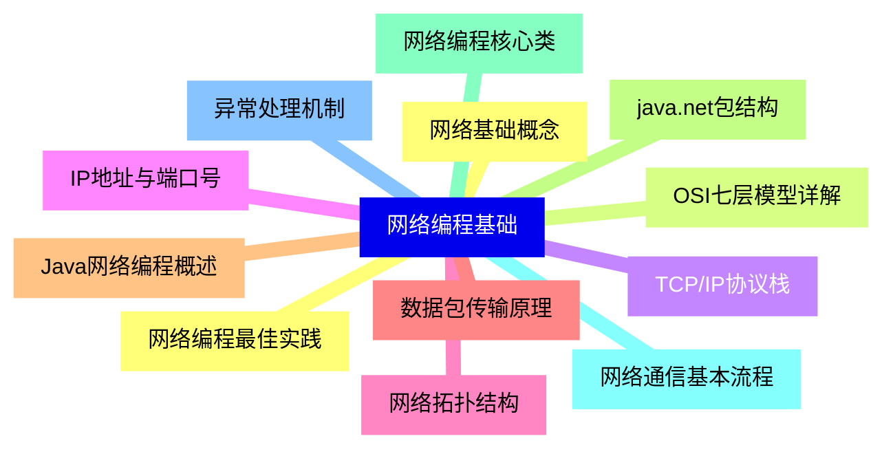
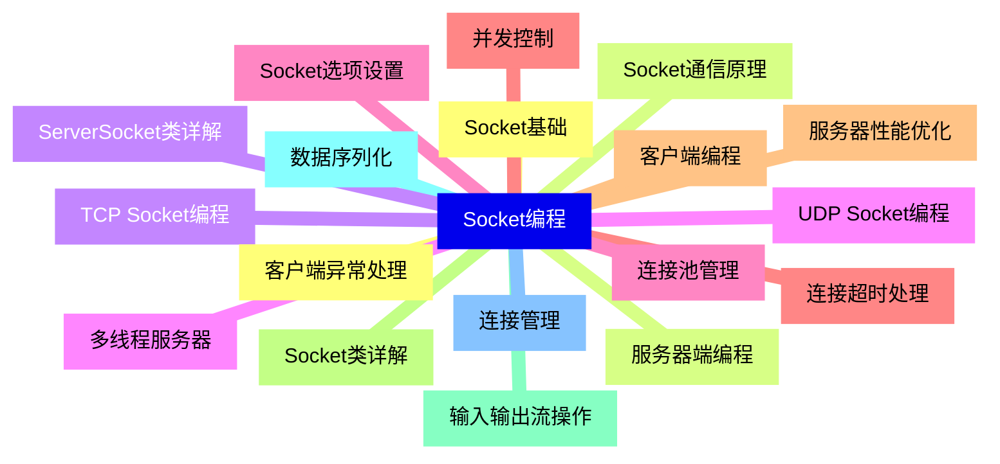
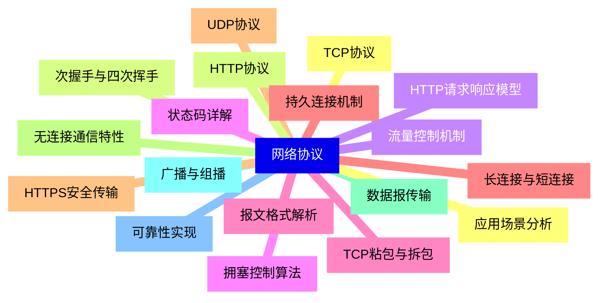
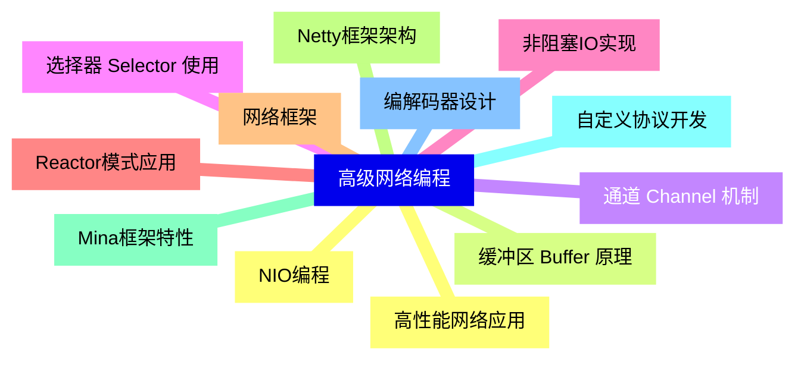
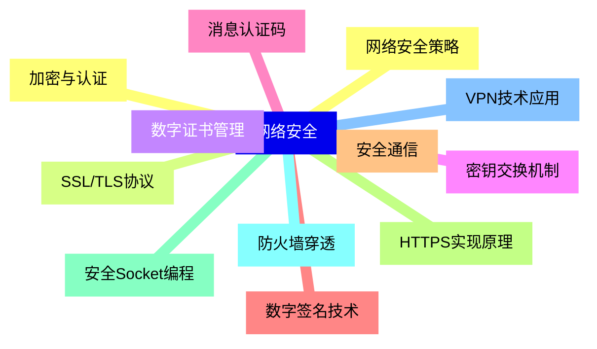
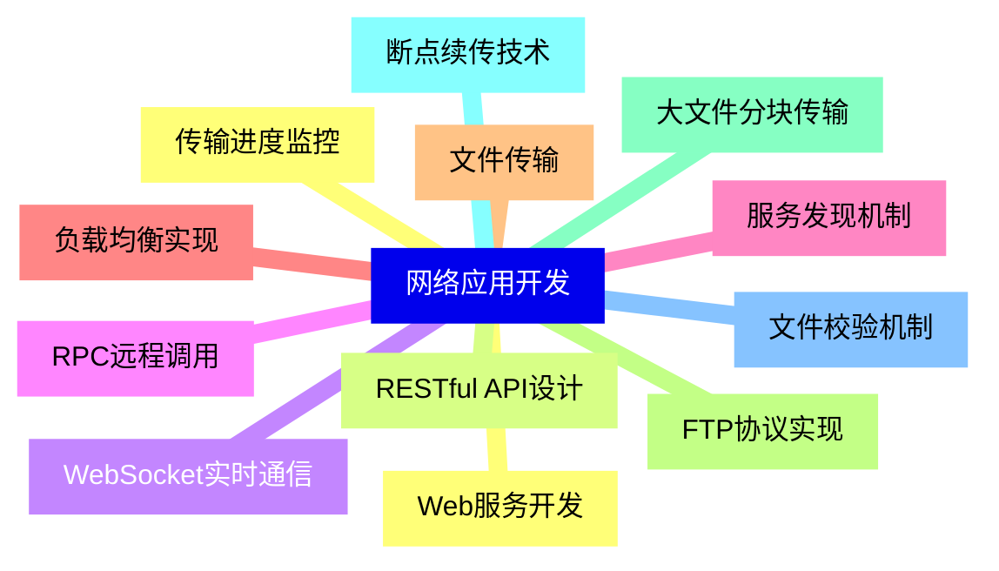
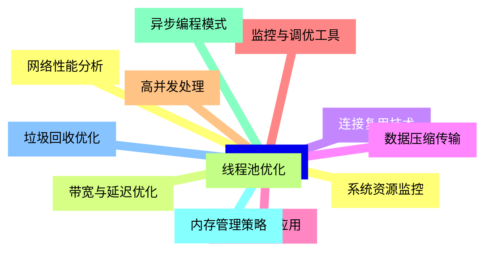
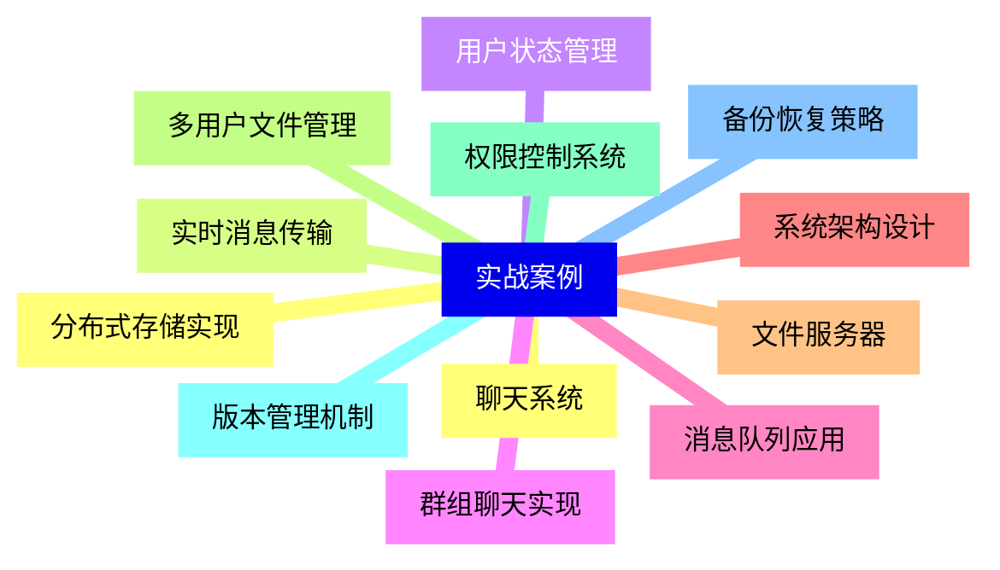


### 1 [网络编程基础](#1)
#### 1.1 [网络基础概念](#1)
#### 1.2 [OSI七层模型详解](#1)
#### 1.3 [TCP/IP协议栈](#1)
#### 1.4 [IP地址与端口号](#1)
#### 1.5 [网络拓扑结构](#1)
#### 1.6 [数据包传输原理](#1)
#### 1.7 [Java网络编程概述](#1)
#### 1.8 [java.net包结构](#1)
#### 1.9 [网络编程核心类](#1)
#### 1.10 [网络通信基本流程](#1)
#### 1.11 [异常处理机制](#1)
#### 1.12 [网络编程最佳实践](#1)
### 2 [Socket编程](#2)
#### 2.1 [Socket基础](#2)
#### 2.2 [Socket通信原理](#2)
#### 2.3 [TCP Socket编程](#2)
#### 2.4 [UDP Socket编程](#2)
#### 2.5 [Socket选项设置](#2)
#### 2.6 [连接超时处理](#2)
#### 2.7 [客户端编程](#2)
#### 2.8 [Socket类详解](#2)
#### 2.9 [输入输出流操作](#2)
#### 2.10 [数据序列化](#2)
#### 2.11 [连接管理](#2)
#### 2.12 [客户端异常处理](#2)
#### 2.13 [服务器端编程](#2)
#### 2.14 [ServerSocket类详解](#2)
#### 2.15 [多线程服务器](#2)
#### 2.16 [连接池管理](#2)
#### 2.17 [并发控制](#2)
#### 2.18 [服务器性能优化](#2)
### 3 [网络协议](#3)
#### 3.1 [TCP协议](#3)
#### 3.2 [次握手与四次挥手](#3)
#### 3.3 [流量控制机制](#3)
#### 3.4 [拥塞控制算法](#3)
#### 3.5 [TCP粘包与拆包](#3)
#### 3.6 [长连接与短连接](#3)
#### 3.7 [UDP协议](#3)
#### 3.8 [无连接通信特性](#3)
#### 3.9 [数据报传输](#3)
#### 3.10 [广播与组播](#3)
#### 3.11 [可靠性实现](#3)
#### 3.12 [应用场景分析](#3)
#### 3.13 [HTTP协议](#3)
#### 3.14 [HTTP请求响应模型](#3)
#### 3.15 [状态码详解](#3)
#### 3.16 [报文格式解析](#3)
#### 3.17 [持久连接机制](#3)
#### 3.18 [HTTPS安全传输](#3)
### 4 [高级网络编程](#4)
#### 4.1 [NIO编程](#4)
#### 4.2 [缓冲区 Buffer 原理](#4)
#### 4.3 [通道 Channel 机制](#4)
#### 4.4 [选择器 Selector 使用](#4)
#### 4.5 [非阻塞IO实现](#4)
#### 4.6 [Reactor模式应用](#4)
#### 4.7 [网络框架](#4)
#### 4.8 [Netty框架架构](#4)
#### 4.9 [Mina框架特性](#4)
#### 4.10 [自定义协议开发](#4)
#### 4.11 [编解码器设计](#4)
#### 4.12 [高性能网络应用](#4)
### 5 [网络安全](#5)
#### 5.1 [加密与认证](#5)
#### 5.2 [SSL/TLS协议](#5)
#### 5.3 [数字证书管理](#5)
#### 5.4 [密钥交换机制](#5)
#### 5.5 [消息认证码](#5)
#### 5.6 [数字签名技术](#5)
#### 5.7 [安全通信](#5)
#### 5.8 [HTTPS实现原理](#5)
#### 5.9 [安全Socket编程](#5)
#### 5.10 [防火墙穿透](#5)
#### 5.11 [VPN技术应用](#5)
#### 5.12 [网络安全策略](#5)
### 6 [网络应用开发](#6)
#### 6.1 [Web服务开发](#6)
#### 6.2 [RESTful API设计](#6)
#### 6.3 [WebSocket实时通信](#6)
#### 6.4 [RPC远程调用](#6)
#### 6.5 [服务发现机制](#6)
#### 6.6 [负载均衡实现](#6)
#### 6.7 [文件传输](#6)
#### 6.8 [FTP协议实现](#6)
#### 6.9 [大文件分块传输](#6)
#### 6.10 [断点续传技术](#6)
#### 6.11 [文件校验机制](#6)
#### 6.12 [传输进度监控](#6)
### 7 [性能优化](#7)
#### 7.1 [网络性能分析](#7)
#### 7.2 [带宽与延迟优化](#7)
#### 7.3 [连接复用技术](#7)
#### 7.4 [数据压缩传输](#7)
#### 7.5 [缓存机制应用](#7)
#### 7.6 [监控与调优工具](#7)
#### 7.7 [高并发处理](#7)
#### 7.8 [线程池优化](#7)
#### 7.9 [异步编程模式](#7)
#### 7.10 [内存管理策略](#7)
#### 7.11 [垃圾回收优化](#7)
#### 7.12 [系统资源监控](#7)
### 8 [实战案例](#8)
#### 8.1 [聊天系统](#8)
#### 8.2 [实时消息传输](#8)
#### 8.3 [用户状态管理](#8)
#### 8.4 [群组聊天实现](#8)
#### 8.5 [消息队列应用](#8)
#### 8.6 [系统架构设计](#8)
#### 8.7 [文件服务器](#8)
#### 8.8 [多用户文件管理](#8)
#### 8.9 [权限控制系统](#8)
#### 8.10 [版本管理机制](#8)
#### 8.11 [备份恢复策略](#8)
#### 8.12 [分布式存储实现](#8)




### 1 网络编程基础

---
### 1 网络编程基础
___
#### 1.1 网络基础概念
___
#### 1.2 OSI七层模型详解
___
#### 1.3 TCP/IP协议栈
___
#### 1.4 IP地址与端口号
___
#### 1.5 网络拓扑结构
___
#### 1.6 数据包传输原理
___
#### 1.7 Java网络编程概述
___
#### 1.8 java.net包结构
___
#### 1.9 网络编程核心类
___
#### 1.10 网络通信基本流程
___
#### 1.11 异常处理机制
___
#### 1.12 网络编程最佳实践
### 2 Socket编程

---
### 2 Socket编程
___
#### 2.1 Socket基础
___
#### 2.2 Socket通信原理
___
#### 2.3 TCP Socket编程
___
#### 2.4 UDP Socket编程
___
#### 2.5 Socket选项设置
___
#### 2.6 连接超时处理
___
#### 2.7 客户端编程
___
#### 2.8 Socket类详解
___
#### 2.9 输入输出流操作
___
#### 2.10 数据序列化
___
#### 2.11 连接管理
___
#### 2.12 客户端异常处理
___
#### 2.13 服务器端编程
___
#### 2.14 ServerSocket类详解
___
#### 2.15 多线程服务器
___
#### 2.16 连接池管理
___
#### 2.17 并发控制
___
#### 2.18 服务器性能优化
### 3 网络协议

---
### 3 网络协议
___
#### 3.1 TCP协议
___
#### 3.2 次握手与四次挥手
___
#### 3.3 流量控制机制
___
#### 3.4 拥塞控制算法
___
#### 3.5 TCP粘包与拆包
___
#### 3.6 长连接与短连接
___
#### 3.7 UDP协议
___
#### 3.8 无连接通信特性
___
#### 3.9 数据报传输
___
#### 3.10 广播与组播
___
#### 3.11 可靠性实现
___
#### 3.12 应用场景分析
___
#### 3.13 HTTP协议
___
#### 3.14 HTTP请求响应模型
___
#### 3.15 状态码详解
___
#### 3.16 报文格式解析
___
#### 3.17 持久连接机制
___
#### 3.18 HTTPS安全传输
### 4 高级网络编程

---
### 4 高级网络编程
___
#### 4.1 NIO编程
___
#### 4.2 缓冲区 Buffer 原理
___
#### 4.3 通道 Channel 机制
___
#### 4.4 选择器 Selector 使用
___
#### 4.5 非阻塞IO实现
___
#### 4.6 Reactor模式应用
___
#### 4.7 网络框架
___
#### 4.8 Netty框架架构
___
#### 4.9 Mina框架特性
___
#### 4.10 自定义协议开发
___
#### 4.11 编解码器设计
___
#### 4.12 高性能网络应用
### 5 网络安全

---
### 5 网络安全
___
#### 5.1 加密与认证
___
#### 5.2 SSL/TLS协议
___
#### 5.3 数字证书管理
___
#### 5.4 密钥交换机制
___
#### 5.5 消息认证码
___
#### 5.6 数字签名技术
___
#### 5.7 安全通信
___
#### 5.8 HTTPS实现原理
___
#### 5.9 安全Socket编程
___
#### 5.10 防火墙穿透
___
#### 5.11 VPN技术应用
___
#### 5.12 网络安全策略
### 6 网络应用开发

---
### 6 网络应用开发
___
#### 6.1 Web服务开发
___
#### 6.2 RESTful API设计
___
#### 6.3 WebSocket实时通信
___
#### 6.4 RPC远程调用
___
#### 6.5 服务发现机制
___
#### 6.6 负载均衡实现
___
#### 6.7 文件传输
___
#### 6.8 FTP协议实现
___
#### 6.9 大文件分块传输
___
#### 6.10 断点续传技术
___
#### 6.11 文件校验机制
___
#### 6.12 传输进度监控
### 7 性能优化

---
### 7 性能优化
___
#### 7.1 网络性能分析
___
#### 7.2 带宽与延迟优化
___
#### 7.3 连接复用技术
___
#### 7.4 数据压缩传输
___
#### 7.5 缓存机制应用
___
#### 7.6 监控与调优工具
___
#### 7.7 高并发处理
___
#### 7.8 线程池优化
___
#### 7.9 异步编程模式
___
#### 7.10 内存管理策略
___
#### 7.11 垃圾回收优化
___
#### 7.12 系统资源监控
### 8 实战案例

---
### 8 实战案例
___
#### 8.1 聊天系统
___
#### 8.2 实时消息传输
___
#### 8.3 用户状态管理
___
#### 8.4 群组聊天实现
___
#### 8.5 消息队列应用
___
#### 8.6 系统架构设计
___
#### 8.7 文件服务器
___
#### 8.8 多用户文件管理
___
#### 8.9 权限控制系统
___
#### 8.10 版本管理机制
___
#### 8.11 备份恢复策略
___
#### 8.12 分布式存储实现


### 1 网络编程基础{#1}

{}

<--->
{}
{}
{}
{}
{}
{}
{}
{}
{}
{}
{}
{}
{}
{}
{}
{}
{}
{}
{}
{}
{}
{}
{}
{}
{}

### 2 Socket编程{#2}

{}
{}
{}
{}
{}
{}
{}
{}
{}
{}
{}
{}
{}
{}
{}
{}
{}
{}
{}
{}
{}
{}
{}
{}
{}
{}
{}
{}
{}
{}
{}
{}
{}
{}
{}
{}
{}
<--->

{}

### 3 网络协议{#3}

{}

<--->
{}
{}
{}
{}
{}
{}
{}
{}
{}
{}
{}
{}
{}
{}
{}
{}
{}
{}
{}
{}
{}
{}
{}
{}
{}
{}
{}
{}
{}
{}
{}
{}
{}
{}
{}
{}
{}

### 4 高级网络编程{#4}

{}
{}
{}
{}
{}
{}
{}
{}
{}
{}
{}
{}
{}
{}
{}
{}
{}
{}
{}
{}
{}
{}
{}
{}
{}
<--->

{}

### 5 网络安全{#5}

{}

<--->
{}
{}
{}
{}
{}
{}
{}
{}
{}
{}
{}
{}
{}
{}
{}
{}
{}
{}
{}
{}
{}
{}
{}
{}
{}

### 6 网络应用开发{#6}

{}
{}
{}
{}
{}
{}
{}
{}
{}
{}
{}
{}
{}
{}
{}
{}
{}
{}
{}
{}
{}
{}
{}
{}
{}
<--->

{}

### 7 性能优化{#7}

{}

<--->
{}
{}
{}
{}
{}
{}
{}
{}
{}
{}
{}
{}
{}
{}
{}
{}
{}
{}
{}
{}
{}
{}
{}
{}
{}

### 8 实战案例{#8}

{}
{}
{}
{}
{}
{}
{}
{}
{}
{}
{}
{}
{}
{}
{}
{}
{}
{}
{}
{}
{}
{}
{}
{}
{}
<--->

{}
