
### 1 [JDBC基础概念](#1)
#### 1.1 [JDBC简介](#1)
#### 1.2 [JDBC定义与作用](#1)
#### 1.3 [JDBC在Java应用中的位置](#1)
#### 1.4 [JDBC与ODBC的关系](#1)
#### 1.5 [JDBC的发展历程](#1)
#### 1.6 [JDBC架构](#1)
#### 1.7 [双层架构模型](#1)
#### 1.8 [层架构模型](#1)
#### 1.9 [JDBC驱动类型](#1)
#### 1.10 [JDBC API组成](#1)
#### 1.11 [JDBC核心接口](#1)
#### 1.12 [Driver接口](#1)
#### 1.13 [Connection接口](#1)
#### 1.14 [Statement接口](#1)
#### 1.15 [PreparedStatement接口](#1)
#### 1.16 [CallableStatement接口](#1)
#### 1.17 [ResultSet接口](#1)
### 2 [JDBC驱动配置](#2)
#### 2.1 [驱动类型详解](#2)
#### 2.2 [JDBC-ODBC桥接驱动](#2)
#### 2.3 [本地API驱动](#2)
#### 2.4 [网络协议驱动](#2)
#### 2.5 [本地协议驱动](#2)
#### 2.6 [驱动加载与注册](#2)
#### 2.7 [Class.forName  方法](#2)
#### 2.8 [DriverManager注册](#2)
#### 2.9 [自动驱动加载机制](#2)
#### 2.10 [驱动类路径配置](#2)
#### 2.11 [数据库URL格式](#2)
#### 2.12 [通用URL语法](#2)
#### 2.13 [各数据库URL示例](#2)
#### 2.14 [连接参数配置](#2)
#### 2.15 [连接属性设置](#2)
### 3 [数据库连接管理](#3)
#### 3.1 [建立数据库连接](#3)
#### 3.2 [DriverManager.getConnection](#3)
#### 3.3 [连接字符串参数](#3)
#### 3.4 [用户名密码认证](#3)
#### 3.5 [连接属性配置](#3)
#### 3.6 [连接池技术](#3)
#### 3.7 [连接池原理](#3)
#### 3.8 [常见连接池实现](#3)
#### 3.9 [连接池配置参数](#3)
#### 3.10 [连接泄漏检测](#3)
#### 3.11 [事务管理](#3)
#### 3.12 [自动提交设置](#3)
#### 3.13 [事务边界控制](#3)
#### 3.14 [保存点使用](#3)
#### 3.15 [事务隔离级别](#3)
### 4 [SQL语句执行](#4)
#### 4.1 [Statement使用](#4)
#### 4.2 [创建Statement对象](#4)
#### 4.3 [execute  方法](#4)
#### 4.4 [executeUpdate  方法](#4)
#### 4.5 [executeQuery  方法](#4)
#### 4.6 [PreparedStatement](#4)
#### 4.7 [预编译优势](#4)
#### 4.8 [参数设置方法](#4)
#### 4.9 [批量操作执行](#4)
#### 4.10 [性能优化技巧](#4)
#### 4.11 [CallableStatement](#4)
#### 4.12 [存储过程调用](#4)
#### 4.13 [输入输出参数](#4)
#### 4.14 [返回值处理](#4)
#### 4.15 [游标操作](#4)
### 5 [结果集处理](#5)
#### 5.1 [ResultSet基础](#5)
#### 5.2 [结果集类型](#5)
#### 5.3 [并发控制模式](#5)
#### 5.4 [游标移动方法](#5)
#### 5.5 [数据读取技术](#5)
#### 5.6 [结果集元数据](#5)
#### 5.7 [ResultSetMetaData接口](#5)
#### 5.8 [列信息获取](#5)
#### 5.9 [数据类型映射](#5)
#### 5.10 [结果集分析](#5)
#### 5.11 [大数据处理](#5)
#### 5.12 [BLOB数据类型](#5)
#### 5.13 [CLOB数据类型](#5)
#### 5.14 [流式数据处理](#5)
#### 5.15 [大对象操作技巧](#5)
### 6 [高级特性](#6)
#### 6.1 [批量更新](#6)
#### 6.2 [批量操作原理](#6)
#### 6.3 [批量提交策略](#6)
#### 6.4 [性能优化建议](#6)
#### 6.5 [错误处理机制](#6)
#### 6.6 [行集操作](#6)
#### 6.7 [RowSet接口体系](#6)
#### 6.8 [JdbcRowSet使用](#6)
#### 6.9 [CachedRowSet使用](#6)
#### 6.10 [WebRowSet应用](#6)
#### 6.11 [数据类型映射](#6)
#### 6.12 [SQL到Java类型映射](#6)
#### 6.13 [自定义类型处理](#6)
#### 6.14 [时区日期处理](#6)
#### 6.15 [枚举类型支持](#6)
### 7 [异常处理](#7)
#### 7.1 [SQLException](#7)
#### 7.2 [异常层次结构](#7)
#### 7.3 [错误代码获取](#7)
#### 7.4 [链式异常处理](#7)
#### 7.5 [SQL状态码解析](#7)
#### 7.6 [数据完整性异常](#7)
#### 7.7 [主键冲突处理](#7)
#### 7.8 [外键约束违反](#7)
#### 7.9 [唯一约束检查](#7)
#### 7.10 [空值约束处理](#7)
#### 7.11 [连接异常](#7)
#### 7.12 [连接超时处理](#7)
#### 7.13 [网络异常恢复](#7)
#### 7.14 [资源清理机制](#7)
#### 7.15 [重连策略实现](#7)
### 8 [性能优化](#8)
#### 8.1 [连接优化](#8)
#### 8.2 [连接复用策略](#8)
#### 8.3 [连接超时设置](#8)
#### 8.4 [最大连接数配置](#8)
#### 8.5 [连接验证机制](#8)
#### 8.6 [语句优化](#8)
#### 8.7 [预编译语句缓存](#8)
#### 8.8 [批量操作优化](#8)
#### 8.9 [查询计划分析](#8)
#### 8.10 [索引使用建议](#8)
#### 8.11 [结果集优化](#8)
#### 8.12 [适当的结果集类型](#8)
#### 8.13 [分页查询实现](#8)
#### 8.14 [懒加载策略](#8)
#### 8.15 [内存使用控制](#8)
### 9 [安全考虑](#9)
#### 9.1 [SQL注入防护](#9)
#### 9.2 [注入攻击原理](#9)
#### 9.3 [参数化查询使用](#9)
#### 9.4 [输入验证机制](#9)
#### 9.5 [安全编码规范](#9)
#### 9.6 [数据加密](#9)
#### 9.7 [传输层加密](#9)
#### 9.8 [数据存储加密](#9)
#### 9.9 [密钥管理策略](#9)
#### 9.10 [加密性能考量](#9)
#### 9.11 [访问控制](#9)
#### 9.12 [数据库用户权限](#9)
#### 9.13 [应用程序权限](#9)
#### 9.14 [审计日志记录](#9)
#### 9.15 [安全最佳实践](#9)
### 10 [框架集成](#10)
#### 10.1 [Spring JDBC](#10)
#### 10.2 [JdbcTemplate使用](#10)
#### 10.3 [命名参数支持](#10)
#### 10.4 [异常转换机制](#10)
#### 10.5 [事务管理集成](#10)
#### 10.6 [ORM框架](#10)
#### 10.7 [Hibernate集成](#10)
#### 10.8 [MyBatis配置](#10)
#### 10.9 [JPA标准使用](#10)
#### 10.10 [对象关系映射](#10)
#### 10.11 [微服务架构](#10)
#### 10.12 [分布式事务](#10)
#### 10.13 [数据源配置](#10)
#### 10.14 [连接池共享](#10)
#### 10.15 [服务间数据同步](#10)
### 11 [实战案例](#11)
#### 11.1 [基础CRUD操作](#11)
#### 11.2 [用户管理系统](#11)
#### 11.3 [产品目录管理](#11)
#### 11.4 [订单处理系统](#11)
#### 11.5 [库存管理系统](#11)
#### 11.6 [复杂业务场景](#11)
#### 11.7 [银行转账事务](#11)
#### 11.8 [电商购物车](#11)
#### 11.9 [报表生成系统](#11)
#### 11.10 [数据分析应用](#11)
#### 11.11 [性能调优案例](#11)
#### 11.12 [大数据量处理](#11)
#### 11.13 [高并发场景](#11)
#### 11.14 [慢查询优化](#11)
#### 11.15 [系统监控实现](#11)
### 12 [测试与调试](#12)
#### 12.1 [单元测试](#12)
#### 12.2 [测试数据库设置](#12)
#### 12.3 [模拟对象使用](#12)
#### 12.4 [集成测试策略](#12)
#### 12.5 [测试数据管理](#12)
#### 12.6 [调试技巧](#12)
#### 12.7 [SQL日志输出](#12)
#### 12.8 [性能监控工具](#12)
#### 12.9 [连接池监控](#12)
#### 12.10 [内存泄漏检测](#12)
#### 12.11 [生产环境问题](#12)
#### 12.12 [连接泄漏排查](#12)
#### 12.13 [死锁检测处理](#12)
#### 12.14 [性能瓶颈分析](#12)
#### 12.15 [容灾备份策略](#12)




### 1 JDBC基础概念

---
### 1 JDBC基础概念
___
#### 1.1 JDBC简介
___
#### 1.2 JDBC定义与作用
___
#### 1.3 JDBC在Java应用中的位置
___
#### 1.4 JDBC与ODBC的关系
___
#### 1.5 JDBC的发展历程
___
#### 1.6 JDBC架构
___
#### 1.7 双层架构模型
___
#### 1.8 层架构模型
___
#### 1.9 JDBC驱动类型
___
#### 1.10 JDBC API组成
___
#### 1.11 JDBC核心接口
___
#### 1.12 Driver接口
___
#### 1.13 Connection接口
___
#### 1.14 Statement接口
___
#### 1.15 PreparedStatement接口
___
#### 1.16 CallableStatement接口
___
#### 1.17 ResultSet接口
### 2 JDBC驱动配置

---
### 2 JDBC驱动配置
___
#### 2.1 驱动类型详解
___
#### 2.2 JDBC-ODBC桥接驱动
___
#### 2.3 本地API驱动
___
#### 2.4 网络协议驱动
___
#### 2.5 本地协议驱动
___
#### 2.6 驱动加载与注册
___
#### 2.7 Class.forName  方法
___
#### 2.8 DriverManager注册
___
#### 2.9 自动驱动加载机制
___
#### 2.10 驱动类路径配置
___
#### 2.11 数据库URL格式
___
#### 2.12 通用URL语法
___
#### 2.13 各数据库URL示例
___
#### 2.14 连接参数配置
___
#### 2.15 连接属性设置
### 3 数据库连接管理

---
### 3 数据库连接管理
___
#### 3.1 建立数据库连接
___
#### 3.2 DriverManager.getConnection
___
#### 3.3 连接字符串参数
___
#### 3.4 用户名密码认证
___
#### 3.5 连接属性配置
___
#### 3.6 连接池技术
___
#### 3.7 连接池原理
___
#### 3.8 常见连接池实现
___
#### 3.9 连接池配置参数
___
#### 3.10 连接泄漏检测
___
#### 3.11 事务管理
___
#### 3.12 自动提交设置
___
#### 3.13 事务边界控制
___
#### 3.14 保存点使用
___
#### 3.15 事务隔离级别
### 4 SQL语句执行

---
### 4 SQL语句执行
___
#### 4.1 Statement使用
___
#### 4.2 创建Statement对象
___
#### 4.3 execute  方法
___
#### 4.4 executeUpdate  方法
___
#### 4.5 executeQuery  方法
___
#### 4.6 PreparedStatement
___
#### 4.7 预编译优势
___
#### 4.8 参数设置方法
___
#### 4.9 批量操作执行
___
#### 4.10 性能优化技巧
___
#### 4.11 CallableStatement
___
#### 4.12 存储过程调用
___
#### 4.13 输入输出参数
___
#### 4.14 返回值处理
___
#### 4.15 游标操作
### 5 结果集处理

---
### 5 结果集处理
___
#### 5.1 ResultSet基础
___
#### 5.2 结果集类型
___
#### 5.3 并发控制模式
___
#### 5.4 游标移动方法
___
#### 5.5 数据读取技术
___
#### 5.6 结果集元数据
___
#### 5.7 ResultSetMetaData接口
___
#### 5.8 列信息获取
___
#### 5.9 数据类型映射
___
#### 5.10 结果集分析
___
#### 5.11 大数据处理
___
#### 5.12 BLOB数据类型
___
#### 5.13 CLOB数据类型
___
#### 5.14 流式数据处理
___
#### 5.15 大对象操作技巧
### 6 高级特性

---
### 6 高级特性
___
#### 6.1 批量更新
___
#### 6.2 批量操作原理
___
#### 6.3 批量提交策略
___
#### 6.4 性能优化建议
___
#### 6.5 错误处理机制
___
#### 6.6 行集操作
___
#### 6.7 RowSet接口体系
___
#### 6.8 JdbcRowSet使用
___
#### 6.9 CachedRowSet使用
___
#### 6.10 WebRowSet应用
___
#### 6.11 数据类型映射
___
#### 6.12 SQL到Java类型映射
___
#### 6.13 自定义类型处理
___
#### 6.14 时区日期处理
___
#### 6.15 枚举类型支持
### 7 异常处理

---
### 7 异常处理
___
#### 7.1 SQLException
___
#### 7.2 异常层次结构
___
#### 7.3 错误代码获取
___
#### 7.4 链式异常处理
___
#### 7.5 SQL状态码解析
___
#### 7.6 数据完整性异常
___
#### 7.7 主键冲突处理
___
#### 7.8 外键约束违反
___
#### 7.9 唯一约束检查
___
#### 7.10 空值约束处理
___
#### 7.11 连接异常
___
#### 7.12 连接超时处理
___
#### 7.13 网络异常恢复
___
#### 7.14 资源清理机制
___
#### 7.15 重连策略实现
### 8 性能优化

---
### 8 性能优化
___
#### 8.1 连接优化
___
#### 8.2 连接复用策略
___
#### 8.3 连接超时设置
___
#### 8.4 最大连接数配置
___
#### 8.5 连接验证机制
___
#### 8.6 语句优化
___
#### 8.7 预编译语句缓存
___
#### 8.8 批量操作优化
___
#### 8.9 查询计划分析
___
#### 8.10 索引使用建议
___
#### 8.11 结果集优化
___
#### 8.12 适当的结果集类型
___
#### 8.13 分页查询实现
___
#### 8.14 懒加载策略
___
#### 8.15 内存使用控制
### 9 安全考虑

---
### 9 安全考虑
___
#### 9.1 SQL注入防护
___
#### 9.2 注入攻击原理
___
#### 9.3 参数化查询使用
___
#### 9.4 输入验证机制
___
#### 9.5 安全编码规范
___
#### 9.6 数据加密
___
#### 9.7 传输层加密
___
#### 9.8 数据存储加密
___
#### 9.9 密钥管理策略
___
#### 9.10 加密性能考量
___
#### 9.11 访问控制
___
#### 9.12 数据库用户权限
___
#### 9.13 应用程序权限
___
#### 9.14 审计日志记录
___
#### 9.15 安全最佳实践
### 10 框架集成

---
### 10 框架集成
___
#### 10.1 Spring JDBC
___
#### 10.2 JdbcTemplate使用
___
#### 10.3 命名参数支持
___
#### 10.4 异常转换机制
___
#### 10.5 事务管理集成
___
#### 10.6 ORM框架
___
#### 10.7 Hibernate集成
___
#### 10.8 MyBatis配置
___
#### 10.9 JPA标准使用
___
#### 10.10 对象关系映射
___
#### 10.11 微服务架构
___
#### 10.12 分布式事务
___
#### 10.13 数据源配置
___
#### 10.14 连接池共享
___
#### 10.15 服务间数据同步
### 11 实战案例

---
### 11 实战案例
___
#### 11.1 基础CRUD操作
___
#### 11.2 用户管理系统
___
#### 11.3 产品目录管理
___
#### 11.4 订单处理系统
___
#### 11.5 库存管理系统
___
#### 11.6 复杂业务场景
___
#### 11.7 银行转账事务
___
#### 11.8 电商购物车
___
#### 11.9 报表生成系统
___
#### 11.10 数据分析应用
___
#### 11.11 性能调优案例
___
#### 11.12 大数据量处理
___
#### 11.13 高并发场景
___
#### 11.14 慢查询优化
___
#### 11.15 系统监控实现
### 12 测试与调试

---
### 12 测试与调试
___
#### 12.1 单元测试
___
#### 12.2 测试数据库设置
___
#### 12.3 模拟对象使用
___
#### 12.4 集成测试策略
___
#### 12.5 测试数据管理
___
#### 12.6 调试技巧
___
#### 12.7 SQL日志输出
___
#### 12.8 性能监控工具
___
#### 12.9 连接池监控
___
#### 12.10 内存泄漏检测
___
#### 12.11 生产环境问题
___
#### 12.12 连接泄漏排查
___
#### 12.13 死锁检测处理
___
#### 12.14 性能瓶颈分析
___
#### 12.15 容灾备份策略


### 1 JDBC基础概念{#1}

{}
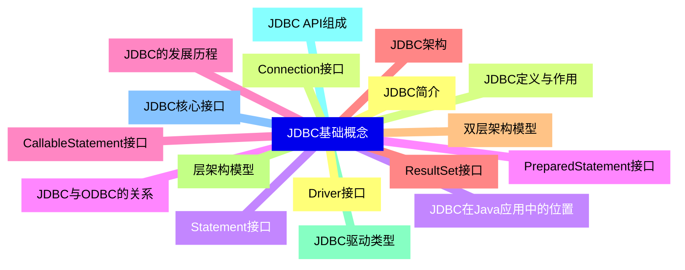

<--->
{}
{}
{}
{}
{}
{}
{}
{}
{}
{}
{}
{}
{}
{}
{}
{}
{}
{}
{}
{}
{}
{}
{}
{}
{}
{}
{}
{}
{}
{}
{}
{}
{}
{}
{}

### 2 JDBC驱动配置{#2}

{}
{}
{}
{}
{}
{}
{}
{}
{}
{}
{}
{}
{}
{}
{}
{}
{}
{}
{}
{}
{}
{}
{}
{}
{}
{}
{}
{}
{}
{}
{}
<--->
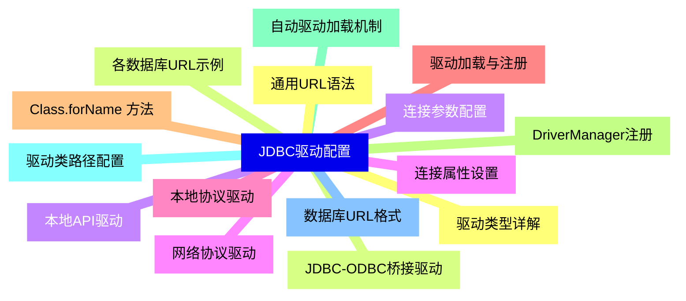

{}

### 3 数据库连接管理{#3}

{}
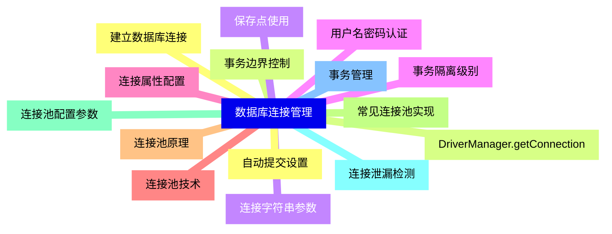

<--->
{}
{}
{}
{}
{}
{}
{}
{}
{}
{}
{}
{}
{}
{}
{}
{}
{}
{}
{}
{}
{}
{}
{}
{}
{}
{}
{}
{}
{}
{}
{}

### 4 SQL语句执行{#4}

{}
{}
{}
{}
{}
{}
{}
{}
{}
{}
{}
{}
{}
{}
{}
{}
{}
{}
{}
{}
{}
{}
{}
{}
{}
{}
{}
{}
{}
{}
{}
<--->
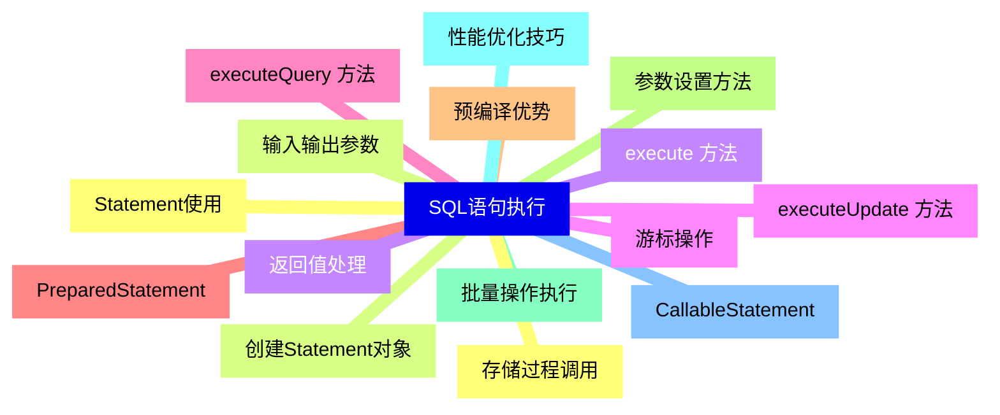

{}

### 5 结果集处理{#5}

{}
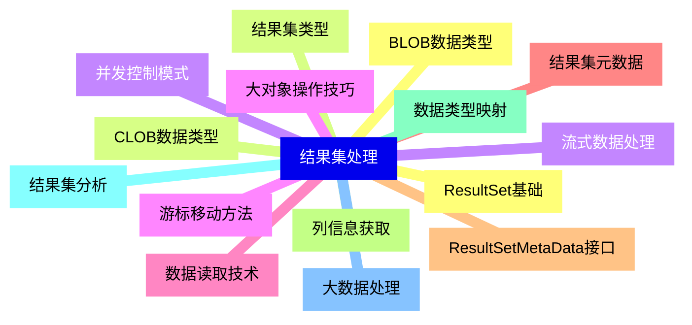

<--->
{}
{}
{}
{}
{}
{}
{}
{}
{}
{}
{}
{}
{}
{}
{}
{}
{}
{}
{}
{}
{}
{}
{}
{}
{}
{}
{}
{}
{}
{}
{}

### 6 高级特性{#6}

{}
{}
{}
{}
{}
{}
{}
{}
{}
{}
{}
{}
{}
{}
{}
{}
{}
{}
{}
{}
{}
{}
{}
{}
{}
{}
{}
{}
{}
{}
{}
<--->
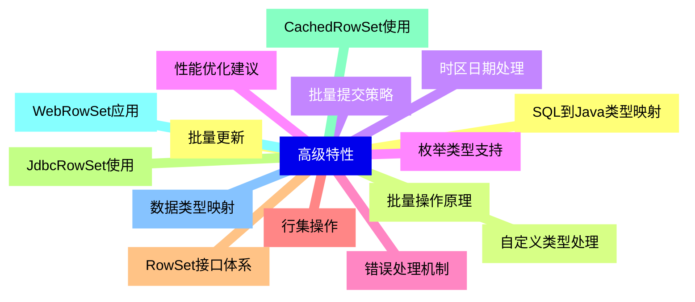

{}

### 7 异常处理{#7}

{}
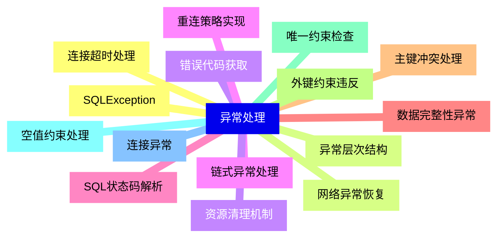

<--->
{}
{}
{}
{}
{}
{}
{}
{}
{}
{}
{}
{}
{}
{}
{}
{}
{}
{}
{}
{}
{}
{}
{}
{}
{}
{}
{}
{}
{}
{}
{}

### 8 性能优化{#8}

{}
{}
{}
{}
{}
{}
{}
{}
{}
{}
{}
{}
{}
{}
{}
{}
{}
{}
{}
{}
{}
{}
{}
{}
{}
{}
{}
{}
{}
{}
{}
<--->
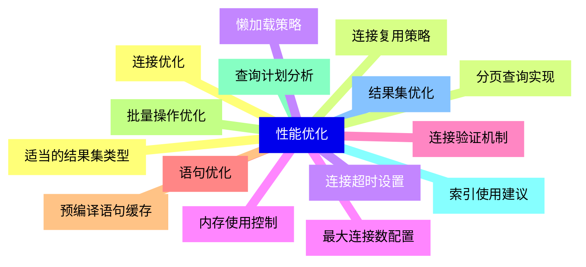

{}

### 9 安全考虑{#9}

{}
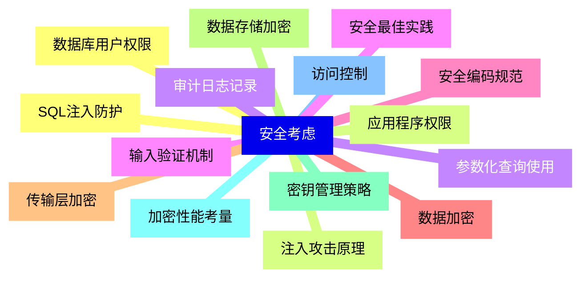

<--->
{}
{}
{}
{}
{}
{}
{}
{}
{}
{}
{}
{}
{}
{}
{}
{}
{}
{}
{}
{}
{}
{}
{}
{}
{}
{}
{}
{}
{}
{}
{}

### 10 框架集成{#10}

{}
{}
{}
{}
{}
{}
{}
{}
{}
{}
{}
{}
{}
{}
{}
{}
{}
{}
{}
{}
{}
{}
{}
{}
{}
{}
{}
{}
{}
{}
{}
<--->
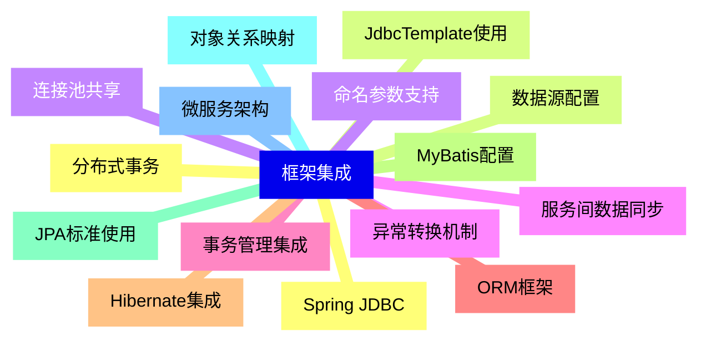

{}

### 11 实战案例{#11}

{}
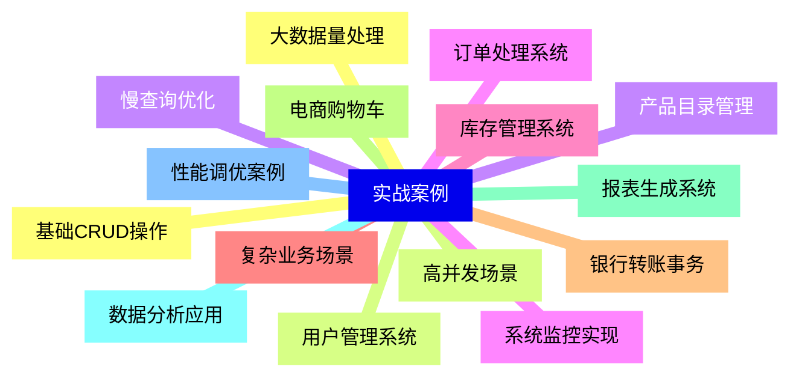

<--->
{}
{}
{}
{}
{}
{}
{}
{}
{}
{}
{}
{}
{}
{}
{}
{}
{}
{}
{}
{}
{}
{}
{}
{}
{}
{}
{}
{}
{}
{}
{}

### 12 测试与调试{#12}

{}
{}
{}
{}
{}
{}
{}
{}
{}
{}
{}
{}
{}
{}
{}
{}
{}
{}
{}
{}
{}
{}
{}
{}
{}
{}
{}
{}
{}
{}
{}
<--->
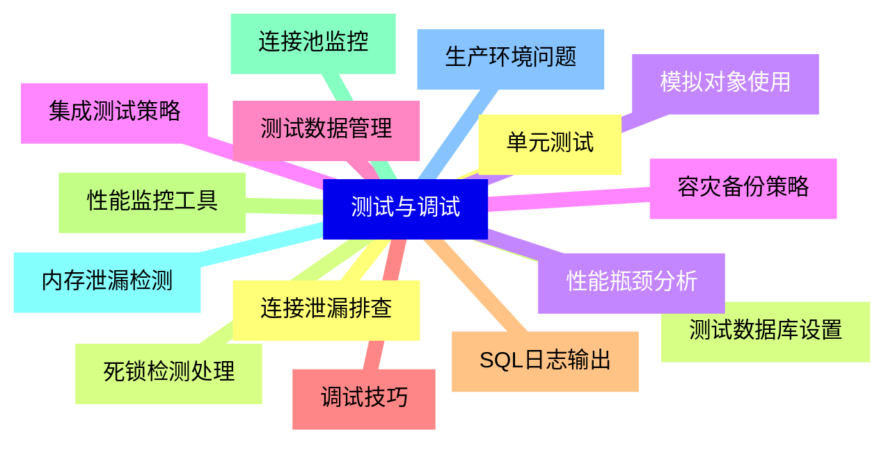

{}
