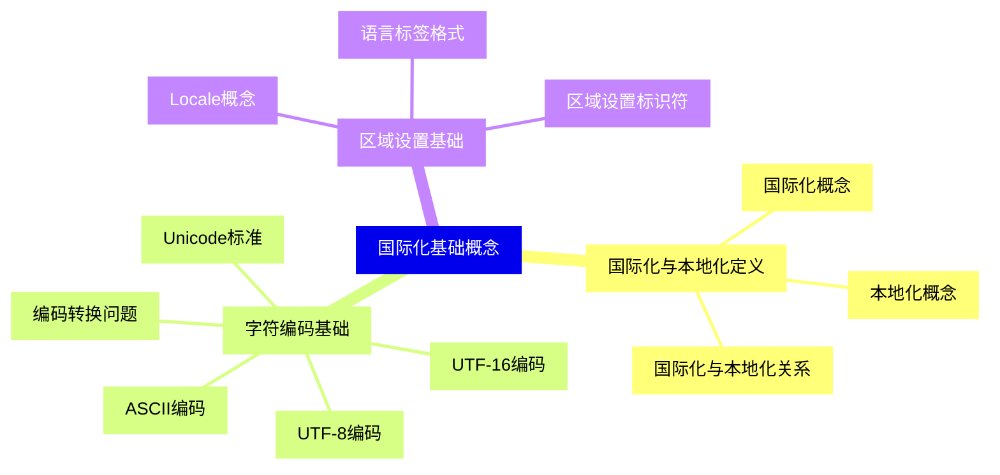
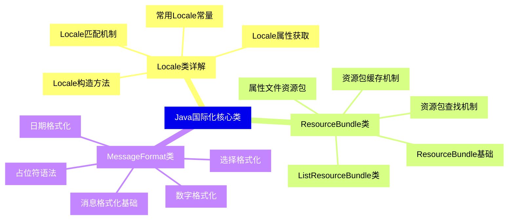
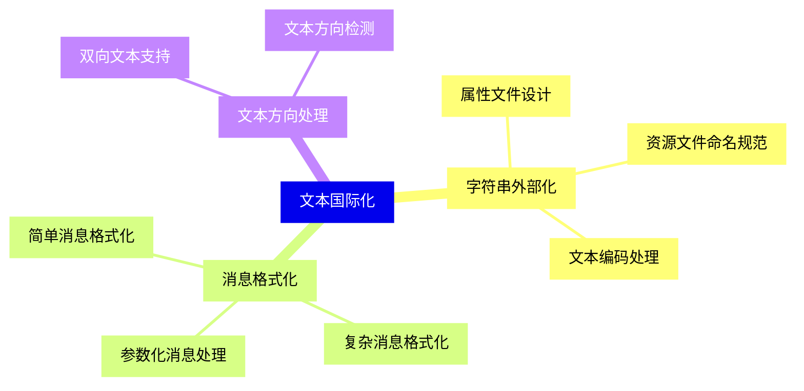
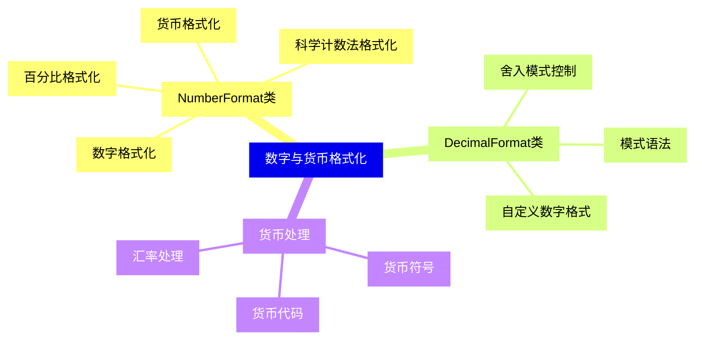
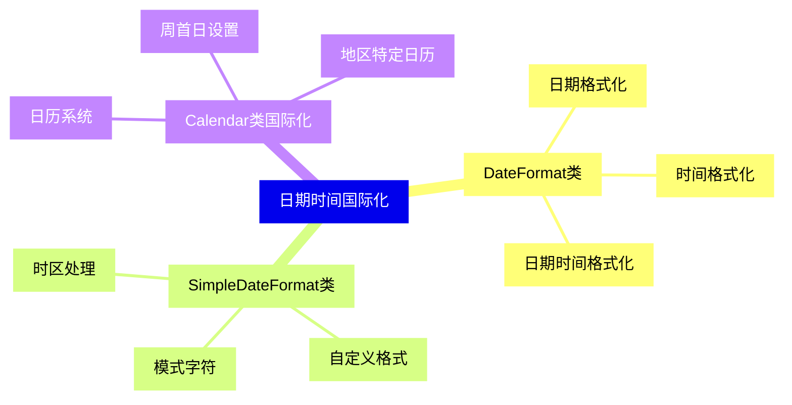
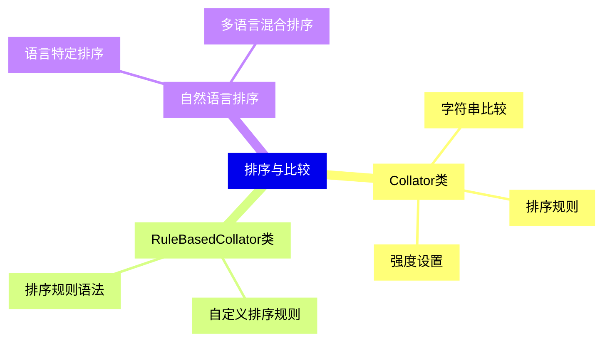
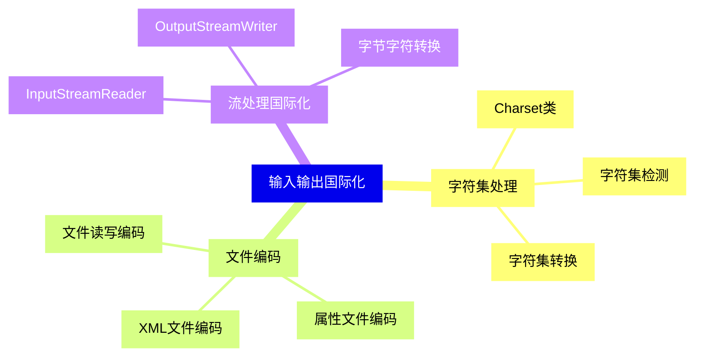
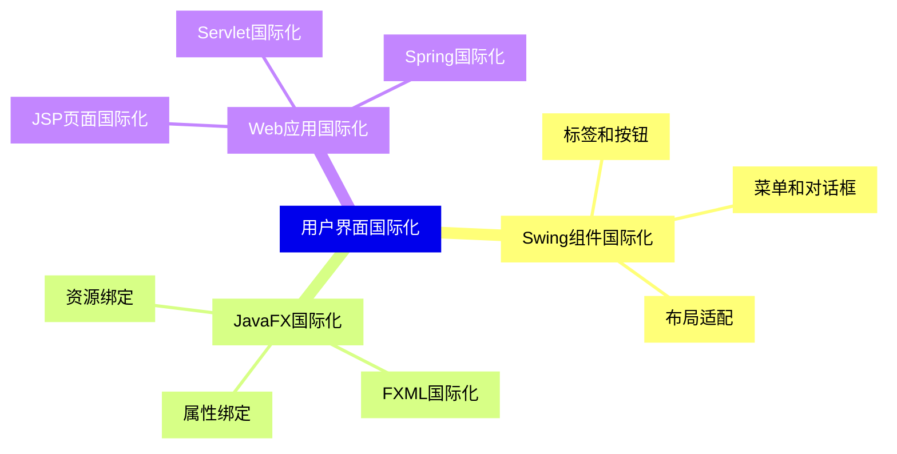
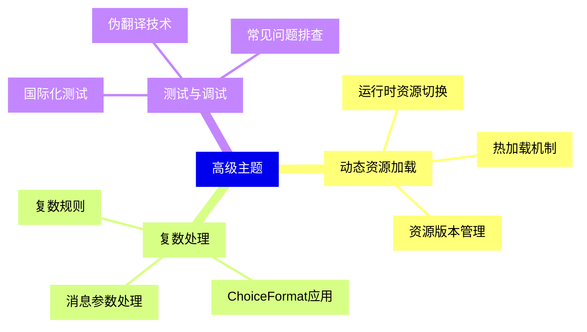
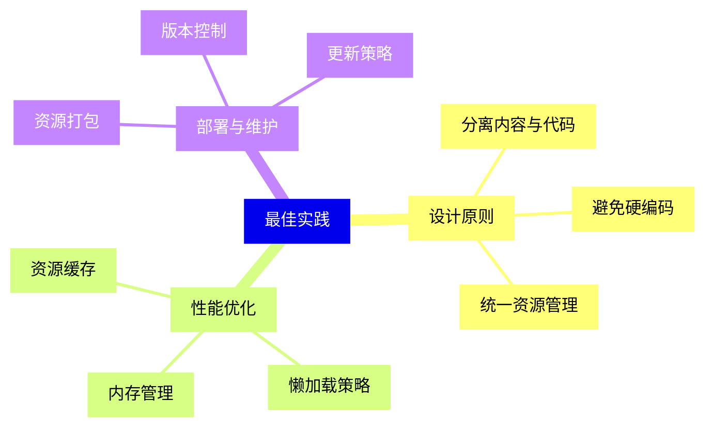


### 1 [国际化基础概念](#1)
#### 1.1 [国际化与本地化定义](#1)
##### 1.1.1 [国际化概念](#1)
##### 1.1.2 [本地化概念](#1)
##### 1.1.3 [国际化与本地化关系](#1)
#### 1.2 [字符编码基础](#1)
##### 1.2.1 [ASCII编码](#1)
##### 1.2.2 [Unicode标准](#1)
##### 1.2.3 [UTF-8编码](#1)
##### 1.2.4 [UTF-16编码](#1)
##### 1.2.5 [编码转换问题](#1)
#### 1.3 [区域设置基础](#1)
##### 1.3.1 [Locale概念](#1)
##### 1.3.2 [语言标签格式](#1)
##### 1.3.3 [区域设置标识符](#1)
### 2 [Java国际化核心类](#2)
#### 2.1 [Locale类详解](#2)
##### 2.1.1 [Locale构造方法](#2)
##### 2.1.2 [常用Locale常量](#2)
##### 2.1.3 [Locale属性获取](#2)
##### 2.1.4 [Locale匹配机制](#2)
#### 2.2 [ResourceBundle类](#2)
##### 2.2.1 [ResourceBundle基础](#2)
##### 2.2.2 [属性文件资源包](#2)
##### 2.2.3 [ListResourceBundle类](#2)
##### 2.2.4 [资源包查找机制](#2)
##### 2.2.5 [资源包缓存机制](#2)
#### 2.3 [MessageFormat类](#2)
##### 2.3.1 [消息格式化基础](#2)
##### 2.3.2 [占位符语法](#2)
##### 2.3.3 [数字格式化](#2)
##### 2.3.4 [日期格式化](#2)
##### 2.3.5 [选择格式化](#2)
### 3 [文本国际化](#3)
#### 3.1 [字符串外部化](#3)
##### 3.1.1 [属性文件设计](#3)
##### 3.1.2 [资源文件命名规范](#3)
##### 3.1.3 [文本编码处理](#3)
#### 3.2 [消息格式化](#3)
##### 3.2.1 [简单消息格式化](#3)
##### 3.2.2 [复杂消息格式化](#3)
##### 3.2.3 [参数化消息处理](#3)
#### 3.3 [文本方向处理](#3)
##### 3.3.1 [双向文本支持](#3)
##### 3.3.2 [文本方向检测](#3)
### 4 [数字与货币格式化](#4)
#### 4.1 [NumberFormat类](#4)
##### 4.1.1 [数字格式化](#4)
##### 4.1.2 [百分比格式化](#4)
##### 4.1.3 [货币格式化](#4)
##### 4.1.4 [科学计数法格式化](#4)
#### 4.2 [DecimalFormat类](#4)
##### 4.2.1 [模式语法](#4)
##### 4.2.2 [自定义数字格式](#4)
##### 4.2.3 [舍入模式控制](#4)
#### 4.3 [货币处理](#4)
##### 4.3.1 [货币符号](#4)
##### 4.3.2 [货币代码](#4)
##### 4.3.3 [汇率处理](#4)
### 5 [日期时间国际化](#5)
#### 5.1 [DateFormat类](#5)
##### 5.1.1 [日期格式化](#5)
##### 5.1.2 [时间格式化](#5)
##### 5.1.3 [日期时间格式化](#5)
#### 5.2 [SimpleDateFormat类](#5)
##### 5.2.1 [模式字符](#5)
##### 5.2.2 [自定义格式](#5)
##### 5.2.3 [时区处理](#5)
#### 5.3 [Calendar类国际化](#5)
##### 5.3.1 [日历系统](#5)
##### 5.3.2 [周首日设置](#5)
##### 5.3.3 [地区特定日历](#5)
### 6 [排序与比较](#6)
#### 6.1 [Collator类](#6)
##### 6.1.1 [字符串比较](#6)
##### 6.1.2 [排序规则](#6)
##### 6.1.3 [强度设置](#6)
#### 6.2 [RuleBasedCollator类](#6)
##### 6.2.1 [自定义排序规则](#6)
##### 6.2.2 [排序规则语法](#6)
#### 6.3 [自然语言排序](#6)
##### 6.3.1 [语言特定排序](#6)
##### 6.3.2 [多语言混合排序](#6)
### 7 [输入输出国际化](#7)
#### 7.1 [字符集处理](#7)
##### 7.1.1 [Charset类](#7)
##### 7.1.2 [字符集检测](#7)
##### 7.1.3 [字符集转换](#7)
#### 7.2 [文件编码](#7)
##### 7.2.1 [文件读写编码](#7)
##### 7.2.2 [属性文件编码](#7)
##### 7.2.3 [XML文件编码](#7)
#### 7.3 [流处理国际化](#7)
##### 7.3.1 [InputStreamReader](#7)
##### 7.3.2 [OutputStreamWriter](#7)
##### 7.3.3 [字节字符转换](#7)
### 8 [用户界面国际化](#8)
#### 8.1 [Swing组件国际化](#8)
##### 8.1.1 [标签和按钮](#8)
##### 8.1.2 [菜单和对话框](#8)
##### 8.1.3 [布局适配](#8)
#### 8.2 [JavaFX国际化](#8)
##### 8.2.1 [资源绑定](#8)
##### 8.2.2 [FXML国际化](#8)
##### 8.2.3 [属性绑定](#8)
#### 8.3 [Web应用国际化](#8)
##### 8.3.1 [JSP页面国际化](#8)
##### 8.3.2 [Servlet国际化](#8)
##### 8.3.3 [Spring国际化](#8)
### 9 [高级主题](#9)
#### 9.1 [动态资源加载](#9)
##### 9.1.1 [运行时资源切换](#9)
##### 9.1.2 [热加载机制](#9)
##### 9.1.3 [资源版本管理](#9)
#### 9.2 [复数处理](#9)
##### 9.2.1 [复数规则](#9)
##### 9.2.2 [ChoiceFormat应用](#9)
##### 9.2.3 [消息参数处理](#9)
#### 9.3 [测试与调试](#9)
##### 9.3.1 [国际化测试](#9)
##### 9.3.2 [伪翻译技术](#9)
##### 9.3.3 [常见问题排查](#9)
### 10 [最佳实践](#10)
#### 10.1 [设计原则](#10)
##### 10.1.1 [分离内容与代码](#10)
##### 10.1.2 [避免硬编码](#10)
##### 10.1.3 [统一资源管理](#10)
#### 10.2 [性能优化](#10)
##### 10.2.1 [资源缓存](#10)
##### 10.2.2 [懒加载策略](#10)
##### 10.2.3 [内存管理](#10)
#### 10.3 [部署与维护](#10)
##### 10.3.1 [资源打包](#10)
##### 10.3.2 [版本控制](#10)
##### 10.3.3 [更新策略](#10)




### 1 国际化基础概念

---
### 1 国际化基础概念
___
#### 1.1 国际化与本地化定义
___
##### 1.1.1 国际化概念
___
##### 1.1.2 本地化概念
___
##### 1.1.3 国际化与本地化关系
___
#### 1.2 字符编码基础
___
##### 1.2.1 ASCII编码
___
##### 1.2.2 Unicode标准
___
##### 1.2.3 UTF-8编码
___
##### 1.2.4 UTF-16编码
___
##### 1.2.5 编码转换问题
___
#### 1.3 区域设置基础
___
##### 1.3.1 Locale概念
___
##### 1.3.2 语言标签格式
___
##### 1.3.3 区域设置标识符
### 2 Java国际化核心类

---
### 2 Java国际化核心类
___
#### 2.1 Locale类详解
___
##### 2.1.1 Locale构造方法
___
##### 2.1.2 常用Locale常量
___
##### 2.1.3 Locale属性获取
___
##### 2.1.4 Locale匹配机制
___
#### 2.2 ResourceBundle类
___
##### 2.2.1 ResourceBundle基础
___
##### 2.2.2 属性文件资源包
___
##### 2.2.3 ListResourceBundle类
___
##### 2.2.4 资源包查找机制
___
##### 2.2.5 资源包缓存机制
___
#### 2.3 MessageFormat类
___
##### 2.3.1 消息格式化基础
___
##### 2.3.2 占位符语法
___
##### 2.3.3 数字格式化
___
##### 2.3.4 日期格式化
___
##### 2.3.5 选择格式化
### 3 文本国际化

---
### 3 文本国际化
___
#### 3.1 字符串外部化
___
##### 3.1.1 属性文件设计
___
##### 3.1.2 资源文件命名规范
___
##### 3.1.3 文本编码处理
___
#### 3.2 消息格式化
___
##### 3.2.1 简单消息格式化
___
##### 3.2.2 复杂消息格式化
___
##### 3.2.3 参数化消息处理
___
#### 3.3 文本方向处理
___
##### 3.3.1 双向文本支持
___
##### 3.3.2 文本方向检测
### 4 数字与货币格式化

---
### 4 数字与货币格式化
___
#### 4.1 NumberFormat类
___
##### 4.1.1 数字格式化
___
##### 4.1.2 百分比格式化
___
##### 4.1.3 货币格式化
___
##### 4.1.4 科学计数法格式化
___
#### 4.2 DecimalFormat类
___
##### 4.2.1 模式语法
___
##### 4.2.2 自定义数字格式
___
##### 4.2.3 舍入模式控制
___
#### 4.3 货币处理
___
##### 4.3.1 货币符号
___
##### 4.3.2 货币代码
___
##### 4.3.3 汇率处理
### 5 日期时间国际化

---
### 5 日期时间国际化
___
#### 5.1 DateFormat类
___
##### 5.1.1 日期格式化
___
##### 5.1.2 时间格式化
___
##### 5.1.3 日期时间格式化
___
#### 5.2 SimpleDateFormat类
___
##### 5.2.1 模式字符
___
##### 5.2.2 自定义格式
___
##### 5.2.3 时区处理
___
#### 5.3 Calendar类国际化
___
##### 5.3.1 日历系统
___
##### 5.3.2 周首日设置
___
##### 5.3.3 地区特定日历
### 6 排序与比较

---
### 6 排序与比较
___
#### 6.1 Collator类
___
##### 6.1.1 字符串比较
___
##### 6.1.2 排序规则
___
##### 6.1.3 强度设置
___
#### 6.2 RuleBasedCollator类
___
##### 6.2.1 自定义排序规则
___
##### 6.2.2 排序规则语法
___
#### 6.3 自然语言排序
___
##### 6.3.1 语言特定排序
___
##### 6.3.2 多语言混合排序
### 7 输入输出国际化

---
### 7 输入输出国际化
___
#### 7.1 字符集处理
___
##### 7.1.1 Charset类
___
##### 7.1.2 字符集检测
___
##### 7.1.3 字符集转换
___
#### 7.2 文件编码
___
##### 7.2.1 文件读写编码
___
##### 7.2.2 属性文件编码
___
##### 7.2.3 XML文件编码
___
#### 7.3 流处理国际化
___
##### 7.3.1 InputStreamReader
___
##### 7.3.2 OutputStreamWriter
___
##### 7.3.3 字节字符转换
### 8 用户界面国际化

---
### 8 用户界面国际化
___
#### 8.1 Swing组件国际化
___
##### 8.1.1 标签和按钮
___
##### 8.1.2 菜单和对话框
___
##### 8.1.3 布局适配
___
#### 8.2 JavaFX国际化
___
##### 8.2.1 资源绑定
___
##### 8.2.2 FXML国际化
___
##### 8.2.3 属性绑定
___
#### 8.3 Web应用国际化
___
##### 8.3.1 JSP页面国际化
___
##### 8.3.2 Servlet国际化
___
##### 8.3.3 Spring国际化
### 9 高级主题

---
### 9 高级主题
___
#### 9.1 动态资源加载
___
##### 9.1.1 运行时资源切换
___
##### 9.1.2 热加载机制
___
##### 9.1.3 资源版本管理
___
#### 9.2 复数处理
___
##### 9.2.1 复数规则
___
##### 9.2.2 ChoiceFormat应用
___
##### 9.2.3 消息参数处理
___
#### 9.3 测试与调试
___
##### 9.3.1 国际化测试
___
##### 9.3.2 伪翻译技术
___
##### 9.3.3 常见问题排查
### 10 最佳实践

---
### 10 最佳实践
___
#### 10.1 设计原则
___
##### 10.1.1 分离内容与代码
___
##### 10.1.2 避免硬编码
___
##### 10.1.3 统一资源管理
___
#### 10.2 性能优化
___
##### 10.2.1 资源缓存
___
##### 10.2.2 懒加载策略
___
##### 10.2.3 内存管理
___
#### 10.3 部署与维护
___
##### 10.3.1 资源打包
___
##### 10.3.2 版本控制
___
##### 10.3.3 更新策略


### 1 国际化基础概念{#1}

{}

<--->
{}
{}
{}
{}
{}
{}
{}
{}
{}
{}
{}
{}
{}
{}
{}
{}
{}
{}
{}
{}
{}
{}
{}
{}
{}
{}
{}
{}
{}

### 2 Java国际化核心类{#2}

{}
{}
{}
{}
{}
{}
{}
{}
{}
{}
{}
{}
{}
{}
{}
{}
{}
{}
{}
{}
{}
{}
{}
{}
{}
{}
{}
{}
{}
{}
{}
{}
{}
{}
{}
<--->

{}

### 3 文本国际化{#3}

{}

<--->
{}
{}
{}
{}
{}
{}
{}
{}
{}
{}
{}
{}
{}
{}
{}
{}
{}
{}
{}
{}
{}
{}
{}

### 4 数字与货币格式化{#4}

{}
{}
{}
{}
{}
{}
{}
{}
{}
{}
{}
{}
{}
{}
{}
{}
{}
{}
{}
{}
{}
{}
{}
{}
{}
{}
{}
<--->

{}

### 5 日期时间国际化{#5}

{}

<--->
{}
{}
{}
{}
{}
{}
{}
{}
{}
{}
{}
{}
{}
{}
{}
{}
{}
{}
{}
{}
{}
{}
{}
{}
{}

### 6 排序与比较{#6}

{}
{}
{}
{}
{}
{}
{}
{}
{}
{}
{}
{}
{}
{}
{}
{}
{}
{}
{}
{}
{}
<--->

{}

### 7 输入输出国际化{#7}

{}

<--->
{}
{}
{}
{}
{}
{}
{}
{}
{}
{}
{}
{}
{}
{}
{}
{}
{}
{}
{}
{}
{}
{}
{}
{}
{}

### 8 用户界面国际化{#8}

{}
{}
{}
{}
{}
{}
{}
{}
{}
{}
{}
{}
{}
{}
{}
{}
{}
{}
{}
{}
{}
{}
{}
{}
{}
<--->

{}

### 9 高级主题{#9}

{}

<--->
{}
{}
{}
{}
{}
{}
{}
{}
{}
{}
{}
{}
{}
{}
{}
{}
{}
{}
{}
{}
{}
{}
{}
{}
{}

### 10 最佳实践{#10}

{}
{}
{}
{}
{}
{}
{}
{}
{}
{}
{}
{}
{}
{}
{}
{}
{}
{}
{}
{}
{}
{}
{}
{}
{}
<--->

{}
