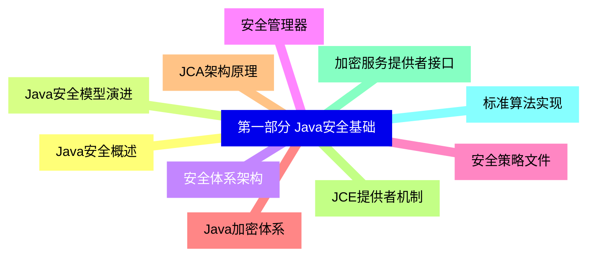
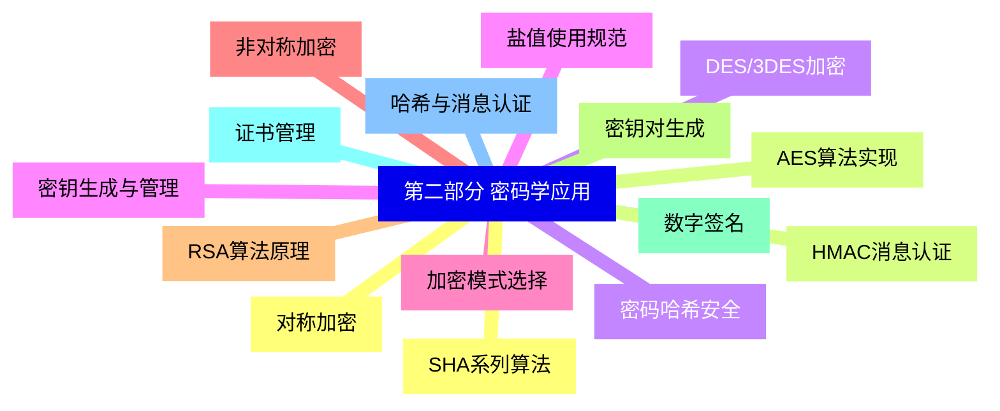
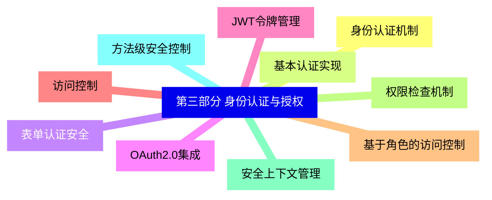
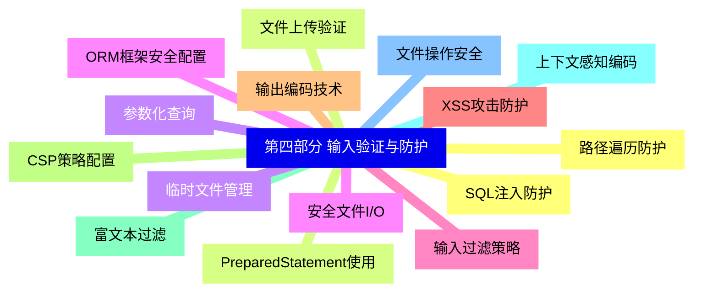
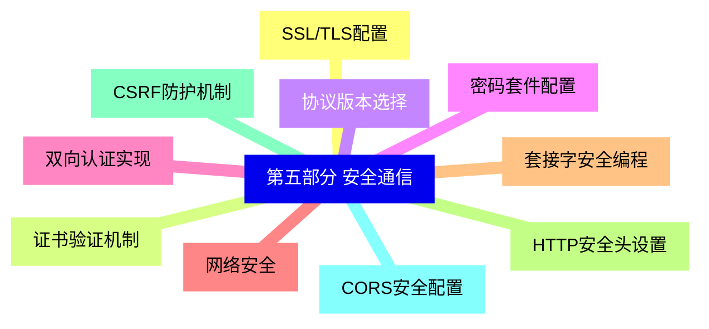
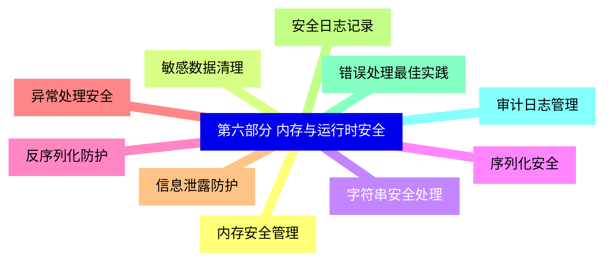
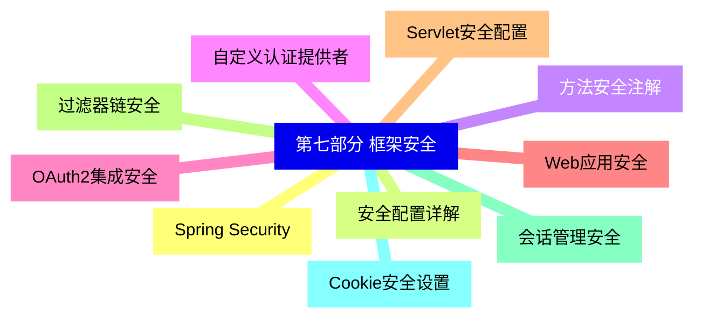
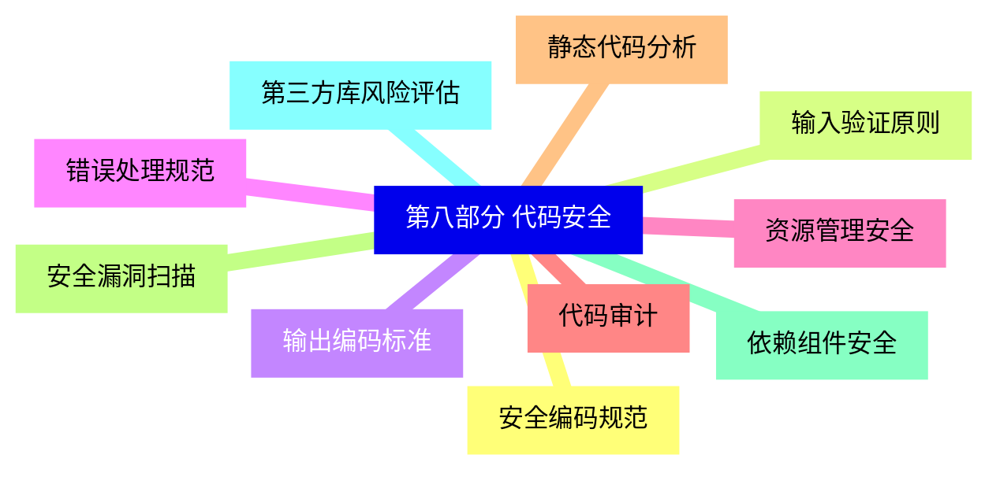
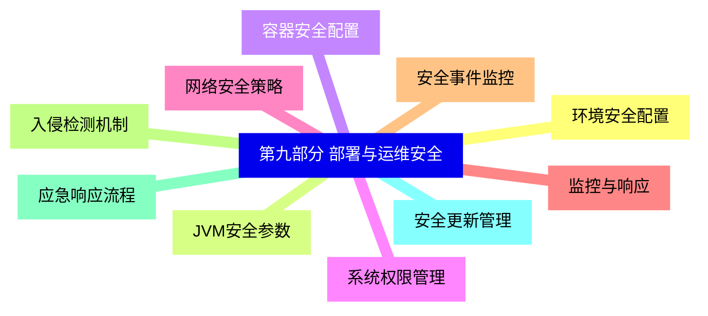
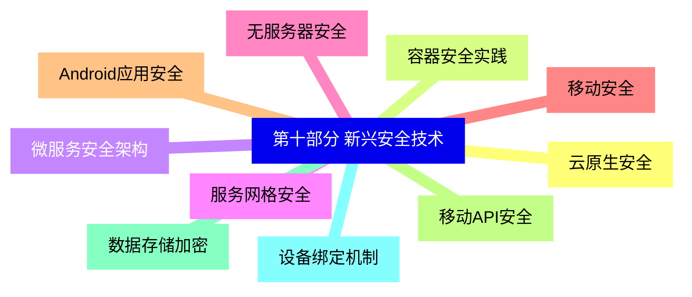


### 1 [第一部分 Java安全基础](#1)
#### 1.1 [Java安全概述](#1)
#### 1.2 [Java安全模型演进](#1)
#### 1.3 [安全体系架构](#1)
#### 1.4 [安全管理器](#1)
#### 1.5 [安全策略文件](#1)
#### 1.6 [Java加密体系](#1)
#### 1.7 [JCA架构原理](#1)
#### 1.8 [JCE提供者机制](#1)
#### 1.9 [加密服务提供者接口](#1)
#### 1.10 [标准算法实现](#1)
### 2 [第二部分 密码学应用](#2)
#### 2.1 [对称加密](#2)
#### 2.2 [AES算法实现](#2)
#### 2.3 [DES/3DES加密](#2)
#### 2.4 [密钥生成与管理](#2)
#### 2.5 [加密模式选择](#2)
#### 2.6 [非对称加密](#2)
#### 2.7 [RSA算法原理](#2)
#### 2.8 [密钥对生成](#2)
#### 2.9 [数字签名](#2)
#### 2.10 [证书管理](#2)
#### 2.11 [哈希与消息认证](#2)
#### 2.12 [SHA系列算法](#2)
#### 2.13 [HMAC消息认证](#2)
#### 2.14 [密码哈希安全](#2)
#### 2.15 [盐值使用规范](#2)
### 3 [第三部分 身份认证与授权](#3)
#### 3.1 [身份认证机制](#3)
#### 3.2 [基本认证实现](#3)
#### 3.3 [表单认证安全](#3)
#### 3.4 [OAuth2.0集成](#3)
#### 3.5 [JWT令牌管理](#3)
#### 3.6 [访问控制](#3)
#### 3.7 [基于角色的访问控制](#3)
#### 3.8 [权限检查机制](#3)
#### 3.9 [安全上下文管理](#3)
#### 3.10 [方法级安全控制](#3)
### 4 [第四部分 输入验证与防护](#4)
#### 4.1 [SQL注入防护](#4)
#### 4.2 [PreparedStatement使用](#4)
#### 4.3 [参数化查询](#4)
#### 4.4 [ORM框架安全配置](#4)
#### 4.5 [输入过滤策略](#4)
#### 4.6 [XSS攻击防护](#4)
#### 4.7 [输出编码技术](#4)
#### 4.8 [CSP策略配置](#4)
#### 4.9 [富文本过滤](#4)
#### 4.10 [上下文感知编码](#4)
#### 4.11 [文件操作安全](#4)
#### 4.12 [路径遍历防护](#4)
#### 4.13 [文件上传验证](#4)
#### 4.14 [临时文件管理](#4)
#### 4.15 [安全文件I/O](#4)
### 5 [第五部分 安全通信](#5)
#### 5.1 [SSL/TLS配置](#5)
#### 5.2 [证书验证机制](#5)
#### 5.3 [协议版本选择](#5)
#### 5.4 [密码套件配置](#5)
#### 5.5 [双向认证实现](#5)
#### 5.6 [网络安全](#5)
#### 5.7 [套接字安全编程](#5)
#### 5.8 [HTTP安全头设置](#5)
#### 5.9 [CSRF防护机制](#5)
#### 5.10 [CORS安全配置](#5)
### 6 [第六部分 内存与运行时安全](#6)
#### 6.1 [内存安全管理](#6)
#### 6.2 [敏感数据清理](#6)
#### 6.3 [字符串安全处理](#6)
#### 6.4 [序列化安全](#6)
#### 6.5 [反序列化防护](#6)
#### 6.6 [异常处理安全](#6)
#### 6.7 [信息泄露防护](#6)
#### 6.8 [安全日志记录](#6)
#### 6.9 [错误处理最佳实践](#6)
#### 6.10 [审计日志管理](#6)
### 7 [第七部分 框架安全](#7)
#### 7.1 [Spring Security](#7)
#### 7.2 [安全配置详解](#7)
#### 7.3 [方法安全注解](#7)
#### 7.4 [自定义认证提供者](#7)
#### 7.5 [OAuth2集成安全](#7)
#### 7.6 [Web应用安全](#7)
#### 7.7 [Servlet安全配置](#7)
#### 7.8 [过滤器链安全](#7)
#### 7.9 [会话管理安全](#7)
#### 7.10 [Cookie安全设置](#7)
### 8 [第八部分 代码安全](#8)
#### 8.1 [安全编码规范](#8)
#### 8.2 [输入验证原则](#8)
#### 8.3 [输出编码标准](#8)
#### 8.4 [错误处理规范](#8)
#### 8.5 [资源管理安全](#8)
#### 8.6 [代码审计](#8)
#### 8.7 [静态代码分析](#8)
#### 8.8 [安全漏洞扫描](#8)
#### 8.9 [依赖组件安全](#8)
#### 8.10 [第三方库风险评估](#8)
### 9 [第九部分 部署与运维安全](#9)
#### 9.1 [环境安全配置](#9)
#### 9.2 [JVM安全参数](#9)
#### 9.3 [容器安全配置](#9)
#### 9.4 [系统权限管理](#9)
#### 9.5 [网络安全策略](#9)
#### 9.6 [监控与响应](#9)
#### 9.7 [安全事件监控](#9)
#### 9.8 [入侵检测机制](#9)
#### 9.9 [应急响应流程](#9)
#### 9.10 [安全更新管理](#9)
### 10 [第十部分 新兴安全技术](#10)
#### 10.1 [云原生安全](#10)
#### 10.2 [容器安全实践](#10)
#### 10.3 [微服务安全架构](#10)
#### 10.4 [服务网格安全](#10)
#### 10.5 [无服务器安全](#10)
#### 10.6 [移动安全](#10)
#### 10.7 [Android应用安全](#10)
#### 10.8 [移动API安全](#10)
#### 10.9 [数据存储加密](#10)
#### 10.10 [设备绑定机制](#10)




### 1 第一部分 Java安全基础

---
### 1 第一部分 Java安全基础
___
#### 1.1 Java安全概述
___
#### 1.2 Java安全模型演进
___
#### 1.3 安全体系架构
___
#### 1.4 安全管理器
___
#### 1.5 安全策略文件
___
#### 1.6 Java加密体系
___
#### 1.7 JCA架构原理
___
#### 1.8 JCE提供者机制
___
#### 1.9 加密服务提供者接口
___
#### 1.10 标准算法实现
### 2 第二部分 密码学应用

---
### 2 第二部分 密码学应用
___
#### 2.1 对称加密
___
#### 2.2 AES算法实现
___
#### 2.3 DES/3DES加密
___
#### 2.4 密钥生成与管理
___
#### 2.5 加密模式选择
___
#### 2.6 非对称加密
___
#### 2.7 RSA算法原理
___
#### 2.8 密钥对生成
___
#### 2.9 数字签名
___
#### 2.10 证书管理
___
#### 2.11 哈希与消息认证
___
#### 2.12 SHA系列算法
___
#### 2.13 HMAC消息认证
___
#### 2.14 密码哈希安全
___
#### 2.15 盐值使用规范
### 3 第三部分 身份认证与授权

---
### 3 第三部分 身份认证与授权
___
#### 3.1 身份认证机制
___
#### 3.2 基本认证实现
___
#### 3.3 表单认证安全
___
#### 3.4 OAuth2.0集成
___
#### 3.5 JWT令牌管理
___
#### 3.6 访问控制
___
#### 3.7 基于角色的访问控制
___
#### 3.8 权限检查机制
___
#### 3.9 安全上下文管理
___
#### 3.10 方法级安全控制
### 4 第四部分 输入验证与防护

---
### 4 第四部分 输入验证与防护
___
#### 4.1 SQL注入防护
___
#### 4.2 PreparedStatement使用
___
#### 4.3 参数化查询
___
#### 4.4 ORM框架安全配置
___
#### 4.5 输入过滤策略
___
#### 4.6 XSS攻击防护
___
#### 4.7 输出编码技术
___
#### 4.8 CSP策略配置
___
#### 4.9 富文本过滤
___
#### 4.10 上下文感知编码
___
#### 4.11 文件操作安全
___
#### 4.12 路径遍历防护
___
#### 4.13 文件上传验证
___
#### 4.14 临时文件管理
___
#### 4.15 安全文件I/O
### 5 第五部分 安全通信

---
### 5 第五部分 安全通信
___
#### 5.1 SSL/TLS配置
___
#### 5.2 证书验证机制
___
#### 5.3 协议版本选择
___
#### 5.4 密码套件配置
___
#### 5.5 双向认证实现
___
#### 5.6 网络安全
___
#### 5.7 套接字安全编程
___
#### 5.8 HTTP安全头设置
___
#### 5.9 CSRF防护机制
___
#### 5.10 CORS安全配置
### 6 第六部分 内存与运行时安全

---
### 6 第六部分 内存与运行时安全
___
#### 6.1 内存安全管理
___
#### 6.2 敏感数据清理
___
#### 6.3 字符串安全处理
___
#### 6.4 序列化安全
___
#### 6.5 反序列化防护
___
#### 6.6 异常处理安全
___
#### 6.7 信息泄露防护
___
#### 6.8 安全日志记录
___
#### 6.9 错误处理最佳实践
___
#### 6.10 审计日志管理
### 7 第七部分 框架安全

---
### 7 第七部分 框架安全
___
#### 7.1 Spring Security
___
#### 7.2 安全配置详解
___
#### 7.3 方法安全注解
___
#### 7.4 自定义认证提供者
___
#### 7.5 OAuth2集成安全
___
#### 7.6 Web应用安全
___
#### 7.7 Servlet安全配置
___
#### 7.8 过滤器链安全
___
#### 7.9 会话管理安全
___
#### 7.10 Cookie安全设置
### 8 第八部分 代码安全

---
### 8 第八部分 代码安全
___
#### 8.1 安全编码规范
___
#### 8.2 输入验证原则
___
#### 8.3 输出编码标准
___
#### 8.4 错误处理规范
___
#### 8.5 资源管理安全
___
#### 8.6 代码审计
___
#### 8.7 静态代码分析
___
#### 8.8 安全漏洞扫描
___
#### 8.9 依赖组件安全
___
#### 8.10 第三方库风险评估
### 9 第九部分 部署与运维安全

---
### 9 第九部分 部署与运维安全
___
#### 9.1 环境安全配置
___
#### 9.2 JVM安全参数
___
#### 9.3 容器安全配置
___
#### 9.4 系统权限管理
___
#### 9.5 网络安全策略
___
#### 9.6 监控与响应
___
#### 9.7 安全事件监控
___
#### 9.8 入侵检测机制
___
#### 9.9 应急响应流程
___
#### 9.10 安全更新管理
### 10 第十部分 新兴安全技术

---
### 10 第十部分 新兴安全技术
___
#### 10.1 云原生安全
___
#### 10.2 容器安全实践
___
#### 10.3 微服务安全架构
___
#### 10.4 服务网格安全
___
#### 10.5 无服务器安全
___
#### 10.6 移动安全
___
#### 10.7 Android应用安全
___
#### 10.8 移动API安全
___
#### 10.9 数据存储加密
___
#### 10.10 设备绑定机制


### 1 第一部分 Java安全基础{#1}

{}

<--->
{}
{}
{}
{}
{}
{}
{}
{}
{}
{}
{}
{}
{}
{}
{}
{}
{}
{}
{}
{}
{}

### 2 第二部分 密码学应用{#2}

{}
{}
{}
{}
{}
{}
{}
{}
{}
{}
{}
{}
{}
{}
{}
{}
{}
{}
{}
{}
{}
{}
{}
{}
{}
{}
{}
{}
{}
{}
{}
<--->

{}

### 3 第三部分 身份认证与授权{#3}

{}

<--->
{}
{}
{}
{}
{}
{}
{}
{}
{}
{}
{}
{}
{}
{}
{}
{}
{}
{}
{}
{}
{}

### 4 第四部分 输入验证与防护{#4}

{}
{}
{}
{}
{}
{}
{}
{}
{}
{}
{}
{}
{}
{}
{}
{}
{}
{}
{}
{}
{}
{}
{}
{}
{}
{}
{}
{}
{}
{}
{}
<--->

{}

### 5 第五部分 安全通信{#5}

{}

<--->
{}
{}
{}
{}
{}
{}
{}
{}
{}
{}
{}
{}
{}
{}
{}
{}
{}
{}
{}
{}
{}

### 6 第六部分 内存与运行时安全{#6}

{}
{}
{}
{}
{}
{}
{}
{}
{}
{}
{}
{}
{}
{}
{}
{}
{}
{}
{}
{}
{}
<--->

{}

### 7 第七部分 框架安全{#7}

{}

<--->
{}
{}
{}
{}
{}
{}
{}
{}
{}
{}
{}
{}
{}
{}
{}
{}
{}
{}
{}
{}
{}

### 8 第八部分 代码安全{#8}

{}
{}
{}
{}
{}
{}
{}
{}
{}
{}
{}
{}
{}
{}
{}
{}
{}
{}
{}
{}
{}
<--->

{}

### 9 第九部分 部署与运维安全{#9}

{}

<--->
{}
{}
{}
{}
{}
{}
{}
{}
{}
{}
{}
{}
{}
{}
{}
{}
{}
{}
{}
{}
{}

### 10 第十部分 新兴安全技术{#10}

{}
{}
{}
{}
{}
{}
{}
{}
{}
{}
{}
{}
{}
{}
{}
{}
{}
{}
{}
{}
{}
<--->

{}
