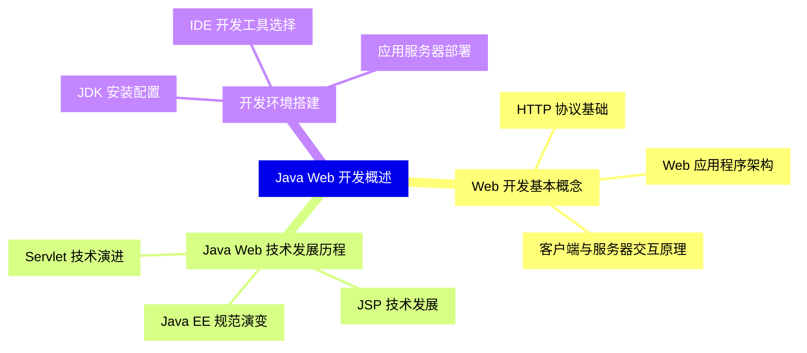
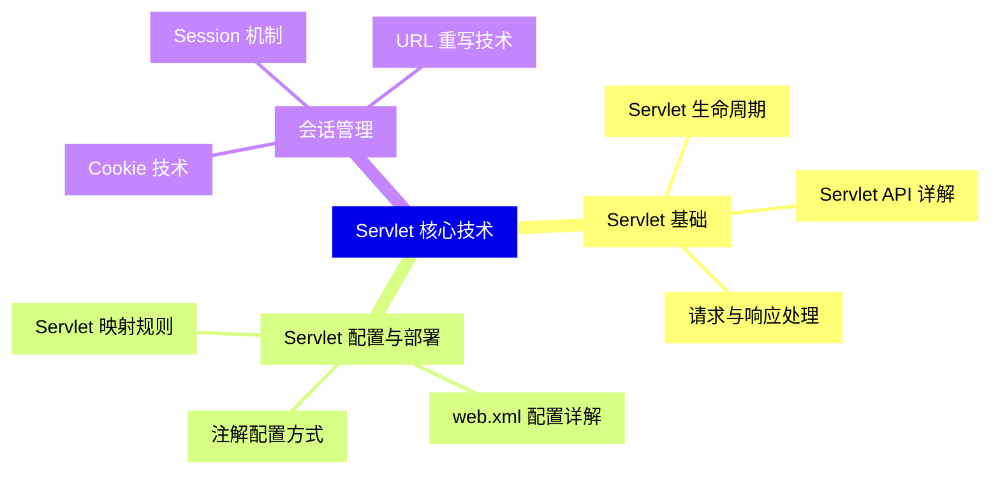
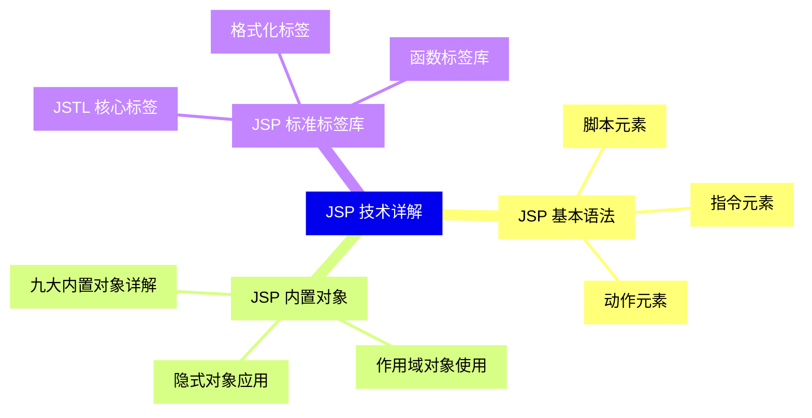
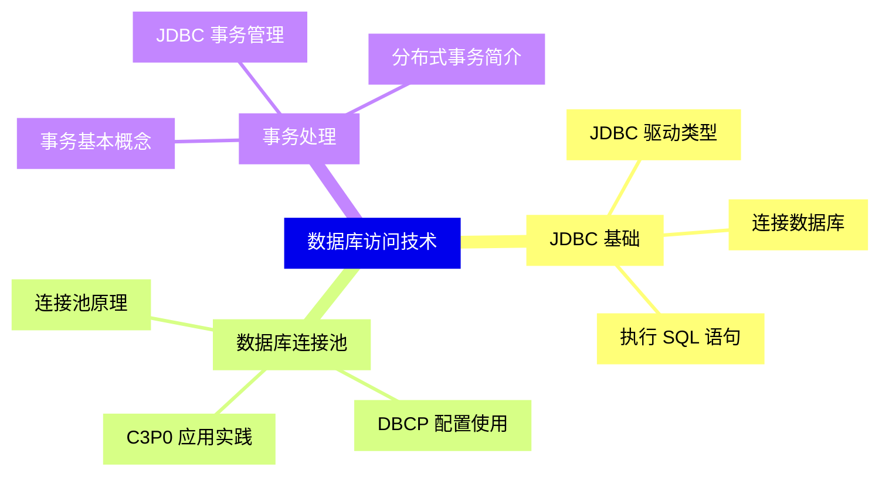
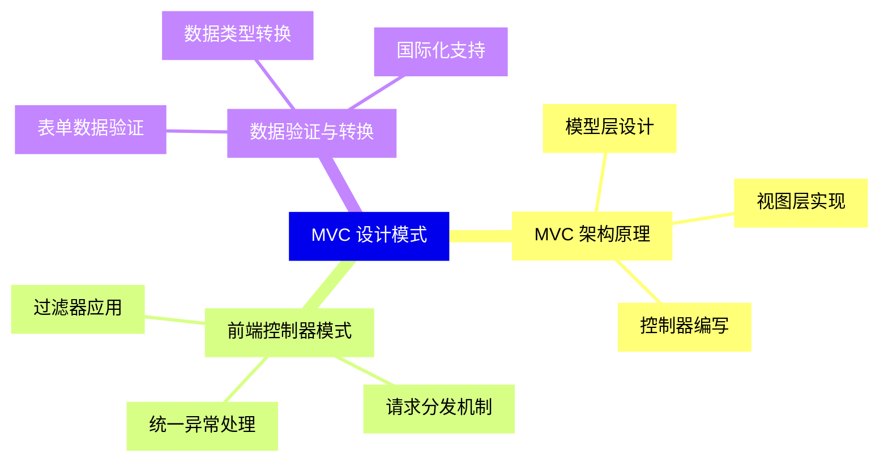
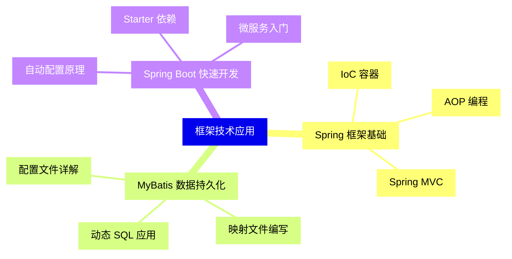
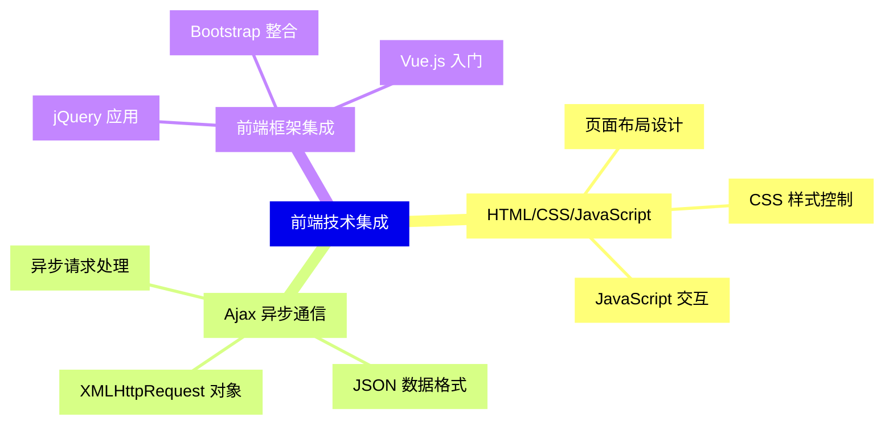
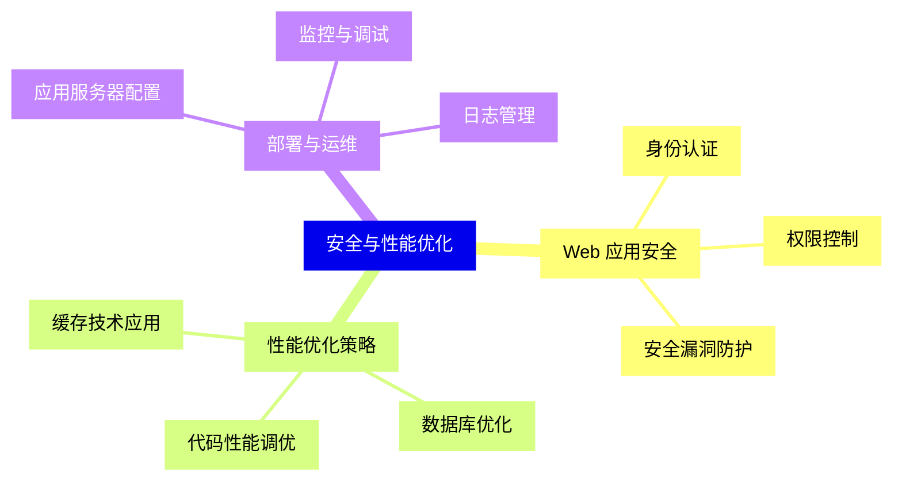
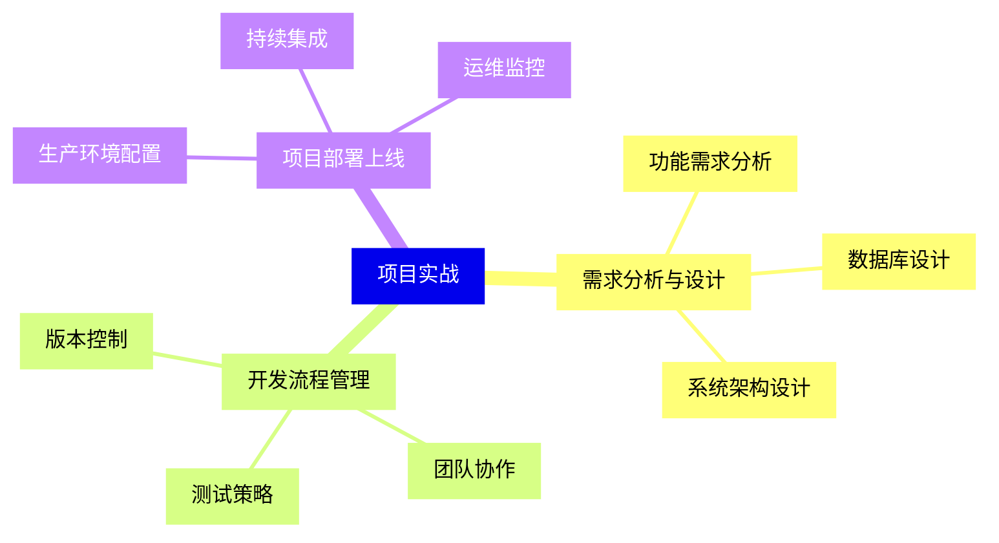


### 1 [Java Web 开发概述](#1)
#### 1.1 [Web 开发基本概念](#1)
##### 1.1.1 [HTTP 协议基础](#1)
##### 1.1.2 [Web 应用程序架构](#1)
##### 1.1.3 [客户端与服务器交互原理](#1)
#### 1.2 [Java Web 技术发展历程](#1)
##### 1.2.1 [Servlet 技术演进](#1)
##### 1.2.2 [JSP 技术发展](#1)
##### 1.2.3 [Java EE 规范演变](#1)
#### 1.3 [开发环境搭建](#1)
##### 1.3.1 [JDK 安装配置](#1)
##### 1.3.2 [IDE 开发工具选择](#1)
##### 1.3.3 [应用服务器部署](#1)
### 2 [Servlet 核心技术](#2)
#### 2.1 [Servlet 基础](#2)
##### 2.1.1 [Servlet 生命周期](#2)
##### 2.1.2 [Servlet API 详解](#2)
##### 2.1.3 [请求与响应处理](#2)
#### 2.2 [Servlet 配置与部署](#2)
##### 2.2.1 [web.xml 配置详解](#2)
##### 2.2.2 [注解配置方式](#2)
##### 2.2.3 [Servlet 映射规则](#2)
#### 2.3 [会话管理](#2)
##### 2.3.1 [Cookie 技术](#2)
##### 2.3.2 [Session 机制](#2)
##### 2.3.3 [URL 重写技术](#2)
### 3 [JSP 技术详解](#3)
#### 3.1 [JSP 基本语法](#3)
##### 3.1.1 [脚本元素](#3)
##### 3.1.2 [指令元素](#3)
##### 3.1.3 [动作元素](#3)
#### 3.2 [JSP 内置对象](#3)
##### 3.2.1 [九大内置对象详解](#3)
##### 3.2.2 [作用域对象使用](#3)
##### 3.2.3 [隐式对象应用](#3)
#### 3.3 [JSP 标准标签库](#3)
##### 3.3.1 [JSTL 核心标签](#3)
##### 3.3.2 [格式化标签](#3)
##### 3.3.3 [函数标签库](#3)
### 4 [数据库访问技术](#4)
#### 4.1 [JDBC 基础](#4)
##### 4.1.1 [JDBC 驱动类型](#4)
##### 4.1.2 [连接数据库](#4)
##### 4.1.3 [执行 SQL 语句](#4)
#### 4.2 [数据库连接池](#4)
##### 4.2.1 [连接池原理](#4)
##### 4.2.2 [DBCP 配置使用](#4)
##### 4.2.3 [C3P0 应用实践](#4)
#### 4.3 [事务处理](#4)
##### 4.3.1 [事务基本概念](#4)
##### 4.3.2 [JDBC 事务管理](#4)
##### 4.3.3 [分布式事务简介](#4)
### 5 [MVC 设计模式](#5)
#### 5.1 [MVC 架构原理](#5)
##### 5.1.1 [模型层设计](#5)
##### 5.1.2 [视图层实现](#5)
##### 5.1.3 [控制器编写](#5)
#### 5.2 [前端控制器模式](#5)
##### 5.2.1 [过滤器应用](#5)
##### 5.2.2 [请求分发机制](#5)
##### 5.2.3 [统一异常处理](#5)
#### 5.3 [数据验证与转换](#5)
##### 5.3.1 [表单数据验证](#5)
##### 5.3.2 [数据类型转换](#5)
##### 5.3.3 [国际化支持](#5)
### 6 [框架技术应用](#6)
#### 6.1 [Spring 框架基础](#6)
##### 6.1.1 [IoC 容器](#6)
##### 6.1.2 [AOP 编程](#6)
##### 6.1.3 [Spring MVC](#6)
#### 6.2 [MyBatis 数据持久化](#6)
##### 6.2.1 [配置文件详解](#6)
##### 6.2.2 [映射文件编写](#6)
##### 6.2.3 [动态 SQL 应用](#6)
#### 6.3 [Spring Boot 快速开发](#6)
##### 6.3.1 [自动配置原理](#6)
##### 6.3.2 [Starter 依赖](#6)
##### 6.3.3 [微服务入门](#6)
### 7 [前端技术集成](#7)
#### 7.1 [HTML/CSS/JavaScript](#7)
##### 7.1.1 [页面布局设计](#7)
##### 7.1.2 [CSS 样式控制](#7)
##### 7.1.3 [JavaScript 交互](#7)
#### 7.2 [Ajax 异步通信](#7)
##### 7.2.1 [XMLHttpRequest 对象](#7)
##### 7.2.2 [JSON 数据格式](#7)
##### 7.2.3 [异步请求处理](#7)
#### 7.3 [前端框架集成](#7)
##### 7.3.1 [jQuery 应用](#7)
##### 7.3.2 [Bootstrap 整合](#7)
##### 7.3.3 [Vue.js 入门](#7)
### 8 [安全与性能优化](#8)
#### 8.1 [Web 应用安全](#8)
##### 8.1.1 [身份认证](#8)
##### 8.1.2 [权限控制](#8)
##### 8.1.3 [安全漏洞防护](#8)
#### 8.2 [性能优化策略](#8)
##### 8.2.1 [缓存技术应用](#8)
##### 8.2.2 [数据库优化](#8)
##### 8.2.3 [代码性能调优](#8)
#### 8.3 [部署与运维](#8)
##### 8.3.1 [应用服务器配置](#8)
##### 8.3.2 [日志管理](#8)
##### 8.3.3 [监控与调试](#8)
### 9 [项目实战](#9)
#### 9.1 [需求分析与设计](#9)
##### 9.1.1 [功能需求分析](#9)
##### 9.1.2 [数据库设计](#9)
##### 9.1.3 [系统架构设计](#9)
#### 9.2 [开发流程管理](#9)
##### 9.2.1 [版本控制](#9)
##### 9.2.2 [团队协作](#9)
##### 9.2.3 [测试策略](#9)
#### 9.3 [项目部署上线](#9)
##### 9.3.1 [生产环境配置](#9)
##### 9.3.2 [持续集成](#9)
##### 9.3.3 [运维监控](#9)




### 1 Java Web 开发概述

---
### 1 Java Web 开发概述
___
#### 1.1 Web 开发基本概念
___
##### 1.1.1 HTTP 协议基础
___
##### 1.1.2 Web 应用程序架构
___
##### 1.1.3 客户端与服务器交互原理
___
#### 1.2 Java Web 技术发展历程
___
##### 1.2.1 Servlet 技术演进
___
##### 1.2.2 JSP 技术发展
___
##### 1.2.3 Java EE 规范演变
___
#### 1.3 开发环境搭建
___
##### 1.3.1 JDK 安装配置
___
##### 1.3.2 IDE 开发工具选择
___
##### 1.3.3 应用服务器部署
### 2 Servlet 核心技术

---
### 2 Servlet 核心技术
___
#### 2.1 Servlet 基础
___
##### 2.1.1 Servlet 生命周期
___
##### 2.1.2 Servlet API 详解
___
##### 2.1.3 请求与响应处理
___
#### 2.2 Servlet 配置与部署
___
##### 2.2.1 web.xml 配置详解
___
##### 2.2.2 注解配置方式
___
##### 2.2.3 Servlet 映射规则
___
#### 2.3 会话管理
___
##### 2.3.1 Cookie 技术
___
##### 2.3.2 Session 机制
___
##### 2.3.3 URL 重写技术
### 3 JSP 技术详解

---
### 3 JSP 技术详解
___
#### 3.1 JSP 基本语法
___
##### 3.1.1 脚本元素
___
##### 3.1.2 指令元素
___
##### 3.1.3 动作元素
___
#### 3.2 JSP 内置对象
___
##### 3.2.1 九大内置对象详解
___
##### 3.2.2 作用域对象使用
___
##### 3.2.3 隐式对象应用
___
#### 3.3 JSP 标准标签库
___
##### 3.3.1 JSTL 核心标签
___
##### 3.3.2 格式化标签
___
##### 3.3.3 函数标签库
### 4 数据库访问技术

---
### 4 数据库访问技术
___
#### 4.1 JDBC 基础
___
##### 4.1.1 JDBC 驱动类型
___
##### 4.1.2 连接数据库
___
##### 4.1.3 执行 SQL 语句
___
#### 4.2 数据库连接池
___
##### 4.2.1 连接池原理
___
##### 4.2.2 DBCP 配置使用
___
##### 4.2.3 C3P0 应用实践
___
#### 4.3 事务处理
___
##### 4.3.1 事务基本概念
___
##### 4.3.2 JDBC 事务管理
___
##### 4.3.3 分布式事务简介
### 5 MVC 设计模式

---
### 5 MVC 设计模式
___
#### 5.1 MVC 架构原理
___
##### 5.1.1 模型层设计
___
##### 5.1.2 视图层实现
___
##### 5.1.3 控制器编写
___
#### 5.2 前端控制器模式
___
##### 5.2.1 过滤器应用
___
##### 5.2.2 请求分发机制
___
##### 5.2.3 统一异常处理
___
#### 5.3 数据验证与转换
___
##### 5.3.1 表单数据验证
___
##### 5.3.2 数据类型转换
___
##### 5.3.3 国际化支持
### 6 框架技术应用

---
### 6 框架技术应用
___
#### 6.1 Spring 框架基础
___
##### 6.1.1 IoC 容器
___
##### 6.1.2 AOP 编程
___
##### 6.1.3 Spring MVC
___
#### 6.2 MyBatis 数据持久化
___
##### 6.2.1 配置文件详解
___
##### 6.2.2 映射文件编写
___
##### 6.2.3 动态 SQL 应用
___
#### 6.3 Spring Boot 快速开发
___
##### 6.3.1 自动配置原理
___
##### 6.3.2 Starter 依赖
___
##### 6.3.3 微服务入门
### 7 前端技术集成

---
### 7 前端技术集成
___
#### 7.1 HTML/CSS/JavaScript
___
##### 7.1.1 页面布局设计
___
##### 7.1.2 CSS 样式控制
___
##### 7.1.3 JavaScript 交互
___
#### 7.2 Ajax 异步通信
___
##### 7.2.1 XMLHttpRequest 对象
___
##### 7.2.2 JSON 数据格式
___
##### 7.2.3 异步请求处理
___
#### 7.3 前端框架集成
___
##### 7.3.1 jQuery 应用
___
##### 7.3.2 Bootstrap 整合
___
##### 7.3.3 Vue.js 入门
### 8 安全与性能优化

---
### 8 安全与性能优化
___
#### 8.1 Web 应用安全
___
##### 8.1.1 身份认证
___
##### 8.1.2 权限控制
___
##### 8.1.3 安全漏洞防护
___
#### 8.2 性能优化策略
___
##### 8.2.1 缓存技术应用
___
##### 8.2.2 数据库优化
___
##### 8.2.3 代码性能调优
___
#### 8.3 部署与运维
___
##### 8.3.1 应用服务器配置
___
##### 8.3.2 日志管理
___
##### 8.3.3 监控与调试
### 9 项目实战

---
### 9 项目实战
___
#### 9.1 需求分析与设计
___
##### 9.1.1 功能需求分析
___
##### 9.1.2 数据库设计
___
##### 9.1.3 系统架构设计
___
#### 9.2 开发流程管理
___
##### 9.2.1 版本控制
___
##### 9.2.2 团队协作
___
##### 9.2.3 测试策略
___
#### 9.3 项目部署上线
___
##### 9.3.1 生产环境配置
___
##### 9.3.2 持续集成
___
##### 9.3.3 运维监控


### 1 Java Web 开发概述{#1}

{}

<--->
{}
{}
{}
{}
{}
{}
{}
{}
{}
{}
{}
{}
{}
{}
{}
{}
{}
{}
{}
{}
{}
{}
{}
{}
{}

### 2 Servlet 核心技术{#2}

{}
{}
{}
{}
{}
{}
{}
{}
{}
{}
{}
{}
{}
{}
{}
{}
{}
{}
{}
{}
{}
{}
{}
{}
{}
<--->

{}

### 3 JSP 技术详解{#3}

{}

<--->
{}
{}
{}
{}
{}
{}
{}
{}
{}
{}
{}
{}
{}
{}
{}
{}
{}
{}
{}
{}
{}
{}
{}
{}
{}

### 4 数据库访问技术{#4}

{}
{}
{}
{}
{}
{}
{}
{}
{}
{}
{}
{}
{}
{}
{}
{}
{}
{}
{}
{}
{}
{}
{}
{}
{}
<--->

{}

### 5 MVC 设计模式{#5}

{}

<--->
{}
{}
{}
{}
{}
{}
{}
{}
{}
{}
{}
{}
{}
{}
{}
{}
{}
{}
{}
{}
{}
{}
{}
{}
{}

### 6 框架技术应用{#6}

{}
{}
{}
{}
{}
{}
{}
{}
{}
{}
{}
{}
{}
{}
{}
{}
{}
{}
{}
{}
{}
{}
{}
{}
{}
<--->

{}

### 7 前端技术集成{#7}

{}

<--->
{}
{}
{}
{}
{}
{}
{}
{}
{}
{}
{}
{}
{}
{}
{}
{}
{}
{}
{}
{}
{}
{}
{}
{}
{}

### 8 安全与性能优化{#8}

{}
{}
{}
{}
{}
{}
{}
{}
{}
{}
{}
{}
{}
{}
{}
{}
{}
{}
{}
{}
{}
{}
{}
{}
{}
<--->

{}

### 9 项目实战{#9}

{}

<--->
{}
{}
{}
{}
{}
{}
{}
{}
{}
{}
{}
{}
{}
{}
{}
{}
{}
{}
{}
{}
{}
{}
{}
{}
{}
