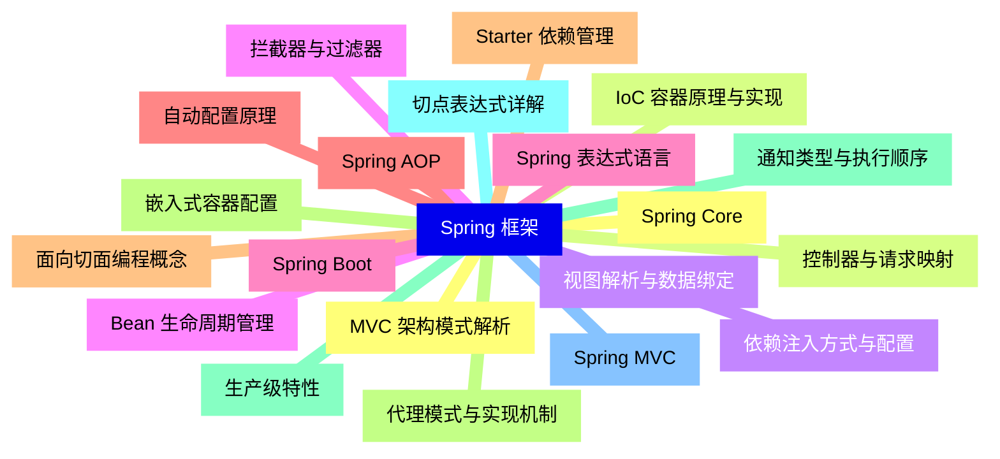
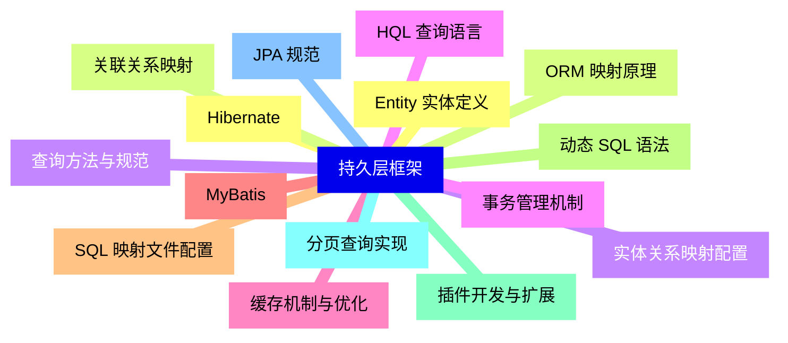
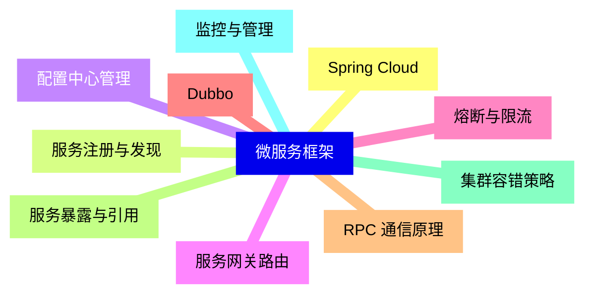
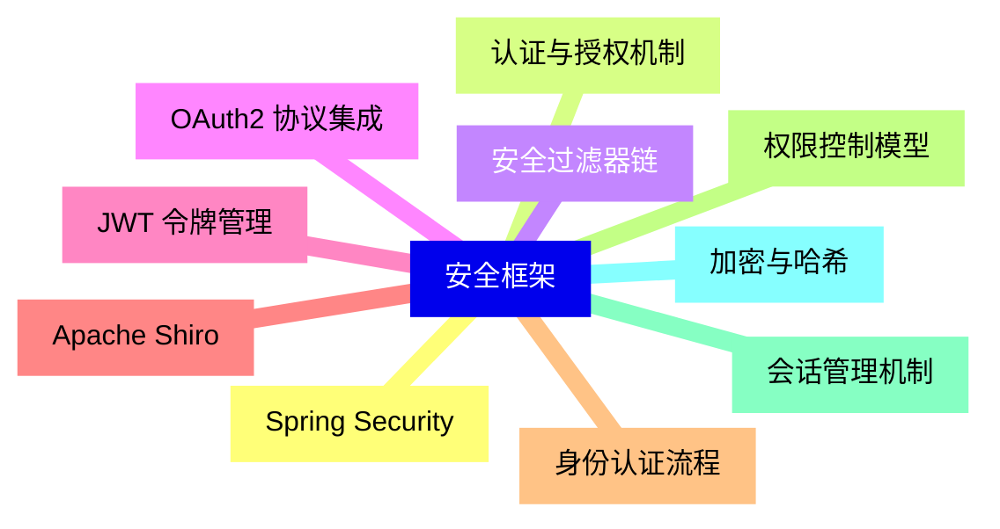
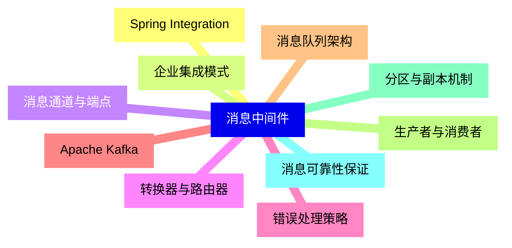
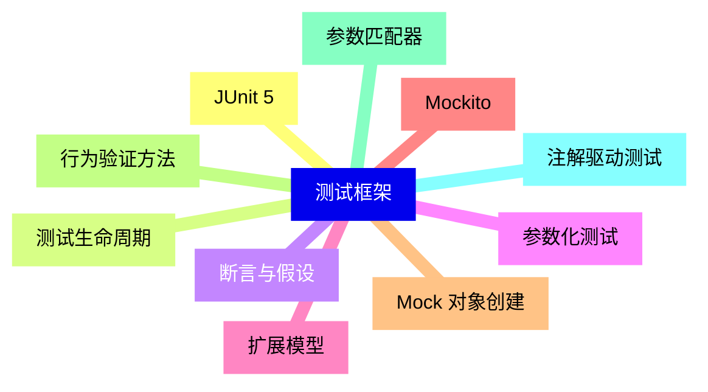
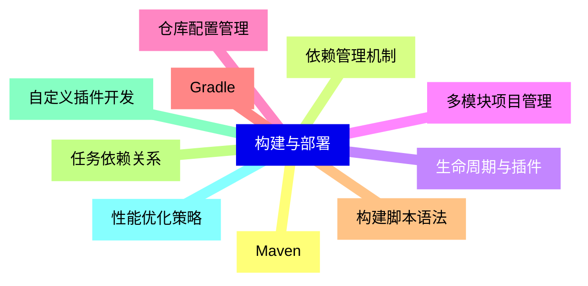
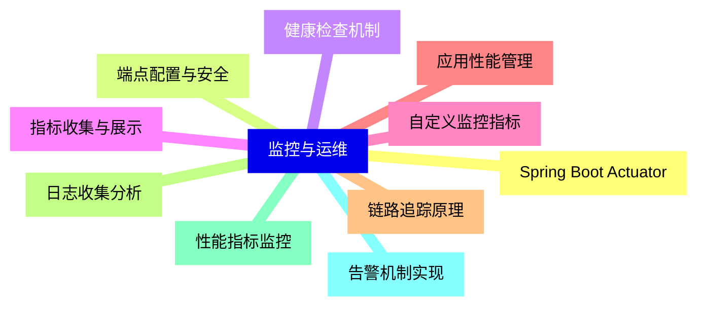


### 1 [Spring 框架](#1)
#### 1.1 [Spring Core](#1)
#### 1.2 [IoC 容器原理与实现](#1)
#### 1.3 [依赖注入方式与配置](#1)
#### 1.4 [Bean 生命周期管理](#1)
#### 1.5 [Spring 表达式语言](#1)
#### 1.6 [Spring AOP](#1)
#### 1.7 [面向切面编程概念](#1)
#### 1.8 [代理模式与实现机制](#1)
#### 1.9 [通知类型与执行顺序](#1)
#### 1.10 [切点表达式详解](#1)
#### 1.11 [Spring MVC](#1)
#### 1.12 [MVC 架构模式解析](#1)
#### 1.13 [控制器与请求映射](#1)
#### 1.14 [视图解析与数据绑定](#1)
#### 1.15 [拦截器与过滤器](#1)
#### 1.16 [Spring Boot](#1)
#### 1.17 [自动配置原理](#1)
#### 1.18 [Starter 依赖管理](#1)
#### 1.19 [嵌入式容器配置](#1)
#### 1.20 [生产级特性](#1)
### 2 [持久层框架](#2)
#### 2.1 [Hibernate](#2)
#### 2.2 [ORM 映射原理](#2)
#### 2.3 [实体关系映射配置](#2)
#### 2.4 [HQL 查询语言](#2)
#### 2.5 [缓存机制与优化](#2)
#### 2.6 [MyBatis](#2)
#### 2.7 [SQL 映射文件配置](#2)
#### 2.8 [动态 SQL 语法](#2)
#### 2.9 [插件开发与扩展](#2)
#### 2.10 [分页查询实现](#2)
#### 2.11 [JPA 规范](#2)
#### 2.12 [Entity 实体定义](#2)
#### 2.13 [关联关系映射](#2)
#### 2.14 [查询方法与规范](#2)
#### 2.15 [事务管理机制](#2)
### 3 [微服务框架](#3)
#### 3.1 [Spring Cloud](#3)
#### 3.2 [服务注册与发现](#3)
#### 3.3 [配置中心管理](#3)
#### 3.4 [服务网关路由](#3)
#### 3.5 [熔断与限流](#3)
#### 3.6 [Dubbo](#3)
#### 3.7 [RPC 通信原理](#3)
#### 3.8 [服务暴露与引用](#3)
#### 3.9 [集群容错策略](#3)
#### 3.10 [监控与管理](#3)
### 4 [安全框架](#4)
#### 4.1 [Spring Security](#4)
#### 4.2 [认证与授权机制](#4)
#### 4.3 [安全过滤器链](#4)
#### 4.4 [OAuth2 协议集成](#4)
#### 4.5 [JWT 令牌管理](#4)
#### 4.6 [Apache Shiro](#4)
#### 4.7 [身份认证流程](#4)
#### 4.8 [权限控制模型](#4)
#### 4.9 [会话管理机制](#4)
#### 4.10 [加密与哈希](#4)
### 5 [消息中间件](#5)
#### 5.1 [Spring Integration](#5)
#### 5.2 [企业集成模式](#5)
#### 5.3 [消息通道与端点](#5)
#### 5.4 [转换器与路由器](#5)
#### 5.5 [错误处理策略](#5)
#### 5.6 [Apache Kafka](#5)
#### 5.7 [消息队列架构](#5)
#### 5.8 [生产者与消费者](#5)
#### 5.9 [分区与副本机制](#5)
#### 5.10 [消息可靠性保证](#5)
### 6 [测试框架](#6)
#### 6.1 [JUnit 5](#6)
#### 6.2 [测试生命周期](#6)
#### 6.3 [断言与假设](#6)
#### 6.4 [参数化测试](#6)
#### 6.5 [扩展模型](#6)
#### 6.6 [Mockito](#6)
#### 6.7 [Mock 对象创建](#6)
#### 6.8 [行为验证方法](#6)
#### 6.9 [参数匹配器](#6)
#### 6.10 [注解驱动测试](#6)
### 7 [构建与部署](#7)
#### 7.1 [Maven](#7)
#### 7.2 [依赖管理机制](#7)
#### 7.3 [生命周期与插件](#7)
#### 7.4 [多模块项目管理](#7)
#### 7.5 [仓库配置管理](#7)
#### 7.6 [Gradle](#7)
#### 7.7 [构建脚本语法](#7)
#### 7.8 [任务依赖关系](#7)
#### 7.9 [自定义插件开发](#7)
#### 7.10 [性能优化策略](#7)
### 8 [监控与运维](#8)
#### 8.1 [Spring Boot Actuator](#8)
#### 8.2 [端点配置与安全](#8)
#### 8.3 [健康检查机制](#8)
#### 8.4 [指标收集与展示](#8)
#### 8.5 [自定义监控指标](#8)
#### 8.6 [应用性能管理](#8)
#### 8.7 [链路追踪原理](#8)
#### 8.8 [日志收集分析](#8)
#### 8.9 [性能指标监控](#8)
#### 8.10 [告警机制实现](#8)




### 1 Spring 框架

---
### 1 Spring 框架
___
#### 1.1 Spring Core
___
#### 1.2 IoC 容器原理与实现
___
#### 1.3 依赖注入方式与配置
___
#### 1.4 Bean 生命周期管理
___
#### 1.5 Spring 表达式语言
___
#### 1.6 Spring AOP
___
#### 1.7 面向切面编程概念
___
#### 1.8 代理模式与实现机制
___
#### 1.9 通知类型与执行顺序
___
#### 1.10 切点表达式详解
___
#### 1.11 Spring MVC
___
#### 1.12 MVC 架构模式解析
___
#### 1.13 控制器与请求映射
___
#### 1.14 视图解析与数据绑定
___
#### 1.15 拦截器与过滤器
___
#### 1.16 Spring Boot
___
#### 1.17 自动配置原理
___
#### 1.18 Starter 依赖管理
___
#### 1.19 嵌入式容器配置
___
#### 1.20 生产级特性
### 2 持久层框架

---
### 2 持久层框架
___
#### 2.1 Hibernate
___
#### 2.2 ORM 映射原理
___
#### 2.3 实体关系映射配置
___
#### 2.4 HQL 查询语言
___
#### 2.5 缓存机制与优化
___
#### 2.6 MyBatis
___
#### 2.7 SQL 映射文件配置
___
#### 2.8 动态 SQL 语法
___
#### 2.9 插件开发与扩展
___
#### 2.10 分页查询实现
___
#### 2.11 JPA 规范
___
#### 2.12 Entity 实体定义
___
#### 2.13 关联关系映射
___
#### 2.14 查询方法与规范
___
#### 2.15 事务管理机制
### 3 微服务框架

---
### 3 微服务框架
___
#### 3.1 Spring Cloud
___
#### 3.2 服务注册与发现
___
#### 3.3 配置中心管理
___
#### 3.4 服务网关路由
___
#### 3.5 熔断与限流
___
#### 3.6 Dubbo
___
#### 3.7 RPC 通信原理
___
#### 3.8 服务暴露与引用
___
#### 3.9 集群容错策略
___
#### 3.10 监控与管理
### 4 安全框架

---
### 4 安全框架
___
#### 4.1 Spring Security
___
#### 4.2 认证与授权机制
___
#### 4.3 安全过滤器链
___
#### 4.4 OAuth2 协议集成
___
#### 4.5 JWT 令牌管理
___
#### 4.6 Apache Shiro
___
#### 4.7 身份认证流程
___
#### 4.8 权限控制模型
___
#### 4.9 会话管理机制
___
#### 4.10 加密与哈希
### 5 消息中间件

---
### 5 消息中间件
___
#### 5.1 Spring Integration
___
#### 5.2 企业集成模式
___
#### 5.3 消息通道与端点
___
#### 5.4 转换器与路由器
___
#### 5.5 错误处理策略
___
#### 5.6 Apache Kafka
___
#### 5.7 消息队列架构
___
#### 5.8 生产者与消费者
___
#### 5.9 分区与副本机制
___
#### 5.10 消息可靠性保证
### 6 测试框架

---
### 6 测试框架
___
#### 6.1 JUnit 5
___
#### 6.2 测试生命周期
___
#### 6.3 断言与假设
___
#### 6.4 参数化测试
___
#### 6.5 扩展模型
___
#### 6.6 Mockito
___
#### 6.7 Mock 对象创建
___
#### 6.8 行为验证方法
___
#### 6.9 参数匹配器
___
#### 6.10 注解驱动测试
### 7 构建与部署

---
### 7 构建与部署
___
#### 7.1 Maven
___
#### 7.2 依赖管理机制
___
#### 7.3 生命周期与插件
___
#### 7.4 多模块项目管理
___
#### 7.5 仓库配置管理
___
#### 7.6 Gradle
___
#### 7.7 构建脚本语法
___
#### 7.8 任务依赖关系
___
#### 7.9 自定义插件开发
___
#### 7.10 性能优化策略
### 8 监控与运维

---
### 8 监控与运维
___
#### 8.1 Spring Boot Actuator
___
#### 8.2 端点配置与安全
___
#### 8.3 健康检查机制
___
#### 8.4 指标收集与展示
___
#### 8.5 自定义监控指标
___
#### 8.6 应用性能管理
___
#### 8.7 链路追踪原理
___
#### 8.8 日志收集分析
___
#### 8.9 性能指标监控
___
#### 8.10 告警机制实现


### 1 Spring 框架{#1}

{}

<--->
{}
{}
{}
{}
{}
{}
{}
{}
{}
{}
{}
{}
{}
{}
{}
{}
{}
{}
{}
{}
{}
{}
{}
{}
{}
{}
{}
{}
{}
{}
{}
{}
{}
{}
{}
{}
{}
{}
{}
{}
{}

### 2 持久层框架{#2}

{}
{}
{}
{}
{}
{}
{}
{}
{}
{}
{}
{}
{}
{}
{}
{}
{}
{}
{}
{}
{}
{}
{}
{}
{}
{}
{}
{}
{}
{}
{}
<--->

{}

### 3 微服务框架{#3}

{}

<--->
{}
{}
{}
{}
{}
{}
{}
{}
{}
{}
{}
{}
{}
{}
{}
{}
{}
{}
{}
{}
{}

### 4 安全框架{#4}

{}
{}
{}
{}
{}
{}
{}
{}
{}
{}
{}
{}
{}
{}
{}
{}
{}
{}
{}
{}
{}
<--->

{}

### 5 消息中间件{#5}

{}

<--->
{}
{}
{}
{}
{}
{}
{}
{}
{}
{}
{}
{}
{}
{}
{}
{}
{}
{}
{}
{}
{}

### 6 测试框架{#6}

{}
{}
{}
{}
{}
{}
{}
{}
{}
{}
{}
{}
{}
{}
{}
{}
{}
{}
{}
{}
{}
<--->

{}

### 7 构建与部署{#7}

{}

<--->
{}
{}
{}
{}
{}
{}
{}
{}
{}
{}
{}
{}
{}
{}
{}
{}
{}
{}
{}
{}
{}

### 8 监控与运维{#8}

{}
{}
{}
{}
{}
{}
{}
{}
{}
{}
{}
{}
{}
{}
{}
{}
{}
{}
{}
{}
{}
<--->

{}
