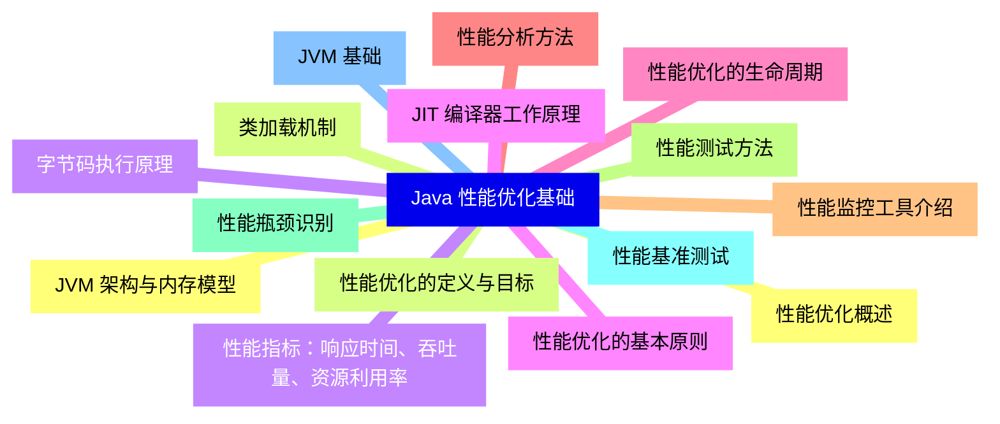
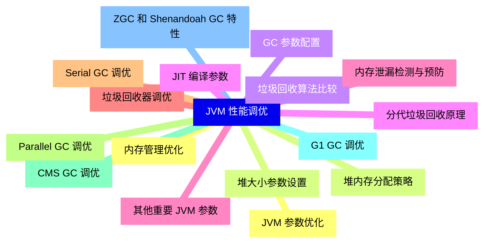
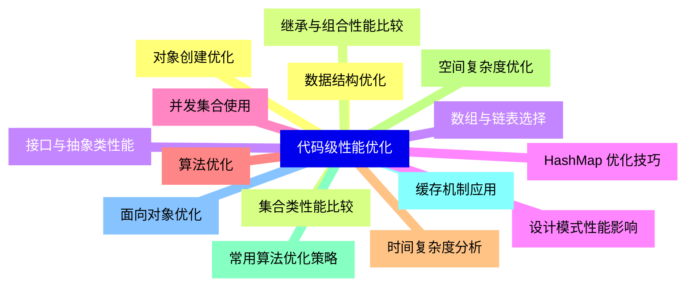
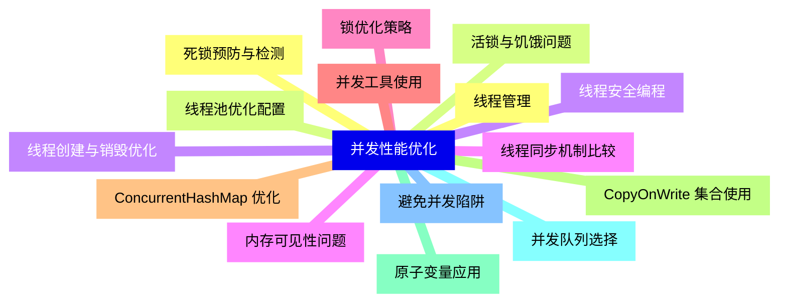
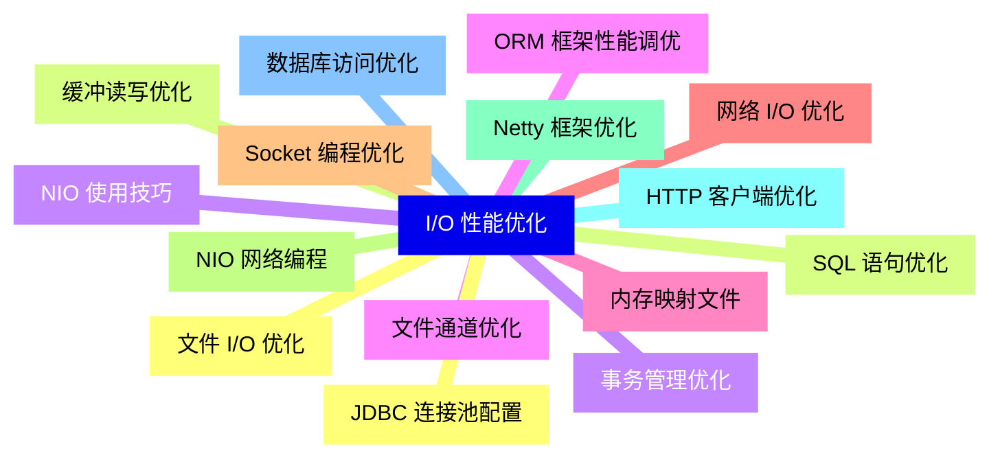
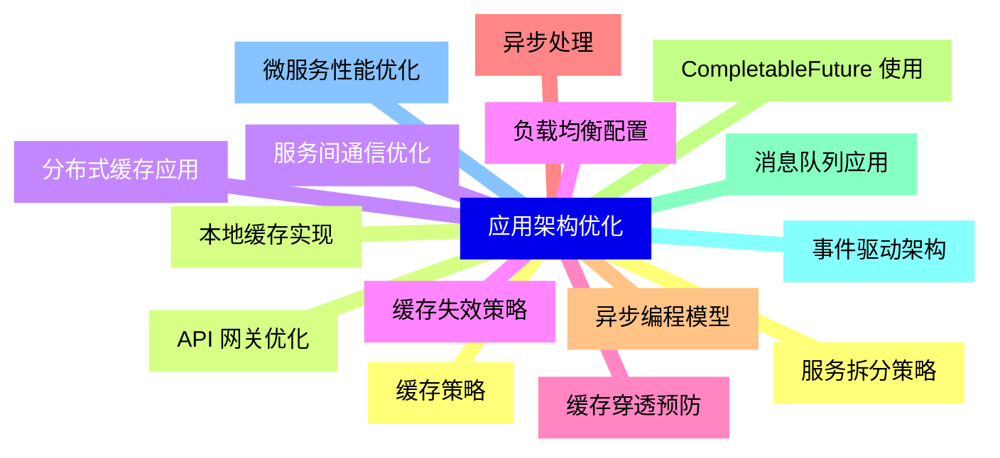
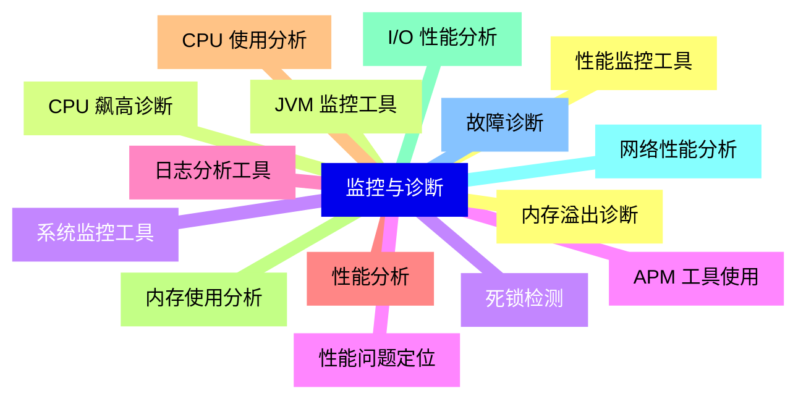
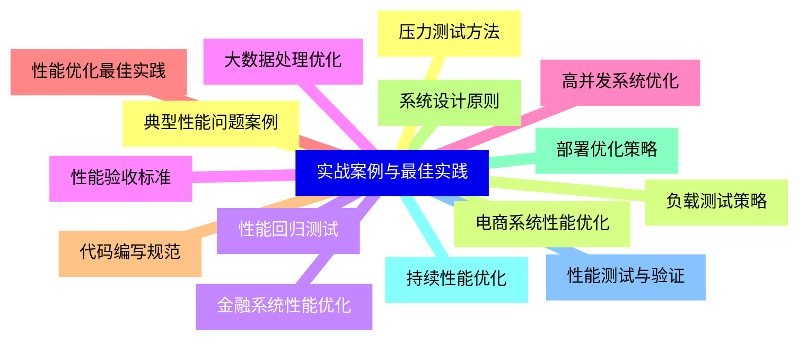


### 1 [Java 性能优化基础](#1)
#### 1.1 [性能优化概述](#1)
#### 1.2 [性能优化的定义与目标](#1)
#### 1.3 [性能指标：响应时间、吞吐量、资源利用率](#1)
#### 1.4 [性能优化的基本原则](#1)
#### 1.5 [性能优化的生命周期](#1)
#### 1.6 [性能分析方法](#1)
#### 1.7 [性能监控工具介绍](#1)
#### 1.8 [性能测试方法](#1)
#### 1.9 [性能瓶颈识别](#1)
#### 1.10 [性能基准测试](#1)
#### 1.11 [JVM 基础](#1)
#### 1.12 [JVM 架构与内存模型](#1)
#### 1.13 [类加载机制](#1)
#### 1.14 [字节码执行原理](#1)
#### 1.15 [JIT 编译器工作原理](#1)
### 2 [JVM 性能调优](#2)
#### 2.1 [内存管理优化](#2)
#### 2.2 [堆内存分配策略](#2)
#### 2.3 [垃圾回收算法比较](#2)
#### 2.4 [分代垃圾回收原理](#2)
#### 2.5 [内存泄漏检测与预防](#2)
#### 2.6 [垃圾回收器调优](#2)
#### 2.7 [Serial GC 调优](#2)
#### 2.8 [Parallel GC 调优](#2)
#### 2.9 [CMS GC 调优](#2)
#### 2.10 [G1 GC 调优](#2)
#### 2.11 [ZGC 和 Shenandoah GC 特性](#2)
#### 2.12 [JVM 参数优化](#2)
#### 2.13 [堆大小参数设置](#2)
#### 2.14 [GC 参数配置](#2)
#### 2.15 [JIT 编译参数](#2)
#### 2.16 [其他重要 JVM 参数](#2)
### 3 [代码级性能优化](#3)
#### 3.1 [数据结构优化](#3)
#### 3.2 [集合类性能比较](#3)
#### 3.3 [数组与链表选择](#3)
#### 3.4 [HashMap 优化技巧](#3)
#### 3.5 [并发集合使用](#3)
#### 3.6 [算法优化](#3)
#### 3.7 [时间复杂度分析](#3)
#### 3.8 [空间复杂度优化](#3)
#### 3.9 [常用算法优化策略](#3)
#### 3.10 [缓存机制应用](#3)
#### 3.11 [面向对象优化](#3)
#### 3.12 [对象创建优化](#3)
#### 3.13 [继承与组合性能比较](#3)
#### 3.14 [接口与抽象类性能](#3)
#### 3.15 [设计模式性能影响](#3)
### 4 [并发性能优化](#4)
#### 4.1 [线程管理](#4)
#### 4.2 [线程池优化配置](#4)
#### 4.3 [线程创建与销毁优化](#4)
#### 4.4 [线程同步机制比较](#4)
#### 4.5 [锁优化策略](#4)
#### 4.6 [并发工具使用](#4)
#### 4.7 [ConcurrentHashMap 优化](#4)
#### 4.8 [CopyOnWrite 集合使用](#4)
#### 4.9 [原子变量应用](#4)
#### 4.10 [并发队列选择](#4)
#### 4.11 [避免并发陷阱](#4)
#### 4.12 [死锁预防与检测](#4)
#### 4.13 [活锁与饥饿问题](#4)
#### 4.14 [线程安全编程](#4)
#### 4.15 [内存可见性问题](#4)
### 5 [I/O 性能优化](#5)
#### 5.1 [文件 I/O 优化](#5)
#### 5.2 [缓冲读写优化](#5)
#### 5.3 [NIO 使用技巧](#5)
#### 5.4 [文件通道优化](#5)
#### 5.5 [内存映射文件](#5)
#### 5.6 [网络 I/O 优化](#5)
#### 5.7 [Socket 编程优化](#5)
#### 5.8 [NIO 网络编程](#5)
#### 5.9 [Netty 框架优化](#5)
#### 5.10 [HTTP 客户端优化](#5)
#### 5.11 [数据库访问优化](#5)
#### 5.12 [JDBC 连接池配置](#5)
#### 5.13 [SQL 语句优化](#5)
#### 5.14 [事务管理优化](#5)
#### 5.15 [ORM 框架性能调优](#5)
### 6 [应用架构优化](#6)
#### 6.1 [缓存策略](#6)
#### 6.2 [本地缓存实现](#6)
#### 6.3 [分布式缓存应用](#6)
#### 6.4 [缓存失效策略](#6)
#### 6.5 [缓存穿透预防](#6)
#### 6.6 [异步处理](#6)
#### 6.7 [异步编程模型](#6)
#### 6.8 [CompletableFuture 使用](#6)
#### 6.9 [消息队列应用](#6)
#### 6.10 [事件驱动架构](#6)
#### 6.11 [微服务性能优化](#6)
#### 6.12 [服务拆分策略](#6)
#### 6.13 [API 网关优化](#6)
#### 6.14 [服务间通信优化](#6)
#### 6.15 [负载均衡配置](#6)
### 7 [监控与诊断](#7)
#### 7.1 [性能监控工具](#7)
#### 7.2 [JVM 监控工具](#7)
#### 7.3 [系统监控工具](#7)
#### 7.4 [APM 工具使用](#7)
#### 7.5 [日志分析工具](#7)
#### 7.6 [性能分析](#7)
#### 7.7 [CPU 使用分析](#7)
#### 7.8 [内存使用分析](#7)
#### 7.9 [I/O 性能分析](#7)
#### 7.10 [网络性能分析](#7)
#### 7.11 [故障诊断](#7)
#### 7.12 [内存溢出诊断](#7)
#### 7.13 [CPU 飙高诊断](#7)
#### 7.14 [死锁检测](#7)
#### 7.15 [性能问题定位](#7)
### 8 [实战案例与最佳实践](#8)
#### 8.1 [典型性能问题案例](#8)
#### 8.2 [电商系统性能优化](#8)
#### 8.3 [金融系统性能优化](#8)
#### 8.4 [大数据处理优化](#8)
#### 8.5 [高并发系统优化](#8)
#### 8.6 [性能优化最佳实践](#8)
#### 8.7 [代码编写规范](#8)
#### 8.8 [系统设计原则](#8)
#### 8.9 [部署优化策略](#8)
#### 8.10 [持续性能优化](#8)
#### 8.11 [性能测试与验证](#8)
#### 8.12 [压力测试方法](#8)
#### 8.13 [负载测试策略](#8)
#### 8.14 [性能回归测试](#8)
#### 8.15 [性能验收标准](#8)




### 1 Java 性能优化基础

---
### 1 Java 性能优化基础
___
#### 1.1 性能优化概述
___
#### 1.2 性能优化的定义与目标
___
#### 1.3 性能指标：响应时间、吞吐量、资源利用率
___
#### 1.4 性能优化的基本原则
___
#### 1.5 性能优化的生命周期
___
#### 1.6 性能分析方法
___
#### 1.7 性能监控工具介绍
___
#### 1.8 性能测试方法
___
#### 1.9 性能瓶颈识别
___
#### 1.10 性能基准测试
___
#### 1.11 JVM 基础
___
#### 1.12 JVM 架构与内存模型
___
#### 1.13 类加载机制
___
#### 1.14 字节码执行原理
___
#### 1.15 JIT 编译器工作原理
### 2 JVM 性能调优

---
### 2 JVM 性能调优
___
#### 2.1 内存管理优化
___
#### 2.2 堆内存分配策略
___
#### 2.3 垃圾回收算法比较
___
#### 2.4 分代垃圾回收原理
___
#### 2.5 内存泄漏检测与预防
___
#### 2.6 垃圾回收器调优
___
#### 2.7 Serial GC 调优
___
#### 2.8 Parallel GC 调优
___
#### 2.9 CMS GC 调优
___
#### 2.10 G1 GC 调优
___
#### 2.11 ZGC 和 Shenandoah GC 特性
___
#### 2.12 JVM 参数优化
___
#### 2.13 堆大小参数设置
___
#### 2.14 GC 参数配置
___
#### 2.15 JIT 编译参数
___
#### 2.16 其他重要 JVM 参数
### 3 代码级性能优化

---
### 3 代码级性能优化
___
#### 3.1 数据结构优化
___
#### 3.2 集合类性能比较
___
#### 3.3 数组与链表选择
___
#### 3.4 HashMap 优化技巧
___
#### 3.5 并发集合使用
___
#### 3.6 算法优化
___
#### 3.7 时间复杂度分析
___
#### 3.8 空间复杂度优化
___
#### 3.9 常用算法优化策略
___
#### 3.10 缓存机制应用
___
#### 3.11 面向对象优化
___
#### 3.12 对象创建优化
___
#### 3.13 继承与组合性能比较
___
#### 3.14 接口与抽象类性能
___
#### 3.15 设计模式性能影响
### 4 并发性能优化

---
### 4 并发性能优化
___
#### 4.1 线程管理
___
#### 4.2 线程池优化配置
___
#### 4.3 线程创建与销毁优化
___
#### 4.4 线程同步机制比较
___
#### 4.5 锁优化策略
___
#### 4.6 并发工具使用
___
#### 4.7 ConcurrentHashMap 优化
___
#### 4.8 CopyOnWrite 集合使用
___
#### 4.9 原子变量应用
___
#### 4.10 并发队列选择
___
#### 4.11 避免并发陷阱
___
#### 4.12 死锁预防与检测
___
#### 4.13 活锁与饥饿问题
___
#### 4.14 线程安全编程
___
#### 4.15 内存可见性问题
### 5 I/O 性能优化

---
### 5 I/O 性能优化
___
#### 5.1 文件 I/O 优化
___
#### 5.2 缓冲读写优化
___
#### 5.3 NIO 使用技巧
___
#### 5.4 文件通道优化
___
#### 5.5 内存映射文件
___
#### 5.6 网络 I/O 优化
___
#### 5.7 Socket 编程优化
___
#### 5.8 NIO 网络编程
___
#### 5.9 Netty 框架优化
___
#### 5.10 HTTP 客户端优化
___
#### 5.11 数据库访问优化
___
#### 5.12 JDBC 连接池配置
___
#### 5.13 SQL 语句优化
___
#### 5.14 事务管理优化
___
#### 5.15 ORM 框架性能调优
### 6 应用架构优化

---
### 6 应用架构优化
___
#### 6.1 缓存策略
___
#### 6.2 本地缓存实现
___
#### 6.3 分布式缓存应用
___
#### 6.4 缓存失效策略
___
#### 6.5 缓存穿透预防
___
#### 6.6 异步处理
___
#### 6.7 异步编程模型
___
#### 6.8 CompletableFuture 使用
___
#### 6.9 消息队列应用
___
#### 6.10 事件驱动架构
___
#### 6.11 微服务性能优化
___
#### 6.12 服务拆分策略
___
#### 6.13 API 网关优化
___
#### 6.14 服务间通信优化
___
#### 6.15 负载均衡配置
### 7 监控与诊断

---
### 7 监控与诊断
___
#### 7.1 性能监控工具
___
#### 7.2 JVM 监控工具
___
#### 7.3 系统监控工具
___
#### 7.4 APM 工具使用
___
#### 7.5 日志分析工具
___
#### 7.6 性能分析
___
#### 7.7 CPU 使用分析
___
#### 7.8 内存使用分析
___
#### 7.9 I/O 性能分析
___
#### 7.10 网络性能分析
___
#### 7.11 故障诊断
___
#### 7.12 内存溢出诊断
___
#### 7.13 CPU 飙高诊断
___
#### 7.14 死锁检测
___
#### 7.15 性能问题定位
### 8 实战案例与最佳实践

---
### 8 实战案例与最佳实践
___
#### 8.1 典型性能问题案例
___
#### 8.2 电商系统性能优化
___
#### 8.3 金融系统性能优化
___
#### 8.4 大数据处理优化
___
#### 8.5 高并发系统优化
___
#### 8.6 性能优化最佳实践
___
#### 8.7 代码编写规范
___
#### 8.8 系统设计原则
___
#### 8.9 部署优化策略
___
#### 8.10 持续性能优化
___
#### 8.11 性能测试与验证
___
#### 8.12 压力测试方法
___
#### 8.13 负载测试策略
___
#### 8.14 性能回归测试
___
#### 8.15 性能验收标准


### 1 Java 性能优化基础{#1}

{}

<--->
{}
{}
{}
{}
{}
{}
{}
{}
{}
{}
{}
{}
{}
{}
{}
{}
{}
{}
{}
{}
{}
{}
{}
{}
{}
{}
{}
{}
{}
{}
{}

### 2 JVM 性能调优{#2}

{}
{}
{}
{}
{}
{}
{}
{}
{}
{}
{}
{}
{}
{}
{}
{}
{}
{}
{}
{}
{}
{}
{}
{}
{}
{}
{}
{}
{}
{}
{}
{}
{}
<--->

{}

### 3 代码级性能优化{#3}

{}

<--->
{}
{}
{}
{}
{}
{}
{}
{}
{}
{}
{}
{}
{}
{}
{}
{}
{}
{}
{}
{}
{}
{}
{}
{}
{}
{}
{}
{}
{}
{}
{}

### 4 并发性能优化{#4}

{}
{}
{}
{}
{}
{}
{}
{}
{}
{}
{}
{}
{}
{}
{}
{}
{}
{}
{}
{}
{}
{}
{}
{}
{}
{}
{}
{}
{}
{}
{}
<--->

{}

### 5 I/O 性能优化{#5}

{}

<--->
{}
{}
{}
{}
{}
{}
{}
{}
{}
{}
{}
{}
{}
{}
{}
{}
{}
{}
{}
{}
{}
{}
{}
{}
{}
{}
{}
{}
{}
{}
{}

### 6 应用架构优化{#6}

{}
{}
{}
{}
{}
{}
{}
{}
{}
{}
{}
{}
{}
{}
{}
{}
{}
{}
{}
{}
{}
{}
{}
{}
{}
{}
{}
{}
{}
{}
{}
<--->

{}

### 7 监控与诊断{#7}

{}

<--->
{}
{}
{}
{}
{}
{}
{}
{}
{}
{}
{}
{}
{}
{}
{}
{}
{}
{}
{}
{}
{}
{}
{}
{}
{}
{}
{}
{}
{}
{}
{}

### 8 实战案例与最佳实践{#8}

{}
{}
{}
{}
{}
{}
{}
{}
{}
{}
{}
{}
{}
{}
{}
{}
{}
{}
{}
{}
{}
{}
{}
{}
{}
{}
{}
{}
{}
{}
{}
<--->

{}
